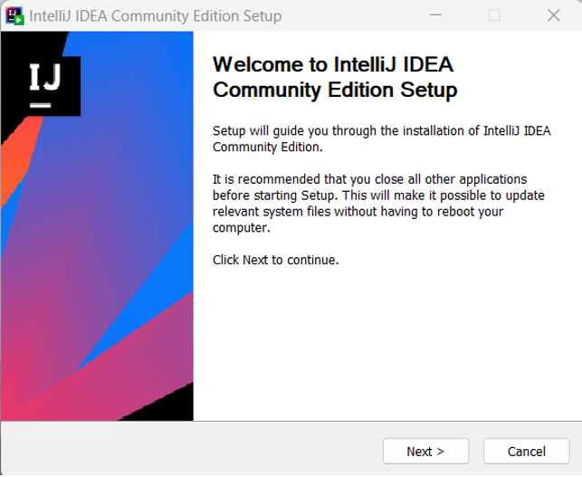
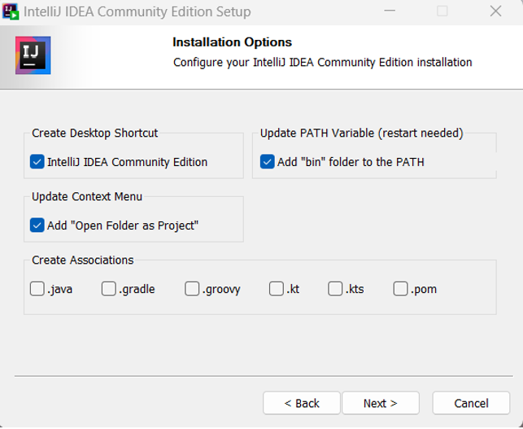
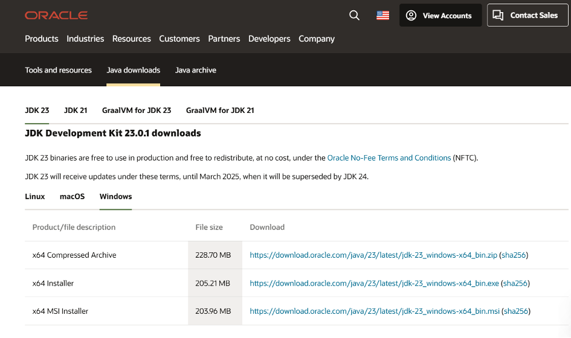
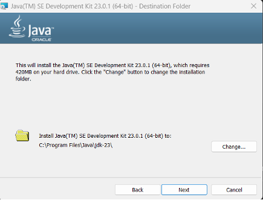

قدم اول برای درس برنامه‌نویسی پیشرفته با زبان جاوا، آماده کردن شرایط کافی برای برنامه‌نویسی با این زبان است که شامل نصب پکیج کامل زبان جاوا (کیت توسعه جاوا) و همچنین یک محیط توسعه  می‌باشد. در این دستور کار منابعی برای آموزش دانلود و نصب Java JDK و IntelliJ IDEA قرار گرفته است. IntelliJ IDEA یک محیط توسعه یکپارچه برای زبان جاوا و محصول شرکت JetBrains است. این IDE یکی از قدرتمندترین‌ها برای زبان جاوا است که ویژگی‌ها و امکانات گوناگونی دارد. پیشنهاد می‌شود که همگی از همین IDE استفاده کنید. 

# آموزش نصب IntelliJ و JDK در ویندوز

## دانلود و نصب IntelliJ در ویندوز

ابتدا به [صفحه رسمی معرفی اینتلیجی](https://www.jetbrains.com/idea/) مراجعه کنید، سپس در صفحه‌ی زیر بر روی گزینه‌ی Download سفید رنگ بزنید.


در صفحه زیر گزینه ویندوز را انتخاب کنید.


صفحه را به پایین اسکرول کنید و مطابق تصویر زیر، نسخه کامیونیتی را دانلود کنید.


پس از اتمام دانلود، بر روی فایل کلیک کنید تا پنجره‌ی زیر باز شود. سپس گزینه Next را بزنید.



در صفحه‌ی زیر مسیر نصب را مشخص کنید و بر روی گزینه Next ضربه بزنید.


در صفحه بعدی نیز برخی آپشن‌ها نظیر ایجاد شورت‌کات از شما سوال شده است. همه‌ی این آپشن‌ها بعد از نصب برنامه نیز قابل افزودن هستند. بعد از انتخاب گزینه‌های مدنظر خود، Next را بزنید.



در صفحه‌ی زیر نیاز به تغییر وجود ندارد. گزینه‌ی Install را بزنید.


پس از پایان فرآیند Installation، در صفحه‌ی زیر بدون نیاز به تغییر، گزینه‌ی Finish را بزنید. اکنون برنامه نصب شده و قابل اجرا می‌باشد.


## دانلود و نصب (JDK (Java Development Kit در ویندوز

ابتدا به [این آدرس](https://www.oracle.com/java/technologies/downloads) مراجعه کنید. در صفحه‌ی زیر بر روی گزینه‌ی JDK23  بزنید و Windows را انتخاب کنید. در نهایت بر روی لینک مقابل گزینه x64 MSI installer کلیک کنید تا دانلود آغاز شود. 



پس از اجرای فایل دانلود شده، با پنجره‌ای مشابه تصویر زیر روبه‌رو می‌شوید. در این صفحه بر روی گزینه‌ی Next کلیک کنید، در صفحه بعدی مسیر نصب را مشخص کنید و مجدداً بر روی گزینه Next ضربه بزنید.





پس از پایان فرآیند Installation، در صفحه‌ی آخر گزینه‌ی Close را بزنید. اکنون نصب به پایان رسیده است. می‌توانید با اجرای دستور زیر در command line از نصب شدن جاوا مطمئن شوید و نسخه نصب‌شده را مشاهده کنید.

```bash
java --version
```

