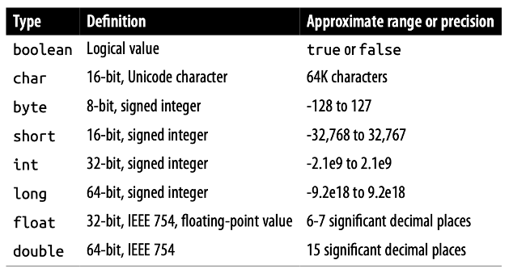
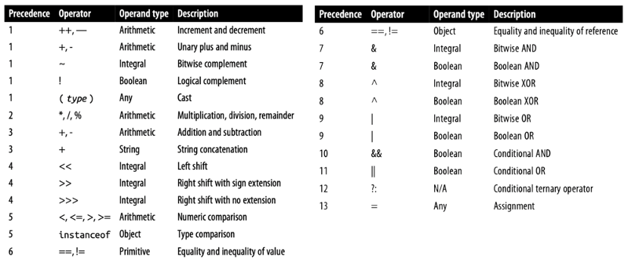

این داکیومنت برای آشنایی اولیه با syntax زبان جاوا طراحی شده. قراره کمی باهاش کدنویسی کنیم و مفاهیم پایه‌ای رو یاد بگیریم. ممکنه موقع کار با جاوا، یاد زبان‌هایی مثل C یا C++ بیفتید، و این طبیعی هست چون syntax این زبان‌ها شباهت زیادی به هم دارن. بسیاری از کارهایی که اینجا انجام می‌دیم، شبیه چیزی هست که ممکنه قبلاً در C تجربه کرده باشید.

لپ‌تاپ‌هاتون رو آماده کنید، ادیتورهاتون رو باز کنید و قدم به قدم با ما پیش بیاید تا اولین تجربهٔ برنامه‌نویسی با جاوا رو کسب کنید. اگر جایی از این داکیومنت براتون گنگ بود، حتماً سرچ کنید، از دستیارهای آموزشی بپرسید یا از ChatGPT کمک بخواید تا براتون توضیح بده.

توجه کنید که این داکیومنت، برای دست به کد شدن شماست. بعضی از کلیدواژه‌های جاوا مثل `public‏`، `static‏`، `class` و غیره این‌جا توضیح داده نمی‌شن و طبیعیه که نسبت بهشون یه خورده گیج باشین. نگران نباشین! اون‌ها رو توی جلسات بعدی بهتون توضیح می‌دیم. تا اون موقع، اگر دوست داشتید می‌تونید از ما راجع بهشون بپرسین یا توی اینترنت در موردشون بخونین.

# نترسید و چیزهای مختلف رو امتحان کنید!

قبل از شروع داکیومنت، خوبه که این رو بدونید که شما قراره خراب‌کاری‌های زیادی توی کدهای اول‌تون بکنید! چیز‌های مختلف رو امتحان می‌کنین، خطاهایی می‌خورید که هیچ ایده‌ای ندارین از کجا اومدن یا حتی اگر می‌دونین از کجان، نمی‌دونین چجوری باید از شرشون خلاص بشین.

نترسید! کدها رو بشکونید! این خطاها و مشکلات، بخشی از فرآیند یادگیری شما هستن. راجع بهشون اول توی اینترنت سرچ کنید، اگر نشد، از ChatGPT بخواین براتون توضیح بده و اگر حتی اون هم نشد، از تدریس‌یارتون بپرسید.

چیزهای جدید رو امتحان کنید، توی کدهای مختلف فضولی کنین و اگر هم چیز خوب و جدیدی پیدا کردین، با باقی به اشتراکش بذارین. فوقش اینه که به خطا می‌خورین و با ما رفعش می‌کنین.

# اولین برنامه

برای درست کردن اولین برنامهٔ جاواتون، IntelliJ رو باز کنید و از مسیر زیر، اولین پروژه‌تون رو ایجاد کنید:


یه صفحه مثل تصویر زیر براتون باز می‌شه. اسم پروژه‌تون رو انتخاب کنید، مطمئن بشید مسیر ذخیره‌سازی درسته و حتماً چک کنید که همون JDKی که قبلاً دانلود کردید، انتخاب شده باشه. من خودم نسخهٔ 23.0.1 رو نصب کردم و برای این پروژه هم از همین نسخه استفاده کردم:


با این کار، اولین پروژهٔ جاوای شما درست می‌شه! همچین صفحه‌ای رو باید ببینین:


این، اولین برنامهٔ شماست. با زدن اون دکمهٔ مثلثی شکل بالای صفحه، برنامه رو run کنید. اگر درست compile و run شد، باید خروجی‌ای مشابه این ببینید:


تبریک! اولین برنامهٔ جاواتون رو اجرا کردین!

## کدی که اجرا کردیم

بیاین ببینیم این کد که اجرا شد، چی بود. منطقا باید چنین کدی روی صفحهٔ ادیتورتون باشه (اگر نبود، لطفا این کد رو کپی و پیست کنید و دوباره برنامه رو اجرا کنید.):

```java
public class Main {
    public static void main(String[] args) {
        System.out.println("Hello, World!");
    }
}
```

توی این کد، یک کلاس به اسم `Main` می‌بینید که داخلش یه تابع به اسم `main` قرار داره. بعداً بهتون یاد می‌دیم که کلاس چی هست، `public` چه معنی‌ای داره و چطور می‌تونید کلاس‌های خودتون رو بسازید. ولی فعلاً، تمام توابع و کدهایی که می‌نویسید، توی همین کلاس `Main` قرار می‌گیره و نیازی نیست الان درگیر یادگیری مباحث مربوط به کلاس‌ها بشید.

```java
public class Main {
    // Your code here
}
```

داخل این class، یه تابع به اسم `main` می‌بینید. توی جاوا، ما به تابع‌هامون می‌گیم Method (حواستون باشه که Function اصطلاح دقیقی برای اون‌ها نیست). این متد شبیه همون تابع `main` توی C هست که قبلاً باهاش آشنا شدید و همون‌جاییه که برنامه‌تون از اون شروع به اجرا می‌کنه:

```java
public static void main(String[] args) {
    // Your program starts from here
}
```

شاید براتون سوال شده باشه که `public static void` و `String[] args` دقیقاً چی هستن. کلیدواژه‌های `public` و `static` جزو مفاهیمی هستن که وقتی وارد مباحث شی‌گرایی بشیم بیشتر در موردشون صحبت می‌کنیم، پس فعلاً لازم نیست نگرانشون باشید.

اما اون `void` احتمالاً از تجربه‌های قبلی‌تون در برنامه‌نویسی براتون آشنا باشه. وقتی `void` توی یه متد استفاده می‌شه، یعنی اون متد هیچ مقداری رو به عنوان خروجی برنمی‌گردونه. اینجا هم همین مفهوم صدق می‌کنه؛ یعنی متد `main` چیزی رو return نمی‌کنه.

توی `main`، شما کد زیر رو می‌بینین:

```java
System.out.println("Hello, World!");
```

این تکه کد برای چاپ `"!Hello, World"` نوشته شده. حالا اگه این خط رو پاک کنین و دوباره بنویسینش، متوجه می‌شین که دستور `println` می‌تونه علاوه بر رشته‌ها، انواع دیگه‌ای مثل int و boolean رو هم چاپ کنه. یعنی به راحتی می‌تونین با همون دستور، مقادیر مختلف رو به خروجی چاپ کنین:


این یکی از ویژگی‌های خوب IntelliJ هست که به شما این امکان رو می‌ده که نوع و نام پارامترهای یک تابع و همچنین خروجی اون رو ببینید. این قابلیت می‌تونه خیلی در نوشتن کد به شما کمک کنه. حالا که صحبت از int و boolean و سایر نوع‌های داده شد، بیایید اولین متغیرهای خودمون رو توی جاوا تعریف کنیم.

# متغیرها

کد روی صفحه رو به کد زیر تغییر بدین:

```java
public class Main {
    public static void main(String[] args) {
        int a = 10;
        
        System.out.println(a);
    }
}
```

توی این کد، متغیر `a` رو از جنس int تعریف کردیم و مقدار اولیهٔ `10` رو بهش دادیم و بعد اون رو چاپ کردیم. به int‏، ‏boolean‏، float و انواع مشابهشون، data type می‌گیم. data type‌های اصلی جاوا که بهشون Primitive data types هم گفته می‌شه، به همراه رنجی که پوشش می‌دن، توی جدول زیر آورده شده. حواستون باشه که اینجا هم مثل C، نباید از رنجی که برای هر تایپ تعریف شده خارج بشید.



شما می‌تونید به شکلی مشابه، متغیرهایی از جنس هر کدوم از این typeها ایجاد و چاپ کنید:

```java
public class Main {
    public static void main(String[] args) {
        int a = 10;
        double b = 3.14;
        boolean c = true;
        char d = 'a';

        System.out.println(a);
        System.out.println(b);
        System.out.println(c);
        System.out.println(d);
    }
}
```

خروجی این کد، همون‌طور که انتظار دارین، به شکل زیر هستش:

```
10
3.14
true
a
```

شما توی java، یه type برای متغیرهاتون به اسم `String` هم دارین، که البته جزو primitive data typeها نیست. مثلا Hello, Worldای که توی اولین مثال print کردین، نمونه‌ای از همین type بود. می‌تونید به شکل زیر یه `String` تعریف کنید:

```java
public class Main {
    public static void main(String[] args) {
        String str = "Hello, World!";

        System.out.println(str);
    }
}
```

علاوه بر این، جاوا یه دستور جدا برای print کردن، به سبک `printf`ای که توی C داشتین، داره:

```java
String name = "Arman";
int age = 27;

System.out.printf("Name: %s\nAge: %d\n", name, age);
```

شما می‌تونید تمام عملیات‌های ریاضی که توی زبان‌های دیگه مثل C روی متغیرها انجام می‌دادین رو این‌جا هم انجام بدین، طبیعتا جاوا هم مثل همهٔ زبان‌های دیگه، اولویت ریاضی بین اون‌ها رو رعایت می‌کنه:



می‌تونید متغیرها رو، موقع ساختشون مقداردهی نکنید و صرفا به نوشتن typeشون اکتفا کنید:

```java
public static void main(String[] args) {
    int a;
}
```

ولی حتما باید قبل از استفاده از اون‌ها، بهشون یه مقدار بدین. وگرنه جاوا نمی‌ذاره که برنامه‌تون رو compile کنین. به عنوان مثال، اگر تلاش کنید تا کد زیر رو اجرا کنین:

```java
int a;
System.out.println(a);
```

جاوا خطای زیر رو بهتون می‌ده:

```
java: variable a might not have been initialized
```

وقتی یه متغیر رو موقع تعریف کردنش مقداردهی می‌کنید، می‌تونید از کلیدواژهٔ `var` استفاده کنید تا کامپایلر جاوا خودش نوع متغیر رو بر اساس مقداری که بهش داده میشه، تشخیص بده. اینطوری دیگه نیازی به مشخص کردن دستی نوع متغیر نیست.

```java
var a = 10;
var b = 20;

System.out.println(a + b);
```

توی کد بالا، چون مقادیر `10` و `20` رو به `a` و `b` دادین، کامپایلر جاوا متوجه می‌شه که این دو متغیر از نوع int هستن و باهاشون مثل int برخورد می‌کنه. نکته اینه که `var` یه data type جدید نیست، فقط یک روش برای راحت‌تر کردن کار شماست که دیگه لازم نیست برای همهٔ متغیرها، typeشون رو بنویسید. کامپایلر خودش نوع متغیرها رو براساس مقدار اولیه‌ای که می‌گیرن، تشخیص می‌ده.

# لیترال‌ها

کد زیر رو توی IDEتون اجرا کنین:

```java
public static void main(String[] args) {
    long a = 99999999999;
    
    System.out.println(a);
}
```

با تلاش برای اجرای اون، به خطای زیر می‌خورین:

```
java: integer number too large
```

این خطا، یه خورده عجیبه. با این که شما برای این عدد خیلی بزرگ، از یه متغیر long استفاده کردین که باید اون رو توی خودش جا بده، ولی باز هم به خطای number too large می‌خورین. چرا؟

خطی که `a` رو توش تعریف کردین با خط زیر جایگزین کنید:

```java
long a = 99999999999L;
```

مشکل حل شد، درسته؟ خطای قبلی به خاطر نوع متغیر `a` نبود. متغیر long می‌تونه اعداد خیلی بزرگتری رو هم نگه داره. مشکل این بود که خود جاوا نمی‌دونست باید با عدد `99999999999` چطور برخورد کنه. آیا باید اون رو به عنوان int‏، long یا حتی double در نظر بگیره؟ توی کد دوم، با گذاشتن `L` در انتهای عدد، شما به جاوا گفتین که این عدد از نوع long هست و باید باهاش مثل یک long برخورد کنه.

به اعداد و کاراکترهایی که توی برنامه‌تون hard code می‌کنین، literal می‌گن. کد زیر، شامل سه‌تا literal ‍ه:

```java
int r = 10;
char next_line = '\n';

System.out.printf("Circle area: %f%c", 3.14 * r * r, next_line);
```

این literalها به ترتیب `10`، `'\n'` و `3.14` هستن. همونطور که قبلاً گفتیم، literalها هم مثل متغیرها type دارن. مثلاً عدد `123` از نوع int هست و `123L` از نوع long. همینطور وقتی عددی مثل `3.14` رو به صورت اعشاری تعریف می‌کنید، به طور پیش‌فرض جاوا نوع اون رو double در نظر می‌گیره و اگه بخواید که نوعش float باشه باید از `3.14F` استفاده کنید. همچنین می‌تونید از نمایش علمی برای اعداد اعشاری هم استفاده کنید:

```java
double d = 8.31;
double e = 3.00e+8;
float f = 8.31F;
float g = 3.00e+8F;
```

می‌تونین وقتی دارین با اعداد خیلی بزرگ سر و کله می‌زنین، با استفاده از `_` ارقام اون‌ها رو جدا کنین تا راحت‌تر خونده بشن:

```java
int a = 999999999; // Very hard to read!
int b = 999_999_999; // Easy :)

System.out.printf("a = %d, b = %d\n", a, b);
```

توی کد بالا، مقادیر `a` و `b` یکسان هستن، ولی یکی‌شون رو خیلی راحت‌تر می‌شه خوند!

# ثابت‌ها

توی کد زیر، یه constant به اسم `MAX_AGE` رو توی جاوا تعریف کردیم: 

```java
public class Main {
    public static final int _MAX_AGE_ = 99;

    public static void main(String[] args) {
        int age = 102;

        if (age > _MAX_AGE_) {
            System._out_.println("You're too old!");
        }
    }
}
```


این‌جا هم لازم نیست با `public static`ای که قبل `MAX_AGE` اومده کاری داشته باشین، توی داکیومنت‌های بعدی حسابی با اون‌ها آشنا می‌شیم و باهاشون کار می‌کنیم. کلیدواژهٔ `final` به شما این امکان رو می‌ده که یک constant تعریف کنید. constantها، بعد از تعریف و مقداردهی‌شون، هیچ وقت مقدارشون عوض نمی‌شه.
