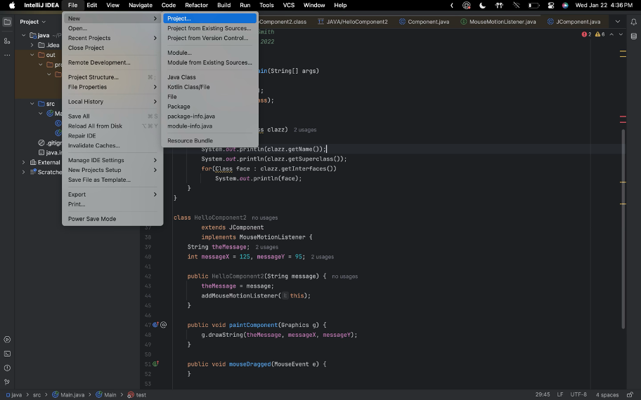
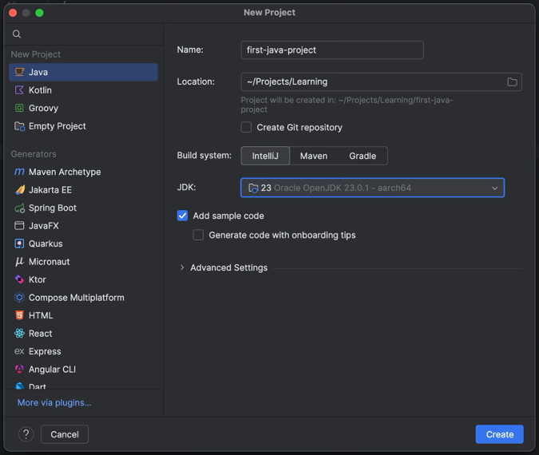
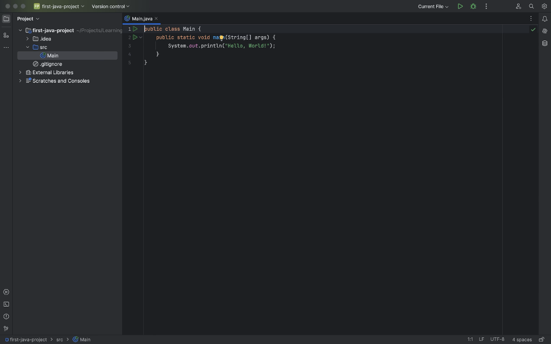
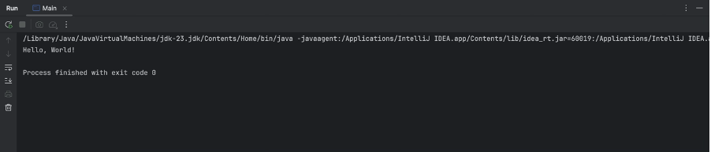
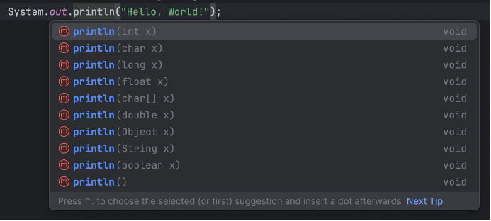

این داکیومنت برای آشنایی اولیه با syntax زبان جاوا طراحی شده. قراره کمی باهاش کدنویسی کنیم و مفاهیم پایه‌ای رو یاد بگیریم. ممکنه موقع کار با جاوا، یاد زبان‌هایی مثل C یا C++ بیفتید، و این طبیعی هست چون syntax این زبان‌ها شباهت زیادی به هم دارن. بسیاری از کارهایی که اینجا انجام می‌دیم، شبیه چیزی هست که ممکنه قبلاً در C تجربه کرده باشید.

لپ‌تاپ‌هاتون رو آماده کنید، ادیتورهاتون رو باز کنید و قدم به قدم با ما پیش بیاید تا اولین تجربهٔ برنامه‌نویسی با جاوا رو کسب کنید. اگر جایی از این داکیومنت براتون گنگ بود، حتماً سرچ کنید، از دستیارهای آموزشی بپرسید یا از ChatGPT کمک بخواید تا براتون توضیح بده.

توجه کنید که این داکیومنت، برای دست به کد شدن شماست. بعضی از کلیدواژه‌های جاوا مثل `public‏`، `static‏`، `class` و غیره این‌جا توضیح داده نمی‌شن و طبیعیه که نسبت بهشون یه خورده گیج باشین. نگران نباشین! اون‌ها رو توی جلسات بعدی بهتون توضیح می‌دیم. تا اون موقع، اگر دوست داشتید می‌تونید از ما راجع بهشون بپرسین یا توی اینترنت در موردشون بخونین.

# نترسید و چیزهای مختلف رو امتحان کنید!

قبل از شروع داکیومنت، خوبه که این رو بدونید که شما قراره خراب‌کاری‌های زیادی توی کدهای اول‌تون بکنید! چیز‌های مختلف رو امتحان می‌کنین، خطاهایی می‌خورید که هیچ ایده‌ای ندارین از کجا اومدن یا حتی اگر می‌دونین از کجان، نمی‌دونین چجوری باید از شرشون خلاص بشین.

نترسید! کدها رو بشکونید! این خطاها و مشکلات، بخشی از فرآیند یادگیری شما هستن. راجع بهشون اول توی اینترنت سرچ کنید، اگر نشد، از ChatGPT بخواین براتون توضیح بده و اگر حتی اون هم نشد، از تدریس‌یارتون بپرسید.

چیزهای جدید رو امتحان کنید، توی کدهای مختلف فضولی کنین و اگر هم چیز خوب و جدیدی پیدا کردین، با باقی به اشتراکش بذارین. فوقش اینه که به خطا می‌خورین و با ما رفعش می‌کنین.

# اولین برنامه

برای درست کردن اولین برنامهٔ جاواتون، IntelliJ رو باز کنید و از مسیر زیر، اولین پروژه‌تون رو ایجاد کنید:



یه صفحه مثل تصویر زیر براتون باز می‌شه. اسم پروژه‌تون رو انتخاب کنید، مطمئن بشید مسیر ذخیره‌سازی درسته و حتماً چک کنید که همون JDKی که قبلاً دانلود کردید، انتخاب شده باشه. من خودم نسخهٔ 23.0.1 رو نصب کردم و برای این پروژه هم از همین نسخه استفاده کردم:



با این کار، اولین پروژهٔ جاوای شما درست می‌شه! همچین صفحه‌ای رو باید ببینین:



این، اولین برنامهٔ شماست. با زدن اون دکمهٔ مثلثی شکل بالای صفحه، برنامه رو run کنید. اگر درست compile و run شد، باید خروجی‌ای مشابه این ببینید:



تبریک! اولین برنامهٔ جاواتون رو اجرا کردین!

## کدی که اجرا کردیم

بیاین ببینیم این کد که اجرا شد، چی بود. منطقا باید چنین کدی روی صفحهٔ ادیتورتون باشه (اگر نبود، لطفا این کد رو کپی و پیست کنید و دوباره برنامه رو اجرا کنید.):

```java
public class Main {
    public static void main(String[] args) {
        System.out.println("Hello, World!");
    }
}
```

توی این کد، یک کلاس به اسم `Main` می‌بینید که داخلش یه تابع به اسم `main` قرار داره. بعداً بهتون یاد می‌دیم که کلاس چی هست، `public` چه معنی‌ای داره و چطور می‌تونید کلاس‌های خودتون رو بسازید. ولی فعلاً، تمام توابع و کدهایی که می‌نویسید، توی همین کلاس `Main` قرار می‌گیره و نیازی نیست الان درگیر یادگیری مباحث مربوط به کلاس‌ها بشید.

```java
public class Main {
    // Your code here
}
```

داخل این class، یه تابع به اسم `main` می‌بینید. توی جاوا، ما به تابع‌هامون می‌گیم Method (حواستون باشه که Function اصطلاح دقیقی برای اون‌ها نیست). این متد شبیه همون تابع `main` توی C هست که قبلاً باهاش آشنا شدید و همون‌جاییه که برنامه‌تون از اون شروع به اجرا می‌کنه:

```java
public static void main(String[] args) {
    // Your program starts from here
}
```

شاید براتون سوال شده باشه که `public static void` و `String[] args` دقیقاً چی هستن. کلیدواژه‌های `public` و `static` جزو مفاهیمی هستن که وقتی وارد مباحث شی‌گرایی بشیم بیشتر در موردشون صحبت می‌کنیم، پس فعلاً لازم نیست نگرانشون باشید.

اما اون `void` احتمالاً از تجربه‌های قبلی‌تون در برنامه‌نویسی براتون آشنا باشه. وقتی `void` توی یه متد استفاده می‌شه، یعنی اون متد هیچ مقداری رو به عنوان خروجی برنمی‌گردونه. اینجا هم همین مفهوم صدق می‌کنه؛ یعنی متد `main` چیزی رو return نمی‌کنه.

توی `main`، شما کد زیر رو می‌بینین:

```java
System.out.println("Hello, World!");
```

این تکه کد برای چاپ `"!Hello, World"` نوشته شده. حالا اگه این خط رو پاک کنین و دوباره بنویسینش، متوجه می‌شین که دستور `println` می‌تونه علاوه بر رشته‌ها، انواع دیگه‌ای مثل int و boolean رو هم چاپ کنه. یعنی به راحتی می‌تونین با همون دستور، مقادیر مختلف رو به خروجی چاپ کنین:



این یکی از ویژگی‌های خوب IntelliJ هست که به شما این امکان رو می‌ده که نوع و نام پارامترهای یک تابع و همچنین خروجی اون رو ببینید. این قابلیت می‌تونه خیلی در نوشتن کد به شما کمک کنه. حالا که صحبت از int و boolean و سایر نوع‌های داده شد، بیایید اولین متغیرهای خودمون رو توی جاوا تعریف کنیم.