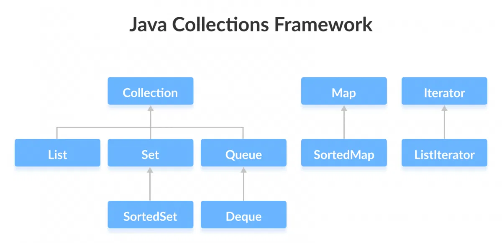
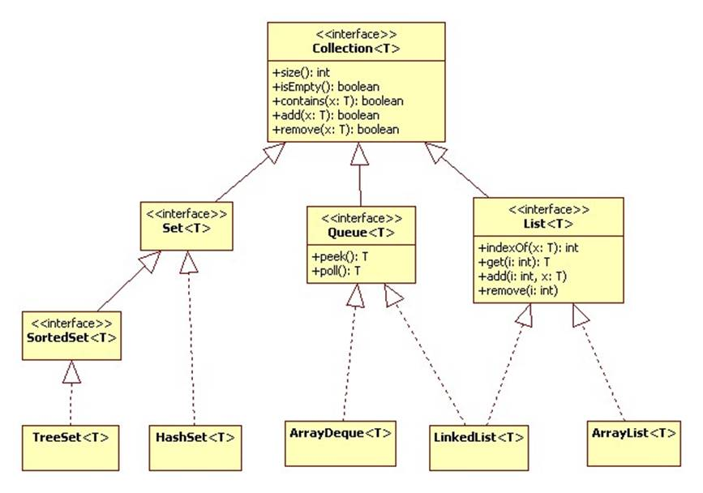
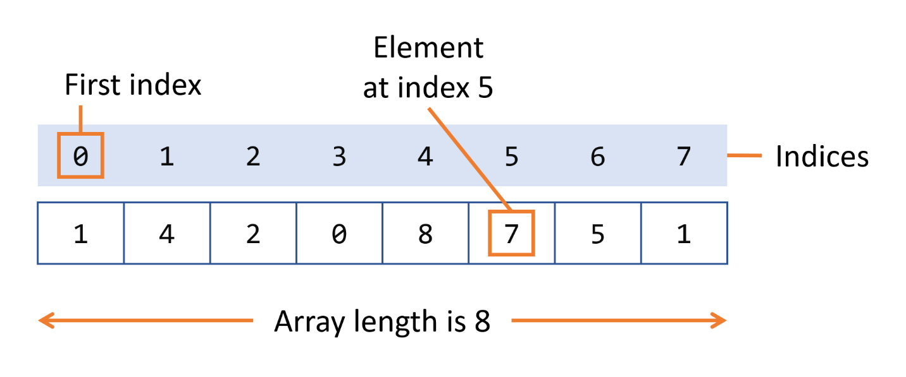
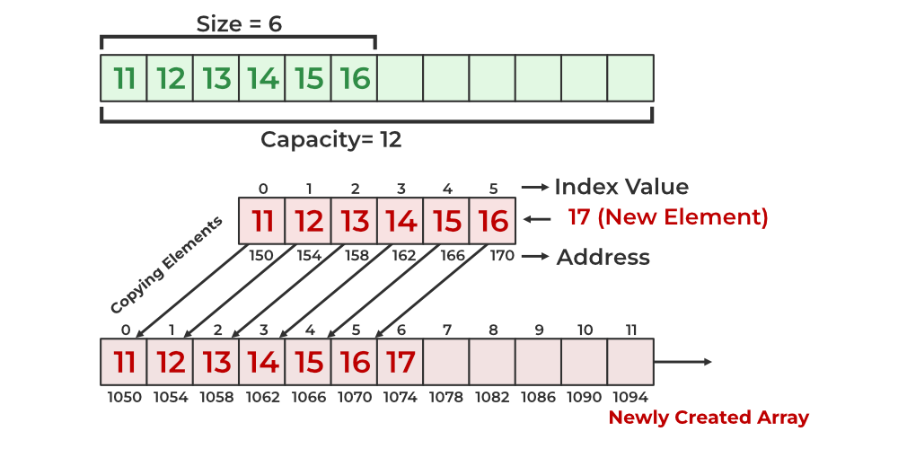
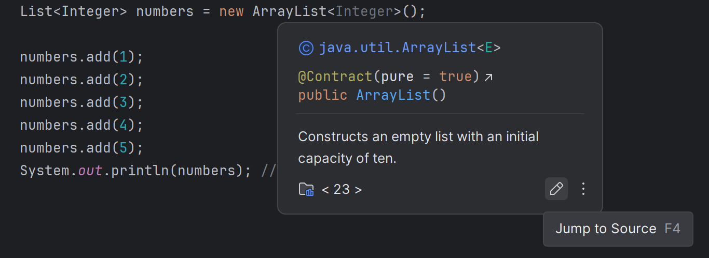
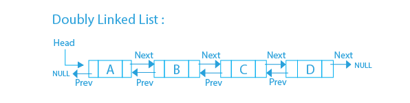
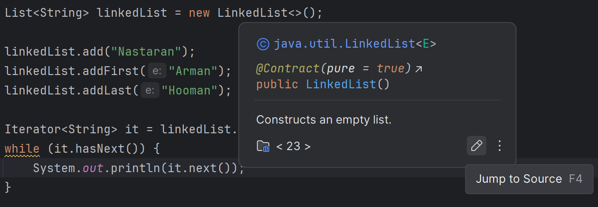
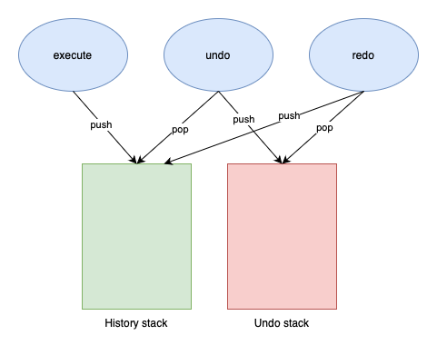
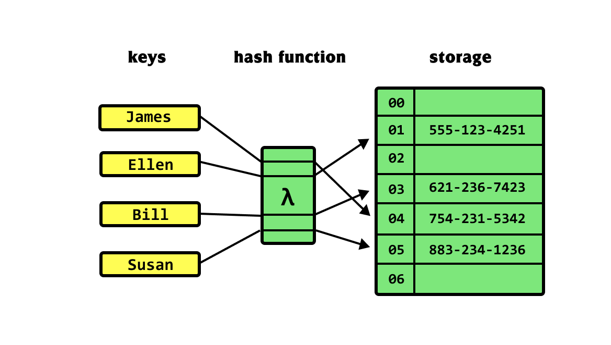

## مقدمه

فرض کنین می‌خوایم یک کتاب‌خونه رو مرتب کنیم. می‌تونیم کتاب‌ها رو بدون هیچ نظمی روی هم بریزیم، اما این‌طوری پیدا کردن یک کتاب جدید زمان‌بر می‌شه. می‌تونیم از قفسه‌ها استفاده کنیم تا کتاب‌ها رو طوری بچینیم که پیدا کردن یک کتاب خاص آسون‌تر بشه. مشابه همین سناریو، در دنیای برنامه‌نویسی هم داده‌ساختار‌ها رو داریم. هر داده‌ساختار یک روش برای مرتب کردن و ذخیره‌سازی داده‌ها در کامپیوتر است، به‌طوری که در موقعیت‌های مختلف بتوانیم از عملیات‌هایی مثل اضافه کردن، حذف کردن، و جست‌وجو به بهینگی استفاده کنیم. در این هفته می‌خوایم با داده‌ساختار‌های مقدماتی،َ نوع کارکرد، و نحوه پیاده‌سازی آن‌ها در زبان جاوا آشنا بشیم.

داده‌ساختار‌ها زمان (سرعت انجام عملیات‌ها) و فضا (حافظه مورد استفاده) رو بهینه می‌کنن. از طرفی می‌توانند پیچیدگی‌ها را در رابط‌های ساده پنهان کنن و به عملیات‌های ساده سرعت ببخشن. همچنین در خیلی از الگوریتم‌ها، ما به داده‌ساختار‌های خاصی نیازمندیم تا پیاده‌سازی الگوریتم را برای ما ممکن کنن.

## فریم‌ورک کالکشن‌های جاوا ([^1] JCF)

قبل از این‌که با داده‌ساختارها آشنا بشیم، می‌خوایم با یکی از ابزارهای مهم زبان جاوا یعنی فریم‌ورک کالکشن‌های جاوا آشنا بشیم. این ابزار مجموعه‌ای از اینترفیس‌ها و کلاس‌های مختلفه، و یک استاندارد کلی برای پیاده‌سازی داده‌ساختارهای مختلف برای ما فراهم می‌کنه. علاوه‌بر اینترفیس‌ها، برخی داده‌ساختارها به‌طور پیش‌فرض پیاده‌سازی شدن و برخی الگوریتم‌ها (مثل مرتب‌سازی و جست‌وجو) برای انجام عملیات‌ها در یک داده‌ساختار نیز قرار گرفتن. این اینترفیس‌ها همگی از کلاس جنریک استفاده می‌کنن و شما می‌تونین آبجکت‌هایی با هر تایپ در اونا ذخیره کنین.

[^1]: Java Collections Framework


### اینترفیس‌های کالکشن

اینترفیس‌ها مشخص می‌کنن که داده‌ساختار‌ای که قراره بسازیم از چه عملیات‌هایی پشتیبانی می‌کنه. اینترفیس `Collection` ریشه‌ای ترین اینترفیس فریم‌ورک کالکشنه، و به شکل یک محل نگه‌داری برای آبجکت‌های متفاوت عمل می‌کنه. کالکشن سه اینترفیس فرزند هم داره؛
- اینترفیس`Set` کالکشنیه که امکان نگه‌داری آبجکت‌های تکراری در اون وجود نداره.
- اینترفیس `List` برای داده‌ساختارهایی که آبجکت‌هاش ترتیب مشخص دارن.
- اینترفیس `Queue` هم کالکشنیه که آبجکت‌های آن ترتیب اضافه شدن خاصی رو حفظ می‌کنن.

اگه به سورس‌کد جاوا برین و اینترفیس Collection رو باز کنین با چنین چیزی روبه‌رو می‌شین؛

```java
public interface Collection<E>
        extends Iterable<E> {
    boolean add(E e);
    
    boolean remove(Object o);
    
    boolean contains(Object o);
    
    int size();
    
    boolean isEmpty();  
     
    Iterator<E> iterator();  
}
```

تایپِ `E` تایپ جنریکه. در این‌جا جنریک به ما این قابلیت رو می‌ده که بتونیم تایپ اعضایی که در کالکشنمون قرار می‌گیره رو کاملاً کنترل کنیم.

همون‌طور که می‌بینین `Collection` هم یک اینترفیس عادیه. البته متدهای دیگه‌ای هم داره که این‌جا ازشون صرف‌نظر کردیم، اما ساختار کلی و مهم‌ترین متدهاش همینان. طبیعتاً سه اینترفیس فرزند `Collection` هم تمام این متدها رو به ارث می‌برن.

- متد `public boolean add(E element)` : آبجکتِ `element` رو به کالکشن اضافه می‌کنه. در صورت موفقیت، این متد مقدار `true` رو برمی‌گردونه. در صورتی که امکان اضافه کردن این آبجکت به کالکشن نباشه، مقدار `false` رو برمی‌گردونه. (برخی کالکشن‌ها فقط برای خواندن هستن. در اون کالکشن‌ها، هنگام صدا شدن این متد `UnsupportedOperationException` ترو می‌شود.)
- متد `public boolean remove(Object element)` : آبجکتِ `element` رو از این کالکشن حذف می‌کنه. مشابه متد `add()`، در صورتی که موفقیت‌آمیز باشه مقدار `true` و در صورتی که آبجکت `element` در کالکشن وجود نداشته باشه مقدار `false` رو برمی‌گردونه. ( مشابه متد `add()` در یک کالکشن خواندنی، با صدا شدن این متد `UnsupportedOperationException` ترو می‌شود.)
- متد `public boolean contains(Object element)` : در صورتی که کالکشن دارای آبجکت مشخص‌شده باشد، مقدار `true` را برمی‌گرداند.
- متد `public int size()` : تعداد اجزای موجود در کالکشن را خروجی می‌دهد.
- متد `public boolean isEmpty()` : در صورتی که کالکشن هیچ عضوی نداشته باشد، مقدار true را خروجی می‌دهد.
- متد `public Iterator iterator()` : تمام اجزای موجود در کالکشن را بررسی می‌کند. این متد یک آبجکت از جنس `Iterator` خروجی می‌دهد که به ما کمک می‌کند اجزای یک کالکشن رو دونه‌دونه طی کنیم. در ادامه درباره `iterator` ها بیش‌تر حرف می‌زنیم و با دقت بررسیشون می‌کنیم.

همون‌طور که گفتیم، سه اینترفیس `Set` و `List` و `Queue` فرزندان اینترفیس `Collection` هستن و به همین دلیل متدهای اون رو به ارث می‌برن. همچنین و ممکنه متدهای دیگه‌ای هم داشته باشن که در آینده هر کدوم رو با جزئیات معرفی می‌کنیم.

علاوه‌بر اینترفیس کالکشن و فرزندهاش، یک اینترفیس دیگه به اسم `Map` هم داریم. اینترفیس `Map` با وجود این‌که جزوی از فریم‌ورک جاواست، فرزند مستقیم اینترفیس `Collection` نیست. در آخر این داکیومنت به این اینترفیس هم می‌پردازیم.


### پیاده‌سازی‌ها

فریم‌ورک کالکشن‌های جاوا شامل پیاده‌سازی‌هاییه که با ارث‌بری از اینترفیس‌های کالکشن، مشخص می‌کنن عملیات‌های مختلف چه‌طور انجام می‌گیرن. این پیاده‌سازی‌ها کلاس‌های پیش‌فرضی هستن که استفاده از داده‌ساختارهای مهم رو برای ما ساده‌تر می‌کنن. شما تا الآن با کلاس `ArrayList` کار کردین. این داده‌ساختار یک آرایه پویاست (در ادامه با آرایه‌ها و آرایه‌های پویا آشنا می‌شین.) که پیاده‌سازی مستقیم اینترفیس `List` هست. از اون‌جایی که `ArrayList` مستقیماً با پیاده‌سازی اینترفیس `Collection` آماده شده، می‌تونین موقع ساختن یک `ArrayList` از دستور `Collection` استفاده کنین.

```java
Collection<String> names = new ArrayList<>();  
  
names.add("Arman");  
names.add("Pedram");  
  
System.out.println(names);
```

کد بالا رو خودتون اجرا کنین. می‌بینین که یک `ArrayList` ساخته می‌شه و می‌تونین بهش اعضای جدید اضافه کنین.

کلاس‌های مختلفی از اینترفیس‌های کالکشن پیاده‌سازی شدن که توی نمودار زیر می‌تونین مهم‌تریناشون رو ببینین.



### الگوریتم‌ها

متدهایی مثل `sort()` و `shuffle()` که به راحتی قابل دوباره استفاده شدن هستن در اینترفیس‌ها قرار گرفتن و با توجه به جنریک بودن تایپ‌های اینترفیس‌ها، می‌تونیم ازشون در پیاده‌سازی داده‌ساختارهای پیچیده‌تر استفاده کنیم.

## آرایه؛ ساده‌ترین داده‌ساختار

یکی از قدیمی‌ترین و ساده‌ترین داده‌ساختار‌هاست. از قبل با آرایه آشنایین و می‌دونین که مثل یک قفسه کتابه که برای هر کتاب یک جای مشخص داره. این جایگاه‌ها با اعدادی به اسم ایندکس مشخص شدن.

داده‌های ذخیره‌شده در یک آرایه **تعداد مشخص و غیرقابل‌تغییری** دارن و **همگی از یک تایپ** هستن. به دلیل این ویژگی‌ها، می‌تونیم برای اعضای آرایه ایندکس مشخصی قرار بدیم. این باعث می‌شه که **بتونیم در کوتاه‌ترین زمان ممکن در کامپیوتر به مقدار یکی از اعضای آرایه دسترسی پیدا کنیم**، فقط کافیه که بدونیم ایندکس عضو دل‌خواهمون چنده. به این ویژگی Random Access هم می‌گن. از طرفی **داده‌های آرایه به شکل بلاک‌های متوالی در حافظه** قرار می‌گیرن، در نتیجه برای ذخیره‌سازی اعضای آرایه در حافظه کامپیوتر نیازی به اطلاعات زیادی نداریم و از لحاظ حافظه مصرفی بهینه است. (در ادامه با داده‌ساختارهایی آشنا می‌شیم که اجزای متفاوت رو در بلاک‌های متفاوت حافظه قرار می‌دن.) حافطه متوالی باعث می‌شه که پردازش آرایه برای CPU هم سریع‌تر بشه.



### آرایه‌ها در جاوا

در جاوا آرایه‌ها برای ساخت و استفاده از آرایه‌ها سینتکس مخصوصی داریم که کاملاً باهاش آشنا هستین.

آرایه‌های جاوا اندازه ثابت دارن، ایندکس‌هاشون از صفر شروع می‌شن، و می‌تونن هم داده‌های primitive (مثل `int` و `char`)، و هم آبجکت‌ها رو توی خودشون جا بدن.

اگه یک درصد فراموش کردین که آرایه‌های جاوا چه ظاهری دارن، این‌جا دو نمونه از ساخت و مقداردهی آرایه‌ها رو می‌بینین:

```java
int[] numbers;  
numbers = new int[5];  
  
String[] weekdays = {"Mon", "Tue", "Wed", "Thu", "Fri"};
```

### زمان استفاده از آرایه

دسترسی به اعضای یک آرایه سرعت زیادی داره و حافظه کم‌تری اشغال می‌کنه. اما از طرفی اندازه ثابتش باعث می‌شه هنگام بیش‌تر شدن اعضا مجبور به کپی کردن کل اعضا باشیم. و آرایه‌های جاوا متدی برای اضافه یا حذف کردن ندارن و در صورتی که بهشون نیاز داشته باشیم باید خودمون پیاده‌سازیشون کنیم.

بنابراین استفاده از آرایه تنها زمانی منطقیه که تعداد اعضامون از قبل مشخص باشه، عملکرد برنامه حیاتی باشه، و یا زمانی که با کدهای Low-Level (مثل بافر برای عملیات‌های ورودی و خروجی فایل) سروکار داریم.

در صورتی که به تغییر اندازه پس از آغاز کار، و عملیات‌های پیشرفته‌تری مثل مرتب‌سازی و جست‌وجو نیاز داشته باشیم، باید به سراغ داده‌ساختارهای پیچیده‌تر بریم.

## آرایه پویا[^2] و اینترفیس List

آرایه پویا یک داده‌ساختار دیگه است که با اضافه و حذف شدن اعضاش، **به‌طور خودکار اندازه‌ش رو بزرگ‌تر یا کوچک‌تر می‌کنه**. بر خلاف آرایه‌های ثابت، آرایه‌های پویا مدیریت حافظه رو به‌طور داخلی انجام می‌دن و همزمان ویژگی Random Access رو هم حفظ می‌کنن. (می‌تونیم با داشتن ایندکس یک عضو، مستقیماً به مقدار آن دسترسی پیدا کنیم.)

در واقع هر آرایه پویا با مدیریت و ساخت آرایه‌های ساده کار خودش رو انجام می‌ده. تمام اطلاعات یک آرایه پویا در یک آرایه ساده ذخیره شده، و زمانی که یک آرایه پویا پر می‌شه (یعنی تعداد اعضاش با طول تعیین‌شده‌ش برابر می‌شه.)، آرایه پویا به‌طور خودکار یک آرایه ساده بزرگ‌تر رو درست می‌کنه و اعضای آرایه‌ی ساده اولیه رو توی آرایه‌ی ساده جدید کپی می‌کنه. بعد از این، آرایه‌ی ساده جدید جایگزین قبلی می‌شه. معمولاً اندازه آرایه ساده جدید دو برابر اندازه آرایه ساده اولیه انتخاب می‌شه. همچنین هنگام کم شدن اعضای آرایه پویا، اندازه آرایه کوچک‌تر می‌شه. معمولاً زمانی که تعداد اعضای موجود آرایه‌ی پویا از یک‌چهارم اندازه آن کم‌تر بشن اعضاش رو به یک آرایه ساده جدید با اندازه نصف قبلی منتقل می‌کنیم. این عملیات‌ها همگی به‌طور پیش‌فرض در متدهای حذف و اضافه اتفاق می‌افتن و بعد از پیاده‌سازی یک آرایه پویا و زمانی که باهاش کار می‌کنیم لازم نیست با این جزئیات دست‌وپنجه نرم کنیم.



آرایه پویا همچنان یک مشکل داره و اون هم زمانیه که برای اضافه کردن و حذف کردن اعضا تلف می‌شه. اگه بخوایم عنصری رو به آخر آرایه اضافه کنیم مشکلی نیست، اما در خیلی از مواقع ما می‌خوایم به وسط و یا ابتدای آرایه عنصر جدیدی اضافه کنیم. برای این کار آرایه باید تمام عناصری که بعد از عنصر جدید وجود دارن رو به اندازه یک جایگاه جابه‌جا کنه. یا اگه عنصر اول یک آرایه رو حذف کنیم، باید تمامی عناصر رو یک جایگاه به عقب بیاریم. این موضوع شاید وقتی به یک آرایه با اندازه کوچیک فکر می‌کنین چندان مشکل بزرگی نباشه، اما وقتی که بخوایم یک برنامه بزرگ طراحی کنیم می‌تونه باعث کند شدن کارمون بشه.


[^2]: Dynamic Array

### اینترفیس `List`

قبل از این‌که به سراغ پیاده‌سازی آرایه پویا بریم، وقتشه که به‌طور کامل با اینترفیس `List` در فریم‌ورک کالکشن جاوا آشنا بشیم. اینترفیس `List` یکی از فرزندان اینترفیس `Collection` ‍‍ه و تنها شرط اضافه‌ش نسبت به خود `Collection` اینه که اعضای اون ترتیب مشخص دارن. بنابراین تمام متدهاش رو به ارث می‌بره. در ادامه متدهای اینترفیس `List` رو می‌بینیم.

- متد `public boolean add(E element)` : آبجکت `element` رو به انتهای لیست اضافه می‌کنه.
- متد `public void add(int index, E element)` : آبجکت `element` رو در ایندکس `index` به لیست اضافه می‌کنه. در صورتی که `index` کم‌تر از صفر یا بزرگ‌تر از طول لیست باشه، اکسپشن `IndexOutOfBoundsException` ترو می‌شه. در صورتی که از قبل یک آبجکت در ایندکس داده‌شده باشه، ایندکس اون آبجکت و تمام آبجکت‌های بعدی یکی بیش‌تر می‌شن.
- متد `public void remove(int index)` : آبجکتی که ایندکس برابر با `index` دارد حذف می‌شود.
- متد `public E get(int index)` : آبجکتی که در جایگاه برابر با `index` قرار داره رو برمی‌گردونه اما تغییری در لیست ایجاد نمی‌کنه.
- متد `public Object set(int index, E element)` : آبجکتی که در جایگاه `index` قرار داره رو با آبجکت `element` جایگزین می‌کنه. هیچ عضو دیگه‌ای از لیست تحت تاثیر قرار نمی‌گیره. در صورتی که آبجکتی در جایگاه `index` موجود نباشد، `IndexOutOfBoundsException` ترو می‌شود.

سایر متدهای `Collection` مثل `size()` بدون تغییر در این اینترفیس هم وجود دارن. تایپِ `E` در این متدها به تایپ جنریک کلاس `List` اشاره داره.

### کلاس ArrayList در جاوا

کلاس `ArrayList` که از قبل با اون آشنایی دارین، پیاده‌سازی آرایه پویا از طریق اینترفیس `List` ‍ه. متدهای کلاس `ArrayList` که در هفته اول باهاشون آشنا شدین همگی پیاده‌سازی متدهای اینترفیس `List` هستن. در صورتی که در محیط اینتلی‌جی روی تعریف یک `ArrayList` نگه دارین می‌تونین با کلیک روی آیکون مداد، سورس‌کد `ArrayList` در زبان جاوا رو ببینین.



(می‌تونین بعد از کلیک روی `ArrayList` دکمه F4 رو هم بزنین تا سورس‌کدش براتون باز بشه.) توی صفحه سورس‌کد می‌بینین که کلاس `ArrayList` از اینترفیس `List` (و چند اینترفیس دیگه.) پیاده‌سازی شده.

```java
public class ArrayList<E> extends AbstractList<E>
        implements List<E>, RandomAccess, Cloneable, java.io.Serializable
```

با خوندن متدهای متفاوت `ArrayList` می‌تونین بینین ابزاری که تا الآن ازش استفاده می‌کردین دقیقاً چه‌طوری پیاده‌سازی شده. داده‌های `ArrayList` توی یک آرایه ساده به اسم `elementsData` ذخیره شده. `elementsData` یکی از فیلدهای کلاس `ArrayList` هست.

این کلاس علاوه‌بر متدهای اصلی `List` و `Collection` که بهشون اشاره کردیم متدهای کمکی دیگه‌ای هم داره. مثلاً متد `grow()` که با گرفتن ورودی `minCapacity` اندازه آرایه رو طوری افزایش می‌ده که تعداد اعضای قابل‌ذخیره در آرایه حداقل به `minCapacity` برسه. اگه می‌خواین دقیق‌تر متوجه بشین که این کار چه‌طور انجام می‌شه می‌تونین سورس‌کد این متد رو بخونین:

```java
private Object[] grow(int minCapacity) {
    int oldCapacity = elementData.length;
    if (oldCapacity > 0 || elementData != DEFAULTCAPACITY_EMPTY_ELEMENTDATA {
        int newCapacity = ArraysSupport.newLength(oldCapacity,  
                minCapacity - oldCapacity, /* minimum growth */
                oldCapacity >> 1           /* preferred growth */);
        return elementData = Arrays.copyOf(elementData, newCapacity);  
    } else {
        return elementData = new Object[Math.max(DEFAULT_CAPACITY, minCapacity)];  
    }  
}
```

اگه همه‌چیز برای تغییر اندازه درست پیش بره، به خط هشتم کد بالا می‌رسیم. می‌بینین که این متد در نهایت `elementsData` رو با یک آرایه جدید جایگزین می‌کنه و اون رو برمی‌گردونه. `elementsData` جدید مقادیرش رو از خود `elementsData` کپی می‌کنه ولی اندازه‌ش رو به `newCapacity` تغییر داده. این‌که مقدار `newCapacity` از کجا به دست اومده رو می‌تونین توی خط‌های ۵ تا ۷ ببینین.

در ادامه می‌تونین پیاده‌سازی متد `add(int index, E element)` رو هم ببینین. این‌که این متد چی‌کار می‌کنه رو توی متدهای اینترفیس `List` فهمیدین و حالا می‌تونین ببینین چه‌طوری اون کارها برای `ArrayList` پیاده‌سازی شده.

```java
public void add(int index, E element) {  
    rangeCheckForAdd(index);
    modCount++;
    final int s;  
    Object[] elementData;
    if ((s = size) == (elementData = this.elementData).length)  
        elementData = grow();  
    System.arraycopy(elementData, index,  
                     elementData, index + 1,  
                     s - index);  
    elementData[index] = element;
    size = s + 1;  
}
```

خوندن سورس‌کد کلاس‌ها و متدهای پیش‌فرض یک زبان می‌تونه توی پروسه دیباگ کردن و رفع اشکالات کدتون خیلی کمک کنه. توی نوشتن برنامه‌های پیشرفته‌تر به مشکلاتی برخورد می‌کنین که اگه بدونین متدها و کلاس‌هایی که ازشون استفاده می‌کنین دقیقاً چه‌طور پیاده‌سازی شدن، خودتون می‌تونین حلشون کنین. طبیعتاً کسی نمی‌تونه تمام پیاده‌سازی‌های یک زبان و پکیج‌هاش رو بلد باشه، اما مهارت خوندن سورس‌کد بهتون کمک می‌کنه هر وقت به مشکلی برخورد کردین خودتون علتش رو پیدا کنین. برای همین توصیه می‌شه به پیاده‌سازی‌های `ArrayList` نگاهی بندازین. توی تمریناتتون قراره این داده‌ساختارها رو پیاده‌سازی کنین و خوندن پیاده‌سازی‌های کامل و تست‌شده رسمی می‌تونه ایده‌های خوبی بهتون بده.

### هزینه زمانی تغییر اندازه `ArrayList`

_مطالب این بخش خارج از مباحث درس «برنامه‌سازی پیشرفته» است و خوندن این بخش اختیاریه._

آرایه پویا یکی از مشکلات اساسی آرایه رو رفع کرد و حالا می‌تونیم اندازه داده‌ساختارمون رو حتی بعد از مقداردهی اولیه تغییر بدیم. اما برای رفع این مشکل، اجرای عملیات‌هایی مثل اضافه و حذف کردن بیش‌تر شد. برای این‌که بهتر به این موضوع پی ببرین به کد زیر دقت کنین.

```java
import java.util.ArrayList;
import java.util.List;

public class Main {
    public static void main(String[] args) {
        int totalElements = 1_000_000;
        
        long startTime1 = System.currentTimeMillis();  
        List<Integer> listWithSize = new ArrayList<>(totalElements);
        for (int i = 1; i <= totalElements; i++) {  
            listWithSize.add(i);  
        }
        long endTime1 = System.currentTimeMillis();  
        System.out.println("Pre-sized ArrayList time: " + (endTime1 - startTime1) + " ms");  
    }  
}
```

توی این کد می‌بینین که یک `ArrayList` با اندازه `totalElements` (که در این‌جا برابر با یک میلیونه.) ساخته شده، و بعدش با یک حلقه `for` اعداد ۱ تا ۱ میلیون به ترتیب به این لیست اضافه شدن. قبل و بعد از این فرآیند لحظه دقیق شروع و اتمام رو با متد `currentTimeMillis()` ثبت کردیم و با کم کردن این دو مقدار می‌تونیم ببینیم کل این فرآیند چند میلی ثانیه طول کشیده. یک بار این کد رو کپی و اجرا کنین و نتیجه رو ببینین.

حالا کد زیر رو ببینین.

```java
import java.util.ArrayList;
import java.util.List;

public class Main {
    public static void main(String[] args) {
        int totalElements = 1_000_000;

        long startTime2 = System.currentTimeMillis();  
        List<Integer> listDefaultSize = new ArrayList<>(10);
        for (int i = 1; i <= totalElements; i++) {  
            listDefaultSize.add(i);  
        }
        long endTime2 = System.currentTimeMillis();  
        System.out.println("Default-sized ArrayList time: " + (endTime2 - startTime2) + " ms");  
    }  
}
```

این دقیقاً مثل کد قبلیه، تنها تفاوت اینه که این دفعه `ArrayList` با اندازه اولیه ۱۰ ساخته شده. بنابراین در حلقه `for` و با اضافه کردن اعضای جدید، هر بار که اعضا از اندازه فعلی بیش‌تر بشه مجبوره تا سایز `ArrayList` رو افزایش بده. قاعدتاً این کار باید هزینه زمانی ما رو بیش‌تر کنه، نه؟

با اجرای این کد به نتیجه‌ای مشابه با نتیجه زیر می‌رسین:

```text
Pre-sized ArrayList time: 30 ms
Default-sized ArrayList time: 75 ms
```

می‌بینین که توی روش دوم زمان اجرا از دو برابر روش اول هم بیش‌تره. اما اگه تعداد اعضای این لیست بیش‌تر بشه چی؟ مقدار `totalElements` رو از یک میلیون به صد میلیون تغییر بدین و کد رو دوباره اجرا کنین. نتیجه اجرای دوباره کدهای قبلی با مقدار جدید به این شکله؛

```text
Pre-sized ArrayList time: 3987 ms
Default-sized ArrayList time: 5953 ms
```

می‌بینین که اختلاف این دو به نسبت اندازه‌شون کم‌تر شده. در واقع، تغییر اندازه `ArrayList` برای ما هزینه زیادی نداره. این‌که علتش چیه در درس‌های ترم‌های آینده‌تون توضیح داده می‌شه. [^3]

[^3]: علت این موضوع در تحلیل زمانی الگوریتم‌ها و Amortized Analysis مشخص می‌شه. به این مبحث در فصل ۱۷ کتاب Introduction to Algorithms کاملاً پرداخته شده. این کتاب مرجع اصلی دروس «ساختمان‌داده‌ها و الگوریتم‌ها» و «طراحی و تحلیل الگوریتم‌ها» است. می‌تونید از این [لینک](https://enos.itcollege.ee/~japoia/algorithms/GT/Introduction_to_algorithms-3rd%20Edition.pdf) نسخه سوم این کتاب رو دانلود کنین.

## ابزار Iterator پیمودن کالکشن‌ها

قبل از این‌که به سراغ داده‌ساختار بعدی بریم، می‌خوایم یاد بگیریم که چه‌طور ایمن و بهینه بین اعضای یک کالکشن پیمایش انجام بدیم. پیمایش یا traverse در این‌جا به معنای اینه که در هر مرحله سراغ یکی از اعضای کالکشن بریم و دونه‌دونه اون‌ها رو **بخونیم یا تغییر بدیم**. ساده‌ترین روش می‌تونه یک حلقه `for` باشه که از راه‌های مختلف (مثل ایندکس) بین اعضای یک کالکشن پیمایش انجام می‌ده، این روش وقتی می‌خوایم اعضای یک کالکشن رو فقط بخونیم مشکلی نداره، اما زمانی که بخوایم اعضای کالکشن رو حین پیمایش تغییر بدیم، و یا عضوی اضافه و کم کنیم احتمالاً به مشکلاتی برمی‌خوریم. مثلاً ترو شدن `ConcurrentModificationException` یکی از مشکلاتی است که ممکنه سراغمون بیاد.

در جاوا، `Iterator` یکی از ابزارهای فریم‌ورک کالکشن‌های جاواست که با جدا کردن منطق پیمایش از اساس داده‌ساختار، یک روش استاندارد برای دسترسی به اعضا به ما می‌ده، و همزمان جزئیات پیاده‌سازی رو پنهان می‌کنه.

### اینترفیس `Iterator`

یک iterator آبجکتیه که به ما اجازه می‌ده بین یک دنباله از مقادیر پیمایش انجام بدیم. این عملیات یک روش استاندارد داره، اینترفیس `Iterator`. این اینترفیس سه متد اصلی داره؛

- متد `public boolean hasNext()` : در صورتی که هنوز تمامی اعضای کالکشن رو نپیموده باشیم، این متد مقدار `true` برمی‌گردونه. یعنی زمانی که هنوز اعضای بیش‌تری برای پیمایش باقی مونده.
- متد `public E next()` : این متد عضو بعدیِ کالکشن (یک آبجکت با تایپِ جنریک E) رو برمی‌گردونه.
- متد `public void remove()` : این متد آخرین آبجکتی که با متد `next()` برگردونده شده رو از کالکشن حذف می‌کنه.

مثال زیر نشون می‌ده که چه‌طور از یک `iterator` استفاده کنیم تا تمام اعضای یک کالکشن رو چاپ کنیم.

```java
import java.util.ArrayList;
import java.util.List;
import java.util.Iterator;

public class Main {
    public static void main(String[] args) {  
        List<String> tas = new ArrayList<>( List.of(
                "Sania", "Pariya", "Pedram", "Nastaran", "Hooman"
        ));  
  
        Iterator<String> it = tas.iterator();

        while (it.hasNext()) {  
            String ta = it.next();  
            System.out.println(ta);  
        }  
    }  
}
```

خروجی این کد به شکل زیر خواهد بود.

```text
Sania
Pariya
Pedram
Nastaran
Hooman
```

بعد از استفاده کردن متد `next()` برای برگردوندن عضو بعدی، می‌تونیم متد `remove()` رو صدا بزنیم تا اون عضو رو حذف کنیم.

حالا به مثال زیر دقت کنین:

```java
import java.util.ArrayList;
import java.util.List;
import java.util.Iterator;

public class Main {
    public static void main(String[] args) {  
        List<String> tas = new ArrayList<>( List.of(
                "Sania", "Pariya", "Pedram", "Nastaran", "Hooman"
        ));  
  
        Iterator<String> it = tas.iterator();

        while (it.hasNext()) {  
            String ta = it.next();
            if (ta.equals("Pedram")) {  
                it.remove();  
            }  
        }  
        System.out.println(tas);  
    }  
}
```

توی این مثال بعد از هر مرحله چک می‌کنیم که آخرین عضوی که `next()` خروجی داده برابر با استرینگ `“Pedram”` بوده یا نه، و اگه بوده اون رو حذف می‌کنیم.

```text
[Sania, Pariya, Nastaran, Hooman]
```

در نهایت خروجی این کد نشون می‌ده که این استرینگ از بین اعضای `ArrayList` ای که در ابتدا ساختیم حذف می‌شه

### حلقه for-each

در جاوا، می‌تونیم به‌جای استفاده مستقیم از `Iterator`، از حلقه‌های for-each استفاده کنیم که به‌صورت داخلی از iterator ها استفاده می‌کنن. (به این نوع حلقه enhanced for loop هم گفته می‌شه.) در واقع این حلقه به ما کمک می‌کنه که بدون نیاز به ایندکس و یا iterator توی اعضای یک کالکشن پیمایش انجام بدیم. سینتکس حلقه‌های for-each به شکل زیرن.

```java
for (E element : collection) {
    // use element
}
```

کد بالا با این کد معادل است:

```java
Iterator<E> it = collection.iterator();
while (it.hasNext()) {  
    String element = it.next();
}
```

اگه بخوایم مثال قبلی رو با حلقه for-each اجرا کنیم چنین کدی خواهیم داشت.

```java
public static void main(String[] args) {  
    List<String> tas = new ArrayList<>( List.of(
            "Sania", "Pariya", "Pedram", "Nastaran", "Hooman"
    ));

    for (String ta : tas) {  
        System.out.println(ta);  
    }  
}
```

کد بالا خروجی‌ای مشابه استفاده از iterator داره. حالا اگه بخوایم عملیات حذف کردن یکی از اعضا رو هم با for-each انجام بدیم به این کد می‌رسیم:

```java
public static void main(String[] args) {  
    List<String> tas = new ArrayList<>( List.of(
            "Sania", "Pariya", "Pedram", "Nastaran", "Hooman"
    ));
    
    for (String ta : tas) {
        if (ta.equals("Pedram")){  
            tas.remove(ta);  
        }  
    }  
}
```

این کد رو اجرا کنین. با اجرای این کد اکسپشنِ `ConcurrentModificationException` ترو می‌شه. پس متوجه می‌شیم که با حلقه for-each نمی‌تونیم عضوی رو تغییر بدیم. یکی دیگه از محدودیت‌های حلقه for-each اینه که نمی‌تونیم ایندکس آبجکت‌ها رو پیدا کنیم. بنابراین for-each برای زمانی مناسبه که می‌خوایم تمام اعضا رو بدون تغییر دادن بخونیم و نیازی به ایندکسشون نداریم.

### اینترفیس `ListIterator`

همون‌طور که از اسمش مشخصه، این اینترفیس یک نسخه اکستندشده از اینترفیس `Iterator` ‍ه که برای List ها طراحی شده. اینترفیس `ListIterator` از **پیمایش دوطرفه** پشتیبانی می‌کنه. متدهای مهم این اینترفیس به شرح زیره:

- متد `public boolean hasPrevious()` : در صورتی که عنصر قبلی‌ای وجود داشته باشه، مقدار true رو برمی‌گردونه.
- متد `public E previous()` : آبجکتِ عنصر قبلی رو برمی‌گردونه.
- متد `public void add(E element)` : آبجکت `element` رو در قبل از محل فعلی iterator اضافه می‌کنه.
- متد `public void set(E element)` : آبجکت `element` رو جایگزین آخرین عنصری که برگردونده شده می‌کنه.

```java
import java.util.ArrayList;
import java.util.List;
import java.util.ListIterator;

public class Main {
    public static void main(String[] args) {  
        List<String> tas = new ArrayList<>(List.of(
                "Sania", "Pariya", "Arman", "Nastaran", "Hooman"));  
  
        ListIterator<String> lit = tas.listIterator();

        while (lit.hasNext()) {  
            System.out.println(lit.next());  
        }

        while (lit.hasPrevious()) {  
            String ta = lit.previous();
            if (ta.equals("Arman")) {  
                lit.set("Pedram");  
            }  
        }  
        System.out.println(tas);  
    }  
}
```

در این کد ابتدا با یک حلقه `while` تمامی اعضای لیست به ترتیب چاپ می‌شن، بعدش با یک پیمایش معکوس روی اعضای این لیست بررسی می‌کنیم که اگر عضوی برابر با `“Arman”` بود اون رو به `“Pedram”` تغییر بده و در نهایت لیست نهایی رو چاپ می‌کنیم. اگه این کد رو اجرا کنین می‌بینین که در انتها یکی از اعضای این لیست تغییر کرده.

## لیست پیوندی

در این بخش به یکی دیگه از داده‌ساختارهای پایه‌ای می‌پردازیم که با استفاده از راس، حذف و اضافه کردن عنصر جدید رو بهینه می‌کنه. بر خلاف آرایه‌ها، لیست‌های پیوندی نیازی به بلاک‌های حافظه متوالی ندارن. این ویژگی باعث می‌شه که برای داده‌هایی که اندازه‌شون دائماً در حال تغییره عالی باشن.

لیست پیوندی از راس‌های مختلف تشکیل شده. این راس‌ها هر کدوم شامل دو بخشن؛ **داده** و **رفرنس**. داده در این‌جا به معنای مقداریه که توی لیست پیوندی ذخیره می‌کنیم. رفرنس (یا پوینتر) هم آدرس حافظه مربوط به یک راس دیگه از لیسته. در واقع داده‌های مختلف یک لیست پیوندی در موقعیت‌های متفاوتی در حافظه ذخیره شدن و هر کدوم از اعضاش می‌دونن که عضو بعدی کجاست.


لیست‌های پیوندی معمولاً یک راس خالی به‌عنوان head دارن. راس سر اولین راسه که رفرنس اون برای شناسایی کل لیست پیوندی استفاده می‌شه. تنها مقدار راس سر، آدرس راس بعدیه. راس‌های بعدی هر کدوم یک مقدار و یک آدرس ذخیره می‌کنن. در نهایت به راسی می‌رسیم که بخش رفرنس اون خالیه و این یعنی به انتهای لیست پیوندی رسیدیم.

**اضافه کردن عضو به لیست پیوندی هیچ محدودیتی نداره.** همون‌طور که دیدین در آرایه پویا با این‌که مشکل ثابت بودن اندازه رفع شده بود، اما برای این کار هزینه زمانی زیادی پرداخت می‌کردیم و برای داده‌هایی که اندازه‌شون دائم در حال تغییره مناسب نبودن. اما توی لیست پیوندی این مشکل رفع شده. از طرفی یکی دیگه از مشکلات آرایه‌ها این بود که برای حذف یا اضافه کردن عنصری که در انتهای آرایه نبود، باید زمان زیادی صرف می‌شد. توی لیست پیوندی **حذف و اضافه کردن عناصر هزینه کمی داره**، چون فقط کافیه رفرنس راس قبلی رو تغییر بدیم.


همون‌طور که قبل‌تر گفتیم، آرایه مثل یک قفسه کتابه که برای هر کتاب یک جایگاه مخصوص داره. اما لیست پیوندی مثل یک زنجیر طولانیه که هر راس اون در یک جای حافظه قرار گرفته.

یکی از مشکلاتی که توی لیست پیوندی بهش برخورد می‌کنیم اینه که نمی‌تونیم پیمایش معکوس انجام بدیم. فرض کنین راس انتهایی (یا یکی از راس‌های میانی) لیست پیوندی رو داریم. می‌تونیم راس head رو پیدا کنیم؟ نه. حتی به راس‌های قبل از اون هم دسترسی نداریم. برای حل این مشکل یک داده‌ساختار دیگه به اسم «لیست پیوندی دوطرفه»[^4] طراحی شده.



هر راس لیست پیوندی دوطرفه شامل سه بخشه؛ **داده**، **رفرنس به راس بعدی**، و **رفرنس به راس قبلی**. تنها تفاوت لیست پیوندی دوطرفه با لیست پیوندی ساده اینه که هر راس می‌دونه راس قبل از خودش کجاست. این ویژگی پیمایش معکوس در لیست پیوندی رو ممکن می‌کنه و به ما اجازه می‌ده تا از یک راس، به تمامی راس‌های لیستمون دسترسی داشته باشیم. وقتی بخوایم در عمل از لیست پیوندی استفاده کنیم، معمولاً از لیست پیوندی دوطرفه استفاده می‌کنیم.

اما چی باعث می‌شه که از اول سراغ لیست پیوندی نرفتیم؟ فرض کنین می‌خوایم مقدار سومین عنصر یک لیست پیوندی رو بخونیم. برای این کار باید از راس سر شروع کنیم و سه بار به راس بعدی بریم. این به‌نظر مشکل‌زا نیست، اما وقتی بخوایم عنصر صدم رو پیدا کنیم چه‌طور؟ در آرایه می‌تونستیم به راحتی با ایندکس، به عنصر مورد نظر برسیم. اما این‌جا نمی‌تونیم.

در واقع همون‌طور که حذف و اضافه کردن عنصر به میانه آرایه هزینه زیادی داشت، خوندن یکی از عناصر میانه لیست پیوندی هم هزینه زیادی داره. بنابراین در خیلی از سناریوها، استفاده از لیست پیوندی باعث می‌شه برنامه ما کندتر بشه. ما باید موقعیت مناسب برای استفاده از هر داده‌ساختار رو با توجه به کاربرد داده‌های برنامه‌مون پیدا کنیم.

[^4]: Doubly Linked List
### پیاده‌سازی لیست پیوندی

برای این‌که لیست پیوندی رو با جاوا پیاده‌سازی کنیم، منطقی‌ترین گزینه اینه که از اینترفیس `List` استفاده استفاده کنیم. این اینترفیس برای داده‌ساختارهاییه که ترتیب دارن و می‌تونن اعضای تکراری هم بپذیرن. اما برای این‌که بتونیم خود لیست پیوندی رو پیاده‌سازی کنیم، اول باید مشخص کنیم هر کدوم از راس‌های لیستمون از چه تایپی هستن.

برای راس‌های لیست پیوندی کلاس `Node` رو می‌سازیم. این کلاس شامل دو تا فیلده، فیلد `data` و فیلد `next`. تایپ فیلد `data` جنریکه و می‌تونیم موقع ساخت اینستنس از این کلاس تعیین کنیم که آبجکتی در اون ذخیره می‌شه. تایپ فیلد `next` هم از جنس خود `Node` هست و در واقع رفرنس به یک آبجکت دیگه (راس بعدی) از کلاس `Node` ‍ه.

```java
private static class Node<E> {    E data;  
    Node<E> next;
    
    Node(E data) {
        this.data = data;
        this.next = null;  
    }  
}
```

حالا با پیاده‌سازی کلاس لیست پیوندی از اینترفیس `List` می‌تونیم کل لیست رو بسازیم. همون‌طور که گفتیم تنها چیزی که برای معرفی لیست پیوندی نیاز داریم، راس head است. این راس شامل رفرنس به راس بعدیه و همین‌طوری زنجیروار می‌تونیم تا انتهای لیست پیش بریم.

```java
public class SimpleLinkedList<E>
        implements List<E> {
    private Node<E> head;
    private int size;
    
    @Override
    public boolean add(E element) {  
        Node<E> newNode = new Node<>(element);
        if (head == null) {
            head = newNode;  
        } else {  
            Node<E> current = head;
            while (current.next != null) {  
                current = current.next;  
            }  
            current.next = newNode;  
        }
        size++;
        return true;  
    }
    
    @Override
    public E get(int index) {
        if (index < 0 || index >= size) {
            throw new IndexOutOfBoundsException();  
        }  
        Node<E> current = head;
        for (int i = 0; i < index; i++) {  
            current = current.next;  
        }
        return current.data;  
    }  
}
```

در کد بالا فقط دو متد `add()` و `get()` رو پیاده‌‌سازی کردیم.

متد `add()` یک عضو از آبجکتی که قراره در راس‌های این لیست ذخیره کنیم رو به‌عنوان ورودی می‌گیره. بعدش با اون ورودی یک اینستنس از کلاس `Node` می‌سازیم و اسمش رو `newBode` می‌ذاریم. حالا باید ببینیم این راس جدید رو کجای لیست می‌ذاریم. پس بررسی می‌کنیم که راس `head` داریم یا نه. اگه نداشتیم، راسی `newNode` رو به‌عنوان `head` قرار می‌دیم، مقدار `size` رو یکی بیش‌تر می‌کنیم و از مقدار `true` رو برمی‌گردونیم.

در صورتی که راس `head` داشته باشیم، باید از `head` شروع کنیم و دونه‌دونه راس‌های لیست پیوندی رو پیمایش کنیم تا به انتهای لیست برسیم. پس یک اینستنس به اسم `current` از کلاس `Node` می‌سازیم و با یک حلقه `while`، تمام راس‌های لیست رو طی می‌کنیم و هر دفعه بررسی می‌کنیم که راس فعلیمون `next` داره یا نه. هر وقت مقدار `next` راس `current` برابر `null` باشه، یعنی راس انتهاییه. پس `next` راس انتهایی رو برابر `newNode` قرار می‌دیم، مقدار size رو یکی بیش‌تر می‌کنیم و از مقدار true رو برمی‌گردونیم.

متد `get(int index)` با گرفتن یک عدد، آبجکت ذخیره‌شده در اون شماره رو به‌عنوان جواب برمی‌گردونه. گفتیم که توی لیست پیوندی ایندکس نداریم، پس برای پیدا کردن خروجی دادن یک راس با ایندکس مشخص باید از راس `head` شروع کنیم و به تعداد `index` جلو بریم تا به راس دل‌خواه برسیم. در کد بالا ابتدا چک می‌کنیم که `index` ورودی از صفر بزرگ‌تر و `size` کوچک‌تر باشه. اگه نبود، اکسپشن `IndexOutOfBoundsException` رو ترو می‌کنیم. اگه ورودی مشکلی نداشت، یک اینستنس از کلاس `Node` به اسم `current` می‌سازیم و دونه‌دونه اعضای لیست رو طی می‌کنیم و وقتی به عدد خواسته‌شده رسیدیم اون رو برمی‌گردونیم.

کدهای بالا رو کپی کنین و توی اینتلی‌جی اضافه‌شون کنین. دقت کنین که چون کلاس `SimpleLinkedList` از اینترفیس `List` پیاده‌سازی شده، باید حتماً تمام متدهای اون رو اورراید کنه. لازم نیست توی این متدها چیز خاصی بفرستین و می‌تونن فقط `null` یا `false` خروجی بدن. برای راحت‌تر شدن کارتون موس رو ببرین روی اسم کلاس، و گزینه Implement methods رو بزنین. توی پنجره‌ای که باز می‌شه OK رو بزنین و خودش تمام متدها رو اضافه می‌کنه. حالا کد زیر رو به کلاس `Main` اضافه کنین و اجراش کنین.

```java
public static void main(String[] args) {  
    SimpleLinkedList<String> names = new SimpleLinkedList<>();  
  
    names.add("Arman");  
    names.add("Pedram");  
  
    System.out.println(names.get(1));  
}
```

در این‌جا با ساختن یک اینستنس از کلاس `SimpleLinkedList`، دو تا استرینگ بهش اضافه کردیم. بعدش مقدار ذخیره‌شده در راس دوم رو با استفاده از متد `get()` به دست آوردیم و چاپ کردیم. این کدها رو توی دستگاه خودتون اجرا کنین و نتیجه رو ببینین.

### LinkedList در جاوا

مشابه `ArrayList`، داده‌ساختار لیست پیوندی نیز به‌طور پیش‌فرض در فریم‌ورک کالکشن پیاده‌سازی شده. این پیاده‌سازی هم مشابه نمونه ساده‌ای که بالا دیدیم از اینترفیس `List` پیاده‌سازی شده. همون‌طور که توی بخش‌های قبلی دیدیم، می‌تونین به سورس‌کد این پیاده‌سازی هم دسترسی پیدا کنین.



این پیاده‌سازی شامل بیش‌تر از ۱۵۰۰ خط کد ‍ه و کلی متد مختلف داره. پیشنهاد می‌کنم به کدهای متدهای `add()`، `linkLast()`، و `remove()` نگاه کنین. شما قراره توی تمریناتتون داده‌ساختار لیست پیوندی رو پیاده‌سازی کنین، و دیدن پیاده‌سازی‌های خود جاوا برای این داده‌ساختار می‌تونه خیلی کمکتون کنه.

### استفاده از Iterator در لیست پیوندی

در لیست پیوندی حذف و اضافه کردن عنصر به میانه عناصر قبلی سریع‌تر از آرایه‌هاست. اما از طرفی برخلاف آرایه‌ها که می‌تونستیم به سرعت یک عنصر رو پیدا کنیم، در لیست پیوندی باید هزینه زمانی زیادی رو برای پیدا کردن یک عنصر پرداخت کنیم.

فرض کنین می‌خوایم تمام عناصر یک داده‌ساختار با `n` عنصر رو پیمایش کنیم. در آرایه می‌تونستیم در هر مرحله عنصر i اُم رو طی کنیم. اما در لیست پیوندی ایندکس نداریم، بنابراین در هر مرحله باید از راس سر شروع کنیم و به اندازه i بار به راس بعدی برویم.

پس برای پیمایش `n` عنصر در آرایه، به `n` عملیات نیاز داریم و برای پیمایش `n` عنصر در لیست پیوندی به عملیات نیاز داریم.

```java
LinkedList<Integer> linkedList = new LinkedList<>();  
  
for (int i = 0; i < 100_000; i++) {  
    linkedList.add(i);  
}  
  
long start = System.currentTimeMillis();  
for (int i = 0; i < linkedList.size(); i++) {
    int value = linkedList.get(i);  
}  
long end = System.currentTimeMillis();  
System.out.println("Time taken: " + (end - start) + " ms");
```

کد بالا رو برای خودتون اجرا کنین. توی این کد با کلاس `LinkedList` یک لیست پیوندی ساختیم و اعداد ۱ تا ۱۰۰٬۰۰۰ رو بهش اضافه کردیم. بعدش با یک حلقه `for`، مقدار هر عضو رو گرفتیم و در یک آبجکت موقع ذخیره کردیم. با اجرای کد بالا می‌تونین زمان اجرای این برنامه رو ببینین که بسته به شرایط مختلف می‌تونه متغیر باشه، اما در اجرای من چیزی بین ۸٬۰۰۰ الی ۹٬۰۰۰ میلی ثانیه طول کشید.

حالا چه‌طور می‌تونیم این روند رو تسهیل کنیم؟ از لحاظ تئوری، راه بهتری برای رسیدن به راسی در میانه لیست پیوندی وجود نداره. اما می‌تونیم آبجکت هر راس رو نگه داریم تا برای پیدا کردن راس بعدی، به‌جای شروع از راس سر، از اون راس شروع کنیم. در بخش قبلی با `Iterator` ها آشنا شدیم و می‌دونیم که بهترین راه برای پیمایش عناصر یک داده‌ساختار، استفاده از یک `Iterator` ‍ه، و به‌طور خودکار خودش این کار رو می‌کنه.

```java
LinkedList<Integer> linkedList = new LinkedList<>();  
  
for (int i = 0; i < 100_000; i++) {  
    linkedList.add(i);  
}  
  
long start = System.currentTimeMillis();

Iterator<Integer> it = linkedList.iterator();
while (it.hasNext()) {
    int value = it.next();  
}  
long end = System.currentTimeMillis();  
System.out.println("Time taken: " + (end - start) + " ms");
```

کد بالا رو اجرا کنین و زمان اجراش رو با کد قبلی مقایسه کنین. این کد همون کاری که قبلاً کردیم رو با استفاده از `Iterator` انجام می‌ده، و زمان اجراش یه چیزی بین ۱ تا ۱۰ میلی ثانیه است.

می‌تونین تعداد اعضای لیست رو بیش‌تر هم بکنین و زمان اجرا رو مقایسه کنین. می‌بینین که هرچه‌قدر تعداد اعضا باشه، تفاوت بین این دو روش بیش‌تر می‌شه. مثل همه بخش‌های دیگه برنامه‌نویسی، اگه هزینه زمانی یک برنامه رو کاهش بدیم، توی ورودی‌های بزرگ‌تر خودش رو بیش‌تر نشون می‌ده.

## پشته[^5] و صف[^6]

پشته و صف دو داده‌ساختار اساسین که از قوانین مخصوصی در حذف و اضافه کردن عنصر پیروی می‌کنن.

در پشته ما فقط آخرین عنصر اضافه‌شده رو می‌بینیم، اگه بخوایم عنصر جدیدی اضافه کنیم روی آخرین عنصر قرار می‌گیره، و در صورتی که بخوایم عنصری رو حذف کنیم باید آخرین عنصری که از قبل اضافه کردیم (تنها عنصری که می‌تونیم ببینیم.) رو حذف کنیم. ایده پشته مشابه قرار دادن چند تا کاسه روی هم‌دیگه است. در پشته، اضافه کردن عنصر به push و حذف کردن از پشته به pop معروفه.

در صف فقط می‌تونیم به پشت صف عنصری اضافه کنیم، اما برخلاف پشته، برای حذف عنصر باید حتماً آخرین از جلوی صف یک عنصر را برداریم. در صف هم به اضافه کردن enqueue می‌گیم و حذف کردن رو هم dequeue می‌نامیم. به تصویر زیر دقت کنین.


در بخش چپ می‌تونین تصویر یک پشته رو ببینین، و در بخش راست تصویر یک صف.

پشته‌ها از سیاست LIFO استفاده می‌کنن. LIFO مخفف “Last-in, first-out” ‍ه و مطابق اسمش یعنی آخرین عنصری که اضافه کردیم، اولین عنصریه که خارج می‌شه. صف هم از سیاست FIFO استفاده می‌کنه که مخفف “First-in, first-out” ‍ه، یعنی اولین عنصری که اضافه می‌کنیم، اولین عنصریه که خارج می‌کنیم.

شاید براتون سوال بشه که چنین داده‌ساختارهای ساده‌ای اصلاً به چه دردی می‌خورن. با داده‌ساختارهایی طرفیم که قابلیت‌های کم‌تری نسبت به آرایه و لیست پیوندی دارن، اما صف و پشته به واسطه سادگیشون و قابلیت‌های کم‌ترشون، توی برنامه‌های سطح پایین خیلی بیش‌تر استفاده می‌شن. مثلاً وقتی که داریم اساس یک زبان یا سیستم عامل رو پیاده‌سازی می‌کنیم، ممکنه با مسائلی طرف باشیم که راه حل ساده‌ای می‌خوان، اما قراره به وفور استفاده بشن و برای همین مهمه که بتونیم عملیات‌هاشون رو به سادگی و با کم‌ترین هزینه ممکن انجام بدیم.<sup>[\[7\]](#footnote-7)</sup>

یکی از مشهورترین کاربردهای پشته در ذخیره‌سازی عملیات‌های Undo و Redo در برنامه‌های کامپیوتریه.



مطابق تصویر بالا، تمام برنامه‌هایی که از Redo و Undo استفاده می‌کنن دو تا پشته دارن که عملیات‌های کاربر رو توشون ذخیره می‌کنن. بعد از اجرای هر عملیات، اون عملیات به پشته اول پوش می‌شه. اگه در بین کارهامون تصمیم بگیریم آخرین عملیاتی که انجام دادیم رو کنسل کنیم، undo رو می‌زنیم و به یک مرحله قبل برمی‌گردیم، و یک عملیات از پشته اول پاپ می‌شه و به پشته دوم پوش می‌شه. حالا اگه بخوایم عملیاتی که کنسل کردیم رو برگردونیم، دکمه redo رو می‌زنیم، و یک عملیات از پشته دوم پاپ می‌شه و به پشته اول پوش می‌شه، و دوباره به حالت اولیه برمی‌گردیم.

از داده‌ساختار صف توی زمان‌بندی وظایف کامپیوتر خیلی استفاده می‌شه. مثل زمان‌بندی وظایف CPU، پردازش عملیات‌های چاپ یک پرینتر، و یا مدیریت ترافیک اینترنت.

مثلاً وقتی چند دستگاه به یک مودم اینترنت متصلن و همزمان دارن اطلاعاتی رو آپلود می‌کنن، با این‌که سرعت اینترنت بی‌نهایت نیست تمام این اطلاعات به درستی و کاملی منتقل می‌شن. توی چنین سناریویی مودم یک پشته داره و بسته‌های اطلاعاتی که بهش فرستاده می‌شه توی اون پشته اِنکیو می‌شن، و هر وقت سرعت و ترافیک اینترنت اجازه بده، اون بسته‌ها دیکیو می‌شن. این‌طوری هیچ‌وقت اطلاعاتی گم نمی‌شه و جا نمی‌مونه.


در درس‌های آینده با الگوریتم‌هایی مواجه می‌شین که به پشته یا صف در تعریفشون نیازمندن، مثل جست‌وجوهای BFS و DFS.
[^5]: Stack
[^6]: Queue

### اینترفیس Queue

سومین و آخرین فرزند مهم اینترفیس `Collection` که بهش اشاره کرده بودیم `Queue` هست. این اینترفیس برای داده‌ساختارهایی مناسبه که توی اضافه و حذف کردن عناصرشون قوانین خاصی داریم، یعنی دقیقاً پشته و صف. لیست متدهای مهم اینترفیس `Queue`:

- متد `boolean offer(E e)` : آبجکتِ `e` رو به انتهای `queue` اضافه می‌کنه. در صورتی که `queue` پر باشه مقدار `false` رو برمی‌گردونه.
- متد `E poll()` : آبجکت موجود در جلوی `queue` رو حذف می‌کنه و برمی‌گردونه. در صورتی که `queue` خالی باشه مقدار `null` رو برمی‌گردونه.
- متد `E peek()` : آبجکت موجود در جلوی `queue` رو برمی‌گردونه اما اون رو حذف نمی‌کنه. در صورتی که `queue` خالی باشه مقدار `null` رو برمی‌گردونه.

اینترفیس `Queue` برای داده‌ساختارهایی که سیاست FIFO (First-in First-out) دارن استفاده می‌شه. اما با توجه به این‌که متدی برای حذف آبجکت‌های انتهایی نداره، نمی‌تونیم ازش برای پیاده‌سازی پشته استفاده کنیم.

### اینترفیس Deque

اینترفیس `Deque` خودش یک فرزند از اینترفیس `Queue` هستش و اون رو `extend` می‌کنه. کلمه Deque به معنای Double-Ended Queue ‍ه و خودش یک داده‌ساختار پیچیده‌تر از صفه. داده‌ساختار Deque صفیه که علاوه‌بر حذف از جلو و اضافه کردن به انتها، حذف از انتها و اضافه کردن به جلو رو هم داره.

بنابراین اینترفیس `Deque` هم این ویژگی رو داره. از اون‌جایی که اینترفیس `Deque` فرزند اینترفیس `Queue` هست، متدهای اون رو هم به ارث می‌بره.

**لیست متدهای اینترفیس `Deque` (برای مطالعه بیش‌تر):**

- متد `void addFirst(E e)` : آبجکت `e` رو به جلو اضافه می‌کنه. در صورت پر بودن اکسپشن ترو می‌کنه.
- متد `void addLast(E e)` : آبجکت `e` رو به انتها اضافه می‌کنه. در صورت پر بودن اکسپشن ترو می‌کنه.
- متد `boolean offerFirst(E e)` : آبجکت `e` رو به جلو اضافه می‌کنه. در صورت پر بودن مقدار `false` رو برمی‌گردونه.
- متد `boolean offerLast(E e)` : آبجکت `e` رو به انتها اضافه می‌کنه. در صورت پر بودن مقدار `false` رو برمی‌گردونه.
- متد `E removeFirst()` : آبجکت جلویی رو حذف و برمی‌گردونه. در صورت خالی بودن اکسپشن ترو می‌کنه.
- متد `E removeLast()` : آبجکت انتهایی رو حذف و برمی‌گردونه. در صورت خالی بودن اکسپشن ترو می‌کنه.
- متد `E pollFirst()` : آبجکت جلویی رو حذف و برمی‌گردونه. در صورت خالی بودن مقدار null رو برمی‌گردونه.
- متد `E pollLast()` : آبجکت انتهایی رو حذف و برمی‌گردونه. در صورت خالی بودن مقدار null رو برمی‌گردونه.
- متد `E getFirst()` : آبجکت جلویی رو بدون حذف کردن برمی‌گردونه. در صورت خالی بودن اکسپشن ترو می‌کنه.
- متد `E getLast()` : آبجکت انتهایی رو بدون حذف کردن برمی‌گردونه. در صورت خالی بودن اکسپشن ترو می‌کنه.
- متد `E peekFirst()` : آبجکت جلویی رو بدون حذف کردن برمی‌گردونه. در صورت خالی بودن مقدار `null` رو برمی‌گردونه.
- متد `E peekLast()` : آبجکت انتهایی رو بدون حذف کردن برمی‌گردونه. در صورت خالی بودن مقدار `null` رو برمی‌گردونه.
- متد `void push(E e)` : آبجکت `e` رو به جلو اضافه می‌کنه. (مناسب پشته)
- متد `E pop()` : آبجکت جلویی رو حذف و برمی‌گردونه. (مناسب پشته)

با توجه به تمام متدهایی که این اینترفیس داره، می‌تونین حدس بزنین که می‌تونیم باهاش داده‌ساختارهایی هم با سیاست FIFO و هم داده‌ساختارهایی با سیاست LIFO رو پیاده‌سازی کنیم.

### پیاده‌سازی پشته

در پشته از قاعده خاصی برای نوع ذخیره‌سازی داده‌ها استفاده نمی‌کنیم و خواص این داده‌ساختار فقط مربوط به پوش و پاپ کردن ازش می‌شه. بنابراین می‌شه در پیاده‌سازی هم با ایندکس و حافظه مشخص (مثل آرایه) و هم بدون ایندکس و به‌صورت بلوک‌های پخش در حافظه (مثل لیست پیوندی) جلو بریم. توی هر کدوم از این روش‌ها عیب و فایده خودش رو داره، و باید در زمان و جای درست از هر کدوم استفاده کنیم. اما در واقع وقتی می‌خوایم پشته رو پیاده‌سازی کنیم باید از ایده‌های یک داده‌ساختار دیگه مثل لیست پیوندی و یا آرایه استفاده کنیم.

برای پیاده‌سازی پشته در جاوا، می‌تونیم از اینترفیس `Deque` استفاده کنیم.

```java
public class Stack <E> implements Deque<E> {
    private Node<E> top;
    private int size;

    private static class Node<E> {
        E data;  
        Node<E> next;
        Node(E data) { this.data = data; }  
    }
    
    @Override
    public void push(E e) {  
        Node<E> newNode = new Node<>(e);  
        newNode.next = top;
        top = newNode;
        size++;  
    }

    @Override
    public E pop() {
        if (isEmpty()) throw new NoSuchElementException("Stack is empty!");
        E data = top.data;
        top = top.next;
        size--;
        return data;  
    }
    
    @Override
    public E peek() {
        if (isEmpty()) throw new NoSuchElementException("Stack is empty!");
        return top.data;  
    }
    
    @Override
    public boolean isEmpty() {
        return size == 0;  
    }
    
    @Override
    public int size() {
        return size;  
    }  
}
```

در پیاده‌سازی نمونه بالا از ساختاری مشابه لیست پیوندی برای پیاده‌سازی پشته استفاده کردیم. کد بالا رو توی اینتلیجی کپی کنین و خودتون اجراش کنین.[^7]

می‌تونین از کد زیر برای تست کردن این داده‌ساختار پیاده‌سازی‌شده استفاده کنین.

```java
Stack<String> stack = new Stack<>();  
stack.push("Pedram");  
stack.push("Hooman");  
stack.push("Arman");  
  
System.out.println("Top element: " + stack.peek());  
  
while (!stack.isEmpty()) {  
    System.out.println(stack.pop());  
}
```

با اجرای این مثال می‌تونین متوجه بشین که پوش و پاپ کردن از پشته چه‌طور کار می‌کنه.

[^7]: دقت کنین که سایر متودهای Deque رو هم باید اورراید کنین. لازم نیست این متودها پیاده‌سازی بشن و می‌تونن فقط یک مقدار null یا false رو برگردونن تا به اروری بر نخورین. اینتلیجی خودش این کار رو براتون انجام می‌ده.

### پیاده‌سازی صف

چیزهایی که درباره پیاده‌سازی پشته گفتیم، درباره صف هم صدق می‌کنه. شما هم می‌تونین از یک آرایه برای پیاده‌سازی صفتون استفاده کنین و فقط برای اضافه کردن به انتها و حذف کردن از ابتدا متد بنویسین. همچنین می‌تونین مثل یک لیست پیوندی از آبجکت‌های راس برای ذخیره‌سازی اعضای یک صف استفاده کنین.

```java
public class MyQueue<E> implements Queue<E> {
    private Node<E> head;
    private Node<E> tail;
    private int size;
    
    private static class Node<E> {
        E data;  
        Node<E> next;
        Node(E data) { this.data = data; }  
    }
    
    @Override
    public boolean offer(E e) {  
        Node<E> newNode = new Node<>(e);
        if (isEmpty()) {
            head = tail = newNode;  
        } else {
            tail.next = newNode;
            tail = newNode;  
        }
        size++;
        return true;  
    }
    
    @Override
    public E poll() {
        if (isEmpty()) return null;
        E data = head.data;
        head = head.next;
        if (head == null) tail = null;
        size--;
        return data;  
    }
    
    @Override
    public E peek() {
        if (isEmpty()) return null;
        return head.data;  
    }
    
    @Override
    public int size() {
        return size;  
    }
    
    @Override
    public boolean isEmpty() {
        return size == 0;  
    }  
}
```

در این پیاده‌سازی نیز از ساختاری مشابه لیست پیوندی استفاده کردیم. می‌تونین کد بالا رو توی اینتلیجی کپی کنین و اجراش کنین.[^8]

می‌تونین از کد زیر برای تست کردن این داده‌ساختار پیاده‌سازی‌شده استفاده کنین.

```java
MyQueue<String> queue = new MyQueue<>();  
queue.offer("Pedram");  
queue.offer("Hooman");  
queue.offer("Arman");  
  
System.out.println("Front element: " + queue.peek());  
  
while (!queue.isEmpty()) {  
    System.out.println(queue.poll());  
}
```

با اجرای این مثال می‌تونین متوجه بشین که انکیو (`offer()`) و دیکیو کردن (`poll()`) در صف چه‌طور کار می‌کنه.

[^8]: دقت کنین که سایر متودهای `Queue` رو هم باید اورراید کنین. لازم نیست این متودها پیاده‌سازی بشن و می‌تونن فقط یک مقدار `null` یا `false` رو برگردونن تا به اروری بر نخورین. اینتلیجی خودش این کار رو براتون انجام می‌ده.

### استفاده از Iterator در پشته و صف

قبلاً هم گفتیم که برای پیمایش امن در اعضای یک داده‌ساختار، باید از `Iterator` استفاده کنیم. اگه به متدهای اینترفیس `Collection` مراجعه کنین، می‌بینین که یک متد به اسم `iterator()` هم داریم که آبجکت‌هایی با جنس `Iterator` رو برمی‌گردونه. این متد توی تمام کلاس‌هایی که با ایمپلمنت از اینترفیس `Collection` (و فرزندان اون) ساخته می‌شن وجود داره و مشخص می‌کنه که توی یک پیاده‌سازی خاص از یک اینترفیس، `Iterator` چه‌طور باید در اون کلاس پیمایش انجام بده.

پیاده‌سازی‌هایی که در بخش‌های قبل برای پشته و صف فراهم کردیم متد `iterator()` رو کامل نکردن. اول کمی فکر کنین و سعی کنین خودتون این متد رو پیاده‌سازی کنین. چه ساختاری برای پیاده‌سازیش به ذهنتون می‌رسه؟

#### پیاده‌سازی `iterator()` در پشته

```java
@Override  
public Iterator<E> iterator() {
    return new Iterator<>() {
        private Node<E> current = top;
        
        public boolean hasNext() {
            return current != null;  
        }
        
        public E next() {
            if (!hasNext()) throw new NoSuchElementException();
            E data = current.data;
            current = current.next;
            return data;  
        }  
    };  
}
```

متد بالا رو به کد قبلی پشته اضافه کنین. حالا در `main`، کد زیر رو جایگزین حلقه `while` قبلی کنین.

```java
Iterator<String> it = stack.iterator();  
while (it.hasNext()) {  
    System.out.println(it.next());  
}
```

حالا دقیقاً کاری که قبلاً داشتین به‌طور دستی انجام می‌دادین رو با کمک `Iterator` انجام دادین.

#### پیاده‌سازی `iterator()` در صف

```java
@Override  
public Iterator<E> iterator() {
    return new Iterator<>() {
        private Node<E> current = head;
        
        public boolean hasNext() {
            return current != null;  
        }
        
        public E next() {
            if (!hasNext()) throw new NoSuchElementException();
            E data = current.data;
            current = current.next;
            return data;  
        }  
    };  
}
```

متد بالا رو به کد قبلی پشته اضافه کنین. حالا در `main`، کد زیر رو جایگزین حلقه `while` قبلی کنین.

```java
Iterator<String> it = queue.iterator();  
while (it.hasNext()) {  
    System.out.println(it.next());  
}
```

این‌جا هم مشابه پشته، همون کاری که از قبل انجام می‌دادین رو با کمک `Iterator` انجام دادین. این توی کدهای پیچیده‌تر و پیاده‌سازی‌هایی از صف و پشته که متدهای بیش‌تری داشته باشن بهتون کمک می‌کنه که پیمایش امن‌تری در اعضا انجام بدین.

## هش‌مپ

یادتونه میگفتیم آرایه مثل یه قفسه کتابه و هر جایگاهی با یه عدد مشخص شده؟ حالا فرض کنین یه قفسه کتاب خیلی هوشمند داریم، که به ازای هر کتابی، از روی اسم کتاب میدونه اون کتاب رو دقیقا کجا بذاره، تا دفعه بعدی که خواست پیداش کنه فقط از روی اسمش جاشو پیدا کنه. =)))

دیدیم که توی آرایه ها، ما میتونستیم به ازای هر خونه‌ای از آرایه که میخواستیم،به مقدار اون خونه دسترسی داشته باشیم و آرایه برامون این کار رو خیلی خیلی سریع انجام میداد. پس اگه قرار باشه به هر عددی یه آبجکت اختصاص بدیم، میتونیم خیلی راحت این کار رو با یه آرایه‌ای از اون آبجکت انجام بدیم. ولی اگه میخواستیم این آبجکت هارو به چیزی غیر از اعداد طبیعی اختصاص بدیم چی؟ مثلا بخوایم آبجکت هامون رو به یه سری رشته اختصاص بدیم به و به ازای هر رشته مثل "ap" بتونیم به آبجکت اختصاص داده شده بهش به سرعت دسترسی پیدا کنیم.

هش‌مپ ها این کارو برای ما خیلی آسون میکنن! درواقع به ما اجازه میدن زوج مرتب های `<key, value>` داخل هش‌مپمون ذخیره کنیم، و هرموقع خواستیم بتونیم به مقدار اختصاص داده شده به کلید یا همون key هامون دسترسی داشته باشیم. برای مثال واسه همون کتابخونه، بجای اینکه آرایه ای از کتاب ها داشته باشیم، میشه هش‌مپی از جنس `<String, Book>` تعریف کرد، که به ازای هر رشته (اسم کتاب ها) به ما آبجکت اون کتاب رو برمیگردونه.

مثلا توی کد زیر یه هش‌مپی که به رشته ها عدد اختصاص میده داریم، و اگه کد رو اجرا کنین میبینین که به ازای رشته های `"Pedram"` و `"Hooman"` مقادیر `25` و `12` که بهشون اختصاص داده شده رو با موفقیت ذخیره و بعد خروجی میدیم، و از اونجایی که چیزی به رشته‌ای مثل `"Sania"` اختصاص داده نشده بود، خروجی هش‌مپ به ازای اون رشته `null` خواهد بود.

```java
HashMap<String, Integer> map = new HashMap<>();  
map.put("Hooman", 12);  
map.put("Pedram", 25);  
  
System.out.println("Hooman: " + map.get("Hooman"));  
System.out.println("Pedram: " + map.get("Pedram"));  
System.out.println(map.get("Sania"));
```

### اینترفیس `Map`

همون‌طور که در ابتدا گفتیم، فریم‌ورک Collections علاوه‌بر اینترفیس `Collection` و فرزندهاش، یک اینترفیس دیگه هم به اسم `Map` داره.

از `Map` برای نگه‌داری زوج‌های کلید-مقدار[^9] استفاده می‌شه. وقتی یک آبجکت رو در یک Map ذخیره می‌کنیم، به همراه اون آبجکت یک کلید (معمولاً یک مقدار عددی) هم ساخته می‌شه و وقتی به دنبال یک آبجکت خاص در `Map` باشیم، با کمک اون کلید پیداش می‌کنیم. به چنین حافظه‌ای‌هایی «دیکشنری» هم گفته می‌شه. اینترفیس `Map` هم متدهای خودش رو داره. در این‌جا `V` به تایپ مقدار ما اشاره داره، یعنی آبجکت‌هایی که در مپ ذخیره می‌شن، و `K` هم تایپِ کلید مقدار ذخیره‌شده.

- متد `public V put(K key, V value)` : آبجکت `value` رو با کلید `key` به مپ اضافه می‌کنه. در صورتی که مپ از قبل دارای آبجکتی با کلید `key` باشه، آبجکت جدید جایگزین می‌شه و به‌عنوان خروجی برمی‌گرده.
- متد `public V get(K key)` : آبجکت مربوط به کلید `key` را برمی‌گردونه.
- متد `public V remove(K key)` : آبجکت مربوط به کلید `key` را از مپ پاک می‌کنه و آن را برمی‌گردونه.
- متد `public int size()` : تعداد زوج‌های مقدار-کلید را برمی‌گردونه.

تمام متدهای اینترفیس `Collection` برای اینترفیس `Map` هم معناداره، به‌جز متد `iterator()`. یک `Map` برای هر عضو خود هم مقدار و هم کلید رو نگه‌داری می‌کنه و برای هر کدوم `iterator()` خودش رو داره. برای همین اینترفیس `Map` از `Collection` ایمپلمنت نمی‌شه، با این حال، این اینترفیس هم یکی از بخش‌های فریم‌ورک `Collection` جاواست.

[^9]: Name-Value pairs (or Key-Value pairs)

### پیاده‌سازی هش‌مپ

_مطالب این بخش خارج از مباحث درس «برنامه‌سازی پیشرفته» است و خوندن این بخش اختیاریه._

از اونجایی که پیاده سازی هش‌مپ ها یکم پیچیده تر از بقیه داده‌ساختار هاییه که توی این داکیومنت دیدین، قرار نیست خیلی داخلش عمیق بشیم و کدشو بزنیم. ولی بیاین باهم ببینیم چطوری هش‌مپ میتونه `value` ها رو به `key` ها اختصاص بده.

فرض کنین یه تابع وجود داره، که شما بهش یه آبجکت میدین و اون تابع بهتون یه عدد طبیعی برمیگردونه. حالا فرض کنین این تابع یک‌به‌یک باشه، یعنی به ازای دوتا آبجکت مختلف به شما دوتا خروجی مختلف بده. هش‌مپ برای ذخیره کردن `value` هاش از یه آرایه استفاده میکنه، و با استفاده از یک Hash Function یا همون تابع که وظیفه هش کردن آبجکت هامون رو داره، به هر `key` یک عدد اختصاص میده و `value` مربوط به اون key رو، توی خونه عددی که Hash Function بهمون خروجی داده قرار میده. انگار داریم از یه آرایه عادی استفاده میکنیم، با این تفاوت که دیگه لازم نیست ایندکس هامون عدد باشه، میتونیم از هر آبجکتی به عنوان `key` استفاده کنیم، و هش‌‌فانکشنمون اون آبجکت رو تبدیل به عدد میکنه.



حالا چند تا مشکل اصلی داریم. اول اینکه هش‌مپ ما پویاست و لیمیتی برای تعداد اعضا نداره و از اونجایی که اندازه آرایه ها از قبل مشخصه، باید مثل آرایه پویا این موضوع مدیریت بشه.

مورد بعدی اینه که چطوری این تابع‌‌هرو تعریف کنیم. فرض کنین کلید یا همون `key` های ما از جنس رشته‌ن، و ما میخوایم به این رشته ها آبجکت های کتاب اختصاص بدیم. اگه ما کلا 3 تا رشته داشته باشیم و بر فرض تابع هش‌مون به استرینگ `"ap"` عدد 10000000 رو اختصاص بده، ما مجبوریم یه آرایه خیلی خیلی بزرگ تعریف کنیم، که فقط 3 تا از خونه‌هاش پر شده. پس نحوه تعریف تابع هش‌مون هم خیلی مهمه.

و در نهایت توابع هش هیچوقت یک‌به‌یک نیستن. ما کل فرض رو بر این چیدیم که این تابع هش یک‌به‌یکه، پس هیچوقت این تابع یک عدد رو واسه دوتا آبجکت متفاوت خروجی نمیده، چون اگه این اتفاق بیفته انگار `value` دوتا `key` مختلف سعی میکنن که توی یه خونه از آرایه نوشته بشن که به این اتفاق collision میگیم. ولی حالا که توابع هش‌مون یک‌به‌یک نیستن چی؟ ما سعی میکنیم تابع‌مون رو جوری تعریف کنیم که تعداد collision  ها نسبتا کم باشه، و جاهایی که collision اتفاق میفته رو به کمک روش های مختلفی هندل میکنیم.

همه اینا نکاتیه که توی پیاده سازی هش‌مپ باید بهشون توجه کنیم، اگه علاقه دارین بیشتر راجع به خود پیاده سازیش بدونین میتونین توی IDE تون نحوه پیاده سازی هش‌مپ توسط خود جاوا رو ببینید.

### Iterator در هش‌مپ

همونطور که توی دیتا‌استراکچر های دیگه که دیدین برای پیمایش کردن روی اعضای کالکشن یک `Iterator` داشتیم، توی هش‌مپ هم برای پیمایش امن روی اعضا `Iterator` داریم، با این تفاوت که برای پیمایش روی `value` ها، روی `key` ها و روی زوج مرتب های `<value, key>` سه تا `Iterator` جدا داریم و میتونیم با توجه به نیازمون از هرکدوم که خواستیم استفاده کنیم :

```java
HashMap<String, Integer> map = new HashMap<>();  
map.put("Hooman", 12);  
map.put("Pedram", 25);  
  
Iterator<HashMap.Entry<String, Integer>> entryIterator = map.entrySet().iterator();
while(entryIterator.hasNext()){  
    Map.Entry<String, Integer> entry = entryIterator.next();  
    System.out.println("Key: " + entry.getKey() + ", Value: " + entry.getValue());  
}  
  
Iterator<String> keyIterator = map.keySet().iterator();
while(keyIterator.hasNext()){  
    String key = keyIterator.next();  
    System.out.println("Key: " + key);  
}  
  
Iterator<Integer> valueIterator = map.values().iterator();
while(valueIterator.hasNext()){  
    Integer value = valueIterator.next();  
    System.out.println("Value: " + value);  
}
```

همونطور که میبینین، یکبار به کمک آبجکت `entryIterator` روی زوج مرتب هامون پیمایش انجام میدیم و آبجکت Iterator هربار Entry بعدی داخل هش‌مپ رو بهمون میده، یکبار با `keyIterator` روی کلید ها، یا همون آبجکت هایی که مقادیر بهشون اختصاص داده میشه پیمایش انجام میدیم، و یکبار با `valueIterator` روی خود مقادیر اختصاص داده شده.

## چه چیزی یاد گرفتیم؟

- داده‌ساختار چیه و چرا بهش نیاز داریم.
- داده‌ساختار معروف زیر را بشناسین، بدونین هر کدوم چه‌طور کار می‌کنه و چه‌طور می‌تونین با استفاده از جاوا پیاده‌سازیشون کنین.
    1.  آرایه و آرایه پویا
    2.  لیست پیوندی
    3.  پشته
    4.  صف
    5.  هش‌مپ
- با فریم‌ورک کالکشن‌های جاوا آشنا باشین، اینترفیس‌های اصلی و پیاده‌سازی‌های موجود در این فریم‌ورک رو بشناسین و بدونین چه‌طور ازشون استفاده کنین.
- با `Iterator` در جاوا آشنا باشین و یاد گرفته باشین چه‌طور باید ازشون استفاده کنیم. همچنین اهمیت و علت استفاده ازش رو بدونین.


