## دیتابیس و DBaaS چیه؟

تا حالا با برنامه‌هایی سروکار داشتین که قراره یه عالمه اطلاعات ذخیره کنن؟ مثلاً یه فروشگاه آنلاین، یه سیستم ثبت‌نام یا حتی یه بلاگ ساده؟ خب توی این شرایط، حتماً به یه چیزی نیاز دارین که بتونه اطلاعات رو منظم و قابل دسترسی نگه داره — اینجاست که پای پایگاه‌ داده یا همون Database وسط میاد.

حالا وقتی حرف از دیتابیس می‌شه، اولین چیزی که معمولاً به ذهنمون می‌رسه، دردسرهای نصب و راه‌اندازیشه: باید یه نرم‌افزار نصب کنیم، کلی تنظیمات انجام بدیم، با ترمینال سر و کله بزنیم، و خلاصه چندتا مرحله رو طی کنیم تا بالاخره بتونیم ازش استفاده کنیم.

ولی فرض کن نخوای این همه دردسر رو بکشی و فقط یه دیتابیس آماده بخوای که روش کوئری بزنی، اطلاعات ذخیره کنی و برنامه‌ت رو بهش وصل کنی. اینجاست که یه سرویس به اسم DBaaS (Database as a Service) وارد می‌شه.

به زبان ساده، DBaaS یه مدل ابریه که توش دیتابیس رو به‌عنوان سرویس در اختیارت می‌ذارن. یعنی دیگه لازم نیست نگران نصب، راه‌اندازی، بکاپ‌گیری یا حتی امنیت باشی — همه‌چی رو سرویس‌دهنده برات هندل می‌کنه. فقط کافیه بری توی یه پلتفرم مثل Liara، دیتابیس‌ت رو بسازی، اطلاعات اتصال (مثل آدرس، یوزرنیم و پسورد) رو برداری، و بعدش با یه ابزار حرفه‌ای مثل DataGrip یا حتی مستقیماً از داخل کدت، به دیتابیس وصل بشی و کارتو شروع کنی.

در این مسیر قراره با یکی از محبوب‌ترین سیستم‌های مدیریت دیتابیس یعنی MySQL هم کار کنیم. MySQL یه دیتابیس رایگانi که به صورت Relational کار می‌کنه — یعنی اطلاعات رو توی جدول‌های منظم ذخیره می‌کنه و می‌تونه بینشون رابطه برقرار کنه.

تو این داک، قراره با هم یاد بگیریم که چطوری MySQL رو نصب کنیم، چطوری بهش وصل بشیم، دیتابیس بسازیم، جدول درست کنیم، اطلاعات وارد کنیم، و حتی ازش خروجی بگیریم. در کنارش هم یه دیتابیس ابری توی لیارا می‌سازیم و یاد می‌گیریم چطوری از طریق DataGrip بهش وصل بشیم.

## نصب DataGrip

توی این بخش قراره نصب DataGrip رو با هم انجام بدیم؛ DataGrip یه ابزار خیلی خوش‌ساخت از شرکت JetBrains هست که مخصوص کار با دیتابیسه و کلی قابلیت خوب برای نوشتن و اجرای کوئری‌ها داره.

خب برای شروع اول باید فایل نصبی رو دانلود کنین حالا از اونجایی که DataGrip رایگان نیست، باید به فکر کرک کردنش باشیم :) پس برای دریافت فایل نصبی باید از سایت [Soft98](https://soft98.ir/software/programming/1586-datagrip.html) استفاده کنین.

بعد از اینکه فایل رو دانلود کردین، مراحل نصب رو همونطور که براتون توضیح داده میشه انجام بدین.

### مراحل نصب در ویندوز


| 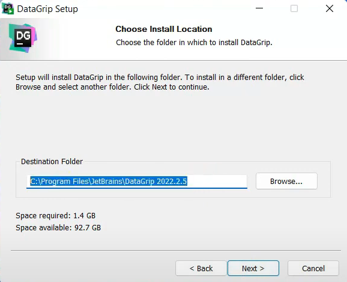 | 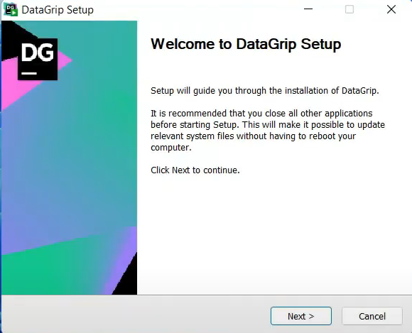                                                           |
| ----------------------------------------------------------------------------------- | ------------------------------------------------------------------------------------------------------------ |
| 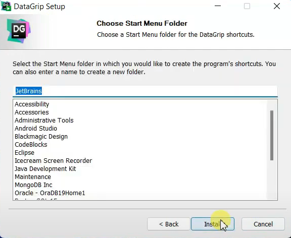                                |  |
|                                                                                     | 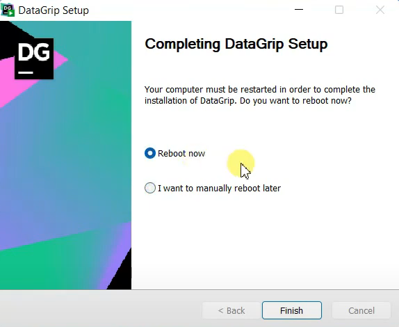<br>                           |

خب حالا نرم افزار رو اجرا کنین و بعد ازش خارج بشین. شما برنامه رو با موفقیت نصب کردین و الان وقت کرک کردنشه که در ادامه بهتون توضیح میدیم.

#### نصب کرک

فایل کرک رو از سایت Soft98 می‌تونین دانلود کنین:

https://dl4.soft98.ir/programing/ja-netfilter-202x.zip

فایل رو از حالت فشرده خارج کنین. پوشه `ja-netfilter` رو داخل درایو `C` کپی کنین و مطمئن شین که حتما DataGrip رو بستین.

به پوشه `scripts` برین و فایل `install-current-user.vbs` و `install-all-users.vbs` رو به ترتیب اجرا کنین و منتظر نمایش پیام Done باشین

نرم افزار رو اجرا کنین و در صورت درخواست کد فعال سازی از نرم افزار خارج شده و دوباره نرم افزار رو اجرا کنین.

### مراحل نصب در مک

روی فایل `.dmg` دانلود شده دوبار کلیک کنین.

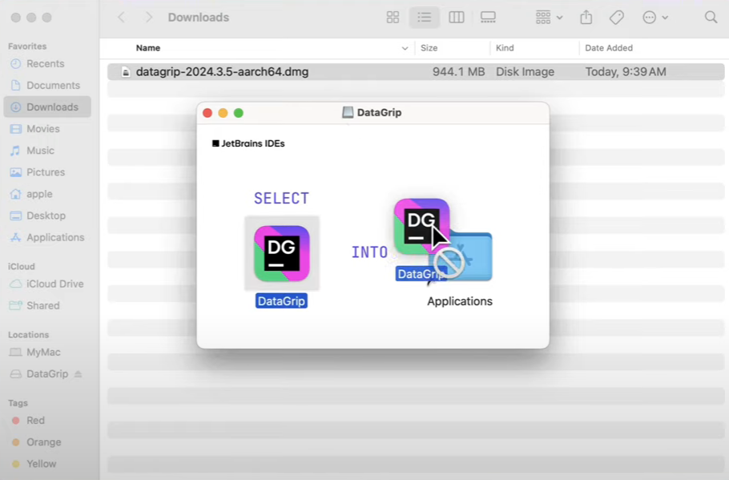

توی صفحه باز شده، آیکون DataGrip رو drag کنین و داخل فولدر مشخص شده drop کنین.

حالا می‌تونین که دیتاگریپ رو داخل اپلیکیشن‌هاتون پیدا کنین. حالا نرم افزار رو اجرا کنین و بعد ازش خارج بشین. شما برنامه رو با موفقیت نصب کردین و الان وقت کرک کردنشه که جلوتر بهتون توضیح میدیم.

#### نصب کرک

فایل کرک رو از سایت Soft98 می‌تونین دانلود کنین:

https://dl4.soft98.ir/programing/ja-netfilter-202x.zip

فایل رو از حالت فشرده خارج کنین. پوشه `ja-netfilter` رو جایی دلخواه کپی کنین.

به پوشه `scripts` برین و فایل بَش (Bash) `install.sh` رو در ترمینال اجرا کنین.

نرم افزار رو اجرا کنین و در صورت درخواست کد فعال سازی از نرم افزار خارج شده و دوباره نرم افزار رو اجرا کنین.

### مراحل نصب در لینوکس

برای نصب DataGrip روی لینوکس، باید فایل فشرده‌ای که از سایت Soft98 دانلود کردین رو از حالت فشرده خارج کنین؛ اول مطمئن شین که توی یه دایرکتوری خالی هستین. حالا با دستور زیر فایل فشرده رو استخراج کنین:

```text
tar -xzf datagrip-20xx.x.x.tar.gz
```

حالا وارد پوشه جدیدی که براتون ایجاد شده برین و در نهایت فایل `bash` رو اجرا کنین:

```text
./datagrip.sh
```

#### نصب کرک

فایل کرک رو از سایت Soft98 می‌تونین دانلود کنین:

https://dl4.soft98.ir/programing/ja-netfilter-202x.zip

فایل رو از حالت فشرده خارج کنین. پوشه `ja-netfilter` رو جایی دلخواه کپی کنین.

به پوشه `scripts` برین و فایل بَش (Bash) `install.sh` رو در ترمینال اجرا کنین. پس از دریافت پیام Done، سیستم رو ریستارت کنین.

نرم افزار رو اجرا کنین و در صورت درخواست کد فعال سازی از نرم افزار خارج شده و دوباره نرم افزار رو اجرا کنین. اگه همچنان دیتاگریپ فعال نشد، فایل `vmoptions` رو تغییر بدین و دستورات موجود در فایل `Readme` رو وارد کنین.

## ساخت اکانت در Liara

کافیه که وارد سایت [لیارا](https://liara.ir/) بشین و روی "ورود یا ثبت‌نام" کلیک کنین:

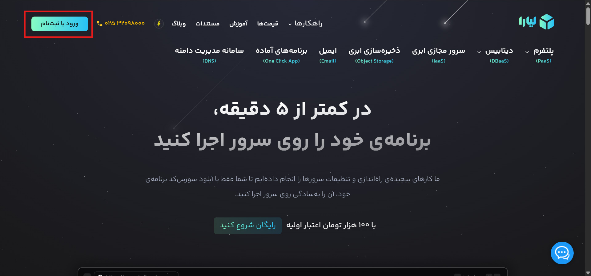

با هر روشی که خواستین ثبت‌نام کنین؛ در این آموزش ما از "ورود با ایمیل" ثبت‌نام رو ادامه می‌دیم:


در این قسمت اطلاعات خواسته شده رو وارد کنین:

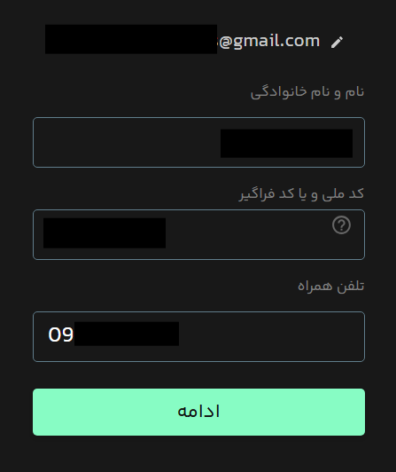

در آخر ازتون می‌خواد که یه رمزعبور تعیین کنین؛ بعد از این مراحل باید وارد پنل کاربریتون شده باشین. برای اینکه بتونین از سرویس‌ها استفاده کنین، باید اول پروفایل خودتون رو تکمیل کنین. برای اینکار می‌تونین از همون پنل کاربریتون مستقیم به صفحه مربوطه برین:

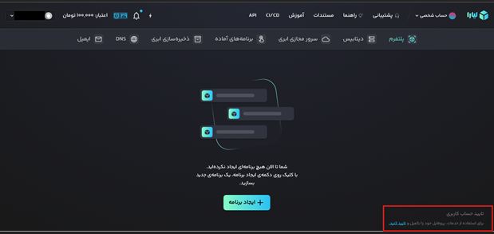

در این مرحله باید ایمیل و شماره تلفنی که وارد کردین رو تایید کنین؛ برای اینکار کافیه که برای هر فیلد کد تایید رو ارسال کنین و در اون قسمتی که براتون باز میشه وارد کنین:

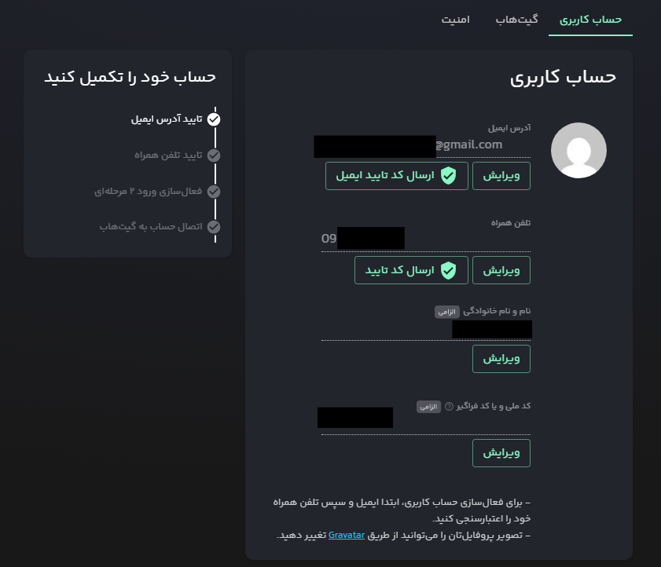

بعد از اینکه ایمیل و تلفن همراهتون رو تایید کردین حالا می‌تونین اولین سرویس دیتابیس‌تون رو راه‌اندازی کنین!

### راه‌اندازی سرویس دیتابیس

وارد تب "دیتابیس" بشین و روی "ایجاد دیتایس" کلیک کنین:

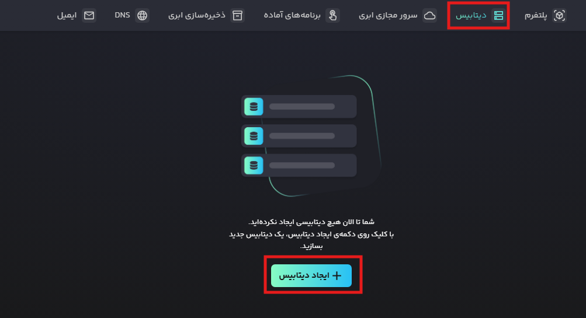

در این قسمت باید ویژگی‌های سرویس دیتابیسی که می‌خواین راه‌اندازی کنین رو مشخص کنین؛ برای شروع نوع دیتابیس رو MySQL انتخاب کنین:

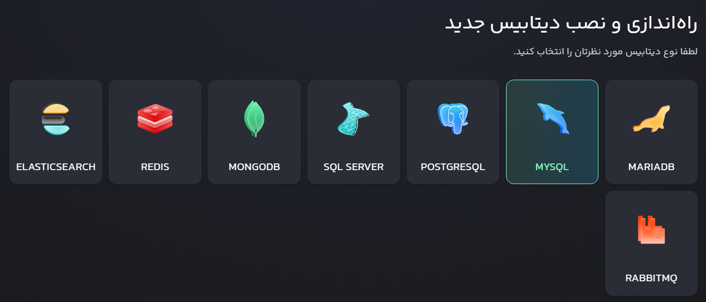

در قسمت بعدی ورژن دیتابیس رو جدیدترین نسخه انتخاب کنین و همچنین برای دیتابیستون یه شناسه تعریف کنین:

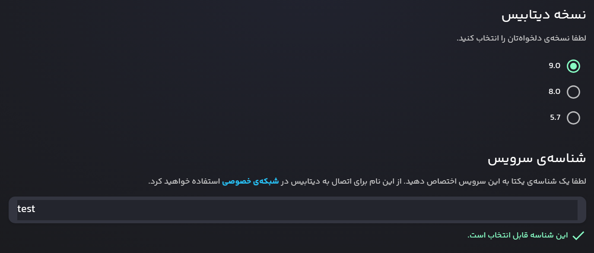

همونطور که در توضیحات تصویر بالا می‌بینین، شناسه بیشتر کاربردش در فضای "شبکه‌ی خصوصی" دیده میشه؛ حالا شاید بپرسین که یعنی چی؟ خب همونطور که شاید حدس زده یا دیده باشین، لیارا علاوه بر دیتابیس، سرویس‌های دیگه‌ای هم ارائه می‌ده و شما به عنوان یه توسعه دهنده شاید به ارتباط و اجرای چندین سرویس به طور همزمان نیازمند باشین و خب لیارا این اجازه رو می‌ده که این سرویس‌های مرتبط رو توی فضای داخلی ابری پیاده‌سازی کنین و روی بستر شبکه خصوصی بتونین بهشون متصل بشین. خیلی نگرانش نباشین و در اینجای کار بهش نیاز پیدا نمی‌کنین اما خوبه که یه دید کلی به این موضوع داشته باشین!

تیک "دسترسی از طریق شبکه‌ی عمومی" رو بزنین:

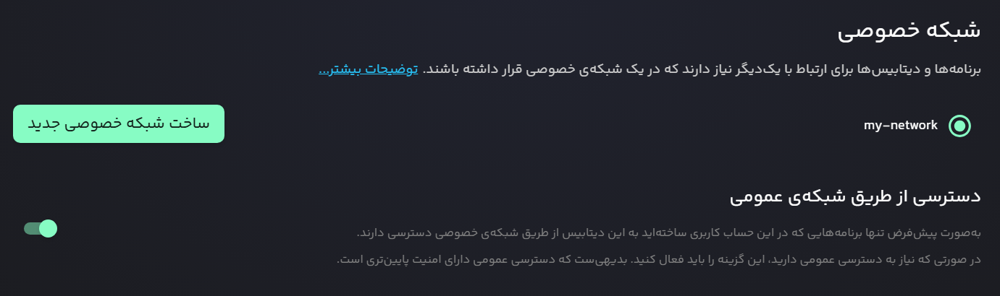

حالا باید یه پلن منابع انتخاب کنین. بسته به این‌که قراره چه کاری با دیتابیس انجام بدین، باید یه بسته انتخاب کنین که هم به نیازتون بخوره، هم خیلی زود اعتبار حسابتون تموم نشه. برای این آموزش پیشنهاد می‌کنم بسته‌ی "زمین" رو بردارین، چون هم برای تست و تمرین کافیه، هم باعث نمی‌شه اعتبار اولیه‌ای که لیارا بهتون داده زود مصرف شه:

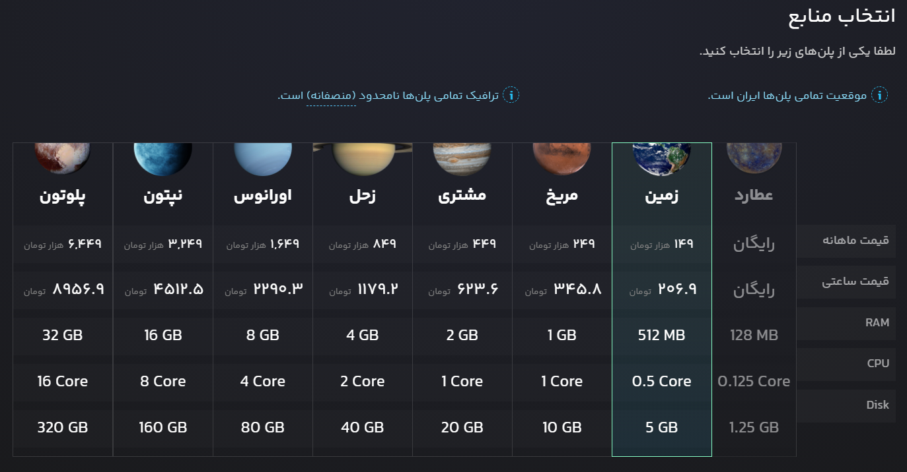

در آخر باید بسته‌ی امکانات رو مشخص کنین. چون الان توی مرحله‌ی تست و یادگیری هستیم و نیازی به امکانات عجیب‌غریب نداریم، همون بسته‌ی برنزی برامون کافیه. برای شروع کار و تست، این بسته هم سبکه، هم به‌صرفه‌ست: 


و در انتهای صفحه روی "راه‌اندازی و نصب دیتابیس" کلیک کنین.

در نهایت باید با همچین صحنه‌ای مواجه بشین:

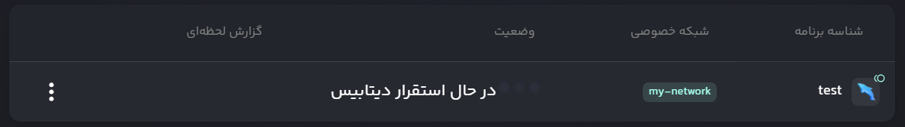

پس از چند دقیقه باید با وضعیت  روشن مواجه میشین.

بهتون تبریک می‌گم سرویس دیتابیس‌تون با موفقیت راه‌اندازی شد و حالا آماده‌ست تا بهش وصل بشین و کارتون رو شروع کنین!

### اتصال با DataGrip

حالا که دیتابیس‌مون راه‌اندازی شده و روشنه وقت اونه که بتونیم از طریقی به اون وصل بشیم. برای اینکار نرم‌افزار DataGrip رو اجرا کنین و یه پروژه ایجاد کنین. توی نوار سمت چپ، قسمت "Database Explorer" روی این آیکون کلیک کنین:


حالا روی + کلیک کنین و MySQL رو پیدا و انتخاب کنین:

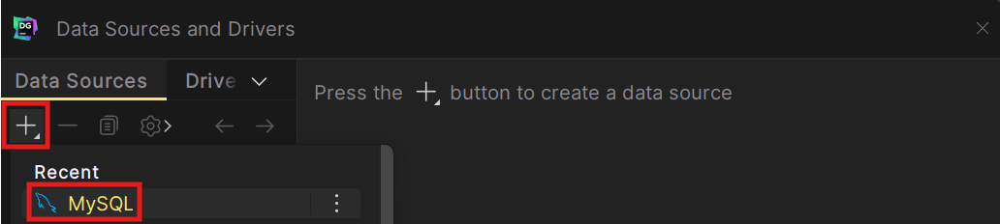

حالا با پنل رو به رو مواجه میشین که از ما یه سری اطلاعات از سرور دیتابیس‌مون می‌خواد:


برای اینکه این مشخصات رو از سرویس دیتابیس‌تون پیدا کنین باید وارد پنل کاربریتون در لیارا بشین و روی دیتابیسی که به تازگی در لیارا ساختیم کلیک کنین و روی تب "نحوه‌ی اتصال" کلیک کنین:


حالا باید با این پنل مواجه شده باشین:

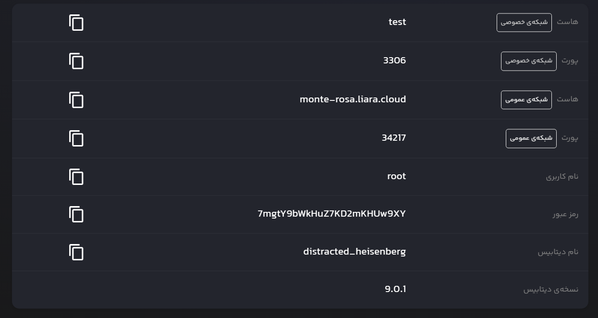

همون‌طور که می‌بینین، همه‌ی اطلاعاتی که DataGrip لازم داره، اینجا جلوتونه. حالا فقط کافیه این اطلاعات رو توی DataGrip وارد کنین. فقط یه نکته مهم، حواستون باشه فقط اون فیلدهایی که جلوی عبارت "شبکه‌ی عمومی" نوشته شدن رو وارد کنین، چون DataGrip از همین مسیر به دیتابیس وصل می‌شه. پس از اینکه مشخصات رو وارد کردین، می‌تونین "Test Connection" رو بزنین که ببینین اطلاعات وارد شده درست بوده و DataGrip تونسته به سرور وصل بشه یا نه:

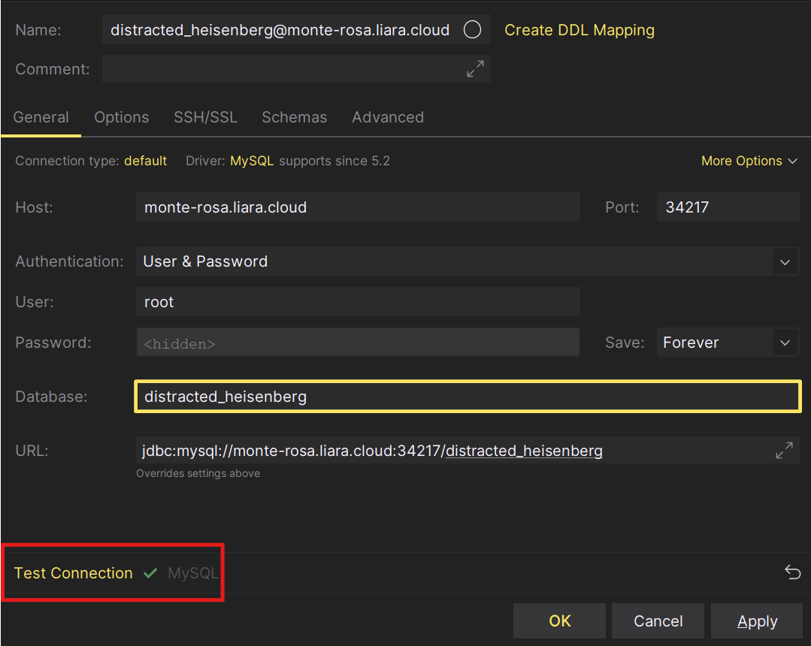

بعد از اینکه مطمئن شدین به درستی به سرور متصل شدین OK کنین و بعد از اینکه OK کردین، DataGrip براتون یه console باز می‌کنه که از طریق اون می‌تونین با دیتابیس‌تون ارتباط برقرار کنین و کوئری بزنین.

حالا وقتشه یه کوئری کوچیک بزنیم تا ببینیم واقعاً با دیتابیس در ارتباطیم یا نه (اگه DataGrip براتون consoleای ایجاد نکرده کافیه که از ستون سمت چپ دیتابیس‌تون رو پیدا کنین و روش راست‌کلیک کنین، گزینه‌ی New → Query Console رو بزنین تا یه پنجره کوئری جدید باز شه).

توی کنسول ایجاد شده، این کوئری رو بنویسین و روی  کلیک کنین تا کوئری اجرا بشه:

```sql
SELECT NOW();
```

اگه همه چی درست باشه، باید یه زمان دقیق (تاریخ و ساعت) برگرده که نشون می‌ده دیتابیس داره کار می‌کنه و جواب می‌ده:

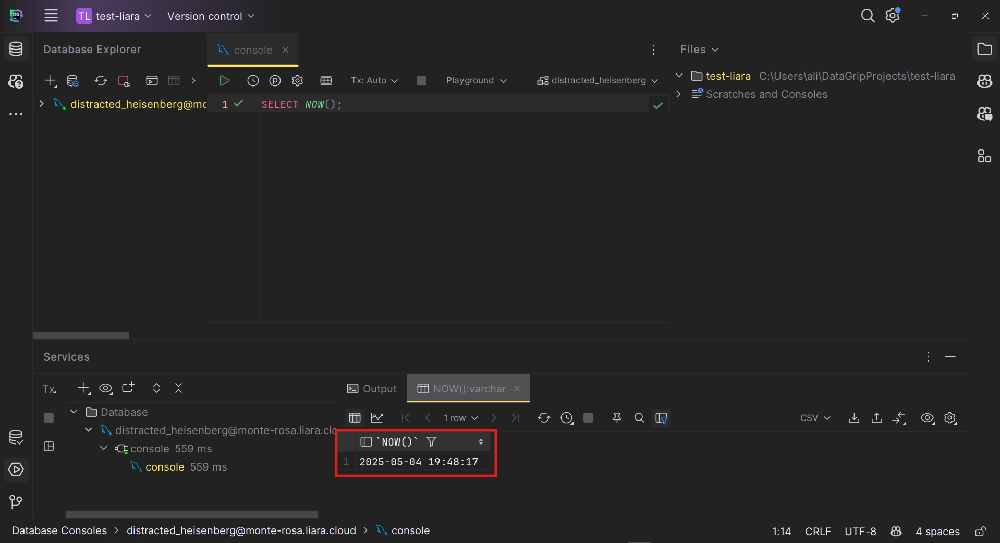

بیاین که یه جدول درست کنیم و بهش چندتا کوئری بزنیم:

```sql
CREATE TABLE students (  
id INT PRIMARY KEY,  
name VARCHAR(50),  
age INT  
);
```

همونطور که نوشتیم تیبل `students` از یه فیلد `name` و `age` تشکیل شده.

حالا چندتا داده‌ی آزمایشی وارد کنین:

```sql
INSERT INTO students (id, name, age) VALUES  
(1, 'Ali', 20),  
(2, 'Sara', 22),  
(3, 'Reza', 19);
```

و در نهایت با یه `SELECT` ساده مطمئن شین که همه‌چی درسته:

```sql
SELECT * FROM students;
```


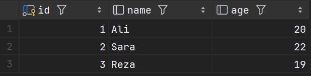

حالا که دیتابیس‌تون راه افتاده و بهش وصل شدین، اگه فعلاً کاری باهاش ندارین، بهتره خاموشش کنین تا اعتبارتون هدر نره. چون حتی اگه استفاده‌ای نکنین، تا وقتی که سرویس روشنه، هزینه از اعتبارتون کم می‌شه. برای خاموش کردن دیتابیس توی پنل لیارا:

برین به داشبورد لیارا.

از منوی سمت راست وارد قسمت دیتابیس‌ها بشین.

دیتابیس مورد نظر رو انتخاب کنین.

روی "خاموش کردن" کلیک کنین:

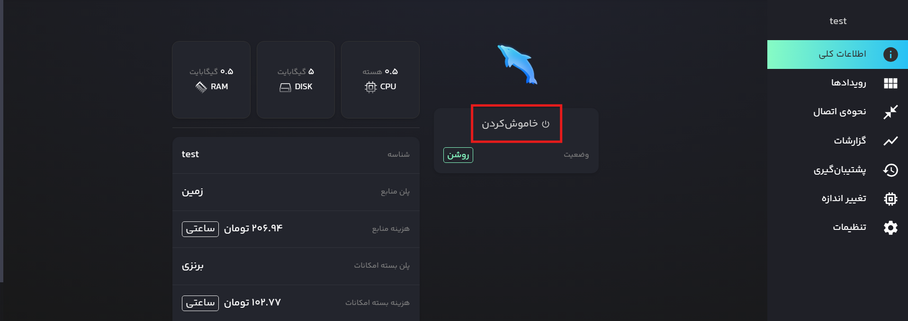

بعد از اینکه سرویس‌تون خاموش شد، حالا با این پیام مواجه میشین که :


با این توضیح اگر دیگه با دیتابیس test کاری ندارین، بهتره که به طور کلی اون رو پاک کنین! اما اگه بهش بعدا نیاز پیدا می‌کنین که همینجوری بذارین بمونه.

برای حذف سرویس دیتابیس کافیه که وارد صفحه "دیتابیس" بشین و روی سه نقطه کنار سرویس دیتابیس‌تون کلیک کنین و "حذف دیتابیس" رو انتخاب کنین:

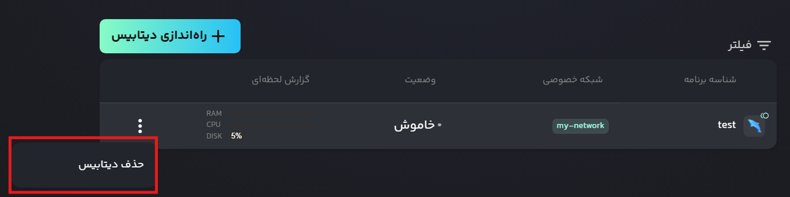

به طور کلی لیارا به صورت ساعتی هزینه‌ی سرویس‌های فعال رو حساب می‌کنه. یعنی حتی اگه از دیتابیس استفاده نکنین ولی روشن باشه، از اعتبار حساب کم می‌شه. هر پلنی یه نرخ مشخصی داره. مثلاً اگه پلن «زمین» رو انتخاب کرده باشین، حدودی 200 تومن در ساعت کم می‌شه (عدد دقیق رو از لیارا می‌تونین ببینین). پس اگه دیدین چند ساعت با دیتابیس کاری ندارین، بهتره خاموشش کنین که اعتبارتون بیشتر بمونه.

## نصب و راه‌اندازی MySQL

برای نصب کافیه از [وبسایت رسمی خود MySQL](https://www.mysql.com/) استفاده کنین و نسخه و راهنمایی‌های مدنظرتون رو پیدا و دنبال کنین. فقط توجه کنین که سایت MySQL برای آی پی ایران تحریمه.

همچنین میتونین که مراحل آموزش نصب رو هم از روی این ویدیو دنبال کنین:

[SQL Course for Beginners [Full Course]](https://www.youtube.com/watch?v=7S_tz1z_5bA&t=290s)


### اتصال با DataGrip

حالا که MySQL رو نصب کردین و سرور آن به طور لوکال روی سیستم‌تون نصب و راه‌اندازی شده، وقت اونه که بتونیم از طریقی به اون وصل بشیم. برای اینکار نرم‌افزار DataGrip رو اجرا کنین و یه پروژه ایجاد کنین. توی نوار سمت چپ، قسمت "Database Explorer" روی این آیکون کلیک کنین:

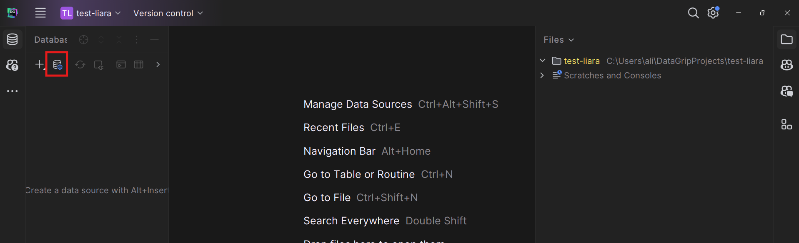

حالا روی + کلیک کنین و MySQL رو پیدا و انتخاب کنین:


حالا با پنل رو به رو مواجه میشین که از ما یه سری اطلاعات از سرور دیتابیس‌مون می‌خواد:


اگر تنظیمات پیش‌فرض MySQL Server رو تغییر نداده باشین، با تنظیمات زیر می‌تونین به سرور وصل بشین (با کلیک کردن روی "Test Connection" می‌تونین مطمئن بشین که تونستین به سرور وصل بشین یا نه):

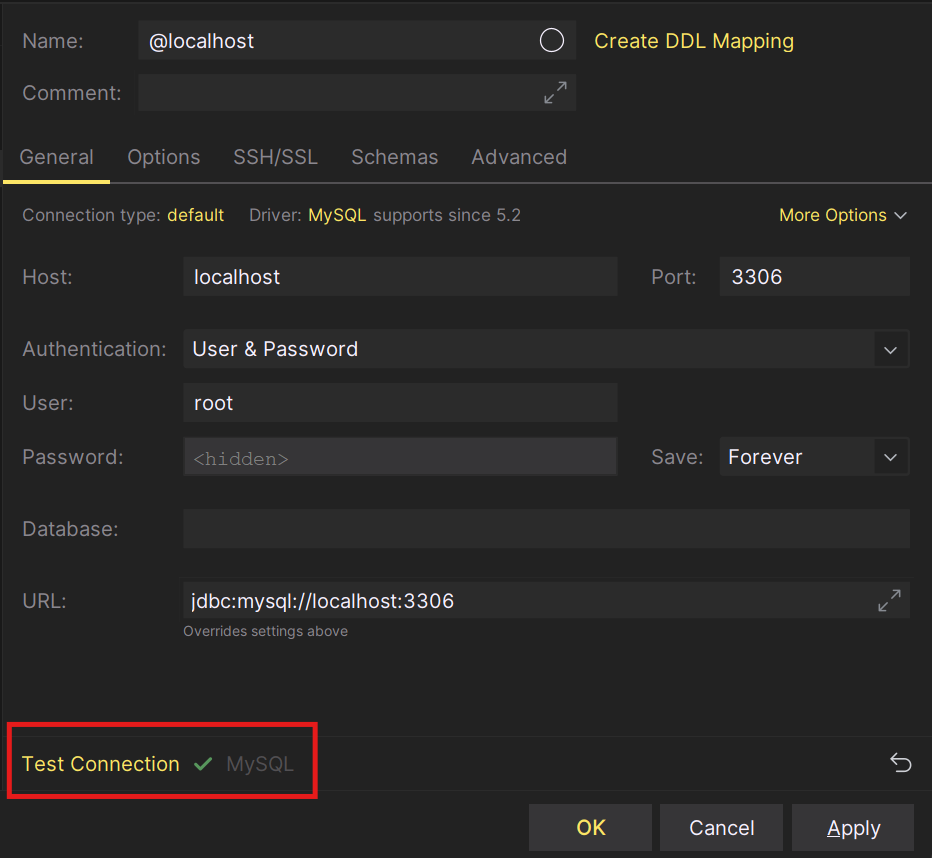

بعد از اینکه مطمئن شدین به درستی به سرور متصل شدین OK کنین و بعد از اینکه OK کردین، DataGrip براتون یه console باز می‌کنه که از طریق اون می‌تونین با دیتابیس‌تون ارتباط برقرار کنین و کوئری بزنین.

حالا وقتشه یه کوئری کوچیک بزنیم تا ببینیم واقعاً با دیتابیس در ارتباطیم یا نه (اگه DataGrip براتون consoleای ایجاد نکرده کافیه که از ستون سمت چپ دیتابیس‌تون رو پیدا کنین و روش راست‌کلیک کنین، گزینه‌ی New → Query Console رو بزنین تا یه پنجره کوئری جدید باز شه).

### کار با دیتابیس‌های پیش‌فرض MySQL

وقتی MySQL رو نصب می‌کنید، به صورت پیش‌فرض چندین دیتابیس آماده و از قبل ساخته شده به شما داده می‌شه. این دیتابیس‌ها به شما کمک می‌کنن تا بتونین برای آزمایش و کارهای مختلف ازشون استفاده کنین.

توی کنسول ایجاد شده، این کوئری رو بنویسین و روی  کلیک کنین تا کوئری اجرا بشه:

```sql
SHOW DATABASES;
```

اگه همه چی درست باشه، باید یه لیستی از دیتابیس‌های موجود برگرده که نشون می‌ده دیتابیس داره کار می‌کنه و جواب می‌ده:

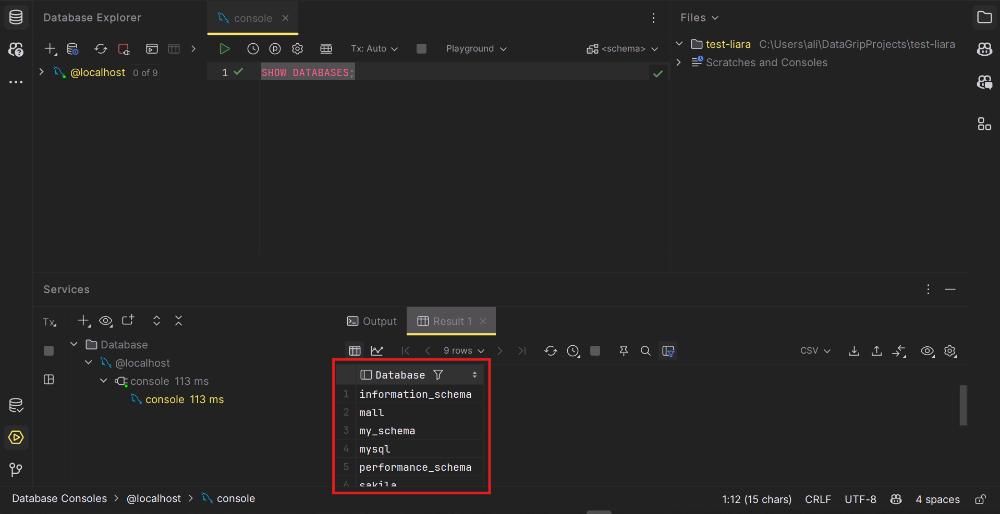

بیاین که به دیتابیس world وصل بشیم و بهش چندتا کوئری بزنیم:

```sql
USE world;  
SHOW TABLES;
```

که خروجی شبیه این داره:

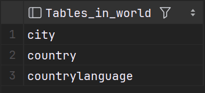

حالا بیاید چندتا کوئری به تیبل `country` بزنیم:

```sql
SELECT Name, Continent FROM country LIMIT 10;
```

خروجی احتمالا باید شبیه این باشه:

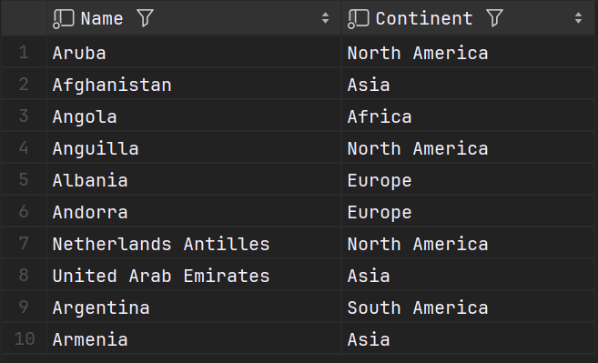

## چه چیزی یادگرفتیم؟

توی این داک فهمیدیم که:

- DBaaS و MySQL چیه.
- چجوری توی لیارا اکانت و یه دیتابیس بسازیم.
- چطوری MySQL رو روی سیستم‌مون نصب کنیم.
- بهشون از طریق DataGrip وصل بشیم.
- چطوری حواسمون به هزینه‌ها در لیارا باشه.
- چطوری دیتابیس‌های پیش‌فرض MySQL رو ببینیم.
- چطوری چندتا کوئری ساده به دیتابیس MySQLامون بزنیم.