## مقدمه

> **"In God we trust. All others must bring data."** 
— W. Edwards Deming

تا به این‌جای کار، برنامه‌های شما راه خاصی برای ذخیرهٔ اطلاعاتشون بعد از اتمام اجرا نداشتن. اگر برنامه‌ای رو اجرا می‌کردید و می‌بستیدش، هر object و variable و هر چیزی که توی مموری ذخیره کرده بودین برای همیشه از دست می‌رفت و راهی هم برای برگردوندنش نبود![^1]

همون‌طور که احتمالا حدس زدین، برنامه‌های جدی‌تر، این‌طور کار نمی‌کنن. هر بار که یک سایت خراب می‌شه و برنامه‌ش از کار می‌افته، کل دیتاش از بین نمی‌ره. تقریبا تمام این برنامه‌ها، برای ذخیرهٔ داده‌هاشون از database ها استفاده می‌کنن. توی این داک، می‌خوایم اولین نگاه‌هامون رو به دیتابیس‌ها بندازیم و ببینیم چطور می‌تونیم ازشون استفاده کنیم.

## ‏Relational Database ها

فرض کنید یه برنامهٔ todo list درست کردین. توی این برنامه، شما یه کلاس `Task` دارین که کارهای مختلف کاربر رو نشون می‌ده و هر `Task`، ممکنه چند قدم (`Step`) داشته باشه. مثلا ممکنه یک `Task` به اسم «پروژهٔ AP» داشته باشین که شامل سه `Step` مثل «خوندن داکیومنت پروژه»، «نوشتن کد» و «تست کد» باشه.

شما یاد گرفتین که چطور کلاس‌های این todo list رو درست کنید. کد جاوای زیر این دو کلاس رو توصیف می‌کنه:

```java
public class Task {
    public String name;
    public Date dueDate;
    public ArrayList<Step> steps;  
}

public class Step {
    public String name;  
}
```

فرض کنید برنامهٔ شما برای مدتی کار کرده و کاربر، `Task` ها و `Step` های مختلفی برای خودش تعریف کرده. خیلی هم عالی. ولی هیچ‌کدوم از ما نمی‌خوایم عصبانیت کاربرهاتون، بعد از این که todo list شون رو دوباره باز کردن و دیدن همهٔ `Task` ها و `Step` هایی که تعریف کردن پریده رو ببینیم! چطور این دیتا رو توی یه database ذخیره می‌کنید؟

### ‏Relational Databaseها چی هستن؟
این دیتابیس‌ها (Relational Databaseها)، به شما اجازه می‌دن که داده‌هاتون رو، توی جدول‌‌های مختلف ذخیره کنید.[^2] مثلا برای todo list تون، می‌تونید یه جدول به شکل زیر درست کنید:

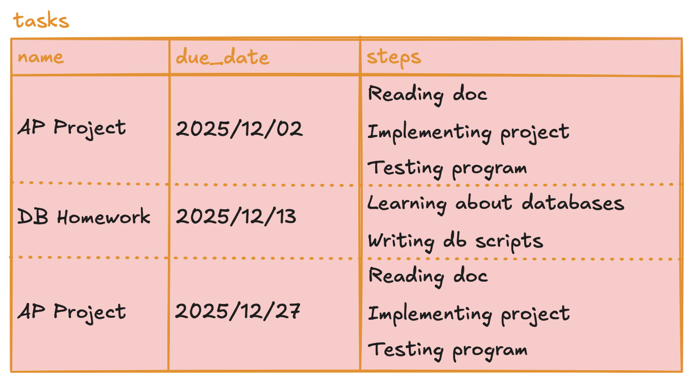

این جدول، به خوبی می‌تونه تمام داده‌های برنامهٔ شما رو نشون بده. هر کدوم از فیلدهای Task توی برنامهٔ جاواتون، این‌جا یک ستون دارن. توی relational database ها، به همچین جدولی یک relation یا table می‌گیم، به هر سطر اون یک record می‌گیم و به هر ستونش هم یک field می‌گیم. به همین سادگی! این جدول، به تنهایی یک دیتابیس کامله و هیچ مشکلی نداره. مگه نه؟ مگه نه؟

#### ‏tableمون یه خورده مشکل داره

‏ببخشید که باید اینو بگیم، ولی table بامزهٔ کوچولوی ما چندان هم بی‌مشکل نیست. ولی خبر خوب این که این مشکلات، نسبتا راحت برطرف می‌شن. بیاین به ترتیب این مشکلات رو ببینیم و با هم حل‌شون کنیم.

### کدوم AP Project؟

فرض کنید که کاربر بهتون بگه که «تسک AP Project رو بهم نشون بده». همون‌طور که توی دیتابیس می‌بینید، کاربر دوتا تسک به این اسم تعریف کرده. کدومش رو نشونش می‌دید؟

ریشهٔ مشکل اینه که ما راهی برای تمایز دو `Task` نداریم. این که روی یکتا بودن اسم `Task` حساب باز کنیم کار خوبی نیست، و اگر کاربر دو `Task` کاملا یکسان تعریف کنه ما نمی‌تونیم بفهمیم که کدومشون کدومه. چه کار کنیم که این مشکل برطرف بشه؟ این‌جا اون‌جاییه که باید متوقف شید و به راه حل این موضوع فکر کنید...

برای حل این مشکل، بیاین یه ستون جدید به اسم `id` درست کنیم و یک عدد یکتا به هر `Task` نسبت بدیم:

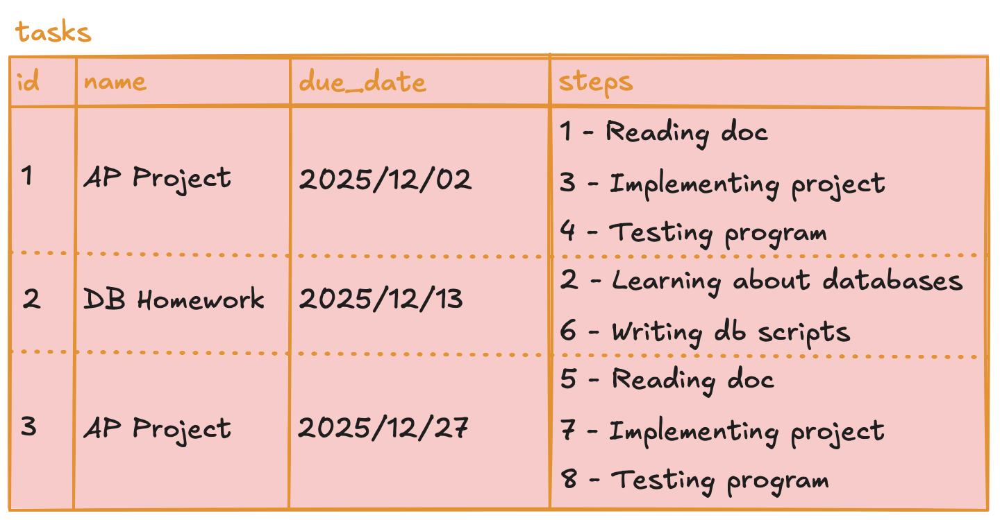

می‌بینید که علاوه بر `task‌` ها، من یک `id` برای هر `step` هم گذاشتم تا خود `step` ها هم از هم دیگه قابل تمایز باشن. حالا به جای این که بگیم «تسکی به اسم AP Project رو بهم بده»، می‌تونیم بگیم «تسکی با `id` ی ۳ رو بهم بده» و معلومه که داریم راجع به تسک سوم لیست بالا صحبت می‌کنیم.

این ستون انقدر پر کاربرده که اسم خودش رو داره و بهش primary key می‌گن. اسمش یادتون بمونه که بعدا باهاش کار داریم.

خب، one problem down. بیاین به سراغ مشکل بعدی‌مون بریم.

### پیدا کردن قدم‌ها

پردازش ستون‌های این دیتابیس‌ برای شما کار راحتیه. اگر کاربر ازتون تمام تسک‌هایی که اسمشون `AP Project` ‍ه رو بخواد، می‌تونید با جستوجو توی ستون `name` اون‌ها رو بهشون نشون بدید. اگر ازتون تسک‌هایی که `due date` شون قبل یه تاریخ خاصه رو بخواد هم به راحتی ستون `due date` رو نگاه می‌کنید.

ولی اگر کاربر ازتون بخواد که قدمی که `id` ش ۶ ‍ه رو بهش بده چطور؟ اطلاعات قدم‌ها، از اسمشون و `id` شون و هر اطلاعات اضافه‌ای که راجع بهشون ذخیره کردید، همه و همه توی فقط یک ستون جدول‌تون ذخیره شده. خلاصه‌ش که که شما راه چندان خوبی برای پردازش درخواست‌های کاربر برای `step` ها ندارید.

و مشکل حتی بدتر هم می‌شه. فرض کنید که شما می‌خواستید به کاربر امکان فهرست‌بندی task هاش رو هم بدین. کاربر ممکنه فهرستی به اسم «دانشگاه» برای تسک‌های دانشگاهی‌ش تعریف کنه، فهرستی به اسم «شرکت» برای تسک‌های شرکتی‌ش، و الی آخر. یه چیزی مثل این:

```java
public class TaskList {
    public int id;
    public String name;
    public ArrayList<Task> tasks;  
}
```

حالا دیتابیس‌تون چه شکلی می‌شه؟ فرض کنید مثل table های قبلی‌تون، task ها رو به عنوان ستونی از جدول `task_lists` تعریف کنید:

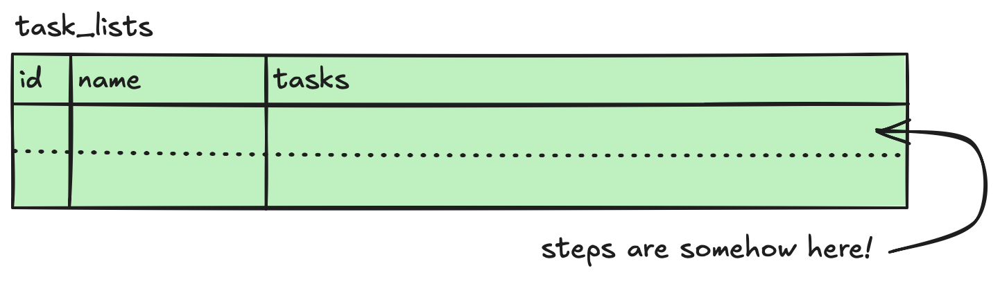

حالا چطور `step` هاتون رو تعریف می‌کنید؟ ستونی از ستون `tasks`؟ نه تنها این کار مشکلات خودش رو داره[^3]، بلکه ستون‌هاتون هم، خیلی سریع، خیلی پیچیده می‌شن!

ریشهٔ مشکل این‌جاست که توی یکی از ستون‌های دیتابیس‌تون، کل اطلاعات چندتا از record هاتون رو چپوندین. چطور می‌تونید این مشکل رو حل کنید؟ (متوقف شید و فکر کنید.)

راه حلش اینه که برای `step` ها، به کل یه table جداگانه درست کنیم. برای این که بدونیم کدوم `step` متعلق به چه `task` ایه، یه ستون به اسم `task_id` به این table اضافه می‌کنیم که `id` تسک مرتبط با این قدم رو نگه می‌داره[^4]:

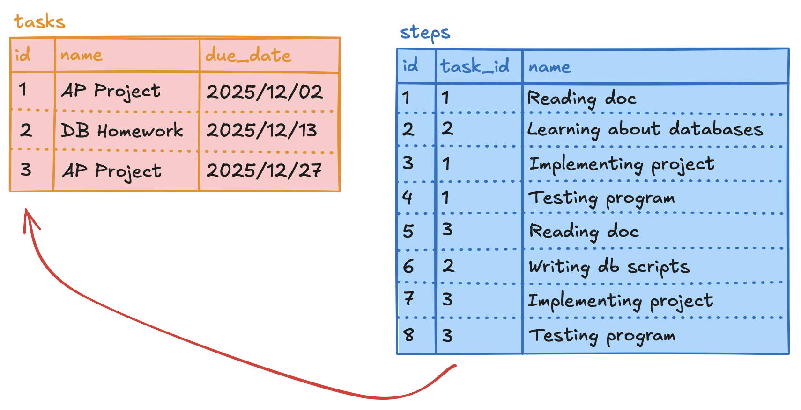

خیلی خب، خیلی بهتر شد. الآن به جای این که تمام فیلدهای چند `step` مختلف توی یه جدول زور چپون شده باشه، `step` ها table مستقل خودشون رو دارن. اضافه کردن فهرست‌های دوست‌داشتنی کاربرها به برنامه‌تون هم، از همیشه ساده‌تره. کافیه به جدول tasks ستونی به اسم `task_list_id` اضافه کنید:

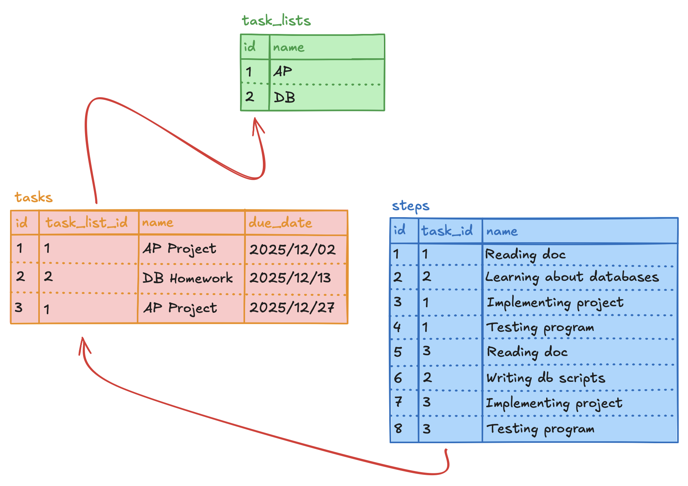

شاید این طراحی به چشم شما، انسانِ خواننده، پیچیده بیاد. ولی باور کنید کامپیوترتون بابت ثانیه به ثانیه وقتی که موقع پردازش این داده‌ها صرفه‌جویی می‌کنه دعاتون می‌کنه!

وقتی که هیچ‌کدوم از جداول دیتابیس شما، فیلدهای دردسر سازی مثل `steps`، `tasks` یا هر فیلدی که همزمان شامل چند record ‍ه نداشته باشن، به اون دیتابیس «نرمال سطح اول» یا «first normal form (NF1)» می‌گن. به بهبود کیفیت دیزاین دیتابیس‌ها هم normalization می‌گن.

### اطلاعات متناقض

بیاین یه فیچر به todo list مون اضافه کنیم. فرض کنید یه شرکت بزرگ برای مدیریت taskهای کل شرکت از این todo list استفاده می‌کنه و می‌خواد هر `task` رو به یکی از کارمندهای شرکت اختصاص بده. برای این کار، ما اطلاعات کارمند مسئول هر `task` رو توی خود کلاس `Task` می‌نویسیم:

```java
public class Task {
    public int id;
    public int taskListId;
    public String employeeName;
    public String employeeNationalId;
    public String name;
    public Date dueDate;  
}
```

فیلدهای `employeeName` و `employeeNationalId` به ترتیب اسم و کد ملی کارمند مسئول این task رو نشون می‌دن.[^5] حالا اگر بخوایم به هر تسک یک کارمند اختصاص بدیم، از کد زیر استفاده می‌کنیم:

```java
apProject1.employeeName = "Gholi";  
apProject1.employeeNationalId = "1234567890";  
dbHomework.employeeName = "Torob";  
dbHomework.employeeNationalId = "9087653421";  
apProject2.employeeName = "Mamad";  
apProject2.employeeNationalId = "1234567890";
```

اگر بخوایم جدول tasks معادل این کلاس بمونه، باید ستون‌های `employee_name` و `employee_national_id` هم بهش اضافه کنیم.

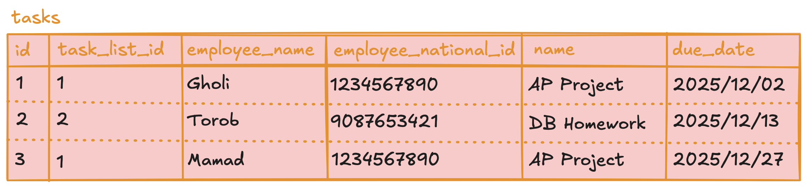

خب، دیتابیس‌مون هنوزم کار می‌کنه. ولی اگر دقت کنید، کد ملیِ قلی و ممد توی دیتابیس بالا یکسانه. احتمالا وقتی یکی داشته تسک سوم رو وارد می‌کرده، به جای اسم قلی، ممد رو نوشته. این اشتباه، علاوه بر بی‌دقتی کاربر todo list شما، ضعف دیزاینتون رو هم نشون می‌ده. چه کار می‌تونستیم بکنیم که جلوی بی‌دقتی کاربر رو بگیریم؟

بیاین اول مشکل رو توی کد جاوامون حل کنیم و این کد رو یه خورده تمیزتر بنویسیم. کلاس `Employee` رو جدا می‌کنیم، و توی کلاس `Task` فقط یک فیلد از جنس `Employee` رو نگه می‌داریم:

```java
public class Employee {
    public String name;
    public String nationalId;  
}

public class Task {
    public int id;
    public int taskListId;
    public Employee responsibleEmployee;
    public String name;
    public Date dueDate;  
}
```

بعد از این کار، لازمه برای هر کارمند یک آبجکت `Employee` درست کنیم:

```java
Employee gholi = new Employee("Gholi", "1234567890");  
Employee torob = new Employee("Torob", "9087653421");
```

و بعدش، از همین آبجکت‌ها موقع اختصاص دادن تسک‌ها به هر کارمند استفاده می‌کنیم:

```java
apProject1.responsibleEmployee = gholi;  
dbHomework.responsibleEmployee = torob;  
apProject2.responsibleEmployee = gholi;
```

چون توی کد بالا، از آبجکت `gholi` برای هر دو تسک `apProject1` و `apProject2` استفاده کردیم، دیگه ممکن نیست که اسم قلی به اشتباه نوشته بشه.

بیاین جداول دیتابیس‌مون هم بر این اساس تغییر بدیم. یک جدول به اسم employees، معادل کلاس `Employee` درست می‌کنیم و به جدول tasks هم یه ستون به اسم `employeeId` اضافه تا `id` کارمند مسئول اون تسک رو نشون بده:

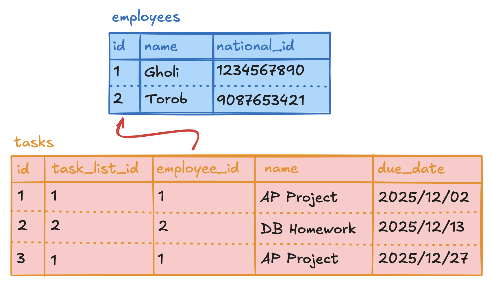

دیتابیس ما، به لحاظ دیزاین یک سطح بهتر شد. الآن که داده‌های نامربوط به `task` رو به جدول خودشون منتقل کردیم، دیتابیس ما توی «سطح دوم نرمال‌سازی» یا «second normal form (NF2)» ‍ه.

### قدم‌های تموم شده

الآن todo list شما از همیشه بزرگ‌تر شده و کلی شرکت بزرگ و کوچیک ازش استفاده می‌کنن. این شرکت‌ها می‌خوان بدونن که کارمندهاشون از هر تسک، چند قدم رو انجام دادن. برای این کار، شما اول ستون `is_completed` رو به جدول `steps` اضافه می‌کنید تا وضعیت هر قدم مشخص بشه. بعد از اون، ستون‌های `total_number_of_steps` و `number_of_completed_steps` هم به جدول `tasks` اضافه می‌کنید که به ترتیب، تعداد کل قدم‌ها و قدم‌های انجام شدهٔ هر تسک رو نشون بدن:

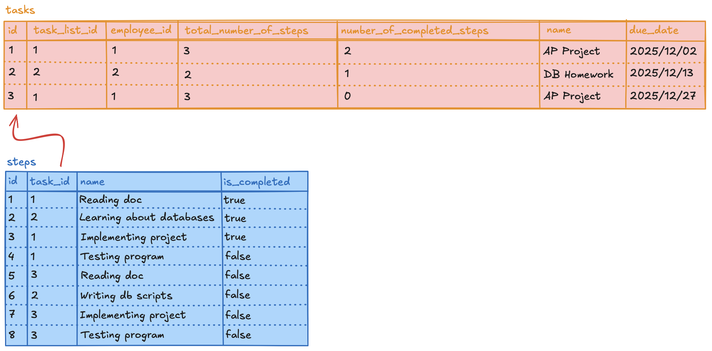

چک کنید که اطلاعات ستون‌های جدید `tasks` و ستون `is_completed` منطبق باشن. همون‌طور که می‌بینید، تسک اول ۲ قدم انجام شده داره (قدم‌های «Reading doc» و «Implementing project»)، تسک دوم ۱ قدم انجام شده داره (قدم «Learning about databases») و تسک سوم هیچ قدم انجام شده‌ای نداره.

دیتابیس ما درست کار می‌کنه! ولی خب، به چه قیمتی؟ هر برنامه‌نویس باید حواسش باشه که اگر جایی از کد، وضعیت یک `step` رو به «انجام شده» تغییر داد، حتما ستون `number_of_completed_steps` هم تغییر بده، و اگر `step` ای رو به `task` ای اضافه کرد، ستون `total_number_of_steps` هم عوض کنه. فرض کنید یه برنامه‌نویسی این رو یادش بره، اون وقت توی دیتابیس شما اطلاعات متناقض ثبت می‌شه:

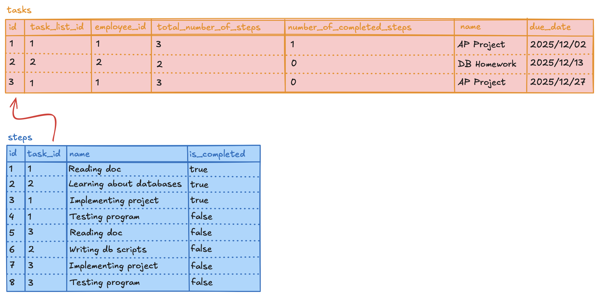

همون‌طور که می‌بینید، توی جداول بالا مقادیر ستون `number_of_completed_steps` درست نیستن.[^6] شما چطور می‌تونستید با دیزاینی بهتر، به کل جلوی این اشتباه برنامه‌نویس‌ها رو بگیرید؟ (متوقف شید و فکر کنید)

راه حل اینه که ساده‌تر فکر کنید! کلا از دست دو ستون جدید جدول `tasks` خلاص بشید:

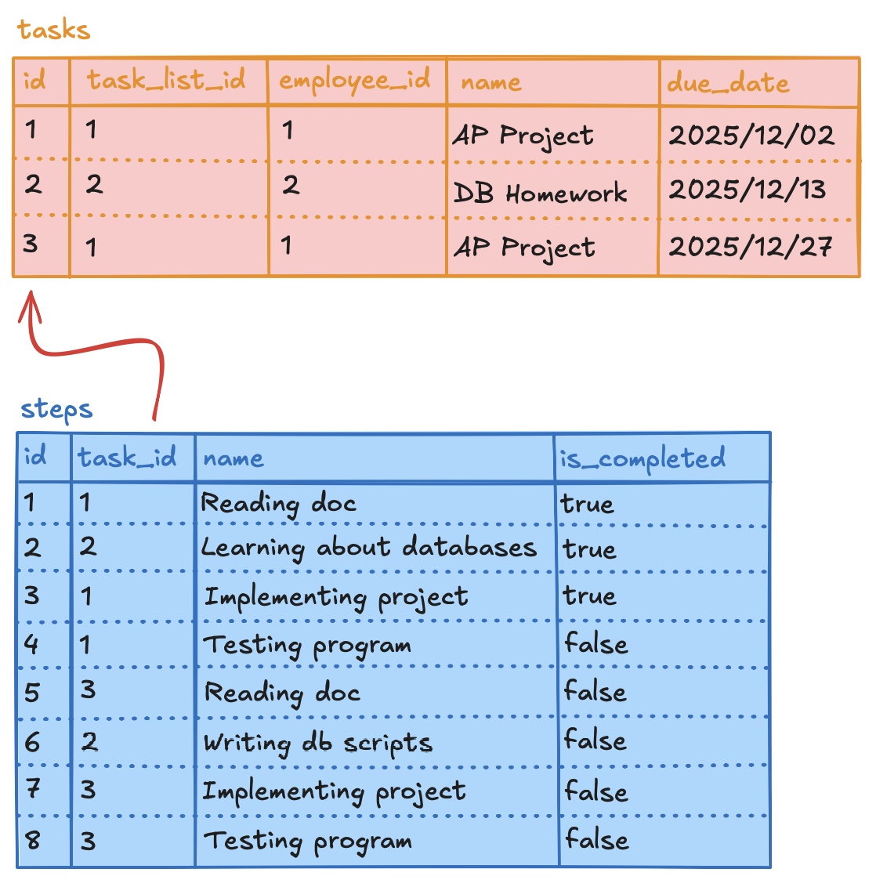

حالا اگر کاربر ازتون تعداد کل قدم‌های یک تسک رو خواست چه کار می‌کنید؟ کافیه به جدول steps نگاه کنید تا ببینید چند قدم برای تسک مورد نظر کاربر ثبت شده! اگر قدم‌های تموم شدهٔ اون تسک رو خواست چطور؟ دوباره جدول steps رو نگاه می‌کنید تا ببینید چند قدم از اون تسک تموم شدن. در واقع، مشکل این بود که ستون‌های `total_number_of_steps` و `number_of_completed_steps`، بر اساس اطلاعات جدول steps قابل محاسبه بودن. بعضی وقتا راه حل یه مسئله این نیست که کد جدیدی بنویسید، بلکه اینه که کدهای قبلی رو پاک کنید.

اگر توی یه دیتابیس، مقدار هیچ ستونی بر حسب ستون‌های دیگهٔ اون دیتابیس قابل محاسبه نباشه (مثل ستون‌های `total_number_of_steps` و `number_of_completed_steps`)، به اون دیتابیس «نرمالِ سطح ۳» یا «third normal form (3NF)» می‌گن.

## دست به کد بشید!

دیتابیس todo list ما، یه دیزاین خیلی تمیز و خوب روی کاغذ داره. ولی خب، این دیزاین هنوز روی کاغذه! وقتشه که DataGrip رو باز کنیم، جدول‌هامون رو درست کنیم، recordهامون رو بهش اضافه کنیم. برای این کار، از زبانی به اسم SQL استفاده می‌کنیم.

### ‏SQL

برای کار با دیتابیس، از زبانی به اسم SQL استفاده می‌شه. این زبان، یه مقدار از زبان‌های برنامه‌نویسی‌ای که تا الآن دیدین متفاوته، و طراحی شده تا هر کسی، بدون داشتن سابقهٔ خاصی توی برنامه‌نویسی بتونه باهاش کار کنه. به خاطر همین هم کدهایی که با اون نوشته می‌شه، خیلی شبیه زبان انگلیسیه. هر کدی که از این‌جا به بعد می‌نویسید، به زبان SQLئه.

صحبت کردن بسه! شما این‌جایید که کد رو ببینید، پس بیاید اول از همه، یه پروژهٔ کوچیک توی DataGrip درست کنیم.

### درست کردن پروژه توی DataGrip

نرم‌افزار DataGrip رو باز کنید و از منوی File، بخش New، دکمهٔ Project رو بزنید:

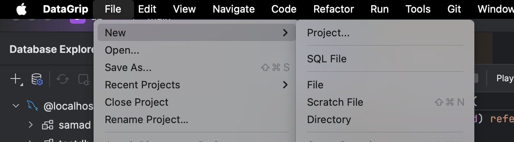

اسم پروژه‌تون رو انتخاب کنید. اگر لازم بود، مسیر دایرکتوری پروژه‌تون هم مشخص کنید. در غیر این صورت DataGrip پروژه‌تون رو توی DataGripProjects توی دایرکتوری home ایجاد می‌کنه:

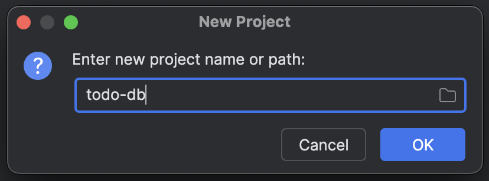

حالا با اون مثبت کوچولوی بالای صفحه، DataGrip رو به mysql وصل کنید:

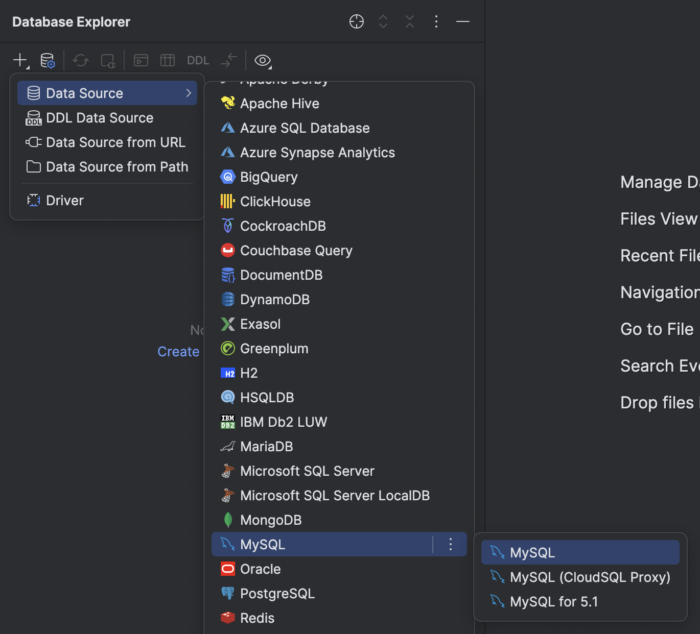

اطلاعات mysql رو پر کنید و با استفاده از دکمهٔ Test Connection، چک کنید که DataGrip با موفقیت به mysql وصل بشه. اگر نمی‌دونید توی این صفحه چه کار کنید، به داک «نصب و راه‌اندازی و کار با DataGrip» مراجعه کنید. نهایتا دکمهٔ OK رو بزنید:

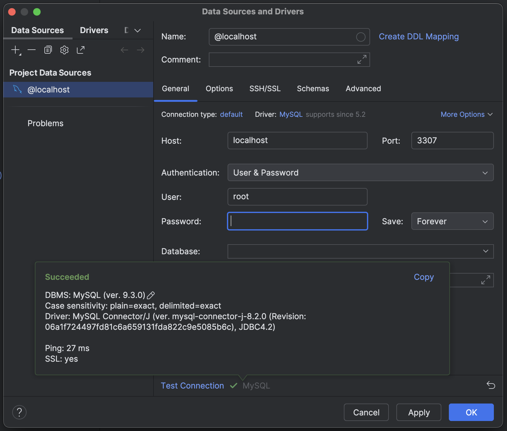

بعد از اضافه شدن instance ای که از mysql داشتین، می‌تونید اون رو سمت چپ صفحه ببینید. علاوه بر این، تب console هم براتون باز می‌شه که از طریق اون می‌تونید دستورات SQL رو اجرا کنید:

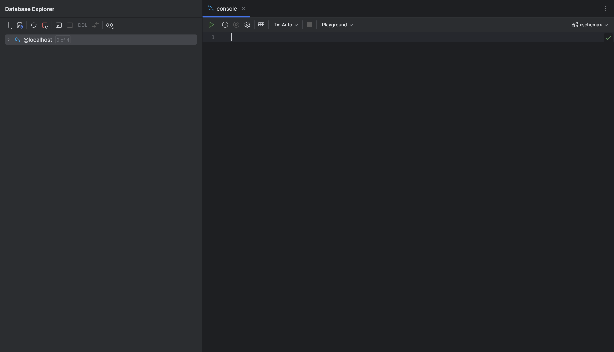

حالا، شما instance ای که از mysql داشتین رو با موفقیت به DataGrip اضافه کردین.

### درست کردن دیتابیس

هر instance از mysql، می‌تونه دیتابیس‌های مختلفی توی خودش داشته باشه. اول از همه، باید دیتابیس برنامهٔ خودتون رو ایجاد کنید. دستور زیر رو توی console وارد کنید:

```mysql
create database todo_db;
```

با استفاده از این دستور، می‌تونید یک database به اسم `todo_db` ایجاد کنید. سمی‌کالن (`;`) انتهای دستورات اختیاریه، ولی خوبه که همیشه بذارینش. با زدن دکمهٔ اجرا، این دستور رو اجرا کنید. می‌بینید که تب زیر به پایین DataGrip اضافه می‌شه:

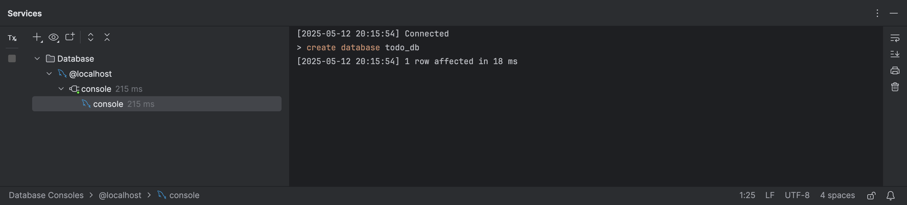

اگر هیچ چیزی قرمز نبود یعنی دیتابیس‌تون با موفقیت ساخته شده. دستور قبلی رو از کنسول پاک کنید و دستور زیر رو بنویسید تا کوئری‌های بعدی‌تون توی همین دیتابیس اجرا بشه:

```mysql
use todo_db;
```

دوباره اجراش کنید، خط زیر به تب Services اضافه می‌شه:

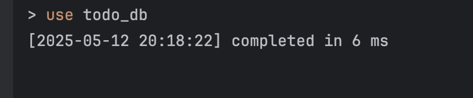

دوباره اگر هیچ چیزی قرمز نبود، یعنی همه چی درست کار کرده. شاید همزمان حواستون به این نکته هم جلب شده باشه که بالا سمت چپ صفحه، یه همچین آیکونی پدیدار شده که اسم دیتابیس‌تون روش نوشته شده:

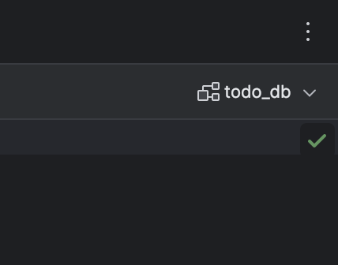

این یعنی که دستورات کنسول از این به بعد روی دیتابیس `todo_db` اجرا می‌شه. روی این دکمه کلیک کنید:

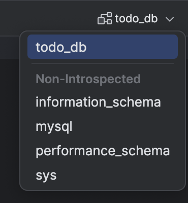

چندتا دیتابیس دیگه هم این‌جا می‌بینید. این‌ها، دیتابیس‌هایی‌ان که خود mysql برای نگه‌داری از اطلاعات این instance ایجاد می‌کنه. ترجیحا بهشون دست نزنید!

بیاید یه دیتابیس دیگه هم برای گرم شدن دستمون درست کنیم. اگر حواستون باشه، دستوراتی که توی console می‌نویسید هیچ‌جا ذخیره نمی‌شن. در واقع ما از console فقط برای تست و بررسی اطلاعات دیتابیس استفاده می‌کنیم. برای این که دستورات SQLتون رو یه جا ذخیره کنید لازمه که یه فایل .sql درست کنید. اول اون دکمهٔ پوشه‌مانند رو از بالای DataGrip بزنید:


تب Files براتون باز می‌شه[^7]:

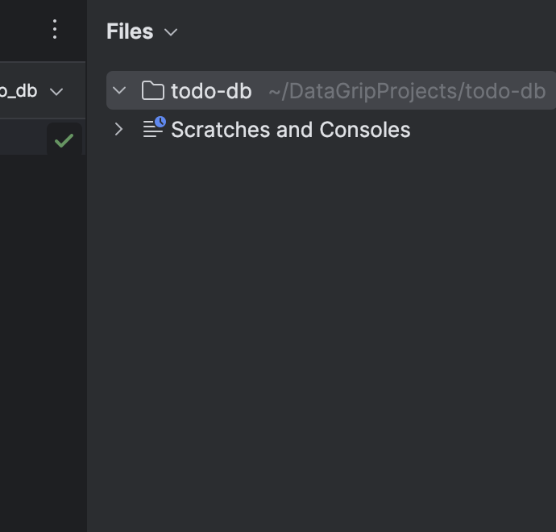

روی دایرکتوری `todo-db` راست کلیک کنید، تب New رو انتخاب کنید و SQL File رو بزنید:

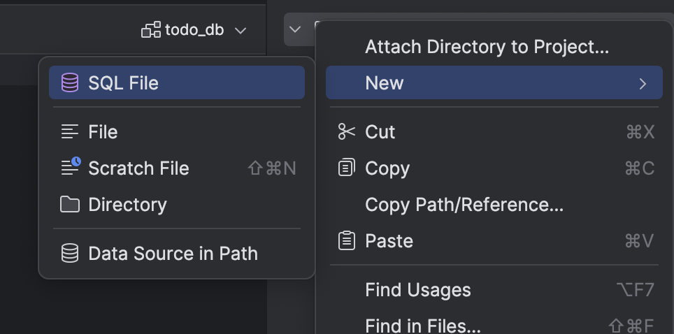

حالا اسم فایل‌تون رو انتخاب کنید:

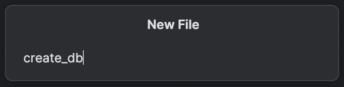

بعد از درست کردن فایل‌تون، می‌بینید که یک تب جدید کنار console برای اون باز می‌شه:

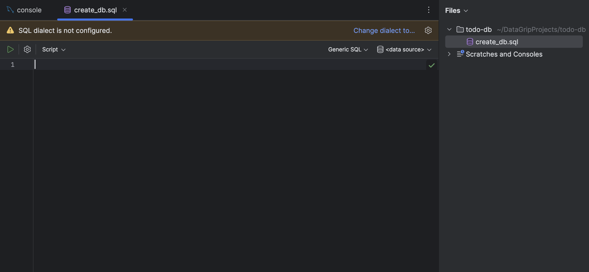

از اون بالا، اون‌جایی که نوشته Generic SQL، گزینهٔ mysql رو انتخاب کنید. این به DataGrip می‌گه که دارین برای دیتابیس mysql کد می‌زنین و باعث می‌شه که DataGrip راحت‌تر توی کد زدن کمک‌تون کنه:

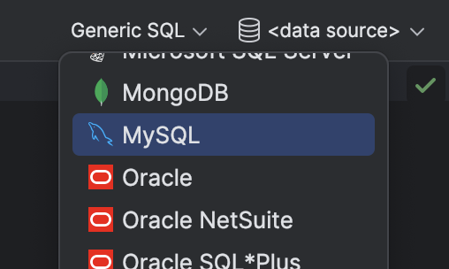

دستورات زیر رو برای ایجاد دیتابیس و استفادهٔ از اون بنویسید:

```mysql
create database foobar;  
use foobar;
```

حالا اسکریپت‌تون رو اجرا کنید:

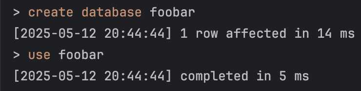

می‌بینید که دستورات `create_db.sql` از این به بعد توی دیتابیس `foobar` اجرا می‌شه:

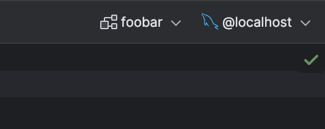

حالا برای حذف این دیتابیس از دستور زیر استفاده کنید:

```mysql
drop database foobar;
```

### درست کردن tableها

خیلی خب، حالا که دیتابیس‌مون آماده‌ست، وقتشه که table هامون رو درست کنیم. از جدول tasks شروع می‌کنیم. اگر یادتون باشه، هر task یک `id` داشت، یک `name` و یک `due_date`. فایل `tasks.sql` رو درست کنید و دستور زیر رو توی اون بنویسید:

```mysql
create table tasks(
    id int,
    name nvarchar(255),
    due_date date
);
```

یه مقدار جلوتر بهتون توضیح می‌دیم که این دستورات یعنی چی، ولی الآن حواستون باشه که قبل از اجرای کد بالا اون، دیتابیس `todo_db` رو برای اجرا انتخاب کنید:

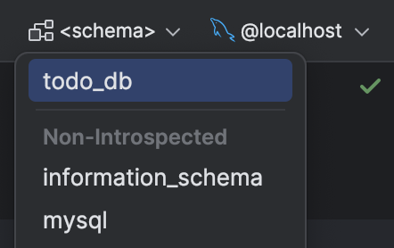

کوئری‌تون رو اجرا کنید. به تب console برین تا خیلی سریع با هم اولین جدول‌مون رو ببینیم. کد زیر رو توی کنسول بنویسید و اجرا کنید، بعدا دستور `select` رو دقیق‌تر بهتون توضیح می‌دیم:

```mysql
select * from tasks;
```

اولین table تون، in all it's glory، روی صفحه‌ست! تبریک!

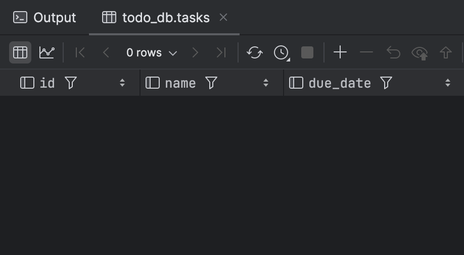

یه لحظه صبر کنید. قبل از ساخت جدول steps، بیاین اون دستور `create table` که بالاتر زدیم رو دقیق‌تر بررسی کنیم. یه همچین دستوری بود:

```mysql
create table tasks(
    id int,
    name nvarchar(255),
    due_date date
);
```

کد، به خودی خود، نسبتا گویاست. با این دستور، یه جدول به اسم `tasks` درست کردیم که سه ستون داره. اسم اولین ستونش `id` ‍ه و جنسش `int` ‍ه. دومین ستونش، یعنی `name`، یه مقدار از جنس `nvarchar(255)` ‍ه و این یعنی این ستون یه رشته، با حداکثر 255 کاراکتر توی خودش نگه می‌داره. اگر به جای ۲۵۵، از سایز دیگه‌ای، مثلاً `nvarchar(50)` استفاده می‌کردیم، حداکثر ۵۰ کاراکتر توش جا می‌گرفت. ستون سوم، یعنی ‍ هم از جنس `date` ‍ه.

تا دستمون گرمه، جدول `steps` هم درست کنیم. فایل `steps.sql` رو ایجاد کنید و دستور زیر رو توی اون بنویسید:

```mysql
create table steps(
    id int,
    task_id int,
    name nvarchar(255),
    is_completed boolean
);
```

این دستور، تا حد خوبی شبیه دستور قبلیه. توی اون، یکی از data type های جدید mysql به اسم `boolean` رو می‌بینید.[^8] احتمالا می‌تونید حدس بزنید این ستون چه مقادیری رو نگه می‌داره دیگه، مگه نه؟

بعد از اجرای دستور بالا، به console برگردین و دستور زیر رو برای دیدن table جدیدتون اجرا کنید:

```mysql
select * from steps;
```

تبریک دوباره!

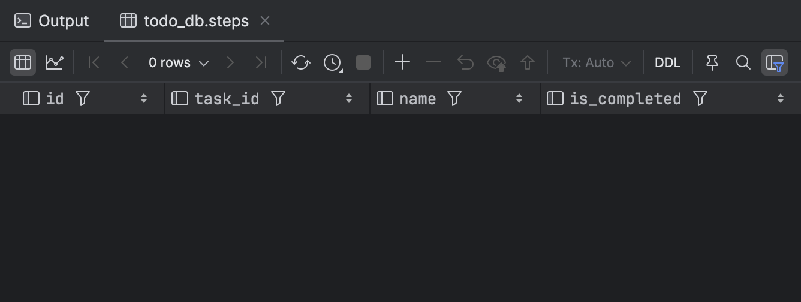

### اضافه کردن داده‌ها

اون `select` ها خیلی خالی به نظر می‌رسن، نه؟ بیاین تا اولین record هامون رو به دیتابیس اضافه کنیم! برای این کار، از دستور `insert into` استفاده می‌شه:

```mysql
insert into tasks(id, name, due_date)  
values (1, 'AP Project', '2025-10-12');
```

این دستور رو توی console بنویسید و اجراش کنید. بعدش دوباره `select` بزنید:

```mysql
select * from tasks;
```

می‌تونید اولین رکوردتون رو توی جدول `tasks` ببینید:

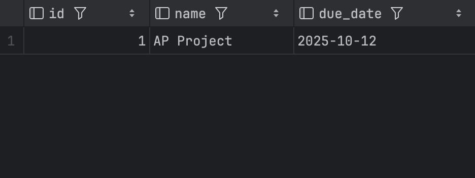

حالا برای این `task`، دوتا `step` هم تعریف کنید:

```mysql
insert into steps(id, task_id, name, is_completed) 
values (1, 1, 'Reading doc', false);

insert into steps(id, task_id, name, is_completed)
values (2, 1, 'Implementing the project', false);
```

بعد از اجرای دستور بالا، دوباره `select` بزنید تا `step` های جدیدتون رو هم ببینید:

```mysql
select * from steps;
```

خروجی‌ش همچین شکلیه:

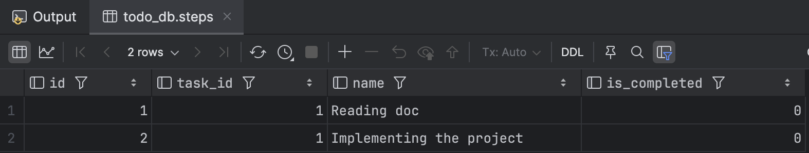

یه چیزی که خوبه حواستون بهش باشه اینه که ستون `is_completed` به جای `true` و `false`، مقادیر ۰ و ۱ رو نگه‌داری می‌کنه.[^9]

لازمه دستور `insert into` رو دقیق‌تر بررسی کنیم. دستورش یک همچین ریختی داشت:

```mysql
insert into tasks(id, name, due_date)
values (1, 'AP Project', '2025-10-12');
```

بعد از خود `insert into`، اسم جدول‌مون رو نوشتیم. بعد از اون، ستون‌هایی که می‌خوایم مقداردهی کنیم رو به ترتیب مشخص کردیم و توی خط بعد، مقدایر اون ستون‌ها رو، به همون ترتیبی که توی خط اول اومده بودن، نوشتیم. این یعنی می‌تونستیم ستون‌ها رو به هر ترتیب دیگه‌ای هم بنویسیم:

```mysql
insert into tasks(id, due_date, name)  
values (2, '2025-10-12', 'DB Homework');
```

اگر این دستور رو اجرا کنید، می‌بینید که ستون‌ها به ترتیبی که مشخص کردین مقداردهی شدن:

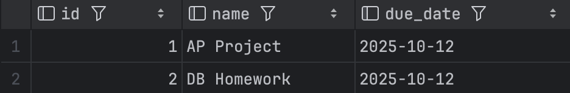

اگر مقادیر ستون‌ها رو، به ترتیبی که توی دستور `create table tasks` اومده بود مشخص کنید، لازم نیست که ترتیب ستون‌ها رو بنویسید. اگر یادتون بیاد، موقع ساخت جدول tasks، ستون‌ها به ترتیب زیر تعریف شدن:

```mysql
create table tasks(
    id int,
    name nvarchar(255),
    due_date date
);
```

پس می‌تونیم `insert into` رو به شکل زیر بنویسیم:

```mysql
insert into tasks  
values (3, 'DS Homework', '2025-10-12');
```

اگر این دستور رو اجرا کنید می‌بینید که `task` جدیدتون هم با موفقیت توی دیتابیس ذخیره شده:

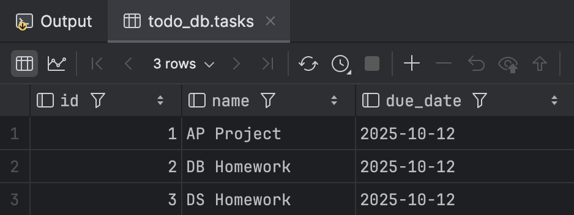

یه نکتهٔ کوچولو، می‌بینید که رشته‌ها رو به شکل `'DS Homework'` مشخص کردیم. توی SQL فقط از single quote (`'`) برای مشخص کردن رشته‌ها استفاده می‌کنیم و نمی‌تونیم مثل جاوا از double quote (`"`)ها استفاده کنیم. اجرای دستور زیر خطا می‌ده:

```mysql
insert into tasks  
values (3, "DS Homework", '2025-10-12');
```

همچنین `due_date` رو هم به شکل یک رشته مشخص کردیم. خود mysql قبل ذخیرهٔ اون سال و ماه و روز این رشته رو جدا می‌کنه و اون رو به `date` تبدیل می‌کنه.

خیلی هم خوب، حالا بیاین یه مقدار از دستور `insert into` سوء استفاده کنیم! اولین کاری که می‌کنیم اینه که اسم یک task رو مشخص نمی‌کنیم:

```mysql
insert into tasks(id, due_date)  
values (3, '2025-10-12');
```

اجراش کنید و بعد `select` بزنید. جدول‌تون یه همچین شکلی داره:


می‌بینید که رکورد جدید‌تون هم با موفقیت ذخیره شده، و توی ستون `name` ش عبارت `null` افتاده. این یعنی تسک جدیدتون بدون اسمه! نه تنها بدون اسمه، که چون یادمون رفت `id` ش هم عوض کنیم، `id` اون هم با تسک `DS Homework` یکیه. شما حتی می‌تونستید تمامی ستون‌ها رو `null` بذارید:

```mysql
insert into tasks  
values ();
```

می‌بینید؟ رکورد جدیدمون (اگر بتونیم اسمش رو رکورد بذاریم!)‌ نه اسم داره، نه `id` و نه `due_date`. همه‌ش `null` ‍ه!

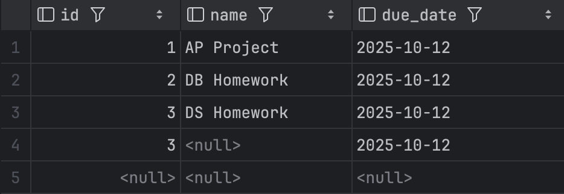

بذارین یه خراب‌کاری دیگه هم نشون‌تون بدم قبل این که پیش بریم. شما می‌تونید stepای اضافه کنید که `task_id` درستی هم نداره:

```mysql
insert into steps(id, task_id, name, is_completed)  
values (100, 1234, 'bluh', 0);
```

این `step` جدید برای تسک ۱۲۳۴ تعریف شده، که وجود نداره!

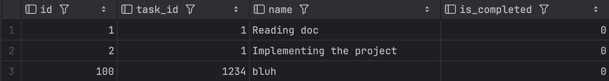

خوشبختانه، MySQL راه‌ و روش خودش رو برای جلوگیری از اضافه شدن این رکورد‌های نامربوط داره. قبل از این که این مشکلات رو حل کنیم، بذارید از شر این جدول‌های بی‌کیفیت[^10] راحت بشیم.

### حذف کنید!

برای حذف جدول‌هامون از دستور `drop table` استفاده می‌کنیم. دستورات زیر رو توی console وارد کنید:

```mysql
drop table tasks;  
drop table steps;
```

بعد از اجرای اون، می‌بینید که اگر دوباره روی این جداول `select` بزنید به خطا می‌خورید:


تموم!

### دوباره درستشون کنید

به فایل `tasks.sql` برگردید و کدش رو با کد زیر جایگزین کنید:

```mysql
create table tasks(
    id int primary key auto_increment,
    name nvarchar(255) not null,
    due_date date not null 
);
```

یه سری چیز جدید اضافه شدن، بیاین دونه دونه بررسی‌شون کنیم.

اول از همه، جلوی بعضی از ستون‌هاتون علاوه بر type شون، عبارت `not null` هم اومده. این عبارت، به mysql می‌گه که نذاره مقدار `null` به این ستون‌ها اضافه بشه.

دوم، عبارت primary key جلوی `id` اضافه شده. این به mysql می‌گه که ستون `id`، در جدول ما، primary key ماست. این یعنی که:

1.  نباید `null` باشه. هر record حتما باید `id` داشته باشه.
2.  مقدار `id` ی دو رکورد نباید یکسان باشه. به عبارتی مقادیر ستون `id` باید یکتا باشن.

سوم، عبارت `auto_increment` هم جلوی ستون `id` اضافه شده. این به mysql می‌گه که به صورت اتوماتیک، مقدار ستون `id` رو توی هر `insert into` مشخص کنه تا ما لازم نباشه هر بار مقداردهی‌ش کنیم.

دستور `create table` رو اجرا کنید و بعدش توی console تون روی این جدول `select` بزنید:

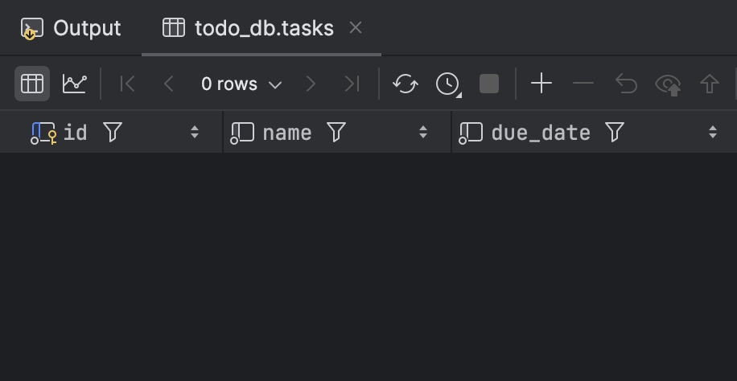

ظاهر جدول‌تون تغییر چندانی نکرده. اگر دقت کنید یک کلید کوچولو کنار ستون `id` اضافه شده که یعنی این ستون، primary key این جدوله.

حالا دستور `insert` زیر رو توی `console` اجرا کنید:

```mysql
insert into tasks(name, due_date)  
values ('AP Project', '2025-12-12');
```

اگر دوباره `select` بزنید، می‌بینید که رکوردتون با موفقیت به دیتابیس اضافه شده و حتی ستون `id` هم، اتوماتیک مقداردهی شده:

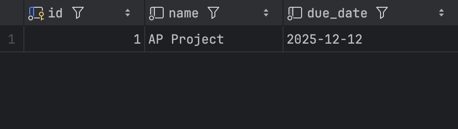

دقت کنید که اگر توی `insert` تون، ترتیب ستون‌ها رو مشخص نکنید، mysql فکر می‌کنه که اولین مقدار توی values متعلق به ستون `id` ‍ه. پس دستور زیر کار نمی‌کنه:

```mysql
insert into tasks  
values ('DB Homework', '2025-12-12');
```

ولی شما همچنان می‌تونید `id` رو دستی مشخص کنید، پس دستور زیر کار می‌کنه:

```mysql
insert into tasks  
values (2, 'DB Homework', '2025-12-12');
```

و بعد از اجرای اون، `select` تون همچین خروجی‌ای می‌ده:

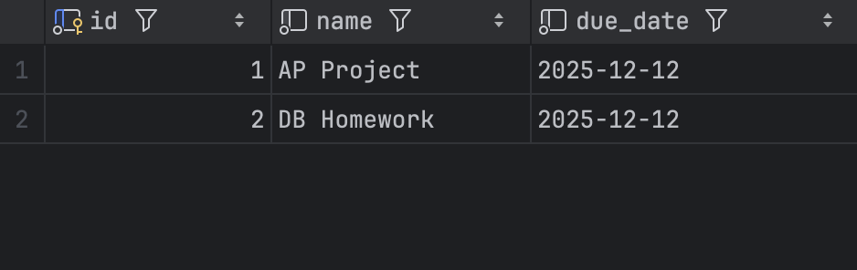

اگر یه رکورد دیگه هم اضافه کنید، می‌بینید که id اون هم به درستی مقدار دهی می‌شه:

```mysql
insert into tasks(name, due_date)  
values ('DS Project', '2025-12-12');
```

اگر دوباره `select` بزنید:

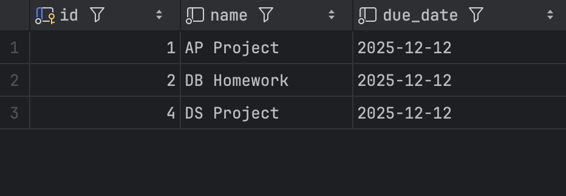

بذارین دوباره تلاش کنیم که رکوردهای نامربوط به دیتابیس اضافه کنیم. توی دستور زیر، تلاش می‌کنیم ستون `name` رو خالی بذاریم:

```mysql
insert into tasks(due_date)  
values ('2025-12-12');
```

اگر اون رو اجرا کنیم، با خطای زیر مواجه می‌شیم:

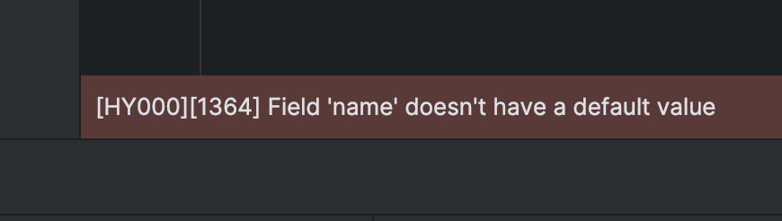

این خطا به ما می‌گه که فیلد `name` مقداردهی نشده، و مقدار دیفالت[^11] هم نداره.

اگر تلاش کنیم که مقدار تکراری توی ستون `id` بذاریم:

```mysql
insert into tasks  
values (1, 'FooBar', '2025-12-12');
```

باز هم خطا می‌گیریم:

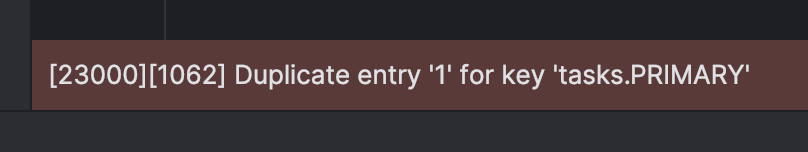

خب. خوبه! جدول `tasks` الآن رکوردهای نامربوط ذخیره نمی‌کنه. حالا بیاین جدول steps `هم` درست کنیم. به `steps.sql` برید و کوئری زیر رو اون‌جا بنویسید:

```mysql
create table steps(
    id int primary key auto_increment,
    task_id int not null,
    name nvarchar(255) not null,
    is_completed boolean not null default false,

    foreign key (task_id) references tasks(id)  
);
```

عبارت های `not null` و `primary key` و `auto_increment` رو که قبلا دیدیم. اما پایین این دستور یه چیز جدید هست. به خط زیر توجه کنید:

```mysql
foreign key (task_id) references tasks(id)
```

این خط، به `mysql` می‌گه که ستون `task_id`، یه foreign key ‍ه که به ستون `id` از جدول `tasks` وصله. به خاطر همین موضوع، mysql مطمئن می‌شه که `task_id` ی هر `step`، حتما توی جدول `tasks` وجود داشته باشه.

اگر حواستون باشه، می‌بینید که ما ستون `task_id` هم `not null` تعریف کردیم. foreign key ها، بر خلاف primary key ها می‌تونن `null` باشن. اگر `task_id` مقدار `null` داشت، یعنی `step` ما به هیچ `task` ای وصل نیست و برای خودش مستقله. البته که ما این رو نمی‌خوایم، پس این ستون `not null` ‍ه.

یه چیز جدید دیگه هم توی این جدول هست. برای ستون `is_completed` مقدار دیفالت `false` رو تعریف کردیم تا لازم نباشه توی هر `insert` اون رو مقداردهی کنیم:

```mysql
is_completed boolean not null default false
```

حالا بیاین یه سری رکورد جدید به `steps` اضافه کنید. همهٔ `insert` های زیر درستن:

```mysql
insert into steps(task_id, name, is_completed)
values (1, 'Reading the doc', false);

insert into steps(task_id, name, is_completed)
values (1, 'Implementing the project', true);

insert into steps(task_id, name)
values (2, 'Learning about db');
```

اگر اون‌ها رو اجرا کنید و بعدش روی این جدول `select` بزنید، خروجی زیر رو می‌بینید:

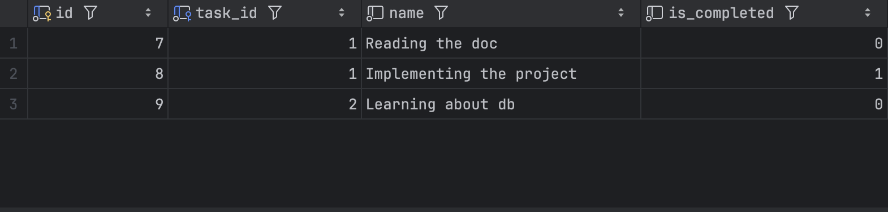

اما اگر تلاش کنید مقدار نامربوطی رو به عنوان `task_id` مشخص کنید:

```mysql
insert into steps(task_id, name)  
values (100, 'Learning about db');
```

خطای زیر رو می‌گیرین:

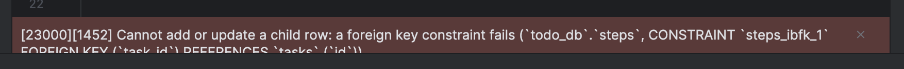

این خطا (که توی سیستم من خیلی بد نمایش داده شده!) یعنی تسکی با `id` مشخص شده نیست و در نتیجه امکان اضافه کردن این رکورد وجود نداره.

### بالاخره select

تا این‌جای کار دیگه با این دستور به اندازهٔ کافی آشنا شدید:

```mysql
select * from tasks;
```

این دستور، بهتون تمام record های یک جدول رو نشون می‌ده. اون ستارهٔ کوچولو اون وسط، یعنی این که می‌خواید تمام ستون‌های این جدول رو ببینید. خیلی وقت‌ها، شما نمی‌خواید تمام ستون‌های یک جدول رو ببینید! در این صورت، کافیه اسم ستون‌هایی که می‌خواید رو به جای ستاره بنویسید. مثلا دستور زیر:

```mysql
select name from tasks;
```

فقط اسامی `task` هاتون رو نشون می‌ده:

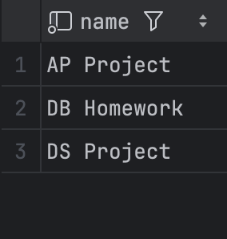

یا دستور زیر:

```mysql
select task_id, name from steps;
```

فقط ستون‌های `task_id` و `name` از جدول `steps` رو بهتون نشون می‌ده:

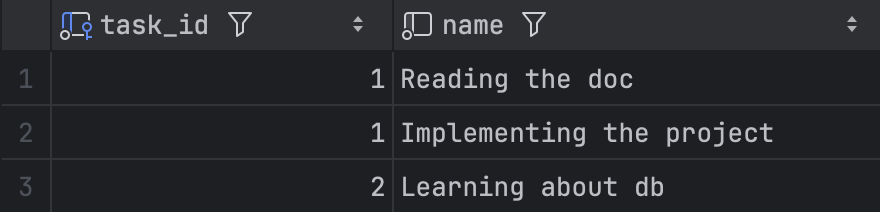

خب، خیلی هم خوب. به نظرتون دستور زیر چه کار می‌کنه؟

```mysql
select * from steps  
where task_id = 1;
```

این دستور، فقط `step` هایی رو نشون‌تون می‌ده که `task_id` شون یکه[^12] :

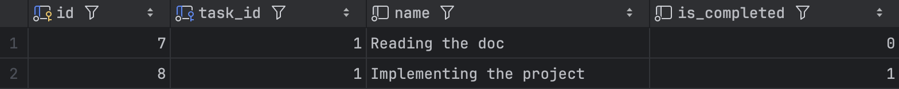

مثل قبل، می‌تونید از mysql بخواید که فقط یه سری فیلد خاص از این `step` ها رو نشونتون بده:

```mysql
select name, is_completed from steps  
where task_id = 1;
```

و خروجی این دستور، همچین شکلیه:

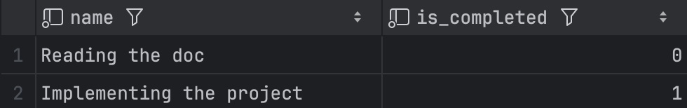

علاوه بر این، می‌تونید با عبارات `and` و `or`، شرط‌های مختلفی توی بخش `where` بنویسید:

```mysql
select name from steps  
where task_id = 1 and is_completed = true;
```

دستور بالا، فقط `step` های تسک شماره ۱ که تموم شدن رو نشون‌تون می‌ده:

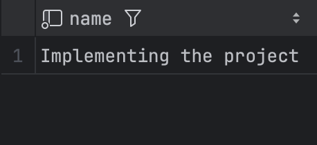

اضافه شدن `where` به دایرهٔ لغات SQLتون قدرت خیلی زیادی بهتون می‌ده. مثلا می‌تونید تسکی که اسمش `AP Project` ‍ه رو با استفاده از `where` پیدا کنید:

```mysql
select * from tasks  
where name = 'AP Project';
```

برای مقایسهٔ رشته‌ها توی `where`، می‌تونید از یه شرط جالب‌تر به اسم `like` هم استفاده کنید. مثلا دستور بالا رو می‌شه به شکل زیر هم نوشت:

```mysql
select * from tasks  
where name like 'AP Project';
```

توی این حالت، استفاده از `like` فرق خاصی با `=` نداره. اما خوبی `like` توی اینه که می‌تونه وجود pattern های مختلف رو هم توی رشته‌ها بررسی کنه. مثلا اگر بخواید تمام `task` هایی که توی اسم اون‌ها عبارت `Project` اومده رو `select` کنید می‌تونید از دستور زیر استفاده کنید:

```mysql
select * from tasks  
where name like '%Project%';
```

خروجی این دستور به شکل زیره:

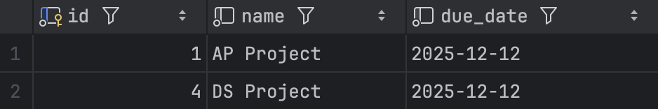

پترن `%Project%` توی خودش دوتا `%` داره. این دو `%`، وقتی در کنار `like` استفاده می‌شن، به SQL می‌گن که «مهم نیست قبل یا بعد Project چیه. اگر توی رشته‌ای Project دیدی، نشونش بده».

### پاک کردن رکورد‌ها

دستور زیر، تمام رکورد‌های جدول `steps` رو پاک می‌کنه:

```mysql
delete from steps;
```

صبر کنید! اجراش نکنید که دستور خطرناکیه. انقدر خطرناک که اگر بخواید اجراش کنید DataGrip سرتون داد می‌زنه:

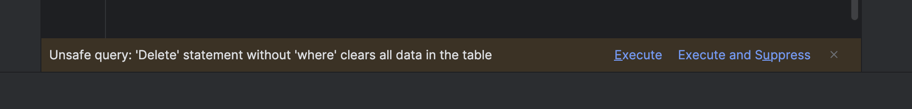

علتش اینه که توی دنیای واقعی، هیچ برنامه‌نویسی نمی‌خواد اونی باشه که کل اطلاعات دیتابیس شرکتش رو پاک می‌کنه!


به جای این کار، با اضافه کردن یه `where` به دستورتون می‌تونید از sql بخواید که فقط بعضی `step` ها رو پاک کنه. مثلا اگر الآن روی `step` هاتون `select` بزنید با جدول زیر مواجه می‌شید:

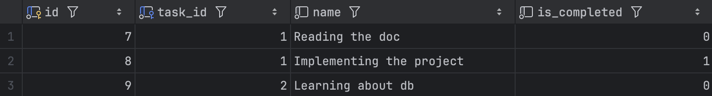

می‌تونید از `sql` بخواید که فقط `step` های تسک دوم رو پاک کنه:

```mysql
delete from steps  
where task_id = 2;
```

اگر این دستور رو اجرا کنید و بعد `select` بزنید می‌بینید که دیگه هیچ `step` ای برای این `task` وجود نداره:

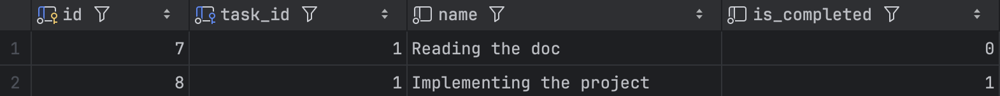

هر دستوری توی `where` برای `select` هاتون می‌زدین این‌جا هم می‌تونید بزنید. مثلا `and`، `or`، دستورات مقایسه‌ای، `like` و غیره همگی و همگی این‌جا هم کار می‌کنن.

یه چیزی رو لازمه این‌جا بدونید. می‌بینید که ما توی جدول `steps` دو رکورد برای `task` شمارهٔ ۱ داریم. چی می‌شه اگر بخوایم این `task` رو پاک کنیم؟

```mysql
delete from tasks  
where id = 1;
```

اگر دستور بالا رو اجرا کنید، با خطای زیر مواجه می‌شید (که بازم توی لپ‌تاپ من خوب نمی‌افته!):

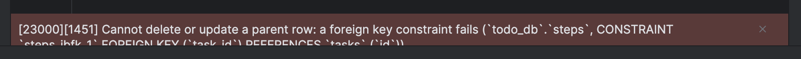

این خطا بهتون می‌گه که این `task` چندتا `step` داره، و اول باید اون‌ها رو پاک کنید تا بتونید این `task` رو پاک کنید. اگر دستور زیر رو اجرا کنید:

```mysql
delete from steps  
where task_id = 1;
```

بعدش می‌تونید با خیال راحت، `task` شماره ۱ رو پاک کنید.

### تغییر ستون‌ها

یادتون میاد وقتی می‌خواستیم جدول‌های `step` و `table` رو عوض کنیم، به کل اون‌ها رو `drop` کردیم؟ با `drop` کردن این دو جدول، تمام داده‌های اون‌ها هم از دیتابیس پاک شد. اگر راستش رو بخواید مشتری‌هاتون خیلی خوشحال نمی‌شن اگر با هر تغییر توی table های دیتابیس‌تون، دیتاشون رو کامل پاک کنید!

برای یاد گرفتن این تغییرات، بیاین جدول `employees` که توی بخش اول راجع بهش صحبت کردیم رو به دیتابیس‌مون اضافه کنیم. بعد از اون، ستون `employee_id` هم به جدول `tasks` اضافه می‌کنیم.

اول فایل `employees.sql` رو درست کنید و کوئری ایجاد جدول `employees` رو بزنید:

```mysql
create table employees(
    id int primary key auto_increment,
    name nvarchar(255) not null,
    national_id nvarchar(10) not null
);
```

خب، این کوئری رو اجرا کنید تا جدول‌تون ساخته بشه. حالا وقتشه که ستون `employee_id` رو به جدول `tasks` اضافه کنیم. برای این کار، از خانوادهٔ دستورات `alter table` استفاده می‌کنیم. دستور زیر رو به `tasks.sql` اضافه کنید:

```mysql
alter table tasks  
add column employee_id int;
```

دستور بالا، برای ایجاد تغییر توی جدول `tasks` نوشته شده. این دستور، ستون `employee_id` از جنس `int` رو به دیتابیس‌مون اضافه می‌کنه. دقت کنید که این ستون، `null` ‍ه.

اگر الآن روی `tasks` کوئری `select` بزنید با خروجی زیر مواجه می‌شید:

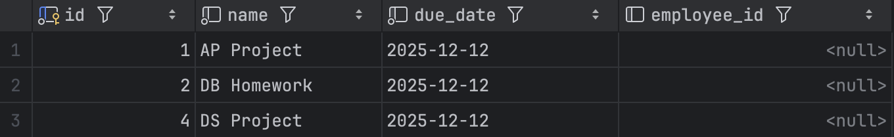

همون‌طور که می‌بینید، ستون `employee_id` به جدول‌مون اضافه شده و توی همهٔ رکوردهای قبلی مقدار `null` گرفته.[^13]

از اون‌جایی که این ستون، foreign key ‍ه، لازمه که با یه `alter table` دیگه این رو به mysql بگیم. دستور زیر رو به فایل `tasks.sql` اضافه کنید:

```mysql
alter table tasks  
add constraint foreign key (employee_id) references employees(id);
```

با این کوئری، محدودیت‌های مربوط به ستون‌های foreign key رو هم به ستون `employee_id` اضافه می‌کنیم.

بیاین این ستون جدید رو تست کنیم. اول یه `employee` به دیتابیس‌مون اضافه می‌کنیم:

```mysql
insert into employees(name, national_id)  
values ('Raees', '1234567890');
```

اگر الآن روی جدول `employee`، دستور `select` بزنید همچین چیزی می‌بینید:

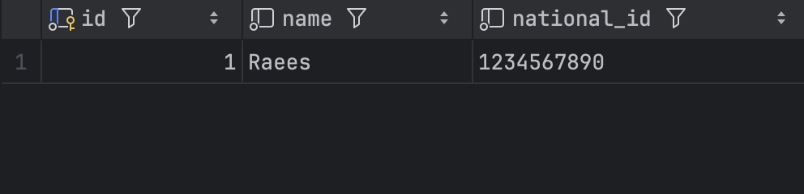

حالا یه تسک جدید برای این `employee` تعریف می‌کنیم:

```mysql
insert into tasks(name, due_date, employee_id)  
values ('Riasat', '2099-12-12', 1);
```

اگر الآن روی جدول `tasks`، دستور `select` بزنید می‌تونید رکورد جدید‌مون رو ببینید:

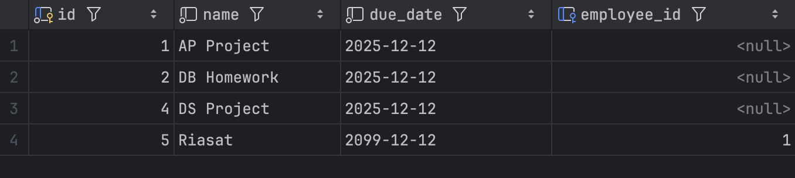

حالا، صرفا جهت یادگیری، بیاین یکی از ستون‌های جدول‌هامون رو پاک کنیم. قربانی‌مون، ستونِ بی‌آزار `is_completed` ‍ه. برای پاک کردن یه ستون از دستور زیر استفاده می‌کنیم:

```mysql
alter table steps  
drop column is_completed;
```

بعد از این دستور، دیگه ستون `is_completed` توی `select` هاتون دیده نمی‌شه:

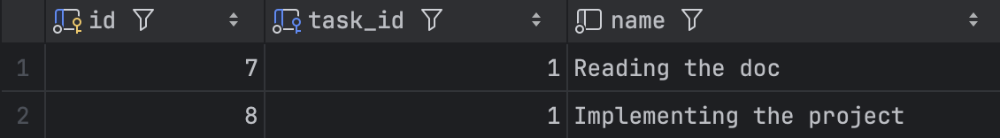

### مشاهدهٔ دیاگرام

حالا که دیتابیس‌تون کامل شده، روی اسمش توی سمت چپ صفحه‌تون راست کلیک کنید، Diagrams رو بزنید و روی Show Diagram کلیک کنید:

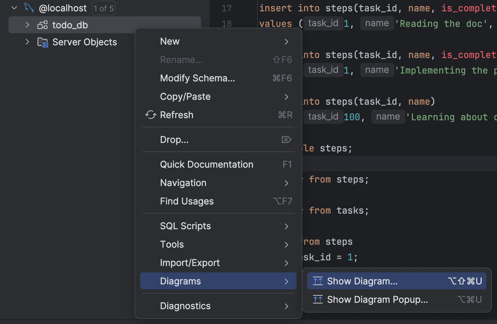

می‌بینید که یه دیاگرام ساده و خلاصه، شامل تمام اطلاعات جداول‌تون دیده می‌شه!

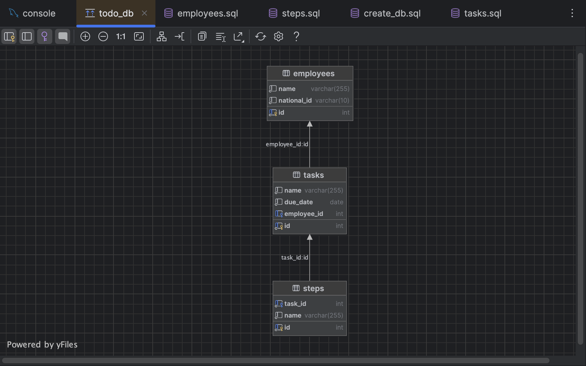

این دیاگرام الآن خیلی ساده‌ست. ولی برای پروژه‌های بزرگتر، خیلی خیلی به درد بخوره.

## چیزی که یاد گرفتیم

ما توی این داکیومنت، اولین قدم‌هامون رو توی دنیای دیتابیس‌ها زدیم. قدم‌هایی که هر چند کوچیکن، ولی مهم و ضروری‌ان. شما توی این داک با موارد زیر آشنا شدید:

- چطور می‌شه دیتا رو، به شکل یک سری جدول مرتب‌سازی کرد.
- چطور می‌شه کیفیت این جدول‌ها رو بالاتر برد و اون‌ها رو normalize کرد؟
- SQL چیه؟ چطور می‌شه با اون کار کرد؟

## منابع بیشتر

دنیای دیتابیس‌ها، خیلی وسیعه و ما حتی اگر بخوایم هم نمی‌تونیم کل این رو پوشش بدیم. انقدر دیتابیس‌ها دنیای بزرگ و گسترده‌ای دارن که database engineering یه عنوان شغلی خیلی خفن توی دنیای برنامه‌نویسیه.

برای این که با این دنیا بیشتر آشنا شید، می‌تونید از [سایت w3schools](https://www.w3schools.com/MySQL/default.asp) استفاده کنید. همچنین [کورس جمع و جور ماش همدانی](https://youtu.be/7S_tz1z_5bA) هم می‌تونه خیلی بهتون کمک کنه:


---

[^1]: البته دروغ گفتم یه جورایی... فکر کنم اگر خیلی دوست داشتین، می‌تونستید دیتاتون رو توی یه فایل بنویسید و موقع اجرای بعدی، از همون فایل بخونیدش. ولی خیلی کار راحتی نبود، نه؟

[^2]: اون Relationalای که توی اسمشون می‌بینید، ربط مستقیم داره به اون Relationهایی داره که توی مبانی علوم ریاضی یاد گرفتین. اون درسه اون‌قدران که فکر می‌کردین هم به درد نخور نیست! البته که کلا هم خیلی به درد بخورتر از چیزیه که فکرش رو می‌کنید.
    
[^3]:  اولین مشکلش اینه که relational databaseها به کل اجازه نمی‌دن ستونی داخل ستون دیگه تعریف کنید!
    
[^4]:  این ستون‌ها هم خیلی معروفن و اسم خودشون رو دارن. بهشون foreign key می‌گن.
    
[^5]:  اگر فکر می‌کنید بهتر بود یک کلاس Employee تعریف کنیم، توی اون فیلدهای name و nationalId رو تعریف کنیم و توی کلاس Task، فیلدی به شکل Employee responsibleEmployee داشته باشیم، کاملا درست فکر می‌کنید! بهش می‌رسیم.
    
[^6]:  حتی خود نویسنده هم یکی-دو بار توی شمردن این‌ها اشتباه کرده راستش!
    
[^7]:  خوبی محصولات JetBrains اینه که UIشون به هم شبیه‌ئه. DataGrip خیلی شما رو یاد IntelliJ می‌ندازه، نه؟
    
[^8]:  ‏MySQL کلی data type دیگه هم داره. حتما به [این لینک](https://www.w3schools.com/mysql/mysql_datatypes.asp) یه نگاه بندازید تا با اون‌ها آشنا بشید. تایپ‌هایی مثل decimal و bigint خیلی مهمن و در آینده ازشون استفاده می‌کنید.
    
[^9]:  در واقع MySQL اصلا typeای به اسم boolean نداره. تمام ستون‌های boolean به شکل tinyint(1) ذخیره می‌شن که فقط اعداد ۰ و ۱ رو نگه می‌داره.
    
[^10]: ببخشید که به اولین جدول‌هاتون گفتم بی‌کیفیت. اونقدرانم بی‌کیفیت نبودن راستش. :(
    
[^11]: پنج خط پایین‌تر یاد می‌گیرید که چطور برای فیلدهاتون مقادیر دیفالت تعریف کنید. ولی ارزشش به اینه که خودتون سرچش کنید و یاد بگیریدش.
    
[^12]: بر خلاف java و بیشتر زبان‌های برنامه‌نویسی که برای شرط تساوی از == استفاده می‌کنن، sql از = اضافه می‌کنه. ولی باقی شرط‌ها، مثل < و < و امثال این‌ها شبیه همون java هستن. 
    
[^13]: فرض کنید که ستون جدید‌تون، not null بود. تلاش کنید یه ستون not null به یکی از جدول‌هاتون اضافه کنید. به چه مشکلی می‌خورید؟ آیا می‌تونید با بررسی توی اینترنت این مشکل رو برطرف کنید؟
