## مقدمه

به دومین هفته‌ی درس دیتابیس خوش اومدین! این هفته قراره دانش هفته‌ی قبل‌تون رو یه کم گسترش بدین و با کمک دیتابیس todo list‌ تون، چند تا دستور جدید SQL یاد بگیرین.

قبل از اینکه وارد مباحث جدید بشیم، بیاین یه مرور سریع روی هفته‌ی قبل داشته باشیم. توی داکیومنت «دیتابیس مقدماتی ۱» با هم درباره‌ی اهمیت دیتابیس‌ها صحبت کردیم و قبل از اینکه پای سیستم‌ بشینین، با مفاهیم اولیه‌ی دیتابیس آشنا شدین و چند تا جدول برای todo list‌ تون ساختین. بعدش رفتین سراغ کدنویسی و اولین پروژه‌ی SQL‌ تون رو استارت زدین. با کدهایی که هفته‌ی قبل نوشتین، الان می‌تونین توی دیتابیس‌تون جدول بسازین، برای ستون‌های مختلفش محدودیت و شرط بذارین و بخش‌هایی از جدول‌تون رو که نیاز دارین، ببینین.

حالا وقتشه که با todo list‌ تون کارهای بیشتری انجام بدین. از توابع و دستورات ساده شروع می‌کنیم و کم‌کم می‌ریم سراغ دستورهای پیشرفته‌تر.

## ‏aggregate function ها

قبل از شروع، [این اسکریپت](https://drive.google.com/file/d/1xBOhJ4kz8xDRMn2RxBB9r6Ol2G0830tX/view?usp=sharing) SQL رو دانلود کنید و توی DataGrip اجراش کنید. این اسکریپت، شامل تمام جداول و رکوردهایی هستش که توی این داک بهشون نیاز داریم. یه نگاه به دستوراتش بندازید و خودتون ببینید که چه کار می‌کنه.

یه مقدار روی جداول جدید دیتابیس‌تون `select` بزنید که ببینید داده‌هامون چه شکلی‌ان. بعد از این که یه خورده با این دیتابیس ور رفتین، به خوندن داک ادامه بدین.

### شمارش

به جدول `tasks` یه نگاهی بندازین. اگه بخواین برین سراغ کارهاتون، احتمالاً دلتون می‌خواد بدونین چندتا تسک دارین. این‌جاست که دستور `count` به دردتون می‌خوره.

#### دستور count

کوئری زیر رو توی کنسول‌تون اجرا کنید:

```mysql
select _count_(*) from tasks;
```

نتیجه باید مثل عکس پایین باشه.

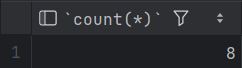

این کوئری، تعداد رکوردهای جدول `tasks` رو بهتون نشون می‌ده. چیزی که توی این خط براتون آشناست، همون دستور پرتکرار `select` ‍ه. عبارت جدیدی که اینجا می‌بینین، دستور `count` ‍ه؛ یه دستور پرکاربرد که هر چیزی رو که بهش بگین، می‌شمره. اینجا هم می‌تونستین به‌جای `*`، اسم ستون‌های جدول‌تون رو بنویسین.

همون‌طور که می‌بینین، اسم این ستون توی خروجی شده `count(*)`. با استفاده از دستور `as`، می‌تونین برای این ستون یه اسم دلخواه بذارین:

```mysql
select
    count(*) as task_count
from tasks;
```

اگر دستور بالا رو دوباره اجرا کنید، می‌بینید که اسم این ستون به `task_count` تغییر پیدا کرده:


#### کامل نشمر!

کلیدواژه‌ی `where` یادتون هست؟ خب، برای شمارش هم اگه بخواین شرط خاصی بذارین که فقط یه سری از رکوردها شمرده بشن، می‌تونین این محدودیت رو با `where` اعمال کنید.[^1]

```mysql
select _count_(*) from steps

where is_completed = 1;
```

مثلاً، کوئری بالا تعداد همه‌ی قدم‌های تموم‌شده توی جدول `steps` رو بهتون نشون می‌ده. البته می‌تونین با دقت بیشتری هم رکوردها رو بشمرین. مثلاً بیاین ببینیم چندتا از قدم‌های تسک ۱ تموم شدن.

```mysql
select _count_(*) from steps

where is_completed = 1 and task_id = 1;
```

#### بالاخره ستاره یا ستون؟

یک بار دیگه بیاید به آخرین خطی که نوشتیم نگاه کنیم.

```mysql
select _count_(*) from steps 

where is_completed = 1;
```

توی این خط، به `count` ورودی `*` دادیم، در حالی که فقط با ستون `is_completed` کار داشتیم. بیاین کوئری زیر رو جایگزین کنین و اجراش کنین.

```mysql
select _count_(is_completed) from steps

where is_completed = 1;
```

خروجی این خط هم برابر با خروجی حالت قبله.

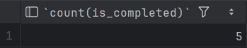

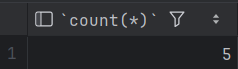

حالا این سوال پیش میاد که یعنی بین این دو تا کوئری فرقی نیست؟ بیاین برای روشن شدن موضوع، بریم سراغ ستون `task_list_id` که می‌تونه مقدار `null` هم داشته باشه. دو تا کوئری پایین رو اجرا کنین و نتیجه‌هاش رو با هم مقایسه کنین.

```mysql
select _count_(*) from tasks;

select _count_(task_list_id) from tasks;
```


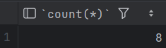

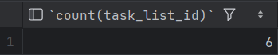

می‌بینین که نتیجه‌ی کوئری دوم دو تا کمتره. دلیلش اینه که توی دو تا از رکوردها، ستون `task_list_id` مقدار `null` داره. در واقع وقتی اسم یکی از ستون‌ها رو به `count` می‌دین، رکوردهایی که اون ستون مقدار `null` دارن، شمرده نمی‌شن. اما اگه `*` بدین، `count` همه‌ی رکوردها رو می‌شمره، حتی اونایی که توی بعضی ستون‌ها مقدار `null` دارن. برای همین، اگه ستونی که دارین می‌شمرین `not null` باشه، این تفاوت دیگه معنی خاصی نداره.

حالا به دو کوئری زیر نگاه کنید. آیا خروجی اون‌ها متفاوته؟ بررسی کنید.

```mysql
select _count_(*) from tasks
where task_list_id = 1;

select _count_(task_list_id) from tasks
where task_list_id = 1;
```

### مجموع رکوردها

رئیس به شما گفته که هزینه‌ی هر `task` هم توی دیتابیس‌تون ثبت بشه. برای این کار، ستون `cost` رو به جدول تسک‌ها اضافه می‌کنیم:

```mysql
alter table tasks  
add column cost int;
```

بعد از اجرای کوئری بالا، کوئری‌های زیر رو هم اجرا کنین. اگه فهمیدن‌شون براتون سخت بود نگران نباشین؛ چون هنوز دستوراتی که توی این کوئری‌ها استفاده شدن رو یاد نگرفتین و جلوتر یاد می‌گیرین. فعلاً کافیه بدونین که این خطوط به ستون `cost` رکوردهای قبلی جدول، مقدار می‌دن تا مقدارشون `null` نباشه.

```mysql
update tasks
set cost = 180
where id <= 2;

update tasks
set cost = 235
where id > 2 and id <= 5;

update tasks
set cost = 250
where id > 5;
```

اگر الآن، دستور زیر رو اجرا کنید و جدول `tasks` رو ببینید:

```mysql
select * from tasks;
```

خروجی‌ش به شکل زیره:

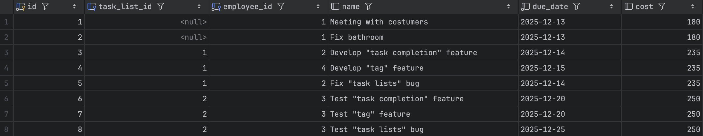

#### دستور `sum`

خب، بیاید ببینیم تسک‌های کارمند شماره ۲ چقدر برای شرکت هزینه داشتن‌:

```mysql
select _sum_(cost) from tasks

where employee_id = 2;
```

همونطور که می‌بینید، کوئری مربوط به تابع `sum` هم ساختاری مشابه با کوئری‌های `count` داره. کوئری بالا مجموع هزینهٔ تسک‌های کارمند ۲ رو محاسبه می‌کنه.

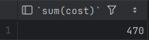

سعی کنید کوئری زیر رو هم اجرا کنید.

```mysql
select _sum_(*) from tasks

where employee_id = 2;
```

خب می‌بینید که دیتاگریپ بهتون این اجازه رو نمی‌ده. برخلاف `count`، تابع `sum` با `*` کار نمی‌کنه. دلیل پیچیده‌ای هم نداره؛ تابع `sum` فقط ستون‌های عددی رو به عنوان ورودی می‌پذیره.

ورودی `sum` می‌تونه یک عبارت ریاضی هم باشه؛ مثلا فرض کنید که رئیس بخواد برای خواهرزاده‌ش دستمزد هر تسک رو دو برابر حساب کنه اما نمی‌خواد این عدد رو توی جدول تغییر بده!

```mysql
select _sum_(cost * 2) from tasks

where employee_id = 3;
```

حالا به نظرتون خروجی دستور زیر چیه؟ چرا؟

```mysql
select _sum_(1) from tasks

where employee_id = 3;
```

#### دستور `avg`

می‌خواین میانگین هزینه‌ی تسک‌ها رو حساب کنین تا ببینین شرکت‌تون چقدر برای تسک‌های مختلف هزینه می‌کنه. برای این کار کافیه میانگین ستون `cost` تمام تسک‌ها رو محاسبه کنین:

```mysql
select _avg_(cost) from tasks;
```

همین‌قدر ساده! دقت کنین که دستور `avg` هم مثل دستور `sum` ورودی `*` نمی‌گیره، و همچنین می‌تونین بهش یک عبارت ریاضی بر اساس یه ستون عددی بدین.

### کمترین و بیشترین

بعد از اینکه مجموع و میانگین هزینه‌ها رو درآوردیم، می‌خوایم بدونیم که کمترین و بیشترین `cost` بین همه‌ی تسک‌ها چیه! SQL تابعی رو براتون فراهم کرده که اگه فقط کمترین یا بیشترین مقدار یک ستون رو بخواید، می‌تونید ازشون استفاده کنید:

```mysql
select _max_(cost) from tasks;

select _min_(cost) from tasks;
```

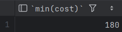

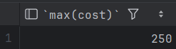

حالا خط زیر رو هم اجرا کنید و خروجی رو ببینید.

```mysql
select _min_(name) from tasks;
```

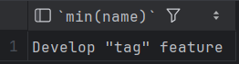

همون‌طور که دیدین، بر خلاف `avg` و `sum` که فقط ستون‌های عددی رو ساپورت می‌کردن، توابع `min` و `max` برای ستون‌هایی که از جنس رشته، تاریخ و هر نوع داده‌ی قابل مقایسه‌ی دیگه استفاده می‌شن. (قبلاً هم توی جاوا یا بعضی زبان‌های دیگه دیده بودین که رشته‌ها بر اساس ترتیب الفبایی قابل مقایسه هستن و خیلی از آبجکت‌ها یا نوع‌های دیگه هم همینطورن.)

توابع `min` و `max` هم مثل دو تابع قبلی، ورودی `*` رو قبول نمی‌کنن.

#### اگر فقط مقدار رو نخوام چی؟

کوئری‌ای که بالاتر دیدیم فقط عدد کمترین `cost` رو نشون می‌ده. اما ممکنه بخواین اسم تسکی که کمترین `cost` رو داره هم بدونین. به نظرتون چطوری می‌تونیم این کار رو انجام بدیم؟

```mysql
select name from tasks 

where cost = (select _min_(cost) from tasks);
```

کوئری بالا می‌گه که «اسم تسکی از جدول `tasks` رو نشون بده که هزینه‌اش کمترین مقدار ممکنه».

### توابعی که دیدیم چی هستن؟

در این چند صفحه با ۵ تابع آشنا شدیم که شباهت‌های زیادی به هم داشتن! توی زبان SQL، به این ۵ توابع و توابع مشابه‌شون aggregate function می‌گن. این توابع روی چند سطر از جدول‌مون محاسبات یا عملیات انجام می‌دن و در نهایت دقیقاً یک مقدار به‌عنوان خروجی برمی‌گردونن. همون‌طور که دیدیم، توابع aggregate بیشتر وقت‌ها با دستور `select` استفاده می‌شن، اما تو موارد دیگه‌ای مثل `having` هم به کار می‌رن. پیشنهاد می‌کنم اگه دوست دارین، درباره‌ی این موضوع بیشتر سرچ کنین.

## دستور `update`

یه دستور جدید از طرف رئیستون اومده. اون خیلی وسواسیه و دوست نداره هیچ دو تا تسکی هزینه‌ی برابر داشته باشن. چطور می‌تونیم مقدار هزینه (دستمزد) هر تسک رو آپدیت کنیم ؟

اگه یادتون باشه، کمی قبل‌تر دستور `update` رو برای اضافه کردن هزینه‌ها دیدین. این دستور، مقدار رکوردها رو تغییر می‌ده. فقط کافیه اسم جدول رو بهش بدین و بگین کدوم ستون رو چطور می‌خواین تغییر بدین.

بیاید با کوئری زیر کار رئیس رو راه بندازیم بعد یکم بیشتر در مورد این دستور صحبت می‌کنیم:

```mysql
update tasks
set cost = cost + (id - 1)* 5;

update tasks
set cost = cost - id * 5
where id > 2 and id <= 5;

update tasks
set cost = cost - (id - 6) * 5
where id > 5;
```

الان اگه یه نگاه به جدولمون بندازیم می‌بینیم که هزینهٔ هر `task` با مقادیر دلخواه ما پر شده.

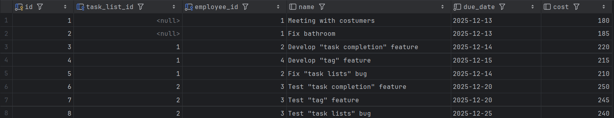

اگه توی یکی از این آپدیت ها یادمون میرفت که از `where` استفاده کنیم چی می‌شد؟

```mysql
update tasks
set cost = 500;
```

این کوئری، هزینهٔ **همهٔ** تسک‌ها رو برابر ۵۰۰ قرار می‌ده! حواستون باشه که چه زمانی از همچین دستوری استفاده می‌کنید. کلا همیشه حواستون به دستوراتی مثل `delete` و `update` باشه!

## دستور `order by`

کوئری زیر رو روی دیتابیستون اجرا کنید:

```mysql
select * from tasks 
order by cost;
```

می‌بینید که خروجی بر حسب ستون `cost` به صورت صعودی مرتب شده:

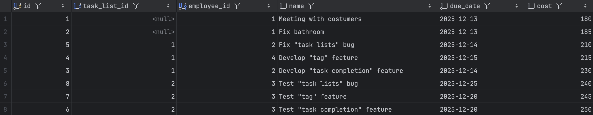

حالا اگه بخوایم نزولی یا صعودی بودن خروجی رو مشخص کنیم چی؟

#### دستورهای `desc` و `asc`

دیتابیس شما باهوشه، کافیه بهش ترتیب مورد نظرتون رو بدید تا انجامش بده. بیاید برای نزولی کردن ترتیب رکوردهامون دستور زیر رو اجرا کنیم:

```mysql
select * from tasks

 order by due_date desc;
```

همینطور که دیدید خروجی دقیقا چیزی شد که می‌خواستیم:

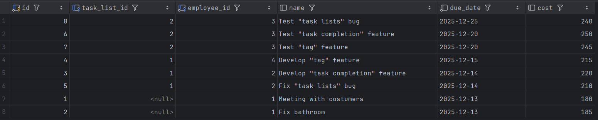

اما هنوز یه مشکل هست: نمی‌دونیم رکوردهایی که `due_date` شون یکیه چطوری مرتب شدن. جواب این سوال خیلی ساده‌ست؛ اگه ترتیب خاصی مشخص نکنیم، دیتابیس اون رکوردها رو به همون ترتیبی که اضافه شدن نمایش می‌ده.

### multiple column ordering

حالا بیاین یه سناریو رو در نظر بگیریم: ما می‌خوایم بین تسک‌هایی که ددلاین مشترک دارن، تسکی که بیشترین هزینه رو داره پیدا کنیم. برای این کار باید چیکار کنیم؟

```mysql
select * from tasks
order by due_date desc, cost desc;
```

اگه کوئری بالا رو اجرا کنید، همچین خروجی‌ای می‌بینید:

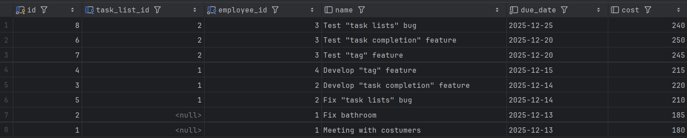

توی کوئری بالا، رکوردهاتون در ابتدا بر اساس `due_date` مرتب شدن، و بعدش رکوردهایی که `due_date` یکسانی داشتن بر اساس `cost` شون مرتب شدن. برای درک بهتر این ترتیب بیاید یه کوئری دیگه رو هم اجرا کنیم:

```mysql
select * from tasks
order by cost desc, due_date desc;
```

همین طور که تو عکس پایین میبینید خروجی این کوئری حتی شبیه به چیزی که میخواستیم هم نیست و تسک ها برخلاف خواسته ما، ابتدا طبق هزینه‌شون و بعد بر اساس `due_date` مرتب شدن.

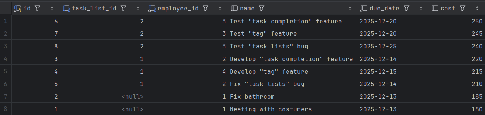

## با این همه ردیف چیکار کنم؟

ایده todo-list ما بازار رو گرفته و مشتری ها دارن ازش برای تسک های شرکتشون استفاده می‌کنن. ولی الان یه مشکلی هست، مشتری ها میگن که تعداد row های هر جدول خیلی زیاد شده و نمی‌تونن چشمی تفسیرشون کنن. اونا نیاز به یه سری ابزار دارن که باهاش بتونن اطلاعات مفید رو خلاصه تر ببینن. بیاید بگردیم تا راه حل مشکلشون رو پیدا کنیم.

فرض کنید می‌خوایم بدونیم که هر کارمند، چند تسک داره. برای این کار، می‌تونیم از کوئری زیر استفاده کنیم:

```mysql
select
    employee_id,
    _count_(*) as tasks_num
from tasks
group by employee_id;
```

کوئری بالا رو اجرا کنید و بیاید خروجیش رو باهم بررسی کنیم :

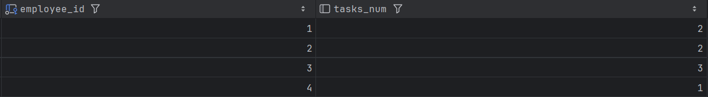

چه بلایی سر جدولمون اومد؟ بیاید کوئری بالا رو مرحله به مرحله بررسی کنیم.

### دستور `group by`

این دستور، رکوردهای یک جدول رو بر اساس یک ستون خاص گروه‌بندی می‌کنه. مثلا ما می‌تونیم جدول `task` رو بر اساس ستون `employee_id` گروه‌بندی کنیم:

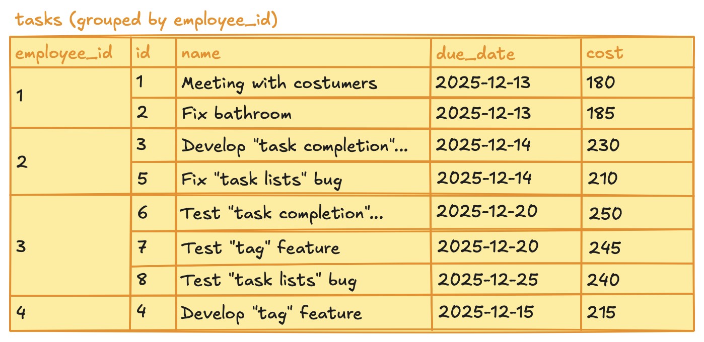

اگر دقت کنید، رکوردهای جدول بالا به چهار قسمت تقسیم شدن. هر قسمت هم برای یک کارمنده. این کار رو توی mysql با دستور `group by` انجام می‌دیم:

```mysql
select employee_id from tasks
group by employee_id;
```

اگر دستور بالا رو اجرا کنید، اول جدول `tasks` بر اساس `employee_id` تقسیم‌بندی می‌شه، و بعدش مقادیر ستون `employee_id` خروجی داده می‌شه. خروجی این دستور به شکل زیره:

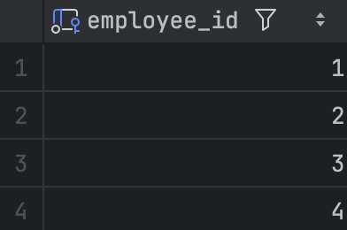

همون‌طور که می‌بینید، جدول بالا فقط ۴ سطر داره. توی جدول نارنجی رنگی که بالاتر کشیدیم هم ستون `employee_id` فقط ۴ مقدار داشت.

حالا چی‌ می‌شه اگر بخوایم ستون `cost` هم توی `select` مون نشون بدیم؟ کوئری زیر رو برای این کار اجرا کنید:

```mysql
select employee_id, cost from tasks
group by employee_id;
```

به خطای زیر می‌خورید:

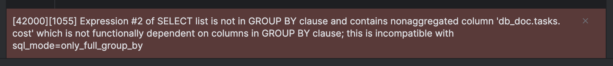

بیاین علت این خطا رو با هم بررسی کنیم. کارمند شماره ۳ رو در نظر بگیرید، این کارمند ۳ تسک داره که هزینهٔ اون‌ها به ترتیب، ۲۵۰، ۲۴۵ و ۲۴۰ئه. دیدیم که این کارمند فقط یکی از سطرهای خروجی `group by` رو اشغال کرده، پس mysql باید کدوم یک از این سه `cost` رو توی این سطر نشون بده؟

به خاطر همین مشکل، mysql ازتون می‌خواد که این سه مقدار رو به یه نحوی با هم ترکیب کنید و حاصل اون‌ها رو نشون بدین. مثلا شما می‌تونید مجموع این سه مقدار رو نشون بدین:

```mysql
select
    employee_id,
    _sum_(cost) as total_cost_for_this_employee
from tasks
group by employee_id;
```

حالا، mysql می‌دونه که باید مجموع `cost` تسک‌های هر کارمند رو نشون بده. مثلا برای کارمند ۳، انتظار داریم که ۲۴۰ + ۲۴۵ + ۲۵۰ = ۷۵۰ نشون داده بشه. خروجی این کوئری به شکل زیره.:

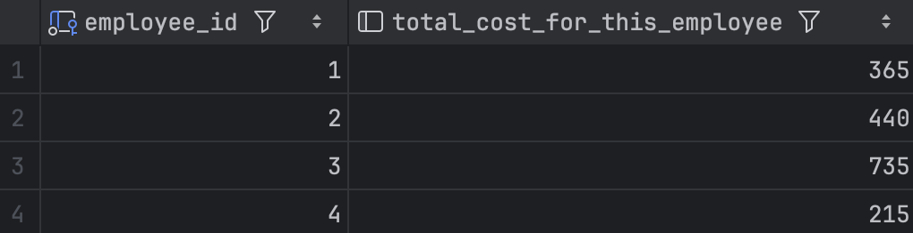

شما می‌تونستید هر aggregate function دیگه‌ای مثل `count` و `min` و `max` هم برای این ستون‌ها استفاده کنید. مثلا، توی کوئری زیر از `count` استفاده کردیم:

```mysql
select
    employee_id,
    _count_(cost) as count_for_each_employee
from tasks
group by employee_id;
```

خروجی اون هم به این شکله:

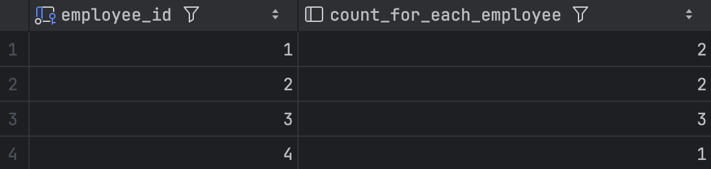

یا مثل کوئری اول این بخش، از `count(*)` استفاده کنید:

```mysql
select
    employee_id,
    _count_(*) as tasks_num
from tasks
group by employee_id;
```

یک چیز از این بخش در خاطرتون بمونه، ستون‌هایی که بر اساس اون‌ها، `group by` نکردین رو نمی‌تونید به شکل مستقیم توی جدول‌تون نشون بدید! برای نشون دادن این ستون‌ها باید حتما از توابعی مثل `count`، `sum` یا باقی aggregate function ها استفاده کنید.

حالا که با `group by` آشنا شدید بیاید تا باهم توی این دستور و کاربرد هاش بیشتر عمیق بشیم.

#### گروه‌بندیِ چند ستونه

ما می‌تونیم جداول‌مون رو بر اساس چند ستون مختلف هم گروه‌بندی کنیم. مثلا فرض کنید که بخوایم هزینهٔ روزانه تسک‌های هر کارمند رو داشته باشیم. برای رفع این نیازمندی، باید تسک هامون رو بر اساس کارمند و تاریخ گروه بندی کنیم و بعد جمع هر گروه رو نشون بدیم:

```mysql
select
    employee_id,
    due_date,
    _count_(*) as tasks_num,
    _sum_(cost) as total_income
from tasks
group by employee_id, due_date;
```

خروجی این کوئری به شکل زیره:

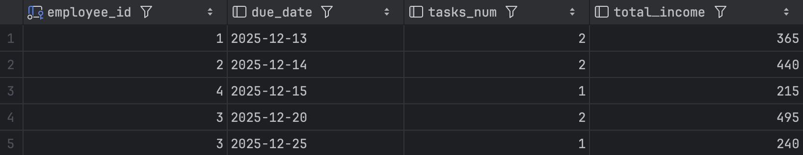

ما قبل تر برای فیلتر کردن دیتامون از `where` استفاده میکردیم. بیاید با استفاده از همین دستور، کارمندهایی که هزینهٔ تسک‌هاشون بیشتر از ۳۰۰ بوده رو نشون بدیم:

```mysql
select
    employee_id,
    _sum_(cost) as total_cost
from tasks
group by employee_id
where total_cost > 300;
```

اوپس، بازم ارور! علتش خیلی ساده‌ست، بعد از `group by`، شما نمی‌تونید از `where` استفاده کنید:

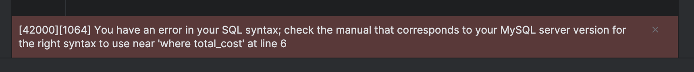

#### دستور `having`

بعد از `group by`، باید به جای `where` از `having` استفاده کنید:

```mysql
select
    employee_id,
    _sum_(cost) as total_cost
from tasks
group by employee_id
having total_cost > 300;
```

می‌بینید که با اجرای این کوئری، خروجی مدنظرتون رو بدون هیچ خطایی دریافت می‌کنید:

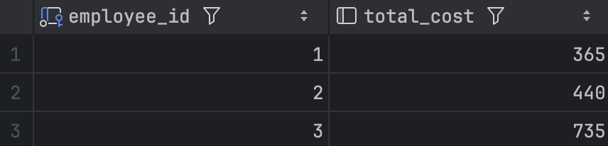

چیزی که باید یادتون بمونه اینه که ما، قبل از `group by` باید از `where` استفاده کنیم و بعد از اون، از `having`. مثلا اگه لازم داشته باشیم که کارمندهایی با idی بزرگ‌تر از ۱ رو نشون بدیم کوئری‌مون باید به شکل زیر باشه:

```mysql
select
    employee_id,
    _sum_(cost) as total_cost
from tasks
where employee_id > 1
group by employee_id
having total_cost > 300;
```

و خروجی این کوئری، به شکل زیره:

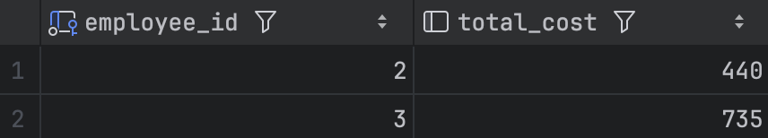

## دستور `case`

توی این بخش، می‌خوایم دستور case رو بررسی کنیم. به طور خلاصه این دستور عملکردی مشابه switch case توی جاوا داره و در نهایت یه دنباله از if هاست، ولی داخل بدنهٔ اون به جای کد، یه مقدار مشخص می‌شه. کوئری زیر رو اجرا کنید و خروجی‌ش رو ببینید:

```mysql
select
    id,
    name,
    case  
        when cost >= 230 then 'worth it.'
        when cost > 200 and cost < 230 then 'meh.'
        when cost < 200 and cost > 180 then 'not worth it'
    end as description  
from tasks
```

با این کوئری تونستیم شرایط هر تسک رو بررسی کنیم و توی ستون موقتی که ایجاد کردیم وابسته به هرکدوم از شرایط یه مقدار مشخص بذاریم.


همون‌طور که دیدید و شاید انتظارش رو هم داشتید ستون جدیدمون برای تسک اول هیچ مقداری نداره. به نظرتون چرا این اتفاق افتاده؟ از اونجایی که این تسک توی هیچکدوم از شرایط `case` نمی‌گنجید، هیچ مقداری برای اون مشخص نشده و این ستون خالی مونده. اگه بخواید یه مقدار رو برای شرایطی که تو شرط ها نیستن برگردونید کافیه که اون مقدار رو توی `else` بذارید اینطوری وقتی هیچکدوم از کیس ها مچ نمی‌شن مقدار داخل `else` توسط `case` برگردونده میشه:

```mysql
select
    id,
    name,
    case  
        when cost >= 230 then 'worth it.'
        when cost > 200 and cost < 230 then 'meh.'
        when cost < 200 and cost > 180 then 'not worth it'
        else 'idk.'
    end as description  
from tasks
```

اگه خروجی این کوئری رو ببینید تسک اول دیگه مقدار `null` نداره و با `"idk."` پر شده:

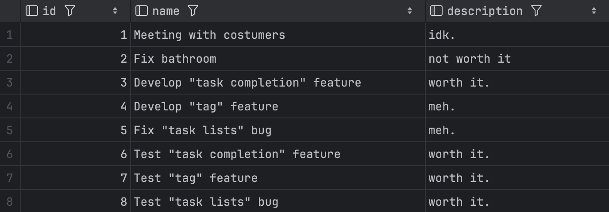

کار ما تمومه، ولی رئیس به نظر ثبات روانی خیلی خوبی نداره و می‌خواد به کل ستون `cost` رو از دیتابیس حذف کنه:

```mysql
alter table tasks
drop column cost
```

## `join` ها

‏foreign key ها رو یادتونه؟ بهتون اجازه می‌دادن که بین table های مختلف، ارتباط برقرار کنید. یکی از دستوراتی که بهتون اجازه می‌ده از این foreign key ها استفاده کنید، دستورات خانوادهٔ `join` ‍ه و توی این بخش، می‌خوایم با این دستورات بیشتر آشنا بشیم.

### اولین `join`

کوئری‌هایی که تا حالا زدین، فقط با record های یه جدول درگیر بودن. مثلا کوئری زیر، فقط رکوردهای جدول `tasks` رو خروجی می‌داد:

```mysql
select id, employee_id, name from tasks;
```

یا دستور زیر، فقط `step` های تسک شمارهٔ ۳ رو نشون می‌داد:

```mysql
select name from steps
where task_id = 3;
```

حالا فرض کنید که بخوایم توی یه کوئری، هم اطلاعات `task` ها رو نشون بدیم، هم اطلاعات `step` ها رو چه کار می‌کنیم؟

این‌جاست که دستور `join` به کارمون میاد. دستور `join`، ستون‌های دو یا چند جدول رو با هم ترکیب می‌کنه. به عنوان مثال، دستور زیر رو توی console تون اجرا کنید:

```mysql
select * from tasks
join steps on tasks.id = steps.task_id;
```

این دستور، به mysql همچین چیزی می‌گه:

1.  اول، همه رکوردهای جدول `tasks` رو بخون.
2.  بعدش، همهٔ رکوردهای جدول `steps` رو بخون.
3.  حالا، هر `step` رو، کنار `task` ای نشون بده که `id` ی اون `task`، برابر `task_id` ی `step` مونه.

یه نگاه به خروجی‌ این دستور بندازید. خروجی‌ش، یه table گنده‌ست که همهٔ ستون‌های جداول `tasks` و `steps` رو داره. این `table`، یه همچین شکلی داره:

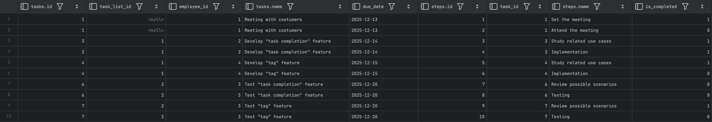

خوندن اطلاعات جدول بالا سخته، بیاین توی `select` مون، از شر یه سری از ستون‌هاش خلاص بشیم تا بتونیم بهتر بررسی‌ش کنیم:

```mysql
select tasks.id, tasks.name, steps.id, task_id, steps.name from tasks
join steps on tasks.id = steps.task_id;
```

اگر دوباره این دستور رو اجرا کنید، خروجی زیر رو می‌بینید:

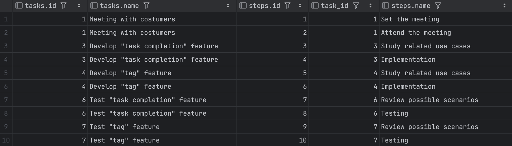

همون‌طور که می‌بینید، توی جدول بالا هر `step` به همراه `task` مربوط بهش دیده می‌شه. بعضی از `task` ها، دو بار توی خروجی دیده می‌شن، چون که دوتا `step` داشتن! ولی بعضی `task` ها هم اصلا توی این جدول دیده نمی‌شن، چون به کل `step` ای نداشتن.

اگر به جدول بالا دقت کنید، یه چیز جالب توی اون می‌بینید. این که ستون‌های `id`، به عنوان `tasks.id` و `steps.id` نمایش داده شدن. فرض کنید mysql این کار رو نمی‌کرد:

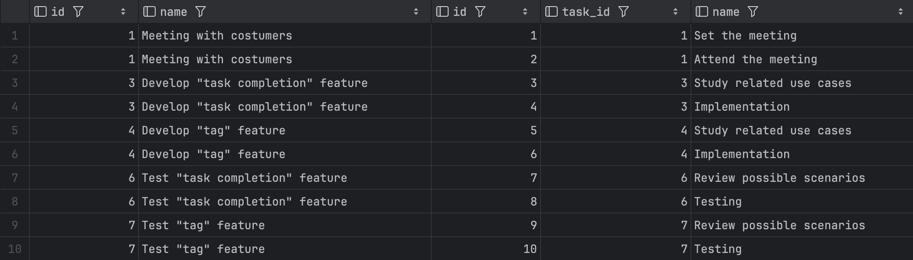

توی جدول بالا، کدوم ستون `id` مربوط به `task` ‍ه و کدوم مربوط به `step` ‍ه؟ ستون `name` چطور؟

در واقع، چون این ستون‌ها توی هر دو جدول مشترکن، اسم جدول اون‌ها هم بالای ستونشون اومده. اگر دقت کنید، حتی توی کوئری‌مون هم هر جایی ما از این دو ستون استفاده کردیم، مجبور شدیم قبل اون‌ها اسم جدول‌شون رو بنویسیم:

```mysql
select tasks.id, tasks.name, steps.id, task_id, steps.name from tasks
join steps on tasks.id = steps.task_id;
```

ما می‌تونستیم این کوئری رو کوتاه‌تر هم بنویسیم:

```mysql
select t.id, t.name, s.id, task_id, s.name from tasks t
join steps s on t.id = s.task_id;
```

توی کوئری جدیدمون، به جای `tasks` از `t` و به جای `steps` از `s` استفاده کردیم. برای این که mysql بدونه منظورمون از `t` و `s` چیه، جلوی اسم این جداول هر کدوم رو مشخص کردیم. خروجی این کوئری هم مثل کوئری قبلیه، با این تفاوت که mysql هم از `t` و `s` استفاده کرده:

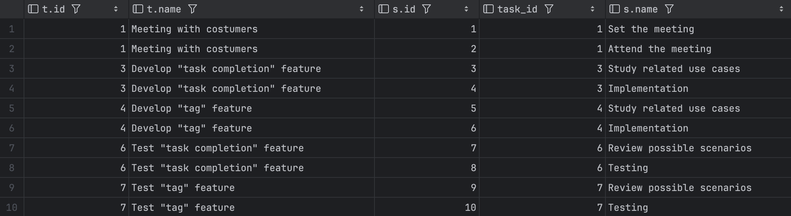

### دستور `left join`

اگر بخوایم `task` هایی که `step` ای ندارن هم توی خروجی بالا نمایش داده بشن، از `left join` استفاده می‌کنیم:

```mysql
select t.id, t.name, s.id, task_id, s.name from tasks t
left join steps s on t.id = s.task_id;
```

خروجی دستور بالا، به این شکله:

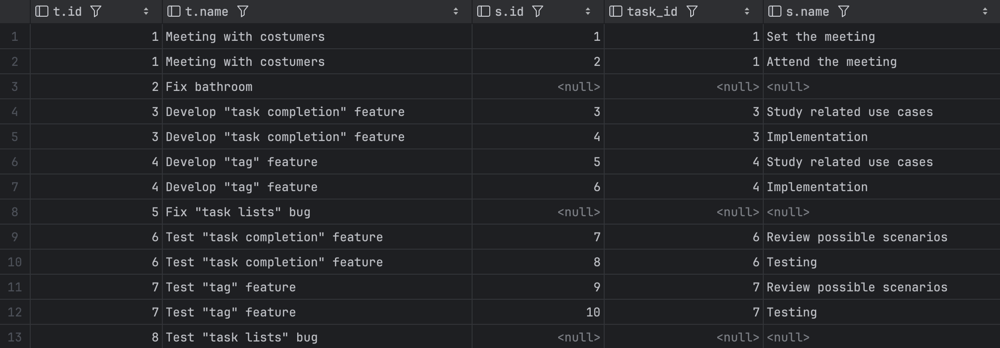

همون‌طور که می‌بینید، `task` های بدون `step` هم توی کوئری بالا نمایش داده شدن. توی سطرهای این `task` ها ستون‌های `s.id`، `task_id` و `s.name` مقدار `null` رو گرفتن.

### کوئری زدن روی نتایج

ما می‌تونیم مثل جدول‌های قبلی‌مون، روی این جدول هم `where` و `group by` و کوئری‌های مختلف بزنیم. مثلا توی کوئری زیر، `task` هایی که هیچ `step` ای ندارن رو نشون می‌دیم:

```mysql
select t.id, t.name, s.id from tasks t
left join steps s on t.id = s.task_id
where s.id is null;
```

خروجی این دستور، به همچین شکلیه:

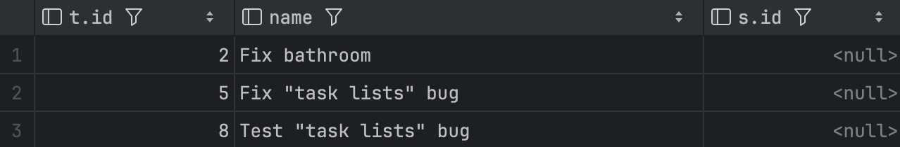

یا می‌تونیم ببینیم که هر `task` چند `step` داره:

```mysql
select t.id, t.name, _count_(s.id) as number_of_steps from tasks t
left join steps s on t.id = s.task_id
group by t.id;
```

خروجی دستور بالا به شکل زیره:

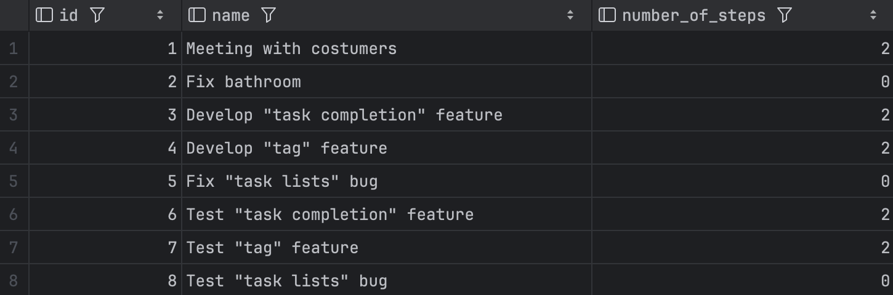

حتی می‌تونیم ببینیم که از هر `task`، چند `step` تموم شده:

```mysql
select 
    t.id,   
    t.name, 
    _count_(s.id) as number_of_steps, 
    _sum_(s.is_completed = true) as completed_steps
from tasks t
left join steps s on t.id = s.task_id
group by t.id;
```

خروجی کد بالا هم به شکل زیره:

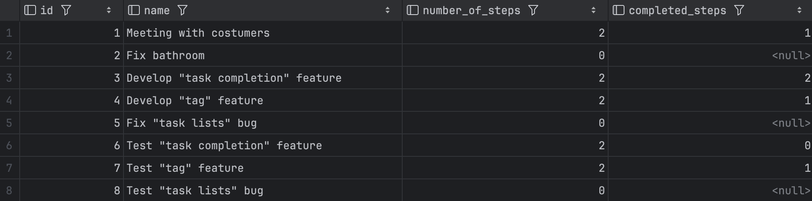

همون‌طور که می‌بینید، ستون `completed_steps` برای `task` های بدون `step` به جای 0، `null` گرفته. برای حل این مشکل از `ifnull` استفاده می‌کنیم. اگر کد زیر براتون واضح نیست، یه سرچ کوچیک راجع به این تابع بکنید:

```mysql
select
    t.id,  
    t.name,
    _count_(s.id) as number_of_steps,
    _ifnull_(_sum_(s.is_completed = true), 0) as completed_steps
from tasks t
left join steps s on t.id = s.task_id
group by t.id;
```

### دستور `join` برای چند جدول

ما حتی می‌تونیم بیشتر از دو جدول رو با هم `join` کنیم. مثل بیاید جدول `employee` هم با `task` و `step` جوین کنیم:

```mysql
select 
    e.id as employee_id,   
    e.name as employee_name,   
    t.id as task_id,   
    t.name as task_name,   
    s.id as step_id,   
    s.name as step_name
from employees e
left join tasks t on t.employee_id = e.id
left join steps s on s.task_id = t.id;
```

خروجی دستور بالا، به این شکله:

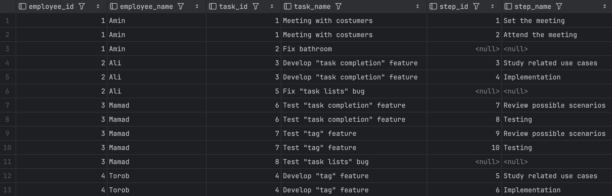

با استفاده از جدول بالا هم می‌تونیم کوئری‌های خوبی راجع به کارکنان شرکت بزنیم. مثلا این که هر کارمند، چند قدم از کارهاش رو انجام داده:

```mysql
select
    e.id as employee_id,  
    e.name as employee_name,
    _count_(s.id) as total_number_of_steps,
    _ifnull_(_sum_(s.is_completed = true), 0) as completed_steps
from employees e
left join tasks t on t.employee_id = e.id
left join steps s on s.task_id = t.id
group by e.id;
```

خروجی این کوئری هم به شکل زیره:

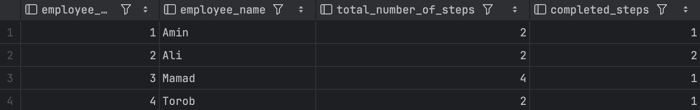

خب، حالا که دستورات اولیهٔ دیتابیس رو یاد گرفتیم، بیاید راجع به افزودن چیزهای جدید به دیتابیس‌مون صحبت کنیم.

## افزودن جداول و ستون‌ها به دیتابیس

دستورات `create table` ما، یه مشکل کوچیک دارن. هیچ کدوم از اون‌ها رو نمی‌شه دو بار اجرا کرد. اگر تلاش کنید دستوری مثل دستور زیر رو توی دیتابیس‌تون اجرا کنید:

```mysql
create table employees(
    id int primary key auto_increment,
    name nvarchar(255) not null,
    national_id nvarchar(10) not null
);
```

با خطایی مواجه می‌شید که بهتون می‌گه «جدول `employees` توی دیتابیس وجود داره و نمی‌شه اون رو دوباره ساخت. برای حل این مشکل، از `create table if not exists` استفاده می‌کنید.

برای دیدن این دستور، بیاید امکان تیم‌بندی کارمندهای شرکت رو هم به دیتابیس‌مون اضافه کنیم. یه جدول جدید به اسم `teams` درست می‌کنیم:

```mysql
create table if not exists teams(
    id int primary key auto_increment,
    name nvarchar(255) not null
);
```

این دستور، یه فرق کوچیک با `create table` های قبلی‌مون داره، و اون هم `if not exists` ایه که بهش اضافه کردیم. اگر جدول `teams` وجود داشته باشه، mysql دیگه اقدام به ساخت اون نمی‌کنه و در نتیجه، خطایی هم بهتون نمی‌ده. این کوئری رو چند بار اجرا کنید تا ببینید به خطایی می‌خورید یا نه.

جهت خالی نبودن عریضه، یک `team` هم به دیتابیس‌مون اضافه می‌کنیم:

```mysql
insert into teams(name)
values ('default team');
```

حالا لازمه که هر کارمند رو به یه تیم اختصاص بدیم، برای این کار، به جدول `employees`، ستون `team_id` رو اضافه می‌کنیم که نشان‌دهندهٔ `id` ی تیم هر کارمنده. از اون‌جایی که توی شرکت ما، هر کارمند حتما یه تیم داره، این ستون `not null` ‍ه:

```mysql
alter table employees
add column team_id int not null references teams(id);
```

توی دستور بالا، به mysql گفتیم که یه ستون جدید به اسم `team_id` به جدول `employees` اضافه کنه. علاوه بر این، به mysql گفتیم که ستون جدیدمون، `not null` ‍ه و یه foreign key به جدول `teams` ‍ه.

ولی اجرای این کوئری با خطا مواجه می‌شه:

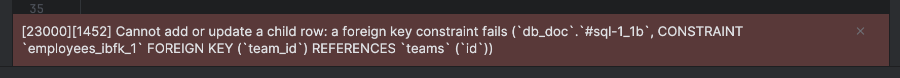

منشا این خطا، اینه که mysql نمی‌دونه که برای کارمندهای فعلی شرکت‌مون، مقدار این ستون رو چی بذاره. ما می‌تونیم با استفاده از `یهdefault` برای این ستون، این مشکل رو برطرف کنیم:

```mysql
alter table employees
add column team_id int not null default (1) references teams(id);
```

اگر الآن، این کوئری رو اجرا کنید می‌بینید که ستون جدیدمون با موفقیت اضافه می‌شه. علاوه بر این، ستون `team_id` ی رکورد‌های قدیمی جدول‌مون هم مقدار ۱ رو به خودش گرفته:

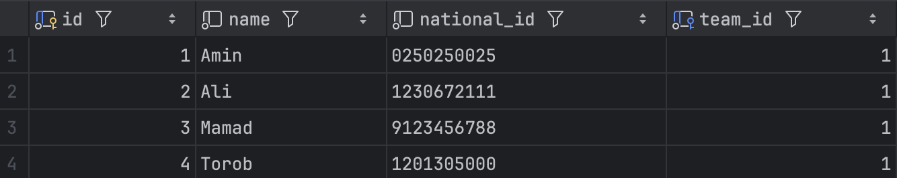


---


[^1]:  البته برای باقی توابع مشابه count هم همینطوریه. جلوتر می‌بینید.
