## مقدمه
> "The evening's the best part of the day. You've done your day's work. Now you can put your feet up and enjoy it."
> Kazuo Ishiguro, The Remains of the Day


به انتهای مسیر رسیدیم بالاخره آخرین داک برنامه‌نویسی پیشرفته‌تون این‌جاست. توی داک‌های
قبلی ما در کنار هم جاوا رو از `println` تا `class` و inheritance یاد گرفتیم کلی repo درست کردیم با گرافیک ور رفتیم و حتی یه خورده دیتابیس یاد گرفتیم.
یادگیری هر کدوم از اینها یک دستاورد بزرگه اینجا متوقف شید و به خودتون افتخار کنید![^1]


توی این داک دانش‌مون از جاوا و SQL رو کنار هم میذاریم و یاد میگیریم که چطور توی برنامه‌هامون از دیتابیس های مختلف استفاده کنیم برای این کار از به ابزار خیلی قدرتمند به اسم Hibernate استفاده می‌کنیم.

## ORM ها

ما بلدیم که کلاس‌های جدید توی جاوا تعریف کنیم:

```java
class Task {
    int id;
    String title;
    LocalDate dueDate;
}
```

همچنین بلدیم که جدول‌های جدید هم توی MySQL تعریف کنیم:

```mysql
create table if not exists tasks(
    id int primary key auto_increment,
    title nvarchar(255),
    due_date date
)
```

واضحاً، کلاس `Task` و جدول `tasks` به هم مربوطن ولی چطور این ارتباط رو به جاوا بفهمونیم؟ چطور بهش بگیم که ما به جدول به اسم `tasks` داریم که دقیقا شبیه کلاس `Task` ‍ه. میتونی ازش برای ذخیره کردن و خوندن `Task` های مختلف استفاده کنی این کار با این که نسبتاً ساده به نظر می‌رسه، در عمل خیلی پیچیده می‌شه.
Object-Relational Mapping ها که مخففORM ها دقیقاً توی همین کار به ما کمک میکننORM
هستن به ما اجازه میدن که به راحتی آبجکت‌های برنامه‌مون رو به جدول‌های دیتابیس‌مون مرتبط
کنیم و توی برنامه‌هامون از دیتابیس استفاده کنیم به ORM بین دیتابیس و برنامه شما قرار میگیره
و اون‌ها رو به هم پیوند می‌ده:
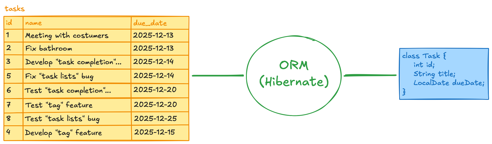

چند تا ORM خیلی خوب برای جاوا هست که یکی از معروف‌ترین هاشون Hibernate ‍ه. این جا هم،
همون‌طور که از اسم داک پیداست، ما از همین framework برای ارتباط با دیتابیس استفاده می‌کنیم.

## آماده‌سازی پروژه

هایبرنیت یا Hibernate، چیزی نیست جز کدهای جاوایی که به تعدادی Developer دیگه زدن و منتشر کردن تا شما هم بتونید ازشون استفاده کنید. برای به کار گرفتن این فریم ورک ما از ابزاری به اسم Maven استفاده میکنیم.
توی IntelliJ یه پروژه جدید درست کنید ولی توی صفحه ایجاد پروژه جدید Build System رو از روی Intelli بردارین و  Maven رو انتخاب کنین. علاوه بر این، توی Additional Settings، مقدار `Groupld` رو به `aut.ap` تغییر بدین:

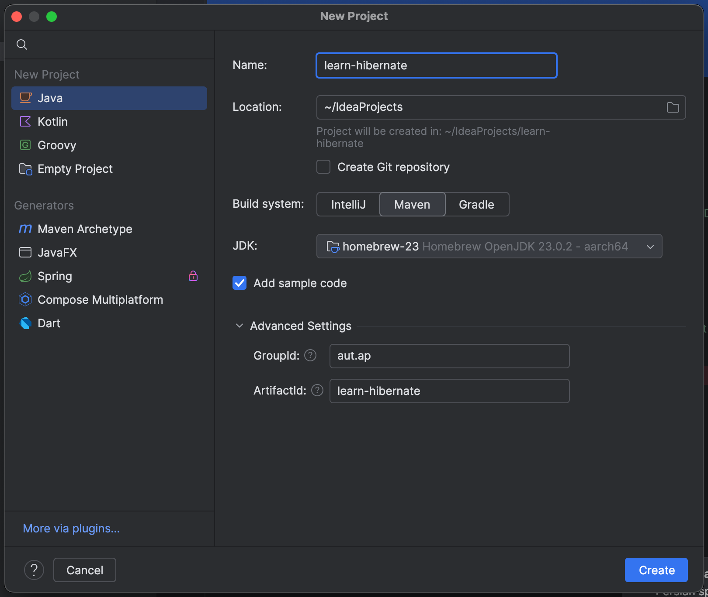

نهایتا دکمه Create رو بزنید. به اولین پروژه Maven تون خوش اومدین! ساختار پروژه‌تون یه خورده
عوض شده و الآن یه خورده جدی‌تر به نظر میرسه ولی نگران نباشید هنوزم همه چیزش جاو است. بیاین ساختار جدید پروژه‌مون رو ببینیم:

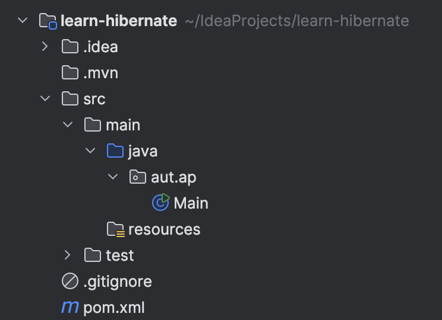

با دایرکتوری‌های `.idea` و `.mvn` کار خاصی نداریم. IntelliJ و Maven اطلاعاتی که از پروژه‌ی ما نیاز دارن رو توی این دایرکتوری‌ها نگه می‌دارن و ما بهشون دست نمی‌زنیم. ولی باقی فایل‌ها و دایرکتوری‌ها به این شکل هستن:
- **دایرکتوری `src`** : این دایرکتوری الآن شامل دو دایرکتوری جدید `main` و `test` ‍ه.
	- **دایرکتوری `test`** : توی دنیای واقعی برنامه‌های موفق قبل از انتشار نسخه‌های جدید تست می‌شن تا دولوپرها (و رئیس‌ها!) مطمئن بشن که برنامه جدیدشون باگ خاصی نداره. خیلی از این تست‌ها به جای آدمیزاد توسط کامپیوتر انجام میشه و دایرکتوری `test` شامل کدهای پشت این `test` هاست ما توی AP کار خاصی با این دایرکتوری نداریم ولی اگر دوست دارین خودتون میتونید [این ویدئو](https://youtu.be/vZm0lHciFsQ) رو راجع بهش ببینید و برنامه هاتون رو راحت‌تر تست کنید!
	- **دایرکتوری `main`** : این دایرکتوری شامل کدهای برنامه‌مونه خود `main` شامل دو دایرکتوری `resources` و `java`  هست.
		- **دایرکتوری `java`** : این دایرکتوری جاییه که کدهای جاوامون رو مینویسیم. شبیه همون `src` ی پروژه های قدیمیمونه! اگر دقت کنید، الآن هم پکیج `aut.ap` و فایل `Main` مون توشه.
		- **دایرکتوری `resources`** : لزوماً همه فایل‌های مرتبط با برنامه‌ی ما، کد جاوا نیستن خیلی هاشون عکسن، `config` ان و کلی چیزهای دیگه فایل‌های غیر کدی برنامه‌مون رو اینجا می‌ذاریم.
- **فایل `gitignore`** : دیگه تا اینجای کار خوب می‌دونید که این فایل چه کار می‌کنه!
- **فایل `pom.xml`** : این فایل مهم‌ترین چیزیه که به پروژه‌مون اضافه شده. از این به بعد که ما برای build کردن کدهامون از Maven استفاده می‌کنیم، می‌تونیم توی این فایل اطلاعات پروژه‌مون رو به Maven توضیح بدیم. مثلاً اگر بخوایم بگیم که «پروژه ما از Hibernate استفاده می‌کنه.»، اون رو اینجا می‌نویسیم یه مقدار جلوتر با هم دیگه این فایل رو عوض می‌کنیم.

روی فایل `Main` کلیک کنید:
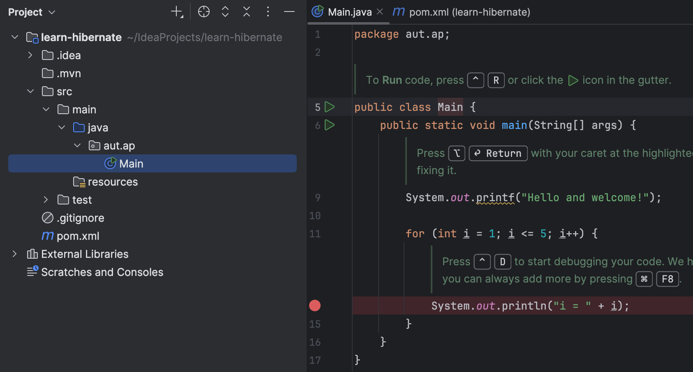

جاوای آشنای ما این جاست! دکمه run رو بزنید تا برنامه تون اجرا بشه. بعد از اجرای برنامه تون، دایرکتوری `target` به ساختار پروژه‌تون اضافه می‌شه:


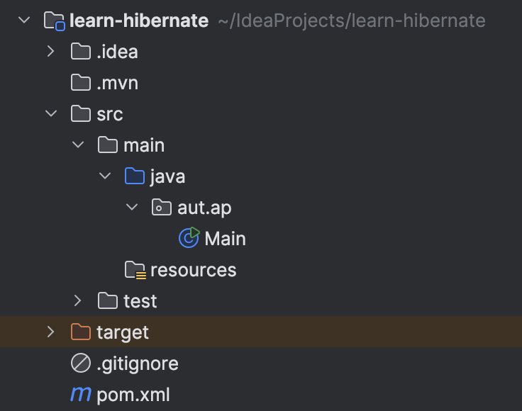

این دایرکتوری شبیه همون دایرکتوری `out` قدیمی تونه و خروجی build مون رو نگه می‌داره. اگر یه نگاه داخلش بندازین هم خروجی build برنامه‌تون رو می‌بینید:

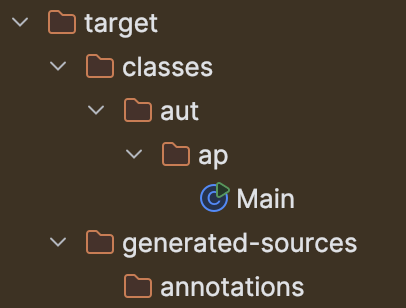

خیلی هم خوب. حالا که با ساختار جدید پروژه هاتون آشنا شدین[^2]، بیاین تا Hibernate رو به برنامه‌مون اضافه کنیم.

### اضافه کردن Hibernate

همون‌طور که گفتیم، Hibernate صرفا یک کتابخونه‌ست پر از کدهای جاوا[^3] که به شما توی برقراری ارتباط با دیتابیستون کمک می‌کنه. Hibernate دقیقاً شبیه پکیج‌های دیگه‌ایه که تا الآن ابتدای کد جاواتون import می‌کردین، با این تفاوت که به طور پیش فرض توی پروژه‌ی شما وجود نداره و باید قبل
از استفاده از اون، کدهاش رو دریافت کنید.
به فایل `pom.xml` برین. این فایل الآن یک همچین شکل و قیافه ای داره:


```xml
<?xml version="1.0" encoding="UTF-8"?>
<project xmlns="http://maven.apache.org/POM/4.0.0"
         xmlns:xsi="http://www.w3.org/2001/XMLSchema-instance"
         xsi:schemaLocation="http://maven.apache.org/POM/4.0.0
http://maven.apache.org/xsd/maven-4.0.0.xsd">
    <modelVersion>4.0.0</modelVersion>
    
    <groupId>aut.ap</groupId>
    <artifactId>learn-hibernate</artifactId>
    <version>1.0-SNAPSHOT</version>
    
    <properties>
        <maven.compiler.source>23</maven.compiler.source>
        <maven.compiler.target>23</maven.compiler.target>
        <project.build.sourceEncoding>UTF-8</project.build.sourceEncoding>
    </properties>
</project>
```

به همچنین فایلی، XML می‌گن. اگر قبلا با HTML کار کرده باشین ظاهرش براتون آشناست. این فایل پروژه شما رو برای Maven توصیف می‌کنه.

زیر تگ `</properties>` توی خط یکی مونده به آخر، قبل از بسته شدن`</project>`، بخش dependencies رو اضافه کنید:

```xml
<dependencies>
    <dependency>
        <groupId>org.apache.logging.log4j</groupId>
        <artifactId>log4j-core</artifactId>
        <version>2.20.0</version>
    </dependency>

    <dependency>
        <groupId>jakarta.persistence</groupId>
        <artifactId>jakarta.persistence-api</artifactId>
        <version>3.1.0</version>
    </dependency>

    <dependency>
        <groupId>org.hibernate</groupId>
        <artifactId>hibernate-core</artifactId>
        <version>6.6.13.Final</version>
    </dependency>

    <dependency>
        <groupId>com.mysql</groupId>
        <artifactId>mysql-connector-j</artifactId>
        <version>9.3.0</version>
    </dependency>
</dependencies>
```

این‌ها، همگی package‌ ها و library‌ هایی ان که برای پروژه‌مون نیاز داریم. بیاین یه خورده اون‌ها رو بهتون معرفی کنیم:
- پکیج `log4j-core` : این پکیج، به Hibernate توی لاگ کردن بعضی اطلاعات کمک می‌کنه. در ادامه می‌بینین که Hibernate چطور ازش استفاده می‌کنه.
 - پکیج `jakarta.persistence-api` : همون‌طور که گفتیم، ORM‌ های مختلفی توی دنیای جاوا وجود دارد. حدوداً همه اون ORM‌ ها، از جمله Hibernate، تعریفی که توی پکیج Jakarta Persistence API شده رو پیاده‌سازی می‌کنن. ما خیلی کار مستقیمی با این پکیج نداریم و شما هم لازم نیست الآن خودتون رو درگیرش کنید. فقط لازمه بدونید وقتی که از Hibernate استفاده می‌کنین، لازمه که این پکیج هم به پروژه‌تون اضافه کنید.
 - پکیج `hibernate-core` : اصل کار ما با اینه! این پکیج، کدهای Hibernate رو نگه‌داری می‌کنه.
-  پک `mysql-connector-j`: هایبرنیت با دیتابیس‌های مختلفی کار می‌کنه که MySQL تنها یکی از اون‌هاست. ممکنه دیتابیس شما PostgreSQL، Microsoft SQL Server یا هر چیز دیگه‌ای باشه. این پکیج، به Hibernate توی ارتباط با دیتابیس‌تون کمک می‌کنه.همین!

الآن که dependency‌ های پروژه‌مون رو اضافه کردیم، وقتشه اون‌ها رو نصب کنیم. یه دکمه کوچولو بالا سمت چپ فایل `pom.xml` پدیدار شده:

 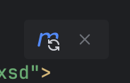

روش کلیک کنید و صبر کنید تا dependency‌ هاتون کاملاً sync بشن. در صورت موفقیت یه همچین صفحه‌ای می‌بینید:

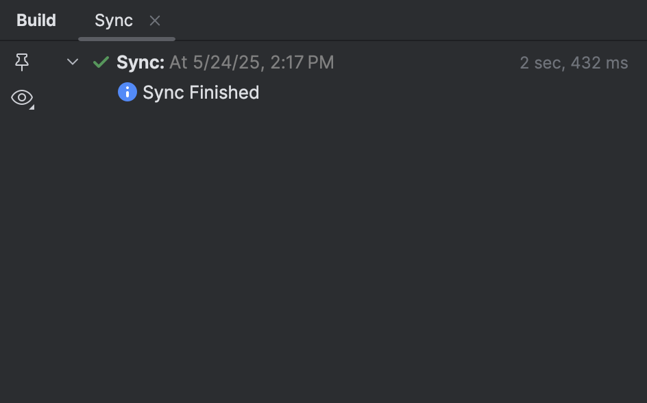

خیلی خوب، حالا دیگه می‌تونید از Hibernate استفاده کنید. بریم سراغ قدم بعدی.

#### Configuration

حالا که Hibernate روی سیستم‌تونه، باید یه خورده اون رو تنظیم کنید. مثلاً باید بهش بگید که دیتابیس‌تون کجاست و چجوری باید بهش وصل بشه. این کار رو از طریق یه فایل به اسم `hibernate.cfg.xml` انجام می‌دیم.

قبلش، بیاید یه دیتابیس برای برنامه‌مون درست کنیم. توی دایرکتوری `src/main`، یه دایرکتوری جدید به اسم `sql` درست کنید. همهٔ اسکریپت‌های دیتابیسی‌مون رو این‌جا می‌ذاریم[^4]:

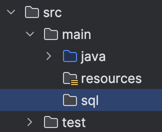

دایرکتوری `sql` رو با DataGrip باز کنید. برای این کار کافیه به File کلیک کنیم و Open رو بزنین. بعدش هم دایرکتوری `sql` رو توی سیستم‌تون پیدا کنید و اون رو باز کنید. بعد از این کار، تب Files دیتاگریپتون باید همچین شکلی داشته باشه:

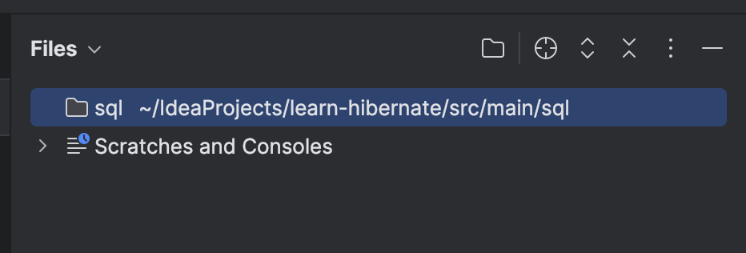

یه فایل جدید به اسم `create_db.sql` ایجاد کنید و توی اون، دیتابیس جدید برای پروژه‌تون رو درست کنید:

```mysql
create database learn_hibernate_db;
```

این اسکریپت رو اجرا کنید تا دیتابیس `learn_hibernate_db` ساخته بشه. توی برنامه‌مون هم از همین دیتابیس استفاده می‌کنیم.

وقتی که مطمئن شدین دیتابیس‌تون ساخته شده، به IntelliJ برگردین. باید فایل `sql` و `create_db.sql` رو توی تب Project ببینین:

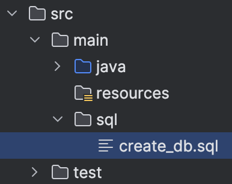

حالا، باید به Hibernate بگیم که چطور می‌تونه به این دیتابیس وصل بشه. توی دایرکتوری `src/main/resources` فایل `hibernate.cfg.xml` را ایجاد کنید:

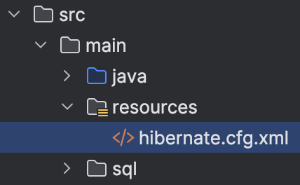

توی این فایل، اطلاعات زیر رو بنویسید:

```xml
<?xml version="1.0" encoding="UTF-8"?>
<!DOCTYPE hibernate-configuration
        PUBLIC "-//Hibernate/Hibernate Configuration DTD 3.0//EN"
        "http://www.hibernate.org/dtd/hibernate-configuration-3.0.dtd">
<hibernate-configuration>
    <session-factory>
        <!-- JDBC database connection settings -->
        <property name="hibernate.connection.driver_class">
            com.mysql.cj.jdbc.Driver
        </property>
        <property name="hibernate.connection.url">
            YOUR_DB_URL
        </property>
        <property name="hibernate.connection.username">
            YOUR_USERNAME
        </property>
        
        <property name="hibernate.connection.password">
            YOUR_PASSWORD
        </property>
        
        <!-- Hibernate settings -->
        <property name="hibernate.show_sql">true</property>
        <property name="hibernate.format_sql">true</property>
        <property name="hibernate.highlight_sql">true</property>
    </session-factory>
</hibernate-configuration>
```


به جای `YOUR_DB_URL` آدرس دیتابیس‌تون رو بنویسین. اگر یادتون رفته، این آدرس همون URL ای بود که موقع اضافه کردن Data Source جدید، به DataGrip می‌دادید، مثلاً برای من این شکلیه:


دقت کنید که حتماً اسم خود دیتابیسی که درست کردین هم توی انتهای این URL باشه. به جای `YOUR_USERNAME` و `YOUR_PASSWORD` هم یوزرنیم و پسورد دیتابیس‌تون رو بنویسید. مثلاً برای من، به ترتیب `root` و `123` بوده و فایل تنظیمات به این شکل شده:

```xml
<!-- JDBC database connection settings -->
<property name="hibernate.connection.driver_class">
    com.mysql.cj.jdbc.Driver
</property>
<property name="hibernate.connection.url">
    jdbc:mysql://localhost:3306/learn_hibernate_db
</property>
<property name="hibernate.connection.username">
    root
</property>
<property name="hibernate.connection.password">
    123
</property>
```

اگر دقت کنید، من اسم دیتابیسی که درست کرده بودیم رو هم توی URL دیتابیس‌ام نوشتم. حتماً این کار رو بکنید تا Hibernate بدونه که باید به کدوم دیتابیس متصل بشه. همچنین، توی property اولمون به Hibernate می‌گیم که این دیتابیس MySQL است.

سه‌تا property دیگه هم این‌جا مشخص کردیم؛

```xml
<!-- Hibernate settings -->
<property name="hibernate.show_sql">true</property>
<property name="hibernate.format_sql">true</property>
<property name="hibernate.highlight_sql">true</property>
```

این property‌ها بهمون نشون می‌دن که چه کوئری‌هایی Hibernate روی دیتابیس می‌زنه. یکم جلوتر می‌بینید که چه تاثیری روی برنامه‌مون گذاشتن. فعلاً بهشون دست نزنید!

تا اینجای کار رو انجام دادیم. حالا باید فایل `log4j2.properties` رو هم توی دایرکتوری `resources` درست کنید. این فایل، تنظیمات پکیج Log4j 2.0 رو نگه می‌داره و باعث می‌شه خروجی برنامه‌تون خوشگل‌تر باشه. توی این فایل هم اطلاعات زیر رو کپی کنید:

```text
rootLogger.level = info

rootLogger.appenderRefs = console
rootLogger.appenderRef.console.ref = console

logger.hibernateSQL.name = org.hibernate.SQL
logger.hibernateSQL.level = info

logger.hibernateBind.name = org.hibernate.orm.jdbc.bind
logger.hibernateBind.level = trace

appender.console.name = console
appender.console.type = Console
appender.console.layout.type = PatternLayout
appender.console.layout.pattern = %highlight{[%p]} %m%n
```

#### اطلاعات دیتابیس‌تون رو کامیت نکنید


اگر الان فایل `hibernate.cfg.xml` رو کامیت کنید، هر کسی که ریپوی شما رو ببینه می‌تونه به یوزرنیم و پسورد دیتابیس‌تون دسترسی داشته باشه. خصوصاً اگر از دیتابیس ابری (مثل Liara) استفاده می‌کنید، نباید به هیچ وجه این کار رو بکنید. ولی خب، شما نمی‌توانید تنظیمات Hibernate رو کامیت نکنید، راه حل چیه؟

یه فایل جدید، به اسم `hibernate.cfg.xml.template` توی دایرکتوری `resources` درست کنید:

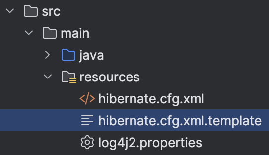

توی فایل جدید، اطلاعات زیر رو وارد کنید:

```xml
<?xml version="1.0" encoding="UTF-8"?>
<!DOCTYPE hibernate-configuration
PUBLIC "-//Hibernate/Hibernate Configuration DTD 3.0//EN"
"http://www.hibernate.org/dtd/hibernate-configuration-3.0.dtd">
<hibernate-configuration>
    <session-factory>
        <!-- JDBC database connection settings -->
        <property name="hibernate.connection.driver_class">
            com.mysql.cj.jdbc.Driver
        </property>
        <property name="hibernate.connection.url">
            YOUR_DB_URL
        </property>
        <property name="hibernate.connection.username">
            YOUR_USERNAME
        </property>
        <property name="hibernate.connection.password">
            YOUR_PASSWORD
        </property>
        
        <!-- Hibernate settings -->
        <property name="hibernate.show_sql">true</property>
        <property name="hibernate.format_sql">true</property>
        <property name="hibernate.highlight_sql">true</property>
    </session-factory>
</hibernate-configuration>
```

ولی این بار، اطلاعات دیتابیس‌تون رو توی فایل `template` وارد نکنید. حالا فایل `hibernate.cfg.xml` را به انتهای `.gitignore` اضافه کنید:
```gitignore
## Config ##
src/main/resources/hibernate.cfg.xml
```

حالا اگر کسی یه نگاه به ریپوی پروژه‌تون بندازه، به جای فایل `hibernate.cfg.xml`، فایل `hibernate.cfg.xml.template` رو می‌بینه که اطلاعات حساس دیتابیس‌تون رو توش ننوشتین! عالی! فقط حواستون باشه که اگر توی فایل `hibernate.cfg.xml` تغییری دادین، فایل `hibernate.cfg.xml.template` رو هم تغییر بدین.
### تست پروژه

قبل از شروع به کدنویسی، باید تست کنیم که تنظیمات‌مون تا این‌جای کار درست بوده یا نه. به سراغ تابع `main` برین و کد زیر رو اون‌جا کپی کنید. فعلاً کاری با این که این کد چطور کار می‌کنه نداریم و صرفاً می‌خواهیم اتصالمون به دیتابیس رو تست کنیم:

```java
package aut.ap;

import org.hibernate.SessionFactory;
import org.hibernate.cfg.Configuration;

public class Main {
    public static void main(String[] args) {
        SessionFactory sessionFactory = new Configuration()
                .configure("hibernate.cfg.xml")
                .buildSessionFactory();
        
        sessionFactory.close();
    }
}
```

این `import` های اول کدمون رو می‌بینید؟ این، اولین کد Hibernate شماست! باید بدون خطا هم برای شما اجرا بشه:
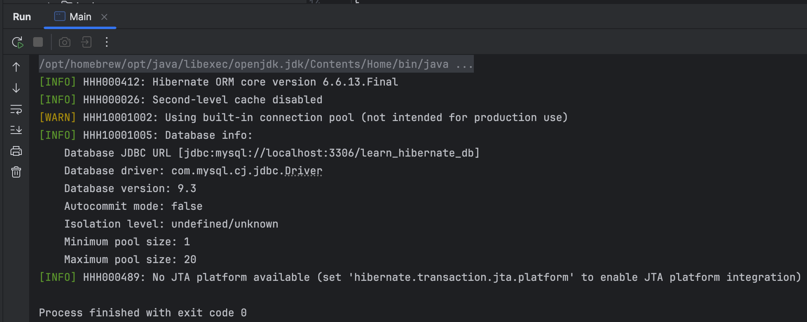

خروجی برنامه‌تون، شامل یک‌سری log از طرف Hibernate ‍ه. مثلاً اطلاعات دیتابیس‌تون رو می‌تونید این‌جا ببینید. می‌بینید که خروجی این برنامه، چه‌قدر قشنگ و مرتبه؟ این‌ها به‌خاطر پکیج `log4j` ‍ه که بالاتر نصبش کردیم.

اگر توی اجرای این برنامه به خطا خوردین، خطا رو بخونید و سعی کنید برطرفش کنید. اگر نشد، اولین تدریس‌یار نزدیکتون بخواید تا توی برطرف کردن خطا کمک‌تون کنه!

## Entity ها در Hibernate

بیاید کلاس `Task` رو به برنامه‌مون اضافه کنیم. توی پکیج `aut.ap`، یه پکیج جدید به اسم `model` ایجاد کنید:

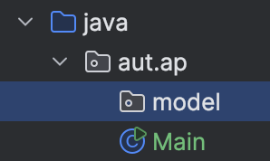

و توی این پکیج، کلاس `Task` رو اضافه کنید:

```java
public class Task {
    private Integer id;
    private String name;
    private LocalDate dueDate;
}
```

اگر دقت کنید، توی این کلاس فیلد `dueDate` به جای این که از جنس `Date` باشد، از جنس `LocalDate` ‍ه. وقتی دارید با Hibernate کار می‌کنید بهتره که فیلدهای زمانی‌تون از جنس `Date` نباشن.[^5]

راستی، حواستون باشه که ما `id` رو به جای `int` از نوع `Integer` تعریف کردیم. وقتی ببینیم که `id` ها چطور توی Hibernate هندل می‌شن، توضیح می‌دیم که چرا این کار رو کردیم.

حالا برای فیلدهامون setter و getter تعریف می‌کنیم:

```java
public Integer getId() {
    return id;
}

public void setId(Integer id) {
    this.id = id;
}

public String getName() {
    return name;
}

public void setName(String name) {
    this.name = name;
}

public LocalDate getDueDate() {
    return dueDate;
}

public void setDueDate(LocalDate dueDate) {
    this.dueDate = dueDate;
}
```

اگر دقت کنید، برای فیلد `id` هیچ setter ای تعریف نکردیم. می‌توانستیم بکنیم راستش، ولی همون‌طور که در ادامه می‌بینید، این دیتابیسه که `id` موجودیت‌های ما رو مشخص می‌کند و به همین خاطر، نیازی به اضافه کردن setter برای این فیلد نداریم.

حالا، دوتا constructor هم برای این کلاس تعریف می‌کنیم:

```java
public Task() {
}

public Task(String name, LocalDate dueDate) {
    this.name = name;
    this.dueDate = dueDate;
}
```

تمام موجودیت‌هایی که Hibernate ازشون استفاده می‌کنه، **باید یک constructor پابلیک داشته باشن که هیچ ورودی‌ای نداره**. همون‌طور که می‌دونید، اگر برای کلاس‌تون constructor جدیدی تعریف نکنید، خود جاوا یک constructor خالی و پابلیک براش می‌ذاره. اما این‌جا چون ما خواستیم یه constructor دیگه هم برای کلاسمون تعریف کنیم، مجبور شدیم که خودمون constructor خالی رو هم برای این کلاس بنویسیم.

نهایتاً هم، برای این که بتونیم تسک‌هامون رو پرینت کنیم، متد `toString` رو براش تعریف می‌کنیم:

```java
@Override
public String toString() {
    return "Task{" +
            "id='" + id + '\'' +
            ", name='" + name + '\'' +
            ", dueDate='" + dueDate + '\'' +
            '}';
}
```

بیاین برای این که مطمئن شیم همه چی درست کار می‌کنه، یه تسک درست کنیم و پرینتش کنیم:

```java
public static void main(String[] args) {
    Task t = new Task("Read Hibernate Document", LocalDate.now());
    System.out.println(t);
}
```

خروجی این کد به شکل زیر است:

```text
Task{id='null', name='Read Hibernate Document', dueDate='2025-05-24'}
```

همون طور که می‌بینید، ‍ تسکمون مقداردهی نشده و `null` است. اگر `id` از نوع `int` بود، این مقدار `0` می‌شد.[^6]

بیاید یه جدول هم برای تسک‌هامون بسازیم. به DataGrip برگردین و توی دایرکتوری `sql`، اسکریپت `tasks.sql` رو ایجاد کنید. توی اون، کوئری‌های زیر رو بنویسید:

```mysql
use learn_hibernate_db;

create table tasks (
    id int primary key auto_increment,
    name nvarchar(255) not null,
    due_date date not null
);
```

این اسکریپت رو اجرا کنید تا جدول `tasks` هم به وجود بیاد.

حالا که هم کلاسمون رو درست کردیم، هم جدولمون رو، بیاین اون‌ها رو به هم وصل کنیم!

### تعریف Entity جدید

هدف Hibernate، پیوند دادن کلاس‌های جاوا و جداول دیتابیس بود. Hibernate این کار رو از طریق annotation‌هایی که باال‌ی کلاس‌ها و فیلد‌هاتون می‌نویسید انجام می‌ده.

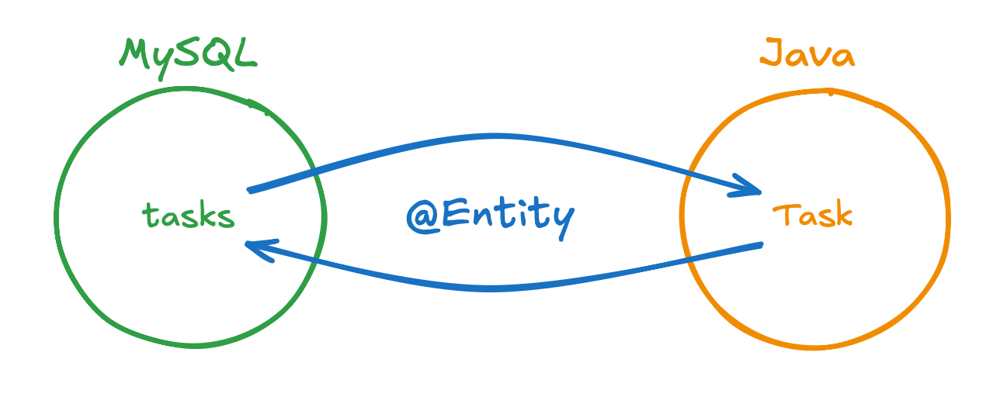

یکی از اصلی‌ترین annotation‌های هایبرنیت، `@Entity` است. این annotation باید بالای هر کلاسی که به یه جدول توی دیتابیس وصله، حضور داشته باشه. به کلاس `Task` برگردین و این annotation رو بالای اون بنویسید:

```java
@Entity
public class Task {
    // code code code
}
```

دومین چیزی که باید به Hibernate بگین، اینه که این کلاس به چه جدولی وصل می‌شه. برای این کار از annotation ای به اسم `@Table` استفاده می‌کنیم و اون رو هم بالای کلاسمون می‌نویسیم:

```java
@Entity
@Table(name = "tasks")
public class Task {
    // code code code
}
```

توی این annotation، فیلد `name`، اسم جدول‌تون رو نشون می‌ده. Hibernate از این به بعد کلاس `Task` رو به جدول `tasks` وابسته می‌دونه.

نهایتاً، باید به فایل `hibernate.cfg.xml` برگردین و اون‌جا هم، اسم کامل کلاس‌تون (به همراه اسم پکیجش) رو به Hibernate معرفی کنید. برای این کار، کد زیر رو بعد از بخش Hibernate Settings و قبل از بسته شدن `</session-factory>` کپی کنید:

```xml
<!-- Mappings -->
<mapping class="aut.ap.model.Task" />
```

### تعریف اطلاعات ستون‌ها

حالا، Hibernate می‌دونه که کلاس `Task` و جدول `tasks` به هم دیگه مرتبطند. ولی فیلدهای `Task` و ستون‌های `tasks` چطور؟ مثلاً Hibernate از کجا بدونه که فیلد `dueDate` و ستون `due_date` به هم مرتبطند؟ یا این که فیلد `id` در واقع primary key جدول `tasks` ‍ه. ما باید با annotation‌ های جدید، فیلدهای کلاس `Task` رو هم برای Hibernate توضیح بدیم.

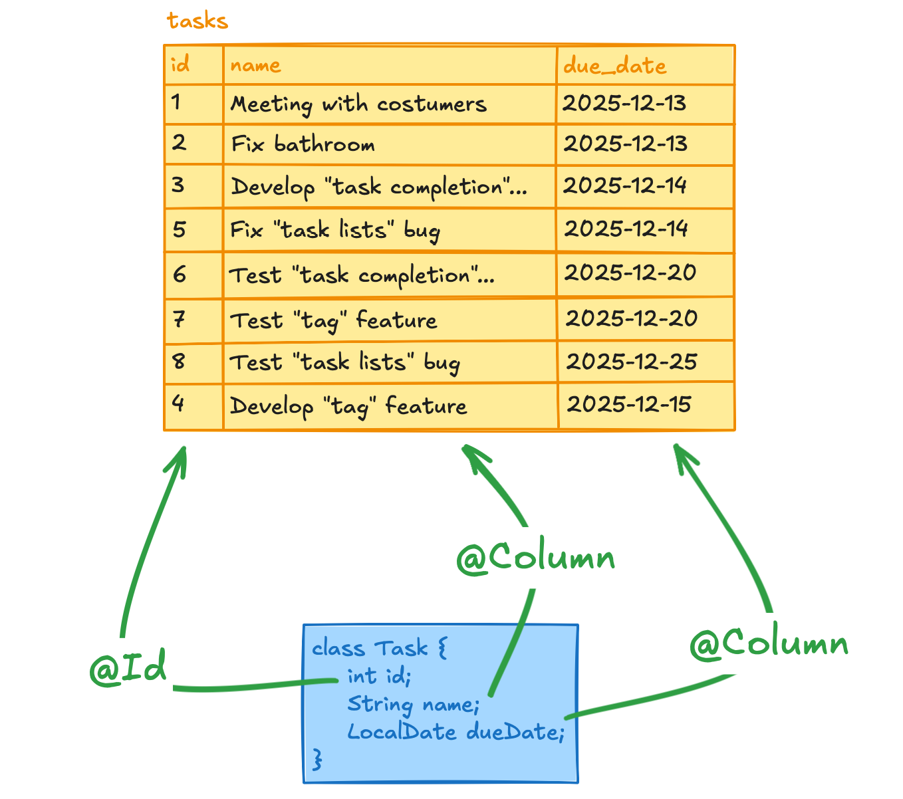

از فیلد `id` شروع می‌کنیم. ستون `id` توی جدول `tasks` دو خاصیت اصلی داره:
1.  این ستون، primary key است.
2.  این ستون، `auto_increment` است. به همین خاطر لازم نیست که توی هر `insert` مقدار اون رو به دیتابیس بدیم.

هر دوی این خواص رو می‌توانیم به Hibernate بفهمونیم. برای این که بهش بگیم فیلد `id` توی جدولمون primary key ‍ه، از annotation به اسم `@Id` استفاده می‌کنیم:

```java
@Id
private Integer id;
```

و برای این که به Hibernate بگیم که این ستون `auto_increment` است و به‌صورت اتوماتیک مقداردهی می‌شود، از annotation دیگه‌ای به اسم `@GeneratedValue` استفاده می‌کنیم. این annotation به Hibernate می‌گه که `id` توسط دیتابیس داده می‌شود و ما لازم نیست مقداردهی‌ش کنیم:

```java
@Id
@GeneratedValue(strategy = GenerationType.IDENTITY)
private Integer id;
```

خوبه بدونید که ممکنه ما شیوه‌های مختلفی به جز `auto_increment` برای مقداردهی ستون `id` داشته باشیم. مثلاً شاید بخواهیم به جای این که `id` ی رکوردهای جدید، یکی بیشتر از آخرین رکورد باشد، دو برابر اون باشه! این استراتژی برای مشخص کردن `id` رکوردهای جدید خیلی احمقانه‌ست ولی شدنیه و به ما اثبات می‌کنه که تنها راه مقداردهی اتوماتیک `id`، استفاده از `auto_increment` نیست. به خاطر همین موضوع، ما توی `@GeneratedValue` مشخص کردیم که استراتژی‌مون برای `id`های جدید، `GenerationType.IDENTITY` است. این enum برای Hibernate، معادل همان `auto_increment`ی هست که توی MySQL نوشتیم. به خاطر همین هم شما اگر کار عجیب‌وغریبی نکنید، احتمالاً از همین مقدار برای `strategy` استفاده خواهید کرد.

حالا لازمه که باقی فیلدهامون رو هم به ستون‌های متناظرشون متصل کنیم. از `name` شروع می‌کنیم. این فیلد یه خاصیت توی دیتابیسمون داره، این که `not null` است. با استفاده از annotation ای به اسم `@Basic` می‌توانیم این رو به Hibernate بفهمونیم:

```java
@Basic(optional = false)
private String name;
```

توی این annotation، مقدار `optional` رو `false` تعیین کردیم. این یعنی فیلد `name` برای Task‌هامون اختیاری نیست و نمی‌تونه `null` باشه.

به سراغ فیلد `dueDate` می‌ریم. ستون متناظر این فیلد، یعنی `due_date` هم `not null` شده و مجدداً لازمه `@Basic` رو بالای این فیلد بنویسیم:

```java
@Basic(optional = false)
private LocalDate dueDate;
```

علاوه بر اون، اسم این فیلد هم متأسفانه با ستون `due_date` متفاوته. به خاطر همین موضوع، ما باید به Hibernate بگیم که این فیلد رو متناظر با ستون `due_date` در نظر بگیره. برای این کار از annotation ای به اسم `@Column` استفاده می‌کنیم:

```java
@Basic(optional = false)
@Column(name = "due_date")
private LocalDate dueDate;
```

مقدار فیلد `name` این annotation رو با اسم ستون متناظر فیلدمون پر می‌کنیم. اگر دقت کنید، برای فیلدهای `id` و `name` کلاسمون نیازی به این کار نداشتیم، چون که این فیلدها کاملاً هم‌اسم ستون‌های متناظرشون، یعنی `id` و `name` بودن.

## SQL ها و اجرای دستورات با Session

کم کم داریم به بخش اصلی Hibernate می‌رسیم! وقتشه که با استفاده از کدهای جاوا‌مون، دیتابیس رو تغییر بدیم. قبل از اون اما، لازمه که با مفهوم Session توی Hibernate آشنا بشیم.

### Session ها

توی هایبرنیت Session‌ ها هستند که ارتباط ما رو با دیتابیس برقرار می‌کنن.  Session‌ ها به ما اجازه می‌دن که رکوردهای جدید به دیتابیس اضافه کنیم، اون‌ها رو پاک کنیم، آپدیتشون کنیم، یا اون‌ها رو از دیتابیس بخونیم. هر کوئری‌ای که تا الان توی دیتابیسمون اجرا می‌کردیم رو می‌تونیم با استفاده از session‌ ها توی جاوا بنویسیم.

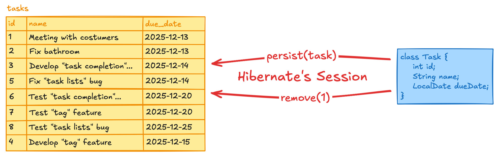

هایبرنیت، از طریق کلاسی به اسم `SessionFactory` به ما اجازه ساخت Session جدید رو می‌ده. یعنی ما توی برنامه‌مون می‌تونیم Session‌ های مختلفی برای کارهای متفاوتمون داشته باشیم. مثلاً یه Session برای ذخیره‌ی `Task‌` هامون داشته باشیم، یه Session برای حذف `Task‌` هامون، و یه Session هم برای دیدن کل `Task‌` های دیتابیس. برای این کارها، می‌تونیم توی برنامه‌مون سه Session مختلف از `SessionFactory` بگیریم و توی هر کدوم یه کار متفاوت انجام بدیم:
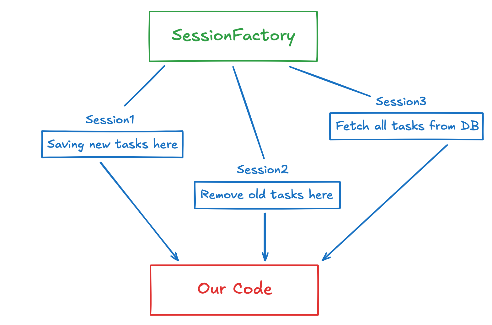

امیدوارم که متوجه کاربرد Session ها شده باشین. اما اگر نشدین، نگران نباشید. وقتی کدش رو ببینید خیلی راحت‌تر می‌فهمید که چطور از اون‌ها استفاده می‌کنیم.

### ایجاد `SessionFactory`

به کلاس `Main` جاوا‌تون برگردین. اولین چیزی که نیاز داریم، یه `SessionFactory` است که بتوانیم ازش Session های جدید بگیریم. برای این کار، یه فیلد `static` از جنس `SessionFactory` به کلاس `Main` اضافه کنید:
```java
public class Main {
    private static SessionFactory sessionFactory;
    // code code code
}
```

یه متد به اسم `setUpSessionFactory()` به `Main` اضافه می‌کنیم که توی اون `sessionFactory` رو مقدار دهی کنیم. `SessionFactory` مون باید اطلاعات دیتابیسی که بهش وصل می‌شیم رو داشته باشه، و ما این اطلاعات رو توی `hibernate.cfg.xml` مشخص کردیم. به همین خاطر، برای مقداردهی اون از کد زیر استفاده می‌کنیم:

```java
private static void setUpSessionFactory() {
    sessionFactory = new Configuration()
            .configure("hibernate.cfg.xml")
            .buildSessionFactory();
}
```


لازم نیست کد بالا رو خیلی دقیق بفهمین. صرفاً بدونید که این تکه کد، فایل `hibernate.cfg.xml` رو می‌خونه، از توش اطلاعات دیتابیس رو می‌گیره، و یه `SessionFactory` برای ارتباط با اون دیتابیس بهمون می‌ده.

همچنین، باید بعد از تمام شدن کار، `sessionFactory` رو `close` کنیم.[^7] برای این کار، متد `closeSessionFactory()` رو هم به `Main` اضافه می‌کنیم:
```java
private static void closeSessionFactory() {
    sessionFactory.close();
}
```

حالا این متدها رو در ابتدا و انتهای متد `main` صدا می‌زنیم:
```java
public static void main(String[] args) {
    setUpSessionFactory();
    // our code is here
    closeSessionFactory();
}
```

بین این دو صدا زدن متدها، می‌توانیم از `SessionFactory` مون استفاده کنیم. توی کد زیر، یه `Session` جدید از `SessionFactory` می‌گیریم. این `Session` هم باید بعد از تمام شدن استفاده، `close` بشه:

```java
public static void main(String[] args) {
    setUpSessionFactory();
    
    Session session = sessionFactory.openSession();
    
    // th code that uses the session goes here
    
    session.close();
    
    closeSessionFactory();
}
```

حالا که Sessionمون رو درست کردیم، می‌تونیم ازش استفاده کنیم. برای استفاده از دیتابیسمون، از کد زیر استفاده می‌کنیم:

```java
public static void main(String[] args) {
    setUpSessionFactory();

    Session session = sessionFactory.openSession();

    try {
        // We're going to use the session
        Transaction tx = session.beginTransaction();

        // We're using the database...
        // CODE CODE CODE

        // We're done using the session. Save everything to the database.
        tx.commit();
    } catch (Exception e) {
        System.out.println("Exception in the database: " + e.getMessage());
    } finally {
        session.close();
    }

    closeSessionFactory();
}
```

همون‌طور که می‌بینید، برای استفاده از session مون اول یه transaction شروع می‌کنیم. هر transaction یه بلوک از کد‌هایی که توشون از دیتابیس می‌خونیم یا اون رو تغییر می‌دیم رو مشخص می‌کنه. نهایتاً، با صدا زدن متد `commit`، تغییراتمون رو توی دیتابیس ذخیره می‌کنیم.

ممکنه تغییرات دیتابیسی‌مون با خطا مواجه بشن، برای همین هم کل کدهای مرتبط با transaction مون رو از شروع تا پایان، توی یه try-catch گذاشتیم که این خطاها منجر به crash کردن برنامه‌مون نشن.[^8]

همه‌چیز برای تغییر دیتابیس آماده است. اولین تغییراتمون رو، با ذخیره‌ی یک `Task` شروع می‌کنیم.

### ذخیره کردن در دیتابیس

بیاین یه `Task` بسازیم و اون رو توی جدول `tasks` ذخیره کنیم. با توجه به annotation‌ هایی که برای کلاس `Task` نوشتیم، Hibernate ارتباط بین `tasks` و `Task` رو به طور کامل متوجه شده. پس ذخیره یه تسک جدید نباید کار سختی باشه.
برای ذخیره یک object توی دیتابیس، از متد `persist()` استفاده می‌کنیم. کد زیر رو بخونید:
```java
public static void main(String[] args) {
    setUpSessionFactory();
    
    Session session = sessionFactory.openSession();
    
    try {
        Transaction tx = session.beginTransaction();
        Task t = new Task("Read 'Hibernate' Document", LocalDate.now());
        session.persist(t);
        tx.commit();
    } catch (Exception e) {
        System.out.println("Exception in the database: " +
               e.getMessage());
    }

    session.close();
    
    closeSessionFactory();
}
```

کد بالا، یه `Task` جدید ایجاد می‌کنه و اون رو توی دیتابیس ذخیره می‌کنه. بیاین اجراش کنیم:

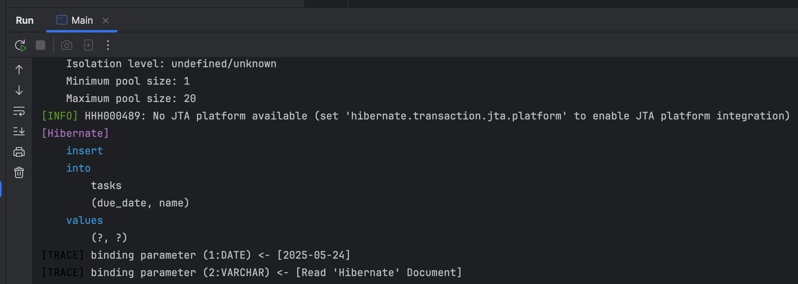

طبق معمول، Hibernate یه سری log بهمون می‌ده. لاگ آخر رو می‌بینید؟ این لاگ:
```text
[Hibernate] 
    insert 
    into
        tasks
        (due_date, name) 
    values 
        (?, ?)
[TRACE] binding parameter (1:DATE) <- [2025-05-24]
[TRACE] binding parameter (2:VARCHAR) <- [Read 'Hibernate' Document]
```

این شبیه یه کوئری SQL نیست؟ به خاطر اینه که کوئری SQL هست! وقتی `session.persist(t)` اجرا شد، Hibernate این کوئری رو توی دیتابیستون اجرا کرد. این کوئری، یه `insert into` ساده‌ست که توی بخش `values` به جای مقادیر ستون‌های `name` و `due_date`، دو تا علامت سوال داره. Hibernate قبل از اجرای این کوئری، علامت‌های سوال رو با پارامترهایی که توی لاگ‌های TRACR اومدن پر می‌کنه. این یعنی کوئری نهاییِ اجرا شده روی دیتابیس، چنین چیزیه:
```text
insert
into
    tasks
    (due_date, name)
values
    ('2025-05-24', 'Read \'Hibernate\' Document')
```

این که این کوئری‌های دیتابیسی رو به ما نشون می‌ده اتفاقی نیست. اگر یادتون باشه، توی فایل `hibernate.cfg.xml` این تنظیمات رو اضافه کرده بودیم:

```xml
<!-- Hibernate settings -->
<property name="hibernate.show_sql">true</property>
<property name="hibernate.format_sql">true</property>
<property name="hibernate.highlight_sql">true</property>
```

این تنظیمات باعث می‌شه که Hibernate تمام کوئری‌هایی که روی دیتابیس می‌زنه رو برای ما چاپ کنه. اگر حذفشون کنید و دوباره برنامه‌تون رو اجرا کنید، می‌بینید که خبری از این کوئری‌ها نیست.

اگر الان برین توی DataGrip و روی جدول `tasks` یه `SELECT * FROM tasks;` بزنید، خروجی زیر رو می‌بینید:

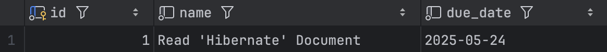


می‌بینید؟ کار کرد! برنامه‌ی جاواتون الآن کاملاً به دیتابیس متصله و می‌تونه توش تغییر ایجاد کنه!
حالا به کد جاواتون برگردین. می‌خوایم فیلم `id` ی تسک‌مون رو، قبل و بعد از ذخیره شدن اون توی دیتابیس بررسی کنیم. کد زیر رو به‌جای کد قبلی بذارید:

```java
Task t = new Task("Read 'Hibernate' Document", LocalDate.now());
System.err.println(t);

session.persist(t);
System.err.println(t);
```

ما به‌جای `System.out` توی `System.err` تسک‌مون رو چاپ کردیم که با رنگ قرمز خروجی، اون رو از log هامون متمایز کنه. این کد رو اجرا کنید و خروجی‌ش رو ببینید:
```text
Task{id=null, name='Read 'Hibernate' Document', dueDate=2025-05-25}
[Hibernate]
    insert
    into
        tasks
        (due_date, name)
    values
        (?, ?)

[TRACE] binding parameter (1:DATE) <- [2025-05-24]
[TRACE] binding parameter (2:VARCHAR) <- [Read 'Hibernate' Document]
Task{id=2, name='Read 'Hibernate' Document', dueDate=2025-05-25}
```

به فیلد `id`، قبل و بعد از ذخیره‌ی تسک‌مون توی دیتابیس دقت کنید. قبل از ذخیره، مقدار اون `null` ‍ه. ولی بعد از ذخیره، مقدارش به ۲ آپدیت می‌شه! همون‌طور که قبلاً گفتیم، توی جدول `tasks` تعیین `id` بر عهده‌ی دیتابیس بوده و Hibernate، نه‌تنها تسک‌مون رو ذخیره کرده، که `id` اون توی دیتابیس هم بهمون داده! اگر دوباره به جدول `tasks` نگاه کنید، می‌تونید این تسک جدید رو توش ببینید:

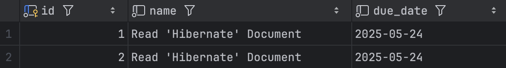

یادتونه که ما `id` ی کلاس `Task` رو به‌جای `int‍` از جنس `Integer` تعریف کردیم؟ بیاین اون رو `int‍` بذاریم و ببینیم چی می‌شه. این فیلد رو توی کلاس `Task` به شکل زیر تغییر بدین:
```text
@Id
@GeneratedValue(strategy = GenerationType.IDENTITY)
private int id;
```

حالا، دوباره کدی که زدیم رو اجرا کنید. خروجی به شکل زیره:
```text
Task{id=0, name='Read 'Hibernate' Document', dueDate=2025-05-25}
[Hibernate]
    insert
    into
        tasks
        (due_date, name)
    values
        (?, ?)
[TRACE] binding parameter (1:DATE) <- [2025-05-24]
[TRACE] binding parameter (2:VARCHAR) <-- [Read 'Hibernate' Document]
Task(id=3, name='Read 'Hibernate' Document', dueDate=2025-05-25)
```

کدمون باز هم درست کار می‌کنه، ولی مقدار اولیه `id` قبل از ذخیره‌سازی، به جای `null`، صفر است.

ولی `Integer` گذاشتن `id` به‌جای `int`، یک خوبی داره. فرض کنید فیلد `id` را از نوع `int` نگه داریم. بعد از مدتی، کد جاوامون خیلی خیلی بزرگتر شده و یه جایی از برنامه، با این تسک مواجه می‌شویم:

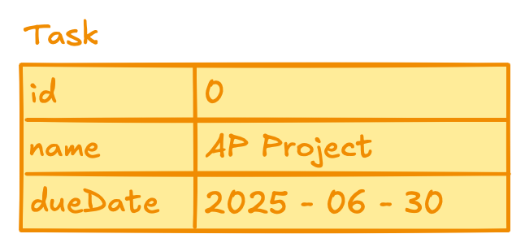

دقت کنید که `id` این `Task` صفر است. دو حالت داریم:
1.  این `Task` در دیتابیس ذخیره نشده. به خاطر همین `id` آن صفر است و بعد از ذخیره‌سازی، تغییر می‌کند.
2.  این `Task` در دیتابیس ذخیره شده و این دیتابیس بوده که به آن `id` صفر داده است. الان هم از دیتابیس خوندیمش.[^9]

هر دو سناریو می‌توانند درست باشند و شما نمی‌توانید بین این دو حالت تمایز قائل شوید. ولی فرض کنید که `id` ی `Task` به جای `int`، از نوع `Integer` بود. در این صورت، شما می‌دانستید که `Task` بالا قطعاً در دیتابیس ذخیره شده، چون `id` آن `null` نیست. در مقابل، می‌دانید که `Task` زیر قطعاً در دیتابیس ذخیره نشده:

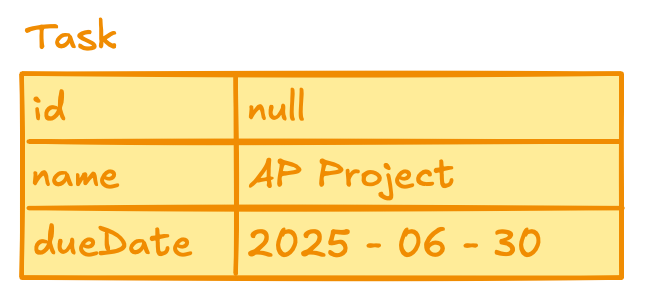

این تمایز کوچیک، خیلی جاها به ما کمک می‌کنه. به‌خاطر همین توصیه می‌شه که فیلد primary key تون رو از جنس reference type ها بذارید.[^10] برگردین و جنس فیلد `id` رو `Integer` کنید:

```java
@Id
@GeneratedValue(strategy = GenerationType.IDENTITY)
private Integer id;
```

حواستون باشه که شما می‌تونید باقی فیلدهای موجودیت‌های دیتابیس‌تون رو primitive type بذارید. فقط طبیعتاً ستون نظیر اون‌ها توی دیتابیس هم باید `not null` باشه.
### خواندن رکوردهای دیتابیس

این بخش نسبتاً راحت است. `session` ها یک متد به اسم `get` دارن که با استفاده از اون، می‌تونید رکوردهای دیتابیس‌تون رو بخونید. کد زیر رو ببینید:

```java
public static void main(String[] args) {
    setUpSessionFactory();
    
    Session session = sessionFactory.openSession();
    
    try {
        Transaction tx = session.beginTransaction();
        
        Task t = session.get(Task.class, 1);
        System.err.println("db: " + t);
        
        tx.commit();
    } catch (Exception e) {
        System.out.println("Exception in the database: " +
                e.getMessage());
    }

    session.close();

    closeSessionFactory();
}
```

بخش جدید این کد، دو خط زیر است. در این دو خط، ما به Hibernate می‌گوییم که از جدول `tasks`، رکوردی که `id` آن یک است را پیدا کند و به ما بدهد. بعدش هم آن را چاپ می‌کنیم:

```java
Task t = session.get(Task.class, 1);
System.err.println("task from db: " + t);
```

به ورودی‌های متد `get` توجه کنید. دومین ورودی آن، `id` آن رکوردی است که می‌خواهیم از دیتابیس بخوانیم. همچنین، ما باید به Hibernate بگوییم که این رکورد را از کدام جدول بخواند. اگر یادتان باشد، ما نام جدول `tasks` را با در یک annotation، بالای کلاس `Task` نوشته بودیم:

```java
@Entity
@Table(name = "tasks")
public class Task {
    // CODE CODE CODE
}
```

با دادن `Task.class` به متد `get`، هایبرنیت می‌فهمد که باید در جدول `tasks` دنبال رکورد دل‌خواه ما بگردد. همچنین دادن `Task.class` یک خوبی دیگه هم داره. اگر به declaration متد `get` برید،‌می‌بینید که این متد جنریکه:

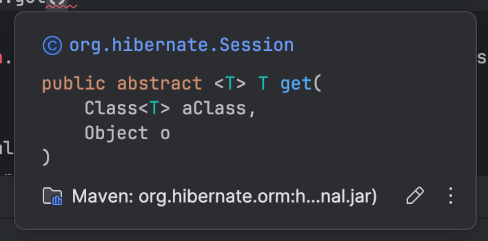


پس توی کد زیر، چطور جاوا می‌فهمه که خروجی این متد، `Task` ‍ه؟ کجای این call شما جنس `T` رو مشخص کردید؟

```java
session.get(Task.class, 1);
```

آبجکت `Task.class` از جنس `Class<Task>` است، و ورودی اول `get` هم از جنس `Class<T>` است. از روی همین ورودی، جاوا می‌فهمد که در این متد جنریک، `T` همان `Task` است و در نتیجه، خروجی `get` هم از جنس `Task` خواهد بود.

کد رو اجرا کنید و نتیجه رو ببینید:

```text
db: Task{id=1, name='Read 'Hibernate' Document', dueDate=2025-05-24}
```

تونستیم با موفقیت، تسک ۱ رو از دیتابیس بخونیم. یک نگاه به لاگ‌هاتون بندازید تا ببینید که Hibernate برای خوندن این `Task`، چه کوئری‌ای روی دیتابیس زد:

```text
[Hibernate] 
    select
        t1_0.id,
        t1_0.due_date,
        t1_0.name 
    from
        tasks t1_0 
    where
        t1_0.id=?;
[TRACE] binding parameter (1:INTEGER) <- [1]
```

می‌بینید؟ Hibernate فقط یک `select` و `where` ساده روی دیتابیس زد. اگر پارامتری که در بخش `TRACE` آمده را در کوئری لاگ شده جایگذاری کنیم، می‌بینیم که کوئری نهایی Hibernate روی دیتابیس دقیقاً چه بوده است:

```mysql
select
    t1_0.id,
    t1_0.due_date,
    t1_0.name
from
    tasks t1_0
where
    t1_0.id = 1
```

خیلی هم خوب. حالا وقتش است که یاد بگیریم رکوردهای دیتابیس خود را حذف کنیم.

### حذف رکوردها از دیتابیس

حذف رکوردها، حتی از `get` کردن آن‌ها هم راحت‌تر است. کد زیر را ببینید:

```java
public static void main(String[] args) {
    setUpSessionFactory();
    
    Session session = sessionFactory.openSession();
    
    try {
        Transaction tx = session.beginTransaction();
        
        Task t = session.get(Task.class, 1);
        System.err.println("Task from the db: " + t);
        
        session.remove(t);
        
        tx.commit();
    } catch (Exception e) {
        System.out.println("Exception in the database: " +
                e.getMessage());
    }
    
    session.close();
    closeSessionFactory();
}
```

تکه‌ی جدید این کد، خط زیر است. با دادن آبجکت `t` به متد `remove`، می‌توانیم آن را از دیتابیس پاک کنیم:

```java
session.remove(t);
```

این کد را اجرا کنید. بعدش به DataGrip بروید و روی جدول `tasks` یک `select` بزنید. همانطور که می‌بینید، تسک ۱ از دیتابیس حذف شده است:

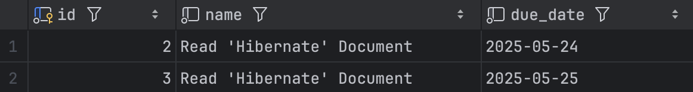

حالا بیایید کوئری‌هایی که Hibernate روی دیتابیس زد را ببینیم. به لاگ‌های Hibernate توجه کنید:

```text
[Hibernate] 
    select
        t1_0.id,
        t1_0.due_date,
        t1_0.name 
    from
        tasks t1_0 
    where
        t1_0.id=?
[TRACE] binding parameter (1:INTEGER) -> [1]
[Hibernate] 
    delete 
    from
        tasks 
    where
        id=?
[TRACE] binding parameter (1:INTEGER) -> [1]
```

هایبرنیت، این بار دو کوئری روی دیتابیس زد. کوئری اول برای `get` کردن تسک ما بود که آن را در بخش قبلی دیده بودیم. اما کوئری دوم، کوئری‌ای است که رکورد ما را از دیتابیس پاک می‌کند. این کوئری هم یک `delete` با `where` ساده است. اگر پارامتر لاگ `TRACE` را در کوئری بگذاریم، می‌بینید که کوئری نهایی اجرا شده روی دیتابیس به این شکل بوده است:

```mysql
delete
from
    tasks
where
    id=1
```

می‌توانستیم در این جا متوقف شویم. ولی چیزی راجع به برنامه بالا من را اذیت می‌کند. چرا برای حذف تسک ۱، مجبور شدیم دو تا کوئری روی دیتابیس بزنیم؟ در کوئری اول، ما تسک ۱ را `get` کردیم:
```java
Task t = session.get(Task.class, 1);
```

و در کوئری دوم، این تسک را `remove` کردیم:

```java
session.remove(t);
```

برای لحظه‌ای فرض کنید که `Session`، یک `overload` از متد `remove` داشت که ورودی‌هاش شبیه متد `get` بود:

```java
session.remove(Task.class, 1);
```

این‌طوری، لازم نبود با صدا زدن متد `get`، یه `select` و `where` روی دیتابیس بزنیم و بعدش با یک `delet‍e` و `where` تسک‌مون رو پاک کنیم‌؛ به‌جاش می‌تونستیم همه‌ی کارهامون رو توی یک کوئری انجام بدیم.

شاید این موضوع برایتان مسئله مهمی به نظر نرسد. ولی کوئری‌های Hibernate روی دیتابیس عملیات‌های نسبتاً پرهزینه‌ای هستند. برای اجرای هر کوئری، Hibernate باید به دیتابیس وصل شود، کوئری را به آن ارسال کند، منتظر جواب دیتابیس بماند و نهایتاً آن جواب را به ما بدهد. این کارها، همگی شامل عملیات‌های کند I/O هستند. به خاطر همین، ما تلاش می‌کنیم جوری برنامه‌نویسی کنیم که Hibernate حداقل کوئری ممکن را روی دیتابیس بزند.

متأسفانه، `session` اون overload دوست‌داشتنی متد remove که بالاتر نوشتیم را ندارد. ولی این مسئله هم بدون راه‌حل نیست. جلوتر آن را بررسی می‌کنیم و بهتر توضیح می‌دهیم که چطور می‌توانید با فقط یک کوئری، رکوردهای دیتابیس را حذف کنید.

### متدهای `fromTransaction` و `inTransaction`

تا اینجا، کدهای Hibernate ما چنین ظاهری داشتند:

```java
Session session = sessionFactory.openSession();

try {
    Transaction tx = session.beginTransaction();
    // our actual code is here
    tx.commit();
} catch (Exception e) {
    System.out.println("Exception in the database: " +
            e.getMessage());
}

session.close();
```

برای هر عملیات دیتابیسی، ما یک session و یک Transaction باز می‌کردیم، با دیتابیس کار می‌کردیم، بعدش Transaction را کامیت می‌کردیم و نهایتاً هم session را می‌بستیم. وقتی برنامه‌مون بزرگ‌تر می‌شود و با دیتابیس بیشتر کار می‌کنیم، باید دائماً session ها و transaction های مختلف را باز و بسته کنیم، و به همین خاطر این تکه کد دائماً تکرار می‌شود.[^11]

بیایید این تکه کد را به یک متد جداگانه منتقل کنیم. متد `runInTransaction` را اضافه کنید:

```java
private static void runInTransaction(Consumer<Session> consumer) {
    Session session = sessionFactory.openSession();

    try {
        Transaction tx = session.beginTransaction();
        consumer.accept(session);
        tx.commit();
    } catch (Exception e) {
        System.out.println("Exception in the database: " + e.getMessage());
    }
    
    session.close();
}
```

این متد، یک `Consumer<Session>` می‌گیرد و بعد از ایجاد Transaction، آن را اجرا می‌کند. نهایتاً هم Transaction را کامیت (commit) و Session را می‌بندد. حالا می‌توانیم این متد را با `Consumer`های مختلف صدا کنیم و دیگر نیاز به تکرار کد قدیمی‌مان نیست. به عنوان مثال، تکه کد زیر معادل کدی است که در بخش «خواندن رکوردهای دیتابیس» نوشته بودیم:

```java
public static void main(String[] args) {
    setUpSessionFactory();
    
    runInTransaction(session -> {
        Task t = new Task("AP Project", LocalDate.now());
        session.persist(t);
        
        System.out.println("Successfully saved task.");
    });
    
    closeSessionFactory();
}
```

کدمون کوتاه‌تر و تمیزتر شده است، مگه نه؟ اگر آن را اجرا کنید، می‌بینید که تسک `"AP Project"` در دیتابیس ذخیره می‌شود.

خوبی متد `runInTransaction` این است که می‌توانیم هر کدی را در دیتابیس اجرا کنیم. مثلاً تکه کد زیر معادل کدی است که قبلاً برای حذف تسک‌ها نوشته بودیم:

```java
public static void main(String[] args) {
    setUpSessionFactory();
    
    runInTransaction(session -> {
        Task t = session.get(Task.class, 3);
        session.remove(t);
    });
    
    closeSessionFactory();
}
```

و اگر آن را اجرا کنید، می‌بینید که به درستی تسک ۳ را پاک می‌کند.

خوشبختانه، کلاس `SessionFactory` هم یک متد شبیه به متد `runInTransaction` ما دارد. اسمش `inTransaction` است و به شکل مشابه استفاده می‌شود. کد زیر، معادل کدی است که بالاتر برای ذخیره تسک `"AP Project"` نوشته بودیم:

```java
public static void main(String[] args) {
    setUpSessionFactory();
    
    sessionFactory.inTransaction(session -> {
        Task t = new Task("AP Project", LocalDate.now());
        session.persist(t);
    });
    
    closeSessionFactory();
}
```

می‌توانید متد `runInTransaction` را پاک کنید. دیگه نیازی بهش نداریم!

گاهی وقت‌ها، می‌خواهید چیزی را از دیتابیس بخوانید و در برنامه‌تان استفاده کنید. برای این کار از متد مشابهی به نام `fromTransaction` استفاده می‌شود. این متد به جای `Consumer`، یک `Function` دریافت می‌کند و خروجی آن را به ما برمی‌گرداند. به عنوان مثال، کد زیر تسک ۲ را از دیتابیس می‌خواند و آن را به عنوان خروجی می‌دهد:

```markdown
```java
public static void main(String[] args) {
    setUpSessionFactory();
    
    Task t = sessionFactory.fromTransaction(session -> {
        return session.get(Task.class, 2);
    });
    
    System.err.println(t);
    
    closeSessionFactory();
}
```

اگر `lambda expression` را به خوبی یادتان باشد، می‌دانید که این کد را می‌شود کوتاه‌تر هم نوشت:

```java
public static void main(String[] args) {
    setUpSessionFactory();
    
    Task t = sessionFactory.fromTransaction(session ->
           session.get(Task.class, 2));
           
    System.err.println(t);
    
    closeSessionFactory();
}
```

متدهای `inTransaction` و `fromTransaction` کارهای دیتابیسی ما را خیلی خیلی راحت‌تر می‌کنند و با استفاده از آن‌ها، دیگر لازم نیست خودمان را درگیر باز کردن و بستن `Session`ها و `Transaction`ها کنیم.

### متدهای `createNativeMutationQuery` و `createNativeQuery`

تا به اینجا، ما متدهای `get` و `persist`  و `remove` را دیدیم و فهمیدیم چطور می‌شود با آن‌ها کار کرد. ولی این متدها، در عین قدرتمندی‌شان، نمی‌توانند تمام عملیات‌های دیتابیسی ما را انجام دهند. مثلاً، ما هنوز نمی‌دانیم که چطور می‌شود تمام رکوردهای یک جدول را خواند.

در همه این متدها، این `Hibernate` بود که کوئری‌های `SQL` را می‌ساخت. مثلاً وقتی ما تکه کد زیر را می‌نوشتیم، این وظیفه `Hibernate` بود که کوئری معادل `SQL` آن را تولید کند:

```java
session.get(Task.class, 1);
```

کوئریِ نهایی Hibernate به شکل زیر بود:

```mysql
select
    t1_0.id,
    t1_0.due_date,
    t1_0.name
from
    tasks t1_0
where
    t1_0.id=?
```

متدهای `createNativeQuery` و `createNativeMutationQuery` به ما اجازه می‌دن که کوئری‌های دست‌ساز خودمون رو توی دیتابیس اجرا کنیم. مثال زیر رو ببینید:

```java
public static void main(String[] args) {
    setUpSessionFactory();
    
    List<Task> allTasks = sessionFactory.fromTransaction(session -> {
        return session.createNativeQuery("select * from tasks", Task.class)
                .getResultList();
    });
    System.out.println("All tasks: ");
    for (Task t : allTasks) {
        System.out.println(t);
    }
    closeSessionFactory();
}
```

در این کد، تمام تسک‌های دیتابیس‌مان را خواندیم و آن‌ها را چاپ کردیم. اگر به خروجی برنامه‌تان نگاه کنید، چنین چیزی می‌بینید:

```text
[Hibernate] 
    select
        *
    from
        tasks
        
All tasks: 
Task{id=2, name='Read 'Hibernate' Document', dueDate=2025-05-24}
Task{id=3, name='Read 'Hibernate' Document', dueDate=2025-05-25}
```

در متد `createNativeQuery` ما کوئری دلخواه خودمان را به شکل یک `String` به Hibernate داده‌ایم تا در دیتابیس اجرا کند:

```java
session.createNativeQuery("select * from tasks", Task.class).getResultList();
```

با توجه به لاگ Hibernate هم می‌توانید ببینید که دقیقاً همین کوئری در دیتابیس اجرا شده است:

```text
[Hibernate]
    select
        *
    from
        tasks
```

علاوه بر این، با دادن `Task.class` به عنوان ورودی، مشخص کرده‌ایم که خروجی این کوئری از جنس `Task` است.  نهایتاً هم با صدا زدن متد `getResultList` از هایبرنیت خواسته‌ایم که بعد از اجرای کوئری بالا، نتیجه را به شکل یک `List<Task>` به ما برگرداند.

با استفاده از متد `createNativeQuery`، ما می‌توانیم هر کوئری `select` روی دیتابیس بزنیم. در مثال زیر، با استفاده از این متد یک کوئری `select` با `where` زدیم:

```java
List<Task> tasks = sessionFactory.fromTransaction(session -> 
    session.createNativeQuery("select * from tasks where id = 3", Task.class)
           .getResultList());

System.out.println("Tasks: ");
for (Task t : tasks) {
    System.out.println(t);
}
```

خروجی این کد به شکل زیر است:
```text
[Hibernate] 
    select
        *
    from
        tasks
    where
        id = 3
Tasks: 
Task{id=3, name='Read 'Hibernate' Document', dueDate=2025-05-25}
```

کد بالا را می‌شد به شکل دیگری هم نوشت (با استفاده از پارامترهای نام‌دار):

```java
List<Task> allTasks = sessionFactory.fromTransaction(session ->
    session.createNativeQuery("select * from tasks where id = :given_id", Task.class)
           .setParameter("given_id", 3)
           .getResultList());
System.out.println("All tasks: ");
for (Task t : allTasks) {
    System.out.println(t);
}
```

در کد بالا، بر خلاف کد قبلی، عدد ۳ را به شکل مستقیم در متن کوئری نیاورده‌ام. در عوض به جای آن، یک پارامتر با نام `given_id` تعریف کرده‌ایم. وقتی در کوئری‌های SQL که به Hibernate می‌دهیم، قبل عبارتی از `":"` استفاده می‌کنیم، به Hibernate می‌گوییم که «این قسمت از کوئری یک پارامتره و مقدارش را بعداً مشخص می‌کنیم». به خاطر همین، قبل از این که متد `getResultList` را صدا بزنیم، با استفاده از متد `setParameter` به Hibernate گفته‌ایم که «پارامتر `given_id` مقدار ۳ دارد.» خروجی این کد هم مشابه کد قبلی است:

```text
[Hibernate] 
    select
        *
    from
        tasks
    where
        id = ?
[TRACE] binding parameter (1:INTEGER) <- [3]

All tasks: 
Task{id=3, name='Read 'Hibernate' Document', dueDate=2025-05-25}
```

تنها تفاوت کد بالا با کد قبلی این است که Hibernate در کوئری لاگ شده، به جای `given_id` یک علامت `?` چاپ کرده است. در لاگ `TRACE` می‌توانید ببینید که در کوئری نهایی، به جای این علامت سؤال، مقدار ۳ داده شده است.

با استفاده از `createNativeQuery`، ما می‌توانیم اطلاعات مختلف را از دیتابیس بخوانیم. ولی چطور می‌توانیم رکوردهای جدید به دیتابیس اضافه کنیم، اون‌ها رو تغییر بدیمم یا به کل حذف کنیم؟ اجرای کوئری‌هایی که منجر به تغییرات در دیتابیس می‌شوند با متد `createNativeMutationQuery` است. نمونه کد زیر را ببینید:

```java
Scanner sc = new Scanner(System.in);

System.out.println("New task's name: ");
String taskName = sc.nextLine();

System.out.println("New task's due date: ");
String taskDueDate = sc.nextLine();

sessionFactory.inTransaction(session -> {
    session.createNativeMutationQuery("insert into tasks(name, due_date) " +
            "values (:name, :dueDate)")
            .setParameter("name", taskName)
            .setParameter("dueDate", taskDueDate)
            .executeUpdate();
});
```

در کد بالا، یک `task` جدید بر اساس ورودی‌های کاربر در دیتابیس ذخیره کرده‌ایم. حالا متد `createNativeMutationQuery` را بررسی کنیم:

```java
session.createNativeMutationQuery("insert into tasks(name, due_date) " +
        "values (:name, :dueDate)")
        .setParameter("name", taskName)
        .setParameter("dueDate", taskDueDate)
        .executeUpdate();
```

کوئری SQL مون، یک `insert into` ی ساده‌ست که دو پارامتر `name` و `dueDate` توی اون تعریف شده. برای مقداردهی این دو پارامتر، ما دو بار متد `setParameter` را صدا زدیم و بعد از آن، با استفاده از متد `executeUpdate` کوئری نهایی را در دیتابیس اجرا کردیم. این برنامه را اجرا کنید و ورودی‌های زیر را به آن بدهید:

```text
New task's name: 
Read "The Pragmatic Programmer"

New task's due date: 
2025-12-02
```

بعد از دادن ورودی‌ها، می‌بینید که Hibernate لاگ زیر را برایتان چاپ می‌کند:

```text
Hibernate: 
    insert 
    into
        tasks
        (name, due_date) 
    values
        (?, ?)

[TRACE] binding parameter (1:VARCHAR) <- [Read "The Pragmatic Programmer"]
[TRACE] binding parameter (2:VARCHAR) <- [2025-12-02]
```

اگر الان به جدول `tasks` نگاه کنید، می‌بینید که تسک جدید کاربر با موفقیت به دیتابیس اضافه شده است:

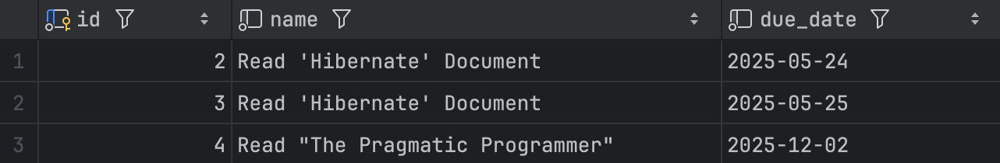

ما می‌توانیم کوئری‌های `delete` و `update` هم با استفاده از `createNativeMutationQuery` اجرا کنیم. به عنوان مثال، کد زیر تمامی تسک‌هایی که اسم آن‌ها شامل ورودی کاربر است را پاک می‌کند:

```java
Scanner sc = new Scanner(System.in);

System.out.println("task's name: ");
String taskName = sc.nextLine();

sessionFactory.inTransaction(session -> {
    session.createNativeMutationQuery("delete from tasks " +
            "where name like :namePattern")
            .setParameter("namePattern", "%" + taskName + "%")
            .executeUpdate();
});
```


همانطور که می‌بینید، کوئری‌مون این بار یک `delete` ‍ه که پارامتر `taskName` توی اون پدیدار شده. از اون‌جایی که می‌خواستیم تمام تسک‌هایی که ورودی کاربر بخشی از نام آن‌هاست را پاک کنیم، موقع مقداردهی این پارامتر قبل و بعد از اون `%` گذاشتیم. نهایتاً هم با متد `executeUpdate` کوئری را روی دیتابیس اجرا کردیم.

این برنامه را اجرا کنید و ورودی زیر را به آن بدهید:

```text
task's name: 
Hibernate
```

خروجی لاگ Hibernate به این صورت خواهد بود:

```text
Hibernate: 
    delete 
    from
        tasks 
    where
        name like ?
[TRACE] binding parameter (1:VARCHAR) <- [%Hibernate%]
```

و اگر الان جدول `tasks` رو ببینید، تسک‌هایی که توی اسم‌شون Hibernate داشتن پاک شدن:

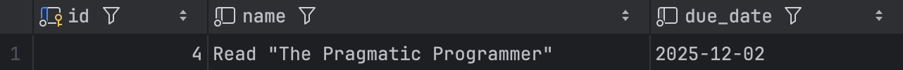


متدهای `createNativeMutationQuery` و `createNativeQuery`، قدرت اجرای هر کوئری SQL ای که دلتون می‌خواهد رو بهتون می‌دن.[^12]

## Lazy Fetching ها و Foreign key

به دایرکتوری `src/main/sq` برای فایل `steps.sql` رو درست کنید. توی این فایل، کوئری ایجاد جدول steps رو بنویسید و اون رو اجرا کنید:

```mysql
use learn_hibernate_db;

create table steps (
    id int primary key auto_increment,
    task_id int not null,
    name varchar(255) not null,
    is_completed boolean not null default false,
    
    foreign key (task_id) references tasks(id)
);
```

حالا به کلاس برگردین و کلاس `Step` رو توی پکیج `aut.ap.model` ایجاد کنید:

```java
package aut.ap.model;

public class Task {
    private Integer id;
    
    private Task task;
    
    private String name;
    
    private boolean isCompleted;
}
```

قراره که از این کلاس، برای ارتباط با جدول `Steps` توی برنامه‌مون استفاده کنیم. نکته جالبی که در مورد این کلاس هست، اینه که فیلد نظیر ستون `task_id` یعنی فیلد `task`، از جنس `int` نیست و از جنس خود `Task` ‍ه! در ادامه، می‌بینید که Hibernate با ستون‌های foreign key چطور برخورد می‌کنه و علت `Task` بودن این فیلد براتون شفاف می‌شه.

به کلاس Step، کانستراکتورهای لازم رو اضافه کنید. اگر یادتون باشه، هر کلاسی که Hibernate باهاش کار می‌کنه باید یک کانستراکتور خالی داشته باشه. پس دو کانستراکتور زیر رو به کلاس Step اضافه کنید:

```java
public Step() {
}

public Step(Task task, String name) {
    this.task = task;

    this.name = name;
    this.isCompleted = false;
}
```

حالا، setter و getter های لازم رو رو به کلاس `Step` اضافه کنید:

```java
public Integer getId() {
    return id;
}

public Task getTask() {
    return task;
}

public void setTask(Task task) {
    this.task = task;
}

public String getName() {
    return name;
}

public void setName(String name) {
    this.name = name;
}

public boolean isCompleted() {
    return isCompleted;
}

public void setCompleted(boolean completed) {
    isCompleted = completed;
}
```

نهایتا، متد `toString` هم override کنید تا بتونیم `Step‌` هامون رو به راحتی چاپ کنیم:

```java
@Override
public String toString() {
    return "Step{" +
            "id=" + id + ", \n" +
            "task=" + task + ", \n" +
            "name='" + name + '\'' + ", \n" +
            "isCompleted=" + isCompleted + "\n" +
            '}';
}
```

وقتشه که با annotate کردن کلاس `Step`، اون رو به Hibernate معرفی کنیم. بیشتر این annotation‌ ها، شبیه همون‌هایی که برای کلاس `Task` هم استفاده کردیم. از annotation های Entity و Table شروع می‌کنیم:

```java
@Entity
@Table(name = "steps")
public class Step {

// CODE CODE CODE
```


حالا، فیلد `id` هم مثل کلاس `Task` که قبلا دیدیمش annotate می‌کنیم:

```java
@Id
@GeneratedValue(strategy = GenerationType.IDENTITY)
private Integer id;
```

فیلدهای `isCompleted` و `name` هم مثل قبل annotate می‌کنیم:

```java
@Basic(optional = false)
private String name;

@Basic(optional = false)
@Column(name = "is_completed")
private boolean isCompleted;
```

تنها فیلد annotated نشده، فیلد `task` است. annotation این فیلد، با چیزی که قبلا دیده بودیم متفاوت است. Hibernate باید از این‌ها مطلع باشد:
- این ستون، نگه‌دارنده‌ی یک foreign key به جدول `tasks` است.
- این ستون، `not null` است و حتماً باید مقداردهی بشه.
- هر `task`، ممکنه چند `step` متفاوت داشته باشه. این یعنی مقدار ستون `task_id` منحصربه‌فرد نیست و ممکنه `step` های مختلف، `task_id` های یکسانی داشته باشن. از اون‌جا که چند `step` می‌تونن به یک `task` مرتبط باشن، به رابطه‌ی بین این دو جدول `ManyToOne` می‌گن.[^13]

از اولین ویژگی شروع می‌کنیم. با استفاده از annotation ای به اسم `JoinColumn`، به Hibernate می‌گیم که ستون نظیر فیلد `task` یک foreign key است.

```java
@JoinColumn(name = "task_id")
private Task task;
```

همچنین، از اون‌جایی که Hibernate اسم ستون `task_id` رو نمی‌دونه، توی این annotation اون رو مشخص کردیم. از اون‌جایی که فیلد `task` از جنس `Task` ‍ه، هایبرنیت خودش می‌دونه که این foreign key به جدول `tasks` ارتباط داره.

حالا باید دو ویژگی‌ِ دوم این ستون رو به Hibernate معرفی کنیم. برای این‌که نشون بدیم ارتباط `step` و `task` از جنس ارتباط‌های ManyToOne ‍ه، از annotation ای به همین اسم استفاده می‌کنیم[^14]:

```java
@ManyToOne(optional = false)
@JoinColumn(name = "task_id")
private Task task;
```

همچنین، با `false` گذاشتن `optional`، به Hibernate می‌گیم که این ستون `not null` ‍ه و مقداردهی اون اجباریه.[^15] نهایتاً یادتون نره که توی فایل `hibernate.cfg.xml` هم این mapping رو مشخص کنید[^16]:

```xml
<!-- Mappings -->
<mapping class="aut.ap.model.Task"/>
<mapping class="aut.ap.model.Step"/>
```

خیلی خب، حالا که ارتباط کلاس `Step` و جدول `steps` رو کاملاً به Hibernate توضیح دادیم، می‌تونیم عملیات‌های دیتابیسی مختلف رو به کمک این کلاس انجام بدیم.

به متد `main` برگردین، تسک ۴ رو از دیتابیس بخونین و یک `Step` برای اون ایجاد کنید:

```java
public static void main(String[] args) {
    setUpSessionFactory();
    
    // Fetch 'Read "The Pragmatic Programmer"' task from DB
    Task t = sessionFactory.fromTransaction(session ->
            session.get(Task.class, 4));
    
    Step s = new Step(t, "Read chapter 1");
    
    closeSessionFactory();
}
```

حالا، با استفاده از کد زیر، این `Step` رو روی دیتابیس ذخیره کنید:

```java
sessionFactory.inTransaction(session ->
    session.persist(s)
);
```

کد نهایی رو اجرا کنید و خروجی‌ش رو ببینید. توی این کد، Hibernate دو تا کوئری روی دیتابیس می‌زنه و این‌ها رو لاگ می‌کنه. کوئری اولش برای خوندن تسک 4 از دیتابیسه:

```text
[Hibernate]
select
    t1_0.id,
    t1_0.due_date,
    t1_0.name
from
    tasks t1_0
where
    t1_0.id=?
[TRACE] binding parameter (1:INTEGER) <- [4]
```

این کوئری رو قبلاً هم دیدیم و آشناست. اما کوئری دوم Hibernate، که برای ذخیره Step جدید هست،  جالب‌تره:
```text
[Hibernate]
insert 
into
    steps
    (is_completed, name, task_id) 
values
    (?, ?, ?)

[TRACE] binding parameter (1:BOOLEAN) <- [false]
[TRACE] binding parameter (2:VARCHAR) <- [Read chapter 1]
[TRACE] binding parameter (3:INTEGER) <- [4]
```

توی این لاگ، می‌بینید که Hibernate به درستی فهمیده که مقدار ستون `task_id`، برابر با ۴ ‍ه! Hibernate می‌دونست که:
- ستون `task_id` به فیلد `task` مرتبطه.
- فیلد `task`، از جنس `Task` هست.
- توی کلاس `Task`، فیلد `id` نماینده ستون primary key جدول `tasks` هست.

با کنار هم گذاشتن این اطلاعات، Hibernate فهمید مقدار درست ستون `task_id` توی `Step` جدیدمون چیه! اگر الآن به دیتابیس‌تون برید و روی جدول `steps`، کوئری `select` بزنید، می‌بینید که `Step` تون به درستی ذخیره شده:

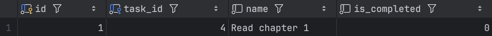


حالا وقتشه این `Step` رو از دیتابیس بخونیم و اون رو چاپ کنیم. کد زیر رو به جای کد قبلی `main` بنویسید:

```java
Step s = sessionFactory.fromTransaction(session -> 
    session.get(Step.class, 1));
System.err.println(s);
```

کد بالا رو اجرا کنید و خروجی رو ببینید:

```text
Step{
    id=1,
    task=Task{id=4, name='Read "The Pragmatic Programmer"', dueDate=2025-…},
    name='Read chapter 1',
    isCompleted=false
}
```

می‌بینید که Hibernate نه تنها قدم ۱ رو به درستی از دیتابیس خوند، که تونست فیلد `task` رو هم به درستی با تسک 4 پر کنه! foreign key ها و نحوه‌ی مدیریت اون‌های توی Hibernate، از جالب‌ترین بخش‌های این فریم‌ورکه. اگر به کوئری‌ای که Hibernate روی دیتابیس زد توجه کنید، می‌بینید که برای پر کردن فیلد `task`، هایبرنیت مجبور شد جدول‌های `steps` و `tasks` رو با هم `join` کنه:
```text
[Hibernate]
select
    s1_0.id,
    s1_0.is_completed,
    s1_0.name,
    s1_0.task_id,
    t1_0.id,
    t1_0.due_date,
    t1_0.name
from
    steps s1_0
left join
    tasks t1_0
    on t1_0.id = s1_0.task_id
where
    s1_0.id = ?
    s1_0.id=?
[TRACE] binding parameter (1:INTEGER) <- [1]
```

همون‌طور که توی بخش `select` می‌بینید، خروجی این کوئری ۷ ستون مختلف داره که Hibernate، با موفقیت، مقادیر اون‌ها رو به فیلدهای مختلف کلاس‌های ما داد.[^17]

### Lazy Fetching

در بالاتر، `join` ای که دیدیم با این‌که خیلی به درد ما می‌خورد، ولی برای دیتابیس عملیات خیلی سختی بود. فرض کنید جدول‌های `steps` و `tasks`، به‌جای یکی-دوتا رکورد تستی ما، هر کدوم ده میلیون رکورد داشتن[^18]. در این صورت اجرای عملیات `join` بین این دو جدول برای دیتابیس کار خیلی سختیه. ولی Hibernate با هر بار `get` کردن `Step` ها از دیتابیس، برای پر کردن فیلد `task` این `join` رو اجرا می‌کنه.

ما می‌تونیم از Hibernate بخوایم که این `join` ها رو بهینه‌تر انجام بده. به کلاس `Step` برگردین و بالای فیلد `task`، توی `ManyToOne`، عبارت `fetch = FetchType.LAZY` رو اضافه کنید[^19]:

```java
@ManyToOne(optional = false, fetch = FetchType.LAZY)
@JoinColumn(name = "task_id")
private Task task;
```

با اضافه کردن این مورد به annotation تون، شما به Hibernate می‌گید «تا زمانی که توی `session`، از فیلد `task` استفاده نکردم، اون رو مقداردهی نکن.». بیاین با یک کد ببینیم که این موضوع دقیقاً یعنی چی. به متد `main` برگردین و کد زیر رو بنویسید:

```java
sessionFactory.inTransaction(session -> {
    Step s = session.get(Step.class, 1);
    System.err.println("id: " + s.getId());
    System.err.println("name: " + s.getName());
    System.err.println("is completed: " + s.isCompleted());
});
```

توی این کد، قدم ۱ رو از دیتابیس خوندیم، ولی هیچ‌وقت از فیلد `task` اون استفاده‌ای نکردیم. این کد رو اجرا کنید و خروجیِ اون رو ببینید:

```text
[Hibernate] 
select
    s1_0.id,
    s1_0.is_completed, 
    s1_0.name,
    s1_0.task_id
from
    steps s1_0 
where
    s1_0.id=? 
[TRACE] binding parameter (1:INTEGER) <- [1]

id: 1
name: Read chapter 1
is completed: false
```

همون‌طور که می‌بینید، از اون‌}ایی که توی کد بالا از فیلد `task` استفاده نکردیم، Hibernate هم روی دیتابیس `join` ای نزد. حالا بیاین از این فیلد هم استفاده کنیم. کد زیر رو توی `main` بنویسید:

```java
sessionFactory.inTransaction(session -> {
    Step s = session.get(Step.class, 1);
    
    System.err.println("id: " + s.getId());
    System.err.println("name: " + s.getName());
    System.err.println("is_completed: " + isCompleted());
    System.err.println("task: " + s.getTask());
});
```

همون‌طور که می‌بینید، توی خط آخر lambda مون، `task` رو هم چاپ کردیم. این کد رو اجرا کنید و خروجی رو ببینید:

```text
[Hibernate] 
    select
        s1_0.id,
        s1_0.is_completed,
        s1_0.name,
        s1_0.task_id 
    from
        steps s1_0 
    where
        s1_0.id=? 
[TRACE] binding parameter (1:INTEGER) <- [1]

id: 1
name: Read chapter 1
is completed: false

[Hibernate] 
    select
        t1_0.id,
        t1_0.due_date,
        t1_0.name 
    from
        tasks t1_0 
    where
        t1_0.id=?
[TRACE] binding parameter (1:INTEGER) <- [4]

task: Task(id=4, name='Read The Pragmatic Programmer', dueDate=2025-12-02)
```

کوئری اول Hibernate، همون کوئری‌ای که قبلاً دیده بودیم و برای `get` کردن قدم ۱ ‍ه. اما همان‌طور که می‌بینید، بلافاصله موقعی که خواستیم از فیلد `task` توی `print` مون استفاده کنیم، Hibernate به کوئری روی جدول `tasks` می‌زنه تا تسک ۴ را پیدا کند و فیلد `task` را پر کند. به خاطر همین هم، قبل از `print` ما فیلد `task` پر شده و مقدار آن آماده استفاده است.

به این تکنیک Lazy Fetching می‌گویند. این که Hibernate، تا زمانی که به object نیاز پیدا نکردیم، آن را از دیتابیس نخونه، خیلی جاها می‌تونه کمک کنه. مثلاً اگر یادتون باشه، توی بخش «حذف رکوردها از دیتابیس» ما این مشکل را مطرح کردیم که برای حذف یک رکورد از دیتابیس مجبوریم دو تا کوئری بزنیم، یکی برای `get` کردن آن رکورد و دیگری برای حذفش:

```java
sessionFactory.inTransaction(session -> {
    Step s = session.get(Step.class, 1);
    session.remove(s);
});
```

یک متد، مشابه متد `get`، به اسم `getReference` که می‌تونه توی این مشکل به ما کمک کنه. اگر به جای `get` از `getReference` استفاده کنیم، Hibernate روی جدول `steps` کوئری `select` نمی‌زنه تا زمانی که به فیلدهای `s` نیاز داشته باشیم:

```java
sessionFactory.inTransaction(session -> {
    Step s = session.getReference(Step.class, 1);
    session.remove(s);
});
```

بعد از اجرای خط اول `lambda` مون، تنها چیزی که Hibernate از `s` می‌دونه اینه که از جنس `Step` ‍ه و مقدار `id` آن یکه. متد `remove` هم دقیقاً به همین دو مورد نیاز داره تا بفهمه که `s` رو چجوری باید از دیتابیس پاک کنه! به‌خاطر همین، اگر این کوئری رو اجرا کنید می‌بینید که هیچ‌وقت روی جدول `steps`، کوئری `select` زده نمی‌شه و حذف قدم ۱ توی تنها یک کوئری انجام می‌شه:

```text
[Hibernate] 
    delete 
    from
        steps 
    where
        id=?
[TRACE] binding parameter (1:INTEGER) <- [1]
```

استفاده از Lazy Fetching، چندان هم بی‌دردسر نیست. اگر بعد از بسته شدن session ای که توی اون رکوردتون رو از دیتابیس `get` کرده بودین، بخواین به فیلدهایی که توی Hibernate اون‌ها رو از دیتابیس نخونده دسترسی پیدا کنید، به خطای `LazyInitializationException` می‌خورید.

برای این‌که این exception رو با هم ببینیم، با استفاده از کد زیر یک قدم جدید توی دیتابیس ذخیره کنید:

```java
sessionFactory.inTransaction(session -> {
    Task t = session.getReference(Task.class, 4);
    Step s = new Step(t, "read chapter 2");
    
    session.persist(s);
});
```

اگر دقت کنید برای دریافت `Task` در این کد از `getReference` استفاده کردیم. بعد
از اجرای این کد، روی جدول `steps` یک کوئری `select` بزنید و مطمئن شوید که قدم جدیدتون به درستی در دیتابیس ذخیره شده است:

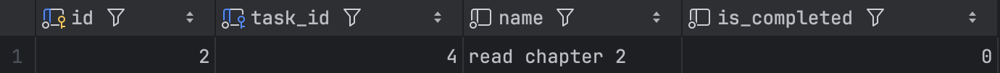

حالا، آن را به شکل زیر get و چاپ کنید:

```java
Step s = sessionFactory.fromTransaction(session -> {
    return session.get(Step.class, 2);
});
System.err.println("Id: " + s.getId());
System.err.println("Name: " + s.getName());
System.err.println("Is Completed: " + s.isCompleted());
```

توی این کد، بعد از بسته شدن session مون، هیچ نیازی به فیلد `task` نداریم، به خاطر همین هم این کد به درستی اجرا می‌شود:

```text
[Hibernate] 
    select
        s1_0.id,
        s1_0.is_completed,
        s1_0.name,
        s1_0.task_id 
    from
        steps s1_0 
    where
        s1_0.id=? 
[TRACE] binding parameter (1:INTEGER) <- [2]

id: 2
name: read chapter 2
is_completed: false
```

ولی اگر بخواهیم، بعد از بسته شدن `session` مون به فیلد `task` دسترسی پیدا کنیم، به خطای `LazyInitializationException` برمی‌خوریم. کد زیر را اجرا کنید:

```java
Step s = sessionFactory.fromTransaction(session ->
       session.get(Step.class, 2));

System.err.println("id: " + s.getId());
System.err.println("name: " + s.getName());
System.err.println("is completed: " + s.isCompleted());
System.err.println("task: " + s.getTask());
```

توی خط انتهایی این کد، `task` رو هم چاپ می‌کنیم. ولی اگر این کد رو اجرا کنید به خطا می‌خورید:

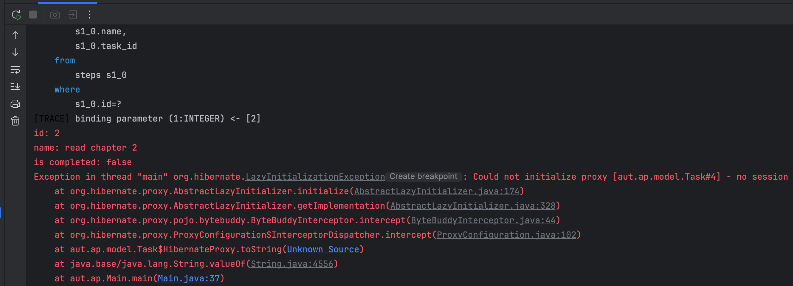

علت این خطا اینه که بعد از اتمام `session` تون، خواستید به فیلدی دسترسی پیدا کنید که Hibernate اون رو از دیتابیس نخونده. اگر به هر شکلی، توی `session` تون Hibernate رو مجبور کنید که فیلد `task` رو از دیتابیس بخونه، به این خطا نمی‌خورید.[^20]


## سینگلتون کردن `SessionFactory`

همان‌طور که در کدهای بالا دیدیم، ما فقط به یک `SessionFactory` در کل برنامه‌مان نیاز داریم.  ممکن است در یک کد چندین `Session` مختلف ایجاد کنیم، ولی همه آن‌ها فقط از یک  `SessionFactory` گرفته می‌شن. علاوه‌بر این، ساخت آبجکت‌های `SessionFactory` برای Hibernate کار سختیه و به خاطر همین بهتر است که در برنامه‌مون فقط از یک `SessionFactory` استفاده کنیم.

برای این کار، از دیزاین پترنی به اسم Singleton استفاده می‌کنیم. این دیزاین پترن پیچیده‌ای نیست،  ولی به ما اجازه می‌دهد که فقط یک `SessionFactory` در کل برنامه‌مون استفاده کنیم. برای استفاده از اون، پکیج `aut.ap.framework` رو ایجاد کنید:

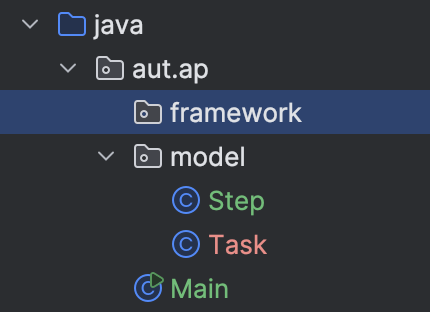


حالا، توی این پکیج کلاس `SingletonSessionFactory` رو ایجاد کنیدو توی اون، کدهای زیر رو بنویسید:

```java
package aut.ap.framework;

import org.hibernate.SessionFactory;
import org.hibernate.cfg.Configuration;

public class SingletonSessionFactory {
    private static SessionFactory sessionFactory = null;
    
    public static SessionFactory get() {
        if (sessionFactory == null) {
            sessionFactory = new Configuration()
                  .configure("hibernate.cfg.xml")
                  .buildSessionFactory();
        }
        
        return sessionFactory;
    }
    
    public static void close() {
        if (sessionFactory == null)
            return;
        }
    
    sessionFactory.close();
    }
}
```

فهم این کد، کار نسبتاً راحتیه. در کلاس `SingletonSessionFactory` یک فیلد از جنس `SessionFactory` داریم که مقدار اولیه آن `null` ‍ه. در متد `get`، اول چک می‌کنیم که اگر `sessionFactory` برابر با `null` بود، کانفیگ `hibernate.cfg.xml` را بخونیم و آن را مقداردهی کنیم. این باعث می‌شه در اولین مرتبه‌ای که متد `get` صدا زده شد، `sessionFactory` مقداردهی بشه و بعد از آن، همیشه همان `sessionFactory` قدیمی‌مون خروجی داده بشه. به خاطر همین موضوع، کل برنامه ما از دقیقاً یک `sessionFactory` استفاده می‌کنه. نهایتاً در متد `close` هم `sessionFactory` مون را بستیم.

الان می‌توانیم در `Main`، از دست متدهای `setUpSessionFactory` و ‍`closeSessionFactory` خلاص شویم و از `SingletonSessionFactory` استفاده کنیم:

```java
public class Main {
    public static void main(String[] args) {
        SingletonSessionFactory.get()
                .inTransaction(session -> {
                    Task t = session.getReference(Task.class, 4);
                    Step s = new Step(t, "read chapter 3");
                    
                    session.persist(s);
                });
        SingletonSessionFactory.close();
    }
}
```

با اجرای کد بالا، یک قدم جدید برای تسک ۴ در دیتابیس‌تون ذخیره می‌شه.

## افزودن Service‌ها

‌همون‌طور که می‌دونید، خوبه که لایه‌های UI و Logic برنامه‌مون جدا باشن[^21]. به‌عبارتی، ما منطق برنامه‌هامون رو، کنار کدهای ورودی و خروجی نمی‌نویسیم. ساختار برنامه‌های ما، یه چنین شکلی داره:

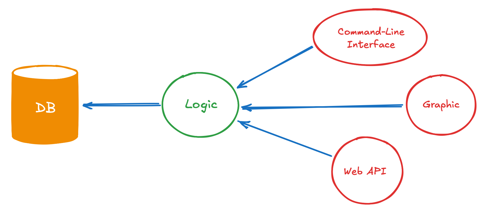

توی اون ساختار، وظیفه‌ی لایه‌ی UI صرفاً ورودی گرفتن و خروجی دادن به کاربره. لایه‌ی UI، بعد از گرفتن ورودی‌های کاربر، اون‌ها رو به لایه‌ی Logic می‌ده و توی این لایه، بر اساس منطق برنامه‌مون ورودی‌ها پردازش می‌شن و عملیات دل‌خواه کاربر انجام می‌شه.

ما لایهٔ Logic را با استفاده از Service ها پیاده‌سازی می‌کنیم. پکیج `aut.ap.service` را به برنامه‌تان اضافه کنید:

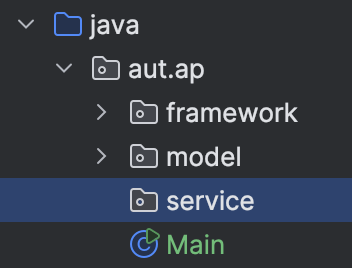

در این پکیج، دو کلاس `TaskService` و `StepService` را ایجاد کنید. در این داکیومنت، سرویس‌های این دو کلاس را به صورت کامل پیاده‌سازی نمی‌کنیم و فقط بخشی از متدهای آن‌ها را می‌نویسیم. به کلاس `TaskService` بروید:

```java
package aut.ap.service;

public class TaskService {
}
```

در این کلاس، متد `persist` را که برای ذخیرهٔ یک `Task` استفاده می‌شود، پیاده‌سازی می‌کنیم:

```markdown
```java
public static Task persist(String name, LocalDate dueDate) {
    Task t = new Task(name, dueDate);
    
    SingletonSessionFactory.get()
             .inTransaction(session -> {
                session.persist(t);
            });
    return t;
}
```

حالا، یک متد هم برای گرفتن همه‌ی تسک‌ها می‌نویسیم:

```java
public static List<Task> getAll() {
    return SingletonSessionFactory.get()
             .fromTransaction(session ->
                  session.createNativeQuery("select * from tasks", Task.class)
                           .getResultList());
}
```

و همچنین، یک متد هم برای حذف تسک‌هامون می‌نویسیم:

```java
public static void remove(int id) {
    SingletonSessionFactory.get()
             .inTransaction(session -> {
                 Task t = session.getReference(Task.class, id);
                 session.remove(t);
             });
}
```

حالا می‌تونیم به سراغ `StepService` بریم. برای آن هم سه متد مشابه تعریف می‌کنیم:

```java
public class StepService {
    public static Step persist(Task task, String name) {
        Step s = new Step(task, name);
        
        SingletonSessionFactory.get()
                .inTransaction(session -> {
                    session.persist(s);
                });
        return s;
    }

    public static List<Step> getAll() {
        return SingletonSessionFactory.get()
                .fromTransaction(session -> {
                    return session.createNativeQuery("select * from steps", Step.class)
                            .getResultList();
                });
    }

    public static void remove(int id) {
        SingletonSessionFactory.get()
                .inTransaction(session -> {
                    Step s = session.getReference(Step.class, id);
                    session.remove(s);
                });
    }
}
```

حالا، ما می‌توانیم از توی `Main`، یعنی لایهٔ Command-Line Interface مون، با گرفتن ورودی‌های کاربر متد مناسب را از Service‌ ها صدا بزنیم و خروجی اون را هم به کاربر نشون بدیم.

## چیزی که یاد گرفتم

توی این بخش، ما دانش‌مان از SQL و جاوا را کنار هم گذاشتیم و اولین قدم‌هایمان را در دنیای گستردهٔ Hibernate در کنار هم برداشتیم. در این‌جا فهمیدیم که:

- ORM‌ ها چیستند و به چه درد می‌خورند.
- چطور می‌شود موجودیت‌های مختلف را به Hibernate معرفی کرد.
- چطور می‌شود با استفاده از Hibernate، روی دیتابیس کوئری زد.
- تکنیک‌هایی مثل Lazy Fetching در دیتابیس چطور کار می‌کنند.

## منابع بیشتر

هایبرنیت، دنیای خیلی بزرگی داره و ما به هیچ‌وجه نمی‌تونستیم تمام اون رو توی این بخش بررسی کنیم. این داک، صرفاً برای یک آشنایی اولیه با دنیای ORM هاست و خیلی خوبه که شما بعد از خوندنش، از ریسورس‌های آنلاین استفاده کنید و Hibernate رو بهتر یاد بگیرید. من خودم برای این‌که Hibernate رو بهتر یاد بگیرم [یک پروژه «مدیریت دانشگاه»](https://github.com/ap-java-aut/uni-management-system.git) زدم و سورسش رو در گیت‌هاب گذاشتم. اگه دوست داشتین به این پروژه هم یک نگاه بندازید.

بین کتاب‌ها و منابعی که من دیدم، یکی از بهترین منابع برای شروع کار با Hibernate، [داکیومنت رسمی «An Introduction to Hibernate 6»](https://docs.jboss.org/hibernate/orm/6.6/introduction/html_single/Hibernate_Introduction.html) ‍ه. این داک برای این نوشته شده که دولوپرهای تازه‌کاری مثل شما راحت‌تر به دنیای Hibernate قدم بذارن. اگر اون رو خوندین و سوالی داشتید، حتماً از تدریس‌یارهاتون بپرسید.

علاوه بر این، برای این که بفهمید متدهای مختلف در Hibernate دقیقاً چه کار می‌کنند، می‌توانید به [داکیومنت Hibernate 6](https://hibernate.org/orm/documentation/6.0/) هم سر بزنید.


---

[^1]: من این نقاشی رو از کتاب Crafting Interpreters دزدیدم خیلی کتاب قشنگیه اگر خواستین یه [نگاه بهش بندازین.](https://craftinginterpreters.com/contents.html)

[^2]: در مورد ساختار پروژه‌هایی که با Maven درست میشن [این‌جا](https://maven.apache.org/guides/introduction/introduction-to-the-standard-directory-layout.html) رو هم یه نگاه بندازین.

[^3]: اگر بخواین می‌تونید یک نگاه به [ریپوی گیت‌هاب Hibernate](https://github.com/hibernate/hibernate-orm.git) بندازین. یه دور بزنید و ببینید که دروغ نگفتم! اون‌ها هم واقعاً calss و interface و annotation تعریف کردن!

[^4]: اسکریپت‌های دیتابیسی مثل `create table`، بخشی از سورس کد برنامه‌ی شمان. مشتری‌هاتون برای این‌که بتونن دیتابیس خودشون رو بالا بیارن و جداول برنامه‌تون رو توش ایجاد کنن، به این اسکریپت‌ها نیاز دارن. به‌خاطر همین هم مهمه که اون‌ها رو توی سورس کدتون ذخیره کنید.

[^5]: منبع این توصیه، [این‌جاست](https://docs.jboss.org/hibernate/orm/6.6/introduction/html_single/Hibernate_Introduction.html#basic-attributes).

[^6]: اگر یادتون باشه، مقدار دیفالت reference type ها `null` بود و مقدار دیفالت primitive type ها بسته به نوعشون، یا صفر بود، یا `false` یا `\0`.

[^7]: ما تو جاوا عادت کردیم که بعد از اتمام کارمون با یه object،خود Garbage Collector اون رو از مموری برامون حذف کنه. اما بعضی از زبان‌ها مثل C، هیچ Garbage Collector خاصی ندارند. در این زبان‌ها اگر بخشی از مموری رو اشغال کردیم، بعد از اتمام کار باهاشون، خودمون هم باید اون بخش رو خالی کنیم.
	نداشتن Garbage Collector باعث می‌شه که این زبان‌ها سریع‌تر از باقی زبان‌ها باشن؛ ولی از طرفی اگر یادتون بره که بخشی از مموری رو آزاد کنید، ممکنه برنامه‌تون کل مموری رو اشغال کنه و به اصطلاح Memory Leak داشته باشه. راجع به این مشکل می‌تونید توی [این صفحه ویکی‌پدیا](https://en.wikipedia.org/wiki/Memory_leak) بیشتر بخونید.
	ولی حتی Garbage Collector هم نمی‌تونه تمام resource‌ هایی که بعضی از object‌ هامون گرفتن رو آزاد کنه. به عنوان مثال، آبجکت‌های file از این دسته‌اند. کلاً Garbage Collector نمی‌تونه آبجکت‌هایی که با هر نوع I/O کار می‌کنن رو مدیریت کنه. این object ها باید بعد از استفاده‌شون، close بشن. آبجکت‌های `SessionFactory` و `Session` هم، هر دو از این دسته‌اند. این کلاس‌ها همگی اینترفیس `Closeable` رو پیاده‌سازی می‌کنن. برای اطلاعات بیش‌تر راجع‌به `Closeable`، [می‌تونید این صفحه‌ی GeeksForGeeks](https://www.geeksforgeeks.org/closeable-interface-in-java/) رو بخونید.

[^8]: این try-catch ای که نوشتیم، بهترین کد Hibernate جهان نیست! بهتره که `session.close()` رو توی بخش `finally` ی `try` مون صدا می‌زدیم و همچنین، بهتر بود که توی `catch` مون، `tx.rollback()‍` هم صدا کنیم. توی صفحات بعدی، ما به کل راه راحت‌تری برای استفاده از Session ها بهتون ارائه می‌دیم، و نمی‌خواستیم این‌جا خیلی گیج‌تون کنیم. ولی اگر دوست دارین، کد درست‌تر این بخش رو از [این‌جا](https://docs.jboss.org/hibernate/orm/6.6/introduction/html_single/Hibernate_Introduction.html#managing-transactions) بخونید.

[^9]:  در ادامه یاد می‌گیریم که چطور می‌توانیم با Hibernate، از دیتابیس اطلاعات مختلف را بخوانیم.

[^10]: منبع این توصیه، [این‌جاست.](http://docs.jboss.org/hibernate/core/3.3/reference/en/html/persistent-classes.html#persistent-classes-pojo-identifier)

[^11]: علاوه‌بر این، همون‌طور که توی پانویس‌های قبلی گفتیم، این کد هم کاملاً درست نیست و بستن session ها و rollback کردن transaction ها رو به درستی انجام نمی‌ده. نوشتن کدی که به درستی این کارها رو بکنه یه خورده قلق داره.

[^12]: هایبرنیت متدهای مشابه دیگه‌ای هم در اختیارتون می‌ذاره که با استفاده از اون‌ها هم می‌توانید کنترل بیشتری روی کوئری اجرا شده توی دیتابیس داشته باشید. متدهایی مثل `createSelectionQuery` و `createMutationQuery` به شما اجازه می‌دهند که توی نوشتن کوئری‌های هاتون از `CreateNativeMutationQuery` و `CreateNativeQuery` بهتره. ولی این داکیومنت بدون معرفی این متدها هم طولانیه و به خاطر همین موضوع، این‌جا بهشون اشاره‌ای نکردیم. اگر دوست داشتین، حتما با خوندن [داک رسمی Hibernate](https://docs.jboss.org/hibernate/orm/6.6/introduction/html_single/Hibernate_Introduction.html#queries) با این متدها بیشتر آشنا بشین.

[^13]: جدول‌های مختلف می‌تونن روابط متفاوتی با هم داشته باشن. رابطه‌ی بین جدول `tasks` و `steps`، رابطه‌ی ManyToOne ‍ه. ولی رابطه‌ی جدول‌های `people` و `student` یک‌به‌یک یا OneToOne ‍ه. چون دو `student` مختلف نمی‌تونن `person_id` های یکسانی داشته باشن. ارتباط دو جدول ممکنه چندبه‌چند یا `ManyToMany` هم باشه؛ مثلاً جدول‌های `students` و `courses` با هم ارتباط ManyToMany دارن، چون هر `student` می‌تونه چند ‍`course` داشته باشه و هر `course` هم می‌تونه چند `student` رو شامل بشه. این ارتباط‌ها رو با جدولی مثل `taken_courses` مدیریت می‌کنیم، جدولی که یک foreign key به `students` داره و یک foreign key هم به `courses` داره. از [این‌جا](https://en.wikipedia.org/wiki/Cardinality_%28data_modeling%29) در مورد انواع جدول‌ها توی دیتابیس‌های relational بیش‌تر بخونید.

[^14]: همون‌طور که احتمالاً حدس زدید، annotation های OneToOne، ManyToMany، یا حتی OneToMany هم توی Hibernate داریم. برای این‌که بیش‌تر راجع‌به اون‌ها یاد بگیرید، به [داک رسمی Hibernate](https://docs.jboss.org/hibernate/orm/6.6/introduction/html_single/Hibernate_Introduction.html#associations) مراجعه کنید.

[^15]: کلاً هر چه بهتر ساختار جداول‌تون رو به Hibernate توضیح بدید، اون هم می‌تونه کارش رو بهتر انجام بده. مثلاً ستون‌های `ncarchar` شما سایزهای مختلفی دارن، بعضی‌هاشون ممکنه ۱۰۰ کاراکتر نگه دارن و بعضی‌هاشون، ۸۰۰۰ کاراکتر! یکی از annotation هایی که قبلاً دیدین، یعنی `Column`، یک فیلد `length` داره که اگر اون رو مقداردهی کنید Hibernate از طول رشته‌های ستون‌هاتون مطلع می‌شه. متاسفانه ما نمی‌تونیم توی این داک، همه‌ی annotation های Hibernate رو تا این حد بررسی کنیم؛ ولی خوبه که هر وقت از این annotation ها استفاده می‌کنید به این موضوع فکر کنید که چطور می‌تونید بجدول‌تون رو دقیق‌تر به Hibernate توضیح بدید و در رابطه باهاش سرچ کنید.

[^16]: من دائماً این موضوع رو فراموش می‌کنم و باعث می‌شه به Exception های عجیب بر بخورم!

[^17]: اگر یادتون باشه، تعریف کردن `List<Step>` توی کلاس `Task` گاهی برای ما مشکل‌ساز می‌شد، ولی عدم تعریف اون هم برنامه‌نویسی رو برای ما سخت‌تر می‌کرد. خوشبختانه، با استفاده از رابطه `OneToMany` ی Hibernate می‌تونید به راحتی این فیلد رو توی کلاس `Task` تعریف کنید. برای آشنایی بیشتر با این روابط و مدیریتشون توی Hibernate می‌تونید [این‌جا](https://docs.jboss.org/hibernate/orm/6.6/introduction/html_single/Hibernate_Introduction.html#many-to-one) رو بخونید.

[^18]: این سناریو، به هیچ وجه دور از ذهن نیست. توی دنیای واقعی، دیتابیس‌ها از حجیم‌ترین بخش‌ّای یک برنامه هستن. تعداد رکوردهای اون‌ها گاهی این‌قدر زیاده که شرکت‌ها مجبور به استخدام database engineer ها می‌شن تا دیتابیس‌شون رو بهتر مدیریت کنن.

[^19]: مقدار دیفالت `FetchType` برای رابطه `OneToMany` و `ManyToMany` برابر با `FetchType.EAGER` ‍ه. و برای `OneToMany` و `OneToOne` برابر با `FetchType.LAZY` هست. طبق [داک رسمی Hibernate](https://docs.jboss.org/hibernate/orm/6.6/introduction/html_single/Hibernate_Introduction.html#lazy-problem)،‌ توصیه می‌شه که شما تا جای ممکن از `FetchType.LAZY` استفاده کنید.

[^20]: برای این کار، می‌شه از `EntityGraph` ها استفاده کرد. از [این‌جا](https://docs.jboss.org/hibernate/orm/6.6/introduction/html_single/Hibernate_Introduction.html#proxies-and-lazy-fetching) می‌تونید بیش‌تر راجع‌به اون‌ها بخونید.

[^21]: اگر راستش را بخواهید، به نظر خود من ایراد خیلی بزرگی نیست وقتی این دو لایه ترکیب شوند. درسته که دیزاین برنامه‌مان کمی به هم می‌ریزه، ولی راستش همیشه هم لازم نیست که دیزاین برنامه‌های ما بی‌نقص باشه. اگر خیلی دنبال دیزاین‌های بی‌نقص بگردیم و وقت بذاریم، ممکن است هیچ‌وقت به کد زدن نرسیم. علاوه بر این موضوع، نظرات توسعه‌دهنده‌های مختلف هم در مورد یک دیزاین خوب گاهی خیلی متفاوته. به همین خاطر، من اصلاً شک داشتم که آیا این بخش را برای شما بنویسم یا نه. این بخش را بخوانید، و سعی کنید به آن عمل کنید، ولی بدونید که راهی که این‌جا توصیف شده، تنها راه ممکن برای نوشتن یک برنامه‌ی خوب نیست.
