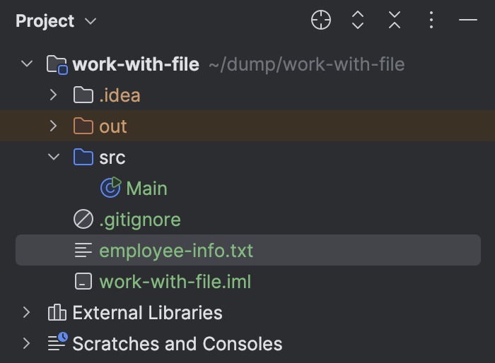
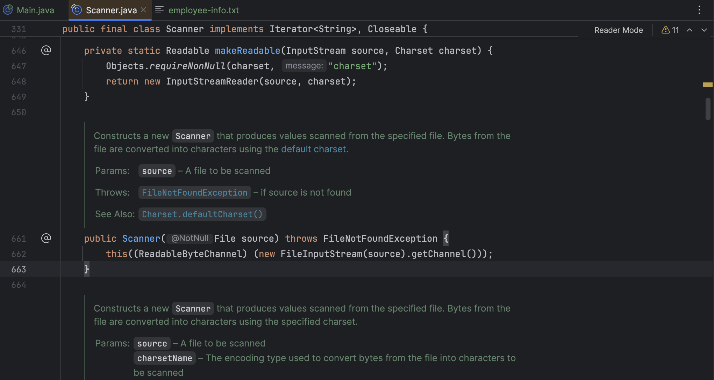
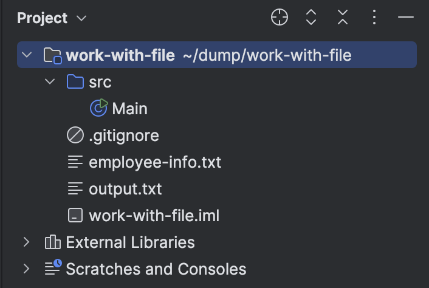
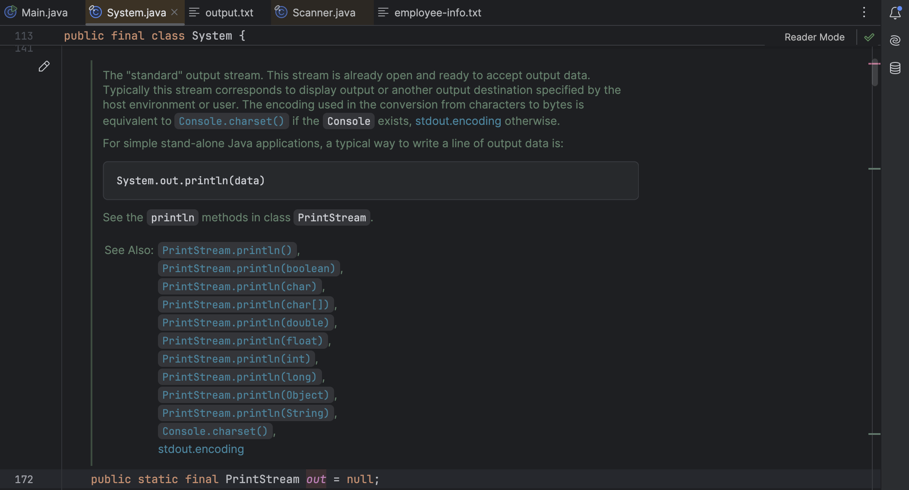

## مقدمه

تا این‌جا چندین برنامه و تمرین و پروژه داشتین و احتمالاً تجربه خوبی از برنامه سازی دارید. توی خیلی از برنامه ها با داده هایی سر و کار دارین که الزاماً ورودی همون لحظه ترمینال نیستن و از داده هایی که قبلا داریم استفاده کنید، یا ممکنه بخواین ورودی هاتون رو از هر رابط کاربری ای که میگیرید در یک جای جداگانه ذخیره کنید. حتی ممکنه لازم باشه چیزی خارج از کدهاتون توی برنامه اصلی استفاده بشه، مثلاً اگه یادتون باشه برای پروژه منوی کافه باید یسری عکس از خارج برنامه لود میکردین و با دادن آدرسش به کدتون اونارو استفاده کنید.

به همه دلایل بالا و خیلی از دلایل دیگه ما نیاز داریم که دیتاهامون رو با یه روشی ذخیره کنم و بعداً بازخوانیشون کنیم تا به یه دردی بخورن. برای این کار ما نیاز داریم بتونیم با این فایل ها کار کنیم و از اونها چیزایی رو بخونیم یا توی اون فایل ها تغییراتی ایجاد کنیم و اطلاعات رو توشون بنویسیم.

همونطور که میدونید مفاهیم خوندن و نوشتن چه در جاوا چه در هر زبان یا برنامه ای که با کامپیوتر سر و کار داره به مفهوم ورودی و خروجی یا به طور مختصر I/O گره خورده. توی جاوا یعنی هرجایی که بخوای اطلاعاتی وارد برنامه‌ات کنی (مثل خوندن از یه فایل)، یا از برنامه‌ات بریزی بیرون (مثل نوشتن توی فایل). برای این کار ما از یه پکیج توی جاوا استفاده میکنیم به اسم `java.io`.

## جریان داده‌ها Stream

تا حالا به این فکر کردین که وقتی یه فایل متنی رو باز می‌کنین، برنامه‌ چطوری اون اطلاعاتو می‌خونه؟ یا وقتی یه عکس یا ویدیو رو ذخیره می‌کنین، این داده‌ها از کجا میان و به کجا می‌رن؟ اینجاست که بحث Stream یا همون جریان داده ها میاد وسط. در واقع یه استریم رو میشه مثل یه رودخونه یا آبراهه از داده ها در نظر گرفت که اطلاعات مثل آب توی اون جاری ان و از یه منبع شروع به حرکت میکنن و وارد برنامه میشن یا برعکس از برنامه ریخته میشن به یه مقصدی.

اگه بخوایم یه تعریف شسته رفته تر و رسمی تر از stream داشته باشیم میشه گفت که stream نشون دهنده‌ی جریانی از داده هاست که یه طرف اون‌ها یه نویسنده یا writer و توی سر دیگه‌ش یه خواننده یا reader داریم. وقتی از پکیج io استفاده میکنیم برای انجام کارامون مثل ورودی و خروجی های ترمینال یا نوشتن روی فایل و خوندن ازش و یا ارتباط از طریق شبکه، از انواع مختلفی از استریم‌ها استفاده میکنیم.

استریم ها تو جاوا دو نوع اصلی دارن. Byte stream و Character stream.

## Byte stream

برای وقتی هست که داده‌هات متنی نیستن، یعنی قراره با فایل‌های باینری مثل عکس، ویدیو، فایل‌های PDF، موسیقی، یا هر چیزی که ساختار عددی یا خاص داره کار کنی. که شامل کلاس های اصلی زیر میباشد:

### Input stream (کلاس‌های  Byte Stream)

یک کلاس ابسترکت برای خواندن داده های باینری است که تمام کلاس‌های خوندن داده‌های باینری ازش مشتق می‌شن. وظیفه‌اش اینه که یه سری متد پایه مثل read برای خوندن بایت‌ها بده و بقیه‌ی کلاس‌ها بیان و اونا رو پیاده‌سازی کنن.

**متد های مهم این کلاس:**

- `int read()`: یه بایت می‌خونه و برمی‌گردونه (از ۰ تا ۲۵۵)
- `int read(byte[] buffer)`: یه آرایه از بایت‌ها رو پر می‌کنه
- `close()`: رتباط با منبع داده رو می‌بنده

### Output stream (کلاس‌های  Byte Stream)

که کلاس ابسترکت برای نوشتن داده های باینری است. و دقیقا برعکس کلاس قبلیه.

**متد های مهم این کلاس:**

- `void write(int b)`: یه بایت می‌نویسه
- `void write(byte[] buffer)`: یه آرایه بایت کامل می‌نویسه
- `flush()`: مطمئن می‌شه که همه‌چیز واقعاً نوشته شده
- `close()`: بسته شدن `Stream`

### زیرکلاس‌های مهم و کاربردی `InputStream` و `OutputStream`

وقتی میخوایم داده های باینری رو بخونیم یا بنویسیم این دوتا کلاس به تنهایی کافی نیستن. این دو کلاس فقط یک بنیاد هستن و در عمل معمولا به زیر کلاس های تخصصی تر و واقعی تری نیاز داریم.

از این زیر کلاس ها به `FileInputStream` و `FileOutputStream` اشاره میکنیم.

#### `FileInputStream`

این کلاس برای وقتیه که بخوای داده‌های خام از یه فایل بخونی. مثلاً بخوای یه تصویر، یه فایل صوتی یا هر فایل غیرمتنی رو بخونی و یه جایی ذخیره یا پردازشش کنی.

فرض کن می‌خوای یه فایل تصویری رو بخونی و اندازه‌اش رو در خروجی نشون بدی (با شمارش تعداد بایت‌ها):

```java
FileInputStream fis = new FileInputStream("image.jpg");
int count = 0;
while (fis.read() != -1) {
    count++;
}
fis.close();
System.out.println("File size in bytes: " + count);
```

**متدهای مهم `FileInputStream`:**

- `int read()` :

یه بایت از فایل می‌خونه و به‌صورت عدد بین `0` تا `255` برمی‌گردونه. اگه به انتهای فایل برسه، -1 برمی‌گردونه.

```java
FileInputStream fis = new FileInputStream("data.bin");
int b = fis.read();
System.out.println(b);
fis.close();
```

مثلا اگه خروجی این کد `65` باشه یعنی کد ما `A` رو خونده که کد اسکی اون `65`  ‍ه.

- `int read(byte[] b)` :

این یکی به‌جای یه بایت، یه **آرایه بایت** رو پر می‌کنه. تعداد بایت‌های خونده شده رو برمی‌گردونه.

```java
byte[] buffer = new byte[10];
FileInputStream fis = new FileInputStream("data.bin");
int bytesRead = fis.read(buffer);
System.out.println("Read " + bytesRead + " bytes");
fis.close();
```

مثلاً ممکنه `6` بایت خونده باشه، پس خروجی بشه `Read 6 bytes`.

- `int read(byte[] b, int off, int len)` :

این متد یه بخش مشخص از آرایه رو با داده پر می‌کنه، از `off` شروع می‌کنه و `len` بایت سعی می‌کنه بخونه.

```java
byte[] buffer = new byte[20];
FileInputStream fis = new FileInputStream("data.bin");
int bytesRead = fis.read(buffer, 5, 10);
fis.close();
```

مثلاً از بایت `5` تا `14` در آرایه پر می‌شه.

- `long skip(long n)` :

این متد به‌جای اینکه داده رو بخونه، **می‌پره جلو**. مثلاً اگه فایل `100` بایت باشه، و `skip(10)` بزنی، می‌پره روی بایت یازدهم.

```java
FileInputStream fis = new FileInputStream("data.bin");
fis.skip(10);
int b = fis.read();
fis.close();
```

توی خط دوم `10` بایت اول نادیده گرفته میشه و توی خط سوم بایت `11` ام خونده میشه.

- `int available()` :

می‌گه چقدر از فایل هنوز قابل خوندنه، یعنی چند بایت مونده تا آخر.

```java
FileInputStream fis = new FileInputStream("data.bin");
System.out.println("Bytes left: " + fis.available());
fis.close();
```

- `void close()` :

این متد `Stream` رو می‌بنده. خیلی مهمه که همیشه بعد از خوندن، فایل رو ببندی، چون منابع سیستم رو نگه می‌داره. که توی همه قسمت های قبلی خط آخرشون این کار رو می‌کرد. حالا میریم سراغ قسمت بعدی که `Character stream` هستش.

## Character Stream

حالا اگه با متن طرفی، یعنی مثلاً فایل‌هایی مثل `.txt`، کدهای منبع، یا هر چیز قابل‌خوندن (به هر زبانی که باشه)، باید بری سراغ Character Stream.

فرض کنید قصد نوشتن یه برنامه برای دریافت اطلاعات اشخاص و ثبتشون توی یه فایل متنی داریم.

اول از همه نیاز داریم یه ساختاری داشته باشیم که حین اجرای برنامه یه ساختار برای پردازش اطلاعات ورودی داشته باشیم که بعدش اون رو توی فایل خروجی ذخیره کنیم. پس کلاس زیر رو تعریف میکنیم.

بیایم از یه مثال شبیه ساز دانشگاه بریم جلو، توجه کنید که قوانین کپسوله سازی رعایت شده.

```java
public class Student
{
    private String firstName;
    private String familyName;
    private int age;
    private int entryYear;
    private double gpa;    
    public Student(String firstName, String familyName, int age, int entryYear, double gpa)
    {
        this.firstName = firstName;
        this.familyName = familyName;
        this.age = age;
        this.entryYear = entryYear;
        this.gpa = gpa;
    }

    public String getFirstName()
    {
        return firstName;
    }

    public String getFamilyName()
    {
        return familyName;
    }

    public int getAge()
    {
        return age;
    }

    public int getEntryYear()
    {
        return entryYear;
    }

    public double getGpa()
    {
        return gpa;
    }
}
```

حالا یه برنامه ساده مینویسیم که اطلاعات یه دانشجوی رندوم رو توی فایل متنی ذخیره کنه. برای همچین کاری نیاز داریم که از کاراکتر استریم استفاده کنیم. اول بیایم با کاراکتر استریم آشنا شیم.

کلاس‌های پایه‌ی Character Streams در جاوا:

-  `Reader` (کلاس‌های Character Streams)

یک کلاس ابسترکت (abstract) برای خوندن داده‌های متنی (character-based) از منابع مختلف (مثلاً فایل، شبکه، حافظه و ...).

چون abstract هست، خودش مستقیماً استفاده نمی‌شه، باید از زیرکلاس‌هاش استفاده کنی.

-  `Writer` (کلاس‌های Character Streams)

کلاس ابسترکت برای نوشتن متن. دقیقاً قرینه‌ی Reader ‍ه، ولی برای خروجی.
این دو تا یه جورایی همون `InputStream` `وOutputStream` هستن، ولی به‌جای بایت، با کاراکتر (`char`) کار می‌کنن.

زیرکلاس‌های مهم `Reader` و `Writer`:

### `FileReader` (کلاس‌های `Reader` و `Writer`)

برای خواندن فایل‌های متنی استفاده می‌شه.

خودش از `InputStreamReader` ارث می‌بره و خیلی راحت می‌تونی یه فایل متنی رو باز کنی و خط‌به‌خط بخونی.

پیاده سازیشم اینطوریه:

```java
FileReader fr = new FileReader("notes.txt");
int c;
while ((c = fr.read()) != -1) {
    System.out.print((char) c);
}
fr.close();
```

حالا بیایم یکم دقیق تر شیم.

تا الان میدونم که `FileReader` یکی از کلاس‌های مهم برای خوندن فایل‌های متنی توی جاواست. این کلاس برای خوندن داده‌های character-based طراحی شده برخلاف `FileInputStream` که باینری می‌خونه.

اما خودش یه زیرکلاس از `InputStreamReader` هست، و پشت‌صحنه از یه `FileInputStream` استفاده می‌کنه تا بایت‌ها رو بگیره و به کاراکتر تبدیل کنه. (با استفاده از رمزگذاری پیش‌فرض سیستم، مثلاً UTF-8 یا Windows-1256 بسته به تنظیمات سیستم‌عامل.)

ساختار پیاده سازی کلاسش هم اینطوریه:

```java
public class FileReader extends InputStreamReader {
    public FileReader(String fileName) throws FileNotFoundException
    public FileReader(File file) throws FileNotFoundException
    public FileReader(FileDescriptor fd)
}
```

همونطور که میبینی هم می‌تونی با اسم فایل بسازی، هم با `File`، هم با `FileDescriptor`.

**متدهای مهم به ارث رسیده از `Reader` و `InputStreamReader`:**

| **متد**                                         | **توضیح**                                                                                     |
| ----------------------------------------------- | --------------------------------------------------------------------------------------------- |
| `int read()`                                    | یه کاراکتر می‌خونه و به‌صورت عدد برمی‌گردونه. (اگه رسید به انتهای فایل، مقدار -1 برمی‌گردونه( |
| `int read(char[] cbuf)`                         | یه آرایه از کاراکترها رو پر می‌کنه.                                                           |
| `int read(char[] cbuf, int offset, int length)` | یه بخش خاص از آرایه رو پر می‌کنه.                                                             |
| `void close()`                                  | فایل رو می‌بنده.                                                                              |

چندتا چیز هم هست که باید حواستون بهش باشه:

کلاس `FileReader` از **رمزگذاری پیش‌فرض سیستم** استفاده می‌کنه؛ اگه متنت فارسی یا خاص باشه، بهتره از `InputStreamReader` یا `Charset` استفاده کنی.

همیشه `close()` رو فراموش نکن یا از `try-with-resources` استفاده کن. مثل این:

```java
try (FileReader fr = new FileReader("text.txt")) {
    int c;
    while ((c = fr.read()) != -1) {
        System.out.print((char) c);
    }
}
```

### `FileWriter` (کلاس‌های `Reader` و `Writer`)

برای نوشتن متن به فایل استفاده می‌شه. اگه فایل وجود نداشته باشه، خودش می‌سازه؛ اگه هم باشه، پیش‌فرض پاک می‌کنه و از نو می‌نویسه. اینم از پیاده سازیش:

```java
FileWriter fw = new FileWriter("notes.txt");
fw.write("Hello, world!");
fw.close();
```

همچنین کانستراکتورش یه پارامتر دیگه هم میگیره که می‌تونی با تنظیم اون توی کانستراکتورش بهش بگی که اطلاعات جدید رو به فایل اضافه کنه (append mode):

```java
FileWriter fw = new FileWriter("notes.txt", true); // append = true
fw.write("\nThis is a new line!");
fw.close();
```

یه نکته ای که ممکنه بدرد بخوره هم اینه که حتما برای کار با فایل‌های فارسی یا کاراکترهای خاص (مثلاً ایموجی)، استفاده از `InputStreamReader` و `OutputStreamWriter` با تنظیم کدگذاری (UTF-8) خیلی مهمه:

```java
Reader r = new InputStreamReader(new FileInputStream("data.txt"), "UTF-8");
```

پس تا اینجا فهمیدیم که `FileWriter` برای نوشتن متن (character-based) به فایل‌ها استفاده می‌شه. حالا بیایم دقیق تر بهش نگاه کنیم اولا خودش زیرکلاس `OutputStreamWriter` هست. (که اونم یه لایه بالای `FileOutputStream`)

مناسب برای کاراکترهاست، نه داده‌های باینری پس مثلاً برای نوشتن عکس یا فایل MP3 مناسب نیست. ساختار کلاسش هم این شکلیه:

```java
public class FileWriter extends OutputStreamWriter {
    public FileWriter(String fileName) throws IOException
    public FileWriter(String fileName, boolean append) throws IOException
    public FileWriter(File file) throws IOException
    public FileWriter(File file, boolean append) throws IOException
    public FileWriter(FileDescriptor fd)
}
```

پارامتر `append = true` اگه ست بشه، باعث می‌شه داده‌های جدید به آخر فایل اضافه بشن، نه اینکه محتوا پاک شه. که بالاتر بهش اشاره کردیم.

| **متد**                                     | **توضیح**                                                               |
| ------------------------------------------- | ----------------------------------------------------------------------- |
| `void write(int c)`                         | یه کاراکتر می‌نویسه. (به‌صورت عددی)                                     |
| `void write(char[] cbuf)`                   | یه آرایه از کاراکترها رو می‌نویسه.                                      |
| `void write(char[] cbuf, int off, int len)` | یه بخش خاص از آرایه رو می‌نویسه.                                        |
| `void write(String str)`                    | کل یه رشته‌ی متنی رو می‌نویسه.                                          |
| `void write(String str, int off, int len)`  | بخشی از یه رشته رو می‌نویسه.                                            |
| `void flush()`                              | محتوای بافر رو می‌فرسته به فایل. (مطمئن می‌شه چیزی توی حافظه گیر نکرده) |
| `void close()`                              | فایل رو می‌بنده.                                                        |

توجه کنید که گه متنتون فارسیه یا حاوی کاراکترهای خاصه مثل ایموجی یا یونیکدهای خارج از ASCII ، به‌جای `FileWriter` از `OutputStreamWriter` با تنظیم UTF-8 استفاده کن:

```java
OutputStreamWriter writer = new OutputStreamWriter(
    new FileOutputStream("file.txt"), "UTF-8"
);
writer.write("سلام دنیا 😊");
writer.close();
```

حالا بریم سراغ مثالمون:

برای استفاده از این پکیج ها و کلاس ها همونطور که اول گفتیم نیاز داریم `java.io` رو اضافه کنیم، اما یه نکته ای که هست و ممکنه توی پروژه منوی کافه بهش برخورده باشین اینه که سر و کار داشتن با چیزایی که خارج از کد و توی حافظه غیر فرار هستن نیاز به آدرس دهی داره و اون آدرس دهی ممکنه با ارور همراه باشه، این یکی از ارور یا اکسپشن یا همون استثنا هاست که قبلا باهاش آشنا شدین و همونطور که میدونید اینجور مواقع یه بلوک try/catch نیازه که مدیریتش کنه. حالا میایم و کدمون رو مینویسیم:

```java
import java.io.*;

public class Main
{
    public static void main(String[] args)
    {
        try
        {
            Student student = new Student("Ali", "Rezaei", 20, 1400, 3.7);
            FileWriter writer = new FileWriter("student.txt");
            writer.write(student.getFirstName() + ',' + student.getFamilyName() + ',' +
student.getAge() + ',' + student.getEntryYear() + ',' + student.getGpa());
            writer.close();
        }
        catch (IOException ex)
        {
            ex.printStackTrace();
        }
    }
}
```

حالا بعضی اوقات لازم داریم که کلی چیز توی فایلمون بنویسیم مثلا توی یه لوپ باشیم و میخوایم هربار یچیزی به ته فایل اضافه کنیم در این حالت اگه از `FileWriter` خالی استفاده کنیم، با هر بار `write()` یه درخواست نوشتن به سیستم‌عامل می‌فرسته. یعنی چی؟ یعنی مثلاً اگه توی یه حلقه 1000 بار بنویسی:

```java
FileWriter fw = new FileWriter("log.txt", true); // append = true
for (int i = 0; i < 1000; i++) {
    fw.write("Log " + i + "\n");
}
fw.close();
```

این کد 1000 تا بار می‌ره به دیسک سر می‌زنه هر بار یه رشته‌ی کوچیک رو مستقیم می‌نویسه، که این از نظر زمان و منابع خیلی گرونه.

اینجاست که `BufferedWriter` وارد می‌شه. قبل از رفتن سراغش بیاید خیلی کوتاه ببینیم بافر چیه؟

واژه‌ی "Buffer" توی برنامه‌نویسی یعنی یه **فضای موقتی توی حافظه (RAM)** که داده‌ها قبل از اینکه خونده یا نوشته بشن، می‌رن اونجا.

**یه مثال ساده:**

فرض کن داری یه بطری رو از شیر آب پر می‌کنی، ولی سطلی که قراره بریزی توش یه‌کم اون‌طرف‌تره. تو نمی‌تونی مستقیماً آب رو از شیر بریزی داخل سطل چون فاصله‌ هست. پس اول با یه پارچ آب رو می‌گیری، بعد میریزی توی سطل. اون پارچ **همون بافره**.

**چرا اصلاً به Buffer نیاز داریم؟**

- **افزایش سرعت**
اگه بخوایم مستقیم هر کاراکتر یا بایت رو جداگانه از فایل یا شبکه بخونیم یا بنویسیم، عملیات خیلی کند می‌شه چون هر بار یه درخواست I/O (ورودی/خروجی) انجام می‌دیم.

- **کاهش تعداد دفعات دسترسی به دیسک یا شبکه**
بافر اجازه می‌ده تعداد زیادی داده یک‌جا بخونیم یا بنویسیم؛ این خیلی سریع‌تر و بهینه‌تره.

- **افزایش کارایی در کار با داده‌های بزرگ**
اگه با فایل‌های متنی بزرگ یا ورودی/خروجی‌های مکرر سروکار داری، بدون بافر کارت واقعاً کند می‌شه.
پس حالا `BufferedReader` و `BufferedWriter` چی هستن؟ اینا در واقع **لایه‌هایی باهوش‌تر و سریع‌تر** هستن که روی `FileReader` و `FileWriter` سوار می‌شن.

`BufferedReader` میاد و پشت‌ صحنه یه بافر داره (پیش‌فرض: 8192 کاراکتر). داده‌ها رو از فایل بلوک‌بلوک می‌خونه و توی حافظه نگه می‌داره. متد معروفش `readLine()` هست که یه خط کامل می‌خونه.

```java
BufferedReader br = new BufferedReader(new FileReader("file.txt"));
String line = br.readLine();
```

`BufferedWriter` اما برعکس قبلی، داده‌ها رو توی حافظه بافر می‌کنه و بعد یه‌جا می‌نویسه داخل فایل.

این باعث می‌شه به‌جای اینکه هر بار یه کاراکتر بنویسه، کلی داده رو یک‌جا بریزه تو فایل = سرعت بیشتر.

متد `newLine()` هم داره که رفتن به خط بعد رو راحت می‌کنه. اینجوری که:

```java
BufferedWriter bw = new BufferedWriter(new FileWriter("file.txt"));
bw.write("سلام دنیا");
bw.newLine(); // می‌ره خط بعد
bw.write("این خط دومه");
bw.close();
```

همچنین یه دستور دیگه هست به اسم `flush` که بافر رو خالی میکنه.

با `flush()` می‌تونی دستی بهش بگی: بسه دیگه، هرچی تو بافر داری بریز تو فایل!  
ولی وقتی از `close()` استفاده کنی، خودش خودکار flush هم انجام می‌ده.

حالا میرسیم به استفاده عملی‌تر ازشون:
وقتی از `BufferedWriter` استفاده می‌کنی، داده‌ها رو اول توی حافظه (بافر) نگه می‌داره. بعد از اینکه بافرش پر شد (یا دستی `flush()` زدی یا `close()` کردی)، همه‌ی اون داده‌ها یه‌جا ریخته می‌شن توی فایل.

این همون مثال قبلیه که با بافر نوشتیم:

```java
BufferedWriter bw = new BufferedWriter(new FileWriter("log.txt", true));
for (int i = 0; i < 1000; i++) {
    bw.write("Log " + i);
    bw.newLine();
}
bw.close();
```

حالا فقط چند بار می‌ره سراغ دیسک (نه 1000 بار). نتیجه: **سرعت بیشتر، فشار کمتر** روی سیستم.

چرا این مهمه؟
اگه فقط یکی دو تا `write()` داری، مهم نیست ولی اگه توی یه حلقه یا فایل بزرگ هستی، استفاده نکردن از بافر ممکنه برنامه‌ت رو کند کنه یا حتی باعث لگ و هنگ توی اپلیکیشن بشه. مخصوصاً وقتی توی اپ‌هایی هستی که لاگ‌نویسی می‌کنن، گزارش می‌سازن یا داده‌ی زیادی می‌نویسن، بافر واقعاً نجات‌دهنده‌ست.

## کلاس فایل

کلاس `File` توی پکیج `java.io` قرار داره و برای کار با فایل‌ها و پوشه‌ها (دایرکتوری‌ها) استفاده می‌شه.

حالا آیا با کلاس `File` می‌تونیم بخونیم یا بنویسیم توی فایل؟ نه! این کلاس خودش مستقیماً برای خوندن و نوشتن استفاده نمی‌شه. فقط برای نمایش، ایجاد، حذف، تغییر نام و بررسی ویژگی‌های فایل و پوشه استفاده می‌شه.

ساختن یک شی از کلاس `File`:

```java
File myFile = new File("path/to/file.txt");
```

پس نیاز داریم آدرس بدیم (که احتمالا خیلیاتون از چالش هاش به خاطر تمرین منوی کافه خبر دارید).

### آدرس‌دهی فایل‌ها در جاوا (File Paths)

وقتی می‌خوایم یه فایل رو توی جاوا باز کنیم، باید یه مسیر (Path) بهش بدیم. این مسیر می‌تونه:
مطلق (Absolute Path) یا نسبی (Relative Path) باشه. بیایم دونه دونه بررسی کنیم.

#### آدرس مطلق (Absolute Path)

آدرس کامل از ریشه‌ی سیستم‌عامل تا خود فایل یا پوشه. ویندوز:

```java
File file = new File("C:\\Users\\Mahdi\\Documents\\file.txt");
```

لینوکس/مک:

```java
File file = new File("/home/mahdi/documents/file.txt");
```

نکته: توی ویندوز چون \\ کاراکتر خاص (escape character) هست، باید دوتا بذاری \\\\

همچنین آدرس مطلق همیشه یکیه، فرقی نمی‌کنه پروژه‌ت کجا اجرا شه. ولی ممکنه روی سیستم‌های مختلف جواب نده. (مثلاً آدرس ویندوز روی مک نمی‌خونه یا روی سیستم ویندوزی که آدرس هاش فرق داره جواب نمیده.)

#### آدرس نسبی (Relative Path)

نسبت به مکانی که برنامه‌ت از اون اجرا می‌شه. اینجوری قابل حمل‌تره.

مثلا فرض کن یه فایل به اسم `data.txt` توی پوشه‌ی پروژه‌ت داری. اون‌وقت اینجوری می‌نویسی: (توجه کنین که منظور از پوشه پروژه root دایرکتوریه که بسته به ide سیستم یا نوع باز کردن پروژتون میتونه متفاوت باشه)

```java
File file = new File("data.txt");
```

یا اگه فایل توی یه زیرپوشه‌ی خاص باشه:

```java
File file = new File("resources/data.txt");
```

به طور دقیق تر این مسیر نسبت به دایرکتوری اجرایی (working directory) سنجیده می‌شه، معمولاً جایی که فایل `.class` یا `jar` اجرا می‌شه.

#### ترکیب مسیرها با `File.separator`

اگه بخوای مسیر رو طوری بسازی که روی همه‌ی سیستم‌عامل‌ها کار کنه، بهتره از `File.separator` استفاده کنی:

توی ویندوز `File.separator` می‌شه: `\`

توی لینوکس و مک میشه: `/`

همچنین برای گرفتن مسیر فایل ها میتونیم از روش های زیر استفاده کنیم:

گرفتن مسیر کامل فایل:

```java
System.out.println(file.getAbsolutePath());
```

گرفتن مسیر والد (پوشه‌ی بالا):

```java
System.out.println(file.getParent());
```

گرفتن مسیر اجرایی فعلی:

```java
System.out.println(System.getProperty("user.dir"));
```

جمع‌بندی آدرس‌دهی

| نوع آدرس            | مزیت             | معایب                                       |
| ------------------- | ---------------- | ------------------------------------------- |
| مطلق                | دقیق و قطعی      | قابل‌حمل نیست بین سیستم‌ها                  |
| نسبی                | قابل‌حمل، ساده   | ممکنه به دایرکتوری اجرای برنامه وابسته باشه |
| با `File.separator` | قابل حمل، امن‌تر | کمی پیچیده‌تر در نوشتن                      |

خب بیایم برگردیم به کلاس فایلمون:

حالا آبجکت کلاسمون رو ساختیم، بیایم و ببینیم این آبجکت چه متد هایی داره که به دردمون میخوره:

### متدهای کاربردی کلاس File

- متد `createNewFile()` : ساخت فایل جدید

```java
File f = new File("test.txt");
if (f.createNewFile()) {
    System.out.println("فایل ساخته شد");
} else {
    System.out.println("فایل از قبل وجود داره");
}
```

**نکته:** این متد ممکنه `IOException` بندازه، پس باید توی try-catch بذاریش یا throws بدی.

- متدهای `mkdir()` و `mkdirs()`: ساخت پوشه

```java
File folder = new File("myFolder");
folder.mkdir();

File nestedFolders = new File("dir1/dir2/dir3");
nestedFolders.mkdirs();
```

توی دو خط آخر متد استفاده شده فولدر های تو در تو میسازه و برای مواقعیه که چندتا فولدر میسازیم به دردمون میخوره.

- متد `exists()` : بررسی وجود فایل یا پوشه

```java
if (f.exists()) {
    System.out.println("فایل پیدا شد");
}
```

- متد `delete()` : حذف فایل یا پوشه

```java
if (f.delete()) {
    System.out.println("فایل حذف شد");
}
```

- متدهای `getName()` و `getPath()` و `getAbsolutePath()`:

```java
System.out.println("نام فایل: " + f.getName());
System.out.println("مسیر نسبی: " + f.getPath());
System.out.println("مسیر کامل: " + f.getAbsolutePath());
```

- متد `length()` : گرفتن سایز فایل به بایت

```java
System.out.println("سایز فایل: " + f.length() + " bytes");
```

- متدهای `list()` و `listFiles()` : لیست کردن محتویات پوشه:

```java
File dir = new File("myFolder");
String[] contents = dir.list();
for (String name : contents) {
    System.out.println(name);
}
```

یا اگه بخوای اطلاعات دقیق‌تر داشته باشی:

```java
File[] files = dir.listFiles();
for (File file : files) {
    System.out.println(file.getName());
}
```

- متد `renameTo(File newName)` : تغییر نام یا انتقال

```java
File oldFile = new File("old.txt");
File newFile = new File("new.txt");

if (oldFile.renameTo(newFile)) {
    System.out.println("تغییر نام موفق بود");
}
```

همچنین به این چندتا چیز توجه کنید که:

کلاس `File` فقط یه نماینده‌ست برای یه فایل یا پوشه روی سیستم. هنوز هیچ عملیات خاصی انجام نمی‌ده تا زمانی که ازش استفاده کنی.

برای خواندن/نوشتن توی فایل باید از کلاس‌هایی مثل `FileReader`، `FileWriter`، `Scanner`، `BufferedReader`، و غیره استفاده کنی.

مسیرها در ویندوز معمولاً با `\\` جدا می‌شن چون `\` در ویندوز کاراکتر escape هست.

می‌تونی با `File.separator` به صورت مستقل از سیستم‌عامل، جداکننده‌ی مسیر رو بگیری.

پس با همه چیزایی که یاد گرفتیم یه برای ساخت فایل، بررسی وجود، نوشتن و حذف رو میبینیم:

```java
import java.io.File;
import java.io.IOException;

public class FileExample {
    public static void main(String[] args) {
        try {
            File myFile = new File("example.txt");
            if (myFile.createNewFile()) {
                System.out.println("فایل ساخته شد: " + myFile.getName());
            } else {
                System.out.println("فایل از قبل وجود داره");
            }
            System.out.println("آیا فایل وجود داره؟ " + myFile.exists());
            System.out.println("مسیر کامل: " + myFile.getAbsolutePath());
            if (myFile.delete()) {
                System.out.println("فایل حذف شد");
            } else {
                System.out.println("فایل حذف نشد");
            }
        } catch (IOException e) {
            System.out.println("یه خطایی پیش اومده");
            e.printStackTrace();
        }
    }
}
```

## خواندن از فایل

### کلاس `Scanner` با `File`

تا این‌جای کار، شما با کلاس `File` و نحوهٔ کار با اون آشنا شدید. حالا می‌خوایم یاد بگیریم که چطور می‌شه محتوای یک فایل رو خوند و به اون چیزهای جدید اضافه کرد.

یه پروژهٔ جدید توی IntelliJ ایجاد کنید. توی دایرکتوری خود پروژه (خارج از دایرکتوری src)، فایل `employee-info.txt` رو ایجاد کنید:



توی این فایل اطلاعات زیر رو بنویسید:

```text
Name: Raees - JobTitle: Riasat  
Name: Gholi - JobTitle: Developer  
Name: Mamad - JobTitle: Developer
```

سیوش کنید و به `Main` برید. حالا یک آبجکت فایل برای `employee-info.txt` درست کنید:

```java
import java.io.File;

public class Main {
    public static void main(String[] args) {
        var file = new File("employee-info.txt");  
    }  
}
```

حالا برای خوندن این فایل، از `Scanner` استفاده می‌کنیم. همون `Scanner` ای که برای ورودی گرفتن از کاربر هم ازش استفاده می‌کردیم. این کلاس، یک کانستراکتورِ overload شده داره که `File` ورودی می‌گیره:



همون‌طور که می‌بینید، ممکنه که این کانستراکتور `FileNotFoundException` بده، با توجه به این که این اکسپشن checked ‍ه، حین استفاده از این کانستراکتور باید حتما اون رو catch کنید (یا به method signiture تون اضافه‌ش کنید). یک آبجکت `Scanner` برای فایل‌مون می‌سازیم:

```java
Scanner scn;

try {  
    scn = new Scanner(file);  
} catch (FileNotFoundException e) {  
    System._err_.println("file \"" + file.getAbsolutePath() + "\" does not exist");
    return;  
}
```

و سپس، مثل وقتی که از کاربر ورودی می‌گرفتیم شروع به خوندن فایل می‌کنیم و اون رو به کاربر خروجی می‌دیم:

```java
while (scn.hasNextLine()) {  
    String employee = scn.nextLine();  
    System.out.println("Employee info: \n\t" + employee);  
}
```

اگر این کد رو اجرا کنید، خروجی زیر رو می‌بینید:

```text
Employee info:   
    Name: Raees - JobTitle: Riasat  
Employee info:   
    Name: Gholi - JobTitle: Developer  
Employee info:   
    Name: Mamad - JobTitle: Developer
```

دقت کنید که ما، از یک متد جدید کلاس `Scanner` به اسم `hasNextLine` هم توی این کد استفاده کردیم. این متد، زمانی که خط جدیدی از فایل مونده باشه `true` و در غیر این صورت `false` خروجی می‌ده.

هر کاری که قبلا با `Scanner` می‌کردین، این‌جا هم می‌تونید بکنید. مثلا اگر فایلی از یک سری عدد تشکیل شده باشه می‌تونید با استفاده از متدهای `nextInt()` و `hasNextInt()` اون‌ها رو بخونین:

```java
while (scn.hasNextInt()) {
    int num = scn.nextInt();  
    System._out_.println("Number: " + num);  
}
```

اگر خوندن فایلی تموم شده باشه و scanner تون چیز جدیدی برای خوندن نداشته باشه، متدهایی مثل `nextLine()` و `nextInt()` اکسپشنی از جنس `NoSuchElementException` می‌دن.

### کلاس `Scanner` با `String`

کلاس `Scanner` یک کانستراکتور هم داره که ازتون `String` ورودی می‌گیره:

```java
Scanner scn = new Scanner("10 20 30 40 50");
```

توی این کد، `Scanner` به جای خوندن از فایل یا ورودی کاربر، رشتهٔ ورودی کانستراکتورش رو می‌خونه. مثلا می‌تونید اعداد رشتهٔ بالا رو به شکل زیر بخونید:

 ```java
while (scn.hasNextInt()) {
    int num = scn.nextInt();  
    System._out_.println("Num: " + num);  
}
 ```

خروجی این کد به شکل زیره:

```text
Num: 10  
Num: 20  
Num: 30  
Num: 40  
Num: 50
```

برای این که از این کانستراکتور کلاس `Scanner` بهتر استفاده کنیم، فایل employee-`info.txt` رو به شکل زیر تغییر بدید:

```java
Raees 09123456789 50  
Gholi 09028789123 25  
Mamad 09361889898 30
```

توی هر خط این فایل جدید، اطلاعات یک کارمند اومده. اولین بخش هر خط اسم اون کارمند، دومین بخشش شماره تماسش و بخش سوم اون، سنشه. ما می‌خوایم با خوندن اطلاعات هر کارمند از این فایل اون رو پرینت کنیم.

برای این کار، ابتدا با استفاده از کد زیر خط به خط فایل رو می‌خونیم و اون رو به متد `printEmployeeInfo` ورودی می‌دیم:

```java
public static void main(String[] args) {
    var file = new File("employee-info.txt");  
  
    Scanner scn;

    try {  
        scn = new Scanner(file);  
    } catch (FileNotFoundException e) {  
        System.err.println("file \"" + file.getAbsolutePath() + "\" does not exist");
        return;  
    }

    while (scn.hasNextLine()) {  
        System._out_.println("Employee: ");  
        printEmployeeInfo(scn.nextLine());  
    }  
}
```

و توی متد `printEmployeeInfo` با استفاده از یه `Scanner` جدید شروع به خوندن ورودی می‌کنیم و اطلاعات هر کارمند رو خروجی می‌دیم:

```java
private static void printEmployeeInfo(String info) {  
    Scanner scn = new Scanner(info);  
  
    String name = scn.next();  
    String phoneNumber = scn.next();
    int age = scn.nextInt();  
  
    System._out_.println("\tName: " + name);  
    System._out_.println("\tPhone: " + phoneNumber);  
    System._out_.println("\tAge: " + age);  
}
```

خروجی این کد به شکل زیره:

```text
Employee:   
    Name: Raees  
    Phone: 09123456789  
    Age: 50  
Employee:   
    Name: Gholi  
    Phone: 09028789123  
    Age: 25  
Employee:   
    Name: Mamad  
    Phone: 09361889898  
    Age: 30
```

## نوشتن به فایل

### کلاس `PrintStream`

برای نوشتن به فایل‌ها، از کلاس `PrintStream` استفاده می‌کنیم. برای این که یه مقدار با این کلاس کار کنیم، اول فایل `output.txt` رو توی دایرکتوری پروژه‌تون ایجاد کنید:



و بعد، توی کدتون یه آبجکت `File` برای این فایل درست کنید:

```java
public static void main(String[] args)  {
    var file = new File("output.txt");  
}
```

حالا، شبیه شکلی که قبلا `Scanner` درست می‌کردین، یه آبجکت `PrintStream` برای این فایل درست کنید:

```java
PrintStream output;

try {  
    output = new PrintStream(file);  
} catch (FileNotFoundException e) {  
    System._out_.println("cannot find \"" + file.getAbsolutePath() + "\"");
    return;  
}
```

حالا، می‌تونید دقیقا با همون توابعی که با اون‌ها به کاربر خروجی می‌دادین، توی file تون بنویسید:

```java
output.println("Hello World!");  
output.print("This is the last line");
```

شباهت آبجکت `PrintStream` ای که درست کردین و `System.out` یک علتی داره، بیاید نگاهی به کد کلاس `System` بندازیم تا بفهمیم چرا.

توی IntelliJ عبارت `System.out` رو بنویسید، روی out کلیک راست کنید، به Go To برین و Declaration or Usages رو بزنید تا به جایی که فیلد `out` تعریف شده برین:



می‌بینید که خود فیلد `out` هم از جنس `PrintStream ‍ه`! هر کاری که با `System.out` می‌کردین، با متغیر `output` کد خودتون هم می‌تونید بکنید تا توی یک فایل چاپ کنید.

## ورودی و خروجی در کلاس `System`

الآن که توی سورس کد کلاس `System` اید، وقت خوبیه تا نگاهی به فیلدهای `in` و `out` که تا الآن خیلی ازشون استفاده کردین بندازیم. اگر توی کد این کلاس بالا و پایین بشین و کامنت‌های این دو فیلد رو بخونین، می‌تونید تعریف این فیلدها رو ببینید:

```java
public final class System {
    // Code Here...
    
    public static final InputStream in = null;
    
    public static final PrintStream out = null;
    
    public static final PrintStream err = null;
    
    // Code Here...
}
```

می‌بینید که in، صرفا فیلدی از جنس `InputStream` ‍ه[^1]، و همون‌طور که قبلا دیدین کلاس `out` هم نوعی `PrintStream` ‍ه. علاوه بر این دو کلاس، می‌بینید که کلاس `System` فیلدی مشابه فیلد `out`، به اسم `err` داره. از این فیلد می‌تونید برای خروجی دادن پیغام خطاهاتون به کاربر استفاده کنید. مثلا:

```java
try {
    // Something can throw an exception here
} catch (Exception e) {  
    System._err_.println(e.getMessage());  
}
```

خوبه که همیشه خطاهاتون رو به جای `System.out` به `System.err` بنویسید.

[^1]:  کلاس `InputStream` پدر خیلی از کلاس‌هاییه که برای خوندن ورودی از جاهای مختلف به کار می‌ره. برای این که بیشتر راجع به اون یاد بگیرین، به بخش «منابع بیشتر» مراجعه کنید.

## چیزی که یاد گرفتیم

توی این داک، ما مقدمات کار با فایل توی جاوا رو یاد گرفتیم. فهمیدیم که:
- کلاس File چیه، چه کاربردی داره و چطور می‌شه ازش استفاده کرد.
- چطور می‌شه از فایل‌ها خوند و توی اون‌ها نوشت.

## منابع بیشتر

چیزی که ما توی این داک یاد گرفتیم، فقط مقدماتی کلی برای کار با فایل‌ها و به طور کلی I/O (مخفف input و output) توی جاوا بود. جاوا امکانات خیلی گسترده‌‌تری برای مدیریت انواع ورودی و خروجی ارائه می‌ده. اگر دوست دارین بیشتر یاد بگیرین، می‌تونین به فصل دهم کتاب Learning Java، یعنی "File Input and Output" نگاهی بندازین.
