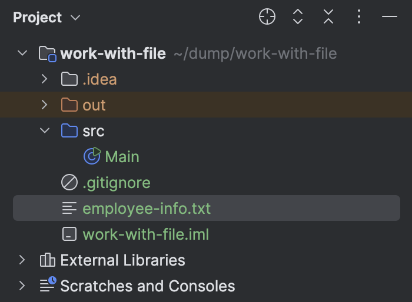

## مقدمه

میدونید یا قراره بدونید که توی خیلی از برنامه‌ها با داده‌هایی سر و کار دارین که الزاماً ورودی همون لحظه ترمینال نیستن و نیاز دارید از داده‌هایی که قبلاً داریم استفاده کنید، یا ممکنه بخواین ورودی‌هاتون رو از هر رابط کاربری‌ای که می‌گیرید در یک جای جداگانه ذخیره کنید. حتی ممکنه لازم باشه چیزی خارج از کدهاتون توی برنامه اصلی استفاده بشه، مثلاً اگه یادتون باشه برای پروژه منوی کافه باید یه سری عکس از خارج برنامه لود می‌کردین و با دادن آدرسش به کدتون اون‌ها رو استفاده می‌کردین.

به همه دلایل بالا و خیلی از دلایل دیگه ما نیاز داریم که دیتاهامون رو با یه روشی ذخیره کنیم و بعداً بازخوانیشون کنیم تا به یه دردی بخورن. برای این کار ما نیاز داریم بتونیم با این فایل‌ها کار کنیم و از اون‌ها چیزایی رو بخونیم یا توی اون فایل‌ها تغییراتی ایجاد کنیم و اطلاعات رو توشون بنویسیم.

همون‌طور که می‌دونید مفاهیم خوندن و نوشتن چه در جاوا چه در هر زبان یا برنامه‌ای که با کامپیوتر سر و کار داره به مفهوم ورودی و خروجی یا به طور مختصر I/O گره خورده. توی جاوا یعنی هرجایی که بخوای اطلاعاتی وارد برنامه‌ات کنی (مثل خوندن از یه فایل)، یا از برنامه‌ات بریزی بیرون (مثل نوشتن توی فایل). برای این کار ما از یه پکیج توی جاوا استفاده می‌کنیم به اسم `java.io`.

---

## کلاس فایل (File Class) و آدرس‌دهی

قبل از اینکه بریم سراغ خوندن و نوشتن از فایل‌ها، نیاز داریم که بتونیم بهشون توی سیستم‌عامل اشاره کنیم. کلاس `File` توی پکیج `java.io` قرار داره و دقیقاً برای کار با فایل‌ها و پوشه‌ها (دایرکتوری‌ها) استفاده می‌شه.

حالا آیا با کلاس `File` می‌تونیم بخونیم یا بنویسیم توی فایل؟ نه! این کلاس خودش مستقیماً برای خوندن و نوشتن استفاده نمی‌شه. فقط برای نمایش، ایجاد، حذف، تغییر نام و بررسی ویژگی‌های فایل و پوشه استفاده می‌شه.

ساختن یک شی از کلاس `File`:

```java
File myFile = new File("path/to/file.txt");
```

پس نیاز داریم آدرس بدیم (که احتمالاً خیلیاتون از چالش‌هاش خبر دارید).

### آدرس‌دهی فایل‌ها در جاوا (File Paths)

وقتی می‌خوایم یه فایل رو توی جاوا باز کنیم، باید یه مسیر (Path) بهش بدیم. این مسیر می‌تونه مطلق (Absolute Path) یا نسبی (Relative Path) باشه. بیایم دونه دونه بررسی کنیم.

#### آدرس مطلق (Absolute Path)

آدرس کامل از ریشه‌ی سیستم‌عامل تا خود فایل یا پوشه.
ویندوز:

```java
File file = new File("C:\\Users\\Mahdi\\Documents\\file.txt");
```

لینوکس/مک:

```java
File file = new File("/home/mahdi/documents/file.txt");
```

نکته: توی ویندوز چون `\` کاراکتر خاص (escape character) هست، باید دوتا بذاری `\\`
همچنین آدرس مطلق همیشه یکیه، فرقی نمی‌کنه پروژه‌ت کجا اجرا شه. ولی ممکنه روی سیستم‌های مختلف جواب نده. (مثلاً آدرس ویندوز روی مک نمی‌خونه یا روی سیستم ویندوزی که آدرس‌هاش فرق داره جواب نمیده.)

#### آدرس نسبی (Relative Path)

نسبت به مکانی که برنامه‌ت از اون اجرا می‌شه سنجیده می‌شه. این‌جوری قابل حمل‌تره.

مثلاً فرض کن یه فایل به اسم `data.txt` توی پوشه‌ی پروژه‌ت داری. اون‌وقت این‌جوری می‌نویسی: (توجه کنین که منظور از پوشه پروژه root دایرکتوریه که بسته به IDE سیستم یا نوع باز کردن پروژه‌تون می‌تونه متفاوت باشه)

```java
File file = new File("data.txt");
```

یا اگه فایل توی یه زیرپوشه‌ی خاص باشه:

```java
File file = new File("resources/data.txt");
```

به طور دقیق‌تر این مسیر نسبت به دایرکتوری اجرایی (working directory) سنجیده می‌شه، معمولاً جایی که فایل `.class` یا `jar` اجرا می‌شه.

#### ترکیب مسیرها با `File.separator`

اگه بخوای مسیر رو طوری بسازی که روی همه‌ی سیستم‌عامل‌ها کار کنه، بهتره از `File.separator` استفاده کنی:
توی ویندوز `File.separator` می‌شه: `\`
توی لینوکس و مک میشه: `/`

همچنین برای گرفتن مسیر فایل‌ها می‌تونیم از روش‌های زیر استفاده کنیم:
گرفتن مسیر کامل فایل:

```java
System.out.println(file.getAbsolutePath());
```

گرفتن مسیر والد (پوشه‌ی بالا):

```java
System.out.println(file.getParent());
```

گرفتن مسیر اجرایی فعلی:

```java
System.out.println(System.getProperty("user.dir"));
```

**جمع‌بندی آدرس‌دهی**

| نوع آدرس | مزیت | معایب |
| :--- | :--- | :--- |
| مطلق | دقیق و قطعی | قابل‌حمل نیست بین سیستم‌ها |
| نسبی | قابل‌حمل، ساده | ممکنه به دایرکتوری اجرای برنامه وابسته باشه |
| با `File.separator` | قابل حمل، امن‌تر | کمی پیچیده‌تر در نوشتن |

خب بیایم برگردیم به کلاس فایلمون. آبجکت کلاسمون رو ساختیم، بیایم و ببینیم این آبجکت چه متدهایی داره که به دردمون می‌خوره:

### متدهای کاربردی کلاس File

- متد `createNewFile()` : ساخت فایل جدید. این متد ممکنه `IOException` بندازه، پس باید توی `try-catch` بذاریش.
- متدهای `mkdir()` و `mkdirs()` : ساخت پوشه (دومی فولدرهای تو در تو می‌سازه).
- متد `exists()` : بررسی وجود فایل یا پوشه.
- متد `delete()` : حذف فایل یا پوشه.
- متدهای `getName()` و `getPath()` و `getAbsolutePath()` : گرفتن نام و مسیر فایل.
- متد `length()` : گرفتن سایز فایل به بایت.
- متدهای `list()` و `listFiles()` : لیست کردن محتویات پوشه.
- متد `renameTo(File newName)` : تغییر نام یا انتقال.

پس با همه چیزایی که یاد گرفتیم یه مثال کامل برای ساخت فایل، بررسی وجود و حذف رو می‌بینیم:

```java
import java.io.File;
import java.io.IOException;

public class FileExample {
    public static void main(String[] args) {
        try {
            File myFile = new File("example.txt");
            if (myFile.createNewFile()) {
                System.out.println("فایل ساخته شد: " + myFile.getName());
            } else {
                System.out.println("فایل از قبل وجود داره");
            }
            
            System.out.println("آیا فایل وجود داره؟ " + myFile.exists());
            System.out.println("مسیر کامل: " + myFile.getAbsolutePath());
            
            if (myFile.delete()) {
                System.out.println("فایل حذف شد");
            } else {
                System.out.println("فایل حذف نشد");
            }
        } catch (IOException e) {
            System.out.println("یه خطایی پیش اومده");
            e.printStackTrace();
        }
    }
}
```

---

## جریان داده‌ها Stream

تا حالا به این فکر کردین که وقتی یه فایل رو با کلاس `File` پیدا کردیم، برنامه‌ چطوری اون اطلاعاتو می‌خونه؟ این‌جاست که بحث Stream یا همون جریان داده‌ها میاد وسط. در واقع یه استریم رو می‌شه مثل یه رودخونه یا آبراهه از داده‌ها در نظر گرفت که اطلاعات مثل آب توی اون جاری‌ان و از یه منبع شروع به حرکت می‌کنن و وارد برنامه می‌شن یا برعکس از برنامه ریخته می‌شن به یه مقصدی.

اگه بخوایم یه تعریف شسته‌رفته‌تر و رسمی‌تر از stream داشته باشیم می‌شه گفت که stream نشون‌دهنده‌ی جریانی از داده‌هاست که یه طرف اون‌ها یه نویسنده یا writer و توی سر دیگه‌ش یه خواننده یا reader داریم.

استریم‌ها تو جاوا دو نوع اصلی دارن: **Byte stream** و **Character stream**.

---

## Byte stream

برای وقتی هست که داده‌هات متنی نیستن، یعنی قراره با فایل‌های باینری مثل عکس، ویدیو، فایل‌های PDF ، موسیقی، یا هر چیزی که ساختار عددی یا خاص داره کار کنی. که شامل کلاس‌های اصلی زیر می‌باشد:

### Input stream و Output stream

کلاس‌های ابسترکتی برای خوندن و نوشتن داده‌های باینری هستن که تمام کلاس‌های کار با داده‌های باینری ازشون مشتق می‌شن. وظیفه‌شون اینه که یه سری متد پایه مثل `read` یا `write` برای کار با بایت‌ها بدن و بقیه‌ی کلاس‌ها بیان و اونا رو پیاده‌سازی کنن. متدهای مهمشون شامل `read()`, `write()`, `flush()` و `close()` هست.

وقتی می‌خوایم داده‌های باینری رو بخونیم یا بنویسیم این دوتا کلاس ابسترکت به تنهایی کافی نیستن و در عمل به زیرکلاس‌های تخصصی‌تری نیاز داریم. از این زیرکلاس‌ها به `FileInputStream` و `FileOutputStream` اشاره می‌کنیم.

#### `FileInputStream`

این کلاس برای وقتیه که بخوای داده‌های خام از یه فایل بخونی. مثلاً بخوای یه تصویر، یه فایل صوتی یا هر فایل غیرمتنی رو بخونی.

**نکته بسیار مهم: مدیریت منابع با Try-With-Resources**

در گذشته برای کار با فایل‌ها، برنامه‌نویس‌ها مجبور بودن در انتهای کد متد `close()` رو دستی صدا بزنن. اما این کار یک ایراد بزرگ داشت: اگر قبل از رسیدن به خط `close` اروری رخ می‌داد، برنامه وارد `catch` می‌شد و فایل برای همیشه در حافظه سیستم‌عامل باز می‌موند! ( Resource Leak ).

در جاوای مدرن (از جاوا ۷ به بعد) ما از ساختار Try-With-Resources استفاده می‌کنیم. هر فایلی که داخل پرانتز جلوی `try` باز بشه، در انتهای بلوک به طور کاملاً خودکار بسته می‌شه، حتی اگه ارور بده! ما در تمام مثال‌های این داکیومنت از این استاندارد استفاده می‌کنیم.

فرض کن می‌خوای یه فایل تصویری رو بخونی و اندازه‌اش رو در خروجی نشون بدی (با شمارش تعداد بایت‌ها):

```java
import java.io.FileInputStream;
import java.io.IOException;

public class Main {
    public static void main(String[] args) {
        // باز کردن استریم داخل پرانتز try (بسته شدن خودکار)
        try (FileInputStream fis = new FileInputStream("image.jpg")) {
            int count = 0;
            while (fis.read() != -1) {
                count++;
            }
            System.out.println("File size in bytes: " + count);
        } catch (IOException e) {
            e.printStackTrace();
        }
    }
}
```

**متدهای مهم `FileInputStream`:**

- `int read()` :
یه بایت از فایل می‌خونه و به‌صورت عدد بین `0` تا `255` برمی‌گردونه. اگه به انتهای فایل برسه، -1 برمی‌گردونه.
مثلاً اگه خروجی این متد `65` باشه یعنی کد ما `A` رو خونده که کد اسکی اون `65` ‍ه.

- `int read(byte[] b)` :
این یکی به‌جای یه بایت، یه آرایه بایت رو پر می‌کنه. تعداد بایت‌های خونده شده رو برمی‌گردونه. (سرعتش خیلی بیشتره).

- `int read(byte[] b, int off, int len)` :
این متد یه بخش مشخص از آرایه رو با داده پر می‌کنه، از `off` شروع می‌کنه و `len` بایت سعی می‌کنه بخونه.

- `long skip(long n)` :
این متد به‌جای اینکه داده رو بخونه، می‌پره جلو. مثلاً اگه فایل `100` بایت باشه و `skip(10)` بزنی، می‌پره روی بایت یازدهم.

- `int available()` :
می‌گه چقدر از فایل هنوز قابل خوندنه، یعنی چند بایت مونده تا آخر.

---

## Character Stream

حالا اگه با متن طرفی، یعنی مثلاً فایل‌هایی مثل `.txt`، کدهای منبع، یا هر چیز قابل‌خوندن (به هر زبانی که باشه)، باید بری سراغ Character Stream .

فرض کنید قصد نوشتن یه برنامه برای دریافت اطلاعات اشخاص و ثبتشون توی یه فایل متنی داریم.
اول از همه نیاز داریم یه ساختاری داشته باشیم که حین اجرای برنامه یه ساختار برای پردازش اطلاعات ورودی داشته باشیم که بعدش اون رو توی فایل خروجی ذخیره کنیم. پس کلاس زیر رو با رعایت کپسوله‌سازی تعریف می‌کنیم:

```java
public class Student {
    private String firstName;
    private String familyName;
    private int age;
    private int entryYear;
    private double gpa;    
    
    public Student(String firstName, String familyName, int age, int entryYear, double gpa) {
        this.firstName = firstName;
        this.familyName = familyName;
        this.age = age;
        this.entryYear = entryYear;
        this.gpa = gpa;
    }

    public String getFirstName() { return firstName; }
    public String getFamilyName() { return familyName; }
    public int getAge() { return age; }
    public int getEntryYear() { return entryYear; }
    public double getGpa() { return gpa; }
}
```

(نکته: در پروژه‌های واقعی اگر قصد دارید کل آبجکت `Student` رو به همین شکل در یک فایل ذخیره کنید تا بعداً دقیقاً به شکل یک آبجکت بازیابیش کنید، نیازی نیست اون رو به متن تبدیل کنید! می‌تونید از مبحثی به نام `Serialization` و کلاس `ObjectOutputStream` استفاده کنید که یکی از مباحث جذاب جاوای پیشرفته است.)

اما اینجا می‌خوایم اطلاعات رو به صورت یک فایل متنی خوانا ثبت کنیم. کلاس‌های پایه‌ی Character Streams شامل `Reader` و `Writer` هستن. زیرکلاس‌های مهم اون‌ها شامل `FileReader` و `FileWriter` می‌شن.

### `FileReader`

برای خواندن فایل‌های متنی استفاده می‌شه. پشت‌صحنه از رمزگذاری پیش‌فرض سیستم برای تبدیل بایت‌ها به کاراکتر استفاده می‌کنه.

```java
// استفاده از try-with-resources برای اطمینان از بسته شدن فایل
try (FileReader fr = new FileReader("text.txt")) {
    int c;
    while ((c = fr.read()) != -1) {
        System.out.print((char) c);
    }
} catch (IOException e) {
    e.printStackTrace();
}
```

### `FileWriter`

برای نوشتن متن به فایل استفاده می‌شه. اگه فایل وجود نداشته باشه، خودش می‌سازه؛ اگه هم باشه، پیش‌فرض پاک می‌کنه و از نو می‌نویسه.
همچنین کانستراکتورش یه پارامتر `true` (برای append mode ) هم می‌گیره که باعث می‌شه داده‌های جدید به آخر فایل اضافه بشن.

نکته مهم برای فارسی‌نویسی (انکودینگ):
برای کار با فایل‌های فارسی یا کاراکترهای خاص (مثلاً ایموجی)، اگر از تنظیمات پیش‌فرض استفاده کنید ممکنه متن‌ها به هم بریزه (علامت سوال بشه). در جاوای مدرن (جاوا 11 به بعد) نیازی به کدهای پیچیده برای انکودینگ نیست؛ کافیه `StandardCharsets.UTF_8` رو مستقیماً به سازنده پاس بدید!

حالا کدمون رو برای ذخیره اطلاعات دانشجو می‌نویسیم:

```java
import java.io.*;
import java.nio.charset.StandardCharsets;

public class Main {
    public static void main(String[] args) {
        Student student = new Student("Ali", "Rezaei", 20, 1400, 3.7);
        
        try (FileWriter writer = new FileWriter("student.txt", StandardCharsets.UTF_8)) {
            
            writer.write(student.getFirstName() + ',' + 
                         student.getFamilyName() + ',' +
                         student.getAge() + ',' + 
                         student.getEntryYear() + ',' + 
                         student.getGpa());
                         
        } catch (IOException ex) {
            ex.printStackTrace();
        }
    }
}
```

### معجزه `Buffer` و `BufferedWriter`

حالا بعضی اوقات لازم داریم که کلی چیز توی فایلمون بنویسیم مثلاً توی یه لوپ باشیم و می‌خوایم هربار یچیزی به ته فایل اضافه کنیم. در این حالت اگه از `FileWriter` خالی استفاده کنیم، با هر بار `write()` یه درخواست نوشتن مستقیم به هارد دیسک می‌فرسته که از نظر زمان و منابع خیلی خیلی گرونه و سیستم رو کند می‌کنه.

قبل از رفتن سراغ راه‌حل بیاید خیلی کوتاه ببینیم بافر چیه؟
واژه‌ی « Buffer » توی برنامه‌نویسی یعنی یه فضای موقتی توی حافظه (RAM) که داده‌ها قبل از اینکه خونده یا نوشته بشن، می‌رن اونجا.
فرض کن داری یه بطری رو از شیر آب پر می‌کنی، ولی سطلی که قراره بریزی توش یه‌کم اون‌طرف‌تره. تو نمی‌تونی مستقیماً آب رو از شیر بریزی داخل سطل. پس اول با یه پارچ آب رو می‌گیری، بعد می‌ریزی توی سطل. اون پارچ همون بافره.

اینجاست که `BufferedReader` و `BufferedWriter` وارد می‌شن. اینا در واقع لایه‌هایی باهوش‌تر و سریع‌تر هستن که روی کلاس‌های قبلی سوار می‌شن.

```java
// استفاده ترکیبی از Buffer و Try-With-Resources
try (BufferedWriter bw = new BufferedWriter(new FileWriter("log.txt", true))) {
    for (int i = 0; i < 1000; i++) {
        bw.write("Log " + i);
        bw.newLine(); // می‌ره خط بعد (متد اختصاصی کلاس BufferedWriter)
    }
} catch (IOException e) {
    e.printStackTrace();
}
```

حالا فقط چند بار می‌ره سراغ دیسک (نه 1000 بار). نتیجه: سرعت بیشتر، فشار کمتر روی سیستم.

---

## خواندن از فایل با کلاس `Scanner`

تا این‌جای کار با نحوه کار استریم‌ها آشنا شدید. حالا می‌خوایم یاد بگیریم که چطور می‌شه محتوای یک فایل رو خیلی راحت‌تر خوند و پردازش کرد.

یه پروژهٔ جدید ایجاد کنید. توی دایرکتوری خود پروژه (خارج از دایرکتوری `src` )، فایل `employee-info.txt` رو ایجاد کنید:



توی این فایل اطلاعات زیر رو بنویسید:

```text
Name: Raees - JobTitle: Riasat  
Name: Gholi - JobTitle: Developer  
Name: Mamad - JobTitle: Developer
```

برای خوندن این فایل، از کلاس `Scanner` استفاده می‌کنیم. همون `Scanner` ای که برای ورودی گرفتن از کاربر توی ترمینال (`System.in`) هم ازش استفاده می‌کردیم. این کلاس، یک کانستراکتورِ overload شده داره که `File` ورودی می‌گیره.

```java
import java.io.File;
import java.io.FileNotFoundException;
import java.util.Scanner;

public class Main {
    public static void main(String[] args) {
        File file = new File("employee-info.txt");  

        try (Scanner scn = new Scanner(file)) {
            
            // تا زمانی که خط جدیدی در فایل وجود داره
            while (scn.hasNextLine()) {  
                String employee = scn.nextLine();  
                System.out.println("Employee info: \n\t" + employee);  
            }
            
        } catch (FileNotFoundException e) {  
            System.err.println("file \"" + file.getAbsolutePath() + "\" does not exist");
        }
    }  
}
```

اگر این کد رو اجرا کنید، خروجی زیر رو می‌بینید:

```text
Employee info:   
    Name: Raees - JobTitle: Riasat  
Employee info:   
    Name: Gholi - JobTitle: Developer  
Employee info:   
    Name: Mamad - JobTitle: Developer
```

هر کاری که قبلاً با `Scanner` می‌کردین، این‌جا هم می‌تونید بکنید. مثلاً اگر فایلی از یک سری عدد تشکیل شده باشه می‌تونید با استفاده از متدهای `nextInt()` و `hasNextInt()` اون‌ها رو بخونین.

### کلاس `Scanner` با `String`

کلاس `Scanner` یک کانستراکتور هم داره که ازتون `String` ورودی می‌گیره:

```java
Scanner scn = new Scanner("10 20 30 40 50");
```

توی این کد `Scanner` به جای خوندن از فایل یا ورودی کاربر، رشتهٔ ورودی خودش رو تکه‌تکه (Parse) می‌کنه.

```java
while (scn.hasNextInt()) {
    int num = scn.nextInt();  
    System.out.println("Num: " + num);  
}
```

---

## نوشتن به فایل با کلاس `PrintStream`

برای نوشتن به فایل‌ها، از کلاس `PrintStream` هم استفاده می‌کنیم که امکاناتی شبیه به چاپ در ترمینال رو بهمون میده. برای این کار، اول فایل `output.txt` رو توی دایرکتوری پروژه‌تون ایجاد کنید و به شکل زیر عمل کنید:

```java
import java.io.File;
import java.io.FileNotFoundException;
import java.io.PrintStream;

public class Main {
    public static void main(String[] args)  {
        File file = new File("output.txt");  

        try (PrintStream output = new PrintStream(file)) {
            output.println("Hello World!");  
            output.print("This is the last line");
        } catch (FileNotFoundException e) {  
            System.out.println("cannot find \"" + file.getAbsolutePath() + "\"");
        }
    }
}
```

شباهت آبجکت `PrintStream` ای که درست کردین و `System.out` یک علتی داره، بیاید نگاهی به کد کلاس `System` بندازیم تا بفهمیم چرا.

### ورودی و خروجی در کلاس `System`

اگر توی کد سورس جاوا کلاس `System` رو باز کنید و کامنت‌های فیلدهای اون رو بخونین، می‌تونید تعریف این فیلدها رو ببینید:

```java
public final class System {
    // Code Here...
    public static final InputStream in = null;
    public static final PrintStream out = null;
    public static final PrintStream err = null;
    // Code Here...
}
```

می‌بینید که `in`، صرفاً فیلدی از جنس `InputStream` ‍ه، و کلاس `out` هم دقیقاً نوعی `PrintStream` ‍ه! هر کاری که با `System.out` می‌کردین، با متغیر `output` کد خودتون هم می‌تونید بکنید تا توی یک فایل چاپ کنید.

علاوه بر این دو فیلد، فیلدی مشابه `out` به اسم `err` داریم. از این فیلد می‌تونید برای خروجی دادن پیغام خطاهاتون (معمولاً با رنگ قرمز در ترمینال) استفاده کنید. مثلاً:

```java
try {
    // Something can throw an exception here
} catch (Exception e) {  
    System.err.println(e.getMessage());  
}
```

خوبه که به عنوان یک برنامه‌نویس حرفه‌ای، همیشه خطاهاتون رو به جای `System.out` به `System.err` بفرستید.

---

## روش مدرن کار با فایل‌ها (NIO.2)

تمام کلاس‌هایی که در پکیج `java.io` یاد گرفتید (مثل `File`، `FileReader` و ...) کلاس‌های پایه و قدیمی جاوا هستن. در بازار کار امروز و از جاوا ۷ به بعد، پکیج قدرتمندی به نام `java.nio.file` (یا همون NIO.2 ) معرفی شد که کار با فایل‌ها رو بی‌نهایت راحت‌تر می‌کنه.

توی این روش جدید، به جای کلاس `File` از کلاس مدرن `Path`، و برای انجام عملیات‌های پیچیده از کلاس جامع `Files` استفاده می‌شه. با این روش خیلی از کدهای طولانی رو می‌تونید فقط در یک خط بنویسید:

```java
import java.nio.file.Files;
import java.nio.file.Path;
import java.util.List;
import java.io.IOException;

public class ModernFileHandling {
    public static void main(String[] args) {
        try {
            // نوشتن کل یک متن داخل فایل با یک خط کد! (جاوا ۱۱ به بعد)
            Files.writeString(Path.of("modern.txt"), "سلام دنیای مدرن جاوا!");
            
            // خواندن تمام خطوط یک فایل و ریختن داخل یک لیست با یک خط کد!
            List<String> lines = Files.readAllLines(Path.of("modern.txt"));
            System.out.println(lines.get(0));
            
        } catch (IOException e) {
            e.printStackTrace();
        }
    }
}
```

توصیه می‌کنیم برای پروژه‌های جدیدتون، حتماً مطالعه‌ای روی متدهای کلاس `Files` داشته باشید.

---

## چیزی که یاد گرفتیم

توی این داک، ما مقدمات و استانداردهای کار با فایل توی جاوا رو یاد گرفتیم. فهمیدیم که:

- کلاس `File` چیه، چه کاربردی داره و آدرس‌دهی چطوری کار می‌کنه.
- استریم‌ها ( `Byte` و `Character` ) چه تفاوتی باهم دارن.
- چطور با استاندارد سعیِ ایمن ( Try-with-resources ) کد بنویسیم تا منابع سیستم هدر نره.
- بافر چیه و چرا برای حفظ سرعت و کارایی سیستم حیاتیه.
- چطور از کلاس‌های `Scanner` و `PrintStream` برای فایل‌ها استفاده کنیم.
- و با روش‌های مدرن `java.nio` آشنا شدیم.

## منابع بیشتر

چیزی که ما توی این داک یاد گرفتیم، مبانی کلی برای کار با فایل‌ها و ورودی/خروجی (I/O) توی جاوا بود. جاوا امکانات خیلی گسترده‌‌تری برای مدیریت انواع ورودی و خروجی ارائه می‌ده (مثل `ObjectOutputStream` برای ذخیره مستقیم آبجکت‌ها و NIO برای برنامه‌نویسی شبکه‌ای پرسرعت). اگر دوست دارین بیشتر یاد بگیرین، می‌تونین به فصل دهم کتاب Learning Java ، یعنی « File Input and Output » نگاهی بندازین.
