## مقدمه

شما روی یک پروژه کار می‌کنید، ساعت‌ها روی آن وقت می‌گذارید و نهایتا به یک فایل `final` می‌رسید. بعد از یک مدت می‌فهمید که «داخل `final` یک تایپو وجود دارد»، تایپو را برطرف می‌کنید و به `final(2)` می‌رسید. یک هفته بعد متوجه می‌شوید که `final(2)` یک قسمت غلط دارد، حالا آن قسمت `final(2)` را درست می‌کنید تا به `final final(2)` برسید. بعد از یک مدت هم‌تیمی‌ شما که تازه به یاد آورده که پروژه‌ای وجود دارد وقتی می‌خواهد اسم خود را اول پروژه بنویسد، اشتباهی روی `final(2)` می‌نویسد و به `final(3)` می‌رسد، که با `final final(2)` فرق می‌کند و مشکلی که شما متوجه آن شده بودید در آن حل نشده.
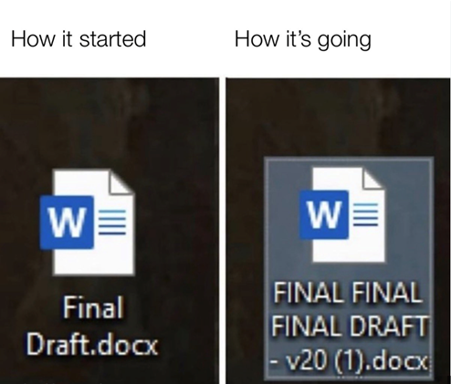

همین مشکلات داخل دنیای برنامه‌نویسی هم وجود دارند، و برای حلشان ابزارهای Version Control به وجود آمدند که معروف‌ترینشان Git می‌باشد. این ابزارها کمک می‌کنند یک تیم چند ده، چند صد یا حتی چند هزار نفره از برنامه‌نویس‌ها بتوانند سال‌ها روی یک پروژه کار کنند، بدون این که مجبور شوند فایلی به اسم `finalfinalfinalv20iSwearToGodThisIsTheFinalOneFinal` درست کنند! حتی تدریس‌یارهای خودتان هم از Git برای مدیریت محتوای کلاستان استفاده می‌کنند.

در این داکیومنت، ما می‌خواهیم با گیت آشنا شویم. گیت، ابزاری بسیار معروف، بسیار گسترده و اگر راستش را بخواهید، گاهی بسیار اذیت‌کننده است که داخل حدوداً همهٔ شرکت‌های برنامه‌نویسی استفاده می‌شود. احتمالاً بعد از خواندن این داک، کمی زمان می‌برد تا به Git عادت کنید، ولی نگران نباشید، کم‌کم راه می‌افتید. نگذارید طولانی بودن این داک شما را دلسرد کند، چون بیشتر آن اسکرین‌شات و خروجی‌ کدهاست.

یادگیری Git اوایل کمی سخت و پردست‌انداز است، و احتمالاً به یک سری خطای عجیب و غریب برمی‌خورید ولی نگران نباشید. در این مسیر، حتماً از تدریس‌یارها کمک بگیرید، داخل گوگل سرچ کنید و از ChatGPT دربارهٔ مشکلاتی که به آنها برمی‌خورید سؤال بپرسید. در نهایت، Git برای همهٔ دردسرهایتان یک راه‌حل دارد، پس با خیال راحت جلو بروید. در انتها، باید بگوییم که **شما در پروژه‌های آیندهٔ این درس، لازم است که خیلی جاها از گیت استفاده کنید، پس مهم است که آن را کامل همین‌جا یاد بگیرید.**

حواستان باشد که پیش‌فرض ما این است که شما، از داک tools که در جلسهٔ صفر به شما داده شده، ابزارهای لازم برای git را نصب کردید و یک اکانت github ساختید. اگر نکردید، لطفا برگردید و این کارها را انجام دهید.

## اطمینان از نصب صحیح گیت

اول از همه، باید مطمئن شوید که Git روی سیستم شما نصب شده و درست کار می‌کند. اگر از مک یا لینوکس استفاده می‌کنید، ترمینال (Terminal) و اگر ویندوزی هستید، پاورشل (PowerShell) را اجرا کنید. به این صفحه‌ای که می‌بینید، shell می‌گویند.

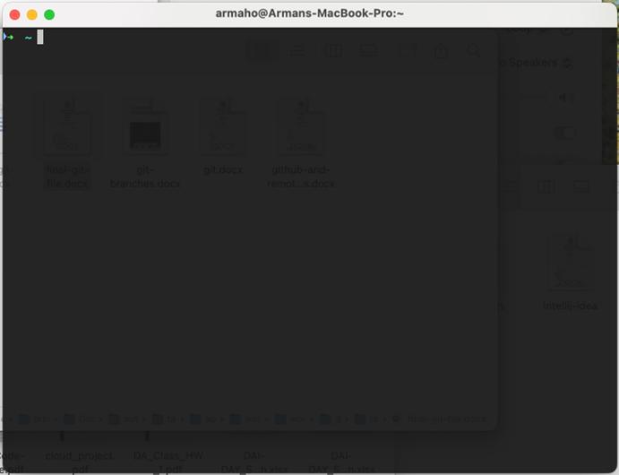

در این صفحه، دستور زیر را بزنید (حواستون باشه که $ را نزنید!):

```bash
$ git --version
```

اگر خروجی‌تون شبیه به خروجی زیر نبود، احتمالا گیت به درستی روی سیستم شما نصب نشده پس به داک tools از جلسهٔ صفر برگردید یا از تدریسیارها کمک بگیرید:

```bash
git version 2.39.5 (Apple Git-154)
```

در غیر این صورت، shell را باز نگه دارید. در ادامه این داک به آن نیاز داریم.

## آشنایی اولیه با shell

اول باید با shell آشنا بشویم. شل لینوکس و macOS خیلی به هم شبیه هستند اما شل ویندوز مقداری تفاوت دارد.

### ویندوز

صفحهٔ فعلی powershell برای شما به شکل زیر است:

!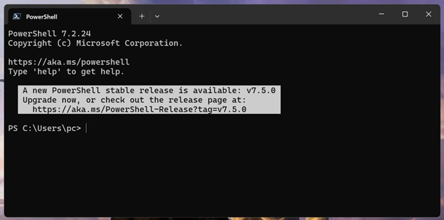

می‌بینید که چنین چیزی روی صفحه هست ولی بسته به اسم یوزر لپ‌تاپتون، بخش pc اسم متفاوتی دارد:

```bash
PS C:\Users\{your_username} >
```

این یعنی powershell آمادهٔ گرفتن دستورات شماست و آن‌ها را در مسیر `C:\Users\{your_username}` اجرا می‌کند. به این مسیر، اصطلاحاً home directory می‌گویند. حالا در همین دایرکتوری، دستور زیر را اجرا کنید:

```bash
$ ls
```

خروجی‌ای مثل خروجی زیر می‌بینید:

```bash
    Directory: C:\Users\pc  
  
Mode                 LastWriteTime         Length Name  
----                 -------------         ------ ----  
d-r--          12/18/2024  6:27 PM                Contacts  
d-r--           2/13/2025  9:31 PM                Desktop  
d-r--          12/18/2024  6:27 PM                Documents  
d-r--           2/13/2025  7:23 PM                Downloads  
d-r--          12/18/2024  6:27 PM                Favorites  
d-r--          12/18/2024  6:27 PM                Links  
d-r--          12/18/2024  6:27 PM                Music  
d-r--           6/14/2022  8:11 AM                OneDrive  
d-r--          12/18/2024  6:27 PM                Pictures  
d-r--          12/18/2024  6:27 PM                Saved Games  
d-r--          12/18/2024  6:27 PM                Searches  
d----          10/19/2024  8:00 PM                Tracing  
d-r--          12/18/2024  6:27 PM                Videos
```

اگر به این خروجی توجه کنید، می‌بینید که دستور `ls` (که مخفف list هست) تمام دایرکتوری‌ها و فایل‌هایی که در `C:\Users\{your_username}` بود را نمایش داد. حالا دستور زیر را اجرا کنید:

```bash
$ cd Documents
```

دستور cd، که مخفف change directory هست که شما را به دایرکتوری `C:\Users\{your_username}\Documents` منتقل می‌کند. می‌بینید که خط بعدی به شکل زیر تغییر کرده:

```bash
PS C:\\Users\\{your_username}\\Documents >
```

و اگر الآن دوباره `ls` بگیرید، این بار محتوای پوشهٔ Documents را می‌بینید. حالا می‌توانید با دستور زیر، به دایرکتوری قبلی‌ برگردید:

```bash
$ cd ..
```

### لینوکس و macOS

در لینوکس یا macOS، شما چنین صفحه‌ای می‌بینید (احتمالا مقداری تفاوت وجود دارد):

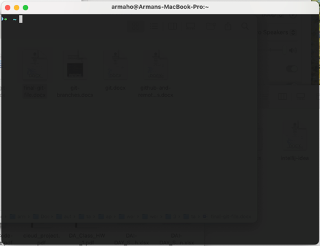

این صفحه هنوز محتویات خاصی ندارد. بالای صفحه یک `~` می‌بینید که نماد نشون‌دهندهٔ home directory شماست. همان جایی که پوشه‌هایی مثل Desktop، Documents، Videos، Downloads و بقیکٔ چیزهایی که همیشه ازشون استفائه می‌کنید، قرار دارند. یعنی home شما اینجاست:

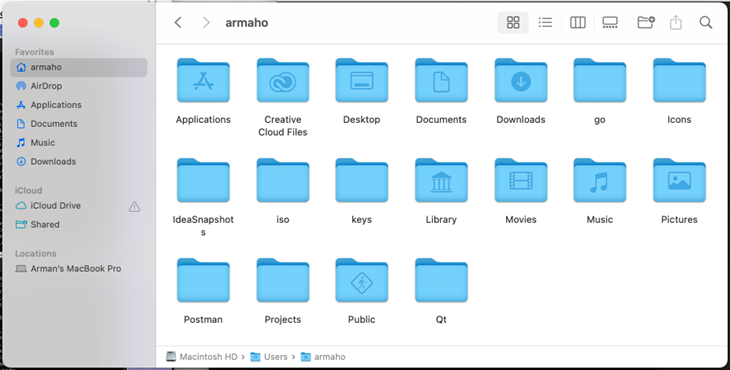

حالا shell آمادهٔ گرفتن دستورات شما و اجرای آن‌ها در دایرکتوری home است. دستور زیر را در آن اجرا کنید:

```bash
$ ls
```

خروجی‌ای مثل خروجی زیر می‌بینید:

```bash
Applications         IdeaSnapshots        Projects  
Creative Cloud Files Library              Public  
Desktop              Movies               Qt  
Documents            Music                go  
Downloads            Pictures             iso  
Icons                Postman              keys
```

می‌بینید که دستور ls، لیستی از تمام دایرکتوری‌ها و فایل‌هایی که دذ home بود را به شما نشان داد. حالا با استفاده از دستور زیر، وارد دایرکتوری Documents بشید:

```bash
$ cd Documents
```

می‌بینید که علامت `~` جای خودش را به Documents می‌دهد و این یعنی شما، با موفقیت وارد پوشهٔ Documents شدید:

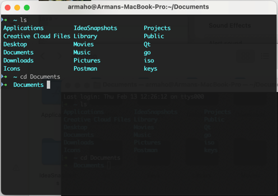

اگر این‌جا هم `ls` بزنید، این‌بار لیستی از دایرکتوری‌ها و فایل‌های داخل Documents می‌بینید:

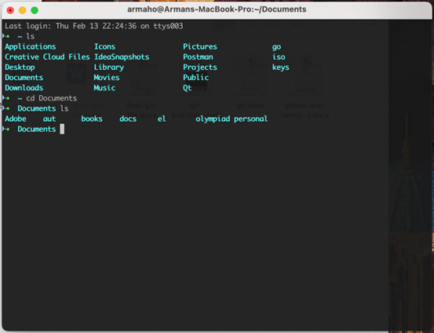

با استفاده از دستور زیر، به home برگردید:

```bash
$ cd ..
```

## configure کردن git

قبل از استفاده از git، باید بعضی از تنظیمات آن را عوض کنید.

اول از همه، با دستور زیر ایمیل خودتون را تنظیم کنید. بهتر است این ایمیل همان ایمیلی باشد که با آن اکانت گیت‌هاب ساختید:

```bash
git config --global user.email "molioo1298@gmail.com"
```

سپس یک اسم برای خودوتن مشخص کنید:

```bash
git config --global user.name "Jesper"
```

نهایتا، باید editor ای که git از آن استفاده می‌کند را تنظیم کنید. این ادیتور به شکل دیفالت روی vim تنظیم شده که ممکن است در دفعات اول استفاده با آن راحت نباشید. اگر از ویندوز استفاده می‌کنید آن را روی Notepad تنظیم کنید:

```bash
$ git config --global core.editor "notepad.exe"
```

و اگر از macOS استفاده می‌کنید، آن را روی textEdit تنظیم کنید:

```bash
$ git config --global core.editor "open -W -n -a TextEdit"
```

همچنین اگر از لینوکس استفاده می‌کنید، می‌توانید بسته به توزیع لینوکس آن را تنظیم کنید، ولی وقتی لینوکس دارید بهتره که vim یاد بگیرید.

## ایجاد ریپوی گیت

اول از همه، باید یک دایرکتوری جدید بسازیم تا پروژه را داخل آن قرار بدیم. در بخش اول، یاد گرفتیم که شل چطور کار می‌کند و دوتا از دستورهای مهم آن، یعنی `ls` و `cd` را هم یاد گرفتیم. حالا قبل از هر چیزی، مطمئن شوید که شل شما در home directory تنظیم شده و نه دایرکتوری دیگری.

بعد از آن، دستور زیر را وارد کنید. `mkdir`، که مخفف make directory است، در مسیر فعلی شل یک دایرکتوری به اسم `learn-git` ایجاد می‌کند:

```bash
$ mkdir "learn-git"
```

شما بعد از اجرای این دستور، می‌توانید این دایرکتوری را در home ببینید:

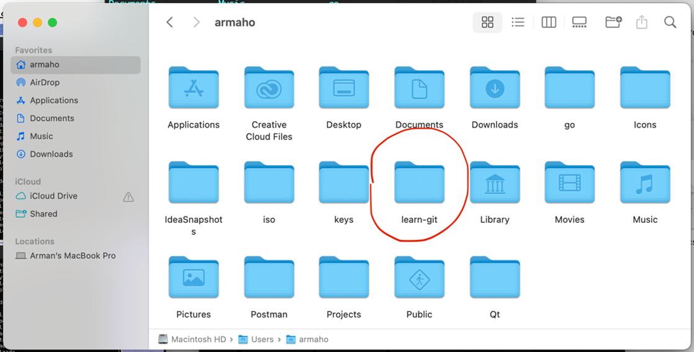

با استفاده از دستور cd، به این دایرکتوری برید:

```bash
$ cd learn-git
```

اگر الآن `ls` بزنید، می‌بینید که هیچ چیز در این دایرکتوری نیست.

حالا بیاید اولین دستور گیت‌ را اجرا کنیم (فقط تیکهٔ `git init` را بنویسید):

```bash
$ git init  

Initialized empty Git repository in /Users/armaho/learn-git/.git/
```

باید یک خروجی مشابه آن چیزی که بالا نوشته شده، ببینید. با استفاده از این دستور، ما دایرکتوری `learn-git` را به یک repository تبدیل کردیم. Repository یا به اختصار repo، به پروژه‌ای گفته می‌شود که با استفاده از Git به‌روزرسانی می‌شود. شما می‌توانید در هر repo تمامی دستورات Git را اجرا کنید.  
اگر الآن دستور زیر را اجرا کنید:

```bash
$ ls -a

. .. .git
```

الان می‌بینید که یک دایرکتوری به اسم `.git` در `learn-git` ایجاد شده. دلیل این که از `-a` با دستور `ls` استفاده کردیم این است که دایرکتوری `.git` یک دایرکتوری مخفی است و با `ls` عادی نمایش داده نمی‌شود. این دایرکتوری شامل همه چیزهایی هست که Git برای مدیریت پروژه‌ به آن نیاز دارد. ما کار زیادی با این دایرکتوری نداریم و نباید به آن دست بزنیم، ولی هر وقت جایی `.git` دیدید، بدونید که با یک ریپوی گیت رو‌به‌رو هستید.

حالا، دستور زیر را اجرا کنید:

```bash
$ git status

On branch main  

No commits yet  

nothing to commit (create/copy files and use "git add" to track)
```

دستور `git status` به شما وضعیت فعلی ریپو را نشان می‌دهد. چون هنوز هیچ فایل جدیدی اضافه نکردید، بنابراین وضعیت خاصی برای گزارش دادن نیست. اولین خط به شما می‌گوید که روی برنچ `main` هستید (بعداً در این داک با برنچ‌ها آشنا می‌شوید). خط دوم به شما می‌گوید که تا الآن هیچ کامیتی نداشتید (با کامیت هم در ادامه این داک آشنا می‌شوید). و خط سوم هم می‌گوید که هیچ فایلی برای کامیت وجود ندارد.

داخل `learn-git`، یک فایل مثل `hello.txt` ایجاد کنید و داخل آن بنویسید `"Hello, Git!"`. بعد دوباره `git status` بزنید:

```bash
$ git status

On branch main

No commits yet

Untracked files:

  (use "git add <file>..." to include in what will be committed)

        hello.txt

nothing added to commit but untracked files present (use "git add" to track)
```

می‌بینید که `hello.txt` در Untracked files ظاهر می‌شود. این فایل‌ها، فایل‌هایی‌ هستند که گیت تغییراتشان را دنبال نمی‌کند. در بخش بعد، می‌خواهیم این فایل را `stage` کنیم.

## stage کردن تغییرات در گیت

هر فایلی که در گیت تغییر می‌دهیم، نهایتاً با یک کامیت در گیت ثبت می‌شود. به همین دلیل قبل از انجام کامیت، باید تغییرات را با دقت بررسی کنیم. در گیت، Staging Area به شما این امکان را می‌دهد که دقیقاً همین کار را انجام دهید. این فضا جاییست که فایل‌های انتخاب‌شده برای کامیت بعدی در آن قرار می‌گیرند. می‌توانید به آن به عنوان یک فضای موقت نگاه کنید که تغییرات آمادهٔ کامیت شدن را برای شما نگه می‌دارد.

برای stage کردن `hello.txt`، از دستور زیر استفاده کنید:

```bash
$ git add hello.txt
```

حالا اگر دوباره `git status` بزنید، با خروجی زیر مواجه می‌شوید:

```bash
$ git status

On branch main  
  
No commits yet  
  
Changes to be committed:  
  (use "git rm --cached <file>..." to unstage)  
        new file:   hello.txt
```

می‌بینید که فایل `hello.txt`، به جای این که در Untracked files باشد، در Changes to be committed قرار دارد. این بخش، مختص به تغییراتی است که قرار است commit شوند. به خروجی git در این بخش دقت کنید:

```bash
(use "git rm --cached <file>..." to unstage)
```

گیت می‌خواهد به شما یاد دهد که برای خراج این فایل از Staging Area (یا به عبارتی، unstage کردن فایل) می‌توانید از دستور زیر استفاده کنید:

```bash
$ git rm --cached hello.txt
```

اگر بعد از این دستور، git status بزنید، می‌بینید که این فایل مثل قبل، stage نشده‌ست:

```bash
$ git status

On branch main

No commits yet

Untracked files:

  (use "git add <file>..." to include in what will be committed)

        hello.txt

nothing added to commit but untracked files present (use "git add" to track)
```

همچنین، با استفاده از دستور زیر، می‌توانید تمام تغییرات stage نشدهٔ تمام فایل‌های ریپو را، stage کنید بدون این که لازم باشد اسم همه آن فایل‌ها را بنویسید:

```bash
$ git add -A
```

حالا که فایل `hello.txt` را stage کردید، دوباره در آن تغییراتی ایجاد کنید. این بار داخلش به جای `"Hello, Git"`، بنویسید `"Hello there, Git!"`. سپس دوباره `git status` بزنید:

```bash
$ git status

On branch main  
  
No commits yet  
  
Changes to be committed:  
  (use "git rm --cached <file>..." to unstage)  
        new file:   hello.txt  
  
Changes not staged for commit:   
  (use "git add <file>..." to update what will be committed)  
  (use "git restore <file>..." to discard changes in working directory)  
        modified:   hello.txt
```

می‌بینید که فایل `hello.txt` هم یک بار به عنوان یک فایل جدید در بخش Changes to be committed آمده، و هم یک بار دیگه به عنوان فایلی که تغییر کرده در Changes not staged for commit. در واقع، نسخه‌ای از `hello.txt` که شما stage کردید، همان نسخه‌ای است که داخلش نوشتید `"Hello, Git"` و نه نسخه‌ای که تغییرش دادید. برای این که نسخهٔ جدیدتر را stage کنید، لازمه که دوباره دستور زیر را اجرا کنید:

```bash
$ git add hello.txt
```

خروجی‌هایی که گیت به شما نشان می‌دهد خیلی به یادگیری دستورات جدید گیت کمک می‌کند؛ به آن‌ها توجه کنید. مثلا در خروجی قبلی، شما یک دستور جدید می‌بینید:

```bash
(use "git restore <file>..." to discard changes in working directory)
```

که گیت برای توصیف این دستور می‌گه `"to discard changes in working directory"`. یعنی اگر شما دستور زیر را قبل از `add` کردن تغییرات می‌زدید:

```bash
$ git restore hello.txt
```

تغییرات stage نشدهٔ‌ `hello.txt` از بین می‌رفتند و داخلش دوباره `"Hello, Git"` نوشته می‌شد.

خروجی‌های Git بین ابزارهای برنامه‌نویسی بسیار دقیق و مفید هستند و معمولاً پیشنهادهای کارآمدی می‌دهد. حتی وقتی که به یک خطا برخوردید، Git دستوراتی برای رفع خطا پیشنهاد می‌کند که می‌توانید از آن‌ها استفاده کنید. علاوه بر این، در مواقعی که با خطا مواجه می‌شوید، ChatGPT و گوگل هم کمک‌کننده‌های خوبی هستند.

## commit کردن تغییرات

بعد از stage کردن تغییرات، برای این که آن‌ها در حافظهٔ گیت ماندگار شوند باید آن‌ها را commit کنیم. برای این کار، اول از همه یک `git status` بگیرید تا مطمئن باشید همهٔ تغییرات stage شدند:

```bash
$ git status

On branch main  
  
No commits yet  
  
Changes to be committed:  
  (use "git rm --cached <file>..." to unstage)  
        new file:   hello.txt
```

حالا که می‌بینیم همهٔ تغییرات stage شدند، آن‌ها را commit می‌کنیم:

```bash
$ git commit -m "add a simple hello.txt file"  

[main (root-commit) 499871f] add a simple hello.txt file  
 1 file changed, 1 insertion(+)  
 create mode 100644 hello.txt
```

همینطور که می‌بینید جلوی `git commit` نوشتیم: `-m "add a simple hello.txt file"`. به این توضیحات، commit message می‌گویند. این توضیحات خیلی مهم هستند و باید خلاصه و دقیق باشند تا کاری که در آن کامیت انجام شده را به خوبی توصیف کنند. شما می‌توانید هر جمله‌ای جای `"add a simple hello.txt file" `بنویسید تا مسیج کامیت شما باشد، ولی این مسیج باید به‌طور واضح توضیح دهد که چه چیزی در آن کامیت تغییر کرده است.

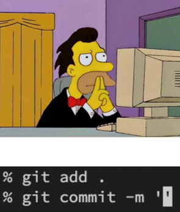

حالا اگر با `git log`، تاریخچهٔ repo را بررسی کنیم، می‌توانیم commit‌مان را ببینیم:

```bash
$ git log

commit 499871fd2f48ce02c862569993804a18f11229db (HEAD -> main)  
Author: Arman Hosseini <armanhosseini878787@gmail.com>  
Date:   Fri Feb 14 00:06:05 2025 +0330  
  
    add a simple hello.txt file
```

در این log، می‌توانید ببینید که از اسم و ایمیلی که در بخش «configure کردن git» نوشتید استفاده شده و امضای شما، زیر این کامیت ثبت شده!

اگر بعد از زدن `git log`، شل‌تون یک صفحهٔ جدید باز کرد و نتونستید دستور جدیدی بزنید، با زدن دکمهٔ Q از آن صفحه خارج شوید.

یک فایل C در `learn-git` به اسم `main.c` درست کنید و محتواش را مثل کد زیر بنویسید:

```c
#include <stdio.h>
#include <stdlib.h>

int main(void) {  
    puts("Hello from our git repo!");

    return EXIT_SUCCESS;  
}
```

همچنین، یک فایل `goodbye.txt` هم درست کنید و داخلش بنویسید:

```txt
Goodbye, Git :(
```

حالا، اگر `git status` بگیرید، با دو فایلِ stage نشده را به را می‌شوید:

```bash
$ git status

On branch main  
Untracked files:  
  (use "git add <file>..." to include in what will be committed)  
        goodbye.txt  
        main.c  
  
nothing added to commit but untracked files present (use "git add" to track)
```

هر دوی آن‌ها را stage کنید:

```bash
$ git add -A

$ git status

On branch main

Changes to be committed:

  (use "git restore --staged <file>..." to unstage)

        new file:   goodbye.txt

        new file:   main.c
```

حالا یک commit جدید برای تغییراتتون بزنید. این بار از `-m` استفاده نکنید:

```bash
$ git commit

hint: Waiting for your editor to close the file...
```

اینجا، Git از ادیتوری که در مرحلهٔ «configure کردن git» مشخص کردید استفاده می‌کند تا commit message را از شما بگیرد. شما می‌توانید چند خط پیام به گیت بدید. خط اول به عنوان تیتر پیام در نظر گرفته می‌شود و باقی خطوط به عنوان بدنهٔ پیام. همچنین، خطوطی که با `#` شروع می‌شوند برای گیت مهم نیستند و می‌توانید آن‌ها را نادیده بگیرید. من پیام زیر را برای کامیت خودم مشخص کردم:

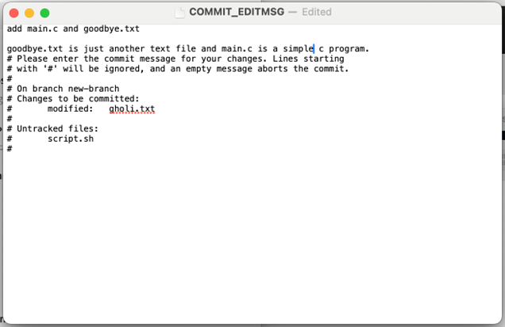

بعد از این که پیام کامیت را نوشتید، با بستن صفحهٔ ادیتور، گیت کامیت شما را نهایی می‌کند (اگر از macOS استفاده می‌کنید، حتما با استفاده از `Command + Q`، یا دکمهٔ Quit از taskbar، به شکل کامل `textEdit` را ببندید). بعد از این کار، commit شما انجام شده و می‌توانید با `git log` آن را ببینید:

```bash
$ git log

commit fb32626f45903dbd77a68aebb949c22ddb6de36b (HEAD -> main)  
Author: Arman Hosseini <armanhosseini878787@gmail.com>  
Date:   Fri Feb 14 00:40:08 2025 +0330  
  
    add main.c and goodbye.txt  
     
    goodbye.txt is just another text file and main.c is a simple c program.  
  
commit 499871fd2f48ce02c862569993804a18f11229db  
Author: Arman Hosseini <armanhosseini878787@gmail.com>  
Date:   Fri Feb 14 00:06:05 2025 +0330  
  
    add a simple hello.txt file
```

دقت کنید که با هر کامیت، صرفا فایل‌هایی که در Staging Area بودند کامیت می‌شوند و باقی فایل‌ها در این کامیت نخواهند بود. پس شما می‌توانید تعدادی از فایل‌ها را در یک کامیت و بقیک فایل‌ها را در کامیت دیگری عوض کنید.

### قواعد commitها

#### کامنت‌گذاری درست

همان‌طور که قبلاً گفتیم، یکی از مهم‌ترین اصول یک کامیت خوب این است که پیام خیلی واضح و خوبی داشته باشد که دقیقا توضیح دهد چه کاری در آن کامیت انجام شده. خیلی وقت‌ها ممکن کامیت نوشتن تبدیل به یک کار خیلی طولانی شود.

در پیام کامیت، حتماً از ساده‌ترین فرم افعال استفاده کنید. مثلاً اگر فایل `hello.txt` را اضافه کردید، کامنت‌هایی مثل `"adding hello.txt"` یا `"added hello.txt"` مناسب نیستند. بهتره از خود فعل به شکل ساده، یعنی `"add hello.txt"` استفاده کنید. البته این مورد می‌تواند بسته به جایی که کار می‌کنید و conventionهای آن، متفاوت باشد.

#### تغییرات مرتبط در یک کامیت

هر کامیت باید شامل تغییرات مرتبط با یک کار و فقط یک کار باشد. مثلاً کامیتی که همزمان هم `main.c` و هم `goodbye.txt` را به ریپو اضافه کردیم، چندان کامیت خوبی نبود، چون که همزمان دو تغییر نامربوط به هم را پوشش می‌داد. بهتر بود که این تغییرات در قالب دو کامیت مختلف انجام می‌شد.

#### تست و چک کردن تغییرات قبل از کامیت

کدها را قبل از کامیت، تست کنید و مطمئن بشید که کار می‌کنند. همچنین تغییراتی که stage شدند را قبل از انجام کامیت بررسی کنید.

## تاریخچهٔ ریپو

همون‌طور که قبل‌تر فهمیدید، شما می‌توانید با دستور `git log`، تاریخچهٔ commit های ریپو را ببینید:

```bash
$ git log

commit fb32626f45903dbd77a68aebb949c22ddb6de36b (HEAD -> main)  
Author: Arman Hosseini <armanhosseini878787@gmail.com>  
Date:   Fri Feb 14 00:40:08 2025 +0330  
  
    add main.c and goodbye.txt  
      
    goodbye.txt is just another text file and main.c is a simple c program.  
  
commit 499871fd2f48ce02c862569993804a18f11229db  
Author: Arman Hosseini <armanhosseini878787@gmail.com>  
Date:   Fri Feb 14 00:06:05 2025 +0330  
  
    add a simple hello.txt file
```

کنار هر commit، یک کد عجیب طولانی می‌بینید. مثلا کد کامیت آخر ما در این مثال، `fb32626f45903dbd77a68aebb949c22ddb6de36b` هست. این کد در کل جهان مختص به همین کامیت است. این کد انقدر اختصاصی است که فقط ۷ حرف اولش هم برای تمایز دادن این کامیت از سایر کامیت‌ها کافیست و شما خیلی وقت‌ها به جای کد کامل این کامیت، فقط چند حرف اول را نیاز دارید.

علاوه بر این، می‌توانید با استفاده از فلگ `--oneline`، حالت خلاصه‌تری از `git log` ببینید:

```bash
$ git log --oneline

fb32626 (HEAD -> main) add main.c and goodbye.txt  
499871f add a simple hello.txt file
```

## فایل `.gitignore`

یک فایل جدید به اسم `ignored.txt` اضافه کنید و داخلش بنویسید `"This file will be ignored."`. حالا `git status` بزنید تا آن را ببینید:

```bash
$ git status

On branch main  
Untracked files:  
  (use "git add <file>..." to include in what will be committed)  
    ignored.txt  
  
nothing added to commit but untracked files present (use "git add" to track)
```

حالا یک فایل به اسم `.gitignore` به ریپو اضافه کنید، و در خط اول آن بنویسید `"ignored.txt"` و ذخیره‌ش کنید:

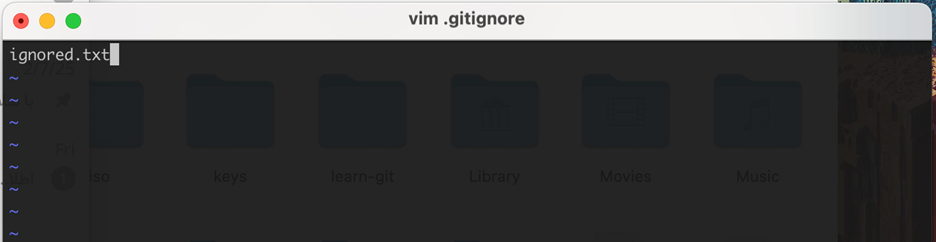

دوباره git status بگیرید:

```bash
$ git status

On branch main

Untracked files:

  (use "git add <file>..." to include in what will be committed)

        .gitignore

nothing added to commit but untracked files present (use "git add" to track)
```

اگر توجه کنید، فایل `ignored.txt` را نمی‌بینید! انگار که گیت، تغییرات آن را دنبال نمی‌کند و برایش مهم نیست.

فایل `.gitignore`، یک فایل خاص است. با استفاده از آن، می‌توانید به گیت بگید که فایل‌ها یا دایرکتوری‌های مختلف را ایگنور کند و تغییراتشان را دنبال نکند. تغییرات جدید را `add` و `commit` کنید:

```bash
$ git add -A  
  
$ git commit -m "add .gitignore"

[main 4e0eff9] add .gitignore

 1 file changed, 1 insertion(+)

 create mode 100644 .gitignore
```

حالا، دایرکتوری‌ای به اسم `gholi` در ریپو درست کنید، و در آن دو فایل `1.txt` و `2.txt` را ایجاد کنید. بعد از این کار، اگر `git status` بزنید با خروجی زیر مواجه می‌شوید:

```bash
$ git status

On branch main

Untracked files:

  (use "git add <file>..." to include in what will be committed)

        gholi/

nothing added to commit but untracked files present (use "git add" to track)
```

حالا، به `.gitignore` خط زیر را اضافه کنید. با اضافه کردن این خط، به git می‌گید که کل دایرکتوری `gholi` را ایگنور کند:

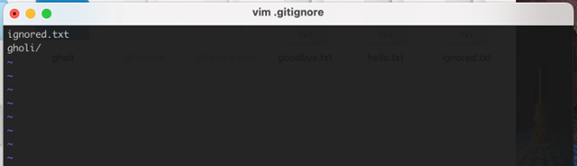

اگر دوباره `git status` بزنید، می‌بینید که `git` تغییرات دایرکتوری `gholi` را دنبال نمی‌کند:

```bash
$ git status

On branch main

Changes not staged for commit:

  (use "git add <file>..." to update what will be committed)

  (use "git restore <file>..." to discard changes in working directory)

        modified:   .gitignore

no changes added to commit (use "git add" and/or "git commit -a")
```

تغییرات جدید را `add` و `commit` کنید:

```bash
$ git add -A  
  
$ git commit -m "update .gitignore"

[main 8bf25ec] update .gitignore

 1 file changed, 1 insertion(+)
```

## برنچ‌ها

حالا که با بعضی از دستورات و مفاهیم Git آشنا شدیم، می‌توانیم راجع به شاخه‌ها (branches) در آن صحبت کنیم. Branch یکی از مهم‌ترین ویژگی‌های Git است که باعث می‌شود ده‌ها، صدها یا حتی هزاران برنامه‌نویس همزمان روی پروژه‌های مشترکی مثل Linux، Mozilla و خیلی از پروژه‌های دیگر کار کنند.

برنچ‌ها به یک تیم از برنامه‌نویس‌ها اجازه می‌دهند تا بدون تاثیرگذاری روی کار یکدیگر، همزمان یک code base را تغییر دهند، فیچر جدید اضافه کنند، خطاها را رفع کنند، یا هر کار دیگری انجام دهند. هر برنامه‌نویس قبل از شروع کدنویسی، یک برنچ از `main` می‌گیرد، کارش را روی برنچ جدید انجام می‌دهد، و در نهایت هم با `merge` کردن، تغییراتش را روی برنچ `main` منتقل می‌کند. اگر این جمله گیجتون کرد، بیاید از اول با برنچ‌ها آشنا بشویم.

### شروع به کار

برای شروع به کار، اول یک پروژهٔ جدید در IntelliJ به اسم `learning-git` ایجاد کنید. تیک Create Git repository را هم بزنید:

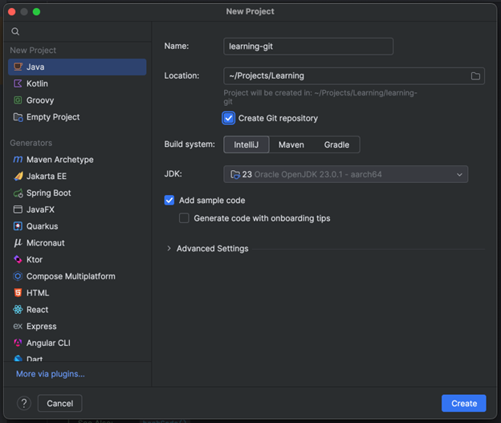

با زدن این تیک، خود IntelliJ برای پروژه‌ یک ریپوی git درست می‌کند، یک فایل `.gitignore` ایجاد می‌کند و کارهای اولیه را انجام می‌دهد، تا شما بتوانید راحت‌تر با git کار کنید. مثلا اگر به فایل `.gitignore` که ساخته شده نگاه کنید، می‌بینید که خیلی از دایرکتوری‌هایی که IDEهای مختلف برای خودشان درست می‌کنند و ربطی به پروژه‌ شما ندارد، آن‌جا هست:

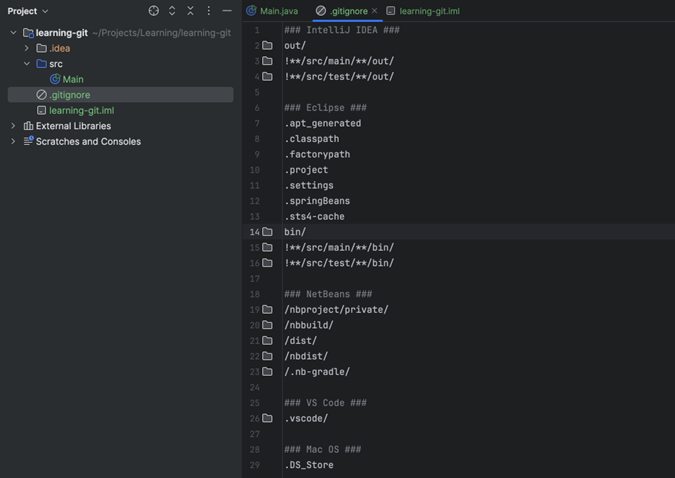

لطفا به انتهای فایل `.gitignore`، خط زیر را اضافه کنید تا فایل‌های `.iml` هم ایگنور شوند، وگرنه در ادامهٔ داک مقداری اذیت می‌شید:

```bash
*.iml
```

کد زیر، که در آن مجموع ارقام عدد ورودی را به دست میاوریم، یک کد نمونه‌ست برای این که branch ها را یاد بگیریم. این کد را در `Main.java` کپی و اجرا کنید تا مطمئن شوید درست کار می‌کند:

```bash
import java.util.Scanner;

public class Main {
    public static void main(String[] args) {
        var scn = new Scanner(System.in);
        var input = scn.nextInt();  
  
        System.out.printf("Sum of digits: %d", sumOfDigits(input));  
    }

    public static int sumOfDigits(int number) {
        var sum = 0;
        while (number > 0) {  
            sum += number % 10;  
            number /= 10;  
        }

        return sum;  
    }  
}
```

حال باید اولین commit را انجام بدیم. اول از همه، با دستور cd به دایرکتوری پروژه‌ برید و بعد، git status بزنید:

```bash
$ git status

On branch main  
  
No commits yet  
  
Changes to be committed:  
  (use "git rm --cached <file>..." to unstage)  
        new file:   .gitignore  
        new file:   learning-git.iml  
        new file:   src/Main.java  
  
Changes not staged for commit:  
  (use "git add <file>..." to update what will be committed)  
  (use "git restore <file>..." to discard changes in working directory)

        modified:   .gitignore  
        modified:   src/Main.java
```

یک فیچر خوب IntelliJ این است که داخل خودش shell دارد تا کار شما راحت‌تر باشد. با زدن دکمهٔ terminal، می‌توانید به آن دسترسی پیدا کنید:

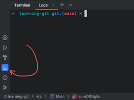

بعد از زدن این دکمه، صفحهٔ shell زیر IntelliJ باز می‌شود. همانطور که می‌بینید این shell شبیه چیزی است که قبلا با آن کار کردید؛ در اصل هیچ تفاوتی ندارد و همان است! اگر این‌جا `git status` بزنید می‌بینید که خروجی‌ای شبیه به خروجی قبل نشان می‌دهد:

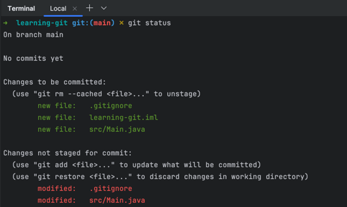

برای راحتی کار، در ادامهٔ داک و داخل پروژه‌هاتون می‌تونید از این شل استفاده کنید.

در خروجی `git status` می‌بینید که تغییرات فایل `Main.java` و `.gitignore` هنوز stage نشدند. برای این که همهٔ تغییرات stage شوند، از دستور زیر استفاده می‌کنیم:

```bash
$ git add -A
```

در `git status` بعدی، می‌بینید که همهٔ تغییرات stage شدند:

```bash
$ git status

On branch main  
  
No commits yet  
  
Changes to be committed:  
  (use "git rm --cached <file>..." to unstage)  
        new file:   .gitignore  
        new file:   learning-git.iml  
        new file:   src/Main.java
```

لطفا با استفاده از دستور زیر، فایل `learning-git.iml` را unstage کنید تا گیت برای همیشه آن را ایگنور کند:

```bash
$ git rm --cached learning-git.iml
```

اگر دوباره git status بزنید، خروجی زیر را می‌بینید:

```bash
On branch main  
  
No commits yet  
  
Changes to be committed:  
  (use "git rm --cached <file>..." to unstage)  
        new file:   .gitignore  
        new file:   src/Main.java
```

حالا تغییرات را commit کنید:

```bash
$ git commit -m "initial commit"
```

حالا باید با زدن git status، خروجی زیر را ببینید تا مطمئن شوید که همه چیز commit شده:

```bash
On branch main  
nothing to commit, working tree clean
```

بهترین راه یادگیری برنچ‌ها کار کردن با آن‌هاست. پس حالا اولین branch‌ها را می‌سازیم.

### ساخت برنچ

در ابتدا، دستور زیر را در دایرکتوری پروژه‌ اجرا کنید:

```bash
$ git branch
```

این دستور، تمامی branch‌های فعلی این repo را نشون می‌دهد. طبیعتا، شما باید فقط یک برنچ به اسم `main` یا `master` ببینید:

```bash
* main
```

اگر terminal در یک صفحهٔ جدید، مثل صفحهٔ زیر، برنچ‌ها را نشان داد، می‌توانید با زدن Q از این صفحه خارج بشید:

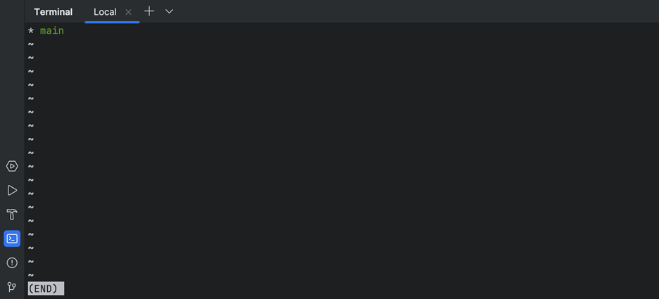

حالا می‌خواهیم یک برنچ جدید به اسم `support-long` ایجاد کنیم. توی این برنچ، می‌خواهیم یک سری تغییر داخل کد بدیم تا تابع `sumOfDigits` از ورودی‌های `long` پشتیبانی کند. برای ایجاد برنچ جدید، از دستور زیر استفاده می‌کنیم:

```bash
$ git branch support-long
```

حالا اگر دستور `git branch` را بزنید:

```bash
$ git branch
```

با خروجی زیر مواجه می‌شوید:

```bash
* main  
support-long
```

همان‌طور که می‌بینید، ما با موفقیت branch جدیدی از روی main ساختیم و الآن می‌توانیم در لیست branch‌ها آن را ببینیم ولی هنوز داخل این branch نیستیم. برای این که وارد این branch بشویم، از دستور `checkout` استفاده می‌کنیم:

```bash
$ git checkout support-long
```

حالا اگر `git branch` بزنید، خروجی زیر را می‌بینید:

```bash
main  
* support-long
```

می‌بینید که ستارهٔ کوچکی که قبلا کنار `main` بود، الآن روی `support-long` است. این یعنی ما با موفقیت، branchمان را تغییر دادیم.

کدی که داخل این برنچ قرار دارد، دقیقا شبیه کد `main` است. در واقع، این برنچ، کپی کاملی از برنچ main است، چون وقتی آن را ساختیم، در `main` بودیم. همیشه اگر در برنچ `a` باشیم و برنچ `b` را درست کنیم، برنچ `b` کپی برنچ `a` خواهد بود. حالا کدی که در `Main.java` بود را، به کد جدید زیر تغییر دهید:

```java
import java.util.Scanner;

public class Main {
    public static void main(String[] args) {
        var scn = new Scanner(System.in);
        var input = scn.nextLong();  
  
        System.out.printf("Sum of digits: %d", sumOfDigits(input));  
    }

    public static int sumOfDigits(long number) {
        var sum = 0;
        while (number > 0) {  
            sum += (int)(number % 10);  
            number /= 10;  
        }

        return sum;  
    }  
}
```

تفاوت این کد با کد قبلی، صرفا در این است که این کد به جای `int`، قابلیت این را دارد که یک `long` ورودی بگیرد. حالا به ترتیب `git status` بزنید تا مطمئن باشید که تغییراتمان در گیت دیده می‌شود. خروجی زیر را می‌بینید:

```bash
On branch support-long  
Changes not staged for commit:  
  (use "git add <file>..." to update what will be committed)  
  (use "git restore <file>..." to discard changes in working directory)  
        modified:   src/Main.java  
  
no changes added to commit (use "git add" and/or "git commit -a")
```

سپس `git add` بزنید و دوباره `git status` بزنید تا مطمئن باشید که تغییرات stage شدند:

```bash
On branch support-long  
Changes to be committed:  
  (use "git restore --staged <file>..." to unstage)  
        modified:   src/Main.java
```

نهایتا هم، تغییرات را کامیت کنید:

```bash
$ git commit -m "add support for long numbers"  
  
[support-long 3f48bc3] add support for long numbers  
 1 file changed, 3 insertions(+), 3 deletions(-)
```
 
اگر الآن `git log` بزنید، با چنین خروجی‌ای مواجه می‌شوید و می‌فهمید که تغییرات اعمال شدند:

```bash
commit 3f48bc3d5c29522283dd4a8c811a72fc78feb4e8 (HEAD -> support-long)  
Author: Arman Hosseini <armanhosseini878787@gmail.com>  
Date:   Tue Feb 11 10:07:51 2025 +0330  
  
    add support for long numbers  
  
commit 97ea957914201c480912c24718e352abe42f8e72 (main)  
Author: Arman Hosseini <armanhosseini878787@gmail.com>  
Date:   Mon Feb 10 12:30:17 2025 +0330  
  
    initial commit
```

حالا، بیاید یک نگاه به برنچ `main` بندازیم. این branch را `checkout` کنید:

```bash
$ git checkout main

Switched to branch 'main'
```

فایل `Main.java` را نگاه کنید. می‌بینید که این فایل، هیچ تغییری نکرده و هنوز هم فقط اعداد `int` را پشتیبانی می‌کند! با زدن `git log`، می‌توانید ببینید که commit مرتبط با این تغییر هم وجود ندارد و فقط commit اولی‌ را می‌بینید:

```bash
commit 97ea957914201c480912c24718e352abe42f8e72 (HEAD -> main)  
Author: Arman Hosseini <armanhosseini878787@gmail.com>  
Date:   Mon Feb 10 12:30:17 2025 +0330  
  
    initial commit
```

این که شما می‌توانید کد یک branch را عوض کنید، بدون این که کد branch های دیگر تغییر کند، از قابلیت‌های اصلی‌ git است! با checkout کردن دوبارهٔ `support-long`، می‌بینید که تغییرات شما برمی‌گردند. شما در ادامهٔ داک، با استفاده از دستور `git merge`، تغییرات برنچ `support-long` را به `main` منتقل می‌کنید.

### چرا برنچ‌ها

احتمالا این سوال پیش آمده که چرا اصلا باید از branch‌ها استفاده کنیم. ارزش این قابلیت وقتی مشخص می‌شود که با یک اپلیکیشن واقعی‌تر رو‌به‌رو باشیم. در هر دوی سناریوهایی که در ادامه توضیح می‌دیم، می‌توانید کاربردهایی واقعی از branch‌ها را ببینید. واقعیت این است که بدون برنچ‌ها، کار کردن در یک تیم برنامه‌نویسی خیلی سخت‌تر از چیزی می‌شد که فکر می‌کنید.

#### سناریوی ۱

فرض کنید قلی در یک تیم برنامه‌نویسی در شرکت تپسی کار می‌کند. یک روز رئیسش به او می‌گوید که قابلیت گرفتن تاکسی دو مقصده را به سیستم اضافه کند. قلی هم شروع می‌کند به کد زدن و تمام روز مشغول کار بر روی این ویژگی جدید می‌شود تا بتواند خیلی زود این امکان را برای مشتری‌ها فراهم کند. اما قلی به برنچ‌های Git اعتقادی ندارد و همه کارهایش را روی برنچ `main` انجام می‌دهد.

انتهای روز، رئیس دوباره به قلی می‌گوید که سیستم به خطا خورده و هیچ‌کس نمی‌تواند تاکسی بگیرد! حالا قلی باید سریع باگ را برطرف کند، ولی کدی که تا الان برای تاکسی دو مقصده زده چه می‌شود؟ آیا باید انقدر `Ctrl + Z` بزند تا همهٔ کدها پاک شده و به کد اولیه برسد که خطا را برطرف کند؟ از طرفی، قلی باید خیلی سریع باگ فعلی سیستم را حل کند و از طرف دیگر هم کل روز کد زده و نمی‌تواند از کدهایش دل بکند!

قلی می‌توانست در ابتدا، به جای این که کارش را روی `main` انجام بدهد، یک branch جدید مثل `do-maghsadeh` ایجاد کند و کارهایش را آنجا انجام دهد و وقتی با باگ رو‌به‌رو شد، خیلی سریع برنچ `main` (که دست نخورده باقی مانده) را checkout کند تا بتواند خطای مشتری‌ها را برطرف کرده و همزمان، تغییراتش در برنچ `do-maghsadeh` هم حفظ کند. در شکل زیر، می‌توانید تصویری از این حالت ببینید:

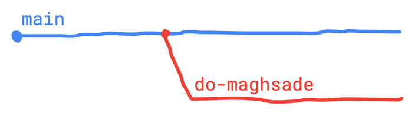

در این visualization، که در دنیای گیت خیلی معروف است، می‌توانید ببینید که وقتی قلی کارش را شروع کرده، برنچ `do-maghsadeh` از برنچ `main` جدا شده است.

#### سناریوی ۲

قلی و گلی که هر دو در شرکت تپسی مشغول به کار هستند، به تازگی درگیر پیاده‌سازی فیچرهای جدیدی شدند که رئیس خواسته. قلی چند روز است که که روی فیچر «تاکسی دو مقصده» کار می‌کند و امروز، رئیس به گلی گفته که روی فیچر جدیدی به نام «هم‌سفر» کار کند. اما متاسفانه، هر دو هنوز به مفهوم برنچ‌ها در Git اعتقادی ندارند و تصمیم گرفتند پیاده‌سازی را مستقیماً روی برنچ `main` پیش ببرند.

قلی کارش را به چند قسمت معنادار تقسیم کرده و با پایان هر قسمت، تغییراتش را کامیت می‌کند. اما مشکل اینجاست که وقتی گلی کارش را شروع می‌کند، تغییرات قلی را روی کدهای برنچ `main` می‌بیند. این تغییرات هنوز به درستی کار نمی‌کنند و باعث می‌شوند که اپ تپسی به کلی از کار بیفتد. بنابراین، گلی نمی‌تواند هیچ کاری را شروع کند.

گلی که از وضعیت ناامید شده، از قلی می‌خواهد که هر چه سریع‌تر کدهایش را درست کند تا بتواند به موقع فیچر هم‌سفر را تحویل دهد. اما قلی که هنوز تحت استرس رفع خطاهای گذشته است، حالش خوب نیست و با گلی بحث می‌کند و می‌گوید که نمی‌تواند کدش را درست کند.

اگر قلی، از ابتدا کارش را روی برنچ جدیدی به اسم `do-maghsadeh` انجام می‌داد، تغییراتش در `main` دیده نمی‌شد و گلی می‌توانست از `main`، برنچ جدیدی مثل `hamsafar` بگیرد و کارش را شروع کند، بدون این که نیازی به بحث و دعوا با قلی باشد. نهایتا هم وقتی development این دو فیچر تمام شد و به خوبی تست شدند، هر دو کدهایشان را روی برنچ `main` مرج می‌کردند تا فیچرها به دست مشتری برسد. تصویر زیر، این حالت را نشون می‌دهد:

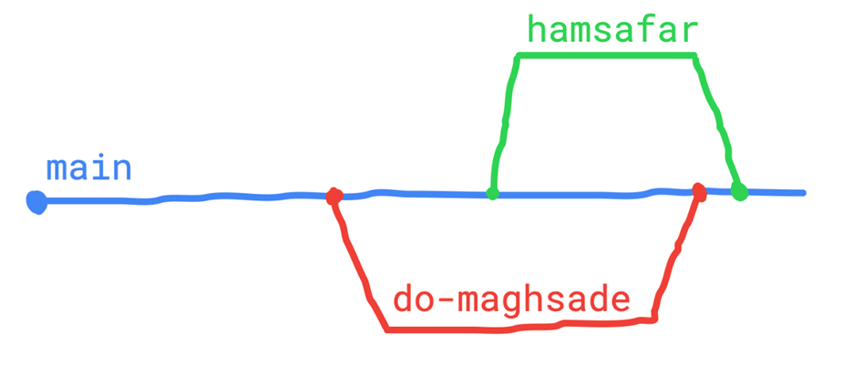

در این تصویر، می‌توانیم ببینیم که هر دو برنچ `do-maghsadeh` و `hamsafar`، از `main` گرفته شدند و بعد از این که کار آن‌ها تمام شده، روی `main` مرج شدند و تغییرات به `main` منتقل شده است.

### نمونهٔ یک ساختار خوب برای branch ها

حالا که با branch ها آشنا شدیم، بیاید یک ساختار استانداردتر را برای آن‌ها بررسی کنیم. با توجه به این که شما قراره بعضی پروژه‌های آینده‌ را روی git و به شکل گراهی پیش ببرید، خوبه که از این ساختار الهام بگیرید تا با مشکلات زیادی رو‌به‌رو نشید.

هر نرم‌افزاری، یک برنچ `main` به عنوان برنچ اصلی‌ دارد. این برنچ، عموما شامل یک نسخهٔ stable و تست شده‌ از آن نرم‌افزار است. به هیچ وجه نباید روی خط `main` ، مستقیم commit کنید! اگر قرار است تغییری در `main` داده بشه، باید یک برنچ از آن بگیرید، تغییرات را روی آن انجام دهید، روی همان برنچ تستش کنید، و وقتی که مطمئن شدید که تغییرات جدید باگی ندارند، آن‌ها را روی `main` مرج کنید:

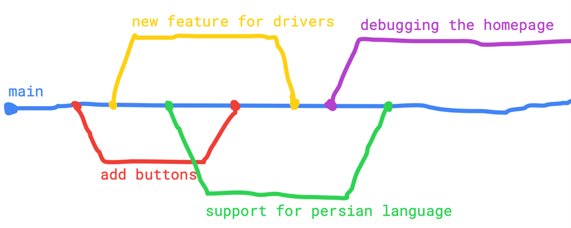

شکل بالا branch های مختلف یک اپ را نشان می‌دهد. برنچ `main`، همواره stable و تست شده‌ست. اولین برنچی که گرفتیم، برای اضافه کردن تعدادی دکمه به برنامه‌ست. این دکمه‌ها را در برنچ‌مان اضافه می‌کنیم، تست می‌کنیم، و وقتی فهمیدیم کار می‌کنند، آن‌ها را به `main` اضافه می‌کنیم. باقی برنچ‌ها هم به شکلی مشابه درست شده و بعدا توی `main` مرج می‌شوند.

حتی خیلی از شرکت‌ها، به جای این که برنچ‌ها را مستقیم روی `main` مرج کنند، روی خط دیگری مثل development می‌برند تا `main` استیبل‌تری داشته باشند. ولی شما فعلا لازم نیست این کار را بکنید.

تنها کاری که لازم است در AP و هر موقعیت دیگری انجام دهید، این است که هیچ‌وقت روی `main` کامیت نکنید! مگر اولین کامیت برنامه‌، آن هم چون هنوز برنچ دیگه‌ای در ریپو ندارید. شما فقط می‌توانید به `main` مرج کنید، حتی برای تغییرات کوچک. خیلی از شرکت‌ها، دسترسی همهٔ کارکنان غیر از یک یا دو نفر از مدیران را به `main` می‌بندند.

## مرج کردن

وقتی کارتون در یک برنچ تموم شد، می‌توانید با merge کردن آن برنچ روی برنچ‌های دیگر، تغییراتش را به آن برنچ منتقل کنید. مثال قبلی‌ و برنچ‌های `support-long` و `main` را به خاطر بیارید. اول از همه، با دستور `git branch` چک کنید که حتما در برنچ `support-long` باشید:

```bash
main  
* support-long
```

با `git log` چک کنید که commit آخر، مربوط به اضافه کردن قابلیت مرتبط با اعداد `long` بوده:

```bash
commit 3f48bc3d5c29522283dd4a8c811a72fc78feb4e8 (HEAD -> support-long)  
Author: Arman Hosseini <armanhosseini878787@gmail.com>  
Date:   Tue Feb 11 10:07:51 2025 +0330  
  
    add support for long numbers  
  
commit 97ea957914201c480912c24718e352abe42f8e72 (main)  
Author: Arman Hosseini <armanhosseini878787@gmail.com>  
Date:   Mon Feb 10 12:30:17 2025 +0330  
  
    initial commit
```

حالا برنچ `main` را checkout کنید و با استفاده از دستور زیر، برنچ `support-long` را داخل آن مرج کنید:

```bash
$ git merge support-long   
  
Updating 97ea957..3f48bc3  
Fast-forward  
 src/Main.java | 6 +++---  
 1 file changed, 3 insertions(+), 3 deletions(-)
```

حالا، در برنچ `main` دستور `git log` را بزنید:

```bash
commit 3f48bc3d5c29522283dd4a8c811a72fc78feb4e8 (HEAD -> main, support-long)  
Author: Arman Hosseini <armanhosseini878787@gmail.com>  
Date:   Tue Feb 11 10:07:51 2025 +0330  
  
    add support for long numbers  
  
commit 97ea957914201c480912c24718e352abe42f8e72  
Author: Arman Hosseini <armanhosseini878787@gmail.com>  
Date:   Mon Feb 10 12:30:17 2025 +0330
```

می‌بینید که commit مرتبط با اعداد `long` ، روی `main` هم دیده می‌شود! با دیدن فایل `Main.java`، می‌توانید چک کنید که تغییرات کدها واقعا روی برنچ `main` اعمال شدند. به این عملیات، merge کردن می‌گویند.


### حذف برنچ‌ها

اگر الآن دستور `git branch` را اجرا کنید، خروجی زیر را می‌بینید:

```bash
* main  
support-long
```

همان‌طور که می‌بینید، برنچ `support-long` اضافه‌ است و دیگر کاربردی ندارد، چون تغییراتش روی `main` مرج شده است. اگر این برنچ‌ها زیاد باشند، ممکن است دردسرساز شوند. با استفاده از دستور زیر، می‌توانید برنچ‌های قدیمی را پاک کنید:

```bash
$ git branch -d support-long  
  
Deleted branch support-long (was d5a71e9).
```

بهتر است که بعد از اتمام کار با یک برنچ، با استفاده از این دستور آن را حذف کنید تا لیست برنچ‌ها خالی بماند.

تا اینجا آموختیم که چگونه برنچ بسازیم، بین آن‌ها جابه‌جا شویم و در نهایت آن‌ها را ادغام یا حذف کنیم. اما در دنیای واقعیِ توسعه نرم‌افزار، همیشه همه چیز طبق برنامه پیش نمی‌رود. گاهی فراموش می‌کنیم در کدام برنچ هستیم، گاهی تغییراتی را اشتباهاً کامیت می‌کنیم و گاهی نیاز داریم به عقب برگردیم. در این بخش، یاد می‌گیریم که چطور مانند یک حرفه‌ای، اشتباهات را مدیریت کنیم و اجازه ندهیم مخزن کد (repository) ما دچار آشفتگی شود.

### ۱. جابه‌جایی هوشمندانه بین برنچ‌ها (نکته حیاتی)

یکی از سناریوهای پرکاربرد که اگر به آن توجه نشود می‌تواند باعث سردرگمی زیادی شود، وجود فایل‌های unstaged یا modified در هنگام تعویض برنچ است.

سناریوی خطر: فرض کنید در برنچ `feature-A` در حال تغییر فایل `Main.java` هستید اما هنوز آن را کامیت نکرده‌اید. ناگهان تصمیم می‌گیرید با دستور `git checkout` به برنچ `main` بروید. در این حالت، گیت تغییرات کامیت نشده شما را به برنچ مقصد (در اینجا `main`) منتقل می‌کند!
مشکل کجاست؟ این کار باعث می‌شود کدهای ناتمام شما در برنچی که قرار بود stable بماند ظاهر شود. اگر گیت متوجه شود که این تغییرات با کدهای برنچ مقصد تداخل جدی دارد، اصلاً اجازه جابه‌جایی نمی‌دهد و شما را متوقف می‌کند.
راهکار حرفه‌ای: همیشه قبل از جابه‌جایی بین برنچ‌ها، با `git status` وضعیت را چک کنید. اگر کارتان تمام نشده، از دستور `git stash` استفاده کنید تا تغییرات موقتاً در یک فضای امن ذخیره شوند و `Working Directory` شما پاک (Clean) شود. پس از بازگشت به برنچ اصلی، می‌توانید با `git stash pop` آن‌ها را برگردانید. یادتان باشد که هرگز با یک `Working Directory` کثیف، برنچ عوض نکنید.


### ۲. دقت در مبدأ ساخت برنچ (Branching Base)

همان‌طور که در سناریوی ممد و قلی دیدیم، برنچ‌ها از یکدیگر منشعب می‌شوند. یک نکته کلیدی که در داک‌های رسمی گیت کمتر به آن پرداخته می‌شود، `مبدأ` است.

اشتباه رایج: شما در برنچ `fix-message` هستید و ناگهان یادتان می‌افتد باید روی پارامترها هم کار کنید. همان‌جا دستور `git branch fix-parameter-name` را می‌زنید. در این حالت، برنچ دوم شما از دلِ برنچ اول بیرون می‌آید، نه از `main`! این یعنی تمام کدهای برنچ اول، در برنچ دوم هم حضور دارند.
در چنین سناریویی، `Best Practice` به این صورت است که همیشه قبل از ساخت یک برنچ جدید برای یک فیچر مجزا، ابتدا به برنچ `main` بروید، آخرین تغییرات را `pull` کنید و سپس برنچ جدید را بسازید. این کار باعث می‌شود نمودار درختی پروژه شما visualization تمیز و قابل فهم باقی بماند.

### ۳. اصلاح اشتباهات و بازگشت به عقب (Undo Changes)

گیت مانند یک ماشین زمان است. اگر اشتباهی کردید، نیازی نیست پوشه پروژه را پاک کنید و دوباره از اول کلون بگیرید!

#### اصلاح آخرین کامیت (Amend):
اگر کامیتی زدید و بلافاصله پشیمان شدید (مثلاً پیامتان غلط املایی داشت یا یک فایل را فراموش کردید)، از دستور زیر استفاده کنید:
    
```bash
$ git commit --amend -m "پیام جدید و درست"
```
این دستور کامیت قبلی را پاک کرده و این نسخه اصلاح شده را جایگزین آن می‌کند.

#### تغییر نام برنچ:
اگر نام برنچی را اشتباه انتخاب کردید، وقتی در آن برنچ هستید بزنید:
```bash
$ git branch -m <new-name>
```

#### لغو تغییرات یک فایل (Revert):
+ اگر فایلی را تغییر دادید ولی هنوز add نکردید و می‌خواهید به حالت اول برگردد:
```bash
$ git restore <file>
```

+ اگر فایل را add کردید ولی می‌خواهید از حالت آماده‌باش خارج شود:
```bash
$ git restore --staged <file>
```
+ اگر کلاً می‌خواهید یک کامیت که قبلاً ثبت شده را لغو کنید (بدون پاک کردن تاریخچه):
```bash
$ git revert <commit-hash>
```


اکنون که یاد گرفتید چطور از تداخل‌های ناخواسته جلوگیری کنید و اشتباهات کوچک را اصلاح کنید، وقت آن است که به سراغ یکی از هیجان‌انگیزترین (و گاهی ترسناک‌ترین!) بخش‌های گیت یعنی `Conflict` برویم؛ جایی که گیت نمی‌تواند به تنهایی تصمیم بگیرد و از شما کمک می‌خواهد.

## conflict ها و برطرف کردنشون

گلی و قلی را به خاطر بیارید، فرض کنید که در فرآیند کدنویسی برای فیچرهای جدید تپسی، هر دوی آن‌ها یک تکه از فایل `Main.java` را عوض کردند. حالا git باید از کجا بفهمه که کدام کد، کد درستی برای این فایل است؟ این‌جاست که گلی و قلی به conflict بر خوردند!

بیاید تا با بررسی کد مجموع ارقام، ببینیم که conflict ها چطور ایجاد می‌شوند و چطور می‌توان آن‌ها را درست کرد.


### ایجاد conflict

فرض کنید می‌خواهیم به برنامه مجموع اعداد که قبلا داشتیم، قابلیتی اضافه کنیم که در ابتدای برنامه یک پیام به کاربر نشان دهد که بداند باید چه چیزی را به عنوان ورودی وارد کند، مثلا: `"Enter a number: "` . همزمان می‌خواهیم اسم ورودی تابع `sumOfDigits` را به جای `number`، `n` بذاریم که متد کوتاه‌تری داشته باشیم. ما برای هر کدام از این کارها، یک branch از `main` می‌گیریم:

```bash
$ git branch fix-message

  
$ git branch fix-parameter-name
```

برنچ `fix-message` برای پرینت کردن پیام مناسب برای کاربر و برنچ `fix-parameter-name` برای درست کردن اسم پارامتر ورودی `sumOfDigits` است. اول بیاید قسمت پیام به کاربر را درست کنیم. برنچ مربوط به این کار را checkout کنید:

```bash
$ git checkout fix-message   
  
Switched to branch 'fix-message'
```

حالا، کد زیر را به متد `main` ، در جای مناسب اضافه کنید:

```java
System.out.println("Enter a number:");
```

تغییرات را بررسی کنید و اگر کدتان درست بود، تغییرات را `add` و commit کنید تا نهایتا، کامیتی مثل این را در log ببینید:

```bash
commit d5a71e9ec3242a27ae972896c1f267795912e90a (HEAD -> fix-message)  
Author: Arman Hosseini <armanhosseini878787@gmail.com>  
Date:   Tue Feb 11 11:52:40 2025 +0330  
  
    add input message
```

حالا، بعد از این که کارمان در این برنچ تمام شد، به برنچ `fix-parameter-name` می‌رویم:

```bash
$ git checkout fix-parameter-name

  
Switched to branch 'fix-parameter-name'
```

اگر به `Main.java` نگاه کنید، خطی که `"Enter a number:"` را چاپ می‌کرد، نمی‌بینید. حالا، اسم ورودی تابع `sumOfDigits` را عوض کنید. طبیعتا با چیزی که از درس‌نامه‌ی «IntelliJ Tools» یاد گرفتید، باید بتوانید به راحتی این کار را انجام دهید:

```java
public static int sumOfDigits(long n) {
    var sum = 0;
    while (n > 0) {  
        sum += (int)(n % 10);  
        n /= 10;  
    }

    return sum;  
}
```

تغییرات را بررسی کنید و اگر درست بودند، آن‌ها را کامیت کنید تا به کامیت زیر برسید:

```bash
commit 1f6ab68a77eaf63b4a394c49703bd36f3c81c7b1 (HEAD -> fix-parameter-name)  
Author: Arman Hosseini <armanhosseini878787@gmail.com>  
Date:   Tue Feb 11 11:57:24 2025 +0330  
  
    shorten parameter name
```

بعد از این که همهٔ تغییرات را انجام دادید، به برنچ `main` بروید:

```bash
$ git checkout main  
  
Switched to branch 'main'
```

حالا، برنچ `fix-message` را merge کنید:

```bash
$ git merge fix-message   
  
Updating 3f48bc3..d5a71e9  
Fast-forward  
 src/Main.java | 2 ++  
 1 file changed, 2 insertions(+)
```

بعد از آن، برنچ `fix-parameter-name` را merge کنید. با صفحه‌ای مثل صفحه‌ای که برای ایجاد کامنت کامیت‌ها می‌بینید، مواجه می‌شید. اگر خواستید پیام دیگری به جای `"Merge branch 'fix-parameter-name'"` بنویسیند. نهایتا، به خروجی‌ای مشابه زیر می‌رسید:

```bash
$ git merge fix-parameter-name   
  
Auto-merging src/Main.java  
Merge made by the 'ort' strategy.  
 src/Main.java | 8 ++++----  
 1 file changed, 4 insertions(+), 4 deletions(-)
```

چرا با این که در هر دو برنچ‌ فایل `Main.java` را عوض کردیم، به هیچ مشکلی نخوردیم؟ اگر `Main` را نگاه کنید، می‌بینید که به طرز جالبی هم `"Enter a number:"` در آن هست، هم اسم متغیر ورودی `sumOfDigits` کوتاه شده! فایل `Main.java` الآن به شکل زیر است:

```java
import java.util.Scanner;

public class Main {
    public static void main(String[] args) {
        var scn = new Scanner(System.in);  
  
        System.out.println("Enter a number:");
        var input = scn.nextLong();  
  
        System.out.printf("Sum of digits: %d", sumOfDigits(input));  
    }

    public static int sumOfDigits(long n) {
        var sum = 0;
        while (n > 0) {  
            sum += (int)(n % 10);  
            n /= 10;  
        }

        return sum;  
    }  
}
```

گیت در مورد merge ها، تا جایی که بتواند هوشمندانه عمل می‌کند! وقتی گیت هنگام مرج دو برنچ با هم، می‌بیند که هر دو برنچ یک فایل را تغییر داده‌اند، تلاش می‌کند تا آن‌ها را auto–merge کند. اگر به خروجی‌ای که هنگام اجرای کامند مرج `fix-parameter-name` دیدید، دقت کنید. رد پای این auto-merge را می‌بینید:

```bash
Auto-merging src/Main.java  
Merge made by the 'ort' strategy.  
 src/Main.java | 8 ++++----  
 1 file changed, 4 insertions(+), 4 deletions(-)
```

به خطوط زیر در خروجی توجه کنید:

```bash
Auto-merging src/Main.java  
Merge made by the 'ort' strategy.
```

می‌بینید که git، با استفاده از استراتژی‌ای به اسم ort، فایل `src/Main.java` را، auto-merge کرده و شما لازم نیست تا با merge این دو برنچ درگیر شوید. حالا بیاید ببینیم که آیا می‌توانیم انقدر گیت را اذیت کنیم تا بالاخره نتواند merge را انجام دهد و به conflict بخوریم؟

### ایجاد conflict واقعی

بیاید دوتا برنچ درست کنیم و در هر دوی آن‌ها، خط زیر را عوض کنیم تا ببینیم که آیا گیت می‌تواند آن‌ها را auto-merge کند یا نه:

```java
System.out.printf("Sum of digits: %d", sumOfDigits(input));
```

برنچ‌های `fix-output-1` و `fix-output-2` را از `main` بگیرید. دقت کنید که برای این کار، برنچ فعلی‌ حتما باید `main` باشد:

```bash
$ git branch fix-output-1

$ git branch fix-output-2
```

برنچ `fix-output-1` را checkout کنید و `printf` را با `println` جایگزین کنید:

```java
System.out.println("Sum of digits: " + sumOfDigits(input));
```

تغییرات را commit کنید و به برنچ `fix-output-2` برید. باید مجددا خط `printf` را به همان شکل قبلی ببینید. این بار، پیام داخل `printf` را مثل شکل زیر عوض کنید تا خروجی دقیق‌تری به کاربر نشان دهیم:

```java
System.out.printf("Sum of digits in your number: %d", sumOfDigits(input));
```

کدتان را روی این برنچ هم کامیت کنید و بعد، برای انجام مرج به `main` برید. اول، `fix-output-1` را مرج کنید:

```bash
$ git merge fix-output-1  
  
Updating 0deaf11..53bf66b  
Fast-forward  
 src/Main.java | 2 +-  
 1 file changed, 1 insertion(+), 1 deletion(-)
```

می‌بینید که تغییرات `fix-output-1` به راحتی با `main` مرج می‌شوند و متد `printf` به `println` تغییر پیدا می‌کند. حالا تلاش کنید تا `fix-output-2` را هم مرج کنید:

```bash
$ git merge fix-output-2  
  
Auto-merging src/Main.java  
CONFLICT (content): Merge conflict in src/Main.java  
Automatic merge failed; fix conflicts and then commit the result.
```

حالا می‌بینید که merge به conflict خورده و auto-merge هم ناموفق بوده. اگر الآن `git status` بزنید، با خروجی زیر مواجه می‌شوید:

```bash
$ git status  
  
On branch main  
You have unmerged paths.  
  (fix conflicts and run "git commit")  
  (use "git merge --abort" to abort the merge)  
  
Unmerged paths:  
  (use "git add <file>..." to mark resolution)  
        both modified:   src/Main.java  
  
no changes added to commit (use "git add" and/or "git commit -a")
```

می‌بینید که `src/Main.java` ، در بخش جدیدی به اسم Unmerged paths دیده می‌شود. این بخش، برای فایل‌هایی است که در عملیات مرج به conflict خوردند. همچنین اگر الآن `git log` بگیرید، می‌بینید که هیچ کدام از commit های برنچ `fix-output-2` در لاگ نیست.

شما به اولین conflict برخوردید! می‌توانید با بررسی فایل `Main.java`، این conflict را از نزدیک ببینید. این فایل الآن به این شکل در آمده:

```
import java.util.Scanner;

public class Main {
    public static void main(String[] args) {
        var scn = new Scanner(System.in);  
  
        System.out.println("Enter a number:");
        var input = scn.nextLong(); 
        
 <<<<<<< HEAD
        System.out.println("Sum of digits: " + sumOfDigits(input));  
=======  
        System.out.printf("Sum of digits in your number: %d", sumOfDigits(input));  
 >>>>>>> fix-output-2 

    }

    public static int sumOfDigits(long n) {
        var sum = 0;
        while (n > 0) {  
            sum += (int)(n % 10);  
            n /= 10;  
        }

        return sum;  
    }  
}
```

تکه‌ای که conflict داشته، همان تکهٔ عجیب وسط است:

```

 <<<<<<< HEAD  
        System.out.println("Sum of digits: " + sumOfDigits(input));  
=======  
        System.out.printf("Sum of digits in your number: %d", sumOfDigits(input));  
 >>>>>>> fix-output-2

```

گیت با تغییر این فایل و اضافه کردن چند خط text، به شما می‌گوید که این بخش از کد در `fix-output-2` به شکل زیر است:

```java
System.out.printf("Sum of digits in your number: %d", sumOfDigits(input));
```

در حالی که در `HEAD` (یا در اینجا همان `main`)، به شکل زیر است:

```java
System.out.println("Sum of digits: " + sumOfDigits(input));
```

و از شما می‌خواهد که این conflict را دستی درست کنید. خوشبختانه، این‌جا درست کردن conflict کار سختی نیست. تمام این خط‌ها را حذف کنید و با کد زیر جایگزین کنید:

```java
System.out.println("Sum of digits in your number: " + sumOfDigits(input));
```

این خط کد، هم پیام درست‌تر برنچ `fix-output-2` را دارد و هم از `println` جای `printf` استفاده می‌کند. به عبارتی، این خط نمایان‌گر تغییرات هر دو برنچ در کنار هم است. به خاطر این که merge به conflict خورد، باید بعد رفع آن‌ها، در یک commit جدا merge را کامل کنیم. دوباره `git status` بزنید:

```bash
$ git status  
  
On branch main  
You have unmerged paths.  
  (fix conflicts and run "git commit")  
  (use "git merge --abort" to abort the merge)  
  
Unmerged paths:  
  (use "git add <file>..." to mark resolution)  
        both modified:   src/Main.java  
  
no changes added to commit (use "git add" and/or "git commit -a")
```

همان‌طور که می‌بینید، `Main.java` هنوز در Unmerged paths است. حالا که conflict ها را برطرف کردیم، با `git add`، آن را stage کنید:

```bash
$ git add -A  
  
$ git status  
  
On branch main  
All conflicts fixed but you are still merging.  
  (use "git commit" to conclude merge)  
  
Changes to be committed:  
        modified:   src/Main.java
```

حالا، تغییرات خودتان را با پیام مناسب کامیت کنید. این پیام باید مثل متن زیر باشد. به طور کلی متن کامیت‌های مرتبط با merge را همیشه به این شکل می‌گذارند:

```bash
$ git commit -m "merge 'fix-output-2' into 'main'"   
  
[main 0f8ac7a] merge 'fix-output-2' into 'main'
```

اگر حالا `git log` بزنید، هم commitهای برنچ `fix-output-2` را می‌بینید، هم commit ای که برای merge کردن زدید:

```bash
commit 0f8ac7af0359825fba84562565457644013347ef (HEAD -> main)  
Merge: 53bf66b 01f5dc0  
Author: Arman Hosseini <armanhosseini878787@gmail.com>  
Date:   Tue Feb 11 14:58:45 2025 +0330  
  
    merge 'fix-output-2' into 'main'  
  
commit 01f5dc0ebd51ce196dd2a14f6e0e71b529ae55e9 (fix-output-2)  
Author: Arman Hosseini <armanhosseini878787@gmail.com>  
Date:   Tue Feb 11 12:27:31 2025 +0330  
  
    better output message
```

بررسی تغییرات

با وجود اینکه `git status`، فایل‌هایی که عوض شدند را نشان می‌دهد، ولی لازم است که قبل از commit ، این که هر فایل چه تغییری کرده را هم بدانیم. برای این کار از یکی از ابزارهای IntelliJ استفاده می‌کنیم.

یک برنچ جدید به اسم `product-of-digits` درست کنید و روی آن checkout کنید. اگر می‌خواهید بعد از ساختن یک برنچ درجا checkout کنید، می‌توانید به جای دو دستور زیر:

```bash
$ git branch product-of-digits
  
$ git checkout product-of-digits
```

از دستور زیر استفاده کنید تا هر دو کار، همزمان انجام شوند:

```bash
$ git checkout -b product-of-digits
```

در این برنچ، می‌خواهیم برنامه‌ را طوری عوض کنیم تا به جای مجموع ارقام، ضرب آن‌ها را نشان دهد. برای این کار، برنامه‌ را به شکل زیر تغییر بدید:

```java
import java.util.Scanner;

public class Main {
    public static void main(String[] args) {
        var scn = new Scanner(System.in);  
  
        System.out.println("Enter a number:");
        var input = scn.nextLong();  
  
        System.out.println("Product of digits in your number: " + productOfDigits(input));  
    }

    public static int sumOfDigits(long n) {
        var sum = 0;
        while (n > 0) {  
            sum += (int)(n % 10);  
            n /= 10;  
        }

        return sum;  
    }

    public static int productOfDigits(long n) {
        if (n == 0) {
            return 0;  
        }

        var product = 1;
        while (n > 0) {  
            product *= (int)(n % 10);  
            n /= 10;  
        }

        return product;  
    }  
}
```

در کد جدید، علاوه بر متد `sumOfDigits` ، متدی به اسم `productOfDigits` هم داریم که حاصل ضرب ارقام عدد `n` را برمی‌گرداند. کد جدید را تست کنید. اگر درست کار کرد، با `git add` تغییرات را stage کنید. برای دیدن تغییرات، به بخش commit در IntelliJ بروید:

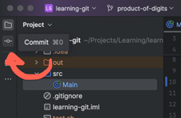

با باز کردن این بخش، پنلی که IntelliJ برای commit کردن کدها به شما می‌دهد را می‌بینید:

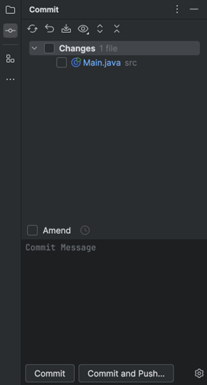

اینتلی‌جی به عنوان یک IDE ی خیلی خوب، خیلی از امکانات گیت را بدون استفاده از shell در اختیار شما می‌گذارد. در یک داک دیگر، بعضی از آن‌ها را بررسی می‌کنیم تا ببینید که چطور می‌توان با آن‌ها کار کرد.

در پنلی که باز شد، روی `Main.java` کلیک کنید تا صفحهٔ زیر را ببینید:

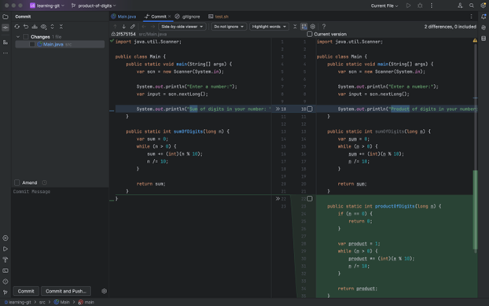

می‌بینید که IntelliJ به خوبی تغییرات را قبل از کامیت، نشان می‌دهد. کدهایی که اضافه کردید یا تغییر دادید، دقیقا مشخص هستند. بعد از بررسی کدها، می‌توانید در بخش Commit Message یک پیام برای کامیتتون بنویسید، فایل‌هایی که می‌خواهید commit کنید را مشخص کنید و بعد با زدن دکمهٔ Commit، آن‌ها را کامیت کنید:

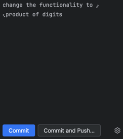

این کار در shell با دستور `git diff` انجام می‌شود اما خروجی‌ آن به اندازهٔ IntelliJ تمیز نیست. اگر خواستید می‌توانید راجع بهش بخونید و یاد بگیرید، منابع لازم را در بخش «منابع بیشتر» انتهای این داک قرار دادیم.

## آشنایی با remote branchها

اگر یادتان باشد، یکی از مهم‌ترین چیزهایی که در مورد گیت گفتیم، این بود که شما و همکارهای شما، می‌توانید روی یک پروژه به شکل تیمی کار کنید، ولی تا حالا هر کاری کردید، فقط و فقط روی لپ‌تاپ خودتان بوده. به ریپویی که روی لپ‌تاپ شما باشد، ریپوی محلی یا local می‌گویند.

منطقا شما نمی‌توانید کد یک پروژهٔ بزرگ را، از یک ریپوی رندوم لپ‌تاپ‌تان کنترل کنید! این‌جاست که مفهوم ریپوی remote مطرح می‌شود؛ یک ریپو روی سرارهای شرکت، که کدهای پروژه را روی آن نگه می‌دارند تا همهٔ توسعه‌دهنده‌ها بتوانند به آن دسترسی پیدا کنند.

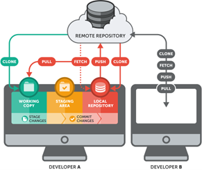

در این بخش بررسی می‌کنیم که چطور می‌توانید طریق یک ریپوی remote درست کنید و یک پروژه را به آن وصل کنید.

### GitHub

[گیت‌هاب](https://github.com/) پلتفرمی برای به اشتراک گذاشتن کدهایی است که از ‌git استفاده می‌کنند. میلیون‌ها برنامه‌نویس کدهای خودشان را آنجا به صورت متن‌باز (Open Source) به اشتراک می‌گذارند تا برنامه‌نویس‌های دیگر بتوانند از آن کد‌ها استفاده کنند و آن پروژه را توسعه دهند. شما باید از داک tools که در جلسهٔ صفر منتشر شد، یک اکانت GitHub درست کرده باشید، اگر نکردید به این داک برگردید و اکانت بسازید و در اکانتتان لاگین کنید.

در مرحله بعد باید یک مخزن یا repository برای پروژه خودتان بسازید. از طریق زدن علامت + بالای صفحه، New repository را انتخاب کنید:

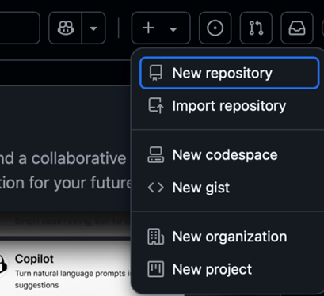

حالا باید مشخصات repository را وارد کنید. اسم آن را `git-sample` بذارید، می‌توانید یک توضیح کوتاه هم درباره پروژه‌ در قسمت Description بنویسید:

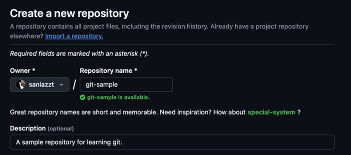

ریپوی شما می‌تواند public یا private باشد. اگر public باشد همه می‌توانند آن را ببینند و اگر private باشد فقط افرادی که شما مشخص می‌کنید، می‌توانند ببینند. البته در هر دو حالت، شما تعیین می‌کنید که چه کسی می‌تواند ریپو را عوض کند. فعلا نوع repository را private بگذارید:


امکان اضافه کردن فایل `README` برای توضیحات بیشتر، فایل `.gitignore` (که قبلا با آن آشنا شدیم) و License که مجوز استفاده از کد شماست هم در این مرحله وجود دارد، اما فعلا با این بخش‌ها کاری نداریم. تیک‌ آن‌ها را بردارید و روی none بگذارید. حالا روی دکمه سبز Create repository در پایین صفحه کلیک کنید.

حالا شما اولین repository گیت‌هاب خودتان را ساختید:

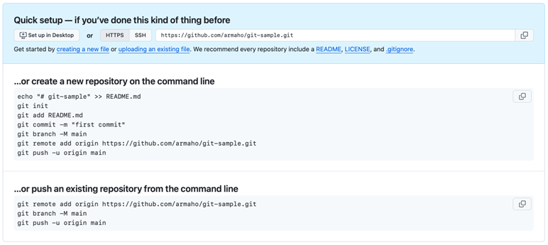

## Push کردن تغییرات به GitHub

از بخش زیر، با زدن دکمهٔ مشخص شده، لینک repo گیت‌هاب را کپی کنید (حواستان باشد که لینک `HTTPS` را کپی کنید نه `SSH`):

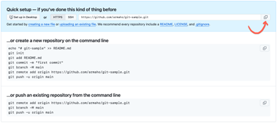

به پروژهٔ `learning-git` که در IntelliJ توسعه داده بودیم برگردید. حالا می‌خواهیم کدهایی که در آن زدیم را به github ببریم. دستور زیر را در ترمینال‌ اجرا کنید و به جای `[url]`، لینکی که کپی کردید را قرار دهید:

```bash
$ git remote add origin [url]
```

دستورات git remote، دستورات مرتبط با repo ی ریموت پروژهٔ شما هستند. در دستور بالا، ما از git خواستیم که یک ریپوی remote جدید، به اسم origin و با یک لینک مشخص، به ریپوی شما اضافه کند تا بتوانید تغییراتتان را به آن اضافه کنید. با دستور زیر می‌توانید لیست ریپوهای ریموت را ببینید:

```bash
$ git remote -v

origin https://github.com/saniazzt/git-sample (fetch)  
origin https://github.com/saniazzt/git-sample (push)
```

حالا از هر برنچی که هستید با دستور زیر به برنچ `main` برگردید:

```bash
$ git checkout main
```

و با زدن دستور `git status` مطمئن شوید که تغییری روی برنچ `main` ندارید. حالا با دستور `push` تمام commit ها و فایل‌ها را از روی برنچ `main` به `origin` منتقل کنید. در این مرحله باید یوزرنیم و پسورد گیت‌هابتان را بعد از زدن دستور زیر وارد کنید:

```bash
$ git push origin main
```

به خطا خوردید!

```bash
remote: Support for password authentication was removed on August 13, 2021.  
remote: Please see https://docs.github.com/get-started/getting-started-with-git/about-remote-repositories#cloning-with-https-urls for information on currently recommended modes of authentication.  
fatal: Authentication failed for 'https://github.com/armaho/git-sample.git/'
```

###  درست کردن یک access token

بیاید متن خطا را با هم بخونیم. متن خطا به ما می‌گوید که ریموت شما، یعنی گیت‌هاب، از ۱۳ آگوست ۲۰۲۱ اجازهٔ استفاده از پسورد برای کارهایی مثل push یا pull کردن را به شما نمی‌دهد و به همین دلیل، authentication موفق نبوده. [یک لینک](https://docs.github.com/get-started/getting-started-with-git/about-remote-repositories#cloning-with-https-urls) هم قرار داده که می‌توانید شیوه‌های مختلف authentication گیت‌هاب را آن‌جا ببینید. اگر به این لینک بروید، متن زیر را می‌بینید:

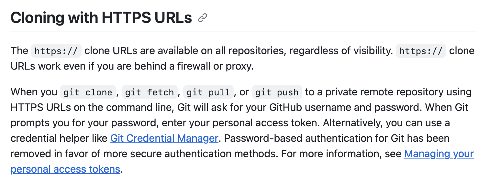

این متن به شما می‌گوید که:  
```
"When Git prompt you for your password, enter your personal access token"  
```
ولی شما personal access token ای ندارید. در ادامه نوشته:  
```
"For more Information, see Managing your personal access tokens"
```
روی آن کلیک کنید تا به یک صفحهٔ جدید بروید که به شما یاد می‌دهد چطور token بسازید.

راهنمای بخش Creating a personal access token (classic) را دنبال کنید. در این بخش scope ، همهٔ تیک‌ها را بزنید تا این توکن به همه چیز دسترسی داشته باشد. متنی که نهایتا کپی می‌کنید، همان access token ای است که باید به جای پسورد وارد کنید. حتما آن را ذخیره کنید چون دوباره نشان داده نمی‌شود.

دوباره دستور زیر را اجرا کنید و این بار به جای پسورد، access token را وارد کنید:

```bash
$ git push origin main

Username for 'https://github.com': armanhosseini878787@gmail.com  
Password for 'https://armanhosseini878787@gmail.com@github.com':   
Enumerating objects: 34, done.  
Counting objects: 100% (34/34), done.  
Delta compression using up to 8 threads  
Compressing objects: 100% (26/26), done.  
Writing objects: 100% (34/34), 2.99 KiB | 340.00 KiB/s, done.  
Total 34 (delta 16), reused 0 (delta 0), pack-reused 0  
remote: Resolving deltas: 100% (16/16), done.  
To https://github.com/armaho/git-sample.git  
 * [new branch]      main -> main
```

حالا ریپو را در گیت‌هاب رفرش کنید:

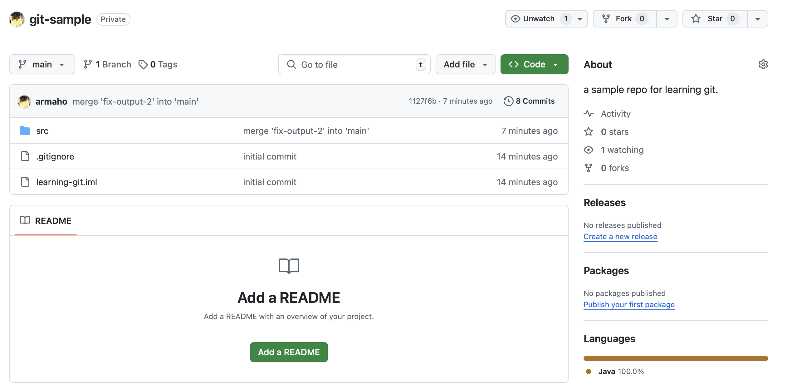

کدتون الآن فقط روی کامپیوترتون نیست، بلکه یک کپی از آن، برای هر کس دیگری، در یک remote repo روی گیت‌هاب هم وجود دارد. روی commits کلیک کنید:

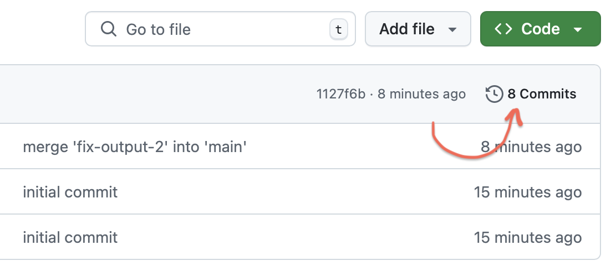

تمام تاریخچهٔ ریپو این‌جا مشخص است:

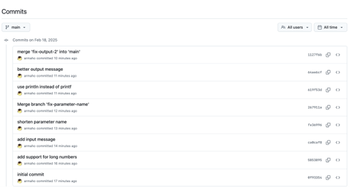

اگر روی یکی از کامیت‌ها کلیک کنید، می‌توانید تغییراتی که در کد داده هم ببینید:

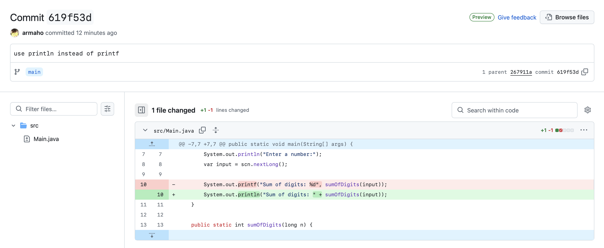

اگر بیشتر دقت کنید، می‌بیند که ریپوی remote ، حتی برنچ‌هایی مثل `main` را هم در خودش دارد. این یعنی می‌توانید در آینده، باقی branch ها را هم به این ریپو بفرستید:

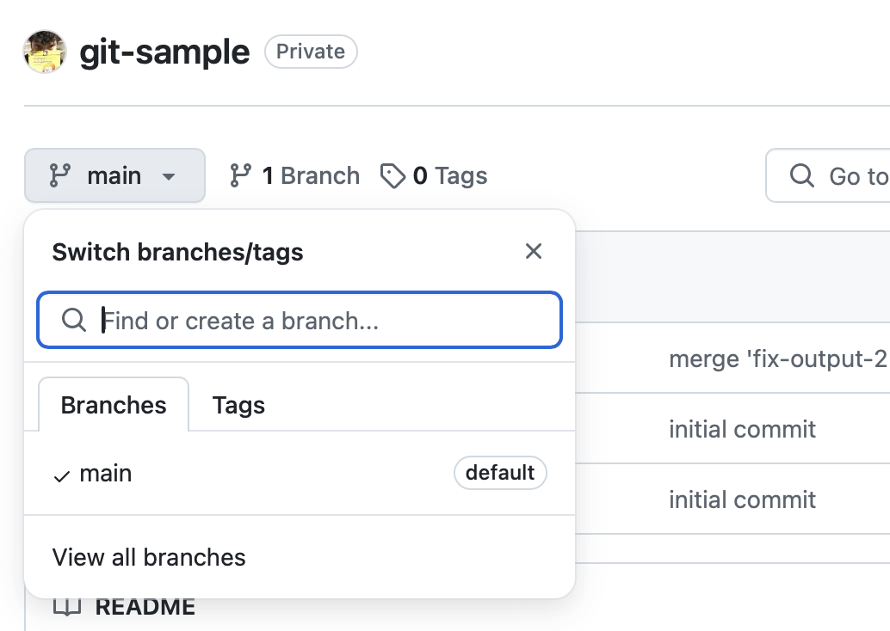

عموماً متن‌های خطا و داکیومنتیشن‌های گیت خیلی کامل هستند. خوبه که وقتی به خطایی می‌خورید و چیزی خراب می‌شود، حتماً متن خطا را کامل بخونید. همون‌طور که دیدید این‌جا، ما صرفاً با خوندن متن خطا، توانستیم مشکل personal access token ها را برطرف کنیم.

## دستور `fetch` و `clone`

بیاید این بار به جای این که یک ریپوی local درست کنیم و بعد از روی آن، ریپوی remote را بسازیم، از روی ریپوی remote، ریپوی local را ایجاد کنیم. کنار دایرکتوری `learning-git` ، که برای پروژهٔ جاوا ساختید، یک دایرکتوری دیگر به اسم `learning-fetch` درست کنید. حالا shell را باز کنید و با استفاده از cd، به این دایرکتوری جدید برید.

وقتی که مسیر shell را تنظیم کردید، دستور `git init` را وارد کنید تا یک ریپوی خالی ایجاد شود:

```bash
$ git init

Initialized empty Git repository in /Users/armaho/Projects/Learning/learning-fetch/.git/
```

به ریپوی جدید، یک ریپوی remote به اسم origin اضافه کنید که `url` آن، `url` ریپوی گیت‌هاب باشد:

```bash
$ git remote add origin [url]
```

دستور `fetch` را اجرا کنید. با اجرای این دستور branch های جدید، tag ها، ref ها و باقی چیزهای ریپوی origin (که همان ریپوی گیت‌هاب شماست) گرفته می‌شود. با این دستور در ادامه بیشتر کار می‌کنید:

```bash
$ git fetch origin main
```

حالا دایرکتوری `learning-fetch` را باز کنید. با یک فولدر خالی مواجه می‌شوید!

نکته اینجاست که ریپوی local شما بعد از دستور `fetch` آپدیت نمی‌شود. برای آپدیت شدن و ادغام کردن کد‌های remote با کدهای local باید دستور `merge` زیر را وارد کنید. این دستور، برنچ `main` ای که در ریپوی origin هست را با `main` ریپوی local شما merge می‌کند:

```bash
$ git merge origin/main
```

حالا دوباره به فولدر برگردید، بالاخره می‌بینید که فایل‌ها اضافه شدند:

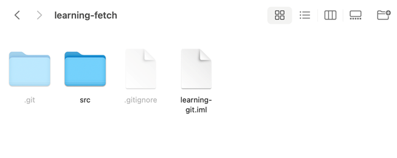

### یک کار راحت‌تر

کارهای بالا سخت و پیچیده بودند. مثلا نحوه کار `fetch` یا مرج!

برای این که دیگر لازم نباشد این کارها را بکنید، با استفاده از دستور `cd` ، به دایرکتوری پدر `learning-fetch` بروید (دایرکتوری پدر `learning-fetch` ، همان دایرکتوری‌ای است که ما `learning-fetch` را داخلش ساختیم). سپس دستور زیر را اجرا کنید و طبق معمول، به جای `[url]`، آدرس ریپوی remote را قرار دهید:

```bash
$ git clone [url]

Cloning into 'git-sample'...

remote: Enumerating objects: 34, done.

remote: Counting objects: 100% (34/34), done.

remote: Compressing objects: 100% (10/10), done.

remote: Total 34 (delta 16), reused 34 (delta 16), pack-reused 0 (from 0)

Receiving objects: 100% (34/34), done.

Resolving deltas: 100% (16/16), done.
```

می‌بینید که یک دایرکتوری جدید هم اسم ریپوی گیت‌هابتون ایجاد شد. اگر داخل آن را ببینید، شامل تمام فایل‌هایی است که در ریپو درست کرده بودید و دیگر لازم نیست چند دستور برای دریافت یک repo بنویسید.

## دستور `push`

### آماده‌سازی

الآن شما دو دایرکتوری دارید: یکی `learning-git` ، که از اول درست کرده بودید و با آن کار می‌کردید، و دومی `git-sample` ، که از ریپوی remote در بخش قبل کلون کردید. حالا می‌خواهیم شما، خودتان را به جای دوتا از اعضای یک تیم برنامه‌نویسی، جک و تایلر بذارید.


لطفا با استفاده از intelliJ، اسم پروژهٔ `learning-git` را به `jack` و اسم دایرکتوری `git-sample` را به `tyler` تغییر دهید تا بتوانید این دو دایرکتوری را راحت‌تر از هم تشخیص دهید:

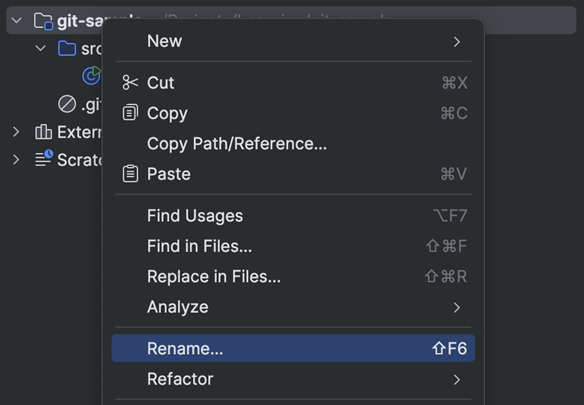

حتما این کار را با IntelliJ انجام بدید، وگرنه ممکن است IntelliJ پروژه‌ را به اسم‌های قدیمی بشناسد. IntelliJ فقط اسم پروژه‌ها را عوض می‌کند و لازم است خودتان دستی اسم دایرکتوری‌های `learning-git` و `git-sample` را هم به `jack` و `tyler` عوض کنید:

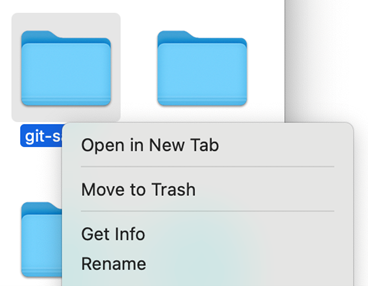

نهایتا IntelliJ را ببندید. لطفا دوتا صفحهٔ IntelliJ برای این دو پروژه کنار هم باز کنید؛ یکی برای پروژهٔ `learning-git` و دیگری برای `git-sample` . در هر دو هم shell داخلی IntelliJ را باز کنید:

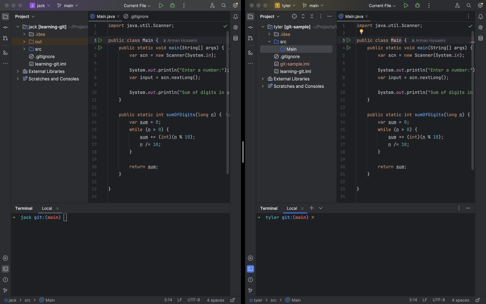

### آشنایی با push

اگر دقت کنید، در کد متد `productOfDigits` وجود ندارد. علتش آن است که ما هیچ وقت، برنچ `product-of-digits` را توی `main` مرج نکردیم و تغییرات آن هیچ‌گاه به `main` نیامد. ولی شما می‌توانید این برنچ را، همچنان در ریپوی `jack` ببینید:

```bash
fix-message  
fix-output-1  
fix-output-2  
fix-parameter-name  
* main  
product-of-digits
```

با استفاده از دستور زیر، این برنچ را به ریپوی remote اضافه کنید:

```bash
$ git push origin product-of-digits   
  
Enumerating objects: 7, done.  
Counting objects: 100% (7/7), done.  
Delta compression using up to 8 threads  
Compressing objects: 100% (3/3), done.  
Writing objects: 100% (4/4), 471 bytes | 471.00 KiB/s, done.  
Total 4 (delta 1), reused 0 (delta 0), pack-reused 0  
remote: Resolving deltas: 100% (1/1), completed with 1 local object.  
remote:   
remote: Create a pull request for 'product-of-digits' on GitHub by visiting:  
remote:      https://github.com/armaho/git-sample/pull/new/product-of-digits  
remote:   
To https://github.com/armaho/git-sample.git  
 * [new branch]      product-of-digits -> product-of-digits
```

به ریپوی remote روی گیت‌هاب بروید. الآن می‌تونید `product-of-digits` هم در لیست برنچ‌ها ببینید:

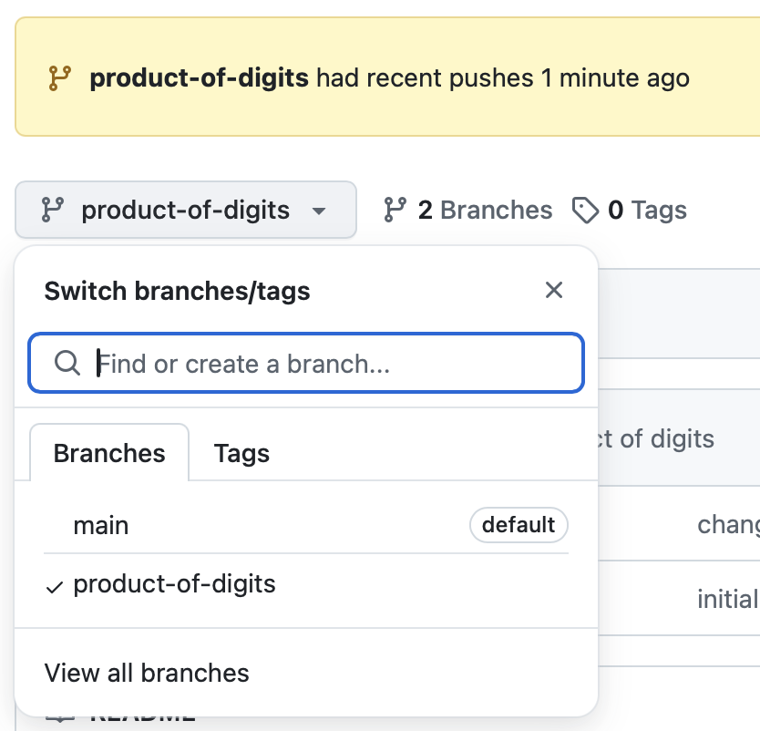

برنامهٔ شما هنوز یک مشکل دارد، آن هم این که `productOfDigits` به ازای `n` های منفی، خروجی غلطی نشان می‌دهد:

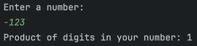

برای تصحیح آن، کد `productOfDigits` را در ریپوی جک به کد زیر تغییر دهید:

```java
public static int productOfDigits(long n) {
    if (n == 0) {
        return 0;  
    }

    if (n < 0) {  
        n = -1 * n;  
    }

    var product = 1;
    while (n > 0) {  
        product *= (int)(n % 10);  
        n /= 10;  
    }

    return product;  
}
```

حالا، تغییرات جدید را commit کنید. سپس دوباره با دستور زیر، تغییرات را push کنید:

```bash
$ git push origin product-of-digits
```

حالا، می‌توانید تغییرات جدید را هم روی برنچ `product-of-digits` در github ببینید.

### دریافت تغییرات برنج در ریپوی `tyler`

حالا به ریپوی `tyler` بروید و آن‌جا `git branch` بزنید. می‌بینید که در ریپوی `tyler`، هنوز فقط یک برنچ `main` وجود دارد:

```bash
* main
```

تایلر چطور می‌تواند در ریپوی `local` خودش، تغییرات جک را روی برنچ `product-of-digits` ببیند و بررسی کند؟ برای این کار، اول در ریپوی تایلر `git fetch` بزنید:

```bash
$ git fetch  
  
remote: Enumerating objects: 11, done.  
remote: Counting objects: 100% (11/11), done.  
remote: Compressing objects: 100% (4/4), done.  
remote: Total 8 (delta 2), reused 8 (delta 2), pack-reused 0 (from 0)  
Unpacking objects: 100% (8/8), 796 bytes | 79.00 KiB/s, done.  
From https://github.com/armaho/git-sample  
 * [new branch]      product-of-digits -> origin/product-of-digits
```

در خروجی می‌بینید که یک برنچ جدید، به اسم `product-of-digits` در ریپوی تایلر ایجاد شد، که معادل `origin/product-of-digits` است. اگر الآن، در ریپوی تایلر `product-of-digits` را checkout کنید، تغییرات جک را آن‌جا می‌بینید.

## ایجاد pull request

همان‌طور که گفتیم، شما هیچوقت نباید روی برنچ `main` کامیت کنید. بعضی از شرکت‌ها، حتی دسترسی push کردن روی `main` هم فقط به یک یا دو نفر از ادمین‌ها می‌دهند. علت این است که در یک پروژه برنچ main، عموما خطی است که کد نهایی و تست شده روی آن قرار می‌گیرد. به خاطر همین همهٔ تغییرات باید قبل از این که روی برنچ `main` براند، بررسی شوند.

یکی از راه‌هایی که می‌شود به این بررسی‌ها نظم داد، این است که برای درخواست‌های merge به خط `main`، باید pull request ثبت کرد. بعدها یکی از کسانی که در شرکت دسترسی دارد، این pull request را review می‌کند و اگر به نظرش بدون مشکل بود، اجازهٔ ادغام آن برنچ به `main` را می‌دهد.

برای این که در مثال قبلی، `product-of-digits` را داخل `main` مرج کنیم، می‌توانیم از یک pull request استفاده کنیم. برای این کار به ریپو github بروید و آن را رای برنچ `product-of-digits` ست بکنید:

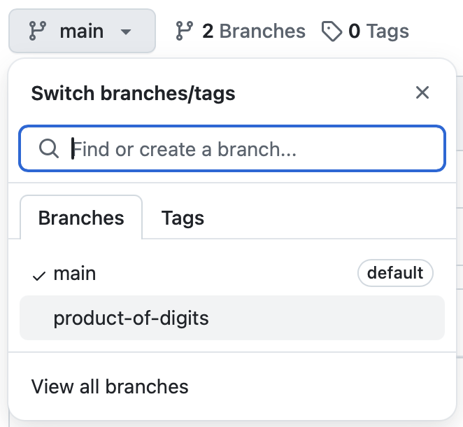

در بخش contribute، گزینهٔ open pull request را بزنید:

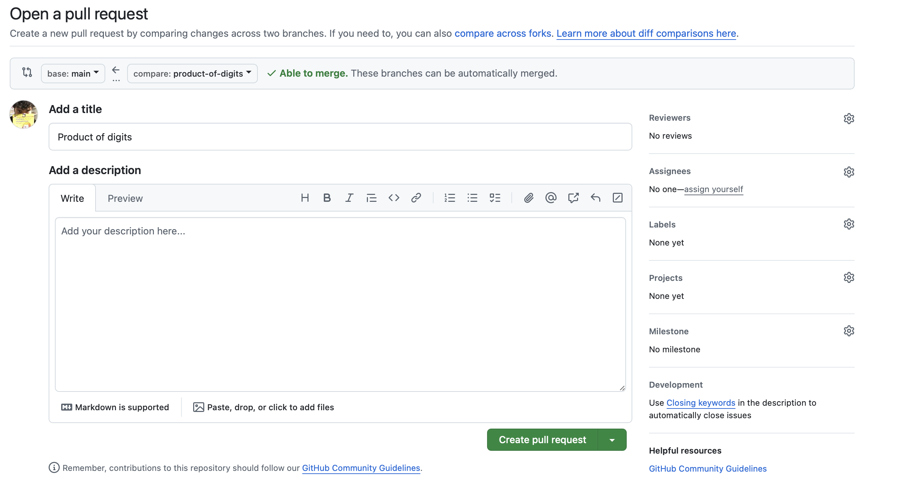

این‌جا، می‌توانید یک اسم و توضیحات مناسب برای pull request انتخاب کنید. در یک شرکت بزرگ، از سمت راست می‌توانید reviewer ها (مثلا رئیس)، assignees (مثلا همکارها) و سایر چیزها را هم انتخاب کنید. نهایتا، دکمهٔ Create pull request را بزنید:

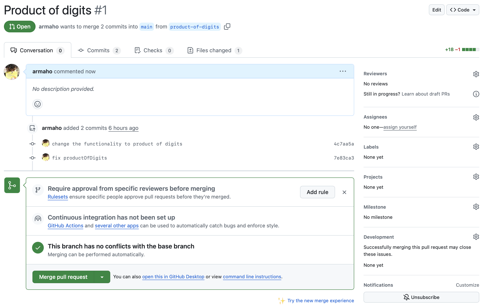

در این صفحه، یک سر به تب‌های commits و files changed بزنید، چه چیزایی می‌بینید؟

بعد از بررسی تغییرات، دکمهٔ Merge pull request را بزنید و مرج را با کامنتی مناسب تایید کنید. بعد از این کار، اولین pull request را انجام دادید و تغییرات توی `main` مرج شدند. چون برنچ `product-of-digits` دیگه به درد نمی‌خورد، گیت‌هاب پیشنهاد می‌دهد که آن را پاک کنید:

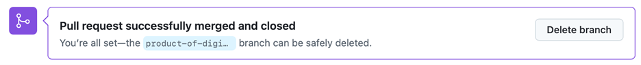

حالا اگر در گیت‌هاب به برنچ `main` بروید، می‌بینید که تغییرات جدید در آن اعمال شده‌اند.

## دستور pull

به دو صفحهٔ IntelliJ که کنار هم قرار دادید برگردید و خودتان را جای `jack` بگذارید. برنچ `main` را checkout کنید. می‌بینید که `main` هنوز قدیمی است و تغییرات برنچ `product-of-digits` را ندارد. چطور می‌توانید آن را آپدیت کنید و تغییرات برنچ `main` توی origin را بگیرید؟

شما با استفاده از `git pull`، می‌توانید دقیقا همین‌کار را بکنید! این دستور ظاهرش شبیه دستور `push` است. آن را اجرا کنید:

```bash
$ git pull origin main  
  
From https://github.com/armaho/git-sample  
 * branch            main       -> FETCH_HEAD  
Updating 260148f..a610e32  
Fast-forward  
 src/Main.java | 19 ++++++++++++++++++-  
 1 file changed, 18 insertions(+), 1 deletion(-)
```

بعدش فایل `Main.java` را چک کنید تا ببینید که آپدیت شده است.

یک خطای رایج

حالا، به intelliJای که برای تایلر درست کرده بودید بروید. الآن، به عنوان تایلر، خط زیر را در جای مناسبی از برنامه‌ اضافه کنید تا قبل شروع کار، به کاربر سلام کند:

```java
System.out.println("Hello there!");
```

تغییرات را روی `main` کامیت کنید (شما می‌دونید که نباید این کار را بکنید!). بعد از این کار، تلاش کنید تا با استفاده از دستور `pull`، تغییرات برنچ `main` را در `origin` دریافت کنید:

```bash
$ git pull origin main  
  
From https://github.com/armaho/git-sample  
 * branch            main       -> FETCH_HEAD  
hint: You have divergent branches and need to specify how to reconcile them.  
hint: You can do so by running one of the following commands sometime before  
hint: your next pull:  
hint:  
hint:   git config pull.rebase false  # merge  
hint:   git config pull.rebase true   # rebase  
hint:   git config pull.ff only       # fast-forward only  
hint:  
hint: You can replace "git config" with "git config --global" to set a default  
hint: preference for all repositories. You can also pass --rebase, --no-rebase,  
hint: or --ff-only on the command line to override the configured default per  
hint: invocation.  
fatal: Need to specify how to reconcile divergent branches.
```

می‌بینید که نمی‌شود این کار را کرد و از `fatal` ای که ته خروجی می‌بینید، می‌توان فهمید که خطا خوردید! بیاید مثل همیشه، با هم متن خطا را بخونیم. گیت به شما می‌گوید که:

```
"You have divergent branches…"
```

منظور این است که برنچ `main` ای که در ریپوی `local` تایلر است، یک سری کامیت جدید دارد و برنچ `main` ای که توی `origin` هست هم یک سری کامیت جدید برای خودش دارد، به همین خاطر این دو برنچ divergent (واگرا) شدند و گیت نمی‌داند که کدام `main` ، درست است.

در ادامه بهتون می‌گوید که:

```
"… and need to specify how to reconcile them. You can do so by running one of the following commands sometime before your next pull "
```

گیت می‌خواهد که یک شیوه برایش مشخص کنید که بداند چطور باید با برنچ‌های divergent برخورد کند. در ادامه تعدادی دستور می‌دهد که با اجرا کردن آن‌ها، می‌توانید این شیوه را مشخص کنید. اگر دقت کنید، دستور اول به گیت می‌گوید که تلاش کند تا دو برنچ divergent را merge کند:

```bash
$ git config pull.rebase false # merge
```

شما هم با اجرای این دستور، این شیوه را برای گیت مشخص کنید. در `pull` بعدی، می‌توانید ببینید که گیت، تغییرات برنچ‌های `main` تایلر و `origin/main` را مرج می‌کند. `pull` کنید تا این موفقیت را ببینید. دقت کنید که چون شما برای `pull` کردن، برنچ `origin/main` و `main` را مرج می‌کنید، ممکن است که به merge conflict بخورید و مجبور بشید مثل قبل آن‌ها را برطرف کنید.

## منابع بیشتر

اگر هر جایی از مباحثی که در این داک گفته شد را به خوبی متوجه نشدید، می‌توانید از منبعی که خیلی‌ها با آن git را یاد گرفتند، یعنی [دورهٔ جادی در فرادرس](https://faradars.org/courses/fvgit9609-git-github-gitlab) آن را دوباره بخونید.


همچنین، اگر می‌خواهید بیشتر یاد بگیرید، می‌توانید یک نگاه به [داک رسمی گیت](https://git-scm.com/doc) بندازید!

## چه چیزی یاد گرفتیم؟

ما در این داک، به شما یاد دادیم که چطور می‌توانید از گیت استفاده کنید. این مهارت، هم در کار‌ آینده‌تون و هم در ادامهٔ دانشگاه‌ خیلی به کار می‌آید، چون حدودا همهٔ شرکت‌ها از git برای هماهنگ کردن پروژه‌ها استفاده می‌کنند. شما یاد گرفتید که:

- گیت چیست، و Version Control چه کاربردی دارد.
- دستورهایی مثل stage و commit کردن یعنی چه و چطور می‌توانید با آن‌ها کار کنید.
- برنچ‌ها چی هستند و کجا کاربرد دارند.
- مرج کردن چیست و چطور می‌توان conflict ها را رفع کرد.
- چطور می‌توان با یک remote repository کار کرد.

کار کردن با گیت، در ابتدا ممکن است برای شما پر فروز و نشیب باشد. حتما در مورد مشکلاتی که دارید در گوگل سرچ کنید، از تدریس‌یارها بپرسید یا از ChatGPT بخواهید که مشکل را توضیح دهد.
