## مقدمه

برای کاربردی‌تر کردن برنامه‌های جاوایتان، نیاز است با GUI آشنا بشوید. GUI که مخفف Graphical User Interface (رابط گرافیکی کاربر) است، در واقع همان پنجره‌ها و عناصر گرافیکی‌ است که توی سیستم عامل‌های مختلف برای راحت‌تر شدن کار با برنامه‌ها استفاده می‌شود. چیزهایی مثل دکمه‌ها، برچسب‌ها، جدول‌ها، فرم‌ها، فیلدهای ورودی، تصاویر و کلی عناصر دیگر که باعث راحت‌تر شدن تعامل با برنامه می‌شوند.

با استفاده از GUI در برنامه‌تان، کاربر می‌تواند بدون نیاز به نوشتن کد یا وارد کردن دستی اطلاعات، فقط با یک کلیک، عملیات مورد نظرش را انجام بدهد.

جاوا برای ساخت برنامه‌های گرافیکی، اول پکیج `AWT` و بعد پکیج `Swing` را معرفی کرد. این دو، کلی شباهت و مقداری تفاوت با هم دارند. در ادامه، اول نگاه کوتاهی به مفاهیم اشیا و کلاس‌ها می‌اندازیم و سپس هم بخش‌های مهم `Swing` و `AWT` را با هم یاد می‌گیریم.

## اولین برنامه گرافیکی خود را بنویسید

کد زیر را در تابع main قرار دهید. فعلاً نگران جزئیات کد نباشید و خودتان را گیج نکنید. به زودی قسمت‌به‌قسمت آن را توضیح خواهیم داد. :)

```java
public class Main{    
   public static void main(String[] args) {  
      JFrame frame = new JFrame("Hello, java");  
      frame.setSize(300, 150);  
      JLabel label = new JLabel("Hello, Java!", JLabel.CENTER);  
      frame.add(label);  
      frame.setVisible(true);
   }
```

کد بالا را ران کنید. با همچین خروجی‌ای مواجه خواهید شد:

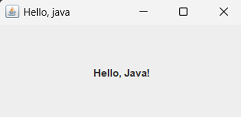

### کلاس‌ها و آبجکت‌های برنامه Hello Java

حالا می‌خوهایم کدی که زده‌ایم را بررسی کنیم:

```java
JFrame frame = new JFrame("Hello, java");
```

`JFrame` اسم کلاسی از پکیج سویینگ است که یک پنجره گرافیکی را نشان می‌دهد که بقیه‌ی عناصر گرافیکی روی آن سوار می‌شوند. اینجا یک کلاس از این آبجکت ساختیم و اسم آن را frame گذاشتیم. ورودی (استرینگِ `"Hello, Java"` ) مشخص می‌کند که چه عنوانی برای پنجره‌ی ما قرار بگیرد. خودتان امتحان کنید و ببینید که وقتی به این بخش ورودی ندهید، پنجره‌تان نیز تایتل ندارد. :)

```java
frame.setSize(300, 150);
```

متد `setSize()` توی کلاس `JFrame` تعریف شده است و برای هر آبجکتی که آن را فراخوانی می‌کند، بسته به ورودی‌ای که به آن داده می‌شود، ابعاد فریم (همان پنجره) را مشخص می‌کند. (ورودی‌ها به ترتیب از چپ، طول و عرض را بر حسب پیکسل مشخص می‌کنند).

```java
JLabel label = new JLabel("Hello, Java!", JLabel.CENTER);
```

JLabel مثل یک برچسب فیزیکی می‌ماند. آبجکت ساخته‌شده از این کلاس، متن مورد نظرمان را در بخش مشخصی از فریم (در این مثال، به خاطر استفاده از CENTER، در مرکز) قرار می‌دهد. در اینجا از یک مفهوم کاملاً شیء‌گرا استفاده کردیم، چون از یک آبجکت برای قرار دادن متنمان استفاده کردیم به جای اینکه خیلی ساده، یک متد را روی آبجکت frame فراخوانی کنیم تا متن را بنویسد. به این ترتیب یک ماهیت جداگانه به متنمان دادیم تا بتواند ویژگی‌های مستقل خود را داشته باشد.
بعد با فراخوانی متد `add()` روی آبجکت `frame`، لیبل خود را به فریم اضافه کردیم:

```java
frame.add(label);
```

در مرحله آخر هم، فریممان و اجزای داخلش که کامل شده‌اند را نمایش دادیم:

```java
frame.setVisible(true);
```


## آشنایی با AWT و Swing

کلاس‌های AWT امکانات زیادی را در اختیار برنامه‌نویس‌ها قرار می‌دهند، اما یک نقطه‌ضعف بزرگ دارند؛ و آن این است که ظاهر برنامه‌هایی که با AWT طراحی می‌شوند، روی پلتفرم‌ها یا سیستم‌عامل‌های مختلف می‌تواند تا حدی متفاوت باشد. علاوه بر این، نحوه‌ی تعامل کاربر با برنامه‌هایی که با AWT ساخته می‌شوند، در سیستم‌عامل‌های مختلف ممکن است تفاوت کند. در واقع، وقتی یک برنامه را با AWT طراحی می‌کنید، این برنامه در هر سیستم‌عاملی که اجرا شود، از همان ابزارهای گرافیکی پیش‌فرض آن سیستم‌عامل برای نمایش رابط کاربری استفاده می‌کند. این موضوع باعث می‌شود که برنامه شما در هر سیستم‌عامل، یک ظاهر متفاوت داشته باشد. برای حل این مشکل، شرکت اوراکل Swing را به زبان جاوا اضافه کرد.

Swing در جاوا یک مجموعه از کلاس‌های از پیش تعریف شده است که امکانات زیادی برای ساخت GUI در اختیار شما می‌گذارد. کلاس‌های Swing نسبت به AWT انعطاف‌پذیری بیشتری دارند و ویژگی‌هایشان نیز پیشرفته‌تر است. مثلاً جدول، فرم، لیست، اسکرول و کلی المان دیگر را در Swing می‌توانید راحت‌تر و با کنترل بیشتری طراحی کنید.

ساختار سلسله مراتبی بخش‌های کتابخانه swing به صورت زیر است:

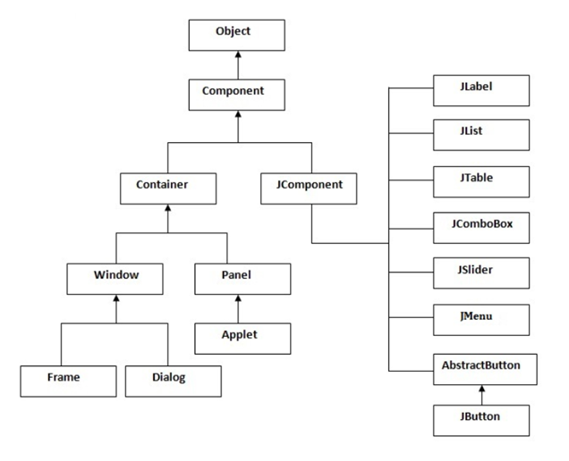

- **Component** به معنی عنصر، قطعه یا جزئی از یک چیز است. در طراحی GUI، Component به هر چیزی که روی رابط گرافیکی قرار می‌گیرد گفته می‌شود، مثل دکمه، برچسب، منو و... .
- **Container** به معنی ظرف یا محفظه است. در جاوا، Container به چهارچوبی گفته می‌شود که بقیه‌ی Component‌ها مثل دکمه و منو و ... داخل آن قرار می‌گیرند. این ظرف معمولاً یک فریم یا پنجره است. پس اگر بخواهیم یک GUI بسازیم، اول باید یک فریم ایجاد کنیم تا بتوانیم بقیه Component‌ها را داخل آن قرار دهیم. در ادامه، از نمودار بالا، دو بخش window و component را بررسی می‌کنیم و اجزای زیرمجموعه‌ی هرکدام را توضیح می‌دهیم.

### Window

پنجره‌ای است که هنگام اجرای برنامه باز می‌شود و می‌تواند به دو حالت باشد: dialog (حالت پاپ‌آپی که در برنامه‌ها می‌بینید) و Frame (قابی که پنجره هر برنامه با اجرا شدن خودش، باز می‌کند). بنابراین برای ایجاد یک رابط گرافیکی، به یک Frame نیاز داریم و JFrame در جاوا این کار را برای ما انجام می‌دهد. JFrame یک Container یا ظرف است که این قابلیت را دارد که Component‌هایی مثل JButton، JTextArea، JPanel و ... را در خودش جای دهد.

در ابتدا باید کتابخانه `swing` را برای ایجاد رابط گرافیکی به عنوان پیشنیاز کد ایمپورت کنیم. سپس یک آبجکت از کلاس JFrame می‌‌سازیم (اینجا مانند ابتدای اکیومنت نام آن را `frame` گذاشتیم). بعد از آن که آبجکت را ساختیم، برای نمایش آن باید مقدار `visibility` را `true` قرار بدهیم. نمونه کد و نتیجه‌ی اجرای آن را در ادامه می‌بینید. سام و نسترن قصد دارند برای تیم تدریسیاری، رابط کاربریِ فرمی را طراحی کنند که دانشجویانی که این ترم درس AP دارند، بتوانند اطلاعاتشان را توسط آن ثبت کنند. بنابراین، نام پنجره ایجاد شده را Student Registration Form می‌گذاریم.

```java
import javax.swing.*;  
public class Main{    
   public static void main(String[] args) {  
      JFrame frame = new JFrame("Student Registration Form");  
      frame.setVisible(true);  
   }
```

خروجی کد :

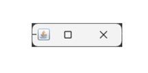

همانطور که می‌بینید، خروجی فقط یک پنجره‌ی خالی است. هیچ چیزی داخلش نیست و عنوانش هم دیده نمی‌شود. وقتی اندازه‌ی پنجره را دستی تغییر بدهید، می‌بینید که قاب باز شده به این شکل نشان داده می‌شود:


حالا می‌توانیم ببینیم که پنجره داده شده عنوان دارد ولی هنوز محتوایی ندارد. در واقع، یک آبجکت از کلاس JFrame مثل یک قاب یا تابلوی نقاشی است که هنوز چیزی روی آن کشیده نشده. قبل از اینکه اجزای دیگری به آن اضافه کنیم، بیایید کمی با همین قاب خالی کار کنیم.

مثلاً می‌خواهیم اندازه‌ی پنجره‌ی باز شده بعد از اجرا را کمی بزرگتر کنیم. اول باید ابعاد مورد نظر را بسازیم، اما برای این کار نیاز به اضافه کردن یک کتابخانه دیگر هم داریم که باید آن را هم به ابتدای کد اضافه کنیم:

```java
import java.awt.*;
```

سپس، ابعاد را به این صورت می‌سازیم:

```java
Dimension frameSize = new Dimension(1024,720);

// Create a Dimension object to set the window size (width:1024, height:720)
```

سپس این ابعاد را به frame می‌دهیم تا روی آن اعمال شود. این کار را به صورت زیر انجام می‌دهیم:

```java
frame.setSize(frameSize);
```

کد آن به صورت زیر است:

```java
import javax.swing.*;
import java.awt.*;
public class Main{
   public static void main(String[] args) {  
      JFrame frame = new JFrame("Student Registration Form");  
      Dimension frameSize = new Dimension(1024,720);  
      frame.setSize(frameSize);  
      frame.setVisible(true);
   }
}
```

خروجی کد:

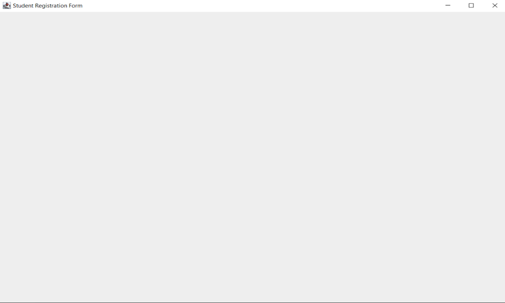

دقت کنید که وقتی پنجره را می‌بندید، کد شما همچنان ادامه پیدا می‌کند و متوقف نمی‌شود. برای این که این رفتار را تغییر دهید، می‌توانید حالت عملیات بستن پنجره را با کد زیر تغییر دهید. (گزینه‌ای که در کد زیر استفاده شده باعث می‌شود کد به طور کامل با بسته شدن پنجره متوقف شود. حالت‌های دیگری هم هست که می‌توانید از آن‌ها استفاده کنید.)

```java
frame.setDefaultCloseOperation(JFrame.EXIT_ON_CLOSE);
```

کد نهایی ما به صورت زیر است:

```java
import javax.swing.*;
import java.awt.*;
public class Main{
   public static void main(String[] args) {  
      JFrame frame = new JFrame("Student Registration Form");  
      Dimension frameSize = new Dimension(1024,720);  
      frame.setSize(frameSize);  
      frame.setVisible(true);  
      frame.setDefaultCloseOperation(JFrame.EXIT_ON_CLOSE);  
   }  
}
```
توجه کنید که برای مشخص کردن ابعاد پنجره‌تان، می‌توانید از کد زیر هم استفاده کنید:

```java
frame.setSize(500, 500);
```

در ادامه، به اجزای مختلفی مي‌پردازیم که مي‌توانید به این قاب اضافه کنید.

### Panel

JPanel ساده‌ترین کلاس در بین اجزای گرافیکی در جاواست. JPanel فضایی را در برنامه ایجاد می‌کند که می‌توانید هر جزء گرافیکی را به آن اضافه کنید. می‌توانید JPanel را مثل بوم نقاشی تصور کنید که اجزای گرافیکی شما مثل اجزای نقاشی روی آن قرار می‌گیرند.

حالا ممکن است این سؤال پیش بیاید که آیا JFrame و JPanel مثل هم نیستند؟ چون در JFrame هم اجزای گرافیکی را به آن اضافه می‌کردیم. باید بگویم که JFrame فقط یک پنجره معمولی است که در برنامه‌های کاربردی از آن استفاده می‌کنیم(می‌توانید آن را مانند یک پایه‌ی چوبی ببینید که بوم نقاشی هم قابلیت سوار شدن روی آن را دارد). اما JPanel با امکاناتی که دارد برای سازماندهی اجزای گرافیکی در جاوا خیلی بهتر و مناسب‌تر است. در واقع، JPanel جزئی است که روی این قاب (JFrame) قرار می‌گیرد و تقریباً خودش می‌تواند مثل یک mini frame برای اجزای دیگر مثل دکمه‌ها، لیبل‌ها و... باشد.

معمولاً در یک برنامه، از یک فریم اصلی استفاده می‌شود و پنل‌ها روی این فریم سوار می‌شوند. طی تعامل کاربر با برنامه (مثلاً از طریق دکمه‌ها)، این پنل‌ها می‌توانند جابجا شوند(مانند تعویض بوم نقاشی و گذاشتن بومی جدید بر روی پایه برای کشیدن نقاشی‌ای جدید). مثلاً وقتی یک دکمه را می‌زنید، از یک صفحه به صفحه دیگر می‌روید. جلوتر برای این مورد مثال می‌زنیم.

در ادامه می‌خواهیم پنلی به رنگ آبی روی قسمتی از پنجره‌ی خود ایجاد کنیم. اما برای آن که بتوانید پنل‌ها را آزادانه روی قاب قرار بدهید، ابتدا باید برای قاب خود چینشی خالی تعیین کنید، در غیر این صورت ممکن است چینش‌های پیش‌فرض جاوا جلوی شما را بگیرند (یک چینش‌ مجموعه‌ای از قواعد یا به اصطلاح استایل قرار گرفتن اجزای گرافیکی در یک پنجره است. در ادامه به طور مختصر به انواع چینش‌ها می‌پردازیم). برای این کار، ورودی متد زیر را null قرار می‌دهیم. توجه کنید که در کد زیر، null یعنی هیچ‌گونه Layout Manager (مدیریت چیدمان) برای فریم تنظیم نشده. یعنی شما باید خودتان موقعیت و ابعاد اجزای رابط کاربری را به صورت دستی مشخص کنید. در واقع، در اینجا وقتی از null استفاده می‌کنید، ترتیب قرارگیری اجزا و اندازه‌های آن‌ها به شما واگذار می‌شود و دیگر Java به طور خودکار آن‌ها را بر اساس یک طرح‌بندی خاص تنظیم نمی‌کند. 

```java
frame.setLayout(null);
```

سپس یک آبجکت جدید از روی این کلاس JPanel ایجاد می‌کنیم:

```java
JPanel mainPanel = new JPanel();
```

به کمک کد زیر می‌توانیم اندازه و موقعیت پنلمان را مشخص کنیم. (اندازه‌ی پنل می‌تواند با اندازه‌ی پنجره هم یکسان باشد.):

```java
mainPanel.setBounds(40, 35, 400, 400);
```

نکته‌ای که اهمیت دارد این است که در تنظیم مرزهای پنل، مقداردهی‌های داده شده به صورت زیر تحلیل می‌شوند:

دو مولفه اول (35, 40) به ترتیب طول و عرض نقطه‌ای (x, y) هستند که پنل ما از آن نقطه شروع می‌شود. مولفه‌های سوم و چهارم نیز به ترتیب عرض و ارتفاع پنل هستند. به مثال زیر در این راستا توجه کنید:

```java
panel.setBounds(0, 0, 512, 720);
```

- **مولفه‌ی اول و دوم**: مقدار `0` سمت چپ مکان شروع پنل روی بردار `x` ها است و مقدار `0` سمت راست مکان شروع پنل روی محور `y` ها است (به شکل زیر دقت کنید. محورها روی قاب به این شکل هستند).

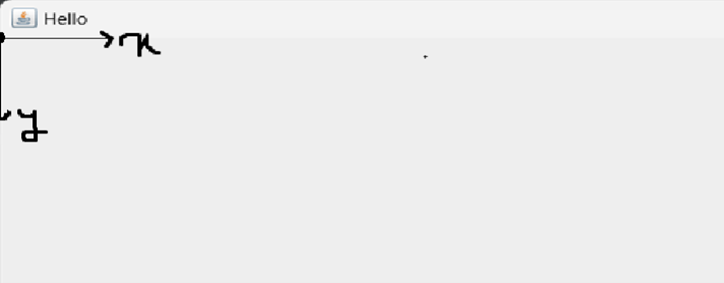

- مولفه سوم و چهارم :مقادیر `512` و `720` به ترتیب عرض و ارتفاع پنل هستند.
- از متد `setBounds()` زمانی که `layout`ای نداریم (آن را `null` گذاشته‌ایم) استفاده می‌کنیم.

برای تنظیم رنگ پنل، کلاس Color چند رنگ پیش‌فرض دارد (با نوشتن Color. می‌توانید آن‌ها را ببینید)، اما راستش را بخواهید، معمولاً رنگ‌های جذابی نیستند. راه بهتر این است که یک شیء جدید از Color بسازید و کد هگزادسیمال رنگ دلخواه را به آن بدهید؛ مثلاً من از کد رنگ baby blue استفاده کرده‌ام.

کد این رنگ `#89CFF0` است، اما اگر از مبانی برنامه‌نویسی یادتان باشد، به جای `#` ، با `0x` در ابتدای عدد مشخص می‌کنیم که عدد ما هگزادسیمال است (0x89CFF0). در کد زیر رنگ پنل را مشخص کردیم. از این فرایند برای تعیین رنگ هر کامپوننت دیگری نیز می‌توانید استفاده کنید.

```java
mainPanel.setBackground(new Color(0x89CFF0));
```

در انتها باید به صورت زیر پنلمان را به frame اضافه کنیم:

```java
frame.add(mainPanel);
```

کد نهایی ما به صورت زیر خواهد بود:

```java
import javax.swing.*;
import java.awt.*;

public class Main{
   public static void main(String[] args) {  
  
      JFrame frame = new JFrame("Student Registration Form");  
      frame.setSize(500, 500);  
      frame.setDefaultCloseOperation(JFrame.EXIT_ON_CLOSE);  
      frame.setLayout(null);  
  
      JPanel mainPanel = new JPanel();  
      mainPanel.setBounds(40, 35, 400, 400);   
      mainPanel.setBackground(new Color(0x89CFF0));

      frame.add(mainPanel);  
      frame.setVisible(true);  
   }  
}
```

خروجی کد فوق:

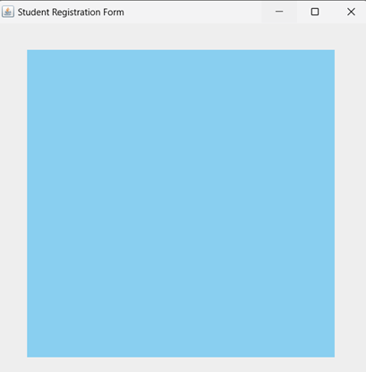

### Labels

برچسب (Label) یک آبجکت از کلاس JLabel است که برای نمایش متن یا عکس در فضای رابط کاربری استفاده می‌شود و فقط برای خواندن قابل دسترس است (یعنی کاربر نمی‌تواند چیزی را روی آن تغییر دهد). توجه کنید که متن را می‌شود از طریق برنامه تغییر داد، اما کاربر نمی‌تواند مستقیماً آن را ویرایش کند. به طور کلی، از کلاس JLabel برای نمایش متن یا تصویر در برنامه‌های گرافیکی استفاده می‌کنیم.

باز هم مثل قبل، برای استفاده از کلاس JLabel باید ابتدا یک آبجکت جدید از این کلاس بسازیم و یک نام برای آن انتخاب کنیم. از این به بعد می‌توانیم با استفاده از نام این آبجکت، متدهای کلاس JLabel را فراخوانی کنیم.

در کد زیر، متن دلخواه را با استفاده از JLabel نمایش می‌دهیم و با استفاده از setBounds موقعیت و اندازه برچسب‌ها را مشخص می‌کنیم:

```java
JLabel nameLabel = new JLabel("Student name:");  
nameLabel.setBounds(10, 10, 300, 50);  
JLabel numberLabel = new JLabel("Student number:");  
numberLabel.setBounds(10, 90, 300, 50);  
JLabel emailLabel = new JLabel("Email:");  
emailLabel.setBounds(10, 170, 300, 50);
```

در نهایت با کد زیر برچسب هایمان را به پنل اضافه می کنیم:

```java
mainPanel.add(nameLabel);  
mainPanel.add(numberLabel);  
mainPanel.add(emailLabel);
```

کد نهایی به صورت زیر است:

```java
import javax.swing.*;
import java.awt.*;

public class Main{
   public static void main(String[] args) {  
      JFrame frame = new JFrame("Student Registration Form");  
      frame.setSize(500, 500);  
      frame.setDefaultCloseOperation(JFrame.EXIT_ON_CLOSE);
      frame.setLayout(null);  
          
      JPanel mainPanel = new JPanel();  
      mainPanel.setBounds(40, 35, 400, 400);  
      mainPanel.setBackground(new Color(0x89CFF0));  
      mainPanel.setLayout(null);   
          
      JLabel nameLabel = new JLabel("Student name:");  
      nameLabel.setBounds(10, 10, 300, 50);  
      JLabel numberLabel = new JLabel("Student number:");  
      numberLabel.setBounds(10, 90, 300, 50);  
      JLabel emailLabel = new JLabel("Email:");  
      emailLabel.setBounds(10, 170, 300, 50);  
          
      mainPanel.add(nameLabel);  
      mainPanel.add(numberLabel);  
      mainPanel.add(emailLabel);  
          
      frame.add(mainPanel);  
      frame.setVisible(true);  
   }  
}
```

خروجی کد:

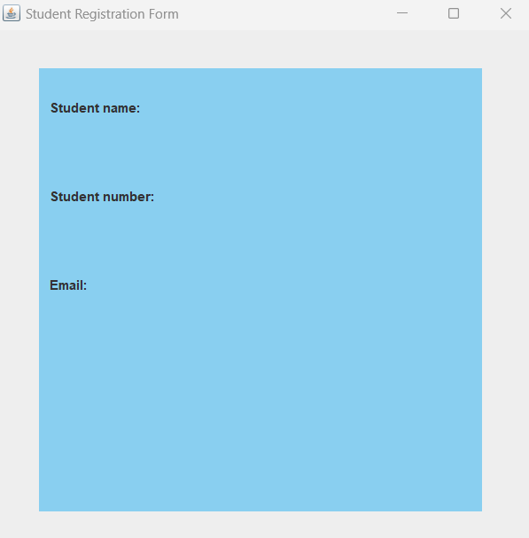

### TextField
کلاس ‍`JTextField` شامل اجزای گرافیکی «متنی» است که وقتی از آن آبجکتی بسازید، به شما این امکان را می‌دهد که یک خط متن را ویرایش کنید. برای اینکه بهتر متوجه شوید، می‌توانید برنامه Notepad را باز کنید و از منوی Edit گزینه Find را انتخاب کنید.

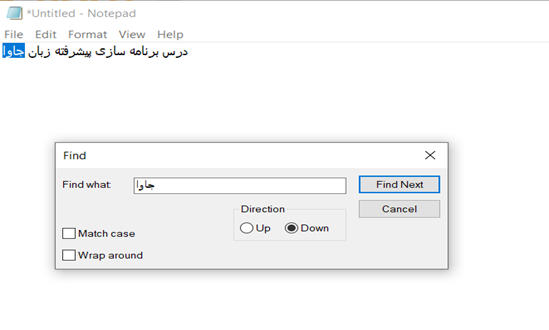

در تصویر بالا، ما قصد داریم کلمه‌ی «جاوا» را در میان متن موجود در برنامه Notepad پیدا کنیم. فیلدی که در بخش Find برای وارد کردن کلمه‌ی مورد نظر استفاده می‌کنیم، همون جزء گرافیکی `JTextField` است که با رنگ قرمز مشخص کردیم. احتمالاً با این نوع اجزای گرافیکی زیاد برخورد کرده‌اید، مثلاً وقتی که در فرم‌های ثبت‌نام، اطلاعات کاربری را وارد می‌کنید. متنی که در این اجزای گرافیکی وارد می‌کنیم ویژگی‌های زیر را دارد:

- به صورت یک خط یا سطر است.
- بر خلاف `JLabel` که فقط برای نمایش متن استفاده می‌شود، این فیلدها توسط کاربر نیز قابل ویرایش هستند، یعنی شما می‌توانید متن قبلی را با متن جدید عوض کنید.

حالا می‌خواهیم سه `TextField` برای سه لیبلی که قبلاً ساختیم، ایجاد کنیم:

```java
JTextField nameTextField = new JTextField();  
nameTextField.setBounds(170, 10, 200, 40);  
JTextField numberTextField = new JTextField();  
numberTextField.setBounds(170, 90, 200, 40);  
JTextField emailTextField = new JTextField();  
emailTextField.setBounds(170, 170, 200, 40);
```

در انتها با کد زیر، `TextField` هایمان را به پنل اضافه می‌کنیم:

```java
mainPanel.add(nameTextField);  
mainPanel.add(numberTextField);  
mainPanel.add(emailTextField);
```

خروجی کد:

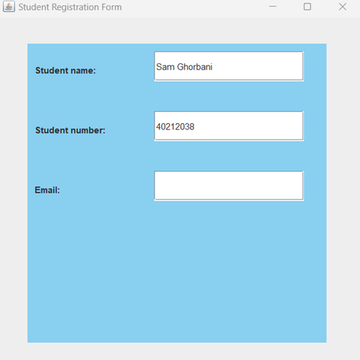


دقت شود که ما متن پیش‌فرضی برای `textfield` هایمان نگذاشته بودیم و متن موجود در فیلدهای مثال بالا، مثلا توسط کاربر وارد شده‌اند.

### نمایش تصویر با استفاده از کلاس `JLabel`

همانطور که قبلاً گفتیم، در جاوا می‌توانیم برای نمایش تصاویر از کلاس `JLabel` استفاده کنیم. این کلاس به ما این امکان را می‌دهد که تصاویر را در صفحه نمایش برنامه نشان دهیم.

برای شروع، باید یک شیء از کلاس `JLabel` بسازیم و تصویر مورد نظر را به آن اختصاص دهیم. برای این کار می‌توانیم از کلاس `ImageIcon` استفاده کنیم تا تصویر را بخوانیم و بعد آن را به آبجکت ساخته شده از کلاس `JLabel` اختصاص دهیم. `ImageIcon`، یک کلاس در سویینگ است که به ما کمک می‌کند تصاویر را روی کامپوننت‌هایی مثل `JLabel` و `JButton` بارگذاری کنیم و نمایش دهیم. مثلاً برای نمایش تصویر با نام `"imagee.png"` که در پوشه `src` برنامه قرار دارد، به صورت زیر عمل می‌کنیم:

```java
ImageIcon imageIcon = new ImageIcon("src/imagee.png");
```


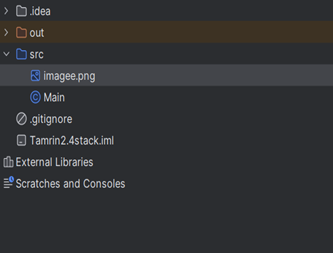


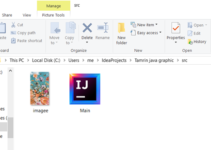

مسیر دقیق فایل را به صورت بالا در کدمان مشخص می‌کنیم و با استفاده از کلاس `ImageIcon` تصویر `"imagee.png"` را می‌خوانیم. در ادامه برای تغییر اندازه تصویر (scaling) از کد زیر استفاده می‌کنیم:

```java
Image scaledImage = imageIcon.getImage().getScaledInstance(150, 150, Image.SCALE_SMOOTH);
```

- متد `getImage()` از کلاس `ImageIcon` تصویر خام (Image) را که داخل آبجکت `ImageIcon` است، برمی‌گرداند. می‌توانید از این متد برای کارهای گرافیکی یا تغییر اندازه‌ی تصویر استفاده کنید.
- متد `getScaledInstance()` از کلاس `Image` برای تغییر اندازه‌ی تصویر به کار می‌رود. این متد سه تا ورودی می‌گیرد:
- عرض تصویر (`width`): مقدار عددی عرض جدید تصویر که در اینجا `150` پیکسل تعیین می کنیم.
- ارتفاع تصویر (`height`): مقدار عددی ارتفاع جدید تصویر که اینجا هم `150` پیکسل تعیین می‌کنیم.
- راهنماهای مقیاس‌دهی (`hints`): روشی که می‌خواهیم برای تغییر اندازه‌ی تصویر استفاده کنیم. این آرگومان الگوریتم مقیاس‌دهی را مشخص می‌کند. در اینجا از `Image.SCALE_SMOOTH` استفاده کردیم.

مقدار `Image.SCALE_SMOOTH` یک ثابت از کلاس `Image` است که الگوریتمی برای مقیاس‌دهی تصویر ارائه می‌دهد. این روش باعث می‌شود کیفیت تصویر موقع تغییر اندازه حفظ شود. سرعتش شاید کمی پایین‌تر باشد، اما نتیجه‌ی نهایی کیفیت بالاتری دارد. بعضی مقادیر دیگر برای `hints` عبارتند از:

- `Image.SCALE_FAST` : سرعت بالاتر با کیفیت پایین‌تر.
- `Image.SCALE_DEFAULT` : استفاده از تنظیمات پیش‌فرض سیستم.
- `Image.SCALE_REPLICATE` : مقیاس‌دهی ساده که ممکن است کیفیت خوبی نداشته باشد.

مثالی برای اینکه این موضوع را بهتر متوجه شوید: فرض کنید تصویری دارید که اندازه‌اش `750*500` پیکسل است و می‌خواهید آن را کوچک کنید تا در فضای `150*100` پیکسلی جا شود. این خط دقیقاً این کار را انجام می‌دهد، بدون اینکه کیفیت تصویر خیلی افت کند.

حالا تصویر را به شیء `JLabel` اختصاص می‌دهیم:

```java
JLabel imageLabel = new JLabel(new ImageIcon(scaledImage));
```

سپس به کمک `setBounds` موقعیت تصویر را در صفحه مشخص می کنیم:

```java
imageLabel.setBounds(30, 230, 100, 150);
```

و در انتها، تصویر را به پنلمان اضافه می کنیم:

```java
mainPanel.add(imageLabel);
```

خروجی کد:

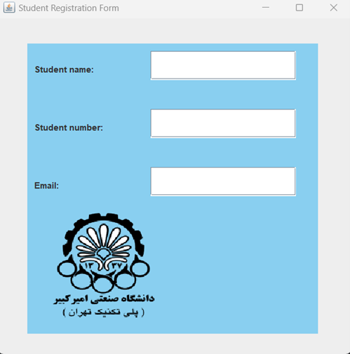


### Button

همانطور که قبلاً گفتیم، یکی از روش‌هایی که کاربر می‌تواند با برنامه ارتباط برقرار کند، کلیک کردن روی دکمه‌هاست. پس هر کدام از دکمه‌ها می‌توانند یک کار خاصی را انجام دهند. اشیاء ساخته شده از کلاس `JButton` دکمه‌هایی هستند که وقتی کاربر روی آن‌ها کلیک می‌کند، یک کار مشخص را انجام می‌دهند.

در کد زیر که دو دکمه تعریف کردیم، می‌توانید متن دلخواه را روی دکمه بگذارید و با استفاده از `setBounds` نیز موقعیت و اندازه‌ی دکمه را مشخص کنید.

```java
JButton submitButton = new JButton("Submit");  
submitButton.setBounds(10, 10, 300, 50);

JButton okButton = new JButton("OK");  
okButton.setBounds(150, 330, 100, 50);
```

بعد از اینکه دکمه را تعریف کردید، می‌توانید با استفاده از روش زیر آن را فعال کنید. در این برنامه می‌خواهیم وقتی دکمه زده شد، پیامی مبتنی بر ثبت شدن اطلاعات را نشان دهد. برای این کار دو حالت مختلف را با دو مثال بررسی می‌کنیم.

اولاً نیاز داریم که در ابتدای کدمان، پکیج زیر را ایمپورت کنیم:

```java
Import java.awt.event.*;
```

حالا، کد زیر را به برنامه اضافه می‌کنیم:

```java
submitButton.addActionListener(new ActionListener() {
   @Override
   public void actionPerformed(ActionEvent e) {  
      // Button functionality
   }
});
```

در قسمت کامنت شده کد مربوط به کارهایی را که می‌خواهیم بعد از فشردن دکمه اجرا شود را می‌نویسیم. نحوه فعال‌سازی دکمه همیشه به یک شکل ثابت نوشته می‌شود، ولی کارهایی که باید انجام شود (همان قسمت کامنت شده) را می‌توان به روش‌های مختلف و متنوع نوشت.  
همانطور که گفتیم، می‌خواهیم با فشردن دکمه یک پیغام نشان دهیم که نشان‌دهنده ثبت شدن اطلاعات باشد.

**مثال یک**

یک پنل جدید می‌سازیم و به آن یک لیبل جدید و دکمه اختصاص می‌دهیم. هدف این است که با زدن دکمه، پنل‌ها روی فریم جایگزین شوند. برای پنل دوم، از یکی از رنگ‌های پیش‌فرض کلاس Color استفاده می‌کنیم:

```java
JPanel successPanel = new JPanel();  
successPanel.setBounds(40, 35, 400, 400);   
successPanel.setBackground(Color.lightGray);  
successPanel.setLayout(null);

JLabel infoLabel = new JLabel("Information Submitted successfully");  
infoLabel.setBounds(100, 170, 350, 50);

successPanel.add(infoLabel);
```

دکمه‌ی `submitButton` را به پنل اول و دکمه‌ی `okButton` را به پنل دوم اضافه می‌کنیم:

```java
mainPanel.add(submitButton);  
successPanel.add(okButton);
```

حالا، `actionListener` را برای هر دو دکمه پیاده سازی می‌کنیم، به طوری که با زدن دکمه ها‌، بین پنل‌ها جابه‌جا شویم:

```java
submitButton.addActionListener(new ActionListener() {
   @Override
   public void actionPerformed(ActionEvent e) {
      frame.getContentPane().removeAll();

      frame.add(successPanel);

      frame.revalidate();

      frame.repaint();

   }
});

okButton.addActionListener(new ActionListener() {
   @Override
   public void actionPerformed(ActionEvent e) {
      frame.getContentPane().removeAll();

      frame.add(mainPanel);

      frame.revalidate();

      frame.repaint();

   }
});
```

متد `getContentPane().removeAll()` تمام اجزا و کامپوننت های داخل فریم را حذف می‌کند. این کار باعث جلوگیری از باقی ماندن اجزای قبلی هنگام تغییر صفحه می‌شود. متد `revalidate()` چیدمان (`layout`) را به‌روزرسانی می‌کند و متد `repaint()` کل فریم را دوباره رسم می‌کند تا تغییرات به درستی نشان داده شوند.

خروجی کد بعد از کلیک بر روی دکمه `Submit`:

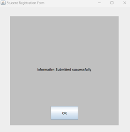

با کلیک بر روی دکمه OK ، به صفحه‌ی اصلی برمی‌گردیم.

کد نهایی برنامه‌ی مثال یک به صورت زیر است:

```java
import javax.swing.*;
import java.awt.*;
import java.awt.event.*;
‌
public class Main{
   public static void main(String[] args) {  
      JFrame frame = new JFrame("Student Registration Form");  
      frame.setSize(500, 500);  
      frame.setDefaultCloseOperation(JFrame.EXIT_ON_CLOSE);  
      frame.setLayout(null);  
  
      JPanel mainPanel = new JPanel();  
      mainPanel.setBounds(40, 35, 400, 400);  
      mainPanel.setBackground(new Color(0x89CFF0));
      mainPanel.setLayout(null);  
      JPanel successPanel = new JPanel();  
      successPanel.setBounds(40, 35, 400, 400);  
      successPanel.setBackground(Color.lightGray);
      successPanel.setLayout(null);

      //labels of mainPanel  
      JLabel nameLabel = new JLabel("Student name:");  
      nameLabel.setBounds(10, 10, 150, 50);  
      JLabel numberLabel = new JLabel("Student number:");  
      numberLabel.setBounds(10, 90, 150, 50);  
      JLabel emailLabel = new JLabel("Email:");  
      emailLabel.setBounds(10, 170, 150, 50);

      //label of successPanel  
      JLabel infoLabel = new JLabel("Information Submitted successfully");  
      infoLabel.setBounds(100, 170, 350, 50);  


      JTextField nameTextField = new JTextField();  
      nameTextField.setBounds(170, 10, 200, 40);  
      JTextField numberTextField = new JTextField();  
      numberTextField.setBounds(170, 90, 200, 40);  
      JTextField emailTextField = new JTextField();  
      emailTextField.setBounds(170, 170, 200, 40);  

      ImageIcon imageIcon = new ImageIcon("src/imagee.png");  
      Image scaledImage = imageIcon.getImage().getScaledInstance(150, 150, Image.SCALE_SMOOTH);  
      JLabel imageLabel = new JLabel(new ImageIcon(scaledImage));  
      imageLabel.setBounds(30, 230, 150, 150);  
  
      JButton submitButton = new JButton("Submit"); //for mainPanel  
      submitButton.setBounds(270, 330, 100, 50);   
      JButton okButton = new JButton("OK"); //for successPanel  
      okButton.setBounds(150, 330, 100, 50);


      submitButton.addActionListener(new ActionListener() {
         @Override
         public void actionPerformed(ActionEvent e){
            frame.getContentPane().removeAll();
            frame.add(successPanel);
            frame.revalidate();
            frame.repaint();  
         }  
      });  
      okButton.addActionListener(new ActionListener() {
         @Override
         public void actionPerformed(ActionEvent e){
            frame.getContentPane().removeAll();
            frame.add(mainPanel);
            frame.revalidate();
            frame.repaint();  
         }  
      });  

      mainPanel.add(imageLabel);  
      mainPanel.add(nameLabel);  
      mainPanel.add(numberLabel);  
      mainPanel.add(emailLabel);  
      mainPanel.add(nameTextField);  
      mainPanel.add(numberTextField);  
      mainPanel.add(emailTextField);  
      mainPanel.add(submitButton);

      successPanel.add(infoLabel);

      successPanel.add(okButton);  

      frame.add(mainPanel);  
      frame.setVisible(true);  
   }  
}
```

**مثال دو**

از `JOptionPane` برای نمایش پاپ آپی (`dialog`) استفاده می‌کنیم.

به کد زیر که در آن از این کلاس استفاده کردیم، دقت کنید:

```java
submitButton.addActionListener(new ActionListener() {
   @Override
   public void actionPerformed(ActionEvent e) {  
      JOptionPane.showMessageDialog(frame, “Information submitted successfully”);
   }
});
```

خروجی کد بعد از کلیک روی دکمه‌ی `Submit`:

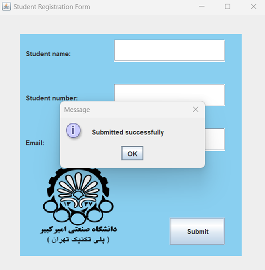

**مثال سه**

در این مثال، از متدهای `setText` و `getText` نیز استفاده خواهیم کرد:

- متد `setText(String text)`: این متد برای تنظیم کردن متن داخل یک کامپوننت گرافیکی به کار می‌آید. یعنی وقتی بخواهید یک متن خاص را در `JTextField` نمایش دهید، از این متد استفاده می‌کنید.
- متد `getText()`: این متد نیز برای دریافت متن از داخل یک کامپوننت گرافیکی است. مثلاً اگر بخواهید بفهمید کاربر چه چیزی وارد کرده، این متد می‌تواند به شما کمک کند.

حالا می‌خواهیم در یک نمونه‌ی ساده‌تر از برنامه‌ی قبلی خود از این دو متد استفاده کنیم، به طوری که کاربر اطلاعات خود را وارد می‌کند و با زدن دکمه `Submit`، اطلاعات در یک `TextField` دیگر نمایش داده می‌شود. برای این کار، ابتدا یک `TextField` دیگر می‌سازیم که بعد از فشردن دکمه `Submit`، فقط اطلاعات را نشان دهد و دیگر نتواند ویرایش شود. به همین دلیل، ویژگی `setEditable(false)` را برای آن تنظیم می‌کنیم که این فیلد فقط برای نمایش استفاده شود. در ادامه دکمه `Submit` را نیز تعریف می‌کنیم. کد مربوطه به شکل زیر خواهد بود:

```java
JButton submitButton = new JButton("Submit");  
submitButton.setBounds(150, 160, 100, 30);

JTextField outputTextField = new JTextField();  
outputTextField.setBounds(10, 210, 360, 30);  
outputTextField.setEditable(false);
```

چون عملیات "دریافت ورودی" و "نمایش خروجی" باید بعد از کلیک روی دکمه `Submit` انجام شود، این عملیات‌ها را داخل متد `actionPerformed()` قرار می‌دهیم. این متد فقط زمانی اجرا می‌شود که کاربر روی دکمه کلیک کند. (کدهای مربوط به فعال کردن دکمه قبلاً توضیح داده شده) حالا به کد زیر و کامنت‌های داخل آن دقت کنید:

```java
submitButton.addActionListener(new ActionListener() {
   @Override
   public void actionPerformed(ActionEvent e) {

      // Receive input from the name field  
      String name = nameTextField.getText();

      // Receive input from the student number field  
      String number = numberTextField.getText();

      // Receive input from the email field  
      String email = emailTextField.getText();

      // Combine the information and display it in the output field
      outputTextField.setText("Name: " + name + " | Number: " + number + " | Email: " + email);  
   }  
});
```

در کد بالا ما یک `ActionListener` به دکمه اضافه کردیم که با هر بار کلیک کردن، متد `()actionPerformed` را اجرا کند. حالا باید دکمه‌ی `Submit` و `outputTextField` را به پنل اضافه کنیم تا همه چیز به درستی نمایش داده شود. کد مربوط به اضافه کردن دکمه و `outputTextField` به پنل به صورت زیر است:

```java
mainPanel.add(submitButton);  
mainPanel.add(outputTextField);
```

کد نهایی به صورت زیر هست:

```java
import javax.swing.*;
import java.awt.*;
import java.awt.event.ActionEvent;
import java.awt.event.ActionListener;

public class Main {
   public static void main(String[] args) {  
      JFrame frame = new JFrame("Student Registration Form");  
      frame.setSize(500, 500);  
      frame.setDefaultCloseOperation(JFrame.EXIT_ON_CLOSE);  
      frame.setLayout(null);  
  
      JPanel mainPanel = new JPanel();  
      mainPanel.setBounds(40, 35, 400, 400);  
      mainPanel.setBackground(new Color(0x89CFF0));  
      mainPanel.setLayout(null);  
  
      JLabel namelabel = new JLabel("Student name:");  
      namelabel.setBounds(10, 10, 150, 30);  
      JLabel numberlabel = new JLabel("Student number:");  
      numberlabel.setBounds(10, 60, 150, 30);  
      JLabel emaillabel = new JLabel("Email:");  
      emaillabel.setBounds(10, 110, 150, 30);  
  
      JTextField nametextField = new JTextField();  
      nametextField.setBounds(170, 10, 200, 30);  
      JTextField numbertextField = new JTextField();  
      numbertextField.setBounds(170, 60, 200, 30);  
      JTextField emailtextField = new JTextField();  
      emailtextField.setBounds(170, 110, 200, 30);  
  
      JButton submitButton = new JButton("Submit");  
      submitButton.setBounds(150, 160, 100, 30);  
  
      JTextField outputTextField = new JTextField();  
      outputTextField.setBounds(10, 210, 360, 30);  
      outputTextField.setEditable(false); 

      submitButton.addActionListener(new ActionListener() {
         @Override
         public void actionPerformed(ActionEvent e) {  
            String name = nametextField.getText();  
            String number = numbertextField.getText();  
            String email = emailtextField.getText();

            outputTextField.setText("Name: " + name + " | Number: " + number + " | Email: " + email);  
         }  
      });  
  
      mainPanel.add(nametextField);  
      mainPanel.add(numbertextField);  
      mainPanel.add(emailtextField);  
      mainPanel.add(namelabel);  
      mainPanel.add(numberlabel);  
      mainPanel.add(emaillabel);  
      mainPanel.add(submitButton);  
      mainPanel.add(outputTextField);  

      frame.add(mainPanel);  
      frame.setVisible(true);  
   }  
}
```

خروجی کد بعد از کلیک کردن بر روی دکمه:

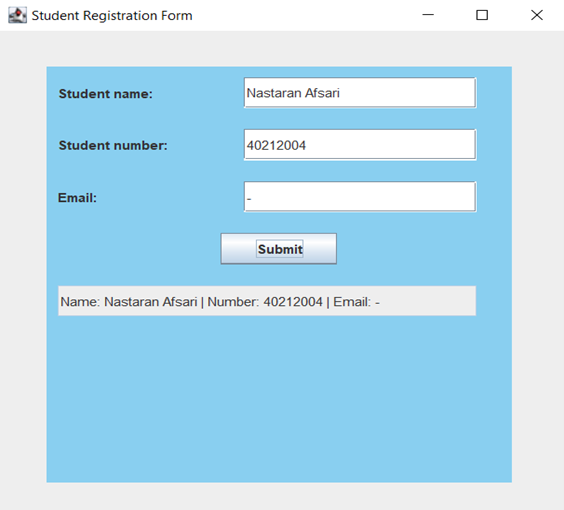

### Layouts (چینش‌ها)

چیدمان اجزا در صفحه، یکی از بخش‌های مهم برای ساخت رابط کاربری به قولی user friendly تر است. همانطور که در کد نمونه‌ی اول دیدید:

```java
frame.setLayout(null);
```

این خط کد یک صفحه‌ی خالی برای ما ایجاد کرد و این امکان را داد که با مشخص کردن موقعیت و اندازه‌ی اجزا، چیدمان صفحه را به سلیقه‌ی خودمان تنظیم کنیم. اما یک مشکل اساسی دارد! همانطور که احتمالاً خودتان نیز دیده‌اید، وقتی اندازه‌ی صفحه تغییر می‌کند، عناصر صفحه به‌صورت خودکار تنظیم نمی‌شوند و همان جا که بودند، ثابت می‌مانند. این موضوع می‌تواند باعث به‌هم‌ریختگی رابط کاربری شود.

برای حل این مشکل، می‌توانیم از چیدمان‌های آماده (`Layouts`) برای `Frame` یا سایر اجزای صفحه استفاده کنیم. در ادامه، چند تا از این ابزارهای آماده‌ی مدیریت چیدمان را بررسی می‌کنیم که برای این تمرین نیاز داریم.

مزیت استفاده از `layout` ها این است که برخلاف روش دستی، وقتی اندازه‌ی پنجره تغییر می‌کند، موقعیت و اندازه‌ی اجزا نیز به‌طور خودکار تنظیم می‌شوند و تجربه‌ی کاربری بهتری رقم می‌خورد.

چیدمان‌ها تعیین می‌کنند که عناصر اضافه‌شده به `panel` یا `frame` چگونه کنار هم قرار بگیرند. در اینجا ما با `panel` کار می‌کنیم، ولی اگر آموزش‌های دیگر را ببینید، معمولاً چیدمان‌ها روی `frame` پیاده‌سازی می‌شوند. شما نیز بسته به نیاز و خلاقیت خودتان، می‌توانید هر کدام از این روش‌ها را امتحان کنید.

### Grid Layout

این نوع چیدمان به شما اجازه می‌دهد اجزا را داخل یک شبکه مرتب کنید، طوری که هر کدام بتوانند یک یا چند سلول را اشغال کنند. شما همچنین کنترل کاملی روی ترتیب و فضای بین این اجزا دارید.

در این روش، کامپوننت‌ها داخل یک شبکه شطرنجی قرار می‌گیرند و هر کدام، تمام فضای سلول خودشان را پر می‌کنند. هنگام تنظیم این چیدمان، می‌توانید تعداد سطرها، ستون‌ها و فاصله‌ی بینشان را مشخص کنید تا دقیقاً همان چیزی که می‌خواهید، پیاده‌سازی شود. همچنین می‌توانید این کارها را به ترتیب با متدهای زیر انجام دهید:

1.  `setRows(int rows)` : تنظیم تعداد سطرها
2.  `setColumns(int coumns)` : تنظیم تعداد ستون ها
3.  `setHgap(int hgap)` : تنظیم فاصله افقی بین سلول ها
4.  `setVgap(int vgap)` : تنظیم فاصله عمودی بین سلول ها

برای نمونه، در کد زیر، بر روی یک پنل با چیدمان `Grid Layout` شش دکمه با فاصله‌های مشخص از هم قرار می‌دهیم:

```java
import javax.swing.*;  
import java.awt.*;  
  
public class Grid {
   public static void main(String args[]){  
      JFrame frame = new JFrame();  
      frame.setSize(500, 500);  
      frame.setDefaultCloseOperation(WindowConstants.EXIT_ON_CLOSE);  

      JPanel panel = new JPanel();
      GridLayout gridLayout = new GridLayout(2, 3, 10, 10);  
      panel.setLayout(gridLayout);  

      JButton button1 = new JButton("1");  
      JButton button2 = new JButton("2");  
      JButton button3 = new JButton("3");  
      JButton button4 = new JButton("4");  
      JButton button5 = new JButton("5");  
      JButton button6 = new JButton("6");  
  
      panel.add(button1);  
      panel.add(button2);  
      panel.add(button3);  
      panel.add(button4);  
      panel.add(button5);  
      panel.add(button6);  
  
      frame.add(panel);  
      frame.setVisible(true);  

   }
```

در کد بالا، یک آبجکت از کلاس `GridLayout` ساختیم و ورودی‌ها به ترتیب از چپ، 2 سطر، 3 ستون و فاصله‌های افقی و عمودی 10 پیکسلی بین هر دکمه را مشخص می‌کنند.

خروجی کد:

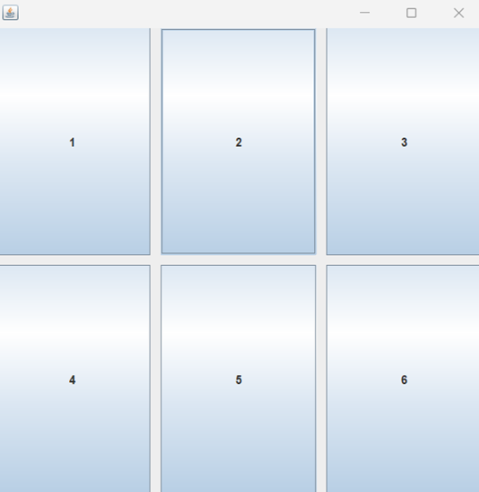

حال، با فراخوانی چهار متد زیر، تعداد سطر و ستون‌ها را برعکس کرده و فاصله‌های عمودی و افقی را به 50 افزایش می‌دهیم:

```java
gridLayout.setRows(3);  
gridLayout.setColumns(2);  
gridLayout.setHgap(50);  
gridLayout.setVgap(50);
```

خروجی کد:

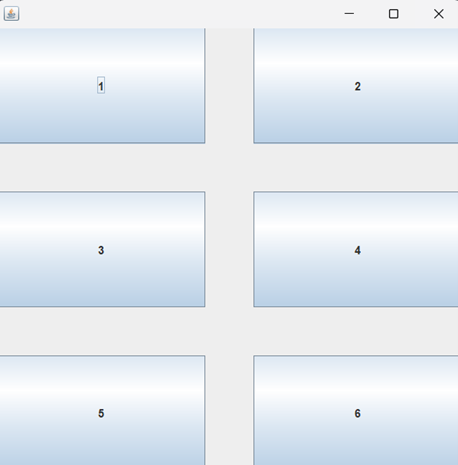

برای مثال، در پیاده‌سازی این برنامه نیز از grid layout استفاده شده:

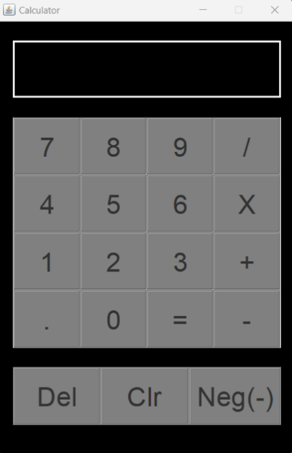

[این ویدئو](https://www.youtube.com/watch?v=ohNqQagkDDY) را برای بررسی دقیق‌تر این `Layout` نگاه کنید.

### Border Layout

حالت پیش‌فرض جاوا برای چیدمان پنل‌هاست که از 5 ناحیه تشکیل شده و شکل کلی آن به صورت زیر است:

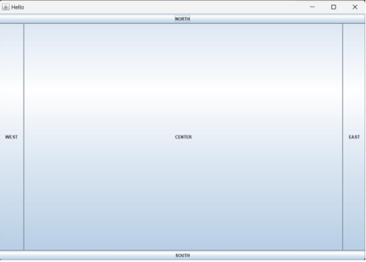


پس برعکس کاری که در برنامه‌ای که با هم ساختیم انجام دادیم، باید ورودی متد `setLayout()` را به جای `null`، شیءای جدید از کلاس `BorderLayout` بگذاریم:

```java
mainPanel.setLayout(new BorderLayout);
```

برای هر کدام از اجزایی که به پنل اضافه می‌کنیم، باید اشاره کنیم که در کدام ناحیه قرار می‌گیرد که به این منظور به شکل زیر عمل می‌کنیم:

```java
// add a new JButton with name "NORTH" and it is on top of the container JButton northButton = new JButton("NORTH"); 

mainPanel.add(northButton, BorderLayout.NORTH);
```

[این ویدئو](https://www.youtube.com/watch?v=PD6pd6AMoOI) را برای درک بهتر این چیدمان بررسی کنید.

### Box Layout

توی این چیدمان، اجزا می‌توانند به دو شکل مرتب شوند:
1.  `Page Axis` ( از بالا به پایین، مثل یک ستون)
2.  `Line Axis` ( از چپ به راست، مثل یک سطر)

به بیان ساده، شما این امکان را دارید که کامپوننت‌های خود را یا زیر هم یا کنار هم قرار دهید.

هنگام ساخت یک آبجکت از کلاس `BoxLayout` ، باید دو تا ورودی برای آن مشخص کنید:

اولین ورودی فریم (`JFrame`) یا پنلی (`JPanel`) که می‌خواهید این چیدمان روی آن اعمال شود.

دومین ورودی یک مقدار ثابت است که مشخص می‌کند چینش به‌صورت ستونی (`PAGE_AXIS`) یا سطری (`LINE_AXIS`) باشد.

علاوه بر این، `BoxLayout` این امکان را به شما می‌دهد که بین اجزا فضای خالی ایجاد کنید تا چیدمان مرتب‌تر شود.

مثال زیر نحوه‌ی استفاده از `Page Axis` را نشان می‌دهد:

```java
mainPanel.setLayout(new BoxLayout(mainPanel, BoxLayout.PAGE_AXIS));
```

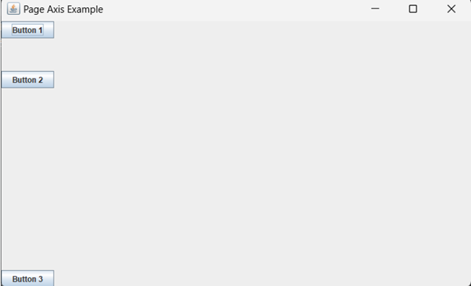

به عنوان مثال، اکنون پنل اول برنامه خودمان که چیدمانش `null` بود را با `BoxLayout` و `PAGE_AXIS` پیاده‌سازی می‌کنیم:

```java
mainPanel.setLayout(new BoxLayout(mainPanel, BoxLayout.PAGE_AXIS));
```

خروجی این چیدمان برای برنامه‌ای که ساختیم به این صورت خواهد بود:

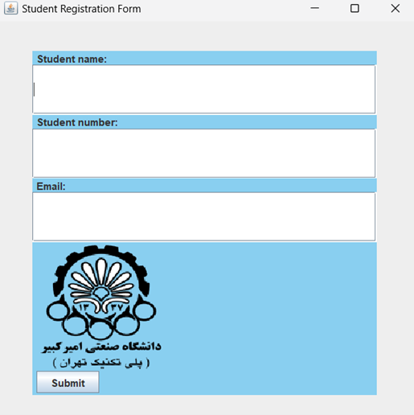

دقت شود که وقتی از لیوت‌ها استفاده می‌کنیم (بر خلاف وقتی که `null` استفاده می‌کردیم)، ترتیب اضافه شدن کامپوننت ها به پنل حائز اهمیت می‌شود. مثلا برای خروجی بالا، ترتیب بدین صورت است:

```java
mainPanel.add(nameLabel);  
mainPanel.add(nameTextField);  
mainPanel.add(numberLabel);  
mainPanel.add(numberTextField);  
mainPanel.add(emailLabel);  
mainPanel.add(emailTextField);  
mainPanel.add(imageLabel);  
mainPanel.add(submitButton);
```

[این ویدیو](https://www.youtube.com/watch?v=hBe2eBorQuw)این ویدئو، برای درک بهتر این `Layout` پیشنهاد می‌شود.

### Flow Layout

مدیریت چیدمان `FlowLayout` به شما این امکان را می‌دهد تا اجزا را به صورت پشت سر هم در یک خط یا چند خط مرتب کنید. وقتی صفحه‌تان پر شود، اجزا به صورت خودکار به خط بعدی منتقل می‌شوند.

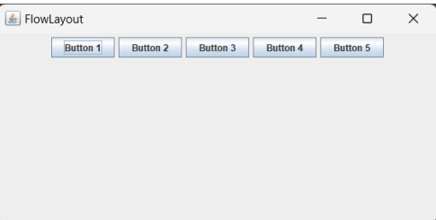

برای درک شهودی بهتر از پیاده‌سازی این `layout`، به [این ویدیو](https://www.youtube.com/watch?v=pDqjHozkMBs) مراجعه کنید.

## برخی از متدهای پرکاربرد برای کلاس‌های کاربردی Swing

### کلاس `JFrame`

- `setText(String title)` : این متد، همان تایتل فریم را تغییر میدهد.

- `setSize(int width, int height)` : ابعاد فریم را مشخص می‌کند.

- `setVisible(boolean state)` : وضعیت نمایش فریم را مشخص می‌کند.

- `setResizable(boolean state)` : اگر ورودی را false قرار دهیم، ابعاد فریم ثابت باقی مانده و کاربر نمی‌تواند آن را تغییر دهد.

- `setLayout()` : چینش فریم را مشخص می‌کند.

- `setDefaultCloseOperation(int operation)` : بسته به نوع ورودی، وضعیت برنامه بعد از بستن فریم را مشخص می‌کند. شما می‌توانید `operation` را به جای `int`، با `constant` های از پیش تعریف شده‌ای مثل `JFrame.EXIT_ON_CLOSE` پر کنید.

- `setLocationRelativeTo(Component c)` : با `null` قرار دادن ورودی این متد، هنگام ران کردن برنامه، فریم در وسط صفحه‌ی مانیتور باز می‌شود.

### کلاس JLabel

- `setText(String text)` : متن لیبل را مشخص می‌کند.

- `setIcon()` : مثلا برای اضافه کردن `imageIcon` همانطور که بالاتر گفتیم.

- `setForeGround()` : تعیین رنگ متن لیبل به کمک کلاس `Color` که بالاتر استفاده ازش را توضیح دادیم.

- `setFont()` : فونت متن لیبل را مشخص می‌کند. ورودی آن یک آبجکت از کلاس فونت است که به صورت زیر ساخته می‌شود:

```java
Font font = new Font("font's name", Font.type, int size);
```

قسمت `type` میتواند ثابت‌های مختلفی مثل `PLAIN` و یا `BOLD` باشد.

- `setBorder()`

یک مرز و قاب به دور برچسب ایجاد می‌کند. ورودی آن یک آبجکت از کلاس `Border` است.

برای استفاده از متد `setBorder` مثل زیر عمل می‌کنیم:

ورودی دوم ضخامت مرز را مشخص می‌کند.

```java
Border border = BorderFactory.createLineBorder(Color.RED, 10);  
namelabel.setBorder(border);
```

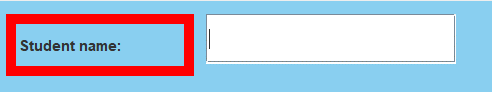


### کلاس JButton

- `setText(String text)` : مثل `JLable` کار می‌کند.

- `setBackGround()` : مثل متد `setForeGround()` که برای کلاس `JLable` بود، این متد هم رنگ پس زمینه‌ی دکمه را با اسفاده از کلاس `Color` مشخص می‌کند.

- `setFocusable(boolean state)` : باعث فعالسازی و یا عدم فعالسازی مرز کمرنگ دور نوشته‌ی درون دکمه می‌شود.

- `setBorder()` : مثل `JLabel` کار می‌کند.

- `setActionListener()` : توی مثال‌ها توضیح داده شده است.