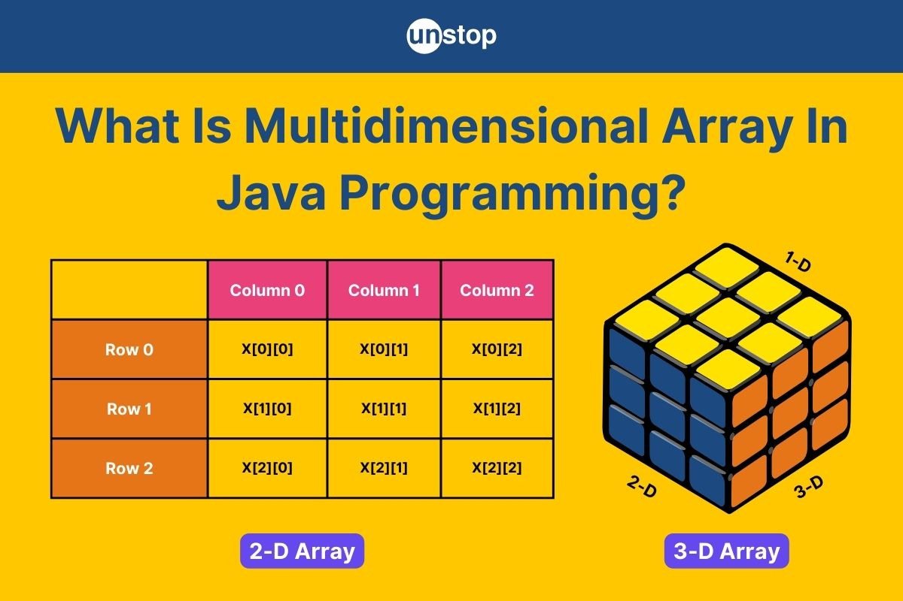

## مقدمه
این داکیومنت برای آشنایی با چند ساختمان داده (Data Structure) آشنا در زبان جاوا می‌باشد، قرار است یاد بگیریم که این ساختمان داده ها به طور کلی به چه نحوی عمل می‌کنند و چه توابعی برای کار کردن با آن‌ها وجود دارد.

## آرایه - Array
اگر بخواهید یک سری داده هم‌نوع را ذخیره کنید، می‌توانید برای هر کدام به طور جداگانه یک متغیر درست کنید و مقدار دهی کنید، اما این روش خیلی بهینه نیست! راه بهتر این است که از آرایه استفاده کنید. آرایه یک ساختار داده‌است که می‌تواند چندین مقدار هم‌نوع را داخل یک متغیر نگه دارد و مدیریت این داده‌ها را خیلی راحت‌تر می‌کند. شما مشابه این Data Structure را در زبان C هم دیدید.

بیایید ببینیم آرایه چه ویژگی‌هایی دارد و چطور کار می‌کند:
- **اندیس گذاری (Indexing):** همان‌طور که احتمالا از زبان C به یاد دارید، آرایه‌ها zero-based هستند، یعنی اولین عنصر آن‌ها اندیس ۰ دارد و آخرین عنصر آن‌ها اندیس $(n-1)$ خواهد داشت که $n$ همان اندازه‌ی آرایه‌ست. مثلاً اگر یک آرایه ۵تایی داشته باشیم، اندیس هایش از ۰ تا ۴ شماره‌گذاری می‌شوند.
- **اندازهٔ ثابت:** وقتی یک آرایه را می‌سازیم، اندازه‌‌اش همان موقع مشخص می‌شود و بعد از آن دیگر نمی‌توانیم آن را بزرگ‌تر یا کوچک‌تر کنیم.
- **نوع داده یکسان:** تمامی خانه‌های یک آرایه باید از یک نوع داده باشند، مثلاً اگر نوع دادهٔ آرایه `int` باشد، نمی‌توانیم داخل آن `String` یا `float` بگذاریم. همه‌ٔ اعضای آرایه باید با هم هم‌نوع باشند. حالا بیایید ببینیم که آرایه در جاوا به چه صورت کار می‌کند:

### تعریف آرایه در جاوا

حالا می‌خواهیم آرایه را تعریف کنیم، این کار را می‌توانیم به دو روش انجام بدهیم:

**تعریف آرایه بدون مقدار دهی اولیه:** در این حالت فقط نوع داده‌ای که می‌خواهیم ذخیره کنیم و اندازه‌ٔ آرایه مشخص می‌شود:
```java
int[] numbers = new int[5];
```

در کد بالا، یک آرایهٔ پنج عضوی تعریف کردیم، ولی مقادیر اولیهٔ اعضای آن را مشخص نکردیم. با این کار، اعضای آرایه مقدار دیفالت type خود را دراختیار می‌گیرند. مثلاً مقدار دیفالت یک متغیر `int` که مقداردهی نشده، صفر می‌باشد؛ به همین خاطر، اعضای آرایهٔ بالا همگی صفر هستند. این موضوع را می‌توانید با چاپ این آرایه بررسی کنید:

```java
for (int i = 0; i < numbers.length; i++) {  
    System.out.print(numbers[i] + ", ");  
}
```

خروجی کد بالا، به شکل زیر خواهد بود:

```
0, 0, 0, 0, 0,
```

مقادیر دیفالت typeهای عددی مثل `int`، `float` و غیره در جاوا صفر است. مقدار دیفالت `boolean` همان `false` بوده و مقدار دیفالت `char` هم `‘n\’` می‌باشد؛ اما مقدار دیفالت reference typeها همیشه `null` است که در مباحث مربوط به OOP راجع به آن‌ها مطالعه خواهید کرد.

**تعریف آرایه با مقدار دهی اولیه:** در این حالت مقادیر آرایه همان موقع که تعریف می‌کنیم مشخص می‌شوند.

```java
int[] numbers = {1, 2, 3};
```

### دسترسی به عناصر آرایه

بالاتر هم دیدید، در زبان C هم دیدید! برای دسترسی به عناصر یک آرایه، مثل کد زیر از index آن‌ها استفاده می‌کنیم:

```java
void main(String[] args) {
    int[] numbers = {1, 2, 3};
    int firstNumber = numbers[0];
    numbers[2] = 25;

    System.out.println(numbers);
}  
```

### پیمایش بر روی آرایه

حالا بیایید تک تک عناصر آرایه را با استفاده از اندیس و یک حلقه for چاپ کنیم.
```java
void main(String[] args) {
    int[] numbers = {1, 2, 3};
    for (int i = 0; i < numbers.length; i++) { 
    System.out.println("Index " + i + ": " + numbers[i]);
    }  
}  
```

ما، طول یک آرایه را با استفاده از `numbers.length` بدست می‌آوریم. به متغیرهایی مثل length، `variable` یا fieldهای یک کلاس می‌گویند که از متغیرهای مربوط به آن کلاس می‌باشد. با این متغیرها و انواع آن‌ها وقتی OOP را یاد گرفتید بیشتر آشنا خواهید شد. تا آن زمان، بیاید چندتا از متدها و فیلدهای پرکاربرد آرایه را بررسی کنیم:

### متدها و فیلدهای کاربردی مرتبط با آرایه
###### length

length طول آرایه را به شما نشان می‌دهد:

```java
int[] numbers = {1, 2, 3};
System.out.println("Array length: " + numbers.length); // Array length: 3
```

###### System.arraycopy

برای کپی کردن آرایه‌ها می‌توانید از متد `System.arraycopy()` استفاده کنید، می‌توانید با استفاده از کد زیر، که آرایهٔ‌ `numbers` را داخل `copiedArray` کپی می‌کند، این متد را بررسی کنید:
```java
int[] numbers = {1, 2, 3};
int[] copiedArray = new int[numbers.length];  
  
System.arraycopy(numbers, 0, copiedArray, 0, numbers.length);  
  
System.out.print("Copied array: ");
for (int i = 0; i < copiedArray.length; i++) {  
    System.out.print(copiedArray[i] + " ");  
}
```

خروجی این کد، به شکل زیر می‌باشد:
```
Copied array: 1 2 3
```

###### Arrays.sort
با استفاده از متد `Arrays.sort`، می‌توانید آرایه‌ها را سورت کنید. قبل از استفاده از آن، توجه کنید که حتماً پکیج (package) `java.util.Arrays` را `import` کرده باشید:

```java
import java.util.Arrays;   

void main(String[] args) { 
    int[] numbers = {5, 3, 8, 1, 2};
    System.out.println("Original array: " + Arrays.toString(numbers)); 

    Arrays.sort(numbers); 
    System.out.println("Sorted array: " + Arrays.toString(numbers));
}  
```

حال که آرایهٔ یک بعدی را یاد گرفته ایم، یک مرحله بالاتر برویم و در مورد آرایهٔ چند بعدی صحبت کنیم.

## آرایه‌های چندبعدی

آرایه‌های چندبعدی برای ذخیره و مدیریت داده‌های پیچیده‌تر به کار می‌روند. تصویر پایین هم یک مثال خوب از آرایهٔ دو بعدی را نشان می‌دهد:



در تصویر اول و سمت چپ تصویر دوم، شما یک آرایهٔ دوبعدی می‌بینید که هر کدام از عناصر آرایهٔ بیرونی، خود یک آرایه هستند. برای راحت‌تر فهمیدن، می‌توانید آرایهٔ دو بعدی را مثل یک ماتریس در نظر بگیرید.
درکنار آرایهٔ دوبعدی، شما آرایهٔ سه‌بعدی را می‌بینید که درواقع آرایه‌ای از آرایه‌های دوبعدی است؛ یعنی هرعنصر آن، خود یک آرایهٔ دوبعدی است.

### تعریف آرایه چند بعدی در جاوا

در ابتدا، نحوهٔ تعریف آرایه‌های دو بعدی و چند بعدی را تعریف می‌کنیم که مثل آرایهٔ یک‌بعدی، به دو روش مختلف می‌شود انجامش داد.

**تعریف آرایه دو بعدی و چند بعدی بدون مقدار دهی اولیه:** مثل قبل، می‌توانید بدون مقداردهی اولیه آرایه تعریف کنید و باز هم خانه‌های آرایه‌ها با مقدار دیفالت typeشان پر می‌شوند.

```java
// 2D array with 3 rows and 4 columns
int[][] matrix = new int[3][4];

// 3D array with 3 layers, each containing 3 rows and 3 columns
int[][][] cube = new int[3][3][3];  
  
System.out.println(matrix[0][0]); // 0
System.out.println(cube[0][0][0]); // 0
```

**تعریف آرایه دو بعدی و چند بعدی با مقدار دهی اولیه:** این روش هم، مشابه آرایه‌های یک بعدی هست:
```java
int[][] matrix = {  
        {1, 2, 3},  
        {4, 5, 6},  
        {7, 8, 9}  
};

int[][][] cube = {  
        {  
                {1, 2, 3},  
                {4, 5, 6}  
        },  
        {  
                {7, 8, 9},  
                {10, 11, 12}  
        }  
};
```

### دسترسی به عناصر آرایه‌های چند بعدی

مجدداً، با استفاده از اندیس‌ها مثل زبان C، می‌توانیم به عناصر آرایه‌های چندبعدی دست پیدا کنیم:

```java
int[][] matrix = {  
        {1, 2, 3},  
        {4, 5, 6},  
        {7, 8, 9}  
};  
  
int value1 = matrix[1][2];  
matrix[0][1] = 42;
```

### پیمایش آرایه‌های چند بعدی

حالا بیایید تک تک عناصر آرایه را با استفاده از اندیس و یک حلقهٔ for چاپ کنیم.

```java
void main(String[] args) { 
    int[][] matrix = {  
        {1, 2, 3},
        {4, 5, 6},
        {7, 8, 9}  
    };

    System.out.println("Matrix contents:");  
    for (int i = 0; i < matrix.length; i++) {
        for (int j = 0; j < matrix[i].length; j++) {  
            System.out.print(matrix[i][j] + " ");
        System.out.println();
        }  
    }  
}
```

تنها چیزی که داخل این کد، نسبت به کدی که برای آرایهٔ یک‌بعدی زدیم جدید است، متغیر j است که از صفر شروع می‌شود و تا `matrix[i].length` پیش می‌رود. `matrix[i].length`، در واقع طول $i$-امین آرایه‌ای است که توی matrix هست.

## ArrayList

تصور کنید که یک ساختمان داده داشته باشیم که شبیه آرایه باشد، ولی بتوانیم اندازه‌اش را هر موقع که خواستیم تغییر بدهیم. این ویژگی را ArrayList به ما می‌دهد. ArrayList، سایز متغیری دارد که آن را بر اساس مقادیر داخلش مشخص می‌کند و استفاده از آن خیلی شبیه به یک Array معمولی است. حالا می‌خواهیم یک Array List بسازیم و سپس مهم‌ترین متدهایی که دارد را توضیح بدهیم.

### reference typeهای معادل primitive typeها در جاوا

برای هر primitive type توی جاوا، مثل `int`، `boolean`، `char` و امثال آن‌ها، یک معادل از جنس reference type وجود دارد. وقتی که با مفهوم objectها بیشتر آشنا بشویم، این موضوع را مجددا بررسی می‌کنیم، ولی چون برای `ArrayList` به آن‌ها نیاز داریم، لازم است که یک نگاه مختصر به آن‌ها بیندازیم.

کد زیر، یک متغیر `int` ساده تعریف می‌کند:

```java
int num = 10;
```

ما می‌توانیم این متغیر را، به جای `int`، از جنس `Integer` تعریف کنیم:

```java
Integer num = 0;
```

تنها تفاوت این دو، این است که `Integer`، reference typeای است که معادل `int` می‌باشد. کامپایلر شما حتی به شما این اجازه را می‌دهد که با متغیری از جنس `Integer` مثل یک `int` برخورد کنید:

```java
int a = 10;  
Integer b = a;  
int c = a + b;  
  
System.out.println(a);  
System.out.println(b);
```

در مورد این که چرا وقتی `int` را داریم، به `Integer` هم نیاز داریم بعدا توضیح خواهیم داد. برای الآن کافی است بدانید که این reference typeها وجود دارند و تا حد خیلی خوبی هم معادل همتای primitive typeشان هستند. فهرست کامل آن‌ها در جدول زیر آمده است:

| Primitive Type | Reference Type (Wrapper Class) |
| -------------- | ------------------------------ |
| `boolean`      | `Boolean`                      |
| `byte`         | `Byte`                         |
| `char`         | `Character`                    |
| `short`        | `Short`                        |
| `int`          | `Integer`                      |
| `long`         | `Long`                         |
| `float`        | `Float`                        |
| `double`       | `Double`                       |


در `ArrayList` ها، ما از این reference type ها استفاده می‌کنیم.

### ساخت اولین ArrayList

اول از همه باید package مربوط به `ArrayList` را `import` کنیم.

```java
import java.util.*;
```

سپس، با تکه کد زیر می‌توانیم یک `ArrayList` از `Float`ها و `Integer`ها تعریف کنیم:

```java
void main(String[] args) {  
    ArrayList<Integer> intNumbers = new ArrayList<Integer>();  
    ArrayList<Float> floatNumbers = new ArrayList<Float>();  
}  
```

دقت کنید که شما نمی‌توانید `ArrayList`ای از جنس primitive type تعریف کنید. به همین خاطر است که ما از `Integer` و `Float` استفاده کردیم. چیزی که بین `<` و `>` جلوی ArrayList می‌آید، جنس چیزی هست که داخل ArrayList نگه می‌دارید.

شما می‌توانید تایپ کامل `ArrayList` را مقابل کلیدواژهٔ `new` ننویسید و داخل `<>` را خالی بگذارید، چون که قبل از اسم متغیر، تایپ آن را کامل مشخص کردید:

```java
ArrayList<Integer> numbers = new ArrayList<>();
```

یا این که به کل از `var` استفاده کنید:

```java
var numbers = new ArrayList<Integer>();
```

### متدهای ArrayList

###### add

برای اضافه کردن عناصر به `ArrayList` از این متد استفاده می‌کنیم. می‌توانید به دو شکل زیر به یک `ArrayList` عنصر اضافه کنید:

**اضافه کردن به آخر لیست:** کد زیر به خوبی به شما نشان می‌دهد که چگونه می‌توانید از ساده‌ترین نوع `add` استفاده کنید.

```java
import java.util.ArrayList;  
  
void main(String[] args) {
    ArrayList<Integer> numbers = new ArrayList<Integer>();

    numbers.add(10);
    numbers.add(20);
    numbers.add(30);
    numbers.add(40);
        
    System.out.println(numbers); // Output: [10, 20, 30, 40]    
}  
```

همچنین می‌توانید، به جای این که از چندتا `add` استفاده کنید تا مقداردهی اولیهٔ آرایه‌تان را انجام بدهید، آن را به این شکل تعریف کنید:

```java
ArrayList<Integer> numbers = new ArrayList<>(Arrays.asList(1, 3000, 40));  
System.out.println(numbers); // Output: [1, 3000, 40]
```

با این کار، لازم نیست تا برنامه‌تان را پر از `add` بکنید.

**اضافه کردن در یک ایندکس مشخص از لیست:** می‌توانید با استفاده از متد زیر، به یک جای مشخص از `ArrayList` یک عنصر را اضافه کنید.

```java
ArrayList<Integer> numbers = new ArrayList<>(Arrays.asList(1, 3000, 40));  
System.out.println(numbers); // Output: [1, 3000, 40]

numbers.add(1, 15);  
System.out.println(numbers); // Output: [1, 15, 3000, 40]
```

###### remove

می‌توانیم با ورودی دادن index عنصر دلخواهمان، آن را از آرایه پاک کنیم:

```java
ArrayList<Character> letters = new ArrayList<>(Arrays.asList('A', 'B', 'C', 'D', 'E', 'F'));  
letters.remove(2); // Removes the third element of letters

System.out.println(letters); // Output: [A, B, D, E, F]
```

###### get

این متد برای دسترسی به یک عنصر بر اساس index آن استفاده می‌شود و شبیه `arr[i]`ای است که در Array دیده بودیم:

```java
var specialNumbers = new ArrayList<Double>(Arrays.asList(3.14, 2.71));
var pi = specialNumbers.get(0);  
  
System.out.println(pi); // Output: 3.14
```

###### size

این متد تعداد عناصر موجود در لیست را برمی‌گرداند.

```java
var names = new ArrayList<String>(Arrays.asList("Negin", "Paria", "Kiana"));

for (int i = 0; i < names.size(); i++) {  
    System.out.println(i + ". " + names.get(i));  
}
```

###### set

برای تغییر مقدار یک عنصر در یک ایندکس خاص از این متد استفاده می‌شود.

```java
var names = new ArrayList<String>(Arrays.asList("Negin", "Paria", "Kiana"));  
System.out.println(names); // Output: [Negin, Paria, Kiana]  
  
names.set(1, "Dorsa");  
System.out.println(names);// Output: [Negin, Dorsa, Kiana]
```

## کلاس استرینگ در جاوا

اکنون می‌خواهیم با یکی از مهم‌ترین کلاس‌های جاوا آشنا شویم. استرینگ در جاوا آرایه‌ای از کارکترهاست که به صورت زیر و با `""` تعریف می‌شود.

```java
void main(String[] args) {  
    String str = "write your string here";
}  
```

### متدهای کلاس استرینگ

اکنون در کد خود یک رشته به صورت گفته شده تعریف کنید. در زیر چندین متد مهم از کلاس استرینگ گفته شده است. آن‌ها را بر روی رشته ی خود اجرا کنید و کاربردهای گوناگون آنها را ببینید.

###### charAt

فرض کنید می‌خواهیم به بخش‌های گوناگون یک رشته دسترسی یابیم. متد `charAt()` برای انجام این کار به ما کمک می‌کند. این متد کارکتر موجود در ایندکس مشخص شده از رشته را برمی‌گرداند.

```java
String str = "write your string here";  
str.charAt(3); //returns t
```

###### toCharArray

این متد در هنگامی استفاده می‌شود که نیاز داریم روی هر کارکتر یک رشته عملیات خاصی انجام دهیم. این متد یک رشته را به آرایه‌ای از کارکترها تبدیل می‌کند.

```java
String str = "Hello";  
char[] charArray = str.toCharArray();  
for (int i = 0; i < charArray.length-1; i++) {  
    System.out.print(charArray[i] + ",");
}  
System.out.print(charArray[charArray.length-1]);
```

خروجی این کد `H,e,l,l,o` است.

###### concat

به انتهای رشته، رشته‌ٔ مشخص شده را اضافه می‌کند.

```java
String str = "Hello";  
String name = " Negin";  
str.concat(name); //returns Hello Negin
```

یک روش دیگر نیز برای افزودن رشته‌ها به یکدیگر وجود دارد:

```java
String str = "Hello";  
String name = " Paria";  
String result = str + name;  
System.out.println(result);
```

خروجی این کد`Hello Paria` است.

###### contains

خروجی این متد `Boolean` است. بررسی می‌کند که آیا در درون رشته، رشته‌ٔ مشخص‌شده وجود دارد یا خیر. اگر وجود داشته باشد `true` و در غیر این صورت `false` را برمی‌گرداند.

```java
String str = "Gharakhani’s house";  
str.contains("house");
```

###### endsWith

متد دیگری که بررسی می‌کنیم متد `endsWith()` است. این متد بررسی می‌کند که آیا رشته با عبارت مشخص‌شده پایان یافته است یا خیر.

```java
String str = "write your string here";  
str.endsWith("here");
```

###### startsWith

متد `startsWith()` مشابه متد قبلی است. بررسی می‌کند که آیا رشته با عبارت مشخص‌شده شروع یافته است یا خیر.

مثلاً فرض کنید شما در برنامه‌‌ از کاربران شماره تلفنشان را می‌خواهید. میتوانید با این متد بررسی کنید که شماره فرمت درستی دارد و با 091 شروع شده است یا خیر.

###### equals

دو رشته را باهم مقایسه می‌کند. اگر برابر بودند `true` را برمی‌گرداند و در غیر این صورت `false` را برمی‌گرداند.

```java
String str = "AmirKabir University";  
String sample= "University";  
str.equals(sample); //returns false  
str.equals("AmirKabir University"); //returns true
```

###### indexOf

اولین جایگاه کارکتر مشخص‌شده در رشته را برمی‌گرداند. اگر کارکتر در استرینگ وجود نداشت $-1$ برمی‌گرداند.

```java
String str = "write your string here";  
str.indexOf('t'); //returns 3  
str.indexOf('f'); //returns -1
```

###### length

این متد بسیار کاربردی نیز، طول استرینگ داده شده را برمی‌گرداند.

```java
String str = "write your string here";  
str.length(); //returns 22
```

###### split

این متد رشته را با استفاده از کارکتر داده شده به بخش‌های جداگانه تقسیم می‌کند و نتیجه را به صورت یک آرایه بازمی‌گرداند.

```java
String str = "pizza,pasta,burger";  
String[] arr = str.split(",");  
System.out.println(arr[1]);
```

خروجی این کد `pasta` است.

میتوانید کلماتی که میان آنها فاصله است را نیز با استفاده از این متد جدا کنید.

```java
String str = "pizza pasta burger";  
String[] arr = str.split(" ");  
System.out.println(arr[1]);
```

خروجی این کد نیز `pasta`است.

###### substring

در پایان با یکی از کاربردی ترین متد های کلاس استرینگ آشنا می‌شویم. این متد از ایندکس اولیه‌ٔ داده شده (`begIndex`) تا قبل از ایندکس پایانی (`endIndex`) رشته را باز می‌گرداند. میتوانید `endIndex` را نگذارید و آنگاه تا اخر رشته برگردانده میشود. اکنون چند مثال از این متد می‌بینیم:

```java
String str = "just keep swimming";  
String result = str.substring(5,9);  
System.out.println(result);
```

خروجی این کد `keep` است.

اما اگر ایندکس پایانی را مانند مثال زیر نگذاریم:

```java
String str = "just keep swimming";  
String result = str.substring(5);  
System.out.println(result);
```

در اینجا تا پایان رشته گرفته شده و `keep swimming` در خروجی چاپ می‌شود.


حال با مهم ترین متدهای کلاس استرینگ آشنا شدید. این کلاس متدهای بسیار زیاد و گوناگونی دارد که در [این صفحه](https://www.w3schools.com/java/java_ref_string.asp) می‌توانید با برخی دیگر از این متدها آشنا شوید.

حال بیایید یک سوال ساده را با استفاده از متدهایی که یاد گرفتیم حل کنیم.

### سوال `Wow!`

نگین که از کد زدن خسته شده است، به تازگی به رشته‌ٔ مهندسی برق علاقه پیدا کرده است. به همین دلیل تصمیم گرفته است تا درباره‌ٔ این رشته تحقیق کند. او به افراد مختلف مراجعه می‌کند و هرکدام یک مقدار اطلاعات به او می‌دهند. او به اندازه‌ی مقدار اطلاعاتی که از هر فرد می‌گیرد، متعجب می‌شود. مثلا اگر یک عدد اطلاعات بگیرد می‌گوید `Wow!`، اگر سه تا اطلاعات بگیرد میگوید `Wooow!` و به همین شکل تعداد `o` ها زیاد میشود. حال اگر یک نفر به اندازه‌ی `n` اطلاعات به نگین بدهد، ما باید انتظار چه کلمه‌ای را از او داشته باشیم؟

سعی کنید سوال بالا را با متدهایی که آموزش دیده‌اید حل کنید. برای مثال می‌توانید در هر مرحله با استفاده از متد `substring()` بخش `W` ابتدایی را جدا کرده و در هر مرحله با استفاده از متد `concat()` یک `o` به آن بیافزایید. این کار را `n-1` بار تکرار کنید. رشته‌ی نهایی پاسخ ما است.

## HashMap

فرض کنید می‌خواهیم نام دانشجویان و شماره دانشجویی آن‌ها را در یک Data Structure ذخیره کنیم. می‌خواهیم به سرعت و راحتی به آن‌ها دسترسی داشته باشیم و در عین حال دانشجویان را از هم تفکیک کنیم. باتوجه به آن که هر دانشجو یک شماره دانشجویی یکتا دارد، ما از یک Data Structure که از این ویژگی بهره می‌برد استفاده می‌کنیم. کلاس HashMap یکی از نمونه‌های خوب این گونه ساختمان داده‌هاست.

در این بخش، هدف ما آشنایی شما با مفهوم و کاربردهای کلاس دیکشنری است. دیکشنری یک نوع ساختار داده است که برای ذخیره کلید (key) و مقدار (value) استفاده می‌شود. برای مثال یک دفترچه تلفن را در نظر بگیرید. اسم افراد نقش `key` و شماره تلفنشان نقش `value` را دارد. مثلا به برنامه می‌گویید که کلید `Paria` مقدار `09123456789` دارد. کلیدها یکتا (unique) هستند. مثلا شما دو کلید `Paria` نمی‌توانید داشته باشید.

### تعریف HashMap

در جاوا، به شکل زیر می‌توانید یک HashMap، که جنس `key`های آن `String` و جنس `value`هایش `Integer` است تعریف کنید:

```java
import java.util.HashMap;

void main(String[] args) {  
    HashMap<String,Integer> studentId = new HashMap<>();
}  
```

حال، می‌توانید با استفاده از متد `put`، به این `HashMap` مقادیر دلخواه خود را اضافه کنید:

```java
studentId.put("Negin", 13001);  
studentId.put("Paria", 13002);
```

بعد از اجرای کد بالا، هش‌مپ ما، عدد `13001` را برای کلید `Negin` و عدد `13002` را برای `Paria` ذخیره کرده است. ما می‌توانیم با استفاده از متد `get` و ورودی دادن کلید دلخواهمان، مقدار متناظر با آن کلید را به دست بیاوریم:

```java
var neginStudentId = studentId.get("Negin");  
System.out.println(neginStudentId); // Output: 13001
```

اگر کلیدی در HashMap وجود نداشته باشد و ما آن را به عنوان ورودی به متد `get` بدهیم، خروجی این متد برای ما `null` است. `null`، مقدار خاصی برای reference typeهاست که نشان می‌دهد که آن‌ها هنوز وجود ندارند و با آن در OOP بیشتر آشنا می‌شویم:

```java
System.out.println(studentId.get("Yasin")); // Output: null
```

برای این که چک کنیم که هش‌مپ‌مان کلیدی را دارد یا نه، از `containsKey` استفاده می‌کنیم:

```java
if (studentId.containsKey("Paria")) {  
    System.out.println("Paria: " + studentId.get("Paria"));  
} else {  
    System.out.println("Cannot find Paria");  
}
```

### کاربردهای HashMap

حال بیایید چند مثال و کاربرد از کلاس دیکشنری ببینیم تا به درک بهتری از آن برسیم.

1.  پیدا کردن سریع داده‌ها: میتوانید با دادن `key` خیلی سریع `value` آن را پیدا کنید. در درس ساختمان داده خواهید دید که این کار، بسیار سریع تر از گشتن در یک آرایه است:

```java
HashMap<String,Integer> studentId = new HashMap<>();  
  
studentId.put("Negin",13001);  
studentId.put("Paria",13002);

var neginStudentId = studentId.get("Negin"); // neginStudentId = 13001
```

1.  شمارش تعداد دفعات تکرار کلمات: با هر بار دیدن کلمه در متن `value` تغییر داده شود و یک عدد به آن اضافه شود.

```java
HashMap<String,Integer> studentCredit = new HashMap<>();  
  
studentCredit.put("Negin",0);  
studentCredit.put("Paria",0);  
  
String creditsList = "Paria,Negin,Paria";  
  
String[] gotCreditStudent = creditsList.split(",");
for (String studentName : gotCreditStudent){
    int temp = studentCredit.get(studentName);  
  
    studentCredit.put(studentName, temp + 1);  
}  
  
System.out.println("Paria's Credit: " + studentCredit.get("Paria"));  
System.out.println("Negin's Credit: " + studentCredit.get("Negin"));
```

حلقهٔ `for` استفاده شده در اینجا به صورت enhanced for loop است که اگر اکنون با آن آشنایی ندارید پس از به پایان رساندن Document برگردید و این کد را دوباره مطالعه کنید.

3.  نگهداری ارتباط بین دو مجموعه داده: برای مثال `key` نام دانش‌آموز و `value` مجموعه نمراتش باشد.
4.  گروه‌بندی داده‌ها: برای مثال `key` الکترونیک و `value` لیست محصولات الکترونیک (لپ تاپ، تلفن همراه و ...) باشد.

## enhanced for loop

حالا فرض کنید وقتی داریم یک آرایه یا هر ساختمان دادهٔ دیگه‌ای را پیمایش می‌کنیم و فقط به مقدار آن عنصر نیاز داریم و اصلاً کاری به ایندکسش نداریم. یعنی تمرکز ما بیشتر روی خود مقدار عنصر است تا ایندکسش. در این مواقع می‌توانیم از enhanced for loop استفاده کنیم.

در واقع، دستور enhanced for loop همان حلقه `for` معمولی است که تعدادی تغییرات در ساختار آن ایجاد کردیم. یکی از مهم‌ترین تفاوت‌هایش این است که در enhanced for loop تمرکز بیشتر روی مقدار و ارزش هر عنصر است. این دستور برای پیمایش آرایه‌ها، `ArrayList` و ... استفاده می‌شود.

بگذارید با یک مثال بهتر توضیح دهیم:

```java
void main(String[] args) {
    // An array of fruits
    String[] fruits = {"Apple", "Banana", "Orange"};

    // Iterate over the array using for-each loop
    for (String fruit : fruits) {
        // Print each fruit
        System.out.println(fruit);
    }  
}  
```

در اینجا متغیر `fruits` آرایه ای از رشته‌ها است که در آن سه عنصر وجود دارد. این حلقه `for` جوری کار می‌کند که از اولین عنصر شروع می‌کند و یکی‌یکی تمام مقدارهای داخل آرایه را می‌گیرد. در هر دور از حلقه، مقدار `fruit` برابر با یکی از عناصر آرایه می‌شود (مثلاً در دور اول `Apple`، دور دوم `Banana` و دور سوم `Orange`). بعد، مقدار `fruit` چاپ می‌شود. همان‌طور که دیدیم، توی این مدل `for` که به آن enhanced for loop هم می‌گویند، بیشتر روی مقدار عنصر تمرکز داریم تا ایندکسش.
