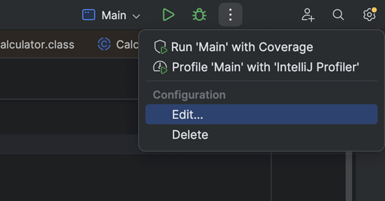
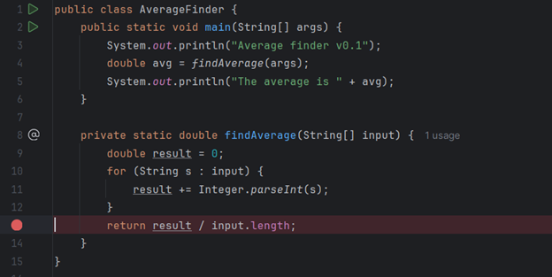
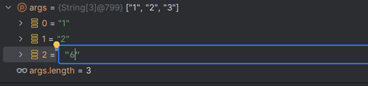
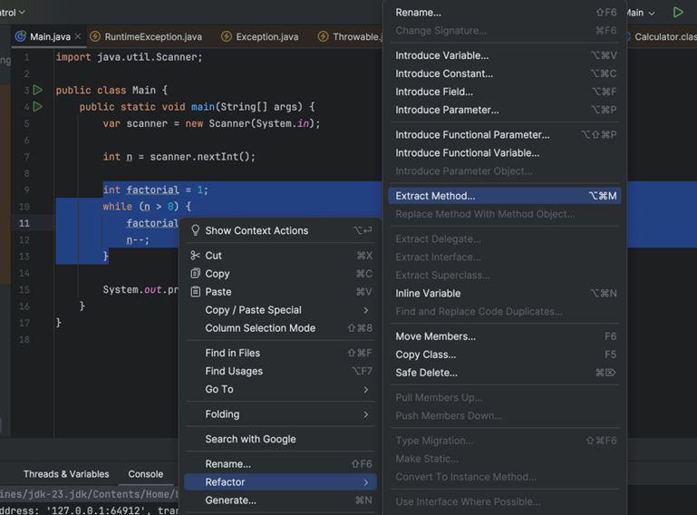
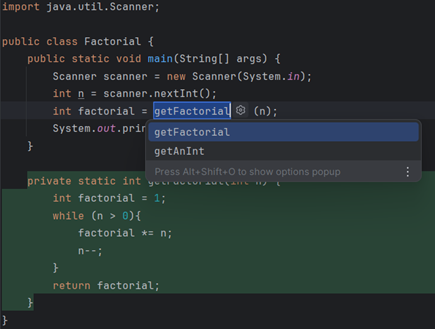

## مقدمه

اگه از ابزارهای یه IDE درست استفاده کنین، سرعت و دقتتون توی حل مسائل خیلی بیشتر می‌شه. IntelliJ IDEA کلی قابلیت کاربردی داره که هم کدنویسی رو براتون راحت‌تر می‌کنه، هم کمک می‌کنه باگ‌ها و مشکلات برنامه رو سریع‌تر پیدا و برطرف کنین.

توی این داک، چند تا از پرکاربردترین ابزارهای IntelliJ IDEA رو بررسی می‌کنیم، مخصوصاً Debugger. هدف اینه که با یاد گرفتن این ابزارها، بتونین سریع‌تر، هوشمندانه‌تر و بهینه‌تر کدنویسی کنین و توسعه نرم‌افزار رو راحت‌تر پیش ببرین.

## دیباگر

### دیباگینگ چیست؟

به طور خلاصه debugging فرآیند شناسایی و تصحیح خطاها (bug) در یک برنامه است.

باگ‌ها انواع مختلفی دارن و موقع کدنویسی ممکنه با بعضی از اون‌ها روبه‌رو بشین. بعضی، مثل Syntax Error‌ها، راحت برطرف می‌شن چون کامپایلرهای امروزی سریع پیداشون می‌کنن و بهتون نشون می‌دن. اما پیدا کردن منبع و رفع ارورهایی مثل ارورهای منطقی می‌تونه واقعا سخت و خسته‌کننده باشه، چون کامپایلر بهتون نمی‌گه مشکل کجاست و باید خودتون دنبالش بگردین.

فرض کنین توی یه برنامه بزرگ، یه اشتباه منطقی کوچیک—مثلا مشکل توی شرط‌ها یا مقداردهی اولیه اشتباه—باعث بشه خروجی برنامه درست کار نکنه. این نوع ایرادها ممکنه تا مدت‌ها پیدا نشن و حسابی برنامه‌نویس رو به دردسر بندازن، چون هیچ ارور مشخصی نمی‌دن و پیدا کردنشون یه چالش اساسی می‌شه.

اینجاست که دیباگر به دادمون می‌رسه! این ابزار امکاناتی مثل متوقف کردن برنامه توی یه نقطه مشخص، بررسی مقدار متغیرها، آنالیز وضعیت برنامه و اجرای مرحله‌به‌مرحله کد رو در اختیارتون می‌ذاره. با این قابلیت‌ها، می‌تونین باگ‌ها رو خیلی سریع‌تر و بهینه‌تر پیدا و برطرف کنین.

### اولین برنامه خود را دیباگ کنید

بیاید با استفاده از دیباگر، باگ یک برنامهٔ ساده رو پیدا کنیم. برنامهٔ زیر رو توی IntelliJ کپی کنید:

```java
public class AverageFinder {
    public static void main(String[] args) {  
        System.out.println("Average finder v0.1");
        double avg = findAverage(args);  
        System.out.println("The average is " + avg);  
    }

    private static double findAverage(String[] input) {
        double result = 0;
        for (String s : input) {  
            result += Integer.parseInt(s);  
        }
        return result;  
    }  
}
```

توی داکیومنت "شروع برنامه نویسی با جاوا" از جلسهٔ صفر، با Command-Line Arguments آشنا شدید و اینجا قراره ازش استفاده کنیم. اگر یادتون رفته حتما مرورش کنین. این برنامه، قراره میانگین تمامی مقادیر `args` رو محاسبه کند.

برنامه بدون هیچ مشکلی کامپایل و اجرا می‌شه، ولی خروجی اون چیزی نیست که انتظار داشتیم. مثلا وقتی ورودی 1 2 3 رو می‌دیم، خروجی 6 رو به ما نشون می‌ده، که غلطه.

قبل از هر کاری، باید به این فکر کنین که این باگ از کجا اومده. توی این مثال، مشخصه که مشکل از دستور پرینت نیست، بلکه متد `findAverage` خروجی اشتباهی برمی‌گردونه. برای اینکه بفهمین دقیقا کجای کار ایراد داره، می‌تونین از Debugger استفاده کنین و کد رو خط به خط متوقف و بررسی کنین تا منبع مشکل رو پیدا کنین.

برای پیدا کردن باگ، باید برنامه رو وقتی به قسمتی می‌رسه که جواب غلط تولید می‌کنه متوقف کنیم. این کار با تنظیم بریکپوینت (breakpoint) ممکنه. بریکپوینت‌ها خطوطی از برنامه هستن که در اون‌ها برنامه متوقف می‌شه و می‌تونیم وضعیت رو بررسی کنیم.

روی نوار کناری خطی که در آن متد `findAverage` صدا زده شده، روی شماره اون خط کلیک کنید تا یک دایره قرمز کنار اون نمایش داده بشه. این دایرهٔ قرمز، `breakpoint` ماست:


بیاین با هم این برنامه رو یک بار اجرا کنیم. علاوه بر تنظیم Command-Line Arguments از طریق ترمینال که قبلاً باهاش آشنا شدین، می‌تونین این آرگیومنت‌ها رو مستقیماً از طریق خود IntelliJ به برنامه ورودی بدین.

1.  روی سه نقطهٔ کنار Run در نوار بالا کلیک کنید، از بخش configuration، گزینهٔ edit را انتخاب کنید:

  
  

2.  مقادیر `3 2 1` را در فیلد Program arguments وارد کنید. این کار، درست مثل اینه که برنامه را با دستور `java Main 1 2 3` اجرا کنید.

برای ذخیره تغییرات روی OK کلیک کنید. از این به بعد هر وقت برنامه رو اجرا کنید، این`1 2 3` رو می‌تونید توی `args` ببینید.


با کلیک روی آیکون بالا، برنامه رو در حالت دیباگ اجرا کنین. وقتی برنامه رو توی این حالت اجرا می‌کنید، به طور عادی پیش می‌ره تا به breakpoint که تنظیم کردید برسه (اصطلاحا، breakpoint شما hit بشه). وقتی این اتفاق افتاد، IntelliJ برنامه رو متوقف می‌کنه، خط breakpoint هایلایت می‌شه و پنجرهٔ ابزارهای دیباگ در پایین صفحه باز می‌شه. در این لحظه، خط هایلایت شده هنوز اجرا نشده:


حالا برنامه منتظر دستورات شما برای ادامه اجراست. در این لحظه، می‌تونین مقادیر فعلی متغیرهای برنامه رو توی پنجره ابزارهای دیباگ مشاهده کنین. چون متد `findAverage` هنوز صدا زده نشده، متغیرهای local اون (مثل `result`) هنوز وارد کار نشده‌اند، اما می‌تونیم آرایه `args` و محتوای اون رو بررسی کنیم:


هنگام کار با ابزار دیباگر شما می‌توانید متغیر های اسکوپ فعلی را در تب Threads & Variables در پنجره ابزار های دیباگ مشاهده کنید. همچنین می‌تونین خروجی برنامه‌تون تا اون لحظه رو توی منوی Console که دقیقا کنار اونه ببینین.

حالا برای ادامه فرآیند دیباگ، باید وارد متد `findAverage` بشیم و داخل اون رو بررسی کنیم. برای وارد شدن به متدها، فقط کافیه روی دکمهٔ Step Into (که با فلشی به سمت پایین مشخص شده) کلیک کنین:


خط هایلایت شده تغییر می‌کنه چون وارد متد `findAverage` شدیم:


با زدن دکمهٔ Step Over (که با فلشی رو به جلو مشخص شده) می‌تونید به خطوط بعدی برنامه برید:


اگر دو-سه بار این کار را تکرار کنید، از داخل `for` سر در میارید:


متد `Integer.parseInt` با گرفتن یک رشته، اون رو به یه عدد تبدیل می‌کنه. وقتی از این متد استفاده می‌کنید، دقت کنین که اگه رشته ورودی چیزی غیر از عدد باشه، برنامه با خطا مواجه می‌شه.

در این لحظه، همون‌طور که دیباگر نشون می‌ده، متغیر `s` شامل رشته `"3"` است. این رشته بعد از تبدیل به `Integer` با مقدار متغیر `result` که در حال حاضر `3.0` هست جمع می‌شه. تا اینجا، جمع تمامی ورودی‌ها بدون هیچ مشکلی انجام شده.

با یکی-دو قدم جلوتر رفتن به دستور `return` می‌رسیم و می‌تونیم متوجه اشتباه پیش اومده بشیم. متد ما مقدار متغیر `result` که `6.0` هست رو بدون تقسیم بر تعداد ورودی‌ها به عنوان خروجی می‌ده. برای رفع این باگ، کافیه دستور `return` رو با دستور زیر جا به جا کنیم.

```java
return result / input.length;
```

بعد از اتمام عملیات دیباگ میتوانیم با Resume کردن برنامه به برنامه اجازه ادامه را اجرا بدهیم. برای این کار روی دکمهٔ مثلثی مشخص شده توی عکس زیر کلیک کنین:


حال با اجرای مجدد برنامه خروجی، خروجی دلخواه ماست. ولی هنوز یک مشکل وجود داره.

با خالی بودن Command-Line Arguments، خروجی برنامه به شکل روبرو خواهد بود:

```bash
Average finder v0.1  
The average is NaN
```

برای رفع این باگ، بیاید دوباره برنامه رو دیباگ کنیم. بریکپوینت رو روی خط زیر بذارید و برنامه رو در حالت دیباگ دوباره اجرا کنید.




بعد از اجرای برنامه، طبق انتظار در نقطه مشخص شده متوقف می‌شه و متغیرهای برنامه در پنجره ابزارهای دیباگ قابل مشاهده هستند.


هر دو متغیر `result` و `input.length` دارای مقدار صفر هستن.

واضحه که مقدار صفر تقسیم بر صفر نمی‌تونه یک عدد باشه، بنابراین این متد مقدار `NaN` که مخفف عبارت Not a Number هست رو به عنوان خروجی می‌ده. برای رفع این باگ، کافیه با تغییر بدنه متد main به قطعه کد زیر از ناتهی بودن آرگومان‌های ورودی مطمئن بشیم:

```java
if (args.length != 0) {
    double avg = findAverage(args);  
    System.out.println("The average is " + avg);  
{ else {  
    System.out.println("Input is empty");  
}
```

### Evaluate Expression در Debugger

حالا که با دیباگر آشنا شدین، بیاید با چند ابزار پرکاربرد دیباگر هم آشنا بشیم. مثل قبل، مقادیر `1`، `2` و `3` رو به برنامه ورودی بدین و breakpoint‌ها رو به شکل زیر تنظیم کنید:


بعد از اجرای برنامه در حالت دیباگ، می‌تونید مقادیر مختلفی رو با استفاده از ابزار Evaluate Expression در تب Variables وارد کنید. برای مثال، می‌تونید با وارد کردن `findAverage(args)` و فشردن Enter، مقدار میانگین رو قبل از محاسبه توسط برنامه محاسبه و بررسی کنید.

همچنین می‌تونید با کلیک راست روی یک متغیر و استفاده از ابزار Set Value مقدار متغیرها رو تغییر بدید. برای مثال، می‌تونید با باز کردن آرایه `args` مقدار عنصر سوم اون رو تغییر بدید:



حال با وارد کردن مجدد اکسپرشن گفته شده می‌تونید متوجه تغییر در میانگین بشید، چون آرایهٔ `args` رو عوض کردین:


## Refactoring

Refactor کردن یعنی بهتر کردن کد و تغییرات در ساختار اون بدون اینکه عملکردش تغییر کنه. ابزارهای Refactor به ما کمک می‌کنن تا کد تمیزتر و خواناتری داشته باشیم. در این بخش با ابزارهای ابتدایی ولی پرکاربرد اون آشنا می‌شید.

با کلیک راست روی یکی از خطوط کدتون و رفتن به تب Refactor می‌تونید تمام ابزارهای Refactoring رو ببینید و امتحان کنید:


### Rename

شاید برای شما پیش اومده که قصد تغییر نام یک متغیر یا متد در یک برنامه رو داشتید. تغییر دستی اسم متغیر در برنامه‌های بزرگ کاری زمان‌گیر است. از طرفی، یه اشتباه کوچک می‌تونه کل برنامه رو دچار باگ کنه.

برای راحت‌تر تغییر نام یک متغیر، تابع، یا هر اسم دیگه‌ای، می‌تونید از ابزارهای refactoring ادیتور IntelliJ استفاده کنید. مثلا، کدی که موقع کار با ابزار دیباگر دیباگ می‌کردین رو در نظر بگیرید:

```java
public class Main {
    public static void main(String[] args) {  
        System.out.println("Average finder v0.1");
        double avg = findAverage(args);  
        System.out.println("The average is " + avg);  
    }

    private static double findAverage(String[] input) {
        double result = 0;
        for (String s : input) {  
            result += Integer.parseInt(s);  
        }
        return result / input.length;  
    }  
}
```

فرض کنید که ما از اسم `result` برای متغیری که توی `findAverage` تعریف شده خوشمون نمیاد. برای تغییر اسم اون، روی اسمش کلیک راست کنید، Refactor رو انتخاب کنید و بعد Rename رو بزنید:


اسم جدید متغیرتون رو انتخاب کنید، مثلا من این‌جا اسم avg رو انتخاب کردم:


نهایتاً enter بزنید. می‌بینید که نه تنها اسم خود متغیر، که تمام جاهایی که از اون استفاده شده هم عوض شدن. با این روش، بدون هیچ تلاش خاصی، می‌تونید اسم متغیرها رو عوض کنید. می‌تونید حتی اسم توابع، کلاس‌ها یا کلا هر چیزی که اسم داره رو هم به شکل مشابه عوض کنید.

### Extract Method

با این ابزار می‌تونید قطعات مختلف کد خود رو استخراج کرده و به متد تبدیل کنید. این ابزار به صورت هوشمند نوع ورودی‌ها و خروجی متد رو مشخص کرده و قطعه کد رو با یک متد جایگزین می‌کنه.

برنامه زیر فاکتوریل مقدار ورودی رو محاسبه می‌کنه:

```java
import java.util.Scanner;

public class Main {
    public static void main(String[] args) {
        var scanner = new Scanner(System._in_);

        int n = scanner.nextInt();

        int factorial = 1;
        while (n > 0) {  
            factorial *= n;  
            n--;  
        }  
  
        System.out.println(factorial);  
    }  
}
```

فرض کنید در ادامه برنامه دوباره نیاز به محاسبه فاکتوریل یک مقدار داشتیم. از طرفی، همون‌طور که توی داکیومنت بخش اول Clean Code دیدید، پیاده‌سازی دوباره محاسبه فاکتوریل با تکرار کردن کد اصول کلین کد رو زیر پا می‌ذاره. پس بهتره که یه تابع جدا برای محاسبهٔ فاکتوریل ایجاد کنیم. در اینجا ابزار Extract Method به کمک ما میاد.

با استفاده از این ابزار می‌تونیم بخش مربوط به محاسبه فاکتوریل رو به یک متد جدا تبدیل کنیم، که این کار باعث می‌شه کد ما تمیزتر، خواناتر و قابل نگهداری‌تر بشه.

تیکه کدی که توش فاکتوریل حساب می‌کنیم رو سلکت کنید، کلیک راست کنید، سپس Refactor و بعد Extract Method رو انتخاب کنید. این کار باعث میشه که اون بخش از کد به یک متد جدا تبدیل بشه و کد شما تمیزتر و منظم‌تر بشه:




بعدش، اسم این متد رو مشخص کنید و enter بزنید:



تابع جدید شما درست می‌شه و می‌تونید توی باقی کدهاتون ازش استفاده کنید:

```java
private static int getFactorial(int n) {
    int factorial = 1;
    while (n > 0) {  
        factorial *= n;  
        n--;  
    }
    return factorial;  
}
```

## Code Navigation

در پروژه‌های بزرگ، جابه‌جایی سریع و مؤثر بین بخش‌های مختلف کد امری ضروریه. IntelliJ IDEA با ارائه ابزارهای Code Navigation این امکان رو به شما می‌ده که نه‌تنها به فایل‌ها و کلاس‌های خودتون، بلکه به کدهای استاندارد جاوا و کدهای همکارانتون هم دسترسی داشته باشید.

با کلیک راست در ادیتور و رفتن به تب Go To می‌تونید ابزارهای Code Navigation رو مشاهده کنید.

#### دیدن پیاده‌سازی توابعی که استفاده می‌کنید

درک ارتباط بین متغیرها، متدها و کلاس‌ها برای توسعه و دیباگ کردن کد خیلی مهمه. همچنین، در پروژه‌های بزرگ، جابه‌جایی بین بخش‌های مختلف کد می‌تونه زمان‌بر باشه. این ابزار به شما کمک می‌کنه تا وابستگی‌های کد رو بهتر درک کنید، به سرعت بین کدها جا به جا بشید و یا به سورس کدهای همکاران خودتون یا کتابخانه‌های پیشفرض و خارجی جاوا دسترسی پیدا کنید.

برای اینکار کافیست با انتخاب یک متغیر، متد، و یا کلاس و انتخاب گزینه Implementation(s) از تب Go To به محل تعریف آن رفته و نحوه تعریف متغیر، متد و یا کلاس انتخاب شده را بررسی کنید در صورت نیاز تغییر دهید.

برای این که یک بار با هم این موضوع رو ببینیم، کدی که مشغول دیباگش بودیم رو بیارین و روی متد `println` کلیک راست کنید و دکمهٔ Go To و بعد از اون Implementation(s) رو انتخاب کنید:


با این کار، می‌تونید پیاده‌سازی این متد توی جاوا رو ببینید. البته خوندن این کد الآن براتون شاید یه خورده سخت باشه، ولی با جلو رفتن توی کدها، می‌تونید بیشتر و بیشتر کدهای خود کتابخونه‌های جاوا رو بخونید.


همچنین از محل تعریف یک متغیر، متد یا کلاس می‌توانید با انتخاب این گزینه به تمامی بخش‌های کدی که از آن متغیر، متد یا کلاس استفاده می‌کنند دسترسی داشته باشید. با استفاده از شورتکات Ctrl + Q روی متدهای جاوا هم می‌توانید داکیومنت مربوط به آن متد را مطالعه کنید.


## چه چیزی یاد گرفتیم؟

توی این داک شما فهمیدید که:

- دیباگینگ و دیباگر چیه و چرا به دیباگر نیاز دارید.
- چجوری با دیباگر کار کنید.
- با استفاده از ابزارهای Refactor به اصول کلین کد نزدیک‌تر بشید.
- داخل کدتون بهتر جا به جا بشید.
- چجوری نحوه تعریف متدهای جاوا رو ببینید.
## منابع بیشتر

توی این داک سعی کردیم فقط ابزار های کاربردی‌تر رو بررسی کنیم. اگه به هر کدوم از این ابزار ها علاقه مندید JetBrains داکیومنت های خیلی کامل‌تر و عمیق‌تری برای همه‌شون داره که میتونید توی وقت آزادتون مطالعه کنید.

Debugging: [Debug code | IntelliJ IDEA Documentation](https://www.jetbrains.com/help/idea/debugging-code.html)

Refactoring: [Code refactoring | IntelliJ IDEA Documentation](https://www.jetbrains.com/help/idea/refactoring-source-code.html)

Code Navigation: [Source code navigation | IntelliJ IDEA Documentation](https://www.jetbrains.com/help/idea/navigating-through-the-source-code.html)

دیباگر سه تا ویدیو 1 ساعته از سطح مبتدی تا حرفه‌ای هم داره که اگه با داکیومنت خوندن راحت نیستید می‌تونید اونارو ببینید.