## مقدمه

این داکیومنت برای آشنایی اولیه با syntax زبان جاوا طراحی شده‌است. در این مسیر قرار است کمی با آن کدنویسی کنیم و مفاهیم پایه‌ای را بیاموزیم. ممکن است هنگام کار با جاوا، زبان‌هایی مانند C یا C++ را به یاد بیاورید؛ این طبیعی است، زیرا syntax این زبان‌ها شباهت زیادی به یکدیگر دارد. بسیاری از کارهایی که در این‌جا انجام می‌دهیم، مشابه تجربیاتی است که احتمالاً قبل‌تر در C داشته‌اید.

لپ‌تاپ‌های خود را آماده کنید، ادیتورها را باز کنید و قدم‌به‌قدم با ما پیش بیایید تا اولین تجربهٔ برنامه‌نویسی با جاوا را کسب کنید. اگر بخشی از این داکیومنت برایتان ابهام داشت، حتماً سرچ کنید، از تدریس‌یارها بپرسید یا از ChatGPT کمک بگیرید تا برایتان توضیح دهد.

توجه داشته باشید که این داکیومنت برای دست‌به‌کد شدن شما طراحی شده است. برخی از کلیدواژه‌های جاوا مانند `public` ،`static` ،`class` و غیره در این‌جا توضیح داده نمی‌شوند و طبیعی است که نسبت به آن‌ها کمی دچار ابهام شوید. نگران نباشید؛ این مفاهیم در جلسات بعدی توضیح داده خواهند شد. تا آن زمان، در صورت تمایل می‌توانید دربارهٔ آن‌ها پرس‌وجو کنید یا در اینترنت مطالعه داشته باشید.

## نترسید و چیزهای مختلف را امتحان کنید!

قبل از شروع این داکیومنت، خوب است بدانید که قرار است در کدهای اولیهٔ خود اشتباه‌های زیادی داشته باشید. چیزهای مختلف را امتحان می‌کنید و با خطاهایی روبه‌رو می‌شوید که شاید ندانید از کجا آمده‌اند، یا حتی اگر علت آن‌ها را بدانید، ندانید چگونه باید آن‌ها را برطرف کنید.

نترسید!این خطاها و مشکلات بخشی طبیعی از فرآیند یادگیری شما هستند. ابتدا دربارهٔ آن‌ها در اینترنت سرچ کنید؛ اگر نتیجه نگرفتید، از ChatGPT بخواهید توضیح دهد، و اگر همچنان مسئله حل نشد، از تدریس‌یارها کمک بگیرید.

چیزهای جدید را امتحان کنید، در کدهای مختلف کنجکاوی کنید، و اگر نکتهٔ خوب و تازه‌ای پیدا کردید، آن را با دیگران به اشتراک بگذارید. در نهایت، حتی اگر به خطا برخورد کنید، آن را باهم برطرف خواهیم کرد.

## اولین برنامه

برای درست کردن اولین برنامهٔ جاوای خود، IntelliJ را باز کنید و از مسیر زیر، اولین پروژه‌تان را ایجاد کنید:

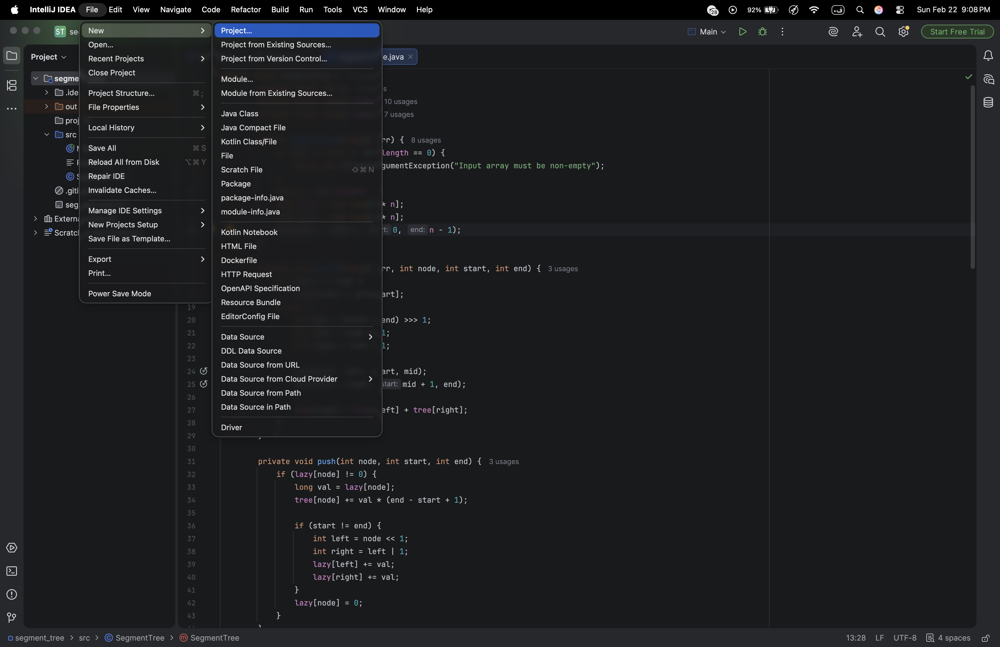

صفحه‌ای مشابه تصویر زیر برایتان باز می‌شود. نام پروژه را انتخاب کنید، اطمینان داشته باشید که مسیر ذخیره‌سازی صحیح است و حتماً بررسی کنید همان JDK ی که قبل‌تر دانلود کرده‌اید انتخاب شده باشد. من نسخهٔ 25.0.2 را نصب کرده‌ام و برای این پروژه نیز از همان نسخه استفاده کرده‌ام:

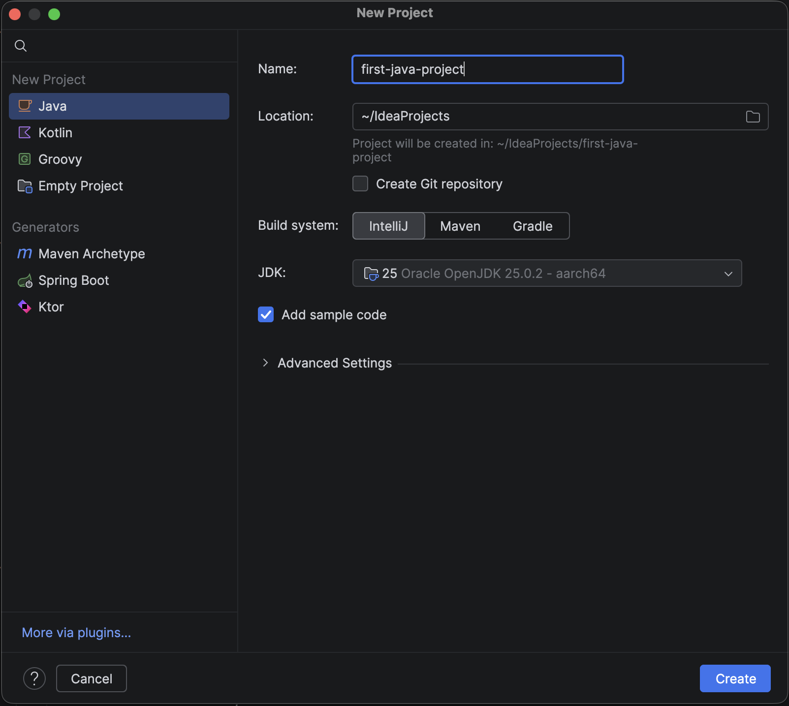

با انجام این مراحل، اولین پروژهٔ جاوای شما ساخته می‌شود. باید صفحه‌ای مشابه این را مشاهده کنید:

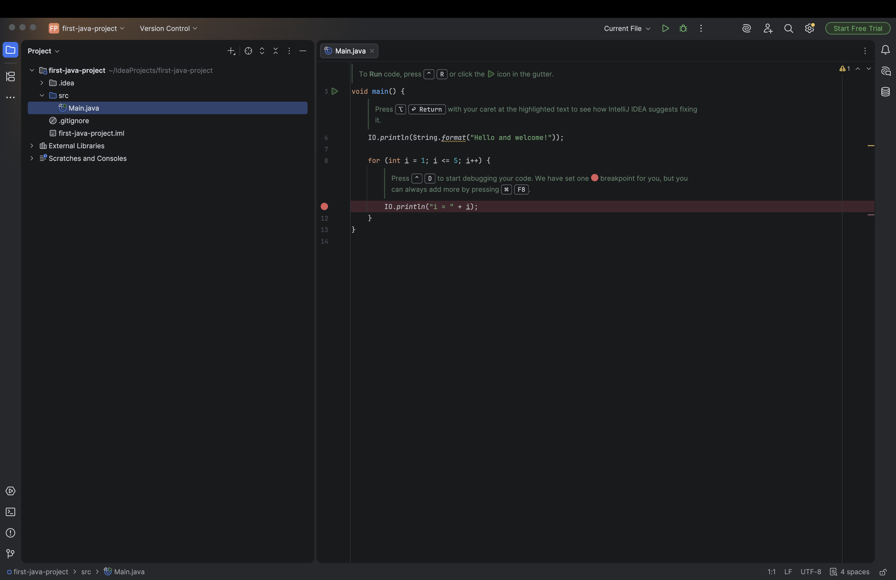

این، اولین برنامهٔ شماست. با فشردن دکمهٔ مثلثی‌شکل بالای صفحه، برنامه را Run کنید. اگر برنامه به‌درستی compile و run شود، خروجی‌ای مشابه تصویر زیر مشاهده خواهید کرد:

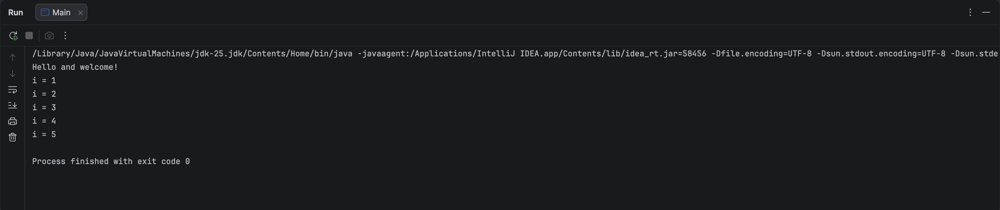

تبریک! شما اولین برنامهٔ جاوای خود را اجرا کردید.

### کدی که اجرا کردیم

بیایید بررسی کنیم کدی که اجرا شد دقیقاً چه بود. منطقا چنین کدی را در ادیتور خود مشاهده می‌کنید:

```java
void main() {
    IO.println(String.format("Hello and welcome!"));
    for (int i = 1; i <= 5; i++) {
        IO.println("i = " + i);
    }
}
```
اگر این کد را در ادیتور خود نیز کپی کنید، خروجی دقیقاً یکسانی دریافت خواهید کرد:

```java
public class Main {
    public static void main(String[] args) {
        System.out.println("Hello and welcome!");
        for (int i = 1; i <= 5; i++) {
            System.out.println("i = " + i);
        }
    }
}
``` 
در کد نسخه دوم، یک کلاس با نام Main مشاهده می‌کنید که درون آن متدی به نام main قرار دارد. در جلسات آینده توضیح خواهیم داد که کلاس چیست، public چه مفهومی دارد و چگونه می‌توانید کلاس‌های خود را ایجاد کنید.

همان‌طور که مشاهده می‌کنید، در نسخهٔ اول هیچ کلاس‌ای به‌صورت صریح تعریف نشده است، زیرا از قابلیت جدید implicit Class در نسخه‌های جدید جاوا استفاده شده که امکان تعریف کلاس را به‌صورت غیرمستقیم فراهم می‌کند. در واقع، حتی در این حالت نیز کامپایلر یک کلاس برای شما ایجاد می‌کند، اما این کلاس به‌طور مستقیم در کد قابل مشاهده نیست و به‌صورت خودکار در پس‌زمینه تولید می‌شود.
  
```java
public class Main {  
   // Your code here  
}
```

در این کلاس، متدی با نام `main` مشاهده می‌کنید. در جاوا به توابع، Method گفته می‌شود (توجه داشته باشید که استفاده از واژهٔ Function برای آن‌ها اصطلاح دقیقی نیست). این متد مشابه تابع `main` در زبان C است که قبل‌تر با آن آشنا شده‌اید و نقطهٔ شروع اجرای برنامه محسوب می‌شود:

```c
public static void main(String[] args) {  
    // Your program starts from here  
}
```


در نسخهٔ ساده‌تر، متد `main` بدون `public` و `static` نوشته شده است تا تمرکز شما فقط روی ساختار کلی برنامه باشد.[^1] اما از اینجا به بعد از شکل کامل آن استفاده می‌کنیم، زیرا این دقیقاً همان شکلی است که ماشین مجازی جاوا (JVM) برای اجرای برنامه انتظار دارد.
در جلسات آینده، دربارهٔ JVM نیز به‌طور مفصل صحبت خواهیم کرد.

اما کلمهٔ `void` احتمالاً برایتان آشناست.
وقتی در تعریف یک متد از `void` استفاده می‌کنیم، یعنی آن متد هیچ مقداری را به‌عنوان خروجی برنمی‌گرداند.
در اینجا نیز متد `main` فقط اجرا می‌شود و مقداری بازنمی‌گرداند.

توی `main`، شما کد زیر را مشاهده می‌کنید:

```java
System.out.println("Hello and welcome!");
```

این تکه کد برای چاپ `"!Hello and welcome"` نوشته شده‌است. اگر این خط را حذف کرده و دوباره بنویسید، متوجه خواهید شد که دستور println علاوه بر رشته‌ها (String)، می‌تواند انواع دادهٔ دیگری مانند int و boolean را نیز چاپ کند. بنابراین می‌توانید با همان دستور، مقادیر متنوعی را در خروجی چاپ کنید:

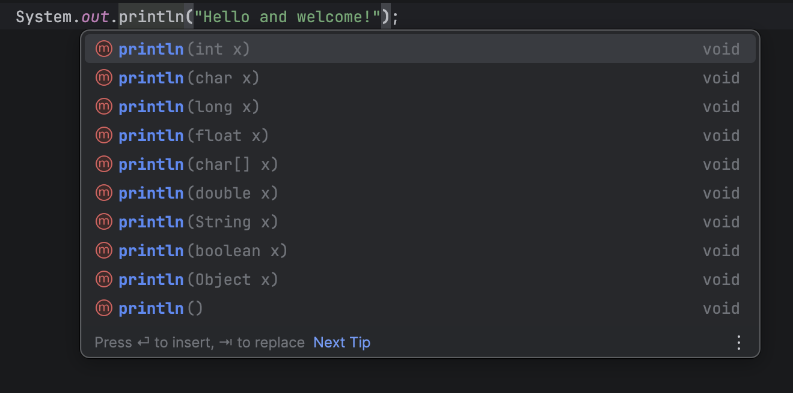


این یکی از قابلیت‌های کاربردی IntelliJ است که امکان مشاهدهٔ نوع و نام پارامترهای یک متد و همچنین نوع خروجی آن را فراهم می‌کند. این ویژگی می‌تواند در فرآیند کدنویسی کمک قابل‌توجهی به شما داشته باشد. اکنون که به انواع داده‌ای مانند int و boolean و سایر نوع‌ها اشاره شد، بیایید نخستین متغیرهای خود را در جاوا تعریف کنیم.

## متغیرها

کد روی صفحه را به کد زیر تغییر دهید:

```java
public class Main {  
   public static void main(String[] args) {  
      int a = 10;  

      System.out.println(a);  
   }  
}
```

در این کد، متغیر a را از نوع `int` تعریف کرده‌ایم، مقدار اولیهٔ 10 را به آن داده‌ایم و سپس مقدار آن را چاپ کرده‌ایم. به `int` `،boolean` `،float` و انواع مشابه آن‌ها، data type گفته می‌شود. data type‌های اصلی جاوا که به آنها Primitive data types هم گفته می‌شود، به همراه رنجی که پوشش می‌دهند، در جدول زیر آمده‌اند. همانند زبان C، نباید مقداری خارج از رنج تعریف‌شده برای هر type به آن اختصاص دهید.


| Type      | Definition                               | Approximate range or precision          |
| --------- | ---------------------------------------- | --------------------------------------- |
| `boolean` | Logical Value                            | `true` or `false`                       |
| `char`    | $16$-bit, Unicode character              | $64k$ characters                        |
| `byte`    | $8$-bit, signed integer                  | $-128$ to $127$                         |
| `short`   | $16$-bit, signed integer                 | $-32, 768$ to $32,676$                  |
| `int`     | $32$-bit, signed integer                 | $-2.1\mathrm{e}9$ to $2.1\mathrm{e}9$   |
| `long`    | $64$-bit, signed integer                 | $-9.2\mathrm{e}18$ to $9.2\mathrm{e}18$ |
| `float`   | $32$-bit, IEEE 754, floating-point value | $6-7$ significant decimal places        |
| `double`  | $64$-bit, IEEE 754                       | $15$ significant decimal places         |

می‌توانید به‌صورت مشابه، متغیرهایی از هر یک از این typeها تعریف کرده و آن‌ها را چاپ کنید:
```java
public class Main {
   public static void main(String[] args) {
      int a = 10;
      double b = 3.14;
      boolean c = true;
      char d = 'a';  
  
      System.out.println(a);  
      System.out.println(b);  
      System.out.println(c);  
      System.out.println(d);  
    }  
}
```

خروجی این کد، همان‌طور که انتظار می‌رود، به شکل زیر است:

```
10
3.14
true
a

Process finished with exit code 0
```

در java، یک `type` برای متغیرهاتون به اسم `String` هم دارید، که البته جزو primitive data typeها نیست. برای نمونه `!Hello and welcome`ای که در مثال اولتون `print` کردید، نمونه‌ای از همین `type` بود. می‌توانید به شکل زیر یک `String` را تعریف کنید:

```java
public class Main {
   public static void main(String[] args) {  
      String str = "Hello, World!";  
  
      System.out.println(str);  
   }  
}
```

علاوه بر این، جاوا دستوری مجزا برای چاپ به سبک `printf` در زبان C دارد:

```java
String name = "Kiana";  
int age = 27;  

System.out.printf("Name: %s\nAge: %d\n", name, age);
```

شما می‌توانید تمام عملیات‌های ریاضی که در زبان‌هایی مانند C روی متغیرها انجام می‌دادید، در اینجا نیز انجام دهید. طبیعتا، جاوا نیز مانند سایر زبان‌ها، اولویت عملگرهای ریاضی را رعایت می‌کند:

| Precedence | Operator       | Operand type | Description                          |
| ---------- | -------------- | ------------ | ------------------------------------ |
| 1          | `++, --`       | Arithmetic   | Increment and decrement              |
| 1          | `+, -`         | Arithmetic   | Unary plus and minus                 |
| 1          | `~`            | Integral     | Bitwise complement                   |
| 1          | `!`            | Boolean      | Logical complement                   |
| 1          | `( type )`     | Any          | Cast                                 |
| 2          | `*, /, %`      | Arithmetic   | Multiplication, division, remainder  |
| 3          | `+, -`         | Arithmetic   | Addition and substraction            |
| 3          | `+`            | String       | String concatenation                 |
| 4          | `<<`           | Integral     | Left shift                           |
| 4          | `>>`           | Integral     | Right shift with sign extension      |
| 4          | `>>>`          | Integral     | Right shift with no extension        |
| 5          | `<, <=, >, >=` | Arithmetic   | Numeric comparison                   |
| 5          | `instanceof`   | Object       | Type comparison                      |
| 6          | `==, !=`       | Primitive    | Equality and inequality of value     |
| 6          | `==, !=`       | Object       | Equality and inequality of reference |
| 7          | `&`            | Integral     | Bitwise AND                          |
| 7          | `&`            | Boolean      | Boolean AND                          |
| 8          | `^`            | Integral     | Bitwise XOR                          |
| 8          | `^`            | Boolean      | Boolean XOR                          |
| 9          | `\|`           | Integral     | Bitwise OR                           |
| 9          | `\|`           | Boolean      | Boolean OR                           |
| 10         | `&&`           | Boolean      | Conditional AND                      |
| 11         | `\|\|`         | Boolean      | Conditional OR                       |
| 12         | `?:`           | N/A          | Conditional ternary operator         |
| 13         | `=`            | Any          | Assignment                           |

می‌توانید هنگام تعریف متغیر، آن را مقداردهی نکنید و صرفا به نوشتن typeشون اکتفا کنید:

```java
public static void main(String[] args) {  
   int a;  
}
```

با این حال، حتماً باید پیش از استفاده از متغیر، به آن مقدار اختصاص دهید؛ در غیر این صورت، جاوا اجازهٔ کامپایل شدن برنامه را نخواهد داد. به عنوان مثال، اگر تلاش کنید تا کد زیر را اجرا کنید:

```java
int a;  
System.out.println(a);
```

جاوا خطای زیر را نشان میدهد:

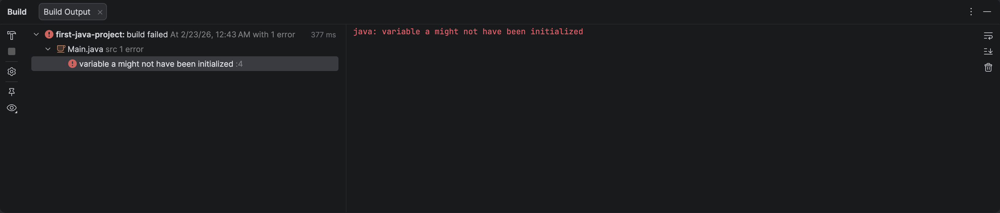

زمانی که یک متغیر را هنگام تعریف مقداردهی می‌کنید، می‌توانید از کلیدواژهٔ var استفاده کنید تا کامپایلر جاوا به‌صورت خودکار نوع متغیر را بر اساس مقدار اولیهٔ آن تشخیص دهد. در این حالت، دیگر نیازی به تعیین دستی نوع متغیر نخواهد بود.

```java
var a = 10;  
var b = 20;  

System.out.println(a + b);
```

در مثال بالا، چون مقادیر 10 و 20 به a و b داده شده‌اند، کامپایلر تشخیص می‌دهد که این دو متغیر از نوع int هستند و مطابق آن رفتار می‌کند.
توجه داشته باشید که var یک data type جدید نیست، بلکه صرفاً روشی برای ساده‌تر کردن نوشتن کد است. لازم نیست برای همه متغیرها، typeهای آن‌ها را بنویسید. کامپایلر نوع متغیرها را براساس مقدار اولیه ای که دریافت می‌کند، تشخیص میدهد.


## لیترال‌ها

اکنون کد زیر را در IDE خود اجرا کنید:
```java
public static void main(String[] args) {  
   long a = 99999999999;  

   System.out.println(a);  
}
```

با تلاش برای اجرای آن، با خطای زیر مواجه خواهید شد:


این خطا کمی عجیب به نظر می‌رسد. با وجود آن‌که برای این عدد بسیار بزرگ،از متغیر long استفاده کرده‌اید که از نظر ظرفیت باید توان نگه‌داری آن را داشته باشد همچنان با خطای number too large مواجه می‌شوید. علت چیست؟
خطی را که در آن a را تعریف کرده‌اید، با خط زیر جایگزین کنید:

```java
long a = 99999999999L;
```

مشکل برطرف شد، درست است؟ علت خطای قبلی، نوع متغیر a نبود؛ زیرا long قادر است اعداد بسیار بزرگ‌تری را نیز در خود ذخیره کند. مسئله این بود که خود جاوا نمی‌دانست با عدد 99999999999 چگونه برخورد کند: آیا باید آن را int در نظر بگیرد، long بداند یا حتی double؟
در نسخهٔ دوم کد، با گذاشتن L در انتهای عدد، به جاوا گفتید که این مقدار از نوع long است و باید همانند یک long با آن رفتار شود.

به اعداد و کاراکترهایی که در برنامه hard code می‌کنید، `literal` می‌گن. کد زیر، شامل سه‌ `literal` است:

```java
int r = 10;  
char next_line = '\n';  

System.out.printf("Circle area: %f%c", 3.14 * r * r, next_line);
```

این literal ها به‌ترتیب `10`، `'\n'` و `3.14` هستند. همان‌طور که قبل‌تر اشاره شد، literal ها نیز مانند متغیرها دارای type هستند. برای مثال، عدد `123` از نوع int محسوب می‌شود، در حالی که 123L از نوع `long` است. همچنین اگر عددی مانند `3.14` را به‌صورت اعشاری بنویسید، جاوا به‌طور پیش‌فرض آن را از نوع double در نظر می‌گیرد؛ و اگر بخواهید نوع آن float باشد، باید از 3.14F استفاده کنید. افزون بر این، می‌توانید برای اعداد اعشاری از نمایش علمی (scientific notation) نیز بهره ببرید:

```java
double d = 8.31;  
double e = 3.00e+8;  
float f = 8.31F;  
float g = 3.00e+8F;
```

هنگامی که با اعداد بسیار بزرگ سروکار دارید، می‌توانید برای خواناتر شدن آن‌ها از علامت _ میان ارقام استفاده کنید تا تفکیک آن‌ها ساده‌تر شود:

```java
int a = 999999999; // Very hard to read!  
int b = 999_999_999; // Easy :)  

System.out.printf("a = %d, b = %d\n", a, b);
```

در کد بالا، مقادیر `a` و `b` یکسان‌اند، اما یکی از آن‌ها به‌مراتب خواناتر نوشته شده است!

## ثابت‌ها

در کد زیر، یک constant یا همان ثابت به نام `MAX_AGE` را در جاوا تعریف کرده‌ایم[^2]:

```java
public class Main {
   public static final int MAX_AGE = 99;

   public static void main(String[] args) {
      int age = 102;

      if (age > MAX_AGE) {  
         System.out.println("You're too old!");  
      }  
   }  
}
```

کلیدواژهٔ final این امکان را به شما می‌دهد که یک constant تعریف کنید. constantها پس از تعریف و مقداردهی، هرگز مقدارشان تغییر نمی‌کند.

## شرط‌ها

شرط‌های جاوا بسیار شبیه به C هستند و می‌توانید با syntax زیر از آن‌ها استفاده کنید:

```java
int radius = 10;

if (radius <= 20) {  
   System.out.println("Radius is too small");  
} else if (radius >= 50 && radius <= 100) {  
   System.out.println("Radius is too big");  
} else {  
   System.out.println("Other stuff");  
}
```

فقط توجه داشته باشید که Stringها را با == مقایسه نکنید. اگر این کار را انجام دهید، خود IntelliJ به شما یک warning می‌دهد و پیشنهاد می‌کند از متد equals استفاده کنید:

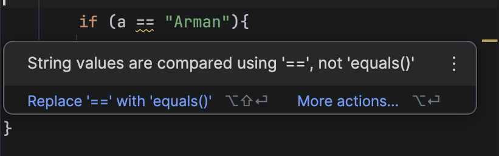

شیوهٔ صحیح مقایسهٔ Stringها در جاوا به این صورت است:
```java
if (a.equals("Arman")) {
   // Do something
}
```

دلیل این موضوع آن است که همان‌طور که قبل‌تر گفتیم، String یک primitive type نیست، بلکه یک reference type است. در جلسات بعدی هر دوی این مفاهیم را تعریف می‌کنیم و تفاوت‌های آن‌ها را توضیح خواهیم داد.
همچنین همواره سعی کنید به warning ها، hint ها و به‌طور کلی ابزارهایی که IntelliJ در اختیارتان قرار می‌دهد توجه کنید. با استفاده از آن‌ها می‌توانید کد خود را بهبود دهید و نکات ارزشمندی بیاموزید.

## حلقه‌ها

در جاوا، دو نوع اصلی حلقه داریم: `for` و `while`. اگر آن‌ها را از C یا زبان‌های دیگر به خاطر داشته باشید، تقریباً همان ساختار را دارند.

در کد زیر، یک حلقهٔ `for` صدتایی می‌نویسیم:

```java
for (int i = 0; i < 100; i++) {  
   System.out.println(i);  
   int j = i;  
   // do any other work needed  
}
```

همان‌طور که مشاهده می‌کنید، syntax حلقهٔ `for` در جاوا بسیار شبیه به زبان C است و هر کاری که در آن‌جا انجام می‌دادید، در این‌جا نیز می‌توانید انجام دهید. می‌توانید به‌جای `i++` هر عبارت مشابه دیگری که تغییری در `i` ایجاد می‌کند قرار دهید. هر دو `for` زیر صحیح‌اند؛ آن‌ها را اجرا کنید و خروجی‌شان را بررسی کنید:

```java
for (int i = 0; i < 100; i += 2) {  
    System.out.println(i);  
}
```

```java
for (int i = 0; i < 100;) {  
    System.out.println(i);  
}
```

در حلقهٔ دوم، مقدار `i` را پس از هر iteration تغییر نمی‌دهیم. این موضوع باعث می‌شود تا زمانی که برنامه اجرا می‌شود، مقدار `0` چاپ شود. حتی حلقهٔ زیر نیز درست است.

```java
for (; true;) {  
    System.out.println("running forever!");  
}
```

تنها بخشی که حضورش در حلقهٔ `for` اجباری است، شرط تکرار حلقه است؛ مانند همان `true` که در کد بالا قرار داده‌ایم. دو بخش دیگر را می‌توانید حذف کنید.

حلقهٔ `while` نیز مشابه زبان `C` است و می‌توانیم آن را به شکل زیر تعریف کنیم.

```java
int count = 10;
while (count > 0) {  
    System.out.println("Counting down: " + count);
    // maybe do other useful things  
    // and decrement our count
    count = count - 1;  
}  
System.out.println("Done");
```

در جاوا، نوع دیگری از حلقه به نام `do while` نیز وجود دارد. این حلقه شبیه `while` است، با این تفاوت که ابتدا دستورات داخل آن اجرا می‌شوند و سپس شرط بررسی می‌شود. این فرآیند تا زمانی ادامه پیدا می‌کند که شرط برقرار باشد. بنابراین، بدنهٔ `do while` حداقل یک‌بار اجرا می‌شود، حتی اگر شرط `while` از ابتدا نادرست باشد.


```java
int i = 0;
do {  
    System.out.println(i);  
    i++;  
} while (i < 5);
```

مانند C ، در این‌جا نیز می‌توانید از `break` و `continue` در حلقه‌های خود استفاده کنید:

```java
for (int i = 0; i < 10; i++) {
    if (i == 5)
        continue;  
    System.out.println(i);  
}
```

```java
while(true) {
    if (watchForErrors())
        break;
    // No errors yet so do some work...
}
// The "break" will cause execution to  
// resume here, after the while loop
```

شاید متوجه نشده باشید، اما در دو کد بالا، `if` ها آکولاد ندارند. در جاوا، اگر بدنهٔ یک `if`، `for`، `while`، `else` یا هر ساختار بلوکی دیگری تنها یک خط باشد، نیازی به قرار دادن آکولاد نیست.

## متد‌ها

می‌توانیم در جاوا متدی مانند `checkEmail` را به شکل زیر تعریف کنیم:

```java
public class Main {
    // this method will return true if the email contains the character '@'  
    // and false otherwise
    public static boolean checkEmail(String email) {
        int emailLength = email.length();

        for (int i = 0; i < emailLength; i++) {
            if (email.charAt(i) == '@') { // email.charAt(i) will return the i-th character of the email
                return true;  
            }  
        }
        return false;  
    }

    public static void main(String[] args) {  
        String email = "kianapahlevan@gmail.com";

        if (!checkEmail(email)) {  
            System.out.printf("%s is not a valid email address\n", email);  
        } else {  
            System.out.println("Ok");  
        }  
    }  
}
```

همان‌طور که مشاهده می‌کنید، تعریف متدها در جاوا از نظر ساختاری بسیار شبیه به Function ها در زبان C است؛ بنابراین هر کاری که در C انجام می‌دادید، این‌جا نیز به همان شکل انجام می‌دهید.

مثال بعدی، عدد $n$ ام فیبوناچی را به‌صورت بازگشتی چاپ می‌کند:

```java
public class Main {
    public static int fib(int n) {
        if (n == 0)
            return 1;
        if (n == 1)
            return 1;

        return fib(n - 1) + fib(n - 2);  
    }

    public static void main(String[] args) {
        int n = 10;  
  
        System.out.println(fib(n));  
    }  
}
```

توجه داشته باشید که فعلاً متدهای خود را خارج از کلاس `Main` تعریف نکنید.

## بلوک‌ها

به هر چیزی که میان دو آکولاد `{}` نوشته می‌شود، یک block گفته می‌شود. برای نمونه، کد زیر سه block تعریف می‌کند:

```java
public class Main {
    public static void main(String[] args) {
        for (int i = 0; i < 10; i++) {  
            System.out.println(i);  
        }  
    }  
}
```

شاید برایتان جالب باشد بدانید که برای تعریف یک block، الزاماً نیازی به استفاده از `if` ،`for` یا ساختارهای مشابه نیست و می‌توانید بدون آن‌ها نیز یک block ایجاد کنید:

```java
public class Main {
    public static void main(String[] args) {
        float pi = 3.14F;  
  
        {
            int r = 12;  
            System.out.println(pi * r * r);  
        }  
    }  
}
```

همانند سایر زبان‌ها، متغیرهایی که در یک block تعریف می‌شوند، تنها به همان block تعلق دارند؛ به بیان دیگر، scope آن‌ها محدود به همان block است. به این متغیرها، متغیرهای محلی یا local variables گفته می‌شود.

به همین دلیل، اگر کد زیر را اجرا کنید:

```java
float pi = 3.14F;  
  
{
    int r = 12;  
}  
  
System.out.println(pi * r * r);
```

با خطای زیر مواجه خواهید شد:

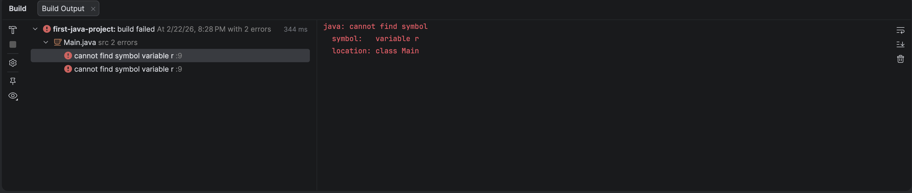

این خطا به این معناست که نمی‌توانید از متغیرهای محلی‌ای که داخل if ،for، متدها یا هر ساختار بلوکی دیگری تعریف شده‌اند، در بیرون از همان block استفاده کنید.

## ورودی

ورودی گرفتن در جاوا کمی با زبان‌های دیگر تفاوت دارد. برای استفاده از آن، ابتدا باید یک شی یا object از نوع `Scanner` با استفاده از `System.in` ایجاد کنید. اگر جملهٔ پیشین برایتان نامفهوم بود، نگران نباشید؛ زمانی که شی‌گرایی را بیاموزید، درک آن برایتان ساده‌تر خواهد شد. فعلاً کد زیر را در ابتدای متد `main` خود قرار دهید:

```java
var scn = new Scanner(System.in);
```

توجه داشته باشید که برای استفاده از آن، باید `java.util.Scanner` را `import` کرده باشید. عمل `import` کردن برای استفاده از کدی است که در فایل فعلی شما وجود ندارد. کافی است خط زیر را به ابتدای برنامهٔ خود اضافه کنید.

```java
import java.util.Scanner;
```

اکنون می‌توانید از متدهای مختلف `scn` برای خواندن ورودی کاربر استفاده کنید. برای نمونه، با استفاده از `nextInt()` می‌توانید عددی را که کاربر وارد می‌کند بخوانید.

```java
import java.util.Scanner;

public class Main {
    public static void main(String[] args) {
        var scn = new Scanner(System.in);  
  
        System.out.print("Enter your age: ");
        int age = scn.nextInt();

        if (age >= 18) {  
            System.out.println("You're an adult now.");  
        }  
    }  
}
```

این کد را اجرا کنید تا نگاهی نیز به نحوهٔ نمایش ورودی و خروجی در IntelliJ بیندازید.
برای خوندن یک `String` از ورودی کاربر، از` nextLine()` استفاده کنید:

```java
public class Main {
    public static void main(String[] args) {
        var scn = new Scanner(System.in);  
  
        System.out.print("gmail: ");  
        String email = scn.nextLine();

        if (!email.contains("@gmail.com")) {  
            System.out.println("provide a valid gmail address");  
        }  
    }  
}
```

آبجکت `Scanner` متدهای مشابه دیگری نیز در اختیار شما قرار می‌دهد که می‌توانید به همان شکل از آن‌ها استفاده کنید:

| Method          | Description                         |
| --------------- | ----------------------------------- |
| `nextBoolean()` | Reads a boolean value from the user |
| `nextByte()`    | Reads a byte value from the user    |
| `nextDouble()`  | Reads a double value from the user  |
| `nextFloat()`   | Reads a float value from the user   |
| `nextInt()`     | Reads a int value from the user     |
| `nextLine()`    | Reads a String value from the user  |
| `nextLong()`    | Reads a long value from the user    |
| `nextShort()`   | Reads a short value from the user   |

## Command-Line Arguments

شاید تاکنون توضیح نداده باشیم که `String[] args` در ورودی‌های متد `main` چه نقشی دارد. `args` آرایه‌ای از ورودی‌هایی است که از طریق Command-Line به برنامهٔ شما داده می‌شود. در ادامه، کاربرد آن را بررسی می‌کنیم.

کد جاوای خود را به کد زیر تغییر دهید:

```java
public class Main {
    public static void main(String[] args) {  
        System.out.println("Given arg: " + args[0]);  
    }  
}
```

از منوی بالای IntelliJ، Build > Build Project را انتخاب کنید تا کد شما کامپایل شود.

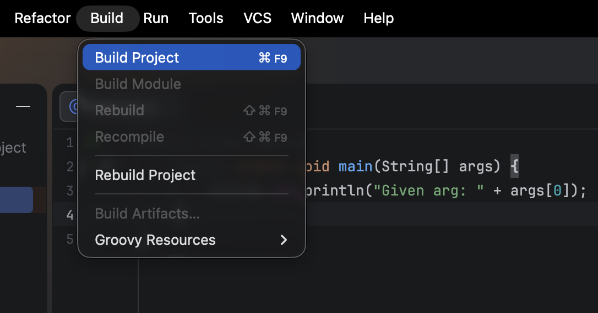

پس از انجام این کار، باید در کنار کدهایتان دایرکتوری‌ای به نام out ایجاد شده باشد که شامل نسخهٔ کامپایل‌شدهٔ برنامهٔ شماست:

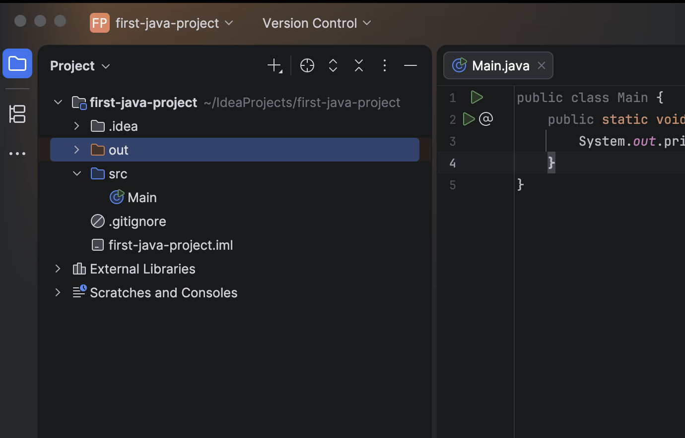

روی out کلیک کنید و سپس وارد production شوید تا دایرکتوری‌ای با نام پروژهٔ خود مشاهده کنید؛ آن را نیز باز کنید.

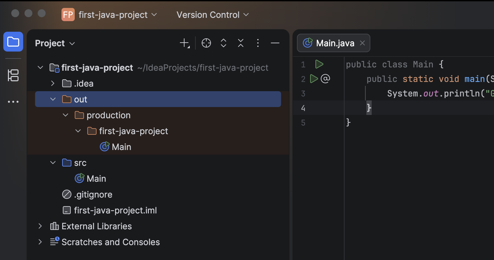

فایل `Main` که در `out` می‌بینید، نسخهٔ کامپایل‌شدهٔ برنامهٔ شماست. اگر روی آن دوبار کلیک کنید، IntelliJ آن را decompile می‌کند و کدی مشابه کد اصلی‌تان نمایش می‌دهد.
روی دایرکتوری `out/production/{your-project-name}` راست‌کلیک کنید و گزینهٔ Copy Path/Reference… را انتخاب کنید.
صفحه‌ای مشابه زیر برای شما باز می‌شود. گزینهٔ Absolute Path را انتخاب کنید.


اکنون که مسیر خروجی build را کپی کرده‌اید، می‌توانید با استفاده از command-line برنامهٔ خود را اجرا کنید.

اگر از Windows استفاده می‌کنید، cmd و اگر از macOS یا Linux استفاده می‌کنید، terminal را باز کنید. ابتدا بررسی کنید که دستور زیر برای شما اجرا شود:

```bash
java --version
```

باید خروجی‌ای مشابه تصویر مشاهده کنید:

```bash
java 25.0.2 2026-01-20 LTS
Java(TM) SE Runtime Environment (build 25.0.2+10-LTS-69)
Java HotSpot(TM) 64-Bit Server VM (build 25.0.2+10-LTS-69, mixed mode, sharing)
```

اگر این‌طور نبود، دربارهٔ مشکل سرچ کنید یا از نزدیک‌ترین تدریس‌یار کمک بگیرید.
در غیر این صورت، با استفاده از دستور cd به دایرکتوری خروجی build (که قبل‌تر کپی کرده‌اید) بروید.

```bash
cd /Users/armaho/Projects/Learning/first-java-project/out/production/first-java-project
```

توجه داشته باشید که به‌جای مسیری که در مثال آمده به cd داده شده، باید مسیر مربوط به پروژهٔ خود را وارد کنید.
اگر همه‌چیز به‌درستی انجام شده باشد، می‌توانید با استفاده از دستور زیر برنامهٔ خود را اجرا کنید. عبارتی مانند `ThisIsAnArgument` که در مثال آمده، یک command-line argument است و یکی از روش‌های دادن ورودی به برنامه محسوب می‌شود.

```bash
java Main ThisIsAnArgument
```

خروجی شما باید به شکل مورد انتظار نمایش داده شود:

```bash
Given arg: ThisIsAnArgument
```

اگر خروجی صحیح باشد، شما با موفقیت یک argument را از طریق command-line خوانده و آن را چاپ کرده‌اید. همچنین می‌توانستید بیش از یک argument داشته باشید.

```bash
java Main arg1 arg2 arg3
```

جاوا تمامی این ورودی‌ها را از طریق آرایهٔ `args` که ورودی متد `main` است در اختیار شما قرار می‌دهد.

## غیرفعال کردن Inline Completion در IntelliJ

حالا که با زبان جاوا آشنا شده‌اید، توصیه می‌شود کدهای جلسات ابتدایی کارگاه و تمرین‌های خود را بدون استفاده از Inline Completion بنویسید تا IntelliJ کدها را به‌صورت خودکار کامل نکند. این کار موجب می‌شود مبانی زبان جاوا را عمیق‌تر بیاموزید. نگران نباشید؛ پس از یکی دو جلسه می‌توانید دوباره آن را فعال کنید، زیرا برنامه‌نویسان برای افزایش سرعت کدنویسی روزانه از آن استفاده می‌کنند.

برای غیرفعال کردن این قابلیت، به تنظیمات IntelliJ بروید و سپس به مسیر Editor > General > Inline Completion بروید:

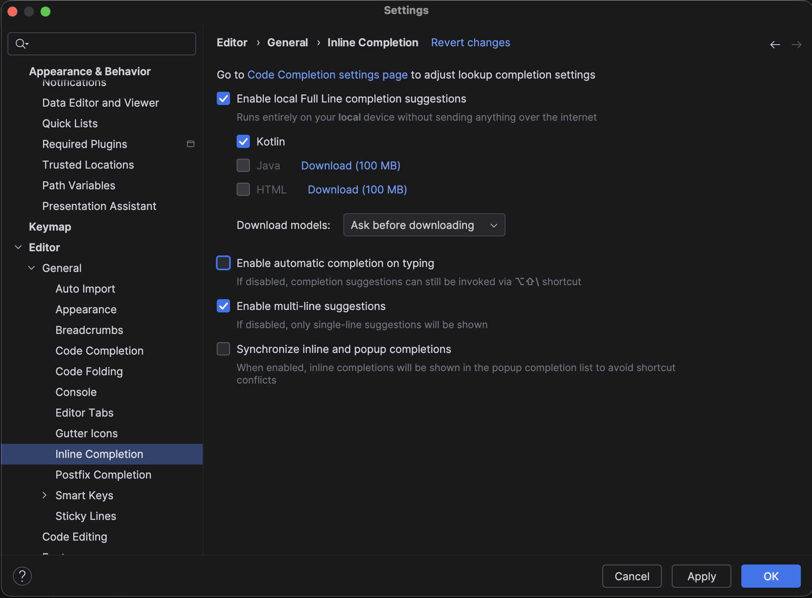

تیک گزینهٔ Enable automatic completion on typing را بردارید و دکمهٔ Apply را انتخاب کنید.

## چه چیزی یاد گرفتیم؟

در این داکیومنت آموختید که:

- چگونه یک پروژهٔ جدید جاوا ایجاد و اجرا کنید.
- چگونه ورودی بگیرید و خروجی بدهید.
- انواع متغیرهای پایه در جاوا کدام‌اند و هر یک چگونه تعریف و استفاده می‌شوند.
- حلقه‌ها در جاوا چگونه عمل می‌کنند.
- چگونه می‌توانید با استفاده از متدها، کد خود را به بخش‌های کوچک‌تر تقسیم کنید.
- بلوک‌ها چیستند.

اگر در هر یک از این مفاهیم پرسشی دارید، حتماً آن را با نزدیک‌ترین تدریس‌یار مطرح کنید. حتی اگر پرسش شما بدیهی به نظر می‌رسد، از مطرح کردن آن خودداری نکنید. هوشمندانه بودن سؤال نباید معیاری برای پرسیدن یا نپرسیدن آن باشد.

[^1]: شاید برایتان سوال شده‌باشد که `public static void` و `String[] args` دقیقاً به چه معناست. فعلاً لازم نیست نگران آن‌ها باشید.   کلمات `public` و `static` به مفاهیمی در برنامه‌نویسی شی‌گرا مربوط می‌شوند که در ادامهٔ مباحث آن‌ها را به‌صورت کامل یاد خواهیم گرفت.

[^2]: در این‌جا نیز لازم نیست با `public static` که پیش از `MAX_AGE` آمده کاری داشته باشید؛ در داکیومنت‌های بعدی به‌طور کامل با آن‌ها آشنا می‌شویم و از آن‌ها استفاده خواهیم کرد.
