title: ابزارها
writers:
  - پدرام اسماعیل پور
  - پریا اصحابی
  - کیانا پهلوان
  - محمدحسین هاشمی
semester: ترم دوم ۱۴۰۴ - ۱۴۰۵
course: برنامه‌سازی پیشرفته و کارگاه
professor: دکتر روح‌الله احمدیان
professor_2: -
department: دانشکده ریاضی و علوم کامپیوتر
institution: دانشگاه صنعتی امیرکبیر
---
## مقدمه

قدم اول برای درس برنامه‌نویسی پیشرفته با زبان جاوا، آماده کردن شرایط کافی برای برنامه‌نویسی با این زبان است که شامل نصب پکیج کامل زبان جاوا (کیت توسعه جاوا) و همچنین یک محیط توسعه<sup>[\[1\]](#footnote-1)</sup> می‌باشد. در این دستور کار منابعی برای آموزش دانلود و نصب Java JDK و IntelliJ IDEA قرار گرفته است. IntelliJ IDEA یک محیط توسعه یکپارچه برای زبان جاوا و محصول شرکت JetBrains است. این IDE یکی از قدرتمندترین‌ها برای زبان جاوا است که ویژگی‌ها و امکانات گوناگونی دارد. پیشنهاد می‌شود که همگی از همین IDE استفاده کنید.

## آموزش نصب IntelliJ و JDK در ویندوز

#### دانلود و نصب IntelliJ در ویندوز

ابتدا به [صفحه رسمی معرفی اینتلی جی](https://www.jetbrains.com/idea) مراجعه کنید، سپس در صفحه‌ی زیر بر روی گزینه‌ی Download سفید رنگ بزنید.


در صفحه زیر گزینه ویندوز را انتخاب کنید، و مطابق تصویر زیر روی download کلیک کنید.

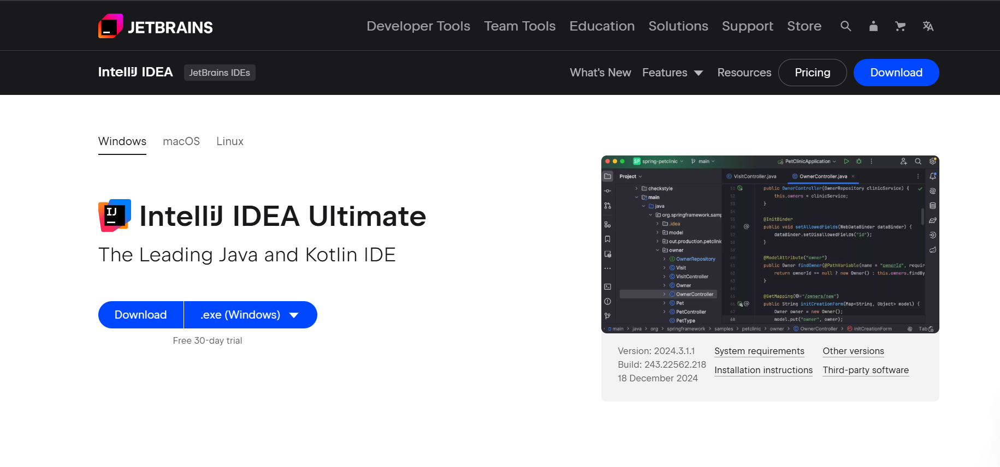

پس از اتمام دانلود، بر روی فایل کلیک کنید تا پنجره‌ی زیر باز شود. سپس گزینه Next را بزنید.

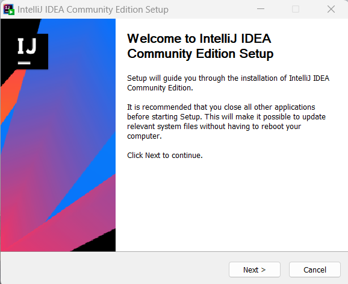

در صفحه‌ی زیر مسیر نصب را مشخص کنید و بر روی گزینه Next ضربه بزنید.

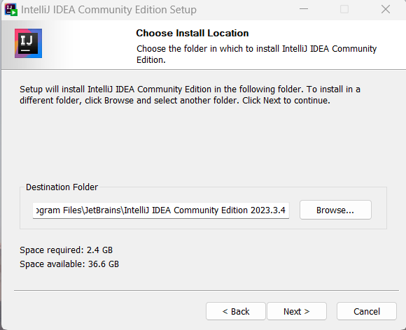

در صفحه بعدی نیز برخی آپشن‌ها نظیر ایجاد شورت‌کات از شما سوال شده است. همه‌ی این آپشن‌ها بعد از نصب برنامه نیز قابل افزودن هستند. بعد از انتخاب گزینه‌های مدنظر خود، Next را بزنید.

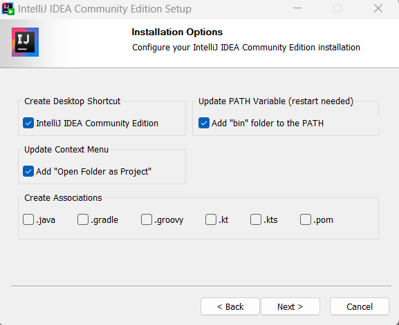

در صفحه‌ی زیر نیاز به تغییر وجود ندارد. گزینه‌ی Install را بزنید.

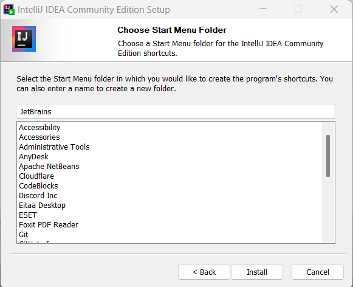

پس از پایان فرآیند Installation، در صفحه‌ی زیر بدون نیاز به تغییر، گزینه‌ی Finish را بزنید. اکنون برنامه نصب شده و قابل اجرا می‌باشد.

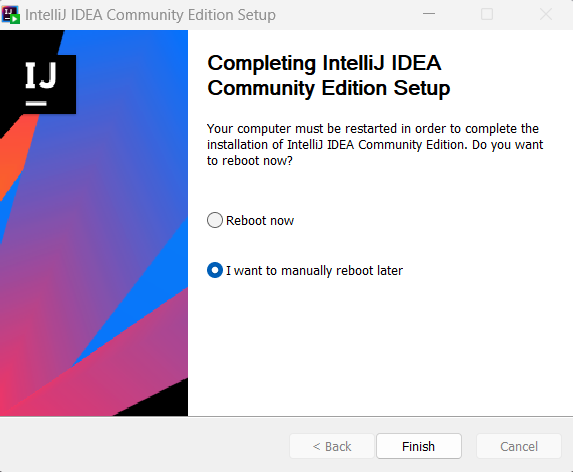

#### دانلود و نصب (JDK (Java Development Kit در ویندوز

ابتدا به [این آدرس](https://www.oracle.com/java/technologies/downloads) مراجعه کنید. در صفحه‌ی زیر بر روی گزینه‌ی JDK 25 بزنید و Windows را انتخاب کنید. در نهایت بر روی لینک مقابل گزینه x64 MSI installer کلیک کنید تا دانلود آغاز شود.


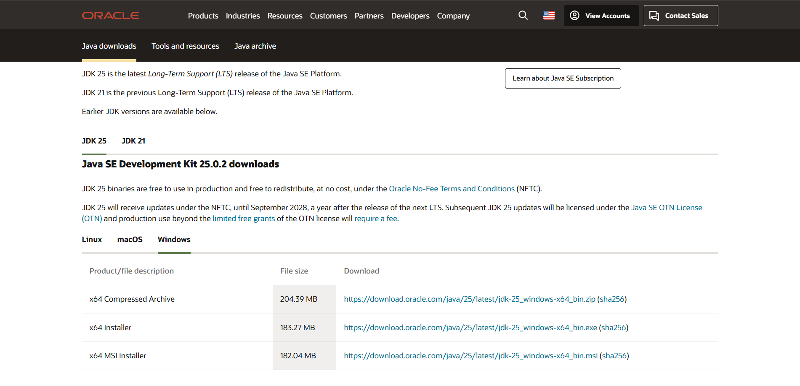

پس از اجرای فایل دانلود شده، با پنجره‌ای مشابه تصویر زیر روبه‌رو می‌شوید. در این صفحه بر روی گزینه‌ی Next کلیک کنید، در صفحه بعدی مسیر نصب را مشخص کنید و مجدداً بر روی گزینه Next ضربه بزنید.


| (1) 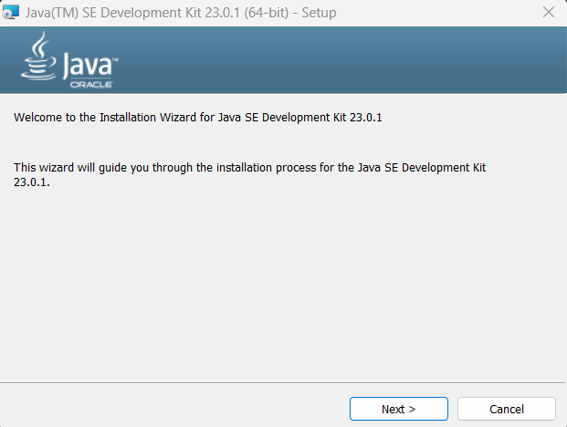 | (2) 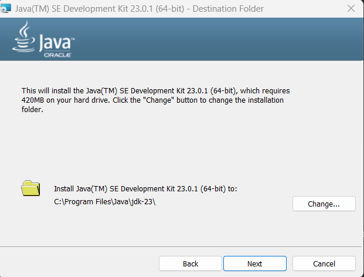 |
| ------------------------------------ | ------------------------------------ |
| (3) 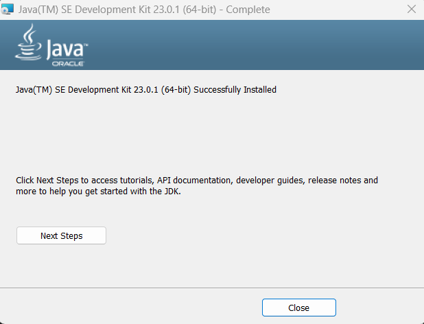 |                                      |


پس از پایان فرآیند Installation، در صفحه‌ی آخر گزینه‌ی Close را بزنید. اکنون نصب به پایان رسیده است. می‌توانید با اجرای دستور زیر در command line از نصب شدن جاوا مطمئن شوید و نسخه نصب‌شده را مشاهده کنید.

```bash
java --version
```

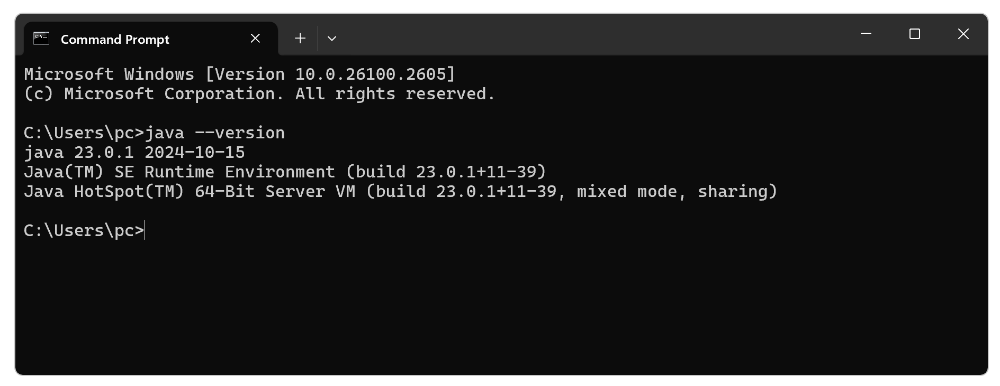

## آموزش نصب IntelliJ و JDK در مک

#### دانلود و نصب IntelliJ در مک

ابتدا به [صفحه رسمی معرفی اینتلیجی](https://www.jetbrains.com/idea) مراجعه کنید، سپس در صفحه‌ی زیر بر روی گزینه‌ی Download سفید رنگ بزنید.


در صفحه زیر گزینه macOS را انتخاب کنید.

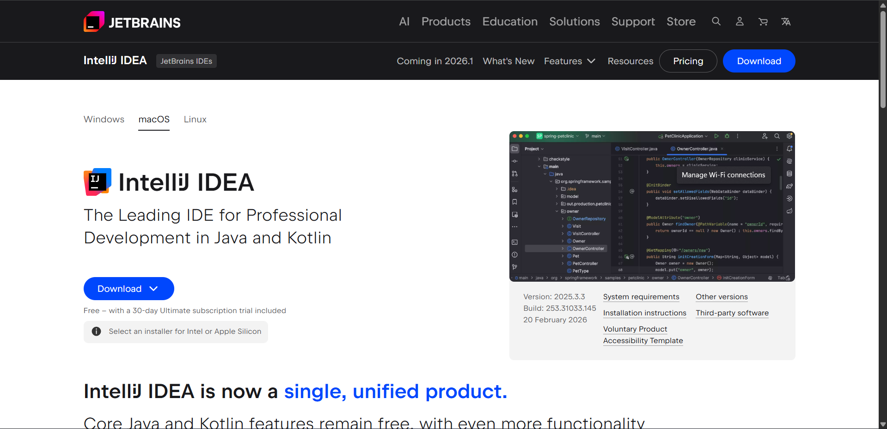

صفحه را به پایین اسکرول کنید و مطابق تصویر زیر، نسخه کامیونیتی را دانلود کنید.

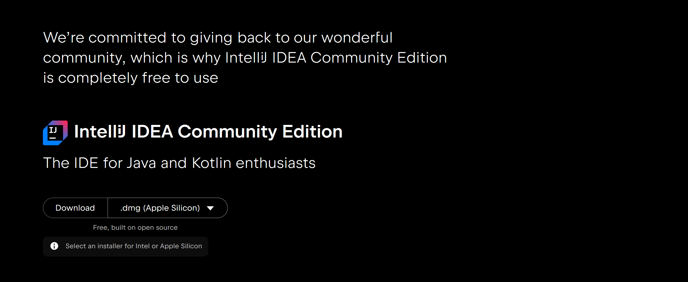

پس از اتمام این فرآیند، فایل دانلود شده را به داخل پوشه Applications بکشید تا عملیات نصب انجام شود.

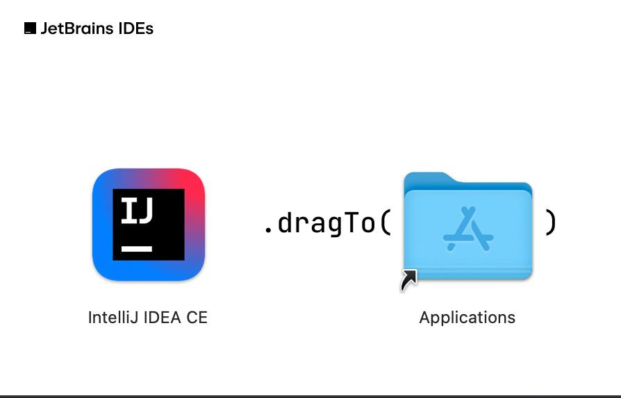

#### دانلود و نصب (JDK (Java Development Kit در مک

ابتدا به [این آدرس](https://www.oracle.com/java/technologies/downloads) مراجعه کنید. در صفحه‌ی زیر بر روی گزینه‌ی JDK23 بزنید و سپس macOS را انتخاب کنید.

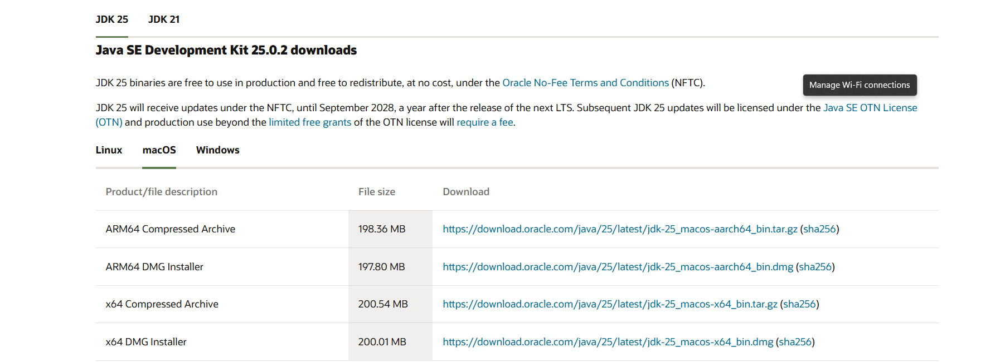

پس از اتمام دانلود، فایل را باز کنید تا با صفحه‌ای مشابه صفحه زیر روبه‌رو شوید.

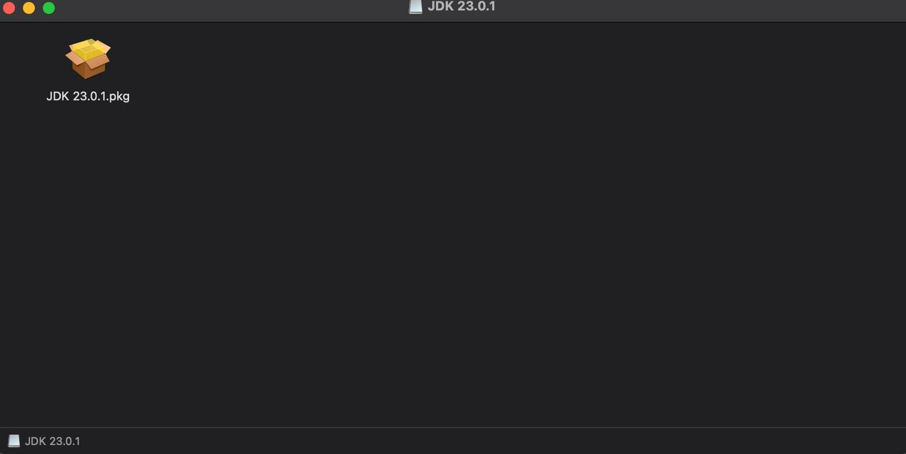

سپس با صفحه‌ای به شکل زیر روبه‌رو می‌شوید و با ادامه دادن مراحل، نصب را انجام دهید.


| (1) 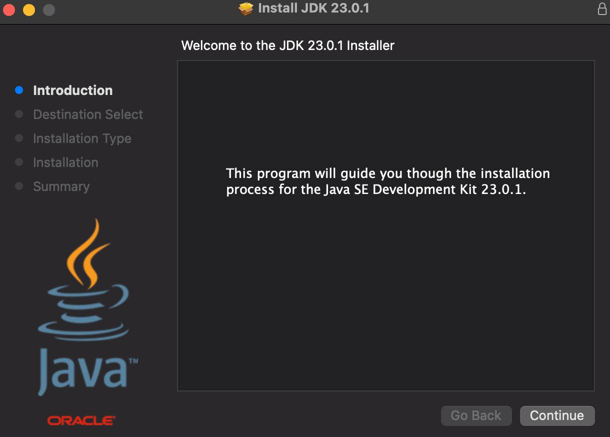 | (2) 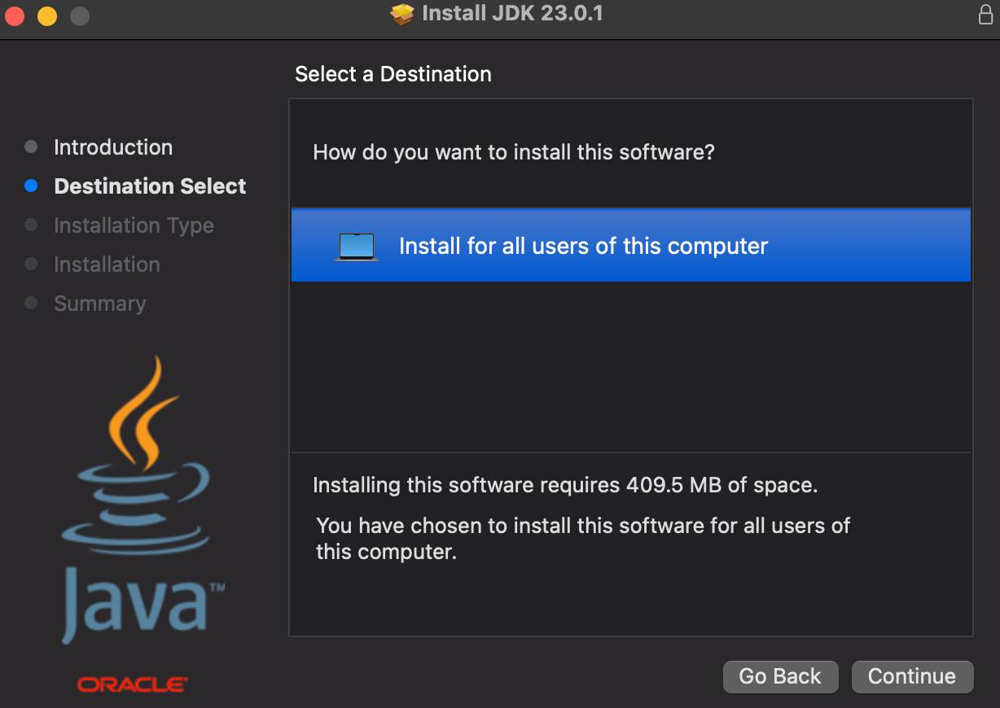 |
| ------------------------------------ | ------------------------------------ |
| (3)  | (4) 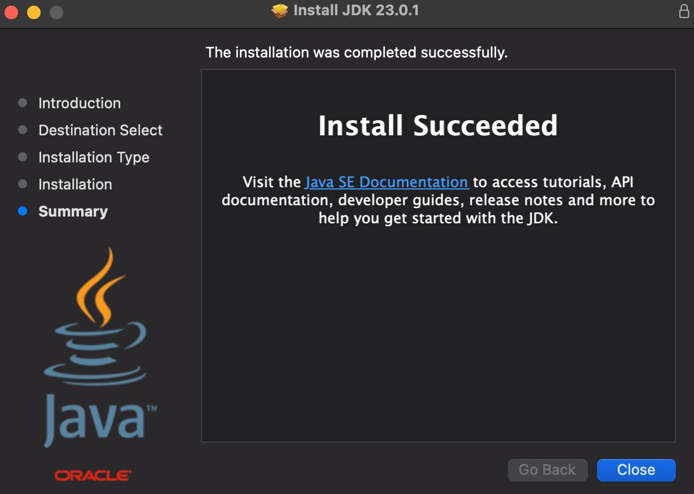 |


در نهایت با اجرای دستور زیر در command line می‌توانید از نصب شدن جاوا در سیستم خود مطمئن شوید.

```bash
java --version  
```

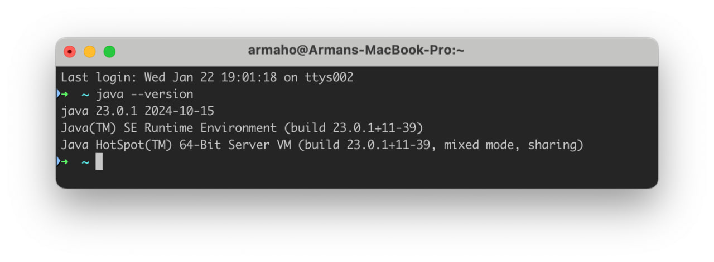

## آموزش ایجاد پروژه در IntelliJ IDEA

پس از پایان فرآیند نصب که پیش‌تر آموزش داده شد، برنامه را اجرا کرده و بر روی گزینه‌ی New Project بزنید.

در این صفحه نام و مسیر ذخیره‌سازی پروژه را انتخاب کنید. زبان را بر روی جاوا و Build System را بر روی IntelliJ بگذارید. در صورتی که می‌خواهید در بدو ایجاد پروژه کلاس Main به همراه کد آماده‌ی کوتاه وجود داشته باشد، تیک Add Sample Code را بزنید.

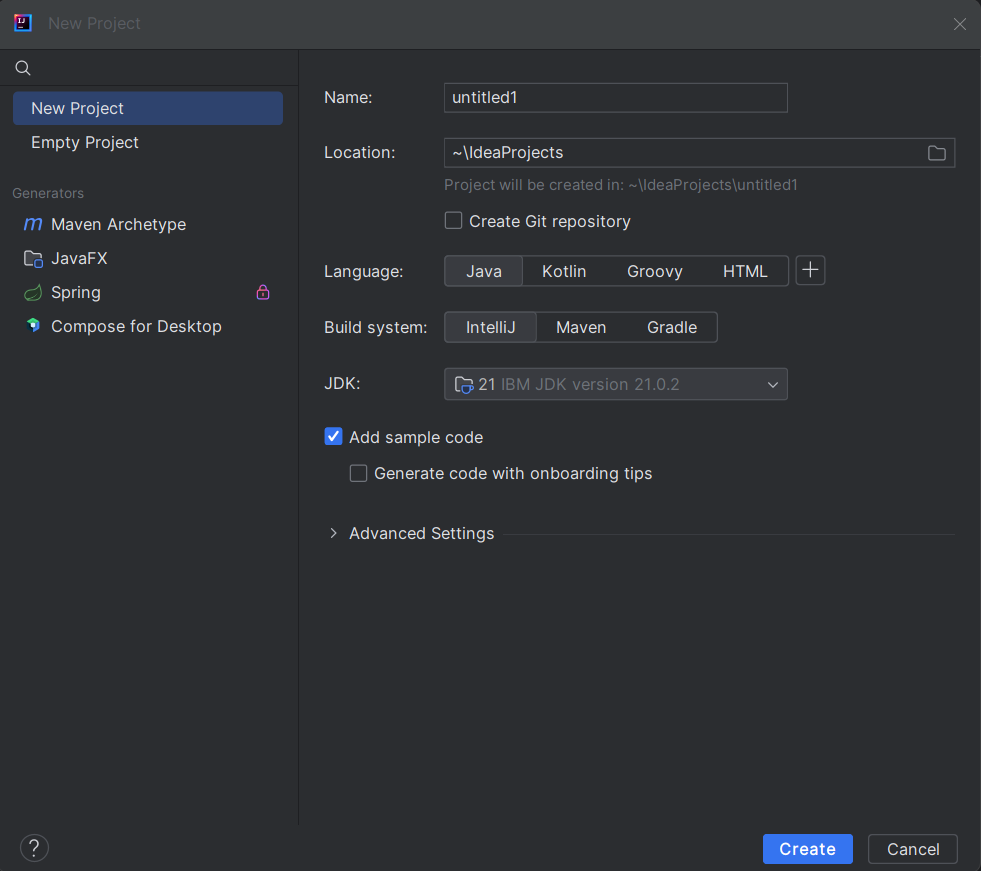

سپس می‌بایست JDK را که قبلاً نصب کردید انتخاب کنید. برای این کار مطابق تصویر زیر عمل کنید. در پایان بر روی گزینه Create بزنید.

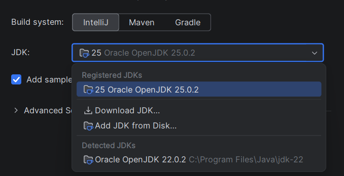

چنانچه پس از ایجاد پروژه، مایل به اضافه کردن کلاس دیگری بودید و یا اگر کلاس Main به‌صورت پیش‌فرض در پروژه‌ی شما ساخته نشده بود، مطابق تصویر زیر از منوی File گزینه New و سپس گزینه‌ی Java Class را انتخاب کنید.

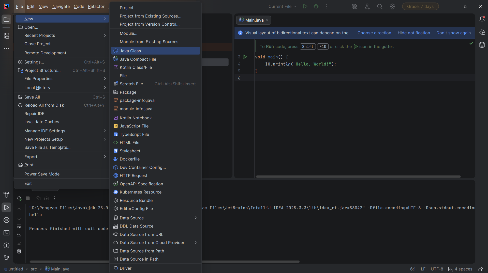

پس از ساخت پروژه یک فایل پیش‌فرض Main.java با برنامه مربوط به چاپ “Hello World!” ساخته می‌شود. با استفاده کلید سبزرنگ Run در نوار بالایی می‌توانید کد را اجرا کنید و مطمئن شوید تمامی ابزارها به درستی کار می‌کنند و عبارت “Hello World!” در ترمینال چاپ شده است.

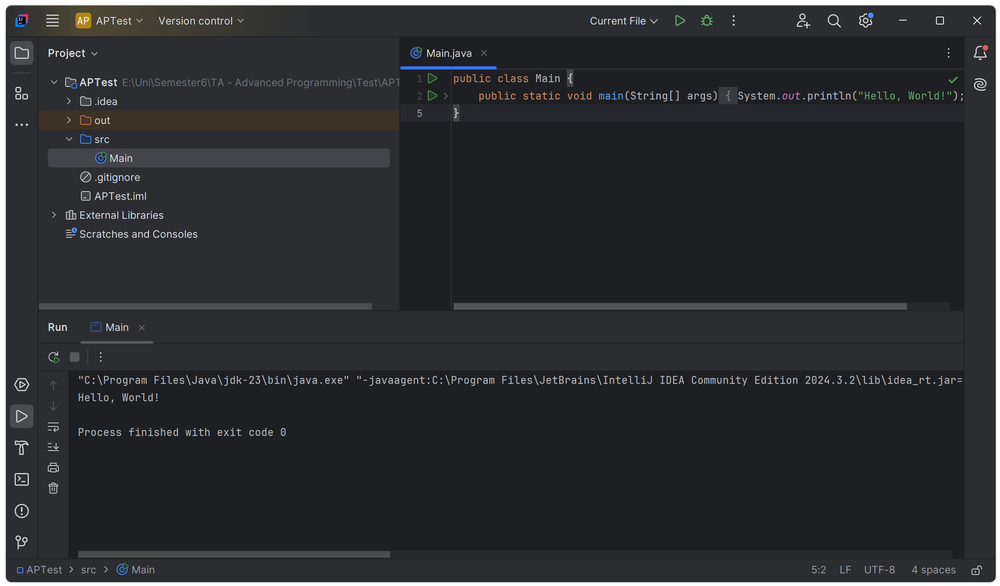

## گیت و گیت‌هاب

در آینده با گیت و گیت‌هاب بیش‌تر آشنا می‌شویم، این دو ابزارهایی قدرتمند برای کنترل پروژه و مدیریت نسخه‌های فایل‌های شماست. در این ترم به‌طور اساسی با ارتباط این دو، فلسفه و شیوه کارشان آشنا می‌شویم و استفاده از گیت در پروژه‌های برنامه‌نویسی را خواهیم دید. اما در این‌جا فقط آموزش ساخت حساب کاربری گیت‌هاب و دانلود و نصب گیت بر روی سیستم عامل های متفاوت توضیح داده شده است تا در جلسات آینده بتوانیم از گیت و گیت‌هاب استفاده کنیم.

#### آموزش ایجاد حساب کاربری در وب‌سایت گیت‌هاب

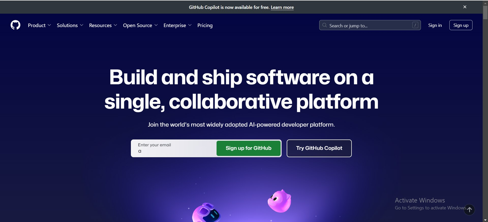

ابتدا وارد [وبسایت گیت‌هاب](https://github.com/) می‌شویم. با انتخاب دکمه Sign up، یک صفحه به شکل صفحه پایین باز می‌شود شما میتوانید با زدن Continue with Google با استفاده از اکانت گوگل خود به راحتی مستقیم ثبت نام کنید. در غیر این صورت شما باید اطلاعات شخصی خود را در آن وارد کنید. توجه کنید که در قسمت ایمیل از ایمیل شخصی خود استفاده کنید و نه ایمیل دانشگاهی.

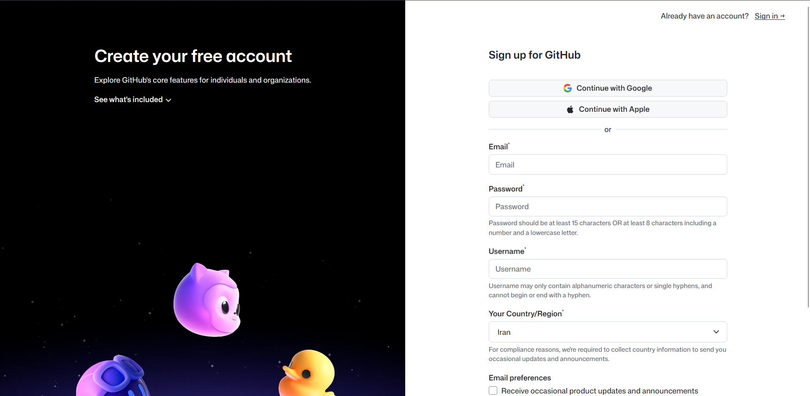

پس از وارد کردن اطلاعات و با فشردن دکمه continue یک صفحه به شکل زیر برای تایید هویت شما باز می‌شود تا کد کپچا و یا پازل را تکمیل کنید تا به مرحله بعدی بروید.

پس از اتمام مرحله پازل یک کد هشت رقمی به ایمیلی که در صفحه اول وارد کردید ارسال می‌شود. شما باید آن را در صفحه زیر وارد کنید تا ایمیل شما تایید شود.

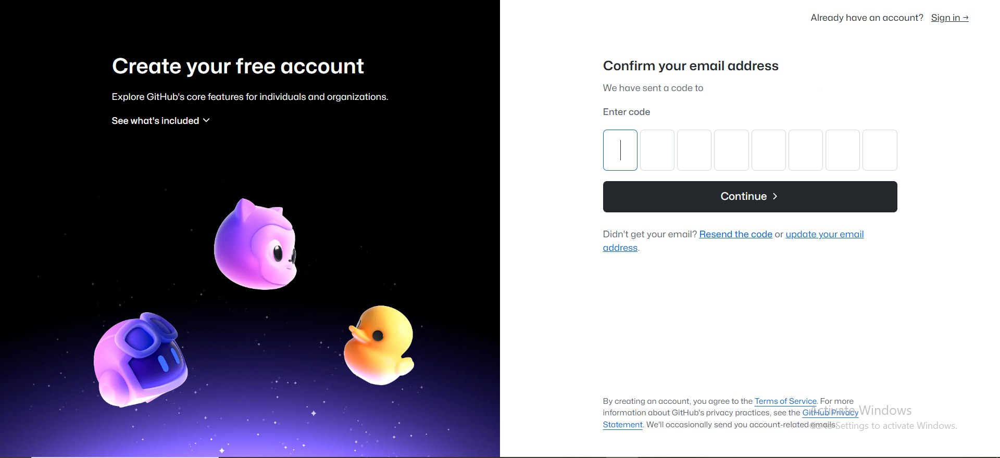

پس از اتمام این مرحله، اکانت شما با موفقیت ساخته شده است. حال باید یک بار با این اکانت در گیت‌هاب sign in کنید و وارد اکانت خود شوید.

#### آموزش دانلود و نصب گیت در ویندوز

ابتدا به [سایت گیت](https://git-scm.com) مراجعه کنید و بر روی گزینه‌ی Install for windows بزنید.

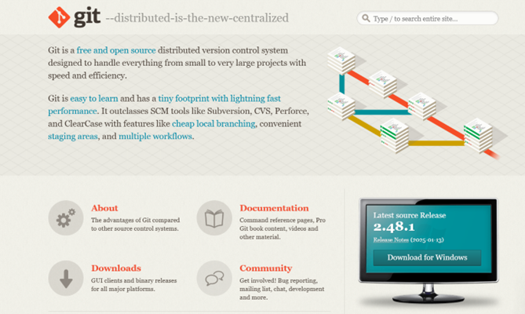

سپس بر روی Git for Windows/x64 Setup بزنید تا دانلود آخرین نسخه آغاز شود.

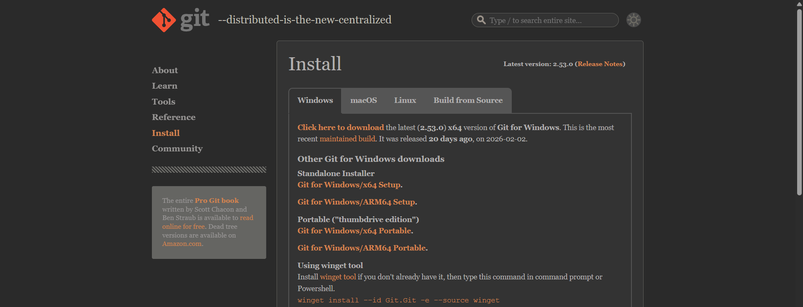

پس از پایان دانلود بر روی فایل setup دانلود شده بزنید. در صفحه اول بر روی Next بزنید. سپس مطابق تصویر ۲ مسیر نصب را انتخاب کرده و Next را بزنید. در صفحه‌ی بعدی، اجزایی که می‌خواهید نصب شوند از شما پرسیده شده است. همانند تصویر ۳ اجزای ضروری به‌صورت پیش‌فرض انتخاب شدند. Next را بزنید، مطابق تصویر ۴ در این صفحه می‌توانید مسیر ایجاد شورت‌کات را انتخاب کنید که پیش‌فرض آن بر فولدر نصب برنامه تنظیم شده است و نیاز به تغییر آن نیست. سپس Next را بزنید.

همانند تصویر ۵، در صفحه‌ی بعدی می‌توانید یک ادیتور پیش‌فرض برای گیت، از بین ادیتورهای موجود در دستگاه خود انتخاب کنید. توجه داشته باشید که این تنظیمات پس از نصب نیز قابل‌تغییر است و در این مرحله ضرورتی در تغییر آن نیست. سپس Next را بزنید. در مرحله‌ی بعد نیز مطابق تصویر ۶ می‌توانید نام branch اولیه‌ی خود را تغییر دهید. این عمل در هنگام کار با گیت برای هر Repository نیز ممکن است و نیازی به تغییر آن از حالت پیش‌فرض نیست. درباره‎ی چیستی و کارکرد branch و repository در ادامه‌ی ترم خواهید آموخت. Next را بزنید.


| (1)  | (2) 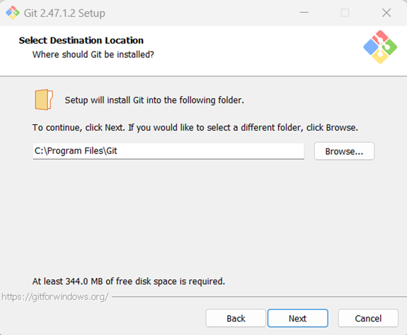 |
| ------------------------------------ | ------------------------------------ |
| (3) 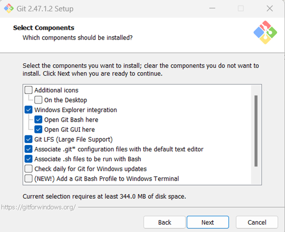 | (4) 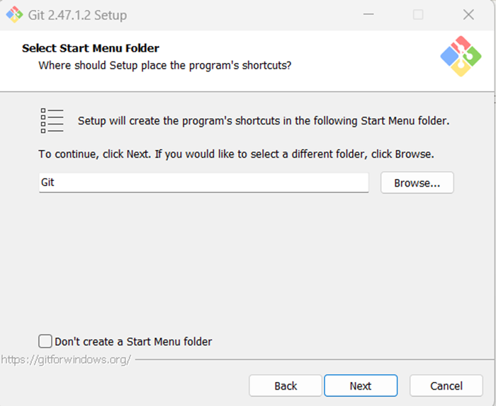 |
| (5) 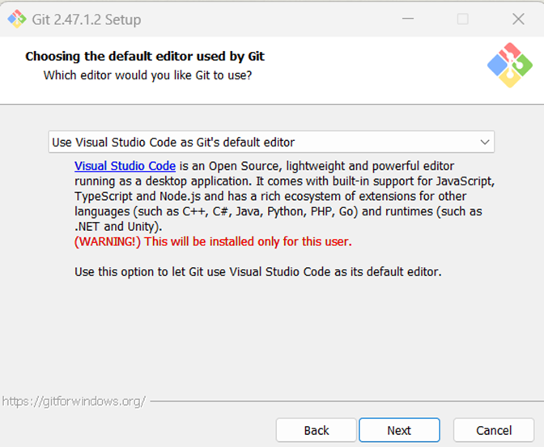 | (6) 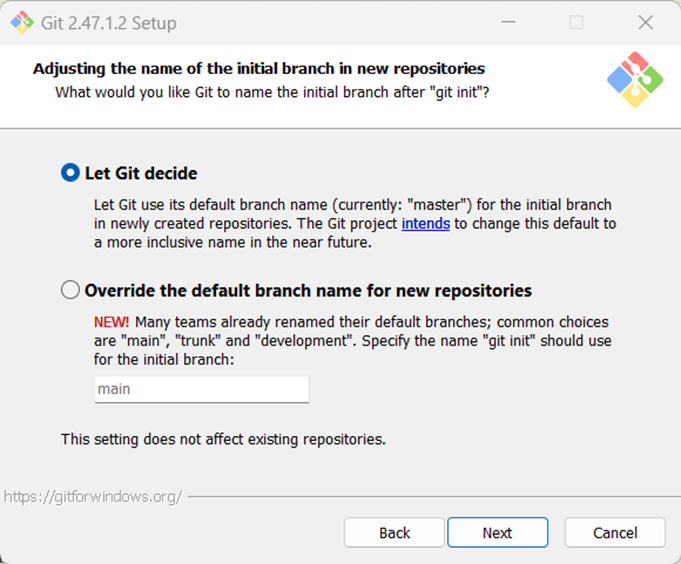 |
| (7) 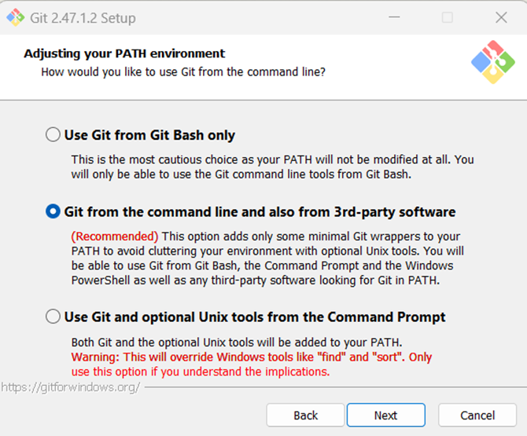 |                                      |


در آخرین صفحه از تصاویر بالا (۷) می‌توانید command line مورداستفاده‌ی خود را انتخاب کنید. گزینه‌ی پیش‌فرض بهترین گزینه است. سپس Next را بزنید.

در صفحات بعد (مطابق تصاویر ۸-۱۳)، درباره‌ی برخی تنظیمات و قابلیت‌ها سوال شده است. جزئیات هر کدام از این تنظیمات از مباحث کلاس خارج است و از آن‌جایی که همگی آن‌ها بعد از نصب نیز قابل تنظیم هستند، نیاز به تغییر شان از گزینه‌ی پیش‌فرض نیست. در این صفحات گزینه‌ی Next را بزنید و در نهایت در آخرین صفحه Install را بزنید.


| (8)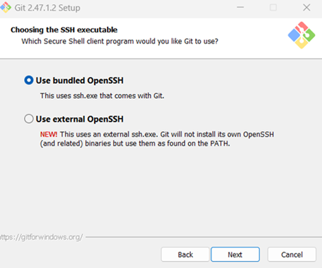   | (9) 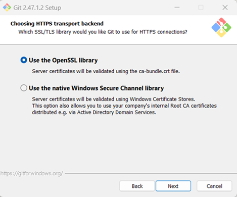  |
| ------------------------------------- | ------------------------------------- |
| (10) 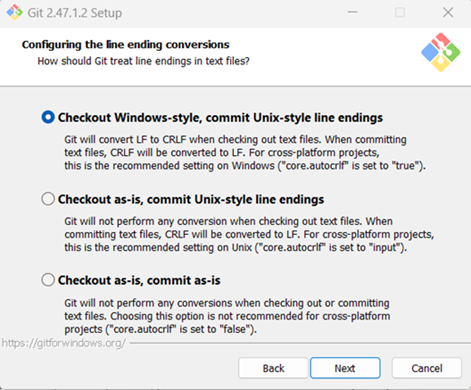 | (11) 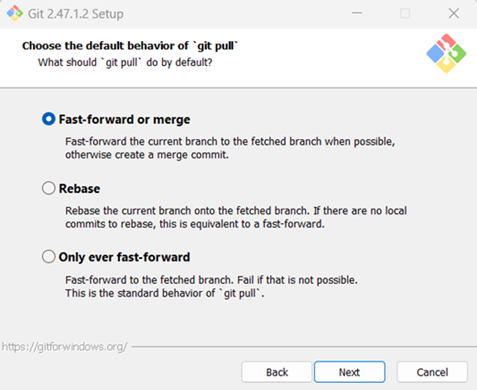 |
| (12) 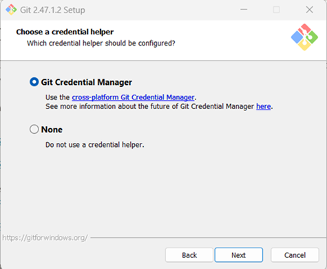 | (13) 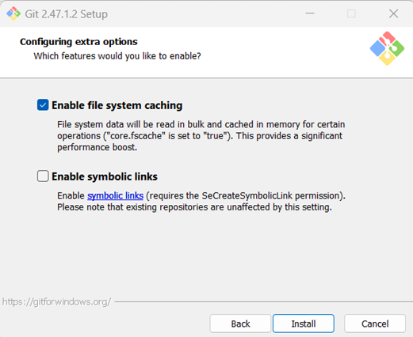 |


بعد از پایان فرآیند Installation، در صفحه‌ی زیر Finish را بزنید.

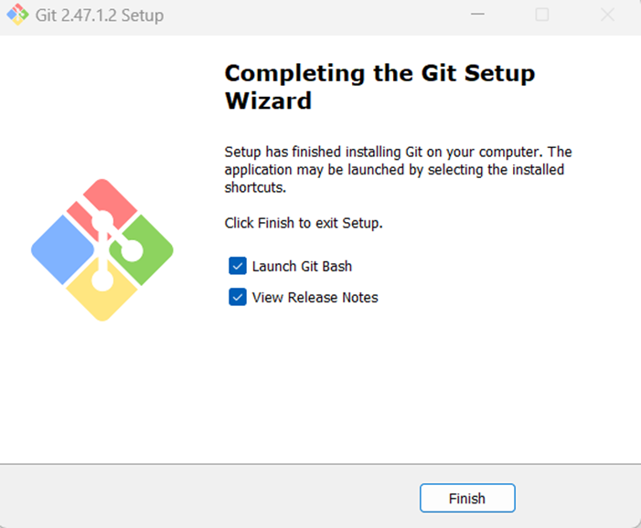

اکنون نصب به پایان رسیده است. می‌توانید از طریق Git Bash یا Command Prompt دستورات را نوشته و با گیت کار کنید. همچنین می‌توانید از Git GUI استفاده کنید که محیط گرافیکی برای استفاده از گیت می‌باشد. در ادامه درس، توضیحات کامل درباره نحوه کارکرد گیت و چرایی استفاده و اهمیت آن در برنامه‌نویسی داده می‌شود.

#### آموزش دانلود و نصب گیت در مک

در سیستم‌عامل macOS راحت‌ترین راه نصب گیت، نصب Xcode Command Line Tools است. با اجرای دستور زیر در ترمینال Xcode را نصب کنید.

```bash
~ xcode-select --install  
```

سپس با اجرای دستور زیر می‌توانید ورژن نصب‌شده گیت در سیستم خود را مشاهده کنید.

```bash
~ git --version  
```

## دوره‌های آموزشی جانبی

به عنوان بخشی از سفر ما به دنیای برنامه‌نویسی جاوا، چهار منبع تکمیلی به صورت ویدیو، سایت و کتاب برای شما معرفی شده است. این منابع مکمل برنامه درسی اصلی ما هستند و درک شما از مفاهیم جاوا را عمیق‌تر می‌کنند.

- **دوره ۱۲ ساعته Bro Code:**
دوره جامع ۱۲ ساعته Bro Code مجموعه جذاب موضوعات ضروری در جاوا را پوشش می‌دهد و توضیحات واضح و مثال‌های عملی را برای تقویت یادگیری شما ارائه می‌دهد. چه مبتدی باشید و چه به دنبال تجدید مهارت‌های خود هستید، دوره Bro Code یک رویکرد ساختاریافته برای تسلط بر اصول جاوا ارائه می‌دهد.
[لینک دوره Bro Code در یوتیوب](https://www.youtube.com/watch?v=xTtL8E4LzTQ&t=18816s)

- **MOOC (Massive Open Online Courses):**
پلت‌فرم OOC، یک پلت‌فرم یادگیری انعطاف‌پذیر و تعاملی است که به شما امکان می‌دهد با سرعت خود مطالعه و کاوش کنید. با انبوهی از دوره‌های جاوا که در پلت‌فرم MOOC موجود است، می‌توانید با انتخاب دوره‌ای که با سبک یادگیری و اهداف شما هم‌سو باشد، روند یادگیری خود را بهبود ببخشید. به دنبال دوره‌هایی با رتبه‌بندی بالا و نظرات مثبت باشید تا از تجربه یادگیری مفیدی مطمئن شوید.
[لینک پلت‌فرم MOOC](https://java-programming.mooc.fi/)

- **وب‌سایت W3School:**
یادگیری جاوای خود را با آموزش‌های جامع W3School تکمیل کنید. این وب‌سایت منابع زیادی را ارائه می‌کند که برای مبتدیان طراحی شده است و همه‌چیز، از مطالب اولیه تا مفاهیم پیشرفته جاوا را پوشش می‌دهد. آموزش‌های گام به گام و تمرین‌های عملی آن‌ها فرصتی عالی برای تقویت درک شما از اصول برنامه‌نویسی جاوا فراهم می‌کند.
[وب‌سایت W3School](https://www.w3schools.com/java/)

- **کتاب Effective Java by Addison Wesley:**
جاوا موثر اثر ادیسون، کتابی است که خواندنش برای هر توسعه‌دهنده جاوا ضروری است. این کتاب بینش‌های ارزشمند و بهترین شیوه‌ها را برای نوشتن کد جاوای کارآمد، قابل نگه‌داری و قوی ارائه می‌دهد. در این کتاب طیف گسترده‌ای از موضوعات پوشش داده شده است، از ایجاد شی و مقداردهی اولیه گرفته تا هم‌زمانی و مدیریت خطا، با ارائه توصیه‌های عملی با پشتوانه نمونه‌های دنیای واقعی. چه مبتدی باشید و چه یک توسعه‌دهنده با تجربه، «جاوا موثر» به شما کمک می‌کند تا مهارت‌های کدنویسی خود را ارتقا دهید و برنامه‌های جاوا با کیفیت بالا تولید کنید.

هر یک از این دوره‌های جانبی، یک رویکرد منحصربه‌فرد برای یادگیری جاوا ارائه می‌دهد که به شما امکان بررسی زبان از دیدگاه‌های مختلف و عمیق‌تر کردن تخصص خود را می‌دهد. ما شما را تشویق می‌کنیم که از این منابع برای بهبود سفر یادگیری خود و تقویت درک خود از مفاهیم برنامه‌نویسی جاوا استفاده کنید.
