## مقدمه

در این داکیومنت و داکیومنت‌های بعدی، با شی‌گرایی آشنا می‌شویم. شی‌گرایی یا object-oriented programming (به اختصار OOP )،  طرز فکری است برای تقسیم یک برنامهٔ بزرگ، به واحدهای کوچک‌تر به اسم class . خیلی از چیزهایی که قبلا بهتون گفته بودیم «در آینده برایتان توضیح می‌دهیم» را قرار است این‌جا یاد بگیرید!

پیشنهاد می‌کنیم در طول مطالعه‌ی این داکیومنت با تدریس یارها در ارتباط باشید و اگر سوالی داشتید حتما از آن‌ها بپرسید، زیرا این یکی از مهم‌ترین داکیومنت‌های شماست و پایه‌ایست برای اکثر مطالبی که در ادامه‌ی ترم باهم مورد بحث قرار می‌دهیم مانند ارث‌بری، کپسوله‌سازی و مباحث مشابه .

## تایپ‌ها در جاوا

تا به اینجا با بسیاری از type ها مثل `int`، `float`، `String`، `JFrame`، `ArrayList` و ... کار کرده‌اید و با آن‌ها آشنا شده‌اید؛ هر برنامه‌نویسی در جاوا، می‌تواند به راحتی تایپ‌های جدید برای خودش بسازد و به همین خاطر، احتمالا تا به حال میلیون‌ها تایپ در جاوا نوشته شده‌اند. شما نیز در این داک قرار است یاد بگیرید که چطور می‌توانید تایپ‌های جدید بسازید.

همان‌طور که در جلسه‌ی صفر دیدید، تایپ‌های `int`، `float`، `double`، `long` و `char`، به اسم «تایپ‌های اولیه» یا primitive types شناخته می‌شوند. فهرست کامل آن‌ها به شکل زیر است:

| Type      | Definition                               | Approximate range or precision          |
| --------- | ---------------------------------------- | --------------------------------------- |
| `boolean` | Logical Value                            | `true` or `false`                       |
| `char`    | $16$-bit, Unicode character              | $64k$ characters                        |
| `byte`    | $8$-bit, signed integer                  | $-128$ to $127$                         |
| `short`   | $16$-bit, signed integer                 | $-32, 768$ to $32,676$                  |
| `int`     | $32$-bit, signed integer                 | $-2.1\mathrm{e}9$ to $2.1\mathrm{e}9$   |
| `long`    | $64$-bit, signed integer                 | $-9.2\mathrm{e}18$ to $9.2\mathrm{e}18$ |
| `float`   | $32$-bit, IEEE 754, floating-point value | $6-7$ significant decimal places        |
| `double`  | $64$-bit, IEEE 754                       | $15$ significant decimal places         |

این تایپ‌ها، مانند تیکه‌های کوچک لگو هستند که تایپ‌های پیچیده‌تر مانند `String`، `JFrame`، `ArrayList` و هر تایپ دیگری را تشکیل می‌دهند. این تایپ‌های پیچیده‌تر، reference type نام دارند. در ادامه یک مثال از آن‌ها را مورد بررسی قرار می‌دهیم. کد زیر را در IntelliJ کپی کنید:

```java
public class Main {
    public static void main(String[] args) {  
        String str = "Hello World";  
        System.out.println(str);  
    }  
}
```

موس را روی `String` ببرید و کلیک راست کنید. از صفحه‌ای که باز می‌شود، منوی Go To و بعد از آن، Declaration or Usages را انتخاب کنید:

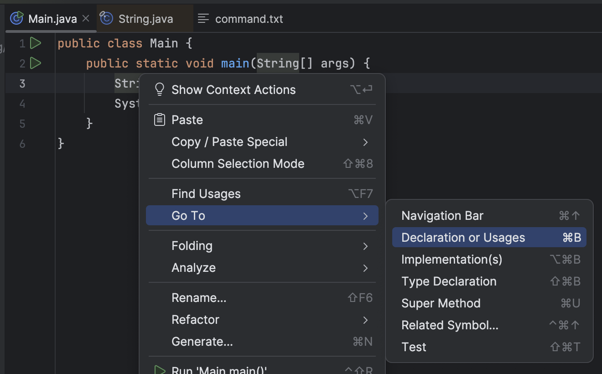

صفحه‌ی جدیدی برایتان باز می‌شود که شامل پیاده‌سازی تایپ `String `است:

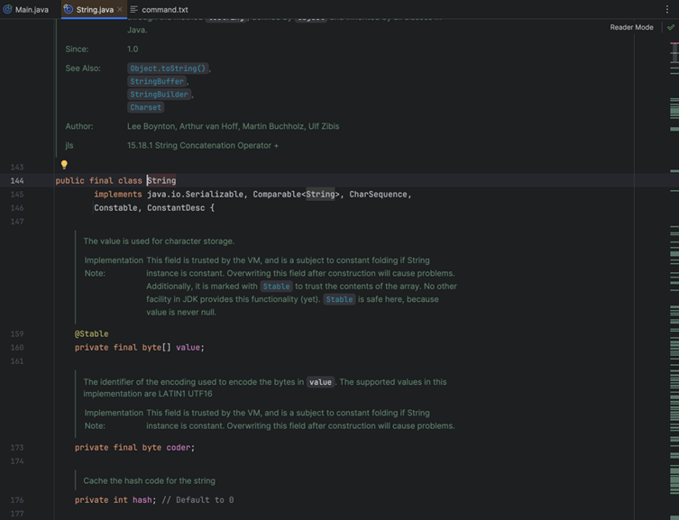

احتمالا شما هنوز این کد را کامل نمی‌فهمید، ولی در این کد نشان داده شده است که تایپ `String` از کنار هم گذاشتن چه تایپ‌های دیگری درست شده است. مثلا در خط ۱۶۰ همین تصویر می‌بینید که `String` در خودش یک آرایه از `byte` ها دارد که اسمش `value` ‍است. پایین‌تر می‌بینید که در خودش، یک `int` به نام `hash` دارد. اگر دوست دارید، کمی این کد را بررسی کنید. با آن که تیکه‌هایی از آن برایتان غریبه هستند، بخش‌هایی هم برای شما آشنا به نظر می‌آیند.

## کلاس‌ها

کلاس‌ها، به شما اجازه می‌دهند تا `type` های جدیدی درست کنید. برای شروع، با هم یه کلاس جدید به اسم `Student` درست می‌کنیم. کد زیر را در IntelliJ بنویسید:

```java
public class Main {
    public static void main(String[] args) {  
        System.out.println("Hello World!");  
    }  
}

class Student {
    public int age; 
    public String name;
    public String studentID;  
}
```

در این کد، ما یک `class` جدید، به نام `Student` تعریف کرده‌ایم. این کلاس، از چهار متغیر تشکیل شده است:

- متغیر `age`: متغیری از جنس `int` که سن دانشجو را نشان می‌دهد.
- متغیر `name`: متغیرِ `String` ای که اسم دانشجو را نشان می‌دهد.
- متغیر `studentID`: متغیر `String` ای که شماره‌ی دانشجویی شخص را نشان می‌دهد.

متغیرهایی که یک کلاس را تشکیل می‌دهند، `field` های آن کلاس نام دارند. نگران کلیدواژه‌ی `public` نباشید، در جلسات آینده مفهوم آن را توضیح خواهیم داد. برای الان، لازم است که آن را پیش از همه‌ی `field` های کلاس‌هایتان قرار دهید. حالا با کلیدواژهٔ `new`، یک دانشجوی جدید به اسم قلی بسازید و فیلدهای آن را مقداردهی کنید:

```java
public static void main(String[] args) {  
    Student gholi = new Student();  
  
    gholi.age = 20;  
    gholi.name = "Gholi";  
    gholi.studentID = "40413099";  
}
```

سپس مشخصات این دانشجو را چاپ کنید:

```java
System.out.println("New student:");  
System.out.println("\t+ Name: " + gholi.name);  
System.out.println("\t+ StudentID: " + gholi.studentID);  
System.out.println("\t+ Age: " + gholi.age);
```

کد خود را اجرا کنید. خروجی زیر را می‌بینید:

```text
New student:  
    + Name: Gholi  
    + StudentID: 40413099  
    + Age: 20
```

می‌بینید که مشخصات قلی، به درستی روی صفحه چاپ می‌شود. تبریک! شما اولین type خود را ساختید و یک متغیر از جنس آن درست کردید. می‌خواهیم به این type جدید، چیزهای بیشتری اضافه کنیم. به `Student` فیلدی به اسم `grades` از جنس `ArrayList<Double>` اضافه کنید. این فیلد، نمرات دانشجو در درس‌های مختلف را نشان می‌دهد:

```java
public ArrayList<Double> grades;
```

حالا، وقتی دارین فیلدهای مختلف قلی رو توی `main` مقداردهی می‌کنید، این آرایه هم با یک آرایهٔ خالی مقداردهی کنید:

```java
gholi.age = 20;  
gholi.name = "Gholi";  
gholi.studentID = "40413099";  
gholi.grades = new ArrayList<Double>();
```

بعد از این کار، چند نمره‌ی رندوم به قلی بدهید:

```java
gholi.grades.add(20.0);  
gholi.grades.add(17.0);  
gholi.grades.add(18.0);  
gholi.grades.add(0.0);
```

حالا، جایی که دارید مشخصات قلی را چاپ می‌کنید، نمرات را هم چاپ کنید:

```java
System.out.println("New student:");  
System.out.println("\t+ Name: " + gholi.name);  
System.out.println("\t+ StudentID: " + gholi.studentID);  
System.out.println("\t+ Age: " + gholi.age);  
System.out.print("\t+ Grades: ");
for (var grade: gholi.grades) {  
    System.out.print(grade + ", ");  
}
```

کدتان را اجرا کنید. خروجی شما باید به این شکل باشد:

```text
New student:  
    + Name: Gholi  
    + StudentID: 40413099  
    + Age: 20  
    + Grades: 20.0, 17.0, 18.0, 0.0,
```

می‌خواهیم به `Student`، قابلیت محاسبه‌ی معدل هم بدهیم. برای این کار، متدی جدید به اسم `getAverageGrade` در `Student` تعریف می‌کنیم:

```java
class Student {
    public int age;
    public String name;
    public String studentID;
    public ArrayList<Double> grades;

    public double getAverageGrade() { 
        if (grades.size() == 0) {
            return 0;  
        }

        double gradeSum = 0;
        for (double grade: grades) {  
            gradeSum += grade;  
        }

        return gradeSum / grades.size();  
    }  
}
```

جایی از کدتان که در آن مشخصات `gholi` را چاپ می‌کنید، خطوط زیر را اضافه کنید:

```java
System.out.println();  
System.out.println("\t+ Average Grade: " + gholi.getAverageGrade());
```

کدتان را دوباره اجرا کنید. خروجی‌ای مثل زیر می‌بینید:

```text
New student:  
    + Name: Gholi  
    + StudentID: 40413099  
    + Age: 20  
    + Grades: 20.0, 17.0, 18.0, 0.0,   
    + Average Grade: 13.75
```

لحظه‌ای به خود تابع `main` توجه کنید. می‌بینید که خود آن نیز در کلاسی به اسم `Main`‍است! شما در تمام این مدت داشتید کلاس `Main` را تعریف می‌کردید، بدون آن که خبر داشته باشید:

```java
public class Main {
    public static void main(String[] args) {
        // Your code here
    }  
}
```

شما حتی می‌توانید از این کلاس هم یک متغیر درست کنید:

```java
public class Main {
    public static void main(String[] args) {  
        Main a = new Main();  
    }  
}
```

البته که متغیر ساختن از جنس `Main` خیلی کار خوبی نیست! ولی جالب است که تا همین الآن هم شما از `class` ها استفاده می‌کردید، بدون آن که بدانید. =)))

 در ادامه، کمی رسمی‌تر و قدم به قدم‌تر کلاس‌ها را بررسی می کنیم.

### تعریف کلاس

تعریف کلاس، کار سختی نیست، فقط از کلیدواژهٔ `class` استفاده کنید و اسم کلاستان را بنویسید:

```java
class Student {
    // Everything an student can do
}
```

هر چیزی که بین دو براکت قرار گیرد، متعلق به آن کلاس است. کلاس‌ها، به شما اجازه می‌دهند که کدهای خیلی خیلی بزرگ را به تیکه‌های کوچیک‌تر تقسیم کنید و با این کار، برنامه‌های منظم‌تر و بهتری داشته باشید.

یادآوری می‌کنیم که type هایی که به وسیلهٔ `class` ها تعریف می‌شوند، همگی از reference typeها محسوب می‌شوند.

## ایجاد Object

به متغیرهایی که از جنس یک reference type هستند، object یا instance می‌گویند.در کد زیر، قلی و ممد و سلطان همگی object هایی از جنس `Student` ان:

```java
public static void main(String[] args) {  
    Student gholi;  
    Student mamad;  
    Student soltan;  
}
```

تلاش کنید این کد را اجرا کنید. می‌بینید که طبیعتا بدون هیچ مشکلی اجرا می‌شود. شما توی این کد سه object جدید تعریف کردید و هیچ‌جایی آن‌ها را مقداردهی نکردید و جایی هم از آن‌ها استفاده نشده است.

برای این که آن‌ها را مقداردهی کنید، از کلید‌واژهٔ new استفاده کنید:

```java
Student gholi = new Student();  
Student mamad = new Student();  
Student soltan = new Student();
```

حالا فیلدهای ان‌ها را مقداردهی کنید:

```java
gholi.age = 21;  
gholi.name = "Gholi";  
gholi.studentID = "40513089";  
gholi.grades = new ArrayList<>();  
  
mamad.age = 25;  
mamad.name = "Mamad";  
mamad.studentID = "40513090";  
mamad.grades = new ArrayList<>();  
  
soltan.age = 103;  
soltan.name = "Soltan";  
soltan.studentID = "40513091";  
soltan.grades = new ArrayList<>();
```

همانطور که می‌بینید ما در این کد به اجبار کد های تکراری زیادی زده‌ایم. کدی که مربوط به بخش مقداردهی field های یک object
است سه بار تکرار می‌شود پس بهتر است این کدها را به یک متد تبدیل کنیم. `Constructor` ها، متدهایی هستند که دقیقا برای همین کار، به کمک ما می‌آیند.

### Constructor ها

به  کلاس Student، متد زیر را اضافه کنید:

```java
public Student(int newStudentAge, String newStudentName, String newStudentID) {
    age = newStudentAge;
    name = newStudentName;
    studentID = newStudentID;

    grades = new ArrayList<>();  
}
```

می‌بینید که ظاهر این متد، کمی متفاوت است!  نوع خروجی‌اش مشخص نشده و جایی از کلیدواژه‌ی `return` استفاده نکرده است. به این متد، `Constructor` می‌گویند و وظیفه‌ی آن، مقداردهی یک object جدید از کلاس `Student` ‍است. در constructor بالا، ما برای ساخت یه `Student` جدید، سن، اسم و شماره دانشجویی‌اش را ورودی گرفته‌ایم و با استفاده از آن‌ها فیلدهای `Student` را برای object جدیدمان مقداردهی کرده‌ایم.

برای این که از این `constructor` استفاده کنید، کد توی `main` را با کد زیر جایگرین کنید:

```java
public static void main(String[] args) {  
    Student gholi = new Student(21, "Gholi", "40513089");  
    Student mamad = new Student(25, "Mamad", "40513090");  
    Student soltan = new Student(103, "Soltan", "40513091");  
}
```

می‌بینید که با استفاده از یه `constructor` خوب، چقدر کد `main` کوتاه‌تر و تمیزتر شد! حالا متد زیر را به `Student` اضافه کنید:

```java
public void printInfo() {  
    System.out.println("Student info:");  
    System.out.println("\t+ Name: " + name);  
    System.out.println("\t+ StudentID: " + studentID);  
    System.out.println("\t+ Age: " + age);  
    System.out.print("\t+ Grades: ");
    for (var grade: grades) {  
        System.out.print(grade + ", ");  
    }  
    System.out.println();  
    System.out.println("\t+ Average Grade: " + getAverageGrade());  
}
```

و توی `main`، این متد را صدا بزنید تا اطلاعات ممد و قلی و سلطان چاپ شود:

```java
gholi.printInfo();  
mamad.printInfo();  
soltan.printInfo();
```

خروجی‌ای مثل زیر می‌بینید:

```java
Student info:  
    + Name: Gholi  
    + StudentID: 40513089  
    + Age: 21  
    + Grades:   
    + Average Grade: 0.0  
Student info:  
    + Name: Mamad  
    + StudentID: 40513090  
    + Age: 25  
    + Grades:   
    + Average Grade: 0.0  
Student info:  
    + Name: Soltan  
    + StudentID: 40513091  
    + Age: 103  
    + Grades:   
    + Average Grade: 0.0
```

می‌بینیم که constructor ها کار کردند و کد ما هم، کوتاه و تمیز شد!

### Default Constructor

پیش از آن که ما برای کلاس `Student` کانستراکتور تعریف کنیم، می‌توانستیم با استفاده از کلیدواژهٔ `new` از آن object بسازیم:

```java
Student gholi = new Student();
```

خب، کمی بهش فکر کنید. چگونه این اتفاق افتاد؟ ما که`constructor`
 ای برای `Student` نداشتیم! با نوشتن این کد، دقیقا چه  `constructor` ای صدا زده می‌شود؟

وقتی یک کلاس  `constructor` نداشته باشد، جاوا به طور پیش‌فرض یک `constructor`  خالی برایش می‌نویسد. این `constructor` به شکل زیر است:

```java
public Student() {}
```

در این کانستراکتور هیچ اتفاقی نمی‌افتد و هیچ field ای مقداردهی نمی‌شود. صرفاً وجود دارد تا شما بتوانید به راحتی با استفاده از `new Student()`، آبجکت‌های جدیدی از این کلاس بسازید. به محض آن که شما اولین `constructor` کلاس `Student` را بنویسید، دیگر نمی‌توانید از default constructor جاوا استفاده کنید. در کد main فعلیتان این خط را بنویسید و آن را اجرا کنید:

```java
Student pedram = new Student();
```

خطایی مانند زیر می‌گیرید:

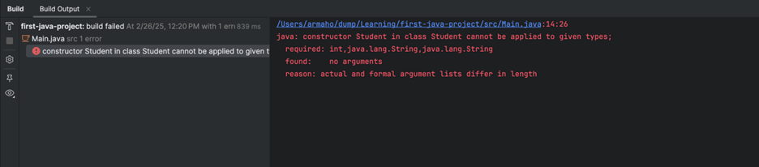

از آن‌جایی که کلاس `student`، الآن یک `constructor` دارد، جاوا برای شما کانستراکتور دیفالت را درست نمی‌کند.

### کلاس‌ها با چند کانستراکتور

شما می‌توانید برای رفع مشکلی که بالاتر به آن برخورد کردید، خودتان یک کانستراکتور خالی برای `Student` بنویسید:

```java
public Student() {}
```

دقت کنید که لازم نیست کانستراکتور قبلی خود را پاک کنید! هر کلاس، می‌تواند چندین کانستراکتور داشته باشد. شما می‌توانید این دو کانستراکتور را در کنار هم بنویسید و کدتان همچنان کار می‌کند.

## field ها

متغیر های یک کلاس، یا field ها، ویژگی‌های آن کلاس را نشان می‌دهند. شما تا الآن تعداد خوبی field برای کلاس student تعریف کردید و با آن‌ها آشنا شدید:

```java
class Student {
    public int age;
    public String name;
    public String studentID;
    public ArrayList<Double> grades;

    // Other things happening in the Student class

}
```

شما حتی می‌توانید در یک کلاس، field هایی از جنس همان کلاس تعریف کنید! مثلاً، می‌توانید فیلد friend را برای `Student`، از جنس خود `Student` تعریف کنید:

```java
class Student {
    // Other fields
    
    public Student friend;

    // Other things happening in the Student class

}
```

حالا، یک `student` جدید به اسم شهرام توی کدتان تعریف کنید:

```java
var shahram = new Student();
```

برای الآن، بدون این که فیلدهای شهرام را مقداردهی کنید، سعی کنید تا اطلاعات او را چاپ کنید:

```java
System.out.println("Shahram: ");  
System.out.println("\t+ Name: " + shahram.name);  
System.out.println("\t+ Age: " + shahram.age);  
System.out.println("\t+ StudentID: " + shahram.studentID);
```

کدتان را اجرا کنید، خروجی زیر را برای شهرام می‌بینید:

```text
Shahram:  
    + Name: null  
    + Age: 0  
    + StudentID: null
```

می‌بینید که علی رغم آن که شما به شهرام اسم و سن و شماره دانشجویی ندادید، خود جاوا یک سری مقدار به آن‌ها اختصاص داده است. مقدار دیفالت جاوا برای فیلدهایی که مقداردهی نشده‌اند، به این شکل است:

- **متغیرهای عددی (مثل `int`، `float` و امثال اون‌ها):** مقدار `0` را به خود می‌گیرند.
- **متغیرهای `char`:** مقدار `'\0'` را به خود می‌گیرند.
- **متغیرهای `boolean`:** مقدار `false` به خود می‌گیرند.
- **متغیرهایی از جنس reference type :** مقدار `null` به خود می‌گیرند.

کلیدواژه‌ی `null`، یکی از کلیدواژه‌های خاص جاواست که در واقع یک مقدار نیست، بلکه نشان‌دهنده‌ی آن است که یک متغیر از جنس reference type، هنوز مقداری به خودش نگرفته است. اگر توی کد قبلیمان، خط زیر را بنویسیم:

```java
if (shahram.studentID == null) {  
    System.out.println("Shahram does not have a studentID");  
}
```

می‌بینید که پیام زیر چاپ می‌شود:

```
Shahram does not have a studentID
```

جلوتر، با این کلید‌واژه بهتر آشنا می‌شویم.

### فیلدهای static

بعضی فیلدها( ویژگی‌ها)، متعلق به هیچ object ای نیستند، ولی بی‌ربط به خود `class` هم نیستند. مثلا در کلاس `Student` ویژگیِ «تعداد کل دانشجوها» متعلق به هیچ کدام از قلی، ممد یا سلطان نیست، ولی به کلاس  `Student`  ربط دارد.

به این ویژگی‌ها، ویژگی‌های `static` گویند. آن‌ها به خود class مرتبط هستند و بین تمام instance های آن class مشترکند. فیلد`static` زیر را برای دانشجوها تعریف کنید:

```java
class Student {
    public static int totalNumberOfStudents = 0;

    // other stuff

}
```

سپس در همه‌ی constructor هایی که برای `Student` نوشته‌اید، به مقدار آن یکی اضافه کنید. با این کار، با ساخت هر دانشجو، تعداد کل دانشجوها یکی زیاد می‌شود:

```java
public Student() {
    totalNumberOfStudents++;  
}

public Student(int newStudentAge, String newStudentName, String newStudentID) {
    age = newStudentAge;
    name = newStudentName;
    studentID = newStudentID;
    grades = new ArrayList<>();
    
    totalNumberOfStudents++;  
}
```

حالا، کد زیر را در main بنویسید:

```java
public static void main(String[] args) {
    var gholi = new Student();  
    System.out.println("Current number of students: " + Student.totalNumberOfStudents);

    var mamad = new Student();  
    System.out.println("Current number of students: " + Student.totalNumberOfStudents);

    var javad = new Student();  
    System.out.println("Current number of students: " + Student.totalNumberOfStudents);  
}
```

همچین خروجی‌ای می‌بینید:

```text
Current number of students: 1  
Current number of students: 2  
Current number of students: 3
```

می‌بینید که ما برای دسترسی به `totalNumberOfStudents`، از خود کلاس `Student` استفاده کرده‌ایم. می‌توانستید با کد زیر، از هر کدام از instance های `student` نیز به آن دسترسی پیدا کنید، ولی کار چندان خوبی نیست:

```java
System.out.println("Current number of students: " + gholi.totalNumberOfStudents);
```

## method ها

تا اینجای کار، با کلاس‌های نسبتاً ساده‌ای سر و کار داشتید. اما جاهای مختلف به «رفتار کلاس» یا این ایده که کلاس ما کاری انجام بدهد اشاره کردیم، اینجاست که متدها وارد عمل می‌شوند: به طور کلی زمانی که بخواهید در کدتان تصمیمی بگیرید یا عملیات منطقی انجام بدهید یا به طور کلی کاری انجام بدهید، باید از متدها استفاده کنید. متدها آنقدر مهم هستند که حتی در اولین مواجه‌­تون با جاوا از متد `main` استفاده کردید و داخل آن کد خود را نوشتید! در این بخش قرار است دقیق‌­تر و کامل‌­تر با متدها آشنا بشوید. کد زیر، یک مثال ساده از یک متد است:

```java
public class Refrigerator {
    int numberOfBananas;

    public void getBananas(int n) {
        boolean enoughBananas = numberOfBananas >= n;
        if (enoughBananas) {
            numberOfBananas -= n;  
            System.out.println(
                    "You took " + n + " bananas out of your fridge!"
            );  
        } else {  
            System.out.println(
                    "You don't have that many bananas in your fridge!"
            );  
        }  
    }  
}
```

در این مثال، یه کلاس `Refrigerator` داریم که یک فیلد از نوع `int` به نام `numberOfBananas` دارد. همچنین یک متد دارد که نوع خروجی‌اش `void` است (خروجی ندارد) و یک ورودی (argument) از نوع `int` دارد. با استفاده از این متد می‌­توانید از توی یخچالتون موز بردارید! حالا خودتون یه متد اضافه کنید که باهاش بتونید توی یخچالتون موز بذارید. متدتون احتمالاً چیزی شبیه به این میشود:

```java
public void putBananas(int n) {    
    numberOfBananas += n;  
    System.out.println("You put " + n + " bananas in your fridge!");  
}
```

اینجا، متدمون تعداد مشخص و ثابتی ورودی دارد ( یکی )؛ اما می­توانید متدهایی تعریف کنید که تعداد ورودی­هاشون ثابت نباشد. برای این درس لازم نیست اینو یاد بگیرید، ولی اگه خودتون دوست دارید بیشتر راجع بهش بدونید، می­تونید کلمه “varargs” را جستجو کنید یا از [این لینک](https://www.geeksforgeeks.org/variable-arguments-varargs-in-java/) راجع بهش بخونید.

### متغیرهای محلی (local variables)

متد `getBananas()` که توی مثال بخش قبل تعریف کردیم، قبل از هر چیزی چک می­کند که توی یخچال به اندازه کافی موز وجود داشته باشد و این را در یک متغیر محلی به اسم `enoughBananas` ذخیره می­کند. متغیرهای محلی موقتی هستند و فقط توی همان متدی که تعریف شدن قابل استفاده‌اند. این متغیرها وقتی متد صدا زده می‌شود، ساخته می‌شوند و معمولاً بعد از تمام شدن متد از بین میروند. همچنین از بیرون متد هم نمی‌تونید به انها دسترسی داشته باشید. برای این که خودتون ببینید، توی همین کلاس `Refrigerator` سعی کنید توی متد `putBananas` از متغیر `enoughBananas` استفاده کنید؛ همچین چیزی مثلا:

```java
public void putBananas(int n) {  
    System.out.println(enoughBananas);
    numberOfBananas += n;  
    System.out.println("You put " + n + " bananas in your fridge!");  
}
```

احتمالاً می­­بینید که `enoughBananas` قرمز شده. موس را ببرید روی ان ؛ با همچین چیزی مواجه می­شید:

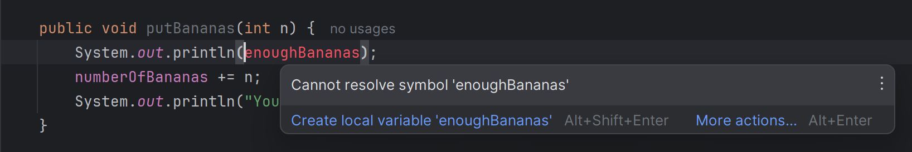

اینجا Intellij دارد به شما می­گوید که نمی­تواند `enoughBananas` را پیدا کند! دلیلش هم همانطور که گفتیم این است که `enoughBananas` توی متد `getBananas` تعریف شده و مربوط به همون متد است و توی `putBananas` همچین متغیری وجود ندارد! حالا یک متد `main` خالی توی کلاستون بنویسید و سعی کنید اجراش کنید:

```java
public class Refrigerator {
	int numberOfBananas;
    
	public void getBananas(int n) {
		boolean enoughBananas = numberOfBananas >= n;
		if (enoughBananas) {
			numberOfBananas -= n;
			System.out.println(
			   "You took " + n + " bananas out of your fridge!"
			);  
			} else {
			System.out.println(
				"You don't have that many bananas in your fridge!"
			);  
		}  
	}

	public void putBananas(int n) {  
		System.out.println(enoughBananas);
		numberOfBananas += n;
		System.out.println("You put " + n + " bananas in your fridge!");  
    }
    
    public static void main(String[] args) {  
    }  
}
```

کدتون کامپایل نمیشود، و با همچین چیزی مواجه می­شید:

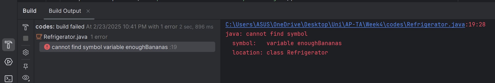

اینجا جاوا نتونسته کدتون را کامپایل کند و به شما میگوید که نمی­تواند `enoughBananas` را پیدا کند. باید هشدار های Intellij را جدی می­گرفتید!

ورودی‌های یک متد هم جزو متغیرهای محلی ان متد حساب میشوند، با این تفاوت که مقدار اولیه‌شون موقعی که متد صدا زده می‌شود از طرف کسی که متد را فراخوانی کرده است، مشخص میشود.

#### مقداردهی اولیه به متغیرهای محلی

بر خلاف فیلدهای آبجکت که اگر مقداردهیشون نکنید، جاوا برای انها مقدار پیش­فرضی قرار میدهد، متغیر های محلی را باید قبل از استفاده کردن مقداردهی کنید وگرنه خطای کامپایل می­گیرید:

```java
public class SomeClass {
    // instance variables always get default values if  
    // you don't initialize them
    int foo;

    void myMethod() {
    // local variables do not get default values
        int bar;
        foo += 1; // This is ok, foo has the value 0
        bar += 1; // compile-time error, bar is uninitialized
    }

    public static void main(String[] args) {  
        SomeClass something = new SomeClass();  
        something.myMethod();  
    }  
}
```

سعی کنید کد بالا را اجرا کنید. می­بینید که کدتون حتی کامپایل هم نمیشود! باید اول `bar` را مقداردهی کنید:

```java
bar = 99; // This is ok, we're setting bar's initial value  
bar += 1; // Now this calculation is ok
```

البته دقت کنید که لازم نیست حتماً موقع تعریف کردن یک متغیر بهش مقداردهی کنید؛ صرفاً قبل از این که ازش استفاده کنید باید مقداردهیش کنید. موضوع وقتی پیچیده­تر میشود که مقداردهی را داخل یک شرط انجام بدید:

```java
void myMethod() {
    int bar;
    if (someCondition) {  
        bar = 42;  
    }  
    bar += 1; // Still a compile-time error, bar may not be initialized
}
```

توی این مثال، `bar` فقط در صورتی مقداردهی میشود که شرط `someCondition` برقرار باشد. یعنی همچنان ممکن است که قبل از خط `bar += 1`، متغیر `bar` مقداردهی نشده باشد. کامپایلر به شما اجازه نمیدهد همچین کاری بکنید و این کد هم خطای کامپایل میدهد.

برای حل این مشکل، چند راه حل وجود دارد. می­توانید متغیر را قبل از شرطتون مقداردهی کنید، یا استفاده ای که از متغیر می­کنید را هم داخل شرط ببرید، یا می­توانید با توجه به برنامه­ ای که دارید می­نویسید، به نحوی مطمئن بشید که متغیر قبل از مقداردهی استفاده نمیشود. برای مثال، توی کد بالا می­تونید `bar` را هم در بلوک if و هم در بلوک `else` مقدار دهی کنید یا در صورتی که `someCondition` برقرار نبود، متد را تموم کنید و `return` کنید:

```java
void myMethod() {
    int bar;
    if (someCondition) {  
        bar = 42;  
    } else {
        return;  
    }  
    bar += 1; // This is ok!
}
```

توی این کد، یا `bar` مقداردهی میشود و بعد ازش استفاده میشود، یا کلا متد قطع میشود و `return` می­کند. جاوا این را ازتون می­پذیره!

حالا چرا اصلاً جاوا انقدر روی این موضوع حساس است؟ یکی از متداول ترین مشکلاتی که توی زبان هایی مثل C و C++ به وجود میاد این است که یادتون میرود متغیری را مقداردهی کنید. توی این زبان­ها، متغیر های مقداردهی نشده، مقادیر ظاهراً رندومی اختیار می­کنند و این می­تواند دردسرساز شود و باعث شود دیباگ کردن برنامه­‌ها سخت تر بشود. جاوا با مجبور کردن شما به مقداردهی به متغیر ها، باعث جلوگیری از این مشکلات میشود.

### Shadowing

وقتی که یک متغیر محلی یا یک ورودی متد اسمش با اسم یکی از فیلد های کلاسمون یکی باشد، اون متغیر محلی، اصطلاحا روی اون فیلد "سایه می­اندازد" و جلوی دسترسی ما به ان فیلد را می­گیرد. شاید فکر کنید این مشکل به ندرت پیش میاد ، ولی shadowing اتفاق نسبتاً متداولی است مخصوصا وقتی که متغیرهامون اسم های متداولی داشته باشند. بیاید با یه مثال ببینیم:

```java
public class Car {
	double x;
	double y;
	
	public void moveTo(double x, double y) {  
		System.out.println("The car is moving to " + x + ", " + y);  
	}  
}
```

اینجا ما یک کلاس به نام `Car` داریم که فعلاً فقط دو تا فیلد برای مختصات دارد ( `x` و `y` ). یک متد `moveTo` برایش تعریف کردیم که قرار است ماشین را برای ما حرکت دهد. همانگونه که می­بینید، فعلاً متد `moveTo` فقط دارد `x` و `y` را چاپ می­کند. اما این `x` و `y`، کدوم `x` و `y` هستند؟ اگر مثلاً مختصات ماشین ما الان `(3,4)` باشد و ما متد `moveTo` را روی ماشین صدا بزنیم و بهش مقادیر `(6,7)` را بدهیم، چه چیزی چاپ میشود؟ خودتون امتحان کنید! توی همین کلاس یک متد `main` بنویسید، توش یک آبجکت جدید از `Car` بسازید، بهش `x` و `y` بدید و متد `moveTo` را روش صدا بزنید.

همانطور که می­بینید، `moveTo` همان مقادیری را چاپ می­کند که بهش ورودی دادیم؛ ولی ما اگر بخواهیم ماشین را حرکت بدیم، باید بتونیم مختصاتش را تغییر بدهیم، ولی چطور می­توانیم به فیلد های `x` و `y` که مربوط به آبجکتمون هستند دسترسی پیدا کنیم؟

#### this

هروقت نیاز دارید که صریحاً به آبجکتی که توش هستیم یا یکی از اعضای اون اشاره کنید، می­تونید از کلیدواژه `this` استفاده کنید. بیاید دوباره با مثال `moveTo` ببینیم:

```java
public class Car {
	double x;
	double y;
	double gas;
	
	public void moveTo(double x, double y) {
		double distance = Math.sqrt(  
			(this.x - x) * (this.x - x) + (this.y - y) * (this.y - y)  
		);
		if (5 * distance > gas) {  
			System.out.println("Not enough gas!");  
		} else {
			this.x = x;
			this.y = y;
			gas -= 5 * distance;  
			System.out.println("The car is moving to " + x + ", " + y);  
		}  
	}  
}
```

اینجا، اول فاصله ای که قراره طی بشود را حساب کردیم و توی متغیر محلی `distance` ریختیم. همونطور که می­بینید، برای دسترسی به `x` و `y` مربوط به آبجکت ( مختصات فعلی ماشین )، از `this.x` و `this.y` استفاده کردیم. `this` در واقع به همون آبجکتی که توش هستیم اشاره می­کند.

اینجا یک فیلد `gas` هم به `Car` اضافه کردیم که قراره مقدار بنزین ماشین را نشان بدهد. در ادامه ی متد اول مطمئن می­شویم که ماشین به اندازه کافی بنزین دارد و بعد اگه بنزین داشت ماشین را حرکت می­دیم. می­بینید که برای دسترسی به `gas` از `this` استفاده نکردیم؛ این به این دلیل است که اشاره به آبجکتی که در ان هستیم به طور ضمنی برقرار است و `gas` و `this.gas` اینجا یک چیز هستند. مشکل جایی به وجود می اید که اسم یکی از متغیرهای محلیمون با اسم یکی از فیلدهای کلاسمون یکی باشد. اون وقت اگر بخواهیم از فیلد کلاس استفاده کنیم، باید صریحاً این را مشخص کنیم وگرنه پیش­فرض جاوا استفاده از متغیر محلی است.

استفاده از `this` برای دسترسی به فیلدهایی که روی انها سایه افتاده، روش مرسومی است و باعث می­شود که بتوانیم از اسم­های متداولی که برای متغیرهای مختلف وجود دارد ( مثلاً `x` و `y` برای مختصات ) استفاده کنیم و لازم نباشد هر بار دنبال یه اسم جدید برای متغیرهامون بگردیم. علاوه بر این، هر جای دیگه‌ای که بخواید به آبجکتی که داخلش هستید اشاره کنید، می‌تونید از `this` استفاده کنید. مثلاً وقتی بخواید خود همین آبجکت را به‌عنوان ورودی به یه متد بفرستید.

### متدهای استاتیک

متدهای استاتیک (static methods)، مثل فیلدهای استاتیک، به خود کلاس تعلق دارند، نه به آبجکت­های مستقلی که ما از روی ان کلاس می­سازیم. اما این یعنی چه؟ اول از همه، متد­های استاتیک خارج از آبجکت­‌ها وجود دارند و برای صدا زدنشون لازم نیست آبجکتی وجود داشته باشد؛ شما می­تونید اسم کلاس را بنویسید و با عملگر نقطه متد­های استاتیک را صدا بزنید. قبلاً از متد­های استاتیک زیاد استفاده کردید، مثلاً برای مرتب کردن آرایه­ ها از `Arrays.sort()` استفاده می­کردید؛ ولی اینجا آبجکتی از کلاس `Arrays` نساختید و مستقیماً متد `sort` را روی کلاس `Arrays` صدا زدید؛ این کار را می­توانید بکنید چون `sort` یک متد استاتیکه.

دوباره از `Arrays.sort()` استفاده کنید یا جایی که ان را نوشتید را بیارید، بعد روی ان راست کلیک کنید و گزینه Go To و بعد Declaration or Usages را انتخاب کنید:

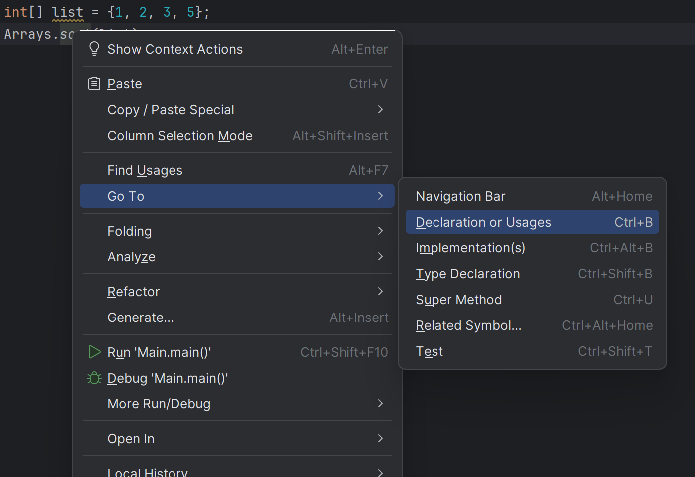

با همچین کدی مواجه می­شید:

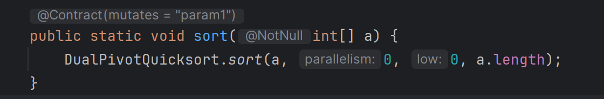

همونطور که می­بینید، پشت این متد از کلیدواژه `static` استفاده شده. این نشان میدهد که این متد، یک متد استاتیک است. حال که می­دانید متد­های استاتیک چگونه تعریف می­شوند، بیاید برای کلاس `Car` که تا الان داشتیم یک متد استاتیک تعریف کنیم:
```java
public class Car {
	public static final int SUV = 0;
	public static final int SEDAN = 1;
	public static final int HATCHBACK = 2;
	
	double x;
	double y;
	double gas;
	int model;

	public static String[] getCarModels() {
		return new String[]{"SUV", "SEDAN", "HATCHBACK"};  
	}
    // ...
 ```

اینجا، اول از همه یک فیلد جدید به ماشین هامون اضافه کردیم به اسم `model` که مدل ماشین ما را نشون میدهد: ماشین ما می­تونه شاسی­‌بلند (`model = 0`)، سواری (`model = 1`) یا هاچ­بک (`model = 2`) باشه. برای راحتی، مدل های مختلف ماشین را به صورت فیلد­های `static final` تعریف کردیم. حالا فرض کنید به اسم این مدل ها به صورت `String` نیاز داشته باشیم، می­تونیم مثل بالا یک متد استاتیک تعریف کنیم که این اطلاعات را به ما بدهد. دقت کنید که مدل‌های مختلف ماشین‌ها هیچ ارتباطی به یک ماشین خاص یا یک آبجکت مشخص از نوع `Car` ندارند و به‌طور کلی برای همه ماشین‌ها یکسان هستند. به همین خاطر، استفاده از فیلدها و متدهای استاتیک بهترین انتخاب است.

اصلی‌ترین کاربرد متدهای استاتیک، برای تعریف متدهای کمکی است؛ متدهایی که یا مستقل از آبجکت‌ها کار می‌کنند، یا روی آبجکت‌هایی که از ان کلاس (یا حتی کلاس‌های دیگر) می‌سازیم، عملی انجام میدهند و منطقشون به یک instance خاص تعلق ندارد و به طور کلی عمل می­کنند.

حالا بیاید یک متد استاتیک دیگر  برای `Car` بنویسیم:

```java
public void printModelsCount(ArrayList<Car> list) {
	int suvCount = 0;
	int sedanCount = 0;
	int hatchbackCount = 0;
	for (Car car : list) {
		switch (car.model) {
			case 0:  
				suvCount++;
				break;
			case 1:  
				sedanCount++;
				break;
			case 2:
				hatchbackCount++;
				break;  
		}  
	}
	System.out.println("SUV: " + suvCount);
	System.out.println("SEDAN: " + sedanCount);
	System.out.println("HATCHBACK: " + hatchbackCount);  
}
```

این متد، یک ArrayList از ماشین ها می­گیرد، تعداد مدل های مختلف ماشین ها را می­شمارد و چاپ می­کند. همونطور که می­بینید کارکرد این متد هیچ ربطی به یک instance خاص از `Car` ندارد و به همین دلیل استاتیک تعریفش می­کنیم.

مثال خوب دیگری برای کاربرد متدهای استاتیک، کلاس `Math` هست. این کلاس قرار است  مجموعه­ ای از عملیات­ های ریاضی باشد؛ به همین دلیل تمام متد­های کلاس `Math` استاتیک هستند. البته `Math` یک مرحله فراتر میرد، شما نمی­تونید اصلا آبجکتی از `Math` بسازید! اصلاً این که یک آبجکت از روی `Math` بسازید، معنی ندارد و نیازی به ان نیست. این کلاس صرفاً قرار است که مجموعه­ای از متدها و متغیرها برای انجام عملیات ریاضی باشد. شما چند "ریاضی" مختلف ندارید که بخواهید instance های مختلفی از `Math` بسازید!

حالا سعی کنید در یکی از متدهای استاتیک `Car` از یکی از فیلدها یا متدهای غیر استاتیک `Car` استفاده کنید. همچین چیزی مثلا:

```java
public static String[] getCarModels() {  
    System.out.println(model);
    return new String[]{"SUV", "SEDAN", "HATCHBACK"};  
}
```

اگر موستون را ببرید روی `model` یا سعی کنید کلاس `Car` را کامپایل کنید و جایی ازش استفاده کنید، با همچین خطاهایی مواجه می­شید:

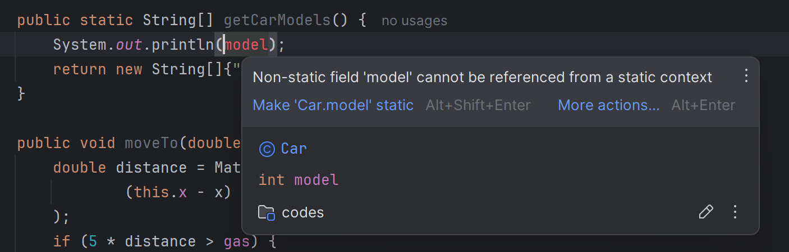

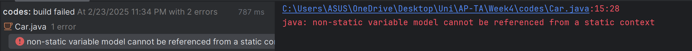

همونطور که می­بینید، جاوا دارد به شما میگوید که نمی­توانید یک فیلد غیر استاتیک مثل `model` را در یک متد استاتیک استفاده کنید. شما می­تونید متد `getCarModels` را بدون داشتن هیچ آبجکتی صدا بزنید؛ پس این `model` ی که سعی دارید ازش استفاده کنید، مربوط به کدام آبجکت است؟ از اون جایی که متدهای استاتیک مربوط به کلاس هستند و از آبجکت­ها جدا هستند، طبیعی است  که نمی­توانند به فیلدها و متدهای عادی که مربوط به هر آبجکت هستند دسترسی داشته باشند و فقط به متد ها و متغیر های استاتیک دسترسی دارند.

### Method overloading

قابلیت Method overloading ، این قابلیت است که شما چند متد را با یک اسم، ولی با جنس و تعداد ورودی متفاوت در یک کلاس تعریف کنید؛ وقتی که متد را صدا می­زنید، کامپایلر با توجه به نوع ورودی، متد درست را انتخاب می­کند و اجرا می­کند.

قابلیت Method overloading ، بسیار قدرتمند و پرکاربرد است. ایده اصلی این است  که متدهایی درست کنیم که روی ورودی های مختلف، کارهای یکسانی انجام بدهند. با این کار می­توانید این توهم را ایجاد کنید که یک متد می­تواند روی انواع مختلفی از ورودی ها کار کند. متد `println()` که از اولین جلسه با ان  کار کردید، مثال خیلی خوبی از method overloading است؛ شما به `println()` می­توانید هر ورودی دلخواهی بدهید و ان به نحوی یک نمایش متنی از ان ورودی را برای شما چاپ می­کند. در زبان هایی که method overloading ندارند، کار سخت­تر میشود. مثلاً برای چاپ چیزهای مختلف باید متدهای مختلف با اسم­های مختلف تعریف کنیم و در ان صورت، این مسئولیت روی دوش شما می­ افتد که متد درست را انتخاب کنید. بیاید یه مثال دیگه از method overloading ببینیم:

```java
public class Sum {
    // Overloaded sum(). This sum takes two int parameters
    public int sum(int x, int y) {
        return (x + y);  
    }

    // Overloaded sum(). This sum takes three int parameters
    public int sum(int x, int y, int z) {
        return (x + y + z);  
    }

    // Overloaded sum(). This sum takes two double  
    // parameters
    public double sum(double x, double y) {
        return (x + y);  
    }

    public static void main(String[] args) {  
        Sum s = new Sum();  
        System.out.println(s.sum(10, 20));  
        System.out.println(s.sum(10, 20, 30));  
        System.out.println(s.sum(10.5, 20.5));  
    }  
}
```

همونطور که می­بینید، اینجا سه تا متد با نام یکسان `sum` داریم، ولی ورودی­ های انها متفاوت است . هر سه تای این متدها دارند عمل جمع کردن را انجام میدهند، ولی یکی دو تا `double` را جمع می­کند، یکی دو تا `int` را جمع می­کند و یکی `3` تا `int` را جمع می­کند!

به غیر از نوع ورودی­ها و تعدادشون، با تغییر دادن ترتیب ورودی­ها هم میشود متدها را overload کرد:

```java
class Student {
    // Method 1
    public void getStudentInfo() {  
        System.out.println("Name :" + name + " "
                + "ID :" + roll_ studentID);  
    }

    // Method 2
    public void getStudentInfo (String name) {
        // Again printing name and id of person
        System.out.println("ID :" + studentID + " "
                + "Name :" + name);  
    }  
}
```

بعد از این که با مباحث مربوط به polymorphism و متد های override شده آشنا شدید، به method overloading دوباره برمیگردیم.

## Reference type ها

همون‌طور که تا الآن به خوبی می‌دانید، در جاوا، type ها به دو دستهٔ primitive type و reference type تقسیم‌بندی می‌شوند. primitive type ها، تایپ‌های بسیار ساده‌ای مثل `int`، `char`، `boolean` و امثال ان‌ها هستند. فهرست کامل ان‌ها در لیست زیر امده است:

| Type      | Definition                               | Approximate range or precision          |
| --------- | ---------------------------------------- | --------------------------------------- |
| `boolean` | Logical Value                            | `true` or `false`                       |
| `char`    | $16$-bit, Unicode character              | $64k$ characters                        |
| `byte`    | $8$-bit, signed integer                  | $-128$ to $127$                         |
| `short`   | $16$-bit, signed integer                 | $-32, 768$ to $32,676$                  |
| `int`     | $32$-bit, signed integer                 | $-2.1\mathrm{e}9$ to $2.1\mathrm{e}9$   |
| `long`    | $64$-bit, signed integer                 | $-9.2\mathrm{e}18$ to $9.2\mathrm{e}18$ |
| `float`   | $32$-bit, IEEE 754, floating-point value | $6-7$ significant decimal places        |
| `double`  | $64$-bit, IEEE 754                       | $15$ significant decimal places         |

هر تایپ دیگری در جاوا، reference type است . `String`، `JFrame`، `ArrayList` و حتی تایپ‌هایی مثل `Car` و `Student` که تا این‌جای کار تعریف کردیم، همگی reference type اند. هر reference type ای با یک کلاس تعریف شده است.

### تفاوت reference typeها و primitive typeها

همان‌طور که می‌دانید، تمام متغیرهای برنامه‌های شما، در حافظهٔ خاصی به اسم RAM ذخیره می‌شوند سیستم عامل، متغیرهای شما را در دو بخش متفاوتی از این حافظه، به اسم stack و heap نگه می‌دارد. با این دو در درس‌های ساختمان داده و سیستم عامل بیشتر آشنا می‌شوید، ولی برای الآن، بدانید که حافظهٔ stack ، از heap سریع‌تر است، ولی در مقابل کمی کم‌حجم‌تره. [^1] 

متغیرهایی که از جنس primitive type تعریف می‌کنید، حجم کمی دارند و بین `1` با `8` بایت از مموری را اشغال می‌کنند. به همین خاطر، جاوا ان‌ها را در stack نگه می‌دارد تا از سرعت بهتر stack استفاده بکند و همزمان، stack سریع پر نشود. از طرفی، ممکنه object هایی که در برنامه‌تون تعریف می‌کنید -و همیشه از جنس reference type ان-، حجم بسیار بیشتری داشته باشند. جاوا، اطلاعات این object ها را در heap ذخیره می‌کند و در stack ، صرفا یه اشاره‌گر (pointer) به ان‌ها نگه می‌دارد.

مثلا، برنامهٔ زیر را در نظر بگیرید:

```java
public class Main {
    public static void main(String[] args) {
        int radius = 5;
        double pi = 3.14;  
        Student changiz = new Student(50, "Changiz", "112");  
    }  
}
```

اگر مموری را حین اجرای این برنامه ببینیم، همچین شکلی دارد:

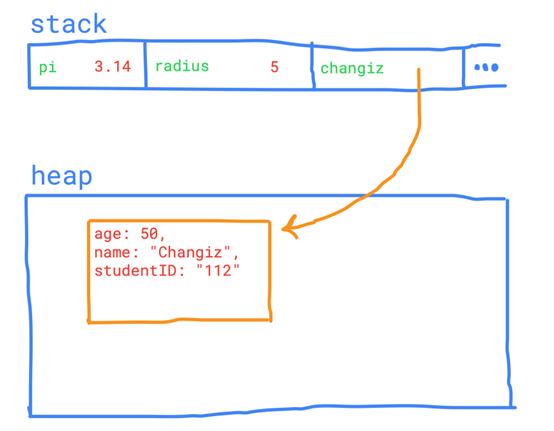

اگر مقدار خود متغیر چنگیز را چاپ کنید:

```java
System.out.println(changiz);
```

همچین خروجی‌ای می‌بینید:

```text
Student@6acbcfc0
```

متغیر `changiz`، در واقع صرفا یک pointer یا reference به یه آبجکت از جنس Student ‍است و نه چیزی بیشتر. با استفاده از اپراتور نقطه `(.)`، می‌توانید به field ها و method های این آبجکت دسترسی داشته باشید.

این اتفاق، یک ساید افکت جالب روی کدهای شما دارد. فرض کنید، یک دانشجوی دیگر به اسم بنگیز درست کردیم و ان را مساوی با چنگیز قرار دادیم:

```java
Student bangiz = changiz;
```

حالا، بنگیز و چنگیز هر دو به یک نقطه از heap اشاره می‌کنند:

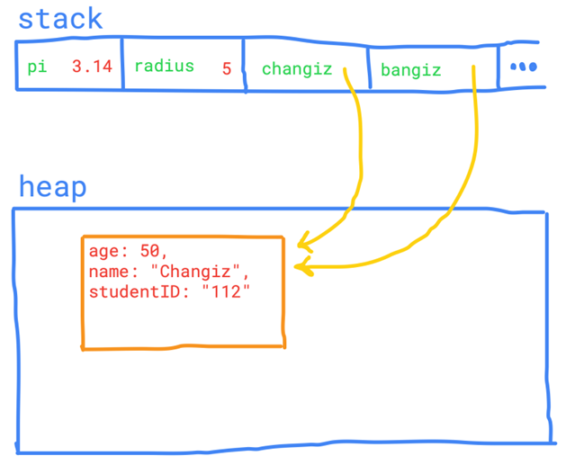

حالا اگر شما، شماره دانشجویی چنگیز را عوض کنید:

```java
changiz.studentID = "40113";
```

و بعد، شماره دانشجویی چنگیز و بنگیز را چاپ کنید:

```java
System.out.println("Changiz studentID: " + changiz.studentID);  
System.out.println("Bangiz studentID: " + bangiz.studentID);
```

می‌بینید که شماره دانشجویی بنگیز هم عوض شده است!

```java
Changiz studentID: 40113  
Bangiz studentID: 40113
```

عجیب نیست؟ اگر به مموری نگاه کنید، بعد از عوض شدن شماره دانشجویی چنگیز، همچین وضعیتی دارد:

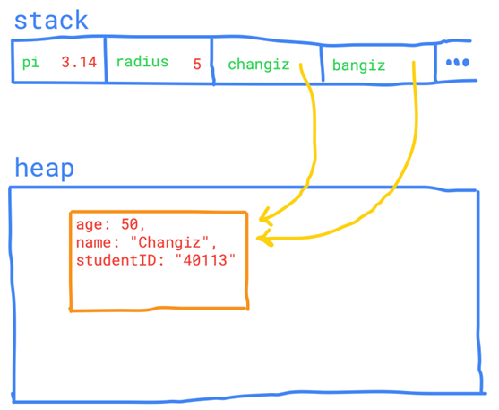

چنگیز، شماره دانشجویی آبجکتی که به ان اشاره می‌کرده را تغییر داده است. دست بر قضا، بنگیز هم به همین آبجکت اشاره می‌کرده و در نتیجه، شماره دانشجویی بنگیز هم واقعا عوض شده است.

یک جای دیگر هم اتفاق مشابه‌ای می‌افتد. برای دیدن ان، متد زیر را به کدتون اضافه کنید:

```java
public static void resetID(Student student) {  
    student.studentID = "00000000";  
}
```

این متد، یک `Student` را ورودی می‌گیرد، و شماره دانشجویی‌ ان را دستکاری می‌کند. حالا با استفاده از کد زیر، چنگیز را به این متد ورودی بدید و بعد، شماره دانشجویی چنگیز و بنگیز را چاپ کنید:

```java
resetID(changiz);  
  
System.out.println("Changiz studentID: " + changiz.studentID);  
System.out.println("Bangiz studentID: " + bangiz.studentID);
```

خروجی، به این شکل است:

```text
Changiz studentID: 00000000  
Bangiz studentID: 00000000
```

شاید بتونید حدس بزنید که این‌جا چه اتفاقی افتاد. با ورودی دادن چنگیز به `resetID`، در واقع شما اشاره‌گرتون به heapرا به این تابع ورودی دادید. پس متغیر `student` در `resetID` و `changiz` و `bangiz`، هر سه به یک نقطه از heap اشاره می‌کنند و مثل قبل، با تغییر فیلدهای یکی از ان‌ها، هر سه تغییر می‌کنند. به این نوع ورودی دادن به توابع، اصطلاحا passing by reference می‌گویند.

مشابه هیچ کدوم از این اتفاق‌ها، برای primitive type ها نمی‌افتد. چون همیشه در stack نگه‌داری می‌شوند و پوینتری به heap برای انها نگه‌داری نمی‌شود.

[^1]: البته، در واقعیت ممکن است اینگونه نباشد. Stack و Heap به خودی خود از دیگری سریع‌تر یا حجیم‌تر نیستن و ما این‌جا داریم خیلی ساده‌سازی می‌کنیم. توی درس‌های بعدی‌تون بهتر می‌فهمید که تفاوت این دو با هم چیست. برای الآن، فرض کنید چیزی که گفتیم کاملا درسته.

### کلاس‌های wrapper برای primitive typeها

هر کدام از primitive type ها،  تایپی مشابه از جنس reference type هم دارند. این تایپ‌ها، در جدول زیر امده اند:


| Primitive | Wrapper               |
| --------- | --------------------- |
| `void`    | `java.long.Void`      |
| `boolean` | `java.lang.Boolean`   |
| `char`    | `java.lang.Character` |
| `byte`    | `java.lang.Byte`      |
| `short`   | `java.lang.Short`     |
| `int`     | `java.lang.Integer`   |
| `long`    | `java.lang.Long`      |
| `float`   | `java.lang.Float`     |
| `double`  | `java.lang.Double`    |


شما لازم نیست خیلی نگران این تایپ‌های جدید باشید، ولی بدونید که وجود دارند. وقتی که یک آرایه از intها تعریف می‌کنید، از ان‌ها استفاده می‌کنید:

```java
var arr = new ArrayList<Integer>();
```

اگر دقت کنید، به جای این که بین دو براکت از `int` استفاده کنید، از `Integer` استفاده کردید. اگر روی ان کلیک راست کنید و از Go To به Declaration and Usages برید، می‌توانید ببینید که پشت ان یک کلاس است:

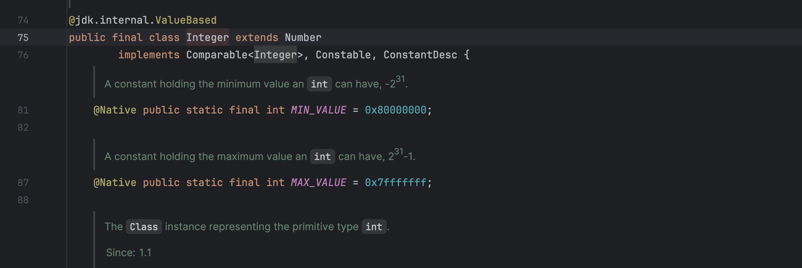

این کلاس، معادل reference type گونه‌ای برای `int` است، و وقتی با کلاس‌ها سر و کار دارید از ان استفاده می‌شود. اگر خواستید بیشتر راجب  به ان بدونید، به [این داکیومنت](https://docs.oracle.com/javase/tutorial/java/data/autoboxing.html) رجوع کنید.

## Garbage Collection

قبل اینکه بریم سراغ Garbage Collection بیاید اول مفهوم نشت حافظه (Memory Leak) رو بررسی کنیم.

### آشنایی با Memory Leak

توی بعضی از زبان‌های برنامه‌نویسی (مثل C و C++) مسئولیت «آزاد کردن» حافظه بر عهده خود برنامه‌نویس است. این یعنی شما باید هر وقت که دیگر به یک شی نیاز نداشتید، خودتون ان حافظه را آزاد کنید. مثلاً اگه با استفاده از تابع `malloc` یک مقداری از حافظه رو allocate کردید، وقتی که دیگه این حافظه رو نیاز نداشتین، باید خودتون با استفاده از تابع `free` ان حافظه را آزاد کنید. بیاید یک مثال ببینیم:

```c
#include <stdlib.h>

int main() {
    // Allocate memory dynamically
    int *ptr = (int *)malloc(sizeof(int) * 5);  // Allocating memory for 5 integers  
  
    // Use the allocated memory
    for (int i = 0; i < 5; i++) {  
        ptr[i] = i + 1;  
    }
    /*  
     * Doing some stuff with these numbers  
     */  
  
    // Forgetting to free the allocated memory causes a Memory Leak  
    // free(ptr); // If we uncomment this line, the Memory Leak will be avoided.

    return 0;  
}
```

در این برنامه که به زبان C (!) نوشته شده، اول به اندازه `5` متغیر `int` حافظه اشغال می‌کنیم. اشاره‌گر `ptr` به اولین خونه از این `20` بایت [^2]  اشاره می‌کند. حال می اییم `5` تا عدد صحیح را در حافظه ذخیره می‌کنیم. فرض کنید با این اعداد یک سری کار انجام دادیم و الان کارمتن با انها تمام شده. اما بعد اینکه کارمون تمام شد، فراموش کردیم که این `20` بایت حافظه را آزاد کنیم! در حقیقت باید با صدا زدن تابع `free` اعلام می‌کردیم که ما دیگر به این `20` بایت نیازی نداریم و در نتیجه این حافظه آزاد میشد.

اگه آزادش نکنید چه میشود؟ در این صورت ان حافظه همچنان در اختیار برنامه قرار دارد و به اصطلاح Memory Leak رخ می‌دهد. این یعنی حافظه‌ای که دیگر به کار نمیاد، همچنان در اختیار برنامه باقی می‌ماند و هیچوقت آزاد نمی‌شود. این موضوع می‌تواند باعث بشود که برنامه به مرور زمان حافظه زیادی مصرف کند و سیستم دچار مشکلاتی مثل کندی عملکرد یا حتی crash بشود.

[^2]: با این فرض که هر متغیر از جنس `int`، حافظه‌ای به اندازه `4` بایت را اشغال کند.

### Garbage Collection: یک راه‌حل خوب

زمانی که داریم راجع به Garbage Collection در جاوا صحبت می‌کنیم، به زبان ساده یعنی جاوا خودش می‌رود و حافظه‌ای که دیگر به هیچ‌کار نمی‌آد را آزاد می‌کند. مثلا وقتی که شما یک شی را توی برنامه می‌سازید و دیگر به ان نیاز ندارید، جاوا خود به خود این شی را پاک می‌کند. شما اصلا نیازی نیست که خودتان حافظه را آزاد کنید، همه چیز به صورت خودکار اتفاق می‌افتد!

شاید بپرسید که چطور این کار انجام میشود؟ خب، جاوا از تعدادی الگوریتم برای این کار استفاده می‌کند. ولی ما ان‌ها را اینجا بررسی نمی‌کنیم. در این [ویدیوی یوتیوب](https://youtu.be/Mlbyft_MFYM?si=jhAdnlq12houCo1F) و این [داک اوراکل](https://docs.oracle.com/en/java/javase/21/gctuning/introduction-garbage-collection-tuning.html) می‌توانید مطالب بیشتری در رابطه با این موضوع ببینید.

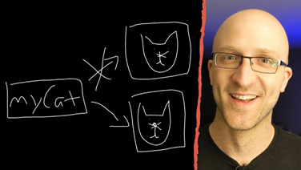

به طور کلی این ویژگی جاوا باعث میشود که شما تمرکز بیشتری روی منطق برنامه‌نویسی داشته باشید و دیگه نگران مدیریت دستی حافظه نباشید.

حالا تو کد زیر، می‌تونید رفتار Garbage Collector را در ارتباط با آبجکت `cuteCat`  بگید؟

```java
Cat cuteCat = new Cat("Cat 1");  
cuteCat = new Cat("Cat 2");
```

شکل زیر میتونه نمایش خوبی از اتفاقات باشد. در اینجا `cuteCat` به جایی از حافظه اشاره [^3]  می‌کند که در ان یک آبجکت از جنس `Cat` (که فیلد اسمش `Cat1` هست) ذخیره شده. در خط بعدی `cuteCat` به جایی از حافظه اشاره می‌کند که در ان یک آبجکت از جنس `Cat` (که فیلد اسمش Cat2 هست) ذخیره شده باشد. اما الان هیچ فلشی به `Cat1` وارد نمیشود، پس Garbage Collector ان را آزاد می‌کند.

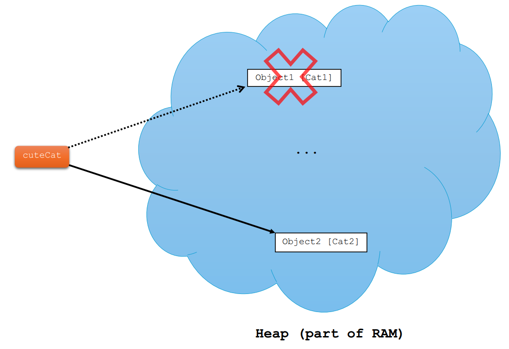

[^3]: دقت کنید که لفظ «اشاره کردن» در جاوا خیلی درست نیست. به خاطر اینکه ما در جاوا `pointer` نداریم و مدیریت حافظه را خود جاوا برامون انجام میده. در جاوا حتی دسترسی مستقیم به حافظه هم نداریم (برخلاف `C`). اما برای مشابهت با زبان `C`، در اینجا هم از لفظ اشاره کردن استفاده کردیم. در جاوا به متغیر هایی مثل `cuteCat`، می گویند reference variable .

### Garbage Collector حواسش هست!

Garbage Collector آبجکت هایی که هنوز بهشون نیاز داریم (بهشون رفرنس داریم) را پاک نمی‌کند. مثلا بیاید کد زیر را ببینیم:

```java
class Duck {  
    String name;  
}

public class Main {
    public static void main(String[] args) {  
        Duck duck = createDuck(); // a duck object will be created
        System.out.println(duck.name);  
    }


    public static Duck createDuck() {  
        Duck localDuck = new Duck();  
        localDuck.name = "A White Duck";
        return localDuck;  
    }  
}
```

در این کد امدیم اول یک کلاس خیلی ساده به اسم `Duck` تعریف کردیم. یک متد هم به اسم `createDuck` تعریف کردیم که اول میاد یک آبجکت از جنس `Duck` میسازد، بعد متغیر `name` را در این آبجکت مقداردهی می‌کند و در نهایت این آبجکت را به عنوان خروجی متد بر میگرداند. بعد در متد `main`، سعی می‌کنیم به متغیر `name` در این آبجکت دسترسی داشته باشیم.

اما نکته کجاست؟ احتمالا توی درس های قبلیتون خوندید که _«متغیر هایی که در یک تابع تعریف میشوند عمرشون به اندازه اجرای همون تابع است و بعد از اتمام اجرای تابع، ان متغیر هم از بین میرود._ پس شاید انتظار داشته باشیم Garbage Collector آبجکت `Duck` را از بین ببرد! اما واقعیت این است که Garbage Collector _حواسش هست_ که ما کدام آبجکت ها را هنوز نیاز داریم و نباید پاکشون کند. اینجا هم ما چون `Duck` را به عنوان خروجی برگرداندیم، یعنی  نیازش داریم، پس پاکش نمی‌کند.

خروجی کد بالا به صورت زیر هست.

```text
A White Duck
```

### یک نکته در مورد کلاس‌ها

در هر فایل جاوا (فایل با پسوند `.java`)، میتوانیم حداکثر یک کلاس `public` داشته باشیم و همچنین اسم این کلاس `public` باید حتما با اسم فایل یکی باشد. مثال درست زیر را ببینید:

```java
// MyClass.java
public class MyClass {
    public void sayHello() {  
        System.out.println("Hello, Java!");  
    }  
}
```

کد‌های زیر نادرست هستند:

```java
// MyFile.java
public class MyClass { } // Error! The class name does not match the file name.
```

```java
// MyFile.java
public class MyClass { }

public class AnotherClass { } // Error! Only one public class is allowed.
```

## Packages

### نیاز به منظم کردن فایل‌ها

در برنامه‌های که در جاوا می نویسیم، همیشه از کلاس ها یا اینترفیس ها [^4]  استفاده می کنیم. مثلا برنامه ساده زیر که در کلاس Sample نوشته شده را ببینید:

```java
public class Sample {
    public static void main(String[] args) {  
        System.out.println("Hello World!");  
    }  
}
```

ولی برنامه‌های پیچیده تر ممکن است از صد ها کلاس تشکیل شده باشند. اگه همه این کلاس ها را بدون هیچ نظمی کنار هم قرار بدهیم باعث میشود برنامه‌ما ناخوانا باشد و خودمان هم گیج می شویم.

احتمالا یکی از اولین چیز هایی که برای منظم کردن فایل ها به ذهن ما میرسد استفاده از پوشه هاست. و این دقیقا همان امکانی است که جاوا برای منظم کردن کلاس های برنامه‌مان برای ما فراهم کرده: ایجاد `package` های مختلف.

[^4]: با اینترفیس‌ها بعداً آشنا می‌شید. فعلاً کاری به انها  نداریم.

### پکیج چیه؟

پکیج‌ها در جاوا مثل پوشه‌هایی هستند که کدهای برنامه‌نویسی (شامل کلاس ها و اینترفیس ها) را در انها قرار می‌دیم تا همه چیز منظم و مرتب باشد. وقتی که برنامه‌های پیچیده‌تر را می‌نویسیم، تعداد کلاس ها زیاد می‌شود و اینجاست که پکیج‌ها به کمکمان می ایند تا بتوانیم این کلاس‌ها را دسته‌بندی کنیم.

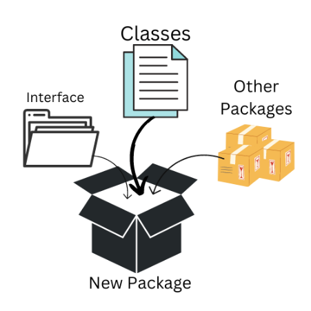

### چطور یک پکیج ایجاد کنیم؟

اول یک پروژه به اسم `PackageDemo` ایجاد کنید. حال روی پوشه `src` راست کلیک کنید و از نوار New ، گزینه Package را انتخاب کنید.

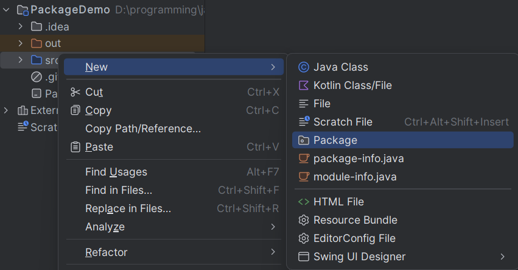

حالا اسم پکیج را وارد کنید. مثلا در اینجا `edu.ap.animals` :


به همین شکل پکیج `edu.ap.vehicles` را هم بسازید.

الان باید چیزی شبیه به تصویر زیر را در پوشه `src` داشته باشید:

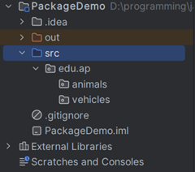

حالا بیاید چند تا کلاس به هر کدوم از این پکیج‌ها اضافه کنیم. مثلا کلاس های `Dog` و `Cat` را به پکیج `animals` و کلاس های `Bike` و `Car` را به پکیج `vehicles` اضافه کنیم. در نهایت باید چیزی شبیه به تصویر زیر را داشته باشید:

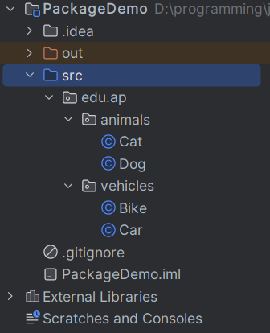

پکیج‌هامون را ساختیم! حالا ببینیم واقعا چه فایل هایی ایجاد شده. اگر از توی explorer به محل ایجاد پروژه‌تون برید و به ترتیب وارد پوشه های `src`، `edu`، `ap` و `animals` بشید چیزی شبیه به این ها می بینید:

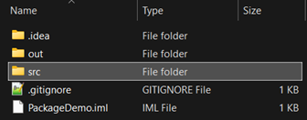


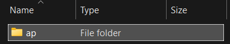

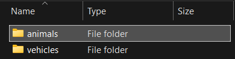

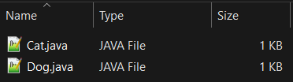

پس دیدیم که وقتی ما داریم یک پکیج تعریف می‌کنیم، واقعا پوشه ایجاد می‌شود!

در نهایت پکیج `edu.ds` شامل کلاس `Stack` را درست کنید. در نهایت باید چیزی شبیه به این ببینید:

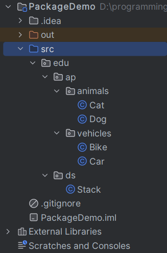

اما الان بریم کد Cat.java را ببینیم:

```java
package edu.ap.animals;

public class Cat {  
}
```

همونطور که میبینید، عبارت `package edu.ap.animals;` به ابتدای این کد اضافه شده. این خط را نباید پاک کنید، چون ان موقع جاوا متوجه نمیشود `Cat` متعلق به کدام پکیج است و خطای کامپایل میخورید.

### نام گذاری متداول پکیج‌ها (Naming Conventions)

1.  پکیج‌ها همواره با حروف کوچک نامگذاری میشوند. مثلا `java.util`
2.  از کلمات رزرو شده جاوا استفاده نکنید. کلماتی مثل `class` ، `public` ، `static` و...
3.  از underscore ( `_` )، dash ( `-` )، space و کاراکتر های خاص (مثل `@` ، `$` ، `&`) استفاده نکنید. در نامگذاری پکیج‌ها فقط مجازیم از dot ( `.` ) استفاده کنیم.
    1.  نادرست: `com.github.my-awesome-project`
    2.  درست: `com.github.myawesomeproject`
4.  یک قاعده دیگه در نامگذاری پکیج‌ها، reverse domain name است (برعکس نوشتن نام دامنه). اگر یک پروژه ای متعلق به شرکت یا سازمانی هست که دامنه ( domain ) خودش را دارد، ان دامنه را به شکل برعکس می‌نویسیم. مثلا شرکت Mozilla (که نام دامنه‌ش `mozilla.org` هست) چند تا پکیج در جاوا دارد. یکی از این پکیج‌ها اسمش `org.mozilla.javascript` هست (البته این قاعده در مورد پکیج‌های استاندارد خود جاوا صدق نمی‌کند).

### کلیدواژهImport

#### یک مثال عملی

بیاید در کلاس `Bike` یک آبجکت از کلاس `Cat` بسازیم (دقت کنید که این دو کلاس متعلق به دو پکیج متفاوت هستند):

```java
package edu.ap.vehicles;

public class Bike {
    public static void main(String[] args) {  
        Cat cat = new Cat();  
    }  
}
```

اگر سعی کنیم این کد را اجرا کنیم، موقع کامپایل به مشکل می‌خوریم:

```bash
java: cannot find symbol  
symbol:   class Cat  
  location: class edu.ap.vehicles.Bike
```

مشکل چیست ؟ جاوا نمیتواند کلاسی به اسم `Cat` را پیدا کند! دلیلش هم این است که جاوا فقط کلاس هایی را میبیند که توی همین پکیج هستند.

پس باید یک جوری کلاس `Cat` را به کدمان اضافه کنیم. کلیدواژه `import` دقیقا برای همین کار هست. با استفاده از این کلیدواژه، ما به جاوا اعلام می‌کنیم که می‌خواهیم این کلاس را به کدمان اضافه کنیم:

```java
package edu.ap.vehicles;
import edu.ap.animals.Cat;

public class Bike {
    public static void main(String[] args) {  
        Cat cat = new Cat();  
    }  
}
```

الان دیگر کدمان کار می‌کند و می‌توانیم یک آبجکت از کلاس `Cat` بسازیم.

### در اهمیت پکیج‌ها

یکی از بزرگترین مزایای جاوا داشتن کتابخانه ( library ) ها بسیار متنوع و کاربردی است.

میخواید یک PDF درست کنید؟ کتابخانه مربوط به ان را `import` کنید. میخواید با دیتابیس کار کنید؟ کتابخانه مربوط به ان را `import`کنید ...

مثلا یکی از پکیج‌های مهم جاوا، `java.lang` است. این پکیج شامل کلاس های پایه ای مثل `System`، `Integer`، `Math` و `String` است.

در شکل زیر میتوانید یک نمای کلی از پکیج‌های جاوا ببینید:

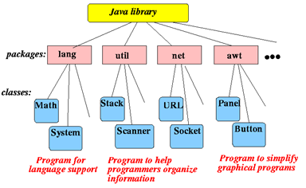

### import کردن کل پکیج

شما میتوانید تمام کلاس های موجود در یک پکیج را یکجا `import` کنید. این کار را با عبارت `*` میتوانید انجام بدهید. مثلا کد زیر تمام کلاس های موجود در پکیج `edu.ap.animals` را `import` می‌کند.

```java
import edu.ap.animals.*;
```

این قابلیت کار ما را خیلی اوقات آسان می‌کند. ولی انجام این کار همیشه هم مناسب نیست. `import` کردن دقیق کلاس ها علاوه بر خوانایی بیشتر کدمان، کمی هم زمان کامپایل‌مان را کمتر می‌کند.

دقت کنید که پکیج‌ها خودشان میتوانند شامل پکیج باشند؛ همانطوری که پوشه ها میتوانند داخل خود پوشه داشته باشند. اما عبارت `*` فقط کلاس های متعلق به پکیج را `import` می‌کند و sub-package ها رو نمی کند ( import کردن recursive نداریم).

مثلا در نظر بگیرید که پکیج `java.awt` یک کتابخونه استاندارد جاوا هست که شامل sub-package مثل `java.awt.event` است. کلاس `Color` متعلق به پکیج `java.awt` و کلاس `ActionEvent` متعلق به زیرپکیج `java.awt.event` است.

حالا شما اگه به هر دوی این کلاس ها نیاز دارید باید هر کدوم را جدا `import` کنید. کد زیر اشتباه است:

```java
import java.awt.*;
```

دلیل اشتباه بودنش هم این است که در نتیجه این کد کلاس `Color`، ایمپورت میشود ولی کلاس `ActionEvent` نه.

کد زیر درست است:

```java
import java.awt.Color;
import java.awt.event.ActionEvent;
```

#### دو مثال دیگه: مرور خاطرات

##### `java.util.Scanner`

احتمالا یکی از اولین برنامه‌هایی که توی جاوا نوشتید گرفتن ورودی از کاربر بوده. مثلا کد ساده زیر رو ببینید:

```java
import java.util.Scanner;

public class Main {
    public static void main(String[] args) {
        int x;  
        Scanner scanner = new Scanner(System.in);  
        x = scanner.nextInt();  
    }  
}
```

شاید قبلا براتون سوال شده باشد که اون `import` توی خط اول چکار می‌کند. خب الان احتمالا می‌توانیم به راحتی به این سوال جواب بدیم. در واقع کلاس `Scanner` متعلق به پکیج `java.util` هست و ما چون میخوایم از این کلاس توی کدمون استفاده کنیم، ان را `import` کردیم.

حتی اگه وارد سورس کد این کلاس بشید، عبارت زیر را در خطوط ابتدایی می بینید:

```java
package java.util;
```

##### `javax.swing.JFrame`

در صورتی که با گرافیک کار کرده باشید، می‌دانید وقتی میخواستیم یک `frame` ایجاد کنیم، از کد زیر استفاده می کردیم:

```java
import javax.swing.JFrame;

public class Main {
    public static void main(String[] args) {  
        JFrame jFrame = new JFrame();  
    }  
}
```

همانطور که می‌توانیم حدس بزنیم، کلاس `JFrame` متعلق به پکیج `javax.swing` است و چون ما میخواهیم از این کلاس در کدمان استفاده کنیم، ان را `import` کردیم.

می توانیم خیلی راحت این را بررسی کنیم. هر موقع خواستید کد یک کلاس را ببینید (سورس کد جاوا)، می توانید روی اسم ان کلاس راست کلیک کنید و از نوار Go To قسمت Declaration or Usages را انتخاب کنید. میبینید که به سورس کد ان کلاس منتقل میشید.

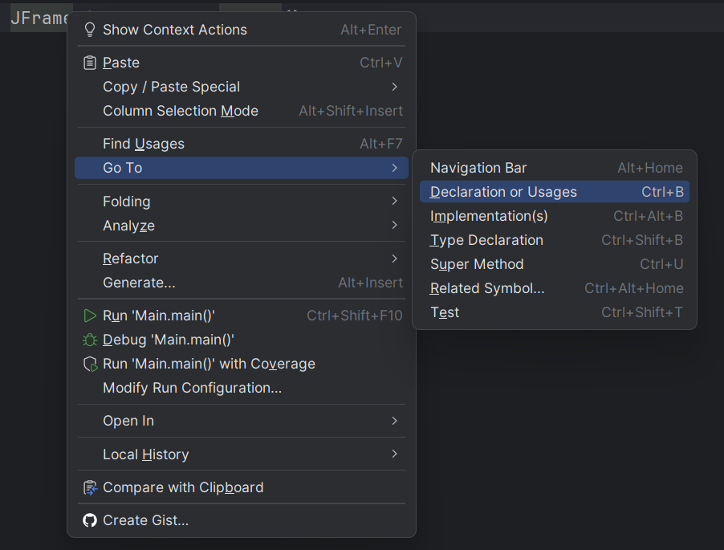

اگه این کار را انجام بدید، در فایل `JFrame.java` که بهش منتقل شدیند در خطوط ابتدایی عبارت `package javax.swing;` را میبینید.

### چند نکته در مورد پکیج‌ها

#### هر کلاس دقیقا به یک پکیج تعلق داره

هر کلاس دقیقا به یک پکیج تعلق دارد. اگه کلاسی که نوشتید را در یک پکیج قرار ندادید، به صورت پیش‌فرض این کلاس متعلق به default package خواهد بود. مثلا کلاس زیر رو در نظر بگیرید:

```java
public class Student {
    private String name;
    private int age;
    
    // Some other variables and methods
}
```

دقت کنید که الان کلاس `Student` را نمیشود در پروژه ها یا کلاس های دیگه `import` و استفاده کرد؛ چون به پکیج نام‌گذاری شده ای تعلق ندارد (default package واقعا اسم یک پکیج نیست).

تعریف نکردن پکیج برای کلاس هامون در پروژه های کوچک ایرادی ندارد؛ ولی در پروژه های بزرگ حتما باید سعی کنیم که پکیج‌های مناسبی ایجاد کنیم.

همچنین یک کلاس نمیتواند به بیش از یک پکیج تعلق داشته باشد (در غیر این‌صورت خطای کامپایل میخوریم).

#### استفاده از یک کلاس بدون import کردن اون

گاهی اوقات که فقط یک بار میخواید از یک کلاس در کدتون استفاده کنید، میتوانید ان کلاس را به طور مستقیم import نکنید و بجای ان به طور کامل به اسم پکیج در کد اشاره کنید. مثال زیر رو ببینید:

```java
public class Main {
    public static void main(String[] args) {  
        javax.swing.JFrame jFrame = new javax.swing.JFrame();  
    }  
}
```

در اینجا ما بدون استفاده از عبارت `import javax.swing.JFrame;` توانستیم از کلاس `JFrame` استفاده کنیم. اینگونه نوشتن شاید کمی طولانی بنظر بیاید، ولی در کلاس هایی که تعداد زیادی `import` دارند و حتی ممکنه کلاس هایی با اسم یکسان بخواهند `import` بشوند، به ما کمک می‌کند این مشکلات را حل کنیم.

## چه چیزی یاد گرفتیم؟

در این داکیومنت، با مفاهیم پایه‌ای شی‌گرایی در جاوا آشنا شدیم و قدم اول برای نوشتن برنامه‌های ساخت‌یافته‌تر را برداشتیم. مهم‌ترین نکاتی که یاد گرفتیم:

- تفاوت بین **primitive type** و **reference type** و نحوهٔ نگه‌داری آن‌ها در حافظه
- این که چگونه می‌توان با استفاده از `class` ، **type های جدید** تعریف کرد
- مفهوم **object (instance)** و نحوهٔ ساخت آن با استفاده از `new`
- آشنایی با **field** ها و نقش آن‌ها در نگه‌داری وضعیت یک شی
- تعریف و استفاده از **method** ها برای پیاده‌سازی رفتار کلاس‌ها
- نوشتن و استفاده از **constructor** ها برای مقداردهی اولیهٔ objectها
- تفاوت بین **متغیرهای محلی** و **field ها**
- مفهوم **static** و تفاوت اعضای استاتیک با اعضای معمولی
- آشنایی با **this** و کاربرد آن در جلوگیری از shadowing
- مفهوم **method overloading** و استفاده از چند متد هم‌نام با ورودی‌های متفاوت
- درک بهتر از نحوهٔ کار **reference ها** و تاثیر آن‌ها در تغییر داده‌ها
- آشنایی مقدماتی با **Garbage Collection** و مدیریت خودکار حافظه در جاوا
- اهمیت **package**ها برای سازمان‌دهی کد و استفاده از `import`

در ادامهٔ مسیر، روی همین مفاهیم پایه، مباحث مهم‌تری مثل **کپسوله‌سازی (Encapsulation)**، **وراثت (Inheritance)** و **چندریختی (Polymorphism)** را یاد خواهیم گرفت.
