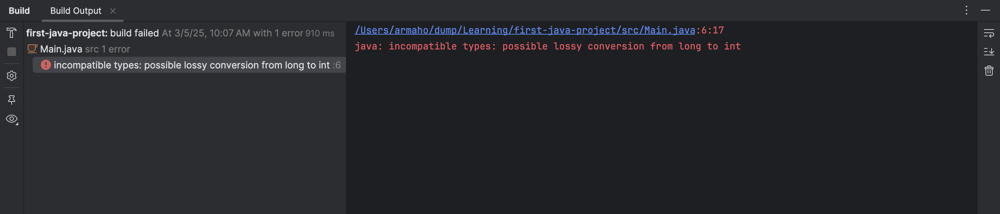
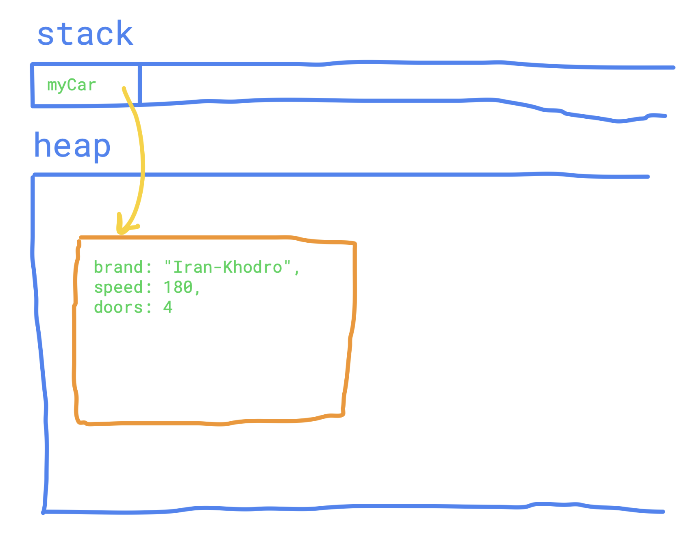
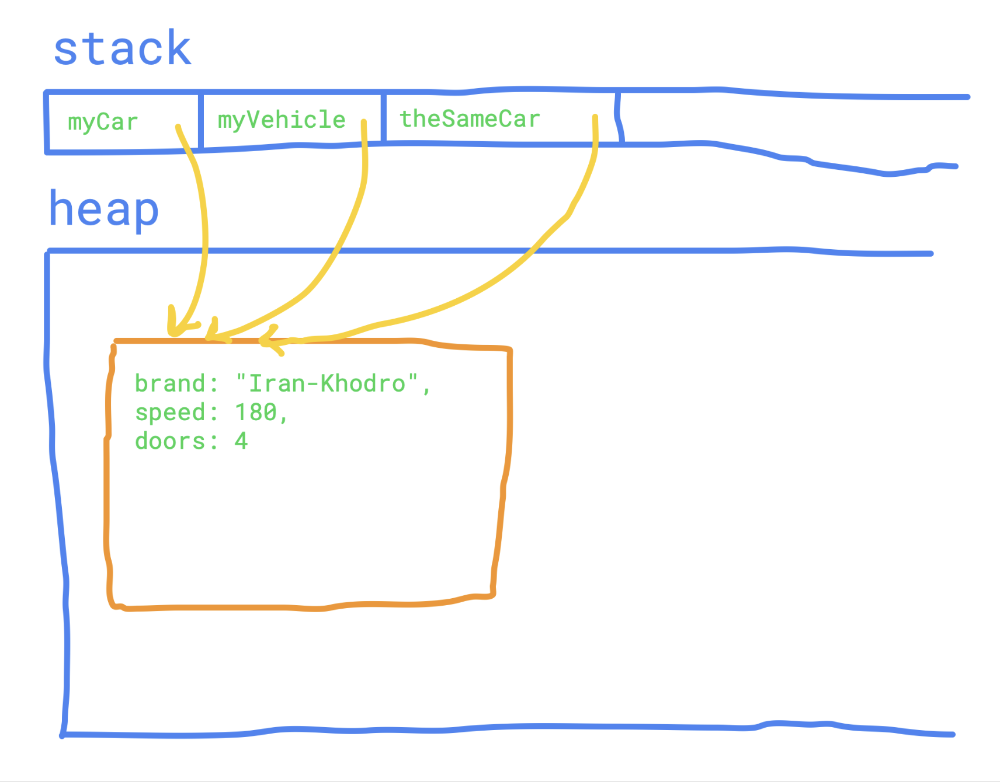
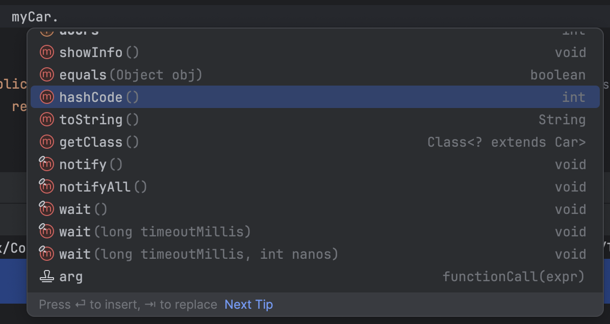
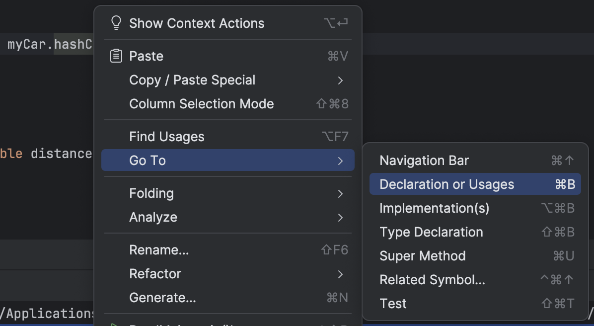
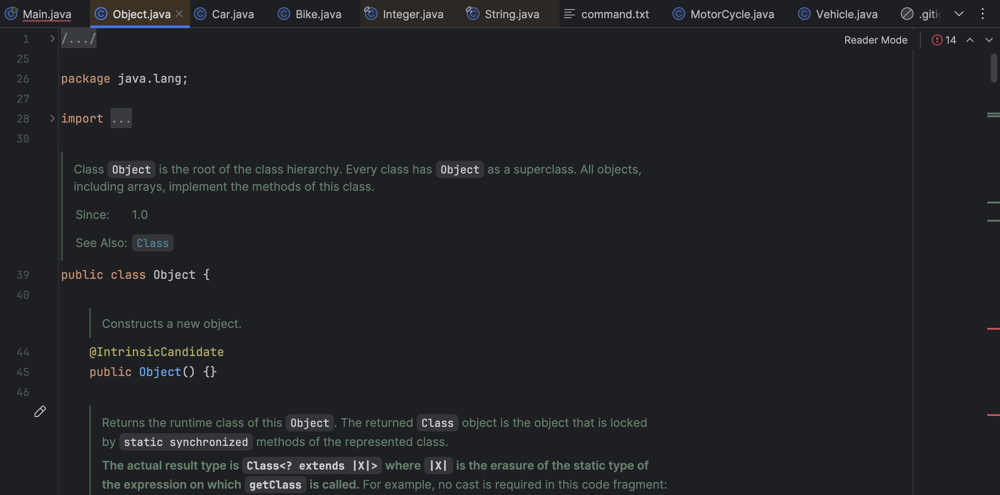
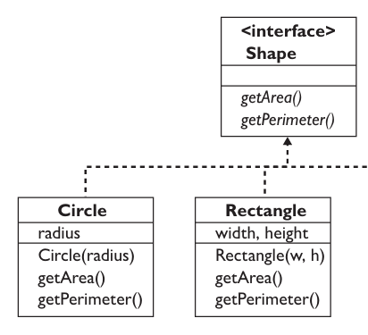

## مقدمه

ارث‌بری، از پایه‌ای‌ترین مفاهیم شی‌گراییه که به کلاس‌های مشابه، امکان این رو می‌ده که متدها و فیلدهای مشابه‌شون رو در یک class جدید تعریف کنن. با استفاده از ارثبری، می‌شه به طراحی‌ای بهتر برای کدمون برسیم، کدی که توی اون، کد تکراری کمه و به همین خاطر، کد maintainable تری محسوب می‌شه.

توی این داکیومنت، علاوه بر ارث‌بری، به چندتا مفهوم کوچولوی دیگه توی جاوا مثل lambda ها، inner class ها و کمی annotation هم می‌پردازیم.

حتماً کدهایی که توی این داک اومدن رو خودتون اجرا کنید و هر سوالی که داشتین از تدریس‌یارهاتون بپرسین، توی گوگل راجع بهش سرچ کنید و از ChatGPT راجع بهش اطلاعات بخواین. ارثبری از مفاهیم مهم و جالب OOP هست که خیلی مهمه اون رو کامل یاد بگیرین.

## ارثبری

### توصیف یک مشکل

توی IntelliJ یه پروژهٔ جدید ایجاد کنید و یه پکیج به اسم `vehicle` درست کنید. توی `vehicle` دو فایل جدید به اسم `Car.java` و `Bike.java` درست کنید و توی اون‌ها، کلاس‌های `Car` و `Bike` رو ایجاد کنید:

```java
package Vehicle;

public class Bike {
    public String brand;
    public int speed;
    public boolean hasCarrier;

    public Bike(String brand, int speed, boolean hasCarrier) {
        this.brand = brand;
        this.speed = speed;
        this.hasCarrier = hasCarrier;  
    }

    public void accelerate(int speed) {
        this.speed += speed;  
    }

    public void showBikeInfo() {  
        System.out.println("Brand: " + brand + ", Speed: " + speed + " km/h");  
        System.out.println("Has Carrier: " + hasCarrier);  
    }  
}
```

بعد از این کار، کد `Main` رو به کد زیر تغییر بدین و اون رو اجرا کنید تا مطمئن بشین که همه چیز درست کار می‌کنه:

```java
package Vehicle;

public class Car {
    public String brand;
    public int speed;
    public int doors;

    public Car(String brand, int speed, int doors) {
        this.brand = brand;
        this.speed = speed;
        this.doors = doors;  
    }

    public void accelerate(int speed) {
        this.speed += speed;  
    }

    public void showCarInfo() {  
        System.out.println("Brand: " + brand + ", Speed: " + speed + " km/h");  
        System.out.println("Doors: " + doors);  
    }  
}
```

بعد از اجرای کدتون، باید همچین چیزی ببینید:

```text
Brand: Toyota, Speed: 180 km/h  
Doors: 4  
  
Brand: Yamaha, Speed: 120 km/h  
Has Carrier: true
```

حالا که کدتون کار می‌کنه، بیاین راجع به شباهت‌های این دو کلاس صحبت کنیم. ظاهر این کلاس‌ها خیلی شبیهه، نه؟ هر دو فیلدهایی به اسم `brand` و `speed` دارن، متدی به اسم `accelerate` دارن که سرعت وسیلهٔ نقلیه رو زیاد می‌کنه و توی خط اول متدهایی که اطلاعات اون‌ها رو نشون می‌ده، برند و سرعتشون چاپ می‌شه. در واقع، اگر یه بار به کدتون نگاه کنید، واقعا کلاس‌های `Bike` و `Car` اونقدر متفاوت هم نیستن! حالا بیاین یه کلاس جدید مثل `MotorCycle` اضافه کنیم توی فایل جدیدی به اسم `MotorCycle.java` بنویسیم:

```java
package Vehicle;

public class MotorCycle {
    public String brand;
    public int speed;
    public boolean hasSidecar;

    public MotorCycle(String brand, int speed, boolean hasSidecar) {
        this.brand = brand;
        this.speed = speed;
        this.hasSidecar = hasSidecar;  
    }

    public void accelerate(int speed) {
        this.speed += speed;  
    }

    public void showMotorCycleInfo() {  
        System.out.println("Brand: " + brand + ", Speed: " + speed + " km/h");  
        System.out.println("Has Sidecar: " + hasSidecar);  
    }  
}
```

این کد هم امتحان کنید:

```java
MotorCycle myMotorCycle = new MotorCycle("Benz", 120, true);  
myMotorCycle.showBikeInfo();
```

باید خروجی‌ای مثل زیر ببینید:

```text
Brand: Benz, Speed: 120 km/h  
Has Sidecar: true
```

کلاس جدیدتون هم کار می‌کنه، ولی اون هم خیلی شبیه‌ دو کلاس قبلیه! به نظر میاد که ما هر وسیلهٔ نقلیه‌ای که بخوایم اضافه کنیم، باید کلی کد تکراری از کلاس‌های قبلی‌مون بنویسیم. همون‌طور که توی داک clean code خوندین، ما توی برنامه‌نویسی، خیلی کدهای تکراری رو دوست نداریم.

### راه‌حل

ولی یه راه حل برای این مشکل هست. این که **ویژگی‌های مشترک تمام این کلاس‌ها رو، توی کلاس جدیدی به اسم `Vehicle` بیاریم و بعدش، با استفاده از ارث‌بری، اون ویژگی‌ها رو به تمام این کلاس‌ها منتقل کنیم**. شاید یه خورده این حرف براتون غریب باشه، «یعنی چی که ویژگی‌های یک کلاس‌ رو به کلاسی دیگه منتقل کنیم؟». بیاین تا با کد زدن، اون رو ببینیم. توی فایل `Vehicle.java`، کلاس `Vehicle` رو ایجاد کنید. این کلاس، به جای این که نمایندهٔ ماشین و موتور و دوچرخه باشه، نمایندهٔ یک «وسیلهٔ نقلیه‌»ست و ویژگی‌های مشترک تمام کلاس‌های قبل رو توی خودش نگه داشته:

```java
package Vehicle;

public class Vehicle {
    public String brand;
    public int speed;

    public Vehicle(String brand, int speed) {
        this.brand = brand;
        this.speed = speed;  
    }

    public void accelerate(int speed) {
        this.speed += speed;  
    }

    public void showInfo() {  
        System.out.println("Brand: " + brand + ", Speed: " + speed + " km/h");  
    }  
}
```

می‌تونید ببینید که فیلدها و متدهای مشترک تمام وسایل نقلیه‌مون، یعنی `brand`، `speed`، `accelerate` و غیره همگی توی این کلاس اومدن. حالا بیاین کد کلاس `Car` رو عوض کنیم:

```java
public class Car extends Vehicle {
    public int doors;

    public Car(String brand, int speed, int doors) {
        super(brand, speed);
        this.doors = doors;  
    }

    public void showCarInfo() {  
        showInfo();  
        System.out.println("Doors: " + doors);  
    }  
}
```

توی این کد، شما برای اولین بار با کلیدواژهٔ `extends` آشنا می‌شین. این کلیدواژه توی جاوا برای تعیین ارث‌بری استفاده می‌شه. کلاس `Car`، الآن تمام فیلدها و متدهای کلاس `Vehicle` رو داره! مثلا توی خط اول متد `showCarInfo()`، می‌بینید که متد `showInfo()` صدا زده شده. خود `Car` که همچین متدی تعریف نکرده، پس تعریف این متد کجاست؟ در واقع، این متد توی کلاس `Vehicle` تعریف شده و چون `Car` از `Vehicle` ارث‌بری کرده، پس می‌تونه از متدها و فیلدهای اون استفاده بکنه!

حالا به متد `main` تون برین و کد زیر رو اجرا کنید تا مطمئن بشید همه چی درست کار می‌کنه:

```java
public static void main(String[] args) {  
    Car myCar = new Car("Toyota", 180, 4);  
    myCar.showCarInfo();  
  
    System.out.println();  
  
    myCar.accelerate(5);  
    myCar.showCarInfo();  
}
```

بعد از اجرای این کد، خروجی زیر رو باید ببینید:

```text
Brand: Toyota, Speed: 180 km/h  
Doors: 4  

Brand: Toyota, Speed: 185 km/h  
Doors: 4
```

می‌بینید که حتی ما تونستیم از متد `accelerate` هم برای `myCar` استفاده کنیم، در حالی که این متد اصلا توی `Car` تعریف نشده! این موضوع فقط به خاطر اینه که `Car` از `Vehicle` ارث‌بری می‌کنه، و به خاطر همین به تمام فیلدها و متدهای اون هم دسترسی داره.

حالا کد‌ کلاس‌های `Bike` و `MotorCycle` هم به کدهای زیر تغییر بدین تا اون‌ها هم از کلاس `Vehicle` ارث‌بری کنن:

```java
package Vehicle;

public class MotorCycle extends Vehicle {
    boolean hasSidecar;

    public MotorCycle(String brand, int speed, boolean hasSidecar) {
        super(brand, speed);
        this.hasSidecar = hasSidecar;  
    }

    public void showBikeInfo() {  
        showInfo();  
        System.out.println("Has Sidecar: " + hasSidecar);  
    }  
}
```

```java
package Vehicle;

public class Bike extends Vehicle {
    public boolean hasCarrier;

    public Bike(String brand, int speed, boolean hasCarrier) {
        super(brand, speed);
        this.hasCarrier = hasCarrier;  
    }

    public void showMotorCycleInfo() {  
        showInfo();  
        System.out.println("Has Carrier: " + hasCarrier);  
    }  
}
```

می‌بینید که حجم این کلاس‌ها، همین‌جور کوتاه‌تر و کوتاه‌تر می‌شه، این برای ما خیلی چیز خوبیه! ما هم خیلی از کدهای بلند خوشمون نمیاد! با کد زیر، این کلاس‌های جدید رو تست کنید:

```java
public static void main(String[] args) {  
    Bike myBike = new Bike("Yamaha", 120, true);  
    myBike.showBikeInfo();  
  
    System.out.println();  
      
    myBike.accelerate(5);  
    myBike.showBikeInfo();

    System.out.println();  
  
    MotorCycle myMotorcycle = new MotorCycle("Harley-Davidson", 160, false);  
    myMotorcycle.showMotorCycleInfo();  
}
```

باید خروجی زیر رو ببینید:

```text
Brand: Yamaha, Speed: 120 km/h  
Has Carrier: true  
  
Brand: Yamaha, Speed: 125 km/h  
Has Carrier: true  
  
Brand: Harley-Davidson, Speed: 160 km/h  
Has Sidecar: false
```

می‌بینید که همهٔ این کلاس‌ها، مثل کلاس Car می‌تونن از فیلدهای `brand` و `speed` و متدهای `accelerate()` و `showInfo()` استفاده کنن.

### subclass ها و superclass ها

توی کد بالا، به کلاس `Vehicle` که از اون ارث‌بری شده یک superclass می‌گن (به این کلاس‌ها کلاس‌های پدر هم می‌گن). همچنین به کلاس‌های `Car`، `Bike` و `MotorCycle`، ساب‌کلاس‌های کلاس `Vehicle` می‌گن (همچنین به اون‌ها، کلاس‌های فرزند هم می‌گن). هر کلاس، از حداکثر یک کلاس دیگه می‌تونه به صورت مستقیم ارث‌بری کنه، یعنی هر کلاس حداکثر یک پدر داره.

یه جایی هست که این اسم‌گذاری‌ها به شما کمک می‌کنه! شاید تا الآن متوجه نشده باشین ولی توی خط اول constructor های subclass هامون، از عبارتی به اسم super استفاده شده:

```java
public Bike(String brand, int speed, boolean hasCarrier) {
    super(brand, speed);
    this.hasCarrier = hasCarrier;  
}
```

این عبارت، یه کلیدواژهٔ جدیده. هر جایی super استفاده بشه، یعنی ما می‌خوایم از فیلدها، متدها یا کانستراکتورهای کلاس پدر استفاده کنیم. مثلا در این‌جا، با استفاده از کلیدواژهٔ super، نشون دادیم که می‌خوایم کانستراکتور زیر رو از کلاس پدر استفاده کنیم تا فیلدهای brand و speed برای آبجکت جدیدمون مقداردهی بشن:

```java
public Vehicle(String brand, int speed) {
    this.brand = brand;
    this.speed = speed;  
}
```

یا مثلا، توی متد `showBikeInfo()`، می‌تونیم با استفاده از `super`، دقیق‌تر مشخص کنیم که می‌خوایم متد `showInfo` ی کلاس `Vehicle` صدا زده بشه:

```java
public void showBikeInfo() {
    super.showInfo();  
    System.out.println("Has Carrier: " + hasCarrier);  
}
```

همچنین با استفاده از این کلیدواژه، شما می‌تونید به فیلدهای کلاس پدر هم دسترسی داشته باشین:

```java
public void showBikeInfo() {
    super.showInfo();  
    System.out.println("Has Carrier: " + hasCarrier);  
      
    System.out.println("Speed: " + super.speed);  
    System.out.println("Brand: " + super.brand);  
}
```

البته کپی کردن کد بالا به جای کد `ShowBikeInfo()` باعث می‌شه که سرعت و برند دوچرخه‌هاتون دو بار چاپ بشن! اگر خواستین این کد رو کپی نکنین، من صرفا می‌خواستم نشونتون بدم که با کلیدواژهٔ super، به تمام ویژگی‌های کلاس پدر دسترسی خواهید داشت. وقتی که بعدتر توی همین داک، متدهای کلاس پدر رو Override می‌کنید بیشتر به اهمیت این موضوع پی می‌برین.

## Casting در جاوا

قبل از ادامهٔ بحثمون راجع به ارثبری، لازمه راجع به cast کردن کمی گپ بزنیم. اصطلاح cast کردن، مربوط به زمانیه که متغیری رو از یک تایپ به تایپی دیگه تبدیل می‌کنیم. مثلا این کد رو ببینین:

```java
public static void main(String[] args) {
    int a = 10;
    long b = a;  
  
    System.out.println("a: " + a);  
    System.out.println("b: " + b);  
}
```

توی این کد، متغیر `a` که `int` بوده، به متغیری از جنس `long` به اسم `b` تبدیل شده. این تبدیل بدون هیچ مشکلی انجام می‌شه چون بازهٔ اعدادی که متغیرهای `long` پوشش می‌دن خیلی بزرگتر از اعداد `int` ‍ه. به خاطر درستی این cast، خروجی این کد هم به شکل زیره:

```text
a: 10  
b: 10
```

ولی بیاین یه متغیر `long` خیلی بزرگ رو به یک متغیر `int`، کست کنیم تا ببینیم چه مشکلی می‌تونه پیش بیاد:

```java
public static void main(String[] args) {
    long a = 10_000_000_000L;
    int b = a;  
  
    System.out.println("a: " + a);  
    System.out.println("b: " + b);  
}
```

تلاش کنید این کد رو اجرا کنید. به خطای زیر می‌خورید:



متن خطا رو بخونید. نوشته:

```text
java: incompatible types: possible lossy conversion from long to int
```

جاوا داره به شما می‌گه که تبدیل متغیرهای `long` به `int`، کار خطرناکیه و ممکنه منجر به خطاهای overflow بشه. مثلا توی همین مثال، عدد `10_000_000_000L` خیلی عدد بزرگیه برای این که توی یک `int` جا بشه، و به همین خاطر تبدیل اون به یک `int` مشکلاتی برای شما به همراه داره.

یک `int` قبل از `a` بذارین تا به جاوا بگین که از cast تون مطمئنین و می‌دونید که هیچ مشکلی ایجاد نمی‌کنه:

```java
public static void main(String[] args) {
    long a = 10_000_000_000L;
    int b = (int)a;  
  
    System.out.println("a: " + a);  
    System.out.println("b: " + b);  
}
```

خروجی این کد به شکل زیره:

```text
a: 10000000000  
b: 1410065408
```

چقدر مقدار `b` عجیبه! مشکلی که می‌بینید، مشکل بسیار معروفیه که یه اسم خیلی معروف هم داره، "overflow". زمانی که شما، عدد خیلی بزرگی رو توی یه متغیر ذخیره می‌کنید و اون متغیر جای کافی برای ذخیرهٔ اون عدد نداره، شما به خطای overflow می‌خورید. باید بدونید که اگر مقدار a اونقدر بزرگ نبود، شما به همچین خطایی نمی‌خوردین:

```java
public static void main(String[] args) {
    long a = 100;
    int b = (int)a;  
  
    System.out.println("a: " + a);  
    System.out.println("b: " + b);  
}
```

خروجی این کد به این شکله:

```text
a: 100  
b: 100
```

علت این که cast تون به درستی انجام شد اینه که مقدار `100` به راحتی توی یک `int` جا می‌شه.

اتفاق مشابه‌ای موقع cast کردن بین متغیرهای `int` و `double` هم میوفته. Cast زیر به درستی انجام می‌شه:

```java
public static void main(String[] args) {
    int a = 100;
    double b = a;  
  
    System.out.println("a: " + a);  
    System.out.println("b: " + b);  
}
```

خروجی این کد هم به این شکله. به اون ممیز خط دوم توجه کنید، اون نشون می‌ده که متغیر `b` از جنس `double` ‍ه:

```text
a: 100  
b: 100.0
```

ولی اگر تلاش کنید عددی اعشاری رو به عددی صحیح تبدیل کنید، باز هم خطا می‌گیرید:

```java
public static void main(String[] args) {
    double a = 3.14;
    int b = a;  
  
    System.out.println("a: " + a);  
    System.out.println("b: " + b);  
}
```

خطاتون مشابه خطای قبلیه:

```text
java: incompatible types: possible lossy conversion from double to int
```

این خطا به خاطر اینه که توی این cast، بخش اعشاری متغیر a از دست می‌ره. اگر شما این cast رو با استفاده از `int` به زور انجام بدین:

```java
int b = (int)a;
```

می‌بینید که فقط بخش صحیحِ متغیر a، توی b ذخیره می‌شه:

```text
a: 3.14  
b: 3
```

حتی اگر بعدتر، متغیر `b` رو دوباره به یه متغیر `double` تبدیل کنین می‌بینین که بخش اعشاری‌تون برنمی‌گرده:

```java
public static void main(String[] args) {
    double a = 3.14;
    int b = (int)a;
    double c = b;  
  
    System.out.println("a: " + a);  
    System.out.println("b: " + b);  
    System.out.println("c: " + c);  
}
```

خروجی این کد به شکل زیره:

```text
a: 3.14  
b: 3  
c: 3.0
```

این cast، خطرناک محسوب می‌شه چون توی اون، بخشی از داده‌هامون از دست رفتن.

### انواع casting

دیدین که cast کردن، واقعا می‌تونه خطرناک باشه و ممکنه برنامه‌تون رو خراب کنه. جاوا می‌دونه که کدوم cast ها مطمئنن و کدوم‌ها می‌تونن مشکل‌زا باشن. مثلا اگر مثل مثال اولمون، یک متغیر `int` رو به `long` تبدیل کنین، جاوا می‌دونه که این cast همیشه مطمئن و موفقه و به خاطر همین کد اول ما بدون هیچ خطا و warning ای اجرا شد. اما توی کد دوم، که cast کردن می‌تونست مشکل‌زا باشه، جاوا به ما خطا داد و مجبور شدیم با استفاده از `int` بهش بگیم که ما نسبت به این مشکلات آگاهیم و همچنان دوست داریم که این cast انجام بشه. کلاً cast هایی که ممکنه برای برنامهٔ شما با از دست دادن اطلاعات، overflow یا هر خطای دیگه‌ای مشکل ایجاد کنن، cast های خطرناکی محسوب می‌شن.

بر همین اساس، castها به دو دسته تقسیم می‌شن:

#### کست‌های implicit

واژهٔ "implicit" به معنای چیزیه که تلویحا و بدون اشارهٔ مستقیم فهمیده می‌شه. مثل وقتی که شما لازم نیست با گذاشتن `int` مستقیما به جاوا بفهمونید که از cast تون آگاهید. cast هایی که مشکلی برای برنامهٔ شما ایجاد نمی‌کنن، به اصطلاح به cast های implicit معروفن. cast کردن متغیر `int` به `long` از این جنسه.

#### کست‌های explicit

واژهٔ "explicit" به معنای چیزیه که باید مستقیما و به شکل دقیق گفته بشه. کست‌های explicit، کست‌هایی هستن که ممکنه مشکل‌زا باشن و شما لازمه که توی کدتون، حتما اعلام کنید که از انجام اون cast آگاهین و می‌دونن ممکنه مشکل‌زا باشه. تبدیل کردن متغیر `long` به `int` از این جنسه.

### کست کردن در reference type ها

حالا به ارث‌بری برگردیم، کلاس‌های `Vehicle` و `Car` که هنوز یادتون نرفته؟ اگر یادتون باشه، به شما گفته بودیم که class ها، ابزاری هستن که شما به وسیلهٔ اون‌ها می‌تونید برای خودتون type های جدید تعریف کنید. ولی خب، آیا می‌شه این type ها هم cast کرد؟ جواب طبیعتاً بله‌ست.

بیاین با یه مثال توی اون‌ها، cast کردنشون رو براتون توضیح بدیم. کد زیر رو توی تابع `main` بنویسید:

```java
public static void main(String[] args) {  
    Car myCar = new Car("Iran-Khodro", 180, 4);  
    myCar.showCarInfo();  
}
```

اون رو اجرا کنید تا مطمئن باشید همه چیز درست کار می‌کنه:

```text
Brand: Iran-Khodro, Speed: 180 km/h  
Doors: 4
```

حالا، بیاین که یه cast عجیب بین `Car` و `Vehicle` انجام بدیم:

```java
public static void main(String[] args) {  
    Car myCar = new Car("Iran-Khodro", 180, 4);  
    myCar.showCarInfo();  
  
    System.out.println();  
  
    Vehicle myVehicle = myCar; // Casting from Car to Vehicle
    myVehicle.showInfo();  
}
```

خروجی این کد، به شکل زیره:

```text
Brand: Iran-Khodro, Speed: 180 km/h  
Doors: 4  

Brand: Iran-Khodro, Speed: 180 km/h
```

کست عجیبیه، نه؟ راستش نه خیلی! اگر دقت کنید، وقتی که `Car` از `Vehicle` ارث‌بری کرد، تمام فیلدها و متدهای `Vehicle` مال `Car` شدن. یعنی هر آبجکتی از جنس `Car`، تمام فیلدهایی که یک `Vehicle` لازم داره رو توی خودش داره، پس معلومه که ما همه چیز رو برای cast کردن `Car` به `Vehicle` داریم و می‌تونیم اون رو انجام بدیم. همون‌طور که می‌بینید، برند `myVehicle` هم ایران خودرو ‍ه و سرعتش هم `180 km/h` ‍ه، دقیقا مثل ماشینمون.

حتی می‌شه `myVehicle` رو، با یک دوچرخه هم جایگزین کرد:

```java
public static void main(String[] args) {  
    Car myCar = new Car("Iran-Khodro", 180, 4);  
    myCar.showCarInfo();  
  
    System.out.println();  
  
    Vehicle myVehicle = myCar; // Casting from Car to Vehicle
    myVehicle.showInfo();  
  
    System.out.println();  
  
    Bike myBike = new Bike("Scott", 10, false);  
    myBike.showBikeInfo();  
  
    System.out.println();  
  
    myVehicle = myBike; // Casting, again!
    myVehicle.showInfo();  
}
```

می‌بینید که `myVehicle` اون وسط از یک ماشین به یک دوچرخه تبدیل می‌شه.

این‌جا خوبه که یه لحظه متوقف بشیم و یه مقدار به اتفاق خیلی خوبی که الآن دیدیم بیشتر فکر کنیم. دیدیم که متغیرهایی که جنسشون `Vehicle` ‍ه، هم می‌تونن با آبجکت‌های `Car` پر بشن، هم آبجکت‌های `Bike` و هم آبجکت‌های `MotorCycle`، اتفاقی که بدون ارث‌بری ممکن نبود. فرض کنید بدون ارث‌بری، می‌خواستین متدی بنویسین که بسته به سرعت یک وسیلهٔ نقلیه، بهتون بگه که یک مسافت مشخص رو در چند ثانیه طی خواهد کرد. اگر ارث‌بری نبود، مجبور بودین به شکل زیر، برای هر کدوم از وسایل نقلیه‌تون متدی جدا تعریف کنین:

```java
public static double calculateTimeForCar(double distance, Car car) {
    return distance / car.speed;  
}

public static double calculateTimeForBike(double distance, Bike bike) {
    return distance / bike.speed;  
}

public static double calculateTimeForMotorCycle(double distance, MotorCycle motorCycle) {
    return distance / motorCycle.speed;  
}
```

می‌بینید که چقدر این‌جا کد تکراری و نامربوط داریم؟ مجبور شدیم برای هر وسیلهٔ نقلیه، یه متد جدا بنویسیم. بدتر از اون، تصور کنید که بعدتر خواستیم کلاس تریلی هم به کدهامون اضافه کنیم، باید حتما یادمون باشه که بیایم یه متد هم برای محاسبهٔ زمان اون هم بنویسیم.

ارث‌بری کار ما رو خیلی راحت می‌کنه! حالا که همهٔ کلاس‌هامون از `vehicle` ارث‌بری می‌کنن، می‌تونیم فقط یه متد برای محاسبهٔ زمان داشته باشیم:

```java
public static double calculateTime(double distance, Vehicle vehicle) {
    return distance / vehicle.speed;  
}
```

و این متد، توسط تمام آبجکت‌هایی که از جنس `Vehicle` ان قابل استفاده‌ست. این موضوع شامل آبجکت‌های `Car`، `Bike`، `MotorCycle` و حتی تریلی قریب‌الوقوع کدمون هم می‌شه!

```java
public class Main {
    public static void main(String[] args) {  
        Vehicle myVehicle = new Vehicle("Benz", 200);  
        Car myCar = new Car("Iran-Khodro", 180, 4);  
        Bike myBike = new Bike("Scott", 10, false);  
        MotorCycle myMotorCycle = new MotorCycle("Yamaha", 100, false);  
  
        System.out.println("time taken by myVehicle to move 10 km: " + calculateTime(10, myVehicle));  
        System.out.println("time taken by myCar to move 10 km: " + calculateTime(10, myCar));  
        System.out.println("time taken by myBike to move 10 km: " + calculateTime(10, myBike));  
        System.out.println("time taken by myMotorCycle to move 10 km: " + calculateTime(10, myMotorCycle));  
    }

    public static double calculateTime(double distance, Vehicle vehicle) {
        return distance / vehicle.speed;  
    }  
}
```

این کد، خروجی زیر رو می‌ده:

```text
time taken by myVehicle to move 10 km: 0.05  
time taken by myCar to move 10 km: 0.05555555555555555  
time taken by myBike to move 10 km: 1.0  
time taken by myMotorCycle to move 10 km: 0.1
```

#### explicit cast در reference type ها

اگر دقت کنید، توی cast های بالا، لازم نبود که توی پرانتز، explicitly مشخص کنیم که از مشکلات cast مون آگاهیم، چون cast مون اصلا مشکلی به وجود نمی‌آورد! ولی همیشه این‌طور نیست، اگر بخوایم که یه `Vehicle` رو به یه `Car` تبدیل کنیم چی؟

کد زیر رو ببینید:

```java
public static void main(String[] args) {  
    Car myCar = new Car("Iran-Khodro", 180, 4);  
    myCar.showCarInfo();  
      
    System.out.println();  
      
    Vehicle myVehicle = myCar;  
    myVehicle.showInfo();  
      
    System.out.println();  
      
    Car theSameCar = myVehicle;  
    theSameCar.showCarInfo();  
}
```

تلاش کنید اون رو اجرا کنید. به همون خطای همیشگی می‌خورید:


خیلی هم خطای منطقی‌ایه، چرا شما باید بتونید `Vehicle` رو به `Car` تبدیل کنید؟! `Car` ممکنه کلی فیلد اضافه نسبت به `Vehicle` داشته باشه! ولی راستش می‌تونید. برای این که بفهمیم چرا، بیاین یه نگاه به مموری کنیم. اگر از بخش «reference type ها»ی داک قبلی یادتون مونده باشه (اگر یادتون نمونده، حتما الآن برگردین و مرورش کنین)، بعد از درست شدن متغیر `myCar` و مقدار‌دهی‌ش، مموری همچین شکلی داره:



بعد از این که `myVehicle` هم ساخته می‌شه، مموری به شکل زیر در میاد:


این موضوع رو با تکه کد زیر می‌تونید تایید بکنید. این‌جا می‌بینید که تغییر سرعت `myVehicle`، سرعت `myCar` هم عوض می‌کنه:

```java
myVehicle.accelerate(100);  
  
System.out.println("myVehicle speed: " + myVehicle.speed);  
System.out.println("myCar speed: " + myCar.speed);
```

خروجی این کد به شکل زیره:

```text
myVehicle speed: 280  
myCar speed: 280
```

می‌بینید که سرعت هر دو دستگاه از `180` به `280` رسیده. حالا بیاین به cast مون برسیم:

```java
Car theSameCar = myVehicle;
```

با این که جاوا غر می‌زنه که «این cast ممکنه مشکل‌زا باشه»، ولی اگر باز هم مموری رو ببینید، می‌بینید که `myVehicle` هم داره به آبجکتی از جنس `Car` اشاره می‌کنه! آبجکت `car` ای که `myVehicle` به اون اشاره می‌کنه، همچنان فیلدی به اسم `doors` توی مموری داره و به همین خاطر، این cast باید قابل انجام باشه. اگر به جاوا explicitly اطمینان بدین که می‌دونین دارین چه کار می‌کنین، این cast رو براتون انجام می‌ده:

```java
Car theSameCar = (Car)myVehicle;

theSameCar.showCarInfo();
```

اگر این کد رو اجرا کنید، به خطایی نمی‌خورید و می‌بینید که `theSameCar` هم مثل `myCar` چهارتا در داره:

```text
Brand: Iran-Khodro, Speed: 280 km/h  
Doors: 4
```

اگر براتون سواله، الآن هم مموری به این شکله:



همون‌طور که می‌بینید، هر سه متغیری که توی این برنامه تعریف کردید، به دقیقا یک‌جا اشاره می‌کنن.

## کلاس Object

### متدهای ناآشنا

کد زیر رو توی main بنویسید:

```java
public static void main(String[] args) {  
    Car myCar = new Car("Iran-Khodro", 180, 4);  
    myCar.showCarInfo();  
  
    System.out.println("Hash code: " + myCar.hashCode());  
}
```

همه چیز این کد طبیعیه، غیر از اون خط آخر. متد `hashCode()` چیه دیگه؟! ما هیچ‌ جایی از کدمون متدی به این اسم تعریف نکردیم و بدون هیچ اخطار قبلی‌ای، می‌تونیم از اون استفاده کنیم! خروجی این کد به این شکله:

```text
Brand: Iran-Khodro, Speed: 180 km/h  
Doors: 4  
Hash code: 500977346
```

عجیبه، نه؟ عجیب‌تر این که `myCar`، چندین متد دیگه هم داره که ما هیچ‌جای کدمون اون‌ها رو تعریف نکردیم! حتی IntelliJ هم به ما پیشنهاد می‌ده که از اون‌ها استفاده کنیم:



روی همین متد `hashCode()` برین و کلیک راست کنید، از توی منوی Go To، گزینهٔ Declaration or Usages رو انتخاب کنید تا به پیاده‌سازی این متد برین:



اگر یه مقدار توی صفحه‌ای که براتون باز شده بالا پایین بشین، می‌بینین که این متد، جزئی از کلاسی به اسم Object ‍ه:



### تعریف کلاس Object

ولی خب، کلاس `Object` چیه؟ `Object` کلاسیه که همهٔ کلاس‌های دیگه ازش، مستقیم یا غیرمستقیم ارث‌بری می‌کنن، چه شما بخواین چه نخواین. توی کد شما، `Vehicle` از `Object` ارث‌بری می‌کنه و `Car` هم از `Vehicle`، پس `Car` به شکلی غیرمستقیم از `Object` ارث‌بری می‌کنه و به همین خاطر، به متدهای اون مثل `heshCode()`، `toString()` یا `equals(Object obj)` دسترسی داره (دقت کنید که کلاس `Car` همچنان فقط یک پدر داره، کلاس `Object` در واقع پدربزرگ این کلاسه).

شما تا الآن این متدها رو استفاده می‌کردین، بدون این که خبر داشته باشین. مثلا وقتی کد زیر رو بزنین:

```java
System.out.println(myCar);
```

خروجی زیر رو می‌بینید:

```text
Vehicle.Car@1ddc4ec2
```

این output عجیب و غریب، در واقع خروجی متد `myCar.toString()` ‍ه. اگر کد زیر رو اجرا کنید:

```java
System.out.println(myCar.toString());
```

می‌بینید که خروجی‌تون هیچ تفاوتی نمی‌کنه و همچنان همونه:

```text
Vehicle.Car@1ddc4ec2
```

حتی این موضوع رو می‌تونید توی پیاده‌سازی خود متد `println(Object obj)` هم ببینید، این متد به شکل زیر پیاده‌سازی شده:

```java
public void println(Object x) {  
    String s = String.valueOf(x);
    if (getClass() == PrintStream.class) {
        // need to apply String.valueOf again since first invocation  
        // might return null
        writeln(String.valueOf(s));  
    } else {
        synchronized (this) {  
            print(s);  
            newLine();  
        }  
    }  
}
```

به کد پیچیده‌ش کاری نداشته باشین، فقط بدونید اون متد `writeln` ‍ه که توی این کد output رو برای شما چاپ می‌کنه. می‌بینید که توی این کد، `String.valueOf(x)` صدا زده شده، و این متد هم پیاده‌سازی خیلی سادهٔ زیر رو داره:

```java
public static String valueOf(Object obj) {
    return (obj == null) ? "null" : obj.toString();  
}
```

می‌بینید که این متد، با ورودی گرفتن یه Object، اگر `null` بود رشتهٔ `null` و در غیر این صورت `obj.toString()` رو برمی‌گردونه.

این‌جا هم شما می‌تونید یکی از جاهایی که inheritance خیلی به ما کمک می‌کنه رو ببینید. از اون‌جایی ک متد `println` یک Object ورودی می‌گیره، شما می‌تونید هر reference type ای به اون ورودی بدین، مثل `Vehicle`، `Car` و هر کلاس دیگه‌ای. دردی رو تصور کنید که در صورت عدم وجود inheritance به هر برنامه‌نویسی تحمیل می‌شد موقعی که می‌خواست برای هر کلاسش یک بار `println` رو پیاده‌سازی بکنه!

## کلاس‌های Abstract

رئیس از شما می‌خواد یه برنامه بنویسین تا حقوق کارمندهاش رو حساب کنه. رئیس دو نوع کارمند داره:

- **کارمندهای تمام‌وقت:** این کارمندها، ماهیانه مبلغ ثابتی رو حقوق می‌گیرن. مثلا ممکنه به اون‌ها هر ماه ۳۰ میلیون تومن حقوق بدین.
- **کارمندهای قراردادی:** این کارمندها، بر اساس ساعاتی که توی ماه در شرکت بودن حقوق می‌گیرن. مثلا اگر ساعتی ۱ میلیون تومن به اون‌ها بدین، اگر ۲۰ ساعت توی شرکت باشن ۲۰ میلیون و اگر ۴۵ ساعت باشن، ۴۵ میلیون حقوق می‌گیرن.

پکیج `company` رو برای درست کردن کلاس‌هاتون ایجاد کنید. دوتا کلاس `FullTimeEmployee` و `Contractor` رو توی این پکیج ایجاد کنین:

```java
package company;

public class Contractor {
    public String name;
    public int id;
    public double hourlyRate;
    public int hoursWorked;

    public Contractor(String name, int id, double hourlyRate, int hoursWorked) {
        this.name = name;
        this.id = id;
        this.hourlyRate = hourlyRate;
        this.hoursWorked = hoursWorked;  
    }

    public void showDetails() {  
        System.out.println("ID: " + id + ", Name: " + name);  
    }

    public double calculateSalary() {
        return hourlyRate * hoursWorked;  
    }  
}
```

```java
package company;

public class FullTimeEmployee {
    public String name;
    public int id;
    public double monthlySalary;

    public FullTimeEmployee(String name, int id, double monthlySalary) {
        this.name = name;
        this.id = id;
        this.monthlySalary = monthlySalary;  
    }

    public void showDetails() {  
        System.out.println("ID: " + id + ", Name: " + name);  
    }

    public double calculateSalary() {
        return monthlySalary;  
    }  
}
```

توی این دو کلاس، کلی چیز مشترک می‌شه دید. مثل فیلدهای `name` و `id` و متد `showDetails` که کاملا یکسانن. این شباهت، به شما این حس رو می‌ده که باید از inheritance استفاده کنید. برای این کار، شما کلاس `Employee` رو تعریف می‌کنید:

```java
package company;

public class Employee {
    public String name;
    public int id;

    public Employee(String name, int id) {
        this.name = name;
        this.id = id;  
    }

    public void showDetails() {  
        System.out.println("ID: " + id + ", Name: " + name);  
    }  
}
```

و کدتون رو جوری تغییر می‌دین که کلاس‌های `FullTimeEmployee` و `Contractor` هر دو از اون ارث‌بری کنن. کلاس‌های زیر رو توی پکیج company ایجاد کنید یا تغییر بدین:

```java
package company;

public class Contractor extends Employee {
    public double hourlyRate;
    public int hoursWorked;

    public Contractor(String name, int id, double hourlyRate, int hoursWorked) {
        super(name, id);
        this.hourlyRate = hourlyRate;
        this.hoursWorked = hoursWorked;  
    }

    public double calculateSalary() {
        return hourlyRate * hoursWorked;  
    }  
}
```

```java
package company;

public class FullTimeEmployee extends Employee {
    public double monthlySalary;

    public FullTimeEmployee(String name, int id, double monthlySalary) {
        super(name, id);
        this.monthlySalary = monthlySalary;  
    }

    public double calculateSalary() {
        return monthlySalary;  
    }  
}
```

چه کد تمیزتری، مگه نه؟ حالا بیاین توی متد `main`، یه سری کارمند تعریف کنیم و مجموع حقوقی که باید بدیم رو حساب کنیم:

```java
public static void main(String[] args) {  
    FullTimeEmployee ali = new FullTimeEmployee("Ali", 1, 10_000);  
    Contractor gholi = new Contractor("Gholi", 2, 1_000, 100);  
    Contractor mamad = new Contractor("Mamad", 3, 1_000, 25);  
  
    ArrayList<FullTimeEmployee> fullTimeEmployees = new ArrayList<>();  
    ArrayList<Contractor> contractors = new ArrayList<>();  
  
    fullTimeEmployees.add(ali);  
    contractors.add(mamad);  
    contractors.add(gholi);

    double sumOfSalary = 0;
    for (FullTimeEmployee employee : fullTimeEmployees) {  
        sumOfSalary += employee.calculateSalary();  
    }
    for (Contractor contractor : contractors) {  
        sumOfSalary += contractor.calculateSalary();  
    }  
      
    System.out.println("Salary this month: " + sumOfSalary);  
}
```

این کد رو بخونید یه بار تا بفهمید داره چه کار می‌کنه. اجراش کنید تا خروجی زیر رو ببینید:

```java
Salary this month: 135000.0
```

یک مشکلی توی این کد هست. فرض کنید رئیس می‌خواد که نوع جدیدی از کارمند داشته باشیم. مثلا فرض کنید که می‌خوایم مدیران، به شکل متفاوتی حقوقشون محاسبه بشه. کلاس `Manager` رو اضافه می‌کنیم و بعد از این کار، برای محاسبهٔ حقوقشون حلقهٔ زیر رو هم به `main` مون اضافه می‌کنیم:

```java
for (Manager manager : managers) {  
    sumOfSalary += manager.calculateSalary();  
}
```

بعدتر رئیس بهتون می‌گه که کله‌گنده‌ها هم کلا حقوقشون یه شکل دیگه‌ای حساب می‌شه! شما هم کلاس `KaleGonde` رو برای اون‌ها درست می‌کنید و برای حساب کردن حقوقشون حلقهٔ زیر رو اضافه می‌کنید:

```java
for (KaleGonde kaleGonde : kaleGondeha) {  
    sumOfSalary += kaleGonde.calculateSalary();  
}
```

کد نهایی‌تون همچین چیزی می‌شه:

```java
double sumOfSalary = 0;
for (FullTimeEmployee employee : fullTimeEmployees) {  
    sumOfSalary += employee.calculateSalary();  
}
for (Contractor contractor : contractors) {  
    sumOfSalary += contractor.calculateSalary();  
}
for (Manager manager : managers) {  
    sumOfSalary += manager.calculateSalary();  
}
for (KaleGonde kaleGonde : kaleGondeha) {  
    sumOfSalary += kaleGonde.calculateSalary();  
}
```

می‌تونید حدس بزنید مشکل این کد کجاست؟ آره، دقیقا. این حلقه‌ها خیلی به هم شبیه‌ن و ما کدهای خیلی شبیه‌ رو دوست نداریم! یک راه حل خوب این موضوع، اینه که کلاس `Employee`، که پدر همهٔ کلاس‌های برنامه‌ایه که داریم می‌نویسیم رو abstract کنیم. بیاین اول کدش رو ببینیم:

```java
package company;

public abstract class Employee {
    public String name;
    public int id;

    public Employee(String name, int id) {
        this.name = name;
        this.id = id;  
    }

    public void showDetails() {  
        System.out.println("ID: " + id + ", Name: " + name);  
    }

    public abstract double calculateSalary();  
}
```

با استفاده از کلیدواژهٔ abstract توی خط سوم این کد، کلاس `Employee` رو به یک Abstract Class تبدیل کردیم. می‌بینید که توی این کلاس، یه اتفاق عجیب افتاده. متد `calculateSalary()` تعریف شده، ولی هیچ چیزی توی `{}` برای پیاده‌سازی اون نیومده. این یعنی این که کلاس `Employee`، پیاده‌سازی این متد رو به subclass هاش واگذار کرده.

در واقع، کلاس `Employee` به شما می‌گه که «هر کارمند، یک متد به اسم `calculateSalary()` داره که هیچ چیزی ورودی نمی‌گیره و خروجی اون، `double` ‍ه. پیاده‌سازی این متد بسته به نوع کارمند (`FullTime`، `Contractor`، `Manager` یا `KaleGonde` بودنش) متفاوته، ولی هر کلاسی باشه، قطعا این متد رو داره و شما می‌تونید این متد رو فراخوانی کنید.».

شاید یه خورده گیج شده باشین، بیاین تا کد `main` رو یه خورده عوض کنیم تا این مفهوم به خوبی براتون جا بیوفته:

```java
public static void main(String[] args) {  
    FullTimeEmployee ali = new FullTimeEmployee("Ali", 1, 10_000);  
    Contractor gholi = new Contractor("Gholi", 2, 1_000, 100);  
    Contractor mamad = new Contractor("Mamad", 3, 1_000, 25);  
  
    ArrayList<Employee> allEmployees = new ArrayList<>();  
  
    allEmployees.add(ali);  
    allEmployees.add(mamad);  
    allEmployees.add(gholi);

    double sumOfSalary = 0;
    for (Employee employee : allEmployees) {  
        sumOfSalary += employee.calculateSalary();  
    }  
  
    System.out.println("Salary this month: " + sumOfSalary);  
}
```

کد فعلی `main` رو نگاه کنید و تفاوت‌هاش رو با کد قبلی ببینید. می‌بینید که آرایه‌مون از جنس `Employee` ‍ه، و اون رو با `FullTimeEmployee` ها و `Contractor` ها پر کردیم. از اون‌جایی که می‌دونیم هر `Employee` فارغ از نوعش قطعا یه متد `calculateSalary()` داره، پس فقط یه حلقه برامون کافیه که درآمد همهٔ کارکنان رو جمع بزنیم. اگر این کد رو اجرا کنید، خروجی قبل رو می‌بینید:

```java
Salary this month: 135000.0
```

کار abstract class ها دقیقا همینه که این‌جا دیدین. وقتی توی کلاس پدر، نمی‌دونیم که کلاس‌های فرزند یک متد رو به چه شکل پیاده‌سازی می‌کنن، ولی می‌دونیم که حتما اون رو پیاده‌سازی می‌کنن، از abstract class استفاده می‌کنیم.

دقت کنید که دوتا نکته توی abstract class ها خیلی مهمه. اول این که کلاس‌های فرزند، حتما باید متدهای abstract ای که کلاس پدر تعریف کرده پیاده‌سازی بکنن، در غیر اون صورت به خطا می‌خوریم. یک بار متد `calculateSalary` رو از `Contractor` پاک کنید تا خطاش رو ببینید:


این خطا به شما می‌گه که «کلاس `Contractor` یا باید خودش abstract باشه (و در نتیجه پیاده‌سازی متدهای abstract رو به فرزندانش بسپره)، یا باید متد `calculateSalary` رو پیاده‌سازی بکنه».

نکتهٔ دوم این که چون کلاس‌های abstract پیاده‌سازی کاملی ندارن، شما نمی‌تونید از این کلاس‌ها مستقیما `new` کنید. کد زیر به خطا می‌خوره:

```java
Employee javad = new Employee("Javad", 4);
```

کلاس‌های abstract، فقط ظرفی برای subclass هاشونن و نباید ازشون مستقیم آبجکت ساخته بشه. در عوض، چیزی مثل کد زیر کاملا درسته:

```java
FullTimeEmployee ali = new FullTimeEmployee("Ali", 1, 10_000);  
Employee ali2 = ali;
```

## Polymorphism

در دنیای واقعی وقتی اطرافتون رو نگاه می‌کنید، می‌بینید که خیلی از کارها تو موجودات مختلف به شکل‌های متفاوتی انجام می‌شه. مثلاً راه رفتن رو در نظر بگیرید؛ هم اسب راه می‌ره، هم انسان، اما این کجا و اون کجا؟! یا مثلاً غذا خوردن، حرف زدن و کلی چیزای دیگه.

حالا تو دنیای برنامه‌نویسی شی‌گرا، اگه بخواید یه متد، کلاس یا شیء تو شرایط مختلف رفتارهای متفاوتی داشته باشه، از قابلیتی به اسم Polymorphism استفاده می‌کنید. این ویژگی باعث می‌شه کدتون منعطف‌تر، خواناتر و نگهداریش راحت‌تر بشه.

جاوا دو نوع پلی‌مورفیسم داره:

- **Compile-time Polymorphism (Method Overloading)**: اینجاست که چند تا متد با یه اسم ولی با ورودی‌های متفاوت تو یه کلاس تعریف می‌کنید. این کار بهتون اجازه می‌ده که یه کار مشابه رو با ورودی‌های مختلف انجام بدید.

- **Run-time Polymorphism (Method Overriding)**: این یکی یعنی یه متد تو کلاس والد تعریف شده و بعدش تو کلاس فرزند با همون اسم ولی پیاده‌سازی متفاوت بازنویسی می‌شه. این کار بهتون اجازه می‌ده رفتار یه متد رو تو کلاس‌های فرزند تغییر بدید.

پس اصل داستان اینه که متدهایی با اسم یکسان می‌تونن رفتارهای متفاوتی داشته باشن و همین باعث می‌شه کدتون هم تمیزتر بشه و هم راحت‌تر قابل استفاده مجدد باشه.

### Compile-time Polymorphism (Method Overloading)

گاهی وقتا پیش میاد که چند تا متد با یه اسم توی یه کلاس تعریف می‌کنیم، اما امضای (تعداد یا نوع پارامترهای) متدها با هم فرق دارن. این کار باعث می‌شه وقتی متد رو صدا می‌زنیم، کامپایلر بفهمه کدوم متد باید اجرا بشه. به این روش Method Overloading می‌گن.

ویژگی‌های این نوع polymorphism، به شکل زیره:
- توی یک کلاس انجام می‌شه.
- تفاوت توی تعداد یا نوع پارامترها هست.
- در زمان کامپایل مشخص می‌شه.

مثلا توی کد زیر، چندتا متد `add` داریم که هر کدوم، ورودی‌های متفاوتی می‌گیرن و خروجی متفاوتی می‌دن:

```java
class MathOperations {  
    int add(int a, int b) {  
		return a + b;  
	}  

	double add(double a, double b) {  
		return a + b;  
	}  

	int add(int a, int b, int c) {  
		return a + b + c;  
	}  
}

public class Main {  
	public static void main(String[] args) {  
		MathOperations math = new MathOperations();  
		System.out.println(math.add(5, 10)); // Output: 15  
		System.out.println(math.add(5.5, 2.2)); // Output: 7.7  
		System.out.println(math.add(1, 2, 3)); // Output: 6  
	}
}
```

### Run-time Polymorphism (Method Overriding)

اینجا بحث سر اینه که یه متد توی کلاس Parent داریم و یه کلاس Child که می‌خواد اون متد رو به شکل خودش پیاده‌سازی کنه. این کار رو با Method Overriding انجام می‌دیم.

ویژگی‌های این نوع polymorphism، به شکل زیره:
- بین کلاس Parent و Child اتفاق می‌افته.
- امضای متد (شامل اسمش، جنس ورودی‌ها و خروجی‌هاش) تغییری نمی‌کنه.
- در زمان اجرای برنامه‌تون، بسته به تایپ متغیر تصمیم گرفته می‌شه کدوم متد اجرا بشه.

مثلا توی کد زیر، متد `makeSound` توی `Dog` دوباره تعریف شده. لازمه که وقتی متدی رو override می‌کنید، حتما بالاش از `@Override` استفاده کنید، وگرنه IntelliJ بهتون هشدار می‌ده. در ادامهٔ داک می‌گیم که این `@Override` به چه معناست.

```java
class Animal {
	void makeSound() {  
		System.out.println("An animal makes a sound");
	}  
}  
  
class Dog extends Animal {
	@Override
	void makeSound() {  
        System.out.println("Dog barks");
	}  
}  
  
public class Main {
	public static void main(String[] args) {  
		Animal myAnimal = new Animal();
		myAnimal.makeSound();  // Output: An animal makes a sound
        
		Animal myDog = new Dog();
		myDog.makeSound();  // Output: Dog barks    }  
}
```

## interface

ارث‌ بری و وراثت یه ابزار خیلی کاربردیه که بهتون اجازه میده از polymorphism (چند ریختی) استفاده کنید ولی خب اگه متوجهش شده باشید، یه محدودیتی هم جلو روتون میذاره. جاوا از ارث بری یگانه (single inheritance) استفاده میکنه، به این معنا که یه کلاس میتونه فقط یه superclass رو extend کنه. این محدودیت، اجازه نمیده که از ارث بری برای کلاس‌هایی استفاده کنیم که میخوان شاخصه‌های متفاوت موجود در سوپر کلاس‌های مختلف رو همزمان داشته باشن. امتحان کنید و ببینید که اگه بخواید همزمان چند تا superclass رو extend کنید، به کامپایل ارور میخورید.

همچنین، تو یکسری موقعیت‌ها، ممکنه نخواید که جزییات پیاده‌سازی و کد رو به اشتراک بذارید. اینجاست که با مفهوم جدیدی به اسم interface آشنا میشیم تا محدودیت‌های قبلی رو کنار بذاریم.

### اینترفیس چیه و چطوری ازش استفاده میکنیم؟

اینترفیس مثل کلاس‌های عادی میمونه، فقط یکسری تفاوت‌ها و محدودیت‌ها داره. Interface متشکل شده از یکسری تعریف اولیه از متدها. متدهایی که بدنه ندارند و جزییات پیاده سازیشون نوشته نشده.

کلاس‌ها، سوپرکلاس‌های عادی یا abstract رو extend میکردن و ویژگی‌هاشون رو به ارث میبردن، ولی interface هارو implement (پیاده‌سازی) میکنن. Implement کردن یک اینترفیس به این معناست که کلاسی که میخواد interface مورد نظر رو پیاده‌سازی کنه، قول میده که بدنه همه متدهای تعریف شده در اینترفیس رو پیاده‌سازی کنه (وگرنه به کامپایل ارور میخوره).

به عنوان مثال، میخوایم یه اینترفیس به نام `shape` بسازیم. تصور کنید که میخوایم کلاس‌هایی رو بسازیم که هر کدوم نماینده یه شکل متفاوت باشن (مثلا مستطیل و دایره). به نظر میاد که ارث‌بری ایده خوبیه چون که هر دوی این اشکال رفتار مشابهی دارن (مثل مساحت و محیط) ولی نحوه محاسبه این مساحت و محیط (پیاده‌سازی متدها)، متفاوت و مرتبط با نوع شکله. اینطوری، سلسه مراتب پولی‌مورفیسمی از کلاس‌های `shape` داریم بدون اینکه کدی و پیاده‌سازی‌ای بینشون به اشتراک گذاشته شده باشه.

برای نوشتن یک اینترفیس، از کلمه کلیدی `interface` استفاده میکنیم:

```java
public interface Shape {  
}
```

در داخل بدنه interface، تعریف متدهامون رو مینویسیم ولی بجای اینکه از `{}` استفاده کنیم و داخل braces پیاده‌سازی متد رو بنویسیم، به یه `;` اکتفا میکنیم:

```java
public interface Shape {  
	public double getArea();  
	public double getPerimeter();  
}
```

خب ما الان اولین اینترفیسمون رو ساختیم. توجه کنید که **هم اینترفیس هم class abstract قابلیت این رو ندارن که ازشون آبجکت ساخته بشه**. علت این موضوع، وجود abstract methods در هر دوی اوناست. پس اول باید یه کلاس، اون کلاس abstract رو به ارث ببره و یا اینترفیس رو پیاده سازی کنه تا بعد به صورت غیر مستقیم، بتونه از کلاس ثانویه آبجکت بسازه.

حالا میخوایم دو تا کلاس `Rectangle` و `Circle` رو بسازیم که اینترفیس `shape` رو implement کنن. هنگام تعریف این کلاس‌ها، باید از کلمه کلیدی implements استفاده کنیم. دقت کنید که این دو کلاس رو باید توی دو فایل جدا تعریف کنید:

```java
public class Rectangle implements Shape {

}

  
public class Circle implements Shape {  

}
```

وقتی که در تعریف این دو کلاس، اینترفیس `shape` رو implement کردیم، تضمین کردیم که متدهای `getArea()` و `getPerimeter()` رو پیاده سازی کنیم و تا زمانی که این کار رو نکنیم، با کامپایل ارور روبه‌رو میشیم. کلاس‌ها رو به صورت زیر گسترش میدیم:

```java
public class Rectangle implements Shape{
    private double width;
    private double height;
        public Rectangle(double width, double height){ 
        this.width = width;
        this.height = height;  
    } 

    @Override
    public double getArea() {
        return width * height;  
    }

    @Override
    public double getPerimeter() {
        return 2.0 * (height + width);  
    }  
}

public class Circle implements Shape{
    private double radius;

    public Circle(double radius){
        this.radius = radius;  
    }

    @Override
    public double getArea() {
        return Math.PI * radius * radius;  
    }

    @Override
    public double getPerimeter() {
        return 2.0 * Math.PI * radius;  
    }  
}
```

الان کلاس‌هامون کامل شدن و میتونیم ازشون استفاده کنیم و از روشون آبجکت بسازیم. به مثال زیر دقت کنید:

```java
public class ShapeMain {
    public static void main(String[] args){  
        Shape circle = new Circle(5);  
        Shape rectangle = new Rectangle(3, 6);  
        System.out.println("rectangle's area = " + rectangle.getArea());  
        System.out.println("rectangle's perimeter = " + rectangle.getPerimeter());  
        System.out.println("circle's area = " + circle.getArea());  
        System.out.println("circle's perimeter = " + circle.getPerimeter());  
    }  
}
```

خروجی کد بالا:

```text
rectangle's area = 18.0
rectangle's perimeter = 18.0
circle's area = 78.53981633974483
circle's perimeter = 31.41592653589793
```

در این مثال، یک آبجکت از کلاس `Rectangle` و یک آبجکت از کلاس `Circle` ساختیم که هر دو اینترفیس `Shape` رو implement میکردن و پیاده سازی مخصوص به خودشون برای متد های این اینترفیس رو داشتن. به سینتکسش دقت کنید.

کلاس‌هایی که اینترفیس یکسانی رو implement میکنن، سلسله مراتبی شبیه به کلاس‌های فرزندی که یه کلاس پدر رو به ارث میبرن، دارن. مثلا برای مثال بالا، میتونیم همچین ارتباطی رو در نظر بگیریم:



خب فهمدیدیم که interface چیه. حالا کاربردش اصلا چیه و کجاها ازش استفاده میشه؟

### کاربردهای interface

1.  اینترفیس مثل یک قرارداد یا پروتکل عمل میکنه. انگار یه ساختار و پروتوتایپی ارائه میده که کلاس‌های مرتبط بهش، باید اونارو داشته باشن. ولی خب هر کدوم میتونن پیاده سازی مخصوص خودشون رو ارائه بدن. به خاطر همینه که یه دسترسی خیلی عالی برای polymorphism بهتون میده، چون هر کلاسی که اینترفیس رو پیاده سازی میکنه، میتونه پیاده‌سازی منحصر به فرد خودش برای متدهای اون اینترفیس رو داشته باشه. همچنین، این ویژگی امکان انعطاف‌پذیری بیشتری رو در طراحی سیستم‌ها براتون فراهم میکنه.
2.  با تعریف یک interface، جزییات پیاده‌سازی و کد رو در اختیار نمیذارید و صرفا یه قالب ارائه میدید.
3.  مهم تر از همه، **چندگانه بودن وراثت (multiple inheritance)** در استفاده از اینترفیس‌هاست. اینترفیس‌ها به شما این امکان رو میدن که یک کلاس بتونه همزمان از چندین اینترفیس پیروی کنه و اونارو implement کنه، ولی در عین حال فقط میتونه یک کلاس رو extend کنه.
4.  همچنین، استفاده از اینترفیس‌ها باعث کاهش وابستگی بین کلاس‌ها میشه چون دیگه کلاس‌ها به جزئیات پیاده‌سازی همدیگه وابسته نیستن. این موضوع میتونه منجر به کدهای تمیزتر و قابل نگهداری‌تر بشه.
5.  اینترفیس‌ها معمولاً برای جداسازی مسئولیت‌ها استفاده می‌شن. به جای اینکه یک کلاس همه‌ی رفتارها و ویژگی‌ها رو تو خودش داشته باشه، اینترفیس‌ها امکان تقسیم مسئولیت‌ها رو فراهم میکنن و این کار منجر به کدهای قابل تست‌تر و نگهداری آسان‌تر میشه.

حالا یه سوالی که پیش میاد اینه که خب چرا اصلاً Abstract Class وجود داره وقتی که اینترفیس می‌تونه تقریباً همون کارو انجام بده؟ چرا فقط یکی از این دو تا رو نداریم؟ برای جواب دادن به این سوال، باید تفاوت‌هاشون رو بررسی کنیم. چون که این دو، برای اهداف متفاوتی طراحی شدن و نمیتونن کاملا جایگزین همدیگه بشن.

## مقایسه interfaces و abstract classes

کلاس abstract برای ساختارهای سلسله‌مراتبی (Hierarchy) که اشتراکات زیادی دارن، مناسبه. در مقابل اون، اینترفیس برای قراردادهای عمومی بین کلاس‌های نامرتبط استفاده می‌شه.

| Interface | Abstract Class |
|----------|----------------|
| Interface can have only **abstract methods**. | Abstract class can have **abstract and non-abstract methods**. |
| Interface **supports multiple inheritance**. | Abstract class **doesn't support multiple inheritance**. |
| Interface has **only static and final variables**. | Abstract class can have **final, non-final, static, and non-static variables**. |


همونطور که در جدول بالا میبینید، اینترفیس‌ها و کلاس‌های abstract تفاوت‌های ملموسی دارن.

به جز تفاوتشون در نحوه وراثت و ارث‌بری، اینترفیس‌ها برخلاف کلاس‌های abstract، فقط میتونن فیلدهای static و final داشته باشن. یعنی اینترفیس‌ها، متغیر نمونه (instance variable) ندارن و فقط درصورتی میتونن فیلد داشته باشن که مقدارش ثابت و static باشه.

یه فیلد مثل سن در یک اینترفیس‌ فقط میتونه به قالب زیر تعریف بشن:

```java
public static final int age = 20;
```

این محدودیت به دلایل زیر به وجود اومده:

- **اینترفیس‌ها برای «تعریف رفتار» ساخته شدند، نه "نگه‌داری وضعیت":**

اینترفیس‌ها یک قرارداد (Contract) برای کلاس‌های پیاده‌سازشون ارائه می‌کنند و نباید شامل وضعیت (State) یا داده‌های متغیر باشن. در اینترفیس‌ها، تمرکز روی متدهاست، نه متغیرهای نمونه . اگر اینترفیس‌ها اجازه‌ی داشتن متغیرهای نمونه رو داشتن، در عمل شبیه به کلاس‌های abstract می‌شدن که خلاف فلسفه‌ی اینترفیسه.

- **اینترفیس‌ها نباید وابستگی به مقدارهای متغیر داشته باشند:**

اگر اینترفیس‌ها میتونستن متغیر نمونه داشته باشن، هر کلاس پیاده‌سازشون باید این مقدار رو مدیریت می‌کرد که باعث نقض استقلال اینترفیس می‌شد.

- **جلوگیری از مشکل «وراثت چندگانه» و «داده‌ی متناقض»:**

اگر اینترفیس‌ها متغیرهای نمونه داشتند، مشکل تناقض داده‌ها به وجود می‌آمد. مثالی رو در نظر بگیرید که تو اون، یه کلاس دو تا اینترفیس رو پیاده‌سازی میکنه که هر کدوم دارای یه فیلد با نام یکسان هستند ولی مقادیر متفاوتی دارن.

یه نکته قابل توجه دیگه، اینه که اینترفیس بر خلاف class abstract کانستراکتور نداره.

**خب حالا که فهمیدیم این دوتا واقعا متفاوتن و اینکه علت تفاوتشون چیه، میخوایم ببینیم که کجا و چرا باید از کدوم ساختار استفاده کنیم.**

| Abstract class                                                                                                                                                                                                                                                     | Interface                                                                                                                                                     |
| ------------------------------------------------------------------------------------------------------------------------------------------------------------------------------------------------------------------------------------------------------------------ | ------------------------------------------------------------------------------------------------------------------------------------------------------------- |
| اگر فقط به یک لایه وراثت نیاز دارید و مشخص است که کلاس‌های فرزند شباهت‌های زیادی در پیاده‌سازی بین خودشون دارن، یک کلاس abstract می‌تونه مناسب‌تر باشد.                                                                                                            | اگر نیاز دارید یک کلاس از چند منبع مختلف ویژگی‌هایی دریافت کنه، اینترفیس‌ها گزینه بهتری هستند.                                                                |
| اگر برخی متدها باید در همه‌ی کلاس‌های فرزند یکسان باشند و نمی‌خواهید کد تکراری بنویسید، کلاس abstract بهتره.                                                                                                                                                       | اگر فقط می‌خواید یک قرارداد تعیین کنید که همه‌ی کلاس‌ها موظف باشند متدهایی رو پیاده‌سازی کنند و لزوما این پیاده‌سازی‌ها شبیه هم نیستن، اینترفیس گزینه بهتریه. |
| اگر کلاس باید مقادیر پیش‌فرض یا داده‌ای رو تو خودش نگه داره، class abstract بهتره.<br><br>مزیت کلاس‌های abstract اینه که میتونیم هم متغیرهای مشترک و هم متدهای مشترک با سوپرکلاس رو تعریف کنیم و در صورت نیاز به تغییر پیاده سازی در یک کلاس فرزند، override کنیم. | اگر فقط متدهای مورد نیاز رو تعریف می‌کنید و هیچ داده‌ و فیلدی در کلاس پایه نیاز ندارید(نیاز به متغیرهای نمونه ندارید) اینترفیس بهترین انتخابه.                |

### Multiple inheritance by Interfaces

حالا میخوایم یه مثال رو بررسی کنیم که یه کلاس، چند تا اینترفیس مختلف رو implement میکنه:

تصور کنید یک شرکت فناوری قصد دارد یک ربات چندمنظوره بسازد که بتواند:

1.  پرواز کند (مثل یک پهپاد)
2.  شنا کند (مثل یک زیردریایی)
3.  صحبت کند و ارتباط برقرار کند (مانند یک دستیار هوشمند)

هر یک از این قابلیت‌ها شامل چندین رفتار است. ما این قابلیت‌ها رو به‌عنوان اینترفیس‌ها تعریف می‌کنیم تا ربات بتونه از اونا به‌صورت ارث‌بری چندگانه استفاده کنه:

```java
// interface for flying feature
interface Flyable {
    void fly();         // start flyting
    void adjustAltitude(int height); // adjusting height if flying
    void land();        // start landing
}

// interface for swim feature
interface Swimmable {
    void swim();        // start swimming
    void adjustDepth(int depth); // adjusting depth of swim
    void stopSwimming(); // stopping the swimming process
}

// interface for speaking feature
interface Speakable {
    void speak(String message); // speaking
    void setLanguage(String language); // changing the language
    void processCommand(String command); // processing voice commands
}

package Robot;
import java.lang.String;

// The class which implements 3 interfaces
class SmartRobot implements Flyable, Swimmable, Speakable {

    private int altitude;
    private int depth;
    private String language;
    public SmartRobot(int altitude, int depth, String language){
        this.depth = depth;
        this.altitude = altitude;
        this.language = language;  
    }

    //implementing fly methods
    @Override
    public void fly() {  
        System.out.println("Robot is flying ...");  
    }

    @Override
    public void adjustAltitude(int height) {
        this.altitude = height;  
        System.out.println("Height has been set to " + height + " meters.");  
    }

    @Override
    public void land() {
        this.altitude = 0;  
        System.out.println("Robot has landed successfully");  
    }

    // implementing swim methods
    @Override
    public void swim() {  
        System.out.println("Robot is swimming");  
    }

    @Override
    public void adjustDepth(int depth) {
        this.depth = depth;  
        System.out.println("Depth has been set to" + depth + " meters");  
    }

    @Override
    public void stopSwimming() {  
        System.out.println("Robot stopped swimming successfully");  
    }

    // implementing speak methods
    @Override
    public void speak(String message) {  
        System.out.println("Robot says: " + message);  
    }

    @Override
    public void setLanguage(String language) {
        this.language = language;  
        System.out.println("Language has been change into " + language);  
    }

    @Override
    public void processCommand(String command) {  
        System.out.println("Processing the command: " + command);  
    }  
}
```

تو این مثال من همه بخش هارو پشت هم نوشتم ولی در اصل بهتره هر اینترفیس و کلاس رو تو یه فایل جداگانه تعریف کنید.

### بعضی اینترفیس‌های مهم در جاوا

خیلی از کلاس‌های موجود در لایبرری‌های جاوا، همزمان یه سوپرکلاس رو extend کرده و یک یا بعضا جندتا اینترفیس رو implement میکنن. مثلا میشه به کلاس `PrintStream` اشاره کرد ( کلاسی که `system.out` یه نمونه (instance) از اونه). این کلاس به این صورت تعریف میشه:

```java
public class PrintStream extends FilterOutputStream implements Appendable, closeable {

}
```

یکی دیگه از مثال‌های مهم اینترفیس‌ها، میشه به اینترفیسِ `ActionListener` اشاره کرد که ازش تو هفته مربوط به گرافیک استفاده کردین. اگه یادتون باشه، اونجا هم این اینترفیس رو implement میکردین، با این تفاوت که اون موقع نمیدونستین چرا و حالا میدونین !

یه دسته اینترفیس مهم دیگه هم که جاوا در اختیارتون میذاره، اینترفیس‌های `List`، `Map` و `set` هستن که توسط پکیج `java.util` ارائه میشن و با implement کردنشون میتونین ساختمان داده‌هایی رو توصیف کنید که به کمکشون مجموعه‌ای از آبجکت‌هاتون رو ذخیره کنید. با این interfaceها توی هفته‌های بعد بیشتر آشنا می‌شین و به وسیلهٔ اون‌ها ساختمان داده‌های خودتون رو می‌سازین.

## Annotation در جاوا

توی قسمت‌های قبل دیدید که توی یک Subclass، وقتی می‌خوایم یک متد از کلاس parent رو بازنویسی کنیم بالای اون متد عبارت `@Override` نوشته می‌شه. مثلا:

```java
class Animal {
    void makeSound() {  
        System.out.println("What?");  
    }  
}  
  
class Cat extends Animal {
    @Override
    void makeSound() {  
        System.out.println("Meow!");  
    }  
}
```

به این عبارت `@Override` و کلاً هر عبارتی توی جاوا که با `@` شروع بشه، یک Annotation (یادداشت) گفته می‌شه. البته این موضوع بسیار مفصله و ما به یک معرفی کوتاه از این ابزار بسنده می‌کنیم تا کارکرد این عبارت رو توی کدهامون بفهمیم.

### چطور توی کدهامون با کامپایلر صحبت کنیم؟

ما قبلاً درباره‌ی این موضوع حرف زدیم و بارها دیدیم که گاهی نیازه که ما چیزهایی رو برای باقی برنامه‌نویس‌هایی که سراغ کد ما می‌آن بنویسیم و به جا بذاریم. یکی از آپشن‌های ما برای این کار، استفاده از کامنته. کامنت‌ها خطوطی از کد هستن که کامپایلر از اونا با بی‌توجهی عبور می‌کنه و این موضوع، شرایطی رو فراهم می‌کنه که ما بتونیم هر دیتایی رو بدون نگرانی از اخلال در اجرای کد کامنت کنیم. حالا فرض کنید هدف ما دقیقا برعکس باشه؛ ما می‌خوایم دستورالعمل یا یادداشتی بنویسیم که در واقع بخشی از کد نیست، ولی می‌خوایم کامپایلر اونو ببینه تا خواسته‌ی ما رو متوجه بشه. اینجا دو سوال پیش می‌آد؛ این کار چرا نیاز برنامه‌نویس‌ها بوده و چطور می‌شه انجامش داد؟ برای رسیدن به جواب سوال اول، به مثالی که می‌گم فکر کنید:

فرض کنید یک پروژه‌ی بزرگ وجود داره که شما بخشی از کد اون رو قبلاً زدید و دیگران تا الان از متد یا کلاسی که شما نوشتید، استفاده کردن. حالا شما یا کارفرماتون متوجه شدید که یه بخشی از کد شما یک مشکل بزرگ ایجاد می‌کنه و باید از پروژه حذف بشه. شما باشید چیکار می‌کنید؟ اون قسمت از کدتون (مثلا فرض کنید یک کلاس) رو از سورس پاک می‌کنید، نه؟

احتمالاً انتخاب خوبی نیست. مهم‌ترین دلیل اینه که افراد دیگه‌ای از این کلاس شما تو بخش‌های دیگه‌ای استفاده کردن. یعنی قسمت‌هایی از این پروژه هست که بدون وجود کد شما، نباید وجود داشته باشن! پس وقتی شما کلاس‌تون رو پاک کنید احتمالاً اجرای کل پروژه به مشکل می‌خوره. آیا راهکار بهتری هست؟

```java
public class Main {
    public static void main(String[] args) {  
        Animal animal = new Animal();  
        animal.makeSound();  
    }  
}  
  
@Deprecated  
class Animal {
    void makeSound() {  
        System.out.println("What?");  
    }  
}
```

کد بالا رو توی اینتلیجی کپی کنید. این کد بدون مشکل اجرا می‌شه و نتیجه هم مطابق انتظاره. حالا از منوی اینتلیجی، روی قسمت Build برید و گزینه‌ی Rebuild رو بزنین. بعد هم از بین آیکون‌های پایین سمت چپ روی آیکون چکش بزنید. یه همچین چیزی می‌بینید:


اینجا هشدارهای کامپایلر جاوا (Warnings) به شما نشون داده می‌شه. اگه هشدار رو بخونید می‌بینید که کامپایلر به ما گفته که کلاس `Animal` منسوخ (Deprecate) شده و نمی‌شه ازش استفاده کرد. حدس می‌زنید دلیل این هشدار چیه؟ بله، اگه به کد نگاه بندازید عبارت `@Deprecated` رو بالای کلاس `Animal` می‌بینید. این دقیقا دستورالعملیه که شما به کامپایلر دادید تا کلاس `Animal` رو غیرقابل‌استفاده بدونه. و کامپایلر به محض اینکه استفاده‌ی ما از این کلاس رو توی کد می‌بینه، به ما هشدار می‌ده.

### @Override در ارث‌بری

توی کدهای قبلی این داک بالای متدهایی که از کلاس مادر بازنویسی شدن، عبارت `@Override` رو دیدین. حالا که یک آشنایی کلی با مفهوم Annotation ها داشتید، فکر می‌کنید کاربرد این Annotation چی باشه؟

```java
class Animal {
    void makeSound() {  
        System.out.println("What?");  
    }  
}  
  
class Cat extends Animal{
    @Override
    void makeSound() {  
        System.out.println("Meow!");  
    }  
}
```

همونطور که می‌بینید متد `makeSound` توی کلاس `Cat` بازنویسی شده و عملکرد متفاوتی داره. حالا همین کد رو بدون عبارت `@Override` بنویسید. همونطور که می‌بینید جاوا هیچ وارنینگی به شما نمی‌ده. پس نوشتن این Annotation بالای یک متد بازنویسی شده به‌نظر ضروری نیست. اما خب، حتماً دلیلی هست که اینتلیجی کاملاً مصرانه اونو بالای متدهای Overriden می‌نویسه :) . اون دلیل چیه؟

```java
class Cat extends Animal{
    @Override
    void makeLoudSound() {  
        System.out.println("Meeeeeeeeeeeeeoooooooooow!");  
    }
    void makeQuietSound(){  
        System.out.println("Meow!");  
    }  
}
```

متدهای کلاس `Cat` رو مطابق بالا تغییر می‌دیم. حالا سعی کنید کد رو اجرا کنید. این بار برخلاف مثال قبل، کامپایلر حتی به هشدار قانع نیست و با خشونت جلوی اجرای برنامه رو می‌گیره و بهمون می‌گه که «بالای متد `makeLoudSound` از `@Override` استفاده کردی ولی من هیچ متدی با این اسم توی کلاس مادر پیدا نکردم». در واقع در ابعاد بزرگ استفاده از `@Override` برای متدهای بازنویسی‌شده کار خوبیه؛ در صورت ایجاد هر تغییری توی متد اورراید شده یا متد کلاس مادر، این هشدار از طرف کامپایلر به ما داده می‌شه که اگه می‌خواید این متد رو تغییر بدید حواستون باشه که این متد اورراید شده‌ست یا متدی از روی اون اورراید شده.

### ما با Annotationها چیکار می‌کنیم؟

واقعیت اینه که مفهوم annotation توی زبون‌های مختلف و توی زبان جاوا، دنیای گسترده‌ای از کاربردهاست؛ ولی تمرکز رو اون‌ها پیشرفته‌تر از اهداف این درسه. پس اگه کمی قضیه براتون جا نیفتاده نگران نباشید؛ همین که الان می‌دونید Annotationها چه چیزی هستن و از همه مهم‌تر، `@Override` که قراره زیاد تو کدهاتون استفاده‌ش کنید چیکار می‌کنه، کافیه.

توی جاوا می‌تونید Annotation خودتون هم درست مثل یک کلاس یا اینترفیس تعریف کنید، می‌تونید به Annotation ها ورودی بدید، می‌تونید به انواع اون‌ها توی یک کلاس به‌صورت آرایه و یا به پارامترهاشون دسترسی داشته باشید و کلی کار بامزه‌ی دیگه که البته از چارچوب درس خارجن. بنابراین اگه دوست داشتید این لینک‌ها برای مطالعه‌ی بیشتر خوبن:

[Java Annotations – Jenkov.com](https://jenkov.com/tutorials/java/annotations.html#override)

[Annotation in Java – GeeksForGeeks.ORG](https://www.geeksforgeeks.org/annotations-in-java/)

## inner class ها

از وقتی که با کلاس‌ها آشنا شدید و کار کردید، هر وقت که چند تا کلاس توی یک فایل جاوا داشتیم اون‌ها رو خارج از هم تعریف کردیم. حتی ممکنه براتون پیش اومده باشه که کلاسی رو از داکیومنت درس یا جاهای دیگه، توی کلاس `Main` کپی کرده باشید و با ارور جاوا موقع ساختن آبجکت مواجه شده باشید. سوال اینه که آیا این یک قاعده‌ست؟ آیا می‌شه کلاسی رو توی یک کلاس دیگه تعریف کرد؟

پاسخ مثبته. در واقع کلاس‌ها هم مثل متدها و باقی اجزا، می‌تونن هر جایی از کد شما و توی هر Scopeای از کد تعریف بشن. البته همونطور که اول کار گفتم، این موضوع قید و شرط‌هایی هم داره و سطح دسترسی ما به اون کلاس هم وابسته به جاییه که تعریف شده. جلوتر مثال‌هایی می‌بینیم که بهتر متوجه بشیم.

### کار با inner classها

با یک مثال ساده شروع می‌کنیم:

```java
class Animal {
    public double weight;

    class Brain {
        double volume;
        //More Brain Stuff
    }
    
    public void makeSound(){
    //Code
    }  
}
```

به این قطعه کد نگاه کنید. کلاس `Animal` دارای یک فیلد، یک متد و یک Inner Class یا کلاس درونیه. کلاس `Brain` هم مثل متد و فیلد، جزئی از کلاس `Animal` ‍ه. فکر می‌کنید سطح دسترسی ما به کلاس `Brain` چطور باشه؟ (اینجا منظور از سطح دسترسی، اینه که کجاها می‌تونیم ازش استفاده کنیم. البته این مفهوم رو توی جلسات بعدی مفصل‌تر بررسی می‌کنیم.)

تا الان با کلاس‌ها به خوبی کار کردید و می‌دونید که اجزای یک کلاس در حالت کلی به هم دسترسی دارن. یعنی داخل متد `makeSound` می‌شه به راحتی از `weight` استفاده کرد و یا باقی متدهای کلاس `Animal` رو صدا زد. این دسترسی مستقیم درباره‌ی کلاس `Brain` هم صدق می‌کنه. کد رو توی اینتلیجی خودتون کپی کنید و دست به کار بشید. مثلا یک آبجکت از `Brain` به عنوان فیلد کلاس `Animal` بسازید. حالا یک آبجکت `Brain` دیگه توی متد `makeSound` بسازید. می‌بینید که جاوا به هیچکدوم از این دو آبجکت گیر نمی‌ده. یعنی می‌شه توی هر جایی از کلاس `Animal` یک نمونه از `Brain` ساخت.

```java
class Animal {
    public double weight;  
    Brain exampleField = new Brain();
    class Brain {
        double volume;
        //More Brain Stuff
    }
    public void makeSound(){  
        Brain exampleObject = new Brain();  
    }  
}
```

حالا بنظرتون توی بدنه‌ی کلاس `Brain` از چه اجزایی می‌شه استفاده کرد؟ امتحان کنید. مثلا یک متد موقت توی `Brain` بنویسید و `weight` یا `makeSound` رو استفاده کنید. باز هم مشکلی نیست، نه؟

```java
class Animal {
    public double weight;

    class Brain {
        double volume;
        double exampleField = weight;
        
        void exampleMethod(){  
            makeSound();  
        }  
  
    }
    public void makeSound(){
        //Code
    }  
}
```

حالا که دست به کد شدید و کمی با کلاس `Animal` و `Brain` کار کردید، احتمالا متوجه شدید که کلاس‌های درونی هم درست مثل باقی اجزای کلاس هستن و توی بدنه‌ی کلاس بیرونی‌شون می‌شه بهشون دسترسی داشت.

### مغز؛ درون سر یک جانور

احتمالا تا الان این سوال براتون پیش اومده که اصلا این کلاس‌های درونی به چه درد می‌خورن یا در واقع چه معنی‌ای داره که یک کلاس رو داخل کلاس دیگه تعریف کنیم؟ حق دارید که این سوال رو داشته باشید. اول مثال زیر رو ببینید و بعد با کنار هم گذاشتن هر دو مثال به این سوال جواب می‌دیم.

```java
class Graph{
    class Vertex{  
        Vertex[] adjacencyList;
        int degree;
        
        //More Vertex Stuff
    }
    class Edge{  
        Vertex start;  
        Vertex end;
        //More Edge Stuff
    }
    
    //More Graph Stuff  
}
```

توی کد بالا، پیاده‌سازی یک کلاس گراف رو می‌بینید که دو کلاس رأس (`Vertex`) و یال (`Edge`) درون این کلاس قرار گرفتن. به ارتباط این دو کلاس با کلاس گراف فکر کنید. توی مثال قبل هم همینطور. نقطه‌ی اشتراک رو می‌بینید؟ توضیح می‌دم.

یکی از دلایلی که جاوا زبون بامزه‌ایه (که البته احتمالاً خیلی‌هاتون مخالفید!) اینه که تقریباً هر چیزی یک معنایی داره. همونطور که می‌تونیم اهمیت و کارکرد متدها رو با معنای پشت اون‌ها درک کنیم، کلاس‌های درونی هم همین وضعیت رو دارن. تو دنیای واقعی برای ما ملموسه که مغز یک حیوان خارج از بدن اون حیوان کارکرد خاصی نداره. یا توی ریاضیات درباره‌ی رئوس و یال‌ها بدون در نظر گرفتن گراف حرف نمی‌زنیم. در واقع گاهی توی مدل‌سازی‌هامون به‌وسیله‌ی شی‌گرایی، نیاز داریم که یک کلاس فقط و فقط درون یک کلاس دیگه معنا پیدا کنه. البته که این تنها کاربرد Inner Class نیست اما دید خوبی به ما می‌ده که یک کلاس درونی دقیقا چه مفهومی رو می‌رسونه.

### Static Inner Class

دیدیم که می‌شه از Inner Class ها توی بدنه‌ی کلاسی که اون‌ها رو احاطه کرده، استفاده کرد و آبجکت ساخت و البته توضیح دادیم که خیلی از مواقع به کلاس‌های درونی فقط همونجا نیاز داریم! بیاید پا رو فراتر بذاریم و سعی کنیم توی یک کلاس دیگه از Inner Classمون یک آبجکت بسازیم. سعی کنید کد زیر رو اجرا کنید.

```java
class Animal {
    public double weight;
    
    class Brain {
        double volume;
        //More Brain Stuff
    }
    public void makeSound(){
        //Code
    }  
}  
  
class Test{  
    Brain brain = new Brain();  
}
```

به ارور خوردید نه؟ همونطور که تو متن خطا می‌بینید، کامپایلر وقتی به کلاس تست می‌رسه هیچ چیزی به اسم `Brain` پیدا نمی‌کنه. علت این موضوع واضحه و هفته‌ی قبل تو بخش Local Variables درباره‌ش یاد گرفتید. راه حل چیه؟ خب، گفتیم که `Brain` یک عضویه از کلاس `Animal`. پس اگه بخوایم آبجکتی ازش بسازیم، به‌صورت `Animal.Brain` ازش استفاده می‌کنیم. کلاس تست رو به‌صورت زیر تغییر بدید و دوباره اجرا کنید:

```java
class Test{  
    Animal.Brain brain = new Animal.Brain();  
}
```

هنوز هم ارور می‌خوریم! ای بابا، به‌نظر تنها مشکلمون غیرمحلی بودن `Brain` نبود. ارور رو نگاه کنید. ‌می‌گه که کلاس `Animal` جایی که هستیم رو محاصره نکرده! اینجاست که ما برمی‌گردیم پیش کلیدواژه‌ی `static`!

هفته‌ی پیش یاد گرفتید که متد و فیلد استاتیک چه تفاوتی با حالت عادی‌شون دارن! دیدین که مثلا یک متد استاتیک در واقع متعلق به کلاسه نه آبجکت. و می‌شه بیرون از کلاس با استفاده از اسم کلاس صداش زد. از طرفی دیدیم که کلاس‌های درونی رو هم دقیقا همین‌شکلی استفاده می‌کنیم و اون رو متعلق به کلاس بیرونی‌ش می‌دونیم. پس کد زیر با موفقیت اجرا می‌شه:

```java
class Animal {
    public double weight;
    
    static class Brain {
        double volume;
        //More Brain Stuff
    }

    public void makeSound(){
        //Code
    }  
}  
  
class Test{  
    Animal.Brain brain = new Animal.Brain();  
}
```

حالا بر‌می‌گردیم به اول این بخش؛ گفتیم که اگه کلاستون رو توی کلاس `Main` نوشته باشید و بعد توی متد `main` ازش آبجکت ساخته باشید، به ارور برخورد می‌کنید. فکر می‌کنید علتش چیه؟ متد `main` و کلاس شما هر دو عضوی از کلاس `Main` هستن و توی یه سطح قرار دارن، پس چرا به ارور می‌خوریم؟ یک بار دیگه این موضوع رو تست کنید:

```java
public class Main {
    class Animal{
        //Code
    }
    public static void main(String[] args) {  
        Animal animal = new Animal();  
    }  
}
```

این کد رو اجرا کنید و ارورش رو نگاه کنید؛ باز هم همون ارور آخر. پس کلاس `Animal` رو static کنید. می‌بینید که دیگه مشکلی نیست. دلیل این موضوع اینه که متد `main` خودش استاتیکه و هفته‌ی پیش خوندید که متدهای static درون یک کلاس، فقط به اجزایی از کلاس دسترسی دارن که اونا هم static باشن!

پس شما دو زمان نیاز دارید که Static Inner Class بنویسید؛ وقتی که از کلاس درونی‌تون خارج از بلوک خودش استفاده کنید و زمانی که توی یک متد استاتیک از همون بلوک، بخواید از کلاس درونی‌تون نمونه بسازید.

### Anonymous Inner Class

ما بارها درباره‌ی دغدغه‌ی نگه‌داری کد و یا خوانایی و شفافیت اون صحبت کردیم؛ هم تحت‌عنوان کلین کد و هم حین معرفی قابلیت‌های مختلف زبان جاوا. تا اینجا دستتون اومده که رویکرد شی‌گرایانه در برنامه‌نویسی و مخصوصاً توی زبان جاوا، چقدر در راستای همین دغدغه‌هاست. حالا که بحث Inner Class رو باز کردیم، می‌‌خوایم درباره‌ی مشکل مشابهی حرف بزنیم که راه حلش چیزی از خانواده‌ی کلاس‌های درونیه.

#### کلاس‌های کم‌مصرف؛ هیاهو برای هیچ

تا الآن، کلاس‌های مختلفی با هم دیدیم و تعریف کردیم. از روی خیلی از این کلاس‌ها چندین و چند بار تو یک برنامه آبجکت ساختیم اما از بعضی‌ها هم فقط یک بار آبجکت ساخته شد. از طرفی الان که اینترفیس رو یاد گرفتید، ممکنه بارها با این موضوع مواجه بشید که مجبور باشیم از یک اینترفیس تعداد خیلی زیادی کلاس implement کنیم در حالی که از هر کدوم شاید فقط یک نمونه بسازیم! کلاس‌های زیادی تو پروژه‌های ما هستن که کم‌مصرفن. البته اینکه می‌گم کم مصرف، لزوماً به معنای کم‌اهمیتی اون کلاس نیست بلکه واقعا منظور استفاده‌ی کم از اونه! فکر می‌کنید چطور می‌شه این کلاس‌ها رو جمع و جورتر کرد؟ شما قبلاً یک نمونه از این اتفاق رو دیدید، باهاش بارها کار کردید و اتفاقاً درباره‌ش خیلی کنجکاو شدید. پس بیاید تا یکبار برای همیشه همه چیز رو درباره‌ش بفهمیم.

کلاس‌ بی‌نام و نشان

```java
JButton button = new JButton();  
button.addActionListener(new ActionListener() {
    @Override
    public void actionPerformed(ActionEvent e) {  
         
    }  
});
```

این قطعه کد عجیب رو یادتونه؟ الان شباهت‌های زیادی بین این کد و کلاس‌ها می‌بینید. به چیزی که می‌بینید کلاس ناشناس یا Anonymous Class می‌گیم. کلاس‌هایی که اسم ندارن و ازشون فقط یک بار آبجکت ساخته می‌شه! این کلاس‌ها معمولاً زمانی استفاده می‌شن که از یک اینترفیس یا کلاس، چندین و چند کلاس با ویژگی‌های منحصربفرد نیاز داشته باشیم. این کلاس‌ها با الگو و سینتکس زیر نوشته می‌شن:

```java
// Test can be an interface, an abstract class or a regular class
Test test = new Test() {
    void testMethod(){  
        System.out.println("Test");  
    }  
};
```

خط اول دقیقا مشابه با تعریف یک آبجکته. بعد از اون یک بلوک جدید از کد باز می‌شه و درون اون می‌شه فیلدها (در صورتی که Test یک کلاس معمولی باشه) و متدهای مختلفی تعریف و استفاده کرد. بعد از اون می‌شه از آبجکت `test` که از کلاس بدون اسم‌مون ساختیم، استفاده کنیم اما نمی‌تونیم آبجکت جدیدی از این کلاس بسازیم. دقت کنید که این کلاس کاملاً جدی اسم نداره؛ و اون `Testی` که می‌بینید اسم اینترفیسیه که Anonymous Class ما از اون implement شده.

می‌فهمم که کمی گیج شده باشید. پس بذارید با یه مثال همه مشکلاتمونو حل کنیم. خودتونم دست به کد باشید، این مثال رو اجرا کنید و باهاش دست و پنجه نرم کنید:

```java
interface Operator{
    void doOperation(double a, double b);  
}  
  
class add implements Operator{
    @Override
    public void doOperation(double a, double b) {  
        System.out.println(a + b);  
    }  
}  
  
class multiple implements Operator{
    @Override
    public void doOperation(double a, double b) {  
        System.out.println(a * b);  
    }  
}
```

کد بالا یک مثال ساده‌ست. یک اینترفیس به اسم `Operator` داریم که برای انجام عملیات بین دو عدده. از روی این اینترفیس دو کلاس می‌‌سازیم که عملگرهای جمع و ضرب هستن و می‌تونیم چندین عملیات دیگه هم تعریف کنیم. حالا اگه بخوایم از این عملیات‌ها توی کلاس `Main` استفاده کنیم، از هر عملیات فقط یک آبجکت کفایت می‌کنه. این کد رو چطور می‌تونیم با Anonymous Class بازنویسی کنیم؟ اول خودتون بهش فکر کنید و بعد کد پایین رو ببینید:

```java
interface Operator{
    void doOperation(double a, double b);  
}  
public class Main {
    public static void main(String[] args) {  
        Operator add = new Operator() {
            @Override
            public void doOperation(double a, double b) {  
                System.out.println(a + b);  
            }  
        };
        Operator multiple = new Operator() {
            @Override
            public void doOperation(double a, double b) {  
                System.out.println(a * b);  
            }  
        };  
    }  
}
```

اگر هنوز خوب متوجه نشدید، بارها دو تا قطعه کدی که برای این مثال نوشتیم رو نگاه کنید و شباهت‌ها و تفاوت‌هاشون رو مقایسه کنید. این دو تا قطعه‌کد دقیقا یک کار رو با دو رویکرد متفاوت انجام می‌دن.

### بازگشت به گرافیک

حالا که خودمون یک مثال نوشتیم و فهمیدیم که Anonymous Classها چطور کار می‌کنن، بیاید برگردیم عقب و کد گرافیکی‌مون رو رمزگشایی کنیم.

```java
JButton button = new JButton();  
button.addActionListener(new ActionListener() {
    @Override
    public void actionPerformed(ActionEvent e) {  
         
    }  
});
```

توی این کد ما به عنوان ورودی متد `addActionListener`، یک آبجکت بدون اسم از یک کلاس Anonymous می‌دیم! این کلاس از روی اینترفیس `ActionListener` ساخته شده و متد `actionPerformed` از این اینترفیس، بازنویسی می‌شه.

فکر می‌کنید همین کد با همین کارکرد، بدون استفاده از Anonymous Class چطور می‌شد؟

```java
class GUI implements ActionListener{  
    JButton firstButton = new JButton();  
    JButton secondButton = new JButton();
    
    //Code
    @Override
    public void actionPerformed(ActionEvent e) {
        if (e.getSource() == firstButton){
            //Whatever first button do
        }
        else if (e.getSource() == secondButton){
            //Whatever second button do
        }  
    }  
}
```

یک کلاس که اینترفیس `ActionListener` رو implement کرده و داخلش تمام کارهای گرافیکی انجام می‌شه و در انتها متد `actionPerformed` بازنویسی می‌شه. با این تفاوت که در این شکل پیاده‌سازی اکشن تمام دکمه‌ها توی یه متد نوشته می‌شه. پس باید مطابق کد بالا، با استفاده از `if` و متد `getSource` که منشاء کلیک دکمه‌ها رو برمی‌گردونه، این موضوع هندل بشه.

اگه براتون جالبه که می‌شه یک کار یکسان رو با دو رویکرد متفاوت اما قاعد‌ه‌مند و دقیق انجام داد، درباره‌ی Design در برنامه‌نویسی بخونید.

واقعیت اینه که نمی‌شه گفت یکی از این رویکردها درست‌ترن اما هر کدوم مزایای خودشون رو دارن و باید بنا به کارکرد، یکی رو انتخاب کرد.

### منبع برای یادگیری بیشتر

درباره‌ی Anonymous Class ها بیش از این می‌شه حرف زد. درباره‌ی روش‌های مختلف استفاده از اون‌ها، مقایسه‌ی‎‌ اون‌ها با کلاس‌های عادی و غیره. اگه دوست دارید لینک‌های زیر رو نگاه بندازید:

- [Anonymous Inner Class in Java – GeeksForGeeks.org](https://www.geeksforgeeks.org/anonymous-inner-class-java/)

- [Java Anonymous Classes – Baeldung.com](https://www.baeldung.com/java-anonymous-classes)

## Lambda Expression در جاوا

یک راه حل مشابه با Anonymous Inner Class ها برای مشکلی که قبل‌تر مطرح کردیم، استفاده از lambda expression هاست. لامبدا ها قطعه‌های کوچیک و مختصری از کد هستن که درست مثل یک متد رفتار می‌کنن؛ می‌تونن ورودی بگیرن و بعد کاری رو انجام بدن یا یک خروجی برگردونن. با این تفاوت که می‌شه با اون‌ها مثل یک آبجکت رفتار کرد؛ یعنی مثلا توی متغیری ذخیره‌شون کرد یا اون‌هارو به عنوان ورودی به یک متد دیگه داد. خیلی عجیبه، نه؟

واقعیت اینه که نه :)، جاوا معجزه نکرده که ما بتونیم یک متد رو توی یه آبجکت ذخیره کنیم. لامبدا ها در واقع همون Anonymous Class هایی هستن که همین الان یاد گرفتیم؛ با این تفاوت که interface ی که لامبدا ها از اون استفاده می‌کنن فقط و فقط یک متد ابسترکت داره (به این اینترفیس‌ها می‌گن Functional Interface). این موضوع باعث شده تا لامبدا ها به‌عنوان یک جایگزین مختصرتر از Anonymous Class برای اینترفیس‎‌های فانکشنال استفاده بشن. حالا که یه دید کلی به لامبدا دارید بریم سراغ کد زدن:

```java
interface Operator{
    void doOperation(double a, double b);  
}  
public class Main {
    public static void main(String[] args) {  
  
        Operator add = (double a, double b) -> System.out.println(a + b);  
        add.doOperation(5, 8);  
    }  
}
```

کد بالا دقیقا همون مثالیه که تو بخش قبل به دو شکل مختلف دیدیم. حالا این بار با لامبدا اون رو حتی خلاصه‌تر از قبل نوشتیم. اول کد رو اجرا کنید و خروجی رو ببینید و بعد برگردید تا اون رو بررسی کنیم.

شمایل و ساختار کلی لامبدا به شکل زیره:


حالا مجددا به کد نگاه کنید. اینترفیس `Operator` فقط یک متد ابسترکت به اسم `doOperation` داره. یک آبجکت از این اینترفیس می‌نویسیم و یک عبارت لامبدا جلوش می‎‌نویسیم:

```java
Operator add = (double a, double b) -> System.out.println(a + b);
```

این عبارت لامبدا دقیقا به همون تنها متد اینترفیس نسبت داده می‌شه. پس ورودی‌هایی که می‌نویسیم باید مطابق باشه. عبارت بعد از فلش هم دستوریه که می‌خوایم متد `doOperator` برای `add` انجام بده. حالا الان `add`، در واقع یک آبجکت از یک کلاس ناشناسه.

کدی که بالاتر دیدید معادل با کد پایینه:

```java
interface Operator{  
    void doOperation(double a, double b);  
}  
public class Main {  
    public static void main(String[] args) {
    
	    Operator add = new Operator() {  
	        @Override  
	        public void doOperation(double a, double b) {  
	            System.out.println(a + b);  
	        }  
	    };
	    add.doOperation(5, 8);  
    }  
}
```

فراتر از اینکه هر دو کد یک کار رو انجام می‌دن، فرآِیندی که طی می‌کنن هم یکسانه و کاملاً معادل با همدیگه هستن.

### چند نکته درباره‌ی lambda expression

- لامبداها فقط مختصرن و کد رو کوتاه‌تر می‌کنن و عملاً تاثیری روی پیچیدگی کدها ندارن. بابت همینه که می‌گیم معادل با استفاده از Anonymous Class ها هستن.
- اگه ورودی‌ای که برای لامبدا می‌نویسیم با ورودی متد ابسترکت در اینترفیس‌مون یکسان نباشه، طبیعتاً به ارور برخورد می‌کنیم. پس این موضوع ضروریه.
- اگه توی اینترفیس، دو یا چند تا متد ابسترکت داشته باشیم، نمی‌تونیم لامبدا بنویسیم و ارور می‌گیریم. همون‌طور که قبلاً هم گفتیم برای اینترفیسی که چند تا ابسترکت متد داره فقط می‌تونیم از خود Anonymous Class ها استفاده کنیم.
- تاکید می‌کنم که وقتی می‌گیم اینترفیسی که یک متد داره، منظورمون یک متد ابسترکته. اگه اینترفیس چند تا متد دیفالت داشته باشه و یک متد ابسترکت، استفاده از لامبدا مشکلی نداره.
- دستوری که لامبدا به متد ابسترکت نسبت می‌ده، می‌تونه بیش از یک خط باشه. کافیه تمام دستورها رو بعد از فلش و توی یک بلوک `{}` قرار بدیم.

اگه می‌خواید درباره‌ی لامبدا در جاوا بیشتر بخونید، به [این لینک](https://www.geeksforgeeks.org/lambda-expressions-java-8/) سر بزنید.