## مقدمه

ارث‌بری، از پایه‌ای‌ترین مفاهیم شی‌گرایی است که به کلاس‌های مشابه، این امکان را می‌دهد که متدها و فیلدهای یکسان را در یک class جدید تعریف کنند. با استفاده از ارث‌بری، می‌توانیم به طراحی‌ای بهتر برای برنامه‌مان برسیم به طوری که کدهای تکراری کمی داشته باشیم و در نتیجه، برنامه maintainable تر باشد.

حتماً کدهای این داک رو اجرا کنید و هر سوالی که داشتید از تدریس‌یارها بپرسید، در موردش سرچ کنید و از ChatGPT راجع بهش اطلاعات بخواید. ارث‌بری از مفاهیم مهم درس است که یادگیری آن اهمیت زیادی دارد و هسته‌ی اصلی شی گرایی را تشکیل می‌دهد.

## ارثبری

### توصیف یک مشکل

در IntelliJ یک پروژهٔ جدید ایجاد کنید و یک پکیج به اسم `vehicle` درست کنید. در `vehicle` دو فایل جدید به اسم `Car.java` و `Bike.java` درست کنید و داخل اون‌ها، کلاس‌های `Car` و `Bike` رو ایجاد کنید:

```java
package Vehicle;

public class Bike {
    public String brand;
    public int speed;
    public boolean hasCarrier;

    public Bike(String brand, int speed, boolean hasCarrier) {
        this.brand = brand;
        this.speed = speed;
        this.hasCarrier = hasCarrier;  
    }

    public void accelerate(int speed) {
        this.speed += speed;  
    }

    public void showBikeInfo() {  
        System.out.println("Brand: " + brand + ", Speed: " + speed + " km/h");  
        System.out.println("Has Carrier: " + hasCarrier);  
    }  
}
```

```java
package Vehicle;

public class Car {
    public String brand;
    public int speed;
    public int doors;

    public Car(String brand, int speed, int doors) {
        this.brand = brand;
        this.speed = speed;
        this.doors = doors;  
    }

    public void accelerate(int speed) {
        this.speed += speed;  
    }

    public void showCarInfo() {  
        System.out.println("Brand: " + brand + ", Speed: " + speed + " km/h");  
        System.out.println("Doors: " + doors);  
    }  
}
```

بعد از این کار، کد `Main` رو به کد زیر تغییر دهید و آن را اجرا کنید تا مطمئن شوید که همه چیز درست کار می‌کند:

```java
public static void main(String[] args) {
    Car myCar = new Car("Toyota", 180, 4);
    myCar.showCarInfo();

    System.out.println();

    Bike myBike = new Bike("Yamaha", 120, true);
    myBike.showBikeInfo();
}

```

بعد از اجرای کد، باید چنین چیزی ببینید:

```text
Brand: Toyota, Speed: 180 km/h  
Doors: 4  
  
Brand: Yamaha, Speed: 120 km/h  
Has Carrier: true
```

حالا بیاید راجع به شباهت‌های این دو کلاس صحبت کنیم. ظاهر این کلاس‌ها خیلی شبیه به هم‌ هستند. هر دو فیلدهایی به اسم `brand` و `speed` دارند، با متدی به اسم `accelerate` سرعت وسیلهٔ نقلیه را زیاد می‌کنند و همینطور متدهایی دارند که اطلاعات آن‌ها را نمایش می‌دهند. در واقع، اگر یک بار به کد نگاه کنید، می‌بینید کلاس‌های `Bike` و `Car` تفاوت چندانی ندارند! حالا بیاید یک کلاس جدید مثل `MotorCycle` در فایل جدیدی به اسم `MotorCycle.java` بنویسیم:

```java
package Vehicle;

public class MotorCycle {
    public String brand;
    public int speed;
    public boolean hasSidecar;

    public MotorCycle(String brand, int speed, boolean hasSidecar) {
        this.brand = brand;
        this.speed = speed;
        this.hasSidecar = hasSidecar;  
    }

    public void accelerate(int speed) {
        this.speed += speed;  
    }

    public void showMotorCycleInfo() {  
        System.out.println("Brand: " + brand + ", Speed: " + speed + " km/h");  
        System.out.println("Has Sidecar: " + hasSidecar);  
    }  
}
```

این کد را هم امتحان کنید:

```java
MotorCycle myMotorCycle = new MotorCycle("Benz", 120, true);  
myMotorCycle.showBikeInfo();
```

باید خروجی‌ای مثل زیر ببینید:

```text
Brand: Benz, Speed: 120 km/h  
Has Sidecar: true
```

کلاس جدیدی که ساختیم هم کار می‌کند، ولی باز هم شبیه‌ به دو کلاس قبلی است! همانطور که می‌بینید هر وسیلهٔ نقلیه‌ای که بخواهیم اضافه کنیم، باید کدهای کلاس‌های قبلی را تکرار کنیم. همانطور که در داک clean code گفته شد، ما در برنامه‌نویسی، سعی می‌کنیم از کدهای تکراری دوری کنیم.

### راه‌حل

راه حل این مشکل این است که **ویژگی‌های مشترک تمام این کلاس‌ها را، داخل کلاس جدیدی به اسم `Vehicle` بنویسیم و بعد، با استفاده از ارث‌بری، آن ویژگی‌ها را به همه این کلاس‌ها منتقل کنیم**. حالا این‌ که «ویژگی‌های یک کلاس‌ را به کلاسی دیگر منتقل کنیم» یعنی چه؟ بیاید تا با کد زدن ببینیم. توی فایل `Vehicle.java`، کلاس `Vehicle` رو ایجاد کنید. این کلاس، به جای این که نمایندهٔ ماشین و موتور و دوچرخه باشد، نمایندهٔ یک «وسیلهٔ نقلیه‌» است و ویژگی‌های مشترک تمام کلاس‌های قبل را داخل خود نگه می‌دارد:

```java
package Vehicle;

public class Vehicle {
    public String brand;
    public int speed;

    public Vehicle(String brand, int speed) {
        this.brand = brand;
        this.speed = speed;  
    }

    public void accelerate(int speed) {
        this.speed += speed;  
    }

    public void showInfo() {  
        System.out.println("Brand: " + brand + ", Speed: " + speed + " km/h");  
    }  
}
```

می‌بینید که فیلدها و متدهای مشترک تمام وسایل نقلیه، یعنی `brand`، `speed`، `accelerate` و غیره، همگی داخل این کلاس هستند. حالا بیاید کد کلاس `Car` رو عوض کنیم:

```java
public class Car extends Vehicle {
    public int doors;

    public Car(String brand, int speed, int doors) {
        super(brand, speed);
        this.doors = doors;  
    }

    public void showCarInfo() {  
        showInfo();  
        System.out.println("Doors: " + doors);  
    }  
}
```

در این کد، شما برای اولین بار با کلیدواژهٔ `extends` آشنا می‌شوید. این کلیدواژه در جاوا برای تعیین ارث‌بری استفاده می‌شود. در کد بالا کلاس `Car`، تمام فیلدها و متدهای کلاس `Vehicle` رو دارد. مثلا در خط اول متد `showCarInfo()`، می‌بینید که متد `showInfo()` صدا زده شده اما `Car` چنین متدی ندارد. در واقع، این متد در کلاس `Vehicle` تعریف شده و چون `Car` از `Vehicle` ارث‌بری کرده، پس می‌تواند از متدها و فیلدهای آن استفاده بکند!

حالا در `main` کد زیر را اجرا کنید تا مطمئن شوید همه چیز درست کار می‌کند:

```java
public static void main(String[] args) {  
    Car myCar = new Car("Toyota", 180, 4);  
    myCar.showCarInfo();  
  
    System.out.println();  
  
    myCar.accelerate(5);  
    myCar.showCarInfo();  
}
```

بعد از اجرای این کد، باید خروجی زیر را ببینید:

```text
Brand: Toyota, Speed: 180 km/h  
Doors: 4  

Brand: Toyota, Speed: 185 km/h  
Doors: 4
```

می‌بینید که حتی توانستیم از متد `accelerate` هم برای `myCar` استفاده کنیم، در حالی که این متد اصلا در `Car` وجود ندارد! این موضوع فقط به خاطر این است که `Car` از `Vehicle` ارث‌بری می‌کند، و به همین دلیل به تمام فیلدها و متدهای آن دسترسی دارد.

حالا کد‌ کلاس‌های `Bike` و `MotorCycle` را به شکل زیر تغییر دهید تا آن‌ها هم از کلاس `Vehicle` ارث‌بری کنند:

```java
package Vehicle;

public class MotorCycle extends Vehicle {
    boolean hasSidecar;

    public MotorCycle(String brand, int speed, boolean hasSidecar) {
        super(brand, speed);
        this.hasSidecar = hasSidecar;  
    }

    public void showBikeInfo() {  
        showInfo();  
        System.out.println("Has Sidecar: " + hasSidecar);  
    }  
}
```

```java
package Vehicle;

public class Bike extends Vehicle {
    public boolean hasCarrier;

    public Bike(String brand, int speed, boolean hasCarrier) {
        super(brand, speed);
        this.hasCarrier = hasCarrier;  
    }

    public void showMotorCycleInfo() {  
        showInfo();  
        System.out.println("Has Carrier: " + hasCarrier);  
    }  
}
```

می‌بینید که حجم کدهای تکراری خیلی کمتر شدند. با کد زیر، این کلاس‌های جدید را تست کنید:

```java
public static void main(String[] args) {  
    Bike myBike = new Bike("Yamaha", 120, true);  
    myBike.showBikeInfo();  
  
    System.out.println();  
      
    myBike.accelerate(5);  
    myBike.showBikeInfo();

    System.out.println();  
  
    MotorCycle myMotorcycle = new MotorCycle("Harley-Davidson", 160, false);  
    myMotorcycle.showMotorCycleInfo();  
}
```

باید خروجی زیر را ببینید:

```text
Brand: Yamaha, Speed: 120 km/h  
Has Carrier: true  
  
Brand: Yamaha, Speed: 125 km/h  
Has Carrier: true  
  
Brand: Harley-Davidson, Speed: 160 km/h  
Has Sidecar: false
```

می‌بینید که همهٔ این کلاس‌ها، مثل کلاس Car می‌توانند از فیلدهای `brand` و `speed` و متدهای `accelerate()` و `showInfo()` استفاده کنند.


### subclass ها و superclass ها

در کد بالا، به کلاس `Vehicle` که از آن ارث‌بری شده superclass یا کلاس والد می‌گویند. همچنین به کلاس‌های `Car`، `Bike` و `MotorCycle` که از کلاس `Vehicle` ارث‌بری کردند subclass یا کلاس‌های فرزند می‌گویند. هر کلاس می‌تواند از حداکثر یک کلاس به صورت مستقیم ارث‌بری کند. یعنی هر کلاس حداکثر یک والد دارد.

همینطور که می‌بینید در خط اول constructor های subclass ها، از عبارتی به اسم `super` استفاده شده است:

```java
public Bike(String brand, int speed, boolean hasCarrier) {
    super(brand, speed);
    this.hasCarrier = hasCarrier;  
}
```

هر زمان از کلید واژه جدید super استفاده می‌کنیم، یعنی قصد داریم از فیلدها، متدها یا کانستراکتورهای کلاس پدر استفاده کنیم. مثلا در این‌جا، با استفاده از کلیدواژهٔ `super`، نشان دادیم که می‌خواهیم کانستراکتور زیر از کلاس پدر را استفاده کنیم تا فیلدهای `brand` و `speed` برای آبجکت جدید مقداردهی شوند:

```java
public Vehicle(String brand, int speed) {
    this.brand = brand;
    this.speed = speed;  
}
```

یا مثلا، در متد `showBikeInfo()`، می‌توانیم با استفاده از `super`، دقیق‌تر مشخص کنیم که متد `showInfo` ی کلاس `Vehicle` صدا زده شود:

```java
public void showBikeInfo() {
    super.showInfo();  
    System.out.println("Has Carrier: " + hasCarrier);  
}
```

همچنین با استفاده از این کلیدواژه، شما می‌توانید به فیلدهای کلاس پدر هم دسترسی داشته باشید:

```java
public void showBikeInfo() {
    super.showInfo();  
    System.out.println("Has Carrier: " + hasCarrier);  
      
    System.out.println("Speed: " + super.speed);  
    System.out.println("Brand: " + super.brand);  
}
```

البته نتیجه کپی کردن کد بالا به جای کد `ShowBikeInfo()` این است که سرعت و برند دوچرخه‌ها دو بار چاپ می‌شوند! هدف از نشان دادن کد بالا این بود که ببینید با کلیدواژهٔ super، به تمام ویژگی‌های کلاس پدر دسترسی خواهید داشت. در ادامه این داک، متدهای کلاس پدر را Override می‌کنید و بیشتر به اهمیت این موضوع پی می‌برید.

## Casting در جاوا

قبل از ادامهٔ ارثبری، مقداری در مورد cast کردن صحبت می‌کنیم. اصطلاح cast کردن، برای تغییر تایپ متغیرها استفاده می‌شود. مثلا این کد را ببینید:

```java
public static void main(String[] args) {
    int a = 10;
    long b = a;  
  
    System.out.println("a: " + a);  
    System.out.println("b: " + b);  
}
```

در این کد، متغیر `a` با تایپ `int` به متغیری از جنس `long` به اسم `b` تبدیل شده است. این تبدیل بدون هیچ مشکلی انجام شده چون بازهٔ اعدادی که متغیرهای `long` پوشش می‌دهند بسیار بزرگتر از اعداد `int` است. به خاطر درستی این cast، خروجی این کد هم به شکل است:

```text
a: 10  
b: 10
```

 حالا اگر متغیر `long` را به یک متغیر `int`، کست کنیم چه اتفاقی میفتد؟ کد زیر را ببینیند:

```java
public static void main(String[] args) {
    long a = 10_000_000_000L;
    int b = a;  
  
    System.out.println("a: " + a);  
    System.out.println("b: " + b);  
}
```

تلاش کنید این کد را اجرا کنید. به خطای زیر می‌خورید:

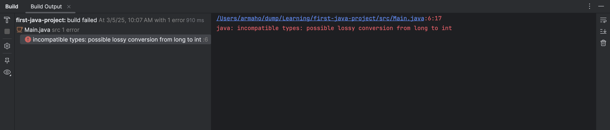

متن خطا می‌گوید:

```text
java: incompatible types: possible lossy conversion from long to int
```

جاوا با این خطا به شما می‌گوید که تبدیل متغیرهای `long` به `int`، خطرناک است و می‌تواند منجر به خطاهای overflow شود. مثلا در همین مثال، عدد `10_000_000_000L` به قدری بزرگ است که در یک متغیر `int` جا نمی‌شود و به همین خاطر تبدیل آن به یک `int` مشکلاتی برای شما به همراه دارد.

حالا اگر یک `int` قبل از `a` قرار دهیم به جاوا می‌گوییم که از cast کردن مطمئنیم و می‌دانیم که هیچ مشکلی ایجاد نمی‌کند:

```java
public static void main(String[] args) {
    long a = 10_000_000_000L;
    int b = (int)a;  
  
    System.out.println("a: " + a);  
    System.out.println("b: " + b);  
}
```

خروجی این کد به شکل زیر است:

```text
a: 10000000000  
b: 1410065408
```

حالا به مقدار عجیب `b` نگاه کنید! مشکلی که می‌بینید، مشکل بسیار معروفی به اسم "overflow" است. زمانی که شما، عدد خیلی بزرگی را داخل یک متغیر که فضای کافی ندارد ذخیره می‌کنید، به خطای overflow می‌خورید. باید بدانید که اگر مقدار `a` کوچکتر بود به این خطا نمی‌خوردید:

```java
public static void main(String[] args) {
    long a = 100;
    int b = (int)a;  
  
    System.out.println("a: " + a);  
    System.out.println("b: " + b);  
}
```

خروجی این کد به این شکله:

```text
a: 100  
b: 100
```

علت این که cast بالا به درستی انجام شد این است که مقدار `100` به راحتی در یک متغیر `int` جا می‌شود.

اتفاق مشابهی در cast کردن بین متغیرهای `int` و `double` هم رخ می‌دهد. Cast زیر به درستی انجام می‌شود:

```java
public static void main(String[] args) {
    int a = 100;
    double b = a;  
  
    System.out.println("a: " + a);  
    System.out.println("b: " + b);  
}
```

خروجی این کد به صورت زیر است:

```text
a: 100  
b: 100.0
```
ممیز خط دوم نشان می‌دهد که متغیر `b` از جنس `double` است.

ولی اگر تلاش کنید عددی اعشاری را به عددی صحیح تبدیل کنید، باز هم خطا می‌گیرید:

```java
public static void main(String[] args) {
    double a = 3.14;
    int b = a;  
  
    System.out.println("a: " + a);  
    System.out.println("b: " + b);  
}
```

دوباره با همان خطای قبلی روبه‌رو شدیم:

```text
java: incompatible types: possible lossy conversion from double to int
```

این خطا به خاطر این است که در این cast، بخش اعشاری متغیر `a` از دست می‌رود. اگر شما این cast را با استفاده از `int` به صورت زیر انجام دهید:

```java
int b = (int)a;
```

می‌بینید که فقط بخش صحیحِ متغیر `a`، در `b` ذخیره می‌شود:

```text
a: 3.14  
b: 3
```

حتی اگر دوباره متغیر `b` را به `double` تبدیل کنید، می‌بینید که بخش اعشاری‌ برنمی‌گردد:

```java
public static void main(String[] args) {
    double a = 3.14;
    int b = (int)a;
    double c = b;  
  
    System.out.println("a: " + a);  
    System.out.println("b: " + b);  
    System.out.println("c: " + c);  
}
```

خروجی این کد به شکل زیر است:

```text
a: 3.14  
b: 3  
c: 3.0
```

این cast، خطرناک محسوب می‌شود چون در اون، بخشی از داده‌ها از دست رفته‌اند.

### انواع casting

دیدید که cast کردن، می‌تواند خطرناک باشد. جاوا می‌داند که چه cast هایی می‌توانند مشکل‌زا باشند. اگر مثل مثال اول، یک متغیر `int` را به `long` تبدیل کنیم، جاوا با اطمینان از موفق و بی‌خطر بودن این cast، آن را بدون هیچ خطا و اخطاری اجرا می‌کند. اما در مثال دوم، که cast کردن می‌توانست مشکل‌زا باشد، جاوا به ما خطا داد و مجبور شدیم با استفاده از `int` به او بگوییم که ما نسبت به این مشکلات آگاهیم و همچنان می‌خواهیم این cast را انجام دهیم. به طور کلی cast هایی که ممکن است برای برنامهٔ شما با از دست دادن اطلاعات، overflow یا هر خطای دیگری مواجه شوند، cast های خطرناکی محسوب می‌شوند.

بر همین اساس، castها را به دو دسته تقسیم می‌کنیم:

#### کست‌های implicit

واژهٔ "implicit" یعنی چیزی که بدون اشارهٔ مستقیم فهمیده می‌شود. مثل وقتی که شما لازم نیست با گذاشتن `int` مستقیما به جاوا بگید که از خطرات cast آگاهید. cast هایی که مشکلی برای برنامهٔ شما ایجاد نمی‌کنند، به cast های implicit معروفند. cast کردن متغیر `int` به `long` از همین نوع است.

#### کست‌های explicit

واژهٔ "explicit" به معنای چیزی است که باید مستقیما و به شکل دقیق بیان شود. کست‌های explicit، کست‌هایی هستند که ممکن است مشکل‌زا باشند و لازم است که در کدتان حتما اعلام کنید که از انجام آن cast آگاهید و در جریان مشکلات احتمالی هستید. تبدیل کردن متغیر `long` به `int` از این جنس است.

### کست کردن در reference type ها

حالا به ارث‌بری برگردیم. اگر به خاطر داشته باشید، به شما گفته بودیم class ها، ابزاری هستند که به وسیلهٔ آن‌ها می‌توانید برای خودتان type های جدید تعریف کنید. ولی خب، آیا این type ها هم قابل cast کردن هستند؟ جواب طبیعتاً بله‌ست.

بیایید با یک مثال cast کردن در این type ها را ببینیم. کد زیر را در تابع `main` بنویسید:

```java
public static void main(String[] args) {  
    Car myCar = new Car("Iran-Khodro", 180, 4);  
    myCar.showCarInfo();  
}
```

آن را اجرا کنید تا مطمئن باشید همه چیز درست کار می‌کند:

```text
Brand: Iran-Khodro, Speed: 180 km/h  
Doors: 4
```

حالا، بیاید یک cast عجیب بین `Car` و `Vehicle` انجام بدیم:

```java
public static void main(String[] args) {  
    Car myCar = new Car("Iran-Khodro", 180, 4);  
    myCar.showCarInfo();  
  
    System.out.println();  
  
    Vehicle myVehicle = myCar; // Casting from Car to Vehicle
    myVehicle.showInfo();  
}
```

خروجی این کد، به شکل زیر است:

```text
Brand: Iran-Khodro, Speed: 180 km/h  
Doors: 4  

Brand: Iran-Khodro, Speed: 180 km/h
```

اگر دقت کنید، وقتی که `Car` از `Vehicle` ارث‌بری می‌کند، تمام فیلدها و متدهای `Vehicle` متعلق به `Car` نیز هستند. یعنی هر آبجکتی از جنس `Car`، تمام فیلدهای یک `Vehicle` را در خودش دارد، پس ما همه چیز برای cast کردن `Car` به `Vehicle` را داریم و می‌توانیم آن را انجام دهیم. همان‌طور که می‌بینید، برند `myVehicle` ایران خودرو و سرعتش `180 km/h` است. دقیقا مثل `myCar`.

حتی می‌توانیم `myVehicle` را با یک دوچرخه هم جایگزین کنیم:

```java
public static void main(String[] args) {  
    Car myCar = new Car("Iran-Khodro", 180, 4);  
    myCar.showCarInfo();  
  
    System.out.println();  
  
    Vehicle myVehicle = myCar; // Casting from Car to Vehicle
    myVehicle.showInfo();  
  
    System.out.println();  
  
    Bike myBike = new Bike("Scott", 10, false);  
    myBike.showBikeInfo();  
  
    System.out.println();  
  
    myVehicle = myBike; // Casting, again!
    myVehicle.showInfo();  
}
```

می‌بینید که `myVehicle` از یک ماشین به یک دوچرخه تبدیل می‌شود.

بیاید یک لحظه به اتفاق خیلی خوبی که الآن دیدیم بیشتر فکر کنیم. دیدیم که متغیرهایی با جنس `Vehicle`، می‌توانند با آبجکت‌های `Car` ،`Bike` و `MotorCycle` پر شوند. اتفاقی که بدون ارث‌بری ممکن نبود. فرض کنید بدون ارث‌بری، می‌خواستید متدی بنویسید که با توجه به سرعت یک وسیلهٔ نقلیه، بگوید یک مسافت مشخص در چند ثانیه طی می‌شود. اگر ارث‌بری نبود، مجبور بودید به شکل زیر، برای هر یک از وسایل نقلیه‌ متدی جدا تعریف کنید:

```java
public static double calculateTimeForCar(double distance, Car car) {
    return distance / car.speed;  
}

public static double calculateTimeForBike(double distance, Bike bike) {
    return distance / bike.speed;  
}

public static double calculateTimeForMotorCycle(double distance, MotorCycle motorCycle) {
    return distance / motorCycle.speed;  
}
```

می‌بینید که مقدار زیادی کد تکراری داریم و مجبور شدیم برای هر وسیلهٔ نقلیه، یک متد جدا بنویسیم. شرایط زمانی بدتر می‌شود که بخواهیم کلاس تریلی را هم اضافه کنیم، اما یادمان برود که متد محاسبه زمان بر حسب مساحت را برای آن بنویسیم.

ارث‌بری کار ما را خیلی راحت می‌کند چون زمانی که همهٔ کلاس‌ها از `vehicle` ارث‌بری کنند، می‌توانیم فقط یک متد برای محاسبهٔ زمان داشته باشیم:

```java
public static double calculateTime(double distance, Vehicle vehicle) {
    return distance / vehicle.speed;  
}
```

و این متد، توسط تمام آبجکت‌هایی که از جنس `Vehicle` هستند، قابل استفاده‌ است. این موضوع شامل آبجکت‌های `Car`، `Bike`، `MotorCycle` و حتی تریلی‌های آینده هم می‌شود!

```java
public class Main {
    public static void main(String[] args) {  
        Vehicle myVehicle = new Vehicle("Benz", 200);  
        Car myCar = new Car("Iran-Khodro", 180, 4);  
        Bike myBike = new Bike("Scott", 10, false);  
        MotorCycle myMotorCycle = new MotorCycle("Yamaha", 100, false);  
  
        System.out.println("time taken by myVehicle to move 10 km: " + calculateTime(10, myVehicle));  
        System.out.println("time taken by myCar to move 10 km: " + calculateTime(10, myCar));  
        System.out.println("time taken by myBike to move 10 km: " + calculateTime(10, myBike));  
        System.out.println("time taken by myMotorCycle to move 10 km: " + calculateTime(10, myMotorCycle));  
    }

    public static double calculateTime(double distance, Vehicle vehicle) {
        return distance / vehicle.speed;  
    }  
}
```

این کد، خروجی زیر را می‌دهد:

```text
time taken by myVehicle to move 10 km: 0.05  
time taken by myCar to move 10 km: 0.05555555555555555  
time taken by myBike to move 10 km: 1.0  
time taken by myMotorCycle to move 10 km: 0.1
```

#### explicit cast در reference type ها

اگر دقت کنید، در cast های بالا، لازم نبود که داخل پرانتز، explicitly مشخص کنیم تا جاوا بداند ما از مشکلات cast آگاهیم، چون cast هایی که انجام دادیم اصلا مشکلی به وجود نمی‌آوردند! ولی همیشه این‌طور نیست. مثلا اگر بخواهیم که یک `Vehicle` را به یک `Car` تبدیل کنیم چه می‌شود؟

کد زیر را ببینید:

```java
public static void main(String[] args) {  
    Car myCar = new Car("Iran-Khodro", 180, 4);  
    myCar.showCarInfo();  
      
    System.out.println();  
      
    Vehicle myVehicle = myCar;  
    myVehicle.showInfo();  
      
    System.out.println();  
      
    Car theSameCar = myVehicle;  
    theSameCar.showCarInfo();  
}
```

تلاش کنید آن را اجرا کنید. به همان خطای همیشگی می‌خورید:

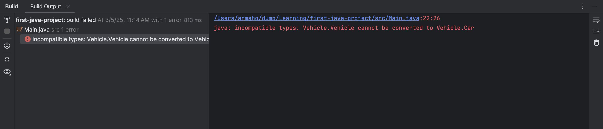

چرا شما باید بتونید `Vehicle` رو به `Car` تبدیل کنید؟! ممکن است `Car` فیلدهای اضافه نسبت به `Vehicle` داشته باشد. اما راه‌هایی برای انجام این cast وجود دارد. برای این که بفهمیم چرا و چطور باید نگاهی به مموری بکنیم. اگر از بخش «reference type ها»ی داک قبلی به خاطر داشته باشید، بعد از درست شدن متغیر `myCar` و مقدار‌دهی‌اش، مموری چنین شکلی دارد:

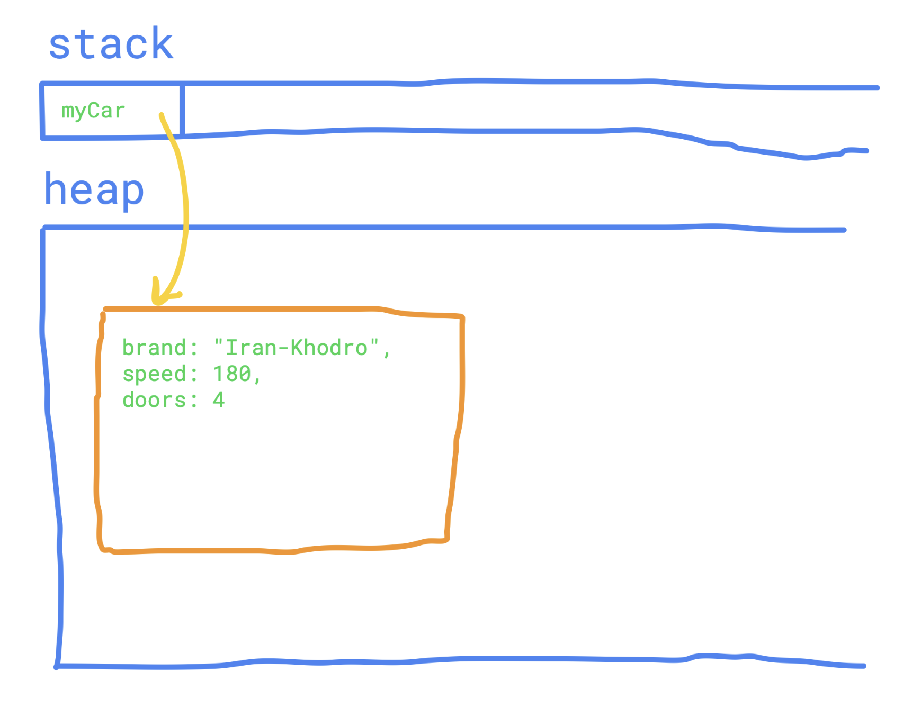

بعد از این که `myVehicle` هم ساخته شود، مموری به شکل زیر در می‌آید:

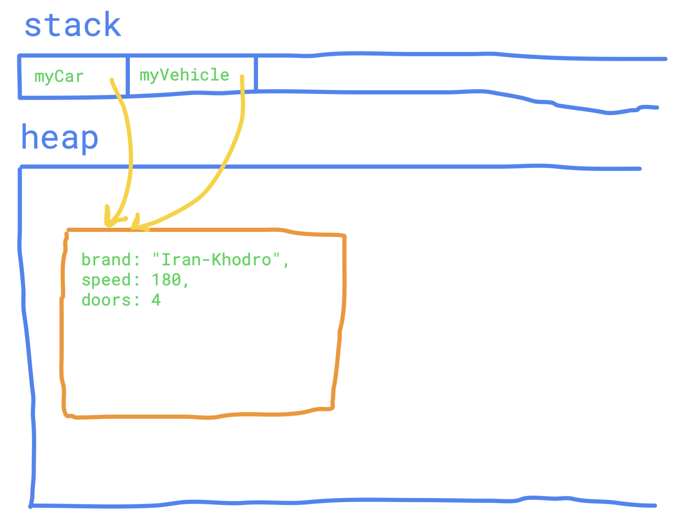

می‌توانید این موضوع را با تکه کد زیر تایید کنید. این‌جا می‌بینید که تغییر سرعت `myVehicle`، باعث تغییر سرعت `myCar` هم می‌شود:

```java
myVehicle.accelerate(100);  
  
System.out.println("myVehicle speed: " + myVehicle.speed);  
System.out.println("myCar speed: " + myCar.speed);
```

خروجی این کد به شکل زیر است:

```text
myVehicle speed: 280  
myCar speed: 280
```

می‌بینید که سرعت هر دو دستگاه از `180` به `280` رسیده. حالا سراغ cast کردن می‌رویم:

```java
Car theSameCar = myVehicle;
```

با این که جاوا اخطار مشکل‌زا بودن این cast را می‌دهد، ولی اگر باز هم به مموری نگاه کنیم، می‌بینیم که `myVehicle` هم به آبجکتی از جنس `Car` اشاره می‌کند! آبجکت `car` ای که `myVehicle` به آن اشاره می‌کند، همچنان فیلدی به اسم `doors` در مموری دارد و به همین خاطر، اگر به جاوا explicitly اطمینان دهیم که می‌دانیم چه کار می‌کنیم، این cast انجام می‌شود:

```java
Car theSameCar = (Car)myVehicle;

theSameCar.showCarInfo();
```

اگر این کد را اجرا کنید، به خطایی نمی‌خورید و می‌بینید که `theSameCar` هم مثل `myCar` چهار در دارد:

```text
Brand: Iran-Khodro, Speed: 280 km/h  
Doors: 4
```

در نهایت مموری به شکل زیر خواهد بود:

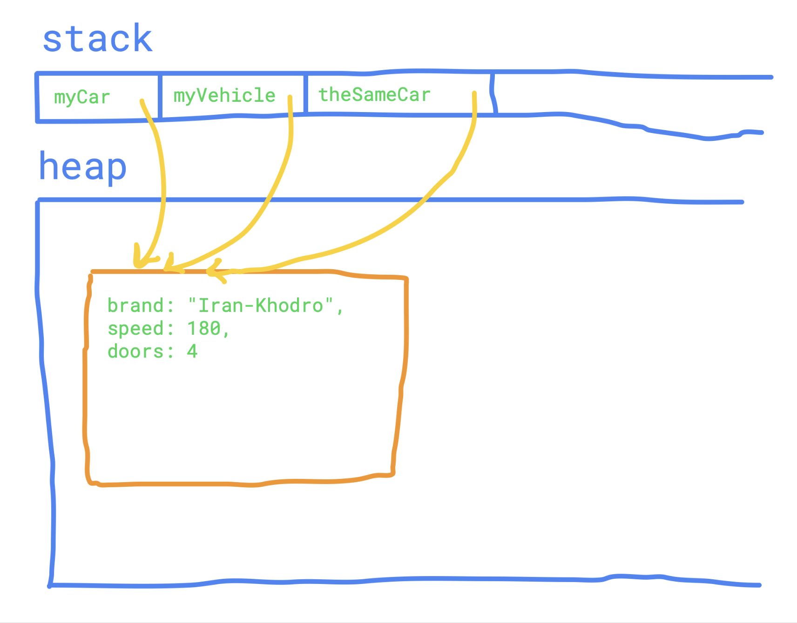

همان‌طور که می‌بینید، هر سه متغیری که در این برنامه تعریف کردید، دقیقا به یک‌جا اشاره می‌کنند.

## کلاس Object

### متدهای ناآشنا

کد زیر را در main بنویسید:

```java
public static void main(String[] args) {  
    Car myCar = new Car("Iran-Khodro", 180, 4);  
    myCar.showCarInfo();  
  
    System.out.println("Hash code: " + myCar.hashCode());  
}
```

متد `hashCode()` در خط آخر را کجا تعریف کردیم؟! چطور بدون هیچ اخطار قبلی‌ای، از آن استفاده کردیم؟ خروجی این کد به شکل زیر است:

```text
Brand: Iran-Khodro, Speed: 180 km/h  
Doors: 4  
Hash code: 500977346
```

همه چیز عجیب‌تر هم می‌شود! `myCar`، چندین متد دیگر هم دارد که ما هیچ‌جا آن‌ها را تعریف نکردیم! حتی IntelliJ هم به ما پیشنهاد می‌دهد که از آن‌ها استفاده کنیم:

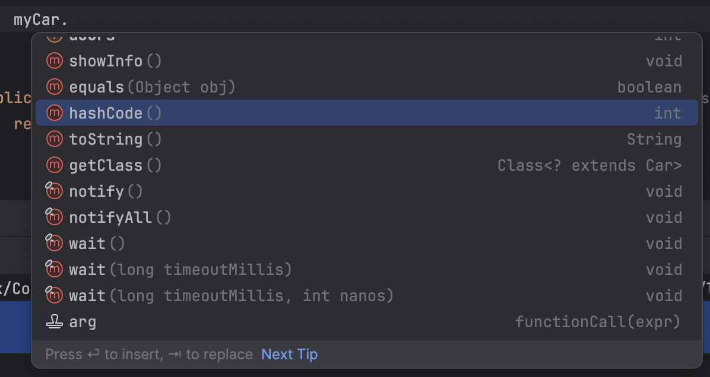

روی همین متد `hashCode()` برید و کلیک راست کنید، از منوی Go To، گزینهٔ Declaration or Usages را انتخاب کنید تا پیاده‌سازی این متد را ببینید:

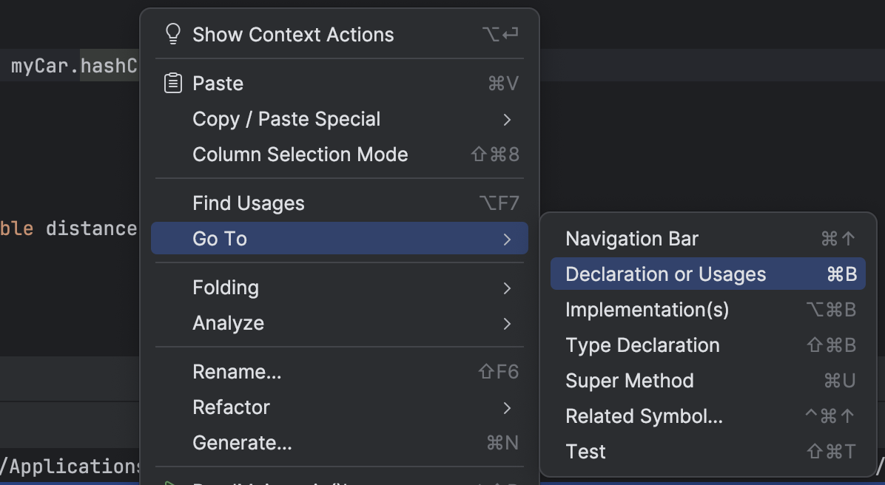

اگر مقداری این صفحه را اسکرول کنید، می‌بینید که این متد، جزئی از کلاسی به اسم Object است:

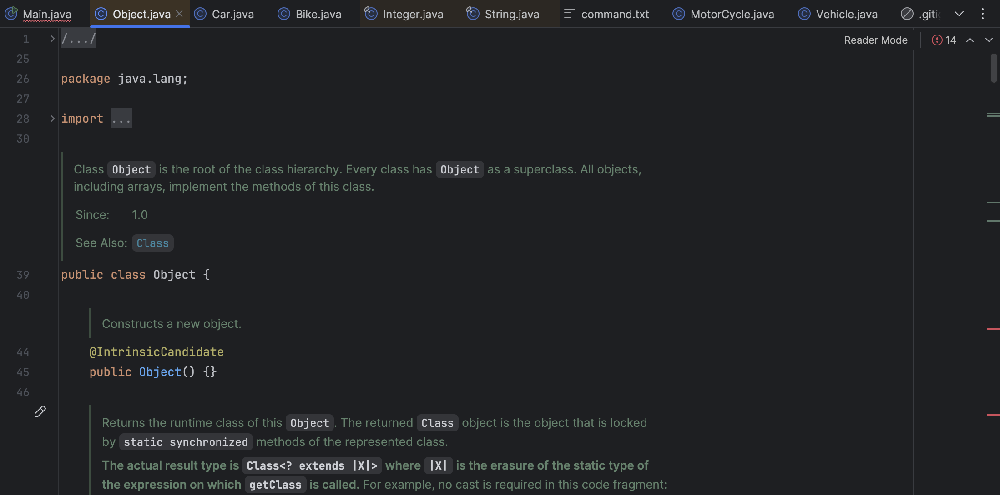

### تعریف کلاس Object

حالا کلاس `Object` چی هست؟ `Object` کلاسی‌ست که همهٔ کلاس‌های دیگر از آن به صورت مستقیم یا غیرمستقیم ارث‌بری می‌کنند. در کد شما، `Vehicle` از `Object` ارث‌بری می‌کند و `Car` هم از `Vehicle`، پس `Car` به شکلی غیرمستقیم از `Object` ارث‌بری می‌کند و به همین خاطر، به متدهای آن مثل `hashCode()`، `toString()` یا `equals(Object obj)` دسترسی دارد (دقت کنید که کلاس `Car` همچنان فقط یک پدر دارد و کلاس `Object` در واقع پدربزرگ این کلاس است).

شما تا الآن بدون این که خبر داشته باشید از این متدها استفاده می‌کردید. مثلا وقتی کد زیر را بزنید:

```java
System.out.println(myCar);
```

خروجی زیر را می‌بینید:

```text
Vehicle.Car@1ddc4ec2
```

این output عجیب و غریب، در واقع خروجی متد `myCar.toString()` است. اگر کد زیر را اجرا کنید:

```java
System.out.println(myCar.toString());
```

می‌بینید که خروجی هیچ تفاوتی ندارد:

```text
Vehicle.Car@1ddc4ec2
```

حتی می‌توانید این موضوع را در پیاده‌سازی متد `println(Object obj)` هم ببینید. این متد به شکل زیر پیاده‌سازی شده است:

```java
public void println(Object x) {  
    String s = String.valueOf(x);
    if (getClass() == PrintStream.class) {
        // need to apply String.valueOf again since first invocation  
        // might return null
        writeln(String.valueOf(s));  
    } else {
        synchronized (this) {  
            print(s);  
            newLine();  
        }  
    }  
}
```

به جزئیات پیاده‌سازی این کد کاری نداریم فقط باید بدانیم که متد `writeln` در این کد output را برای شما چاپ می‌کند. می‌بینید که در این کد، `String.valueOf(x)` صدا زده شده. این متد هم پیاده‌سازی سادهٔ زیر را دارد:

```java
public static String valueOf(Object obj) {
    return (obj == null) ? "null" : obj.toString();  
}
```

این متد، با ورودی گرفتن یک Object، اگر `null` باشد، رشتهٔ `null` و در غیر این صورت `obj.toString()` را برمی‌گرداند.

این‌جا هم می‌توانید کمکی که inheritance به ما می‌کند را ببینید. از آن‌جایی که متد `println` یک Object ورودی می‌گیرد، شما می‌توانید هر reference type دیگری مثل `Vehicle`، `Car` و هر کلاس دیگری را به آن ورودی بدهید. فرض کنید مجبور بودیم به خاطر عدم وجود inheritance برای هر کلاس یک بار `println` را پیاده‌سازی کنیم!

## کلاس‌های Abstract

فرض کنید می‌خواهید یک برنامه بنویسید تا حقوق کارمندان را حساب کند. سازمان شما دو نوع کارمند دارد:

- **کارمندهای تمام‌وقت:** این کارمندها، ماهیانه مبلغ ثابتی حقوق می‌گیرند. برای مثال ممکن است هر ماه ۳۰ میلیون تومان حقوق دریافت کنند.
- **کارمندهای قراردادی:** این کارمندها، بر اساس ساعاتی که در ماه در شرکت بودند حقوق می‌گیرند. برای مثال اگر ساعتی ۱ میلیون تومان دریافت کنند ، اگر ۲۰ ساعت در شرکت باشند ۲۰ میلیون و اگر ۴۵ ساعت باشند، ۴۵ میلیون حقوق دریافت می کنند.

پکیج `company` را برای درست کردن کلاس‌ها ایجاد کنید. دوتا کلاس `FullTimeEmployee` و `Contractor` را در این پکیج ایجاد کنید:

```java
package company;

public class Contractor {
    public String name;
    public int id;
    public double hourlyRate;
    public int hoursWorked;

    public Contractor(String name, int id, double hourlyRate, int hoursWorked) {
        this.name = name;
        this.id = id;
        this.hourlyRate = hourlyRate;
        this.hoursWorked = hoursWorked;  
    }

    public void showDetails() {  
        System.out.println("ID: " + id + ", Name: " + name);  
    }

    public double calculateSalary() {
        return hourlyRate * hoursWorked;  
    }  
}
```

```java
package company;

public class FullTimeEmployee {
    public String name;
    public int id;
    public double monthlySalary;

    public FullTimeEmployee(String name, int id, double monthlySalary) {
        this.name = name;
        this.id = id;
        this.monthlySalary = monthlySalary;  
    }

    public void showDetails() {  
        System.out.println("ID: " + id + ", Name: " + name);  
    }

    public double calculateSalary() {
        return monthlySalary;  
    }  
}
```

در این دو کلاس، موارد مشترک زیادی می‌شود دید. مثل فیلدهای `name` و `id` و متد `showDetails` که کاملا یکسان هستند. این شباهت، این حس را ایجاد می کند که باید از inheritance استفاده کنید. برای این کار، شما کلاس `Employee` رو تعریف می‌کنید:

```java
package company;

public class Employee {
    public String name;
    public int id;

    public Employee(String name, int id) {
        this.name = name;
        this.id = id;  
    }

    public void showDetails() {  
        System.out.println("ID: " + id + ", Name: " + name);  
    }  
}
```

و کدتون رو به شکلی تغییر دهید که کلاس‌های `FullTimeEmployee` و `Contractor` هر دو از آن ارث‌بری کند. کلاس‌های زیر را در پکیج company ایجاد کنید یا تغییر بدهید:

```java
package company;

public class Contractor extends Employee {
    public double hourlyRate;
    public int hoursWorked;

    public Contractor(String name, int id, double hourlyRate, int hoursWorked) {
        super(name, id);
        this.hourlyRate = hourlyRate;
        this.hoursWorked = hoursWorked;  
    }

    public double calculateSalary() {
        return hourlyRate * hoursWorked;  
    }  
}
```

```java
package company;

public class FullTimeEmployee extends Employee {
    public double monthlySalary;

    public FullTimeEmployee(String name, int id, double monthlySalary) {
        super(name, id);
        this.monthlySalary = monthlySalary;  
    }

    public double calculateSalary() {
        return monthlySalary;  
    }  
}
```

می‌بینید که کد تمیزتری شد. حالا بیاید در متد `main`، یک سری کارمند تعریف کنیم و مجموع حقوقی که باید بدیم را حساب کنیم:

```java
public static void main(String[] args) {  
    FullTimeEmployee ali = new FullTimeEmployee("Ali", 1, 10_000);  
    Contractor gholi = new Contractor("Gholi", 2, 1_000, 100);  
    Contractor mamad = new Contractor("Mamad", 3, 1_000, 25);  
  
    ArrayList<FullTimeEmployee> fullTimeEmployees = new ArrayList<>();  
    ArrayList<Contractor> contractors = new ArrayList<>();  
  
    fullTimeEmployees.add(ali);  
    contractors.add(mamad);  
    contractors.add(gholi);

    double sumOfSalary = 0;
    for (FullTimeEmployee employee : fullTimeEmployees) {  
        sumOfSalary += employee.calculateSalary();  
    }
    for (Contractor contractor : contractors) {  
        sumOfSalary += contractor.calculateSalary();  
    }  
      
    System.out.println("Salary this month: " + sumOfSalary);  
}
```

این کد را یکبار بخوانید تا بفهمید چه کاری انجام می‌دهد. آن را اجرا کنید تا نتیجه زیر را ببینید:

```java
Salary this month: 135000.0
```

یک مشکل در این کد وجود دارد. فرض کنید رئیس می‌خواهد که نوع جدیدی از کارمند داشته باشیم. مثلا فرض کنید که می‌خواهیم حقوق مدیران به شکل متفاوتی محاسبه شود. کلاس `Manager` را اضافه می‌کنیم و بعد از این کار، برای محاسبهٔ حقوق حلقهٔ زیر را به `main` اضافه می‌کنیم:

```java
for (Manager manager : managers) {  
    sumOfSalary += manager.calculateSalary();  
}
```

بعدتر تصمیم می گیرید که حقوق کله گنده‌ها به شکل متفاوتی محاسبه شود! شما کلاس `KaleGonde` را برای آن‌ها درست می‌کنید و برای حساب کردن حقوق حلقهٔ زیر را اضافه می‌کنید:

```java
for (KaleGonde kaleGonde : kaleGondeha) {  
    sumOfSalary += kaleGonde.calculateSalary();  
}
```

کد نهایی‌ چنین چیزی خواهد بود:

```java
double sumOfSalary = 0;
for (FullTimeEmployee employee : fullTimeEmployees) {  
    sumOfSalary += employee.calculateSalary();  
}
for (Contractor contractor : contractors) {  
    sumOfSalary += contractor.calculateSalary();  
}
for (Manager manager : managers) {  
    sumOfSalary += manager.calculateSalary();  
}
for (KaleGonde kaleGonde : kaleGondeha) {  
    sumOfSalary += kaleGonde.calculateSalary();  
}
```

حدس بزنید مشکل این کد کجاست؟ بله دقیقا. این حلقه‌ها خیلی مشابه هستند و ما کدهای شبیه به هم را ترجیح نمی‌دهیم! یک راه حل خوب برای این موضوع، این هست که کلاس `Employee`، که پدر همهٔ کلاس‌های برنامه‌ است را abstract کنیم. در ابتدا کد را ببینیم:

```java
package company;

public abstract class Employee {
    public String name;
    public int id;

    public Employee(String name, int id) {
        this.name = name;
        this.id = id;  
    }

    public void showDetails() {  
        System.out.println("ID: " + id + ", Name: " + name);  
    }

    public abstract double calculateSalary();  
}
```

با استفاده از کلیدواژهٔ abstract در خط سوم این کد، کلاس `Employee` را به یک Abstract Class تبدیل کردیم. می‌بینید که در این کلاس، یک اتفاق عجیب افتاده. متد `calculateSalary()` تعریف شده است، ولی هیچ چیزی در `{}` برای پیاده‌سازی آن نیامده. این یعنی کلاس `Employee`، پیاده‌سازی این متد را به subclass های خود واگذار کرده.

در واقع، کلاس `Employee` به شما می گوید «هر کارمند، یک متد به اسم `calculateSalary()` دارد که هیچ چیزی ورودی نمی‌گیرد و خروجی آن، `double` خواهد بود. پیاده‌سازی این متد بسته به نوع کارمند (`FullTime`، `Contractor`، `Manager` یا `KaleGonde` بودن) متفاوت است، ولی هر کلاس، قطعا این متد را دارد و شما می‌توانید آن را فراخوانی کنید.».

شاید مقداری گیج کننده باشد ، بیاید تا کد `main` را یک مقدار عوض کنیم تا این مطلب برایتان به خوبی مفهوم شود:

```java
public static void main(String[] args) {  
    FullTimeEmployee ali = new FullTimeEmployee("Ali", 1, 10_000);  
    Contractor gholi = new Contractor("Gholi", 2, 1_000, 100);  
    Contractor mamad = new Contractor("Mamad", 3, 1_000, 25);  
  
    ArrayList<Employee> allEmployees = new ArrayList<>();  
  
    allEmployees.add(ali);  
    allEmployees.add(mamad);  
    allEmployees.add(gholi);

    double sumOfSalary = 0;
    for (Employee employee : allEmployees) {  
        sumOfSalary += employee.calculateSalary();  
    }  
  
    System.out.println("Salary this month: " + sumOfSalary);  
}
```

کد فعلی `main` را نگاه کنید و تفاوت‌های آن را با کد قبلی ببینید. می‌بینید که آرایه‌ ما از جنس `Employee`است، و آن را با `FullTimeEmployee` ها و `Contractor` ها پر کردیم. از اون‌جایی که می‌دانیم هر `Employee` فارغ از نوع قطعا یک متد `calculateSalary()` دارد، پس فقط یک حلقه کافیست که درآمد همهٔ کارکنان را جمع بزنیم. اگر این کد اجرا شود، خروجی قبل را می‌بینید:

```java
Salary this month: 135000.0
```

کار abstract class ها دقیقا همین چیزی است که این‌جا دیدید. وقتی در کلاس پدر، نمی‌دانیم که کلاس‌های فرزند یک متد را به چه شکل پیاده‌سازی می‌کنند، ولی می‌دانیم که حتما آن را پیاده‌سازی می‌کنند، از abstract class استفاده می‌کنیم.

دقت کنید که دوتا نکته در abstract class ها بسیار مهم است. اول این که کلاس‌های فرزند، حتما باید متدهای abstract ای که کلاس پدر تعریف کرده پیاده‌سازی کنند، چرا که در غیر این صورت به خطا می‌خوریم. یک بار متد `calculateSalary` را از `Contractor` پاک کنید تا خطایش را ببینید:

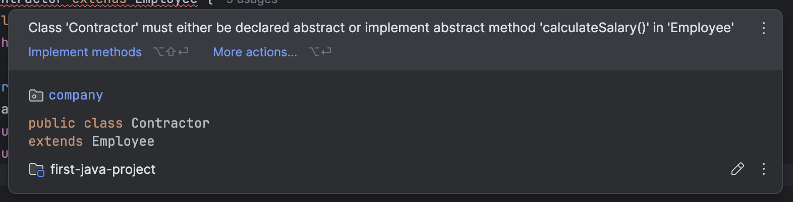

این خطا به شما می‌گوید که «کلاس `Contractor` یا باید خودش abstract باشد (و در نتیجه پیاده‌سازی متدهای abstract را به فرزندانش بسپرد)، یا باید متد `calculateSalary` را پیاده‌سازی کند».

نکتهٔ دوم این است که چون کلاس‌های abstract پیاده‌سازی کاملی ندارند، شما نمی‌توانید از این کلاس‌ها مستقیما `new` کنید. کد زیر به خطا می‌خورد:

```java
Employee javad = new Employee("Javad", 4);
```

کلاس‌های abstract، فقط ظرفی برای subclass های خود هستند و نباید از آنها مستقیم آبجکت ساخته بشود. در عوض، چیزی مثل کد زیر کاملا درست است:

```java
FullTimeEmployee ali = new FullTimeEmployee("Ali", 1, 10_000);  
Employee ali2 = ali;
```

## Polymorphism

در دنیای واقعی وقتی اطرافتان را نگاه می‌کنید، می‌بینید که خیلی از کارها در موجودات مختلف به شکل‌های متفاوتی انجام می‌شود. مثلاً راه رفتن را در نظر بگیرید؛ هم اسب، هم انسان هر دو راه می روند. اما این کجا و آن کجا؟! یا مثلاً غذا خوردن، حرف زدن و کلی چیز های مختلف دیگر.

حالا در دنیای برنامه‌نویسی شی‌گرا، اگه بخواهید یک متد، کلاس یا شیء در شرایط مختلف رفتارهای متفاوتی داشته باشد، از قابلیتی به اسم Polymorphism استفاده می‌کنید. این ویژگی باعث می‌شود کد شما منعطف‌تر، خواناتر و نگهداری آن راحت‌تر شود.

جاوا دارای دو نوع پلی مورفیسم است:

- **Compile-time Polymorphism (Method Overloading)**: اینجاست که چند تا متد با یک اسم ولی با ورودی‌های متفاوت در یک کلاس تعریف می‌کنید. این کار به شما اجازه می‌دهد که یک کار مشابه را با ورودی‌های مختلف انجام بدهید.

- **Run-time Polymorphism (Method Overriding)**: این یعنی یک متد در کلاس والد تعریف شده است و بعد در کلاس فرزند با همان اسم ولی پیاده‌سازی متفاوت بازنویسی می‌شود. این کار به شما اجازه می‌ده رفتار یه متد را در کلاس‌های فرزند تغییر بدهید.

پس اصل داستان این است که متدهایی با اسم یکسان می‌توانند رفتارهای متفاوتی داشته باشند و همین باعث می‌شود کد شما هم تمیزتر و هم راحت‌تر قابل استفاده مجدد باشد.

### Compile-time Polymorphism (Method Overloading)

گاهی وقت ها پیش میاید که چند متد با یک اسم در یک کلاس تعریف می‌کنیم، اما امضای (تعداد یا نوع پارامترهای) متدها با هم متفاوت اند. این کار باعث می‌شود وقتی متد را صدا می‌زنیم، کامپایلر بفهمد کدام متد باید اجرا شود. به این روش Method Overloading می‌گویند.

ویژگی‌های این نوع polymorphism، به شکل زیر است:
- در یک کلاس انجام می‌شود.
- تفاوت در تعداد یا نوع پارامترها وجود دارد.
- در زمان کامپایل مشخص می‌شود.

مثلا در کد زیر، چند متد `add` داریم که هر کدام، ورودی‌های متفاوتی می‌گیرند و خروجی متفاوتی می‌دهند:

```java
class MathOperations {  
    int add(int a, int b) {  
		return a + b;  
	}  

	double add(double a, double b) {  
		return a + b;  
	}  

	int add(int a, int b, int c) {  
		return a + b + c;  
	}  
}

public class Main {  
	public static void main(String[] args) {  
		MathOperations math = new MathOperations();  
		System.out.println(math.add(5, 10)); // Output: 15  
		System.out.println(math.add(5.5, 2.2)); // Output: 7.7  
		System.out.println(math.add(1, 2, 3)); // Output: 6  
	}
}
```

### Run-time Polymorphism (Method Overriding)

اینجا بحث سر این است که یک متد توی کلاس Parent داریم و یه کلاس Child که می‌خواهد آن متد را به شکل خودش پیاده‌سازی کند. این کار را با Method Overriding انجام می‌دهیم.

ویژگی‌های این نوع polymorphism، به شکل زیر است:
- بین کلاس Parent و Child اتفاق می‌افتد.
- امضای متد (شامل اسم آن، جنس ورودی‌ها و خروجی‌ها) تغییری نمی‌کند.
- در زمان اجرای برنامه‌، بسته به تایپ متغیر تصمیم گرفته می‌شود کدام متد اجرا شود.

مثلا در کد زیر، متد `makeSound` در `Dog` دوباره تعریف شده است. لازم است که وقتی متدی را override می‌کنید، حتما بالای آن از `@Override` استفاده کنید، وگرنه IntelliJ به شما هشدار می‌دهد. در ادامهٔ داک خواهیم گفت که `@Override` به چه معناست.

```java
class Animal {
	void makeSound() {  
		System.out.println("An animal makes a sound");
	}  
}  
  
class Dog extends Animal {
	@Override
	void makeSound() {  
        System.out.println("Dog barks");
	}  
}  
  
public class Main {
	public static void main(String[] args) {  
		Animal myAnimal = new Animal();
		myAnimal.makeSound();  // Output: An animal makes a sound
        
		Animal myDog = new Dog();
		myDog.makeSound();  // Output: Dog barks    }  
}
```

## interface

ارث‌ بری و وراثت ابزار بسیار کاربردیه که به شما اجازه میدهد از polymorphism (چند ریختی) استفاده کنید ولی خب اگر توجه کرده باشید، محدودیتی هم جلوی شما قرار می دهد. جاوا از ارث بری یگانه (single inheritance) استفاده میکند، به این معنا که یک کلاس میتواند فقط یک superclass را extend کند. این محدودیت، اجازه نمیدهد که از ارث بری برای کلاس‌هایی استفاده کنیم که نیاز دارند شاخصه‌های متفاوت موجود در سوپر کلاس‌های مختلف را همزمان داشته باشند. امتحان کنید و ببینید که اگه بخواهید همزمان چند تا superclass را extend کنید، به کامپایل ارور بر میخورید.

همچنین، تو یکسری موقعیت‌ها، ممکن است نخواهید که جزییات پیاده‌سازی و کد را به اشتراک بگذارید. اینجاست که با مفهوم جدیدی به اسم interface آشنا میشویم تا محدودیت‌های قبلی را کنار بگذاریم.

### اینترفیس چیست و چطور از آن استفاده کنیم؟

اینترفیس مثل کلاس‌های عادی است، صرفا یکسری تفاوت‌ها و محدودیت‌ها دارد. Interface متشکل شده از یکسری تعریف اولیه از متدها است. متدهایی که بدنه ندارند و جزییات پیاده سازی آنها نوشته نشده است.

کلاس‌ها، سوپرکلاس‌های عادی یا abstract را extend میکردند و ویژگی‌های آنها را به ارث میبردند، ولی interface ها را implement (پیاده‌سازی) میکنند. Implement کردن یک اینترفیس به این معناست که کلاسی که میخوهاد interface مورد نظر را پیاده‌سازی کند، قول میدهد که بدنه همه متدهای تعریف شده در اینترفیس را پیاده‌سازی کند (در غیر این صورت به کامپایل ارور میخورد).

به عنوان مثال، میخواهیم یک اینترفیس به نام `shape` بسازیم. تصور کنید که میخواهیم کلاس‌هایی را بسازیم که هر کدام نماینده یک شکل متفاوت باشند (مثلا مستطیل و دایره). به نظر میاد که ارث‌بری ایده خوبیست چون که هر دوی این اشکال رفتار مشابهی دارند (مثل مساحت و محیط) ولی نحوه محاسبه این مساحت و محیط (پیاده‌سازی متدها)، متفاوت و مرتبط با نوع شکل است. اینطوری، سلسه مراتب پولی‌مورفیسمی از کلاس‌های `shape` داریم بدون اینکه کدی و پیاده‌سازی‌ای بین آن ها به اشتراک گذاشته شده باشد.

برای نوشتن یک اینترفیس، از کلمه کلیدی `interface` استفاده میکنیم:

```java
public interface Shape {  
}
```

در داخل بدنه interface، تعریف متدهامون را مینویسیم ولی بجای اینکه از `{}` استفاده کنیم و داخل braces پیاده‌سازی متد را بنویسیم، به یک `;` اکتفا میکنیم:

```java
public interface Shape {  
	public double getArea();  
	public double getPerimeter();  
}
```

خب ما الان اولین اینترفیسمون را ساختیم. توجه کنید که **هم اینترفیس هم class abstract قابلیت این رو ندارند که از آنها آبجکت ساخته شود**. علت این موضوع، وجود abstract methods در هر دوی آنها است. پس اول باید یک کلاس، کلاس abstract را به ارث ببرد و یا اینترفیس را پیاده سازی کند تا بعد به صورت غیر مستقیم، بتواند از کلاس ثانویه آبجکت ایجاد کند.

حالا میخواهیم دو تا کلاس `Rectangle` و `Circle` را بسازیم که اینترفیس `shape` را implement کنند. هنگام تعریف این کلاس‌ها، باید از کلمه کلیدی implements استفاده کنیم. دقت کنید که این دو کلاس را باید در دو فایل جدا تعریف کنید:

```java
public class Rectangle implements Shape {

}

  
public class Circle implements Shape {  

}
```

وقتی که در تعریف این دو کلاس، اینترفیس `shape` را implement کردیم، تضمین کردیم که متدهای `getArea()` و `getPerimeter()` را پیاده سازی کنیم و تا زمانی که این کار را نکنیم، با کامپایل ارور روبه‌رو میشویم. کلاس‌ها را به صورت زیر گسترش میدهیم:

```java
public class Rectangle implements Shape{
    private double width;
    private double height;
        public Rectangle(double width, double height){ 
        this.width = width;
        this.height = height;  
    } 

    @Override
    public double getArea() {
        return width * height;  
    }

    @Override
    public double getPerimeter() {
        return 2.0 * (height + width);  
    }  
}

public class Circle implements Shape{
    private double radius;

    public Circle(double radius){
        this.radius = radius;  
    }

    @Override
    public double getArea() {
        return Math.PI * radius * radius;  
    }

    @Override
    public double getPerimeter() {
        return 2.0 * Math.PI * radius;  
    }  
}
```

الان کلاس‌های ما کامل شدند و میتوانیم ازشون استفاده کنیم و از روی آن ها آبجکت بسازیم. به مثال زیر دقت کنید:

```java
public class ShapeMain {
    public static void main(String[] args){  
        Shape circle = new Circle(5);  
        Shape rectangle = new Rectangle(3, 6);  
        System.out.println("rectangle's area = " + rectangle.getArea());  
        System.out.println("rectangle's perimeter = " + rectangle.getPerimeter());  
        System.out.println("circle's area = " + circle.getArea());  
        System.out.println("circle's perimeter = " + circle.getPerimeter());  
    }  
}
```

خروجی کد بالا:

```text
rectangle's area = 18.0
rectangle's perimeter = 18.0
circle's area = 78.53981633974483
circle's perimeter = 31.41592653589793
```

در این مثال، یک آبجکت از کلاس `Rectangle` و یک آبجکت از کلاس `Circle` ساختیم که هر دو اینترفیس `Shape` را implement میکردند و پیاده سازی مخصوص به خود برای متد های این اینترفیس را داشتن. به سینتکس دقت کنید.

کلاس‌هایی که اینترفیس یکسانی را implement میکنند، سلسله مراتبی شبیه به کلاس‌های فرزندی که یک کلاس پدر را به ارث میبرند، دارند. مثلا برای مثال بالا، میتوانیم همچین ارتباطی را در نظر بگیریم:

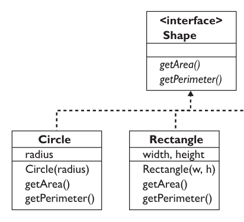

خب فهمدیدیم که interface چیست. حالا بیاد دید کاربرد آن چیست و کجاها استفاده می شود؟

### کاربردهای interface

1. اینترفیس مثل یک قرارداد یا پروتکل عمل می‌کند. در واقع یک ساختار و پروتوتایپ ارائه می‌دهد که کلاس‌های مرتبط با آن باید آن‌ها را داشته باشند. با این حال، هر کدام می‌توانند پیاده‌سازی مخصوص خودشان را ارائه دهند. به همین دلیل دسترسی بسیار مناسبی برای polymorphism فراهم می‌کند، چون هر کلاسی که اینترفیس را پیاده‌سازی می‌کند می‌تواند پیاده‌سازی منحصر‌به‌فرد خودش را برای متدهای آن اینترفیس داشته باشد. همچنین این ویژگی امکان انعطاف‌پذیری بیشتری را در طراحی سیستم‌ها فراهم می‌کند.
2.  با تعریف یک interface، جزئیات پیاده‌سازی و کد ارائه نمی‌شود و صرفاً یک قالب در اختیار قرار می‌گیرد.
3. مهم‌تر از همه، **چندگانه بودن وراثت (multiple inheritance)** در استفاده از اینترفیس‌هاست. اینترفیس‌ها این امکان را فراهم می‌کنند که یک کلاس بتواند همزمان از چندین اینترفیس پیروی کرده و آن‌ها را implement کند، اما در عین حال فقط می‌تواند یک کلاس را extend کند.
4. همچنین استفاده از اینترفیس‌ها باعث کاهش وابستگی بین کلاس‌ها می‌شود، زیرا دیگر کلاس‌ها به جزئیات پیاده‌سازی یکدیگر وابسته نیستند. این موضوع می‌تواند منجر به کدهای تمیزتر و قابل نگهداری تر شود.
5.  اینترفیس‌ها معمولاً برای جداسازی مسئولیت‌ها استفاده می‌شوند. به جای اینکه یک کلاس تمام رفتارها و ویژگی‌ها را در خود داشته باشد، اینترفیس‌ها امکان تقسیم مسئولیت‌ها را فراهم می‌کنند و این موضوع باعث می‌شود کدها قابل تست‌تر و نگهداری آن‌ها آسان‌تر شود.

حالا یک سوالی که پیش می آید این است که خب چرا اصلاً Abstract Class وجود دارد وقتی که اینترفیس می‌تواند تقریباً همان کار را انجام بدهد؟ چرا فقط یکی از این دو را نداریم؟ برای جواب دادن به این سوال، باید تفاوت‌ها را بررسی کنیم. چون که این دو، برای اهداف متفاوتی طراحی شدند و نمیتوانند کاملا جایگزین همدیگه بشوند.

## مقایسه interfaces و abstract classes

کلاس abstract برای ساختارهای سلسله‌مراتبی (Hierarchy) که اشتراکات زیادی دارند، مناسب است. در مقابل، اینترفیس برای قراردادهای عمومی بین کلاس‌های نامرتبط استفاده می‌شود.

| Interface | Abstract Class |
|----------|----------------|
| Interface can have only **abstract methods**. | Abstract class can have **abstract and non-abstract methods**. |
| Interface **supports multiple inheritance**. | Abstract class **doesn't support multiple inheritance**. |
| Interface has **only static and final variables**. | Abstract class can have **final, non-final, static, and non-static variables**. |


همونطور که در جدول بالا میبینید، اینترفیس‌ها و کلاس‌های abstract تفاوت‌های ملموسی دارند.

به جز تفاوت در نحوه وراثت و ارث‌بری، اینترفیس‌ها برخلاف کلاس‌های abstract، فقط میتوانند فیلدهای static و final داشته باشند. یعنی اینترفیس‌ها، متغیر نمونه (instance variable) ندارند و فقط درصورتی میتوانند فیلد داشته باشند که مقدارش ثابت و static باشد.

یک فیلد مثل سن در یک اینترفیس‌ فقط میتواند به قالب زیر تعریف بشود:

```java
public static final int age = 20;
```

این محدودیت به دلایل زیر به وجود آمده است:

- **اینترفیس‌ها برای «تعریف رفتار» ساخته شدند، نه "نگه‌داری وضعیت":**

اینترفیس‌ها یک قرارداد (Contract) برای کلاس‌های پیاده‌سازشون ارائه می‌کنند و نباید شامل وضعیت (State) یا داده‌های متغیر باشند. در اینترفیس‌ها، تمرکز بر روی متدهاست، نه متغیرهای نمونه . اگر اینترفیس‌ها اجازه‌ی داشتن متغیرهای نمونه رو داشتند، در عمل شبیه به کلاس‌های abstract می‌شدند که خلاف فلسفه‌ی اینترفیس است.

- **اینترفیس‌ها نباید وابستگی به مقدارهای متغیر داشته باشند:**

اگر اینترفیس‌ها میتونستند متغیر نمونه داشته باشند، هر کلاس پیاده‌سازشون باید این مقدار رو مدیریت می‌کرد که باعث نقض استقلال اینترفیس می‌شد.

- **جلوگیری از مشکل «وراثت چندگانه» و «داده‌ی متناقض»:**

اگر اینترفیس‌ها متغیرهای نمونه داشتند، مشکل تناقض داده‌ها به وجود می‌آمد. مثالی رو در نظر بگیرید که تو اون، یه کلاس دو تا اینترفیس رو پیاده‌سازی میکنه که هر کدوم دارای یه فیلد با نام یکسان هستند ولی مقادیر متفاوتی دارن.

یه نکته قابل توجه دیگه، این است که اینترفیس بر خلاف class abstract کانستراکتور ندارد.

**خب حالا که فهمیدیم این دوتا واقعا متفاوت اند و اینکه علت تفاوت چیست، میخواهیم ببینیم که کجا و چرا باید از کدام ساختار استفاده کنیم.**

| Abstract class                                                                                                                                                                                                                                                     | Interface                                                                                                                                                     |
| ------------------------------------------------------------------------------------------------------------------------------------------------------------------------------------------------------------------------------------------------------------------ | ------------------------------------------------------------------------------------------------------------------------------------------------------------- |
| اگر فقط به یک لایه وراثت نیاز دارید و مشخص است که کلاس‌های فرزند شباهت‌های زیادی در پیاده‌سازی بین خودشون دارن، یک کلاس abstract می‌تونه مناسب‌تر باشد.                                                                                                            | اگر نیاز دارید یک کلاس از چند منبع مختلف ویژگی‌هایی دریافت کنه، اینترفیس‌ها گزینه بهتری هستند.                                                                |
| اگر برخی متدها باید در همه‌ی کلاس‌های فرزند یکسان باشند و نمی‌خواهید کد تکراری بنویسید، کلاس abstract بهتره.                                                                                                                                                       | اگر فقط می‌خواید یک قرارداد تعیین کنید که همه‌ی کلاس‌ها موظف باشند متدهایی رو پیاده‌سازی کنند و لزوما این پیاده‌سازی‌ها شبیه هم نیستن، اینترفیس گزینه بهتریه. |
| اگر کلاس باید مقادیر پیش‌فرض یا داده‌ای رو تو خودش نگه داره، class abstract بهتره.<br><br>مزیت کلاس‌های abstract اینه که میتونیم هم متغیرهای مشترک و هم متدهای مشترک با سوپرکلاس رو تعریف کنیم و در صورت نیاز به تغییر پیاده سازی در یک کلاس فرزند، override کنیم. | اگر فقط متدهای مورد نیاز رو تعریف می‌کنید و هیچ داده‌ و فیلدی در کلاس پایه نیاز ندارید(نیاز به متغیرهای نمونه ندارید) اینترفیس بهترین انتخابه.                |

### Multiple inheritance by Interfaces

حالا میخواهیم یک مثال را بررسی کنیم که یک کلاس، چند تا اینترفیس مختلف را implement میکند:

تصور کنید یک شرکت فناوری قصد دارد یک ربات چندمنظوره بسازد که بتواند:

1.  پرواز کند (مثل یک پهپاد)
2.  شنا کند (مثل یک زیردریایی)
3.  صحبت کند و ارتباط برقرار کند (مانند یک دستیار هوشمند)

هر یک از این قابلیت‌ها شامل چندین رفتار است. ما این قابلیت‌ها را به‌عنوان اینترفیس‌ها تعریف می‌کنیم تا ربات بتواند از اونا به‌صورت ارث‌بری چندگانه استفاده کند:

```java
// interface for flying feature
interface Flyable {
    void fly();         // start flyting
    void adjustAltitude(int height); // adjusting height if flying
    void land();        // start landing
}

// interface for swim feature
interface Swimmable {
    void swim();        // start swimming
    void adjustDepth(int depth); // adjusting depth of swim
    void stopSwimming(); // stopping the swimming process
}

// interface for speaking feature
interface Speakable {
    void speak(String message); // speaking
    void setLanguage(String language); // changing the language
    void processCommand(String command); // processing voice commands
}

package Robot;
import java.lang.String;

// The class which implements 3 interfaces
class SmartRobot implements Flyable, Swimmable, Speakable {

    private int altitude;
    private int depth;
    private String language;
    public SmartRobot(int altitude, int depth, String language){
        this.depth = depth;
        this.altitude = altitude;
        this.language = language;  
    }

    //implementing fly methods
    @Override
    public void fly() {  
        System.out.println("Robot is flying ...");  
    }

    @Override
    public void adjustAltitude(int height) {
        this.altitude = height;  
        System.out.println("Height has been set to " + height + " meters.");  
    }

    @Override
    public void land() {
        this.altitude = 0;  
        System.out.println("Robot has landed successfully");  
    }

    // implementing swim methods
    @Override
    public void swim() {  
        System.out.println("Robot is swimming");  
    }

    @Override
    public void adjustDepth(int depth) {
        this.depth = depth;  
        System.out.println("Depth has been set to" + depth + " meters");  
    }

    @Override
    public void stopSwimming() {  
        System.out.println("Robot stopped swimming successfully");  
    }

    // implementing speak methods
    @Override
    public void speak(String message) {  
        System.out.println("Robot says: " + message);  
    }

    @Override
    public void setLanguage(String language) {
        this.language = language;  
        System.out.println("Language has been change into " + language);  
    }

    @Override
    public void processCommand(String command) {  
        System.out.println("Processing the command: " + command);  
    }  
}
```

تو این مثال من همه بخش هارو پشت هم نوشتم ولی در اصل بهتره هر اینترفیس و کلاس رو تو یه فایل جداگانه تعریف کنید.

### بعضی اینترفیس‌های مهم در جاوا

خیلی از کلاس‌های موجود در لایبرری‌های جاوا، همزمان یک سوپرکلاس را extend کرده و یک یا بعضا چند اینترفیس را implement میکنند. برای مثال می توان به کلاس `PrintStream` اشاره کرد ( کلاسی که `system.out` یک نمونه (instance) از آن است). این کلاس به این صورت تعریف می شود:

```java
public class PrintStream extends FilterOutputStream implements Appendable, closeable {

}
```

یک دسته اینترفیس مهم دیگه هم که جاوا در اختیارتون میگذاره، اینترفیس‌های `List`، `Map` و `set` هستند که توسط پکیج `java.util` ارائه می شوند و با implement کردن آنها میتوانید ساختمان داده‌هایی را توصیف کنید که به کمک آنها مجموعه‌ای از آبجکت‌ها را ذخیره کنید.

## Annotation در جاوا

توی قسمت‌های قبل دیدید که در یک Subclass، وقتی می‌خواهیم یک متد از کلاس parent را بازنویسی کنیم بالای آن عبارت `@Override` نوشته می‌شود. مثلا:

```java
class Animal {
    void makeSound() {  
        System.out.println("What?");  
    }  
}  
  
class Cat extends Animal {
    @Override
    void makeSound() {  
        System.out.println("Meow!");  
    }  
}
```

به این عبارت `@Override` و کلاً هر عبارتی در جاوا که با `@` شروع بشود، یک Annotation (یادداشت) گفته می‌شود. البته این موضوع بسیار مفصل است و ما به یک معرفی کوتاه از این ابزار بسنده می‌کنیم تا کارکرد این عبارت را در کدهامون بفهمیم.

### چطور در کد با کامپایلر صحبت کنیم؟

ما قبلاً درباره‌ی این موضوع صحبت کرده‌ایم و بارها دیده‌ایم که گاهی لازم است چیزهایی را برای سایر برنامه‌نویس‌هایی که بعداً سراغ کد ما می‌آیند بنویسیم و به جا بگذاریم. یکی از گزینه‌های ما برای این کار، استفاده از کامنت است. کامنت‌ها خطوطی از کد هستند که کامپایلر از آن‌ها با بی‌توجهی عبور می‌کند و این موضوع شرایطی را فراهم می‌کند که ما بتوانیم هر داده‌ای را بدون نگرانی از ایجاد اخلال در اجرای کد، کامنت کنیم.
حال فرض کنید هدف ما دقیقاً برعکس باشد؛ ما می‌خواهیم دستورالعمل یا یادداشتی بنویسیم که در واقع بخشی از کد نیست، اما می‌خواهیم کامپایلر آن را ببیند تا خواسته‌ی ما را متوجه شود. در اینجا دو سؤال مطرح می‌شود: این کار چرا به نیاز برنامه‌نویس‌ها تبدیل شده است و چگونه می‌توان آن را انجام داد؟
برای رسیدن به پاسخ سؤال اول، به مثالی که مطرح می‌کنم توجه کنید:

فرض کنید یک پروژه‌ی بزرگ وجود دارد که شما بخشی از کد آن را قبلاً نوشته‌اید و دیگران تا این لحظه از متد یا کلاسی که شما نوشته‌اید استفاده کرده‌اند. حالا شما یا کارفرمایتان متوجه می‌شوید که بخشی از کد شما یک مشکل بزرگ ایجاد می‌کند و باید از پروژه حذف شود. اگر شما جای چنین فردی باشید چه کاری انجام می‌دهید؟ احتمالاً آن قسمت از کد (برای مثال یک کلاس) را از سورس پاک می‌کنید، درست است؟
با این حال، احتمالاً این انتخاب چندان مناسبی نیست. مهم‌ترین دلیل این است که افراد دیگری از این کلاس شما در بخش‌های دیگر پروژه استفاده کرده‌اند. یعنی قسمت‌هایی از این پروژه وجود دارد که بدون وجود کد شما نباید وجود داشته باشند. بنابراین وقتی شما کلاس خود را پاک کنید، احتمالاً اجرای کل پروژه با مشکل مواجه می‌شود. آیا راهکار بهتری وجود دارد؟

```java
public class Main {
    public static void main(String[] args) {  
        Animal animal = new Animal();  
        animal.makeSound();  
    }  
}  
  
@Deprecated  
class Animal {
    void makeSound() {  
        System.out.println("What?");  
    }  
}
```

کد بالا را در اینتلیجی کپی کنید. این کد بدون مشکل اجرا می‌شود و نتیجه هم مطابق انتظاره. حالا از منوی اینتلیجی، روی قسمت Build برید و گزینه‌ی Rebuild را بزنید. بعد هم از بین آیکون‌های پایین سمت چپ روی آیکون چکش بزنید. همچین چیزی می‌بینید:

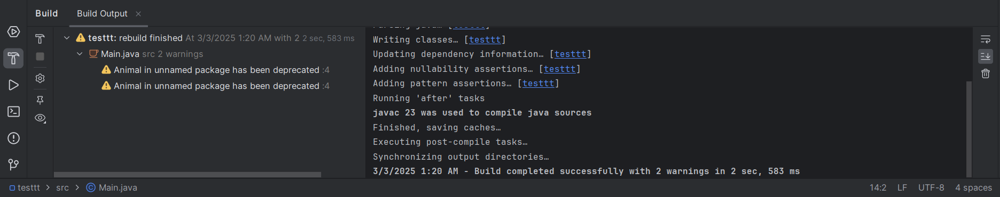

اینجا هشدارهای کامپایلر جاوا (Warnings) به شما نشون داده می‌شود. اگه هشدار رو بخوانید می‌بینید که کامپایلر به ما گفته که کلاس `Animal` منسوخ (Deprecate) شده و نی شود ازش استفاده کرد. حدس می‌زنید دلیل این هشدار چیه؟ بله، اگه به کد نگاه بندازید عبارت `@Deprecated`را بالای کلاس `Animal` می‌بینید. این دقیقا دستورالعملیه که شما به کامپایلر دادید تا کلاس `Animal` را غیرقابل‌استفاده بداند. و کامپایلر به محض اینکه استفاده‌ی ما از این کلاس را در کد می‌بیند، به ما هشدار می‌دهد.

### @Override در ارث‌بری

در کدهای قبلی این داک بالای متدهایی که از کلاس مادر بازنویسی شدن، عبارت `@Override` را دیدید. حالا که یک آشنایی کلی با مفهوم Annotation ها داشتید، فکر می‌کنید کاربرد این Annotation چیست؟

```java
class Animal {
    void makeSound() {  
        System.out.println("What?");  
    }  
}  
  
class Cat extends Animal{
    @Override
    void makeSound() {  
        System.out.println("Meow!");  
    }  
}
```

همونطور که می‌بینید متد `makeSound` توی کلاس `Cat` بازنویسی شده و عملکرد متفاوتی داره. حالا همین کد رو بدون عبارت `@Override` بنویسید. همونطور که می‌بینید جاوا هیچ وارنینگی به شما نمی‌ده. پس نوشتن این Annotation بالای یک متد بازنویسی شده به‌نظر ضروری نیست. اما خب، حتماً دلیلی هست که اینتلیجی کاملاً مصرانه اونو بالای متدهای Overriden می‌نویسه :) . اون دلیل چیه؟

```java
class Cat extends Animal{
    @Override
    void makeLoudSound() {  
        System.out.println("Meeeeeeeeeeeeeoooooooooow!");  
    }
    void makeQuietSound(){  
        System.out.println("Meow!");  
    }  
}
```

متدهای کلاس `Cat` را مطابق بالا تغییر می‌دهیم. حالا سعی کنید کد را اجرا کنید. این بار، برخلاف مثال قبل، کامپایلر حتی به هشدار هم قانع نیست و با شدت جلوی اجرای برنامه را می‌گیرد و به ما اعلام می‌کند که «بالای متد makeLoudSound از @Override استفاده کرده‌اید، اما من هیچ متدی با این نام در کلاس مادر پیدا نکردم».
در واقع، در ابعاد بزرگ، استفاده از @Override برای متدهای بازنویسی‌شده کار بسیار مناسبی است؛ زیرا در صورت ایجاد هر تغییری در متد اورراید شده یا در متد موجود در کلاس مادر، این هشدار از طرف کامپایلر به ما داده می‌شود که اگر قصد تغییر این متد را دارید، توجه داشته باشید که این متد اورراید شده است یا متدی از روی آن اورراید شده است.

.
### ما با Annotationها چیکار می‌کنیم؟

واقعیت اینه که مفهوم annotation توی زبون‌های مختلف و توی زبان جاوا، دنیای گسترده‌ای از کاربردهاست؛ ولی تمرکز رو اون‌ها پیشرفته‌تر از اهداف این درسه. پس اگه کمی قضیه براتون جا نیفتاده نگران نباشید؛ همین که الان می‌دونید Annotationها چه چیزی هستن و از همه مهم‌تر، `@Override` که قراره زیاد تو کدهاتون استفاده‌ش کنید چیکار می‌کنه، کافیه.

توی جاوا می‌تونید Annotation خودتون هم درست مثل یک کلاس یا اینترفیس تعریف کنید، می‌تونید به Annotation ها ورودی بدید، می‌تونید به انواع اون‌ها توی یک کلاس به‌صورت آرایه و یا به پارامترهاشون دسترسی داشته باشید و کلی کار بامزه‌ی دیگه که البته از چارچوب درس خارجن. بنابراین اگه دوست داشتید این لینک‌ها برای مطالعه‌ی بیشتر خوبن:

[Java Annotations – Jenkov.com](https://jenkov.com/tutorials/java/annotations.html#override)

[Annotation in Java – GeeksForGeeks.ORG](https://www.geeksforgeeks.org/annotations-in-java/)

## inner class ها

از وقتی که با کلاس‌ها آشنا شدید و کار کردید، هر وقت که چند تا کلاس توی یک فایل جاوا داشتیم آن ها را خارج از هم تعریف کردیم. حتی ممکن است برایتان پیش آمده باشد که کلاسی را از داکیومنت درس یا جاهای دیگه، در کلاس `Main` کپی کرده باشید و با ارور جاوا موقع ساختن آبجکت مواجه شده باشید. سوال اینه که آیا این یک قاعده‌ست؟ آیا می‌شود کلاسی رو توی یک کلاس دیگه تعریف کرد؟

پاسخ مثبته. در واقع کلاس‌ها هم مثل متدها و باقی اجزا، می‌تونن هر جایی از کد شما و در هر Scopeای از کد تعریف بشوند. البته همونطور که اول کار گفتم، این موضوع قید و شرط‌هایی هم دارد و سطح دسترسی ما به اون کلاس هم وابسته به جاییه که تعریف شده. جلوتر مثال‌هایی می‌بینیم که بهتر متوجه بشیم.

### کار با inner classها

با یک مثال ساده شروع می‌کنیم:

```java
class Animal {
    public double weight;

    class Brain {
        double volume;
        //More Brain Stuff
    }
    
    public void makeSound(){
    //Code
    }  
}
```

به این قطعه کد نگاه کنید. کلاس `Animal` دارای یک فیلد، یک متد و یک Inner Class یا کلاس درونی است. کلاس `Brain` هم مثل متد و فیلد، جزئی از کلاس `Animal`است. فکر می‌کنید سطح دسترسی ما به کلاس `Brain` چطور باشه؟ (اینجا منظور از سطح دسترسی، اینه که کجاها می‌تونیم ازش استفاده کنیم. البته این مفهوم رو توی جلسات بعدی مفصل‌تر بررسی می‌کنیم.)

تا الان با کلاس‌ها به خوبی کار کردید و می‌دانید که اجزای یک کلاس در حالت کلی به هم دسترسی دارند. یعنی داخل متد `makeSound` می‌شه به راحتی از `weight` استفاده کرد و یا باقی متدهای کلاس `Animal` را صدا زد. این دسترسی مستقیم درباره‌ی کلاس `Brain` هم صدق می‌کند. کد را در اینتلیجی خودتون کپی کنید و دست به کار بشوید. مثلا یک آبجکت از `Brain` به عنوان فیلد کلاس `Animal` بسازید. حالا یک آبجکت `Brain` دیگه در متد `makeSound` بسازید. می‌بینید که جاوا به هیچکدام از این دو آبجکت گیر نمی‌دهد. یعنی می‌شود در هر جایی از کلاس `Animal` یک نمونه از `Brain` ساخت.

```java
class Animal {
    public double weight;  
    Brain exampleField = new Brain();
    class Brain {
        double volume;
        //More Brain Stuff
    }
    public void makeSound(){  
        Brain exampleObject = new Brain();  
    }  
}
```

حالا بنظرتون در بدنه‌ی کلاس `Brain` از چه اجزایی می توان استفاده کرد؟ امتحان کنید. مثلا یک متد موقت در `Brain` بنویسید و `weight` یا `makeSound` را استفاده کنید. باز هم مشکلی نیست، نه؟

```java
class Animal {
    public double weight;

    class Brain {
        double volume;
        double exampleField = weight;
        
        void exampleMethod(){  
            makeSound();  
        }  
  
    }
    public void makeSound(){
        //Code
    }  
}
```

حالا که دست به کد شدید و کمی با کلاس `Animal` و `Brain` کار کردید، احتمالا متوجه شدید که کلاس‌های درونی هم درست مثل باقی اجزای کلاس هستند و در بدنه‌ی کلاس بیرونی‌ دسترسی به آن ها امکان پذیر است.

### مغز؛ درون سر یک جانور

احتمالا تا الان این سوال براتون پیش اومده که اصلا این کلاس‌های درونی به چه درد می‌خورند یا در واقع چه معنی‌ای داره که یک کلاس رو داخل کلاس دیگه تعریف کنیم؟ حق دارید که این سوال رو داشته باشید. اول مثال زیر رو ببینید و بعد با کنار هم گذاشتن هر دو مثال به این سوال جواب می‌دهیم.

```java
class Graph{
    class Vertex{  
        Vertex[] adjacencyList;
        int degree;
        
        //More Vertex Stuff
    }
    class Edge{  
        Vertex start;  
        Vertex end;
        //More Edge Stuff
    }
    
    //More Graph Stuff  
}
```

توی کد بالا، پیاده‌سازی یک کلاس گراف رو می‌بینید که دو کلاس رأس (`Vertex`) و یال (Edge) درون این کلاس قرار گرفته‌اند. به ارتباط این دو کلاس با کلاس گراف فکر کنید. در مثال قبل نیز همین وضعیت برقرار بود. نقطه‌ی اشتراک را مشاهده می‌کنید؟ توضیح می‌دهم.

یکی از دلایلی که جاوا زبان جالبی است (که البته احتمالاً بسیاری از شما مخالفید!) این است که تقریباً هر چیز در آن دارای معناست. همان‌طور که می‌توانیم اهمیت و کارکرد متدها را با توجه به معنای پشت آن‌ها درک کنیم، کلاس‌های درونی نیز چنین وضعیتی دارند. در دنیای واقعی برای ما بدیهی است که مغز یک حیوان، خارج از بدن آن حیوان کارکرد خاصی ندارد. یا در ریاضیات درباره‌ی رئوس و یال‌ها بدون در نظر گرفتن گراف صحبت نمی‌کنیم. در واقع، گاهی در مدل‌سازی‌های خود به‌وسیله‌ی شی‌گرایی، نیاز داریم که یک کلاس فقط و فقط درون یک کلاس دیگر معنا پیدا کند. البته این تنها کاربرد Inner Class نیست، اما دید خوبی به ما می‌دهد که یک کلاس درونی دقیقاً چه مفهومی را منتقل می‌کند.
### Static Inner Class

دیدیم که می‌شود از Inner Class ها در بدنه‌ی کلاسی که آن ها را احاطه کرده، استفاده کرد و آبجکت ساخت و البته توضیح دادیم که خیلی از مواقع به کلاس‌های درونی فقط همونجا نیاز داریم! بیاید پا را فراتر بگذاریم و سعی کنیم در یک کلاس دیگه از Inner Classمون یک آبجکت بسازیم. سعی کنید کد زیر رو اجرا کنید.

```java
class Animal {
    public double weight;
    
    class Brain {
        double volume;
        //More Brain Stuff
    }
    public void makeSound(){
        //Code
    }  
}  
  
class Test{  
    Brain brain = new Brain();  
}
```

به ارور خوردید نه؟ همونطور که تو متن خطا می‌بینید، کامپایلر وقتی به کلاس تست می‌رسه هیچ چیزی به اسم `Brain` پیدا نمی‌کنه. علت این موضوع واضحه و هفته‌ی قبل تو بخش Local Variables درباره‌ش یاد گرفتید. راه حل چیه؟ خب، گفتیم که `Brain` یک عضویه از کلاس `Animal`. پس اگه بخوایم آبجکتی ازش بسازیم، به‌صورت `Animal.Brain` ازش استفاده می‌کنیم. کلاس تست رو به‌صورت زیر تغییر بدید و دوباره اجرا کنید:

```java
class Test{  
    Animal.Brain brain = new Animal.Brain();  
}
```

هنوز هم ارور می‌خوریم! ای بابا، به‌نظر تنها مشکلمون غیرمحلی بودن `Brain` نبود. ارور رو نگاه کنید. ‌می‌گه که کلاس `Animal` جایی که هستیم رو محاصره نکرده! اینجاست که ما برمی‌گردیم پیش کلیدواژه‌ی `static`!

هفته‌ی پیش یاد گرفتید که متد و فیلد استاتیک چه تفاوتی با حالت عادی‌شون دارن! دیدین که مثلا یک متد استاتیک در واقع متعلق به کلاسه نه آبجکت. و می‌شه بیرون از کلاس با استفاده از اسم کلاس صداش زد. از طرفی دیدیم که کلاس‌های درونی رو هم دقیقا همین‌شکلی استفاده می‌کنیم و اون رو متعلق به کلاس بیرونی‌ش می‌دونیم. پس کد زیر با موفقیت اجرا می‌شه:

```java
class Animal {
    public double weight;
    
    static class Brain {
        double volume;
        //More Brain Stuff
    }

    public void makeSound(){
        //Code
    }  
}  
  
class Test{  
    Animal.Brain brain = new Animal.Brain();  
}
```

حالا بر‌می‌گردیم به اول این بخش؛ گفتیم که اگه کلاستون رو توی کلاس `Main` نوشته باشید و بعد توی متد `main` ازش آبجکت ساخته باشید، به ارور برخورد می‌کنید. فکر می‌کنید علتش چیه؟ متد `main` و کلاس شما هر دو عضوی از کلاس `Main` هستن و توی یه سطح قرار دارن، پس چرا به ارور می‌خوریم؟ یک بار دیگه این موضوع رو تست کنید:

```java
public class Main {
    class Animal{
        //Code
    }
    public static void main(String[] args) {  
        Animal animal = new Animal();  
    }  
}
```

این کد رو اجرا کنید و ارورش رو نگاه کنید؛ باز هم همون ارور آخر. پس کلاس `Animal` رو static کنید. می‌بینید که دیگه مشکلی نیست. دلیل این موضوع اینه که متد `main` خودش استاتیکه و هفته‌ی پیش خوندید که متدهای static درون یک کلاس، فقط به اجزایی از کلاس دسترسی دارن که اونا هم static باشن!

پس شما دو زمان نیاز دارید که Static Inner Class بنویسید؛ وقتی که از کلاس درونی‌تون خارج از بلوک خودش استفاده کنید و زمانی که توی یک متد استاتیک از همون بلوک، بخواید از کلاس درونی‌تون نمونه بسازید.

### Anonymous Inner Class

ما بارها درباره‌ی دغدغه‌ی نگه‌داری کد و یا خوانایی و شفافیت اون صحبت کردیم؛ هم تحت‌عنوان کلین کد و هم حین معرفی قابلیت‌های مختلف زبان جاوا. تا اینجا دستتون اومده که رویکرد شی‌گرایانه در برنامه‌نویسی و مخصوصاً توی زبان جاوا، چقدر در راستای همین دغدغه‌هاست. حالا که بحث Inner Class رو باز کردیم، می‌‌خوایم درباره‌ی مشکل مشابهی حرف بزنیم که راه حلش چیزی از خانواده‌ی کلاس‌های درونیه.

#### کلاس‌های کم‌مصرف؛ هیاهو برای هیچ

تا الآن، کلاس‌های مختلفی با هم دیدیم و تعریف کردیم. از روی خیلی از این کلاس‌ها چندین و چند بار تو یک برنامه آبجکت ساختیم اما از بعضی‌ها هم فقط یک بار آبجکت ساخته شد. از طرفی الان که اینترفیس رو یاد گرفتید، ممکنه بارها با این موضوع مواجه بشید که مجبور باشیم از یک اینترفیس تعداد خیلی زیادی کلاس implement کنیم در حالی که از هر کدوم شاید فقط یک نمونه بسازیم! کلاس‌های زیادی تو پروژه‌های ما هستن که کم‌مصرفن. البته اینکه می‌گم کم مصرف، لزوماً به معنای کم‌اهمیتی اون کلاس نیست بلکه واقعا منظور استفاده‌ی کم از اونه! فکر می‌کنید چطور می‌شه این کلاس‌ها رو جمع و جورتر کرد؟ شما قبلاً یک نمونه از این اتفاق رو دیدید، باهاش بارها کار کردید و اتفاقاً درباره‌ش خیلی کنجکاو شدید. پس بیاید تا یکبار برای همیشه همه چیز رو درباره‌ش بفهمیم.

کلاس‌ بی‌نام و نشان

```java
JButton button = new JButton();  
button.addActionListener(new ActionListener() {
    @Override
    public void actionPerformed(ActionEvent e) {  
         
    }  
});
```

این قطعه کد عجیب رو یادتونه؟ الان شباهت‌های زیادی بین این کد و کلاس‌ها می‌بینید. به چیزی که می‌بینید کلاس ناشناس یا Anonymous Class می‌گیم. کلاس‌هایی که اسم ندارن و ازشون فقط یک بار آبجکت ساخته می‌شه! این کلاس‌ها معمولاً زمانی استفاده می‌شن که از یک اینترفیس یا کلاس، چندین و چند کلاس با ویژگی‌های منحصربفرد نیاز داشته باشیم. این کلاس‌ها با الگو و سینتکس زیر نوشته می‌شن:

```java
// Test can be an interface, an abstract class or a regular class
Test test = new Test() {
    void testMethod(){  
        System.out.println("Test");  
    }  
};
```

خط اول دقیقا مشابه با تعریف یک آبجکته. بعد از اون یک بلوک جدید از کد باز می‌شه و درون اون می‌شه فیلدها (در صورتی که Test یک کلاس معمولی باشه) و متدهای مختلفی تعریف و استفاده کرد. بعد از اون می‌شه از آبجکت `test` که از کلاس بدون اسم‌مون ساختیم، استفاده کنیم اما نمی‌تونیم آبجکت جدیدی از این کلاس بسازیم. دقت کنید که این کلاس کاملاً جدی اسم نداره؛ و اون `Testی` که می‌بینید اسم اینترفیسیه که Anonymous Class ما از اون implement شده.

می‌فهمم که کمی گیج شده باشید. پس بذارید با یه مثال همه مشکلاتمونو حل کنیم. خودتونم دست به کد باشید، این مثال رو اجرا کنید و باهاش دست و پنجه نرم کنید:

```java
interface Operator{
    void doOperation(double a, double b);  
}  
  
class add implements Operator{
    @Override
    public void doOperation(double a, double b) {  
        System.out.println(a + b);  
    }  
}  
  
class multiple implements Operator{
    @Override
    public void doOperation(double a, double b) {  
        System.out.println(a * b);  
    }  
}
```

کد بالا یک مثال ساده‌ست. یک اینترفیس به اسم `Operator` داریم که برای انجام عملیات بین دو عدده. از روی این اینترفیس دو کلاس می‌‌سازیم که عملگرهای جمع و ضرب هستن و می‌تونیم چندین عملیات دیگه هم تعریف کنیم. حالا اگه بخوایم از این عملیات‌ها توی کلاس `Main` استفاده کنیم، از هر عملیات فقط یک آبجکت کفایت می‌کنه. این کد رو چطور می‌تونیم با Anonymous Class بازنویسی کنیم؟ اول خودتون بهش فکر کنید و بعد کد پایین رو ببینید:

```java
interface Operator{
    void doOperation(double a, double b);  
}  
public class Main {
    public static void main(String[] args) {  
        Operator add = new Operator() {
            @Override
            public void doOperation(double a, double b) {  
                System.out.println(a + b);  
            }  
        };
        Operator multiple = new Operator() {
            @Override
            public void doOperation(double a, double b) {  
                System.out.println(a * b);  
            }  
        };  
    }  
}
```

اگر هنوز خوب متوجه نشدید، بارها دو تا قطعه کدی که برای این مثال نوشتیم رو نگاه کنید و شباهت‌ها و تفاوت‌هاشون رو مقایسه کنید. این دو تا قطعه‌کد دقیقا یک کار رو با دو رویکرد متفاوت انجام می‌دن.

### بازگشت به گرافیک

حالا که خودمون یک مثال نوشتیم و فهمیدیم که Anonymous Classها چطور کار می‌کنن، بیاید برگردیم عقب و کد گرافیکی‌مون رو رمزگشایی کنیم.

```java
JButton button = new JButton();  
button.addActionListener(new ActionListener() {
    @Override
    public void actionPerformed(ActionEvent e) {  
         
    }  
});
```

توی این کد ما به عنوان ورودی متد `addActionListener`، یک آبجکت بدون اسم از یک کلاس Anonymous می‌دیم! این کلاس از روی اینترفیس `ActionListener` ساخته شده و متد `actionPerformed` از این اینترفیس، بازنویسی می‌شه.

فکر می‌کنید همین کد با همین کارکرد، بدون استفاده از Anonymous Class چطور می‌شد؟

```java
class GUI implements ActionListener{  
    JButton firstButton = new JButton();  
    JButton secondButton = new JButton();
    
    //Code
    @Override
    public void actionPerformed(ActionEvent e) {
        if (e.getSource() == firstButton){
            //Whatever first button do
        }
        else if (e.getSource() == secondButton){
            //Whatever second button do
        }  
    }  
}
```

یک کلاس که اینترفیس `ActionListener` رو implement کرده و داخلش تمام کارهای گرافیکی انجام می‌شه و در انتها متد `actionPerformed` بازنویسی می‌شه. با این تفاوت که در این شکل پیاده‌سازی اکشن تمام دکمه‌ها توی یه متد نوشته می‌شه. پس باید مطابق کد بالا، با استفاده از `if` و متد `getSource` که منشاء کلیک دکمه‌ها رو برمی‌گردونه، این موضوع هندل بشه.

اگه براتون جالبه که می‌شه یک کار یکسان رو با دو رویکرد متفاوت اما قاعد‌ه‌مند و دقیق انجام داد، درباره‌ی Design در برنامه‌نویسی بخونید.

واقعیت اینه که نمی‌شه گفت یکی از این رویکردها درست‌ترن اما هر کدوم مزایای خودشون رو دارن و باید بنا به کارکرد، یکی رو انتخاب کرد.

### منبع برای یادگیری بیشتر

درباره‌ی Anonymous Class ها بیش از این می‌شه حرف زد. درباره‌ی روش‌های مختلف استفاده از اون‌ها، مقایسه‌ی‎‌ اون‌ها با کلاس‌های عادی و غیره. اگه دوست دارید لینک‌های زیر رو نگاه بندازید:

- [Anonymous Inner Class in Java – GeeksForGeeks.org](https://www.geeksforgeeks.org/anonymous-inner-class-java/)

- [Java Anonymous Classes – Baeldung.com](https://www.baeldung.com/java-anonymous-classes)

## Lambda Expression در جاوا

یک راه حل مشابه با Anonymous Inner Class ها برای مشکلی که پیش‌تر مطرح کردیم، یکی از راهکارها استفاده از Lambda Expression‌هاست. لامبداها قطعه‌های کوچک و مختصری از کد هستند که درست مانند یک متد رفتار می‌کنند؛ می‌توانند ورودی بگیرند، عملیاتی را انجام دهند یا یک خروجی برگردانند. با این تفاوت که می‌توان با آن‌ها مانند یک آبجکت رفتار کرد؛ یعنی مثلاً آن‌ها را در یک متغیر ذخیره کرد یا به عنوان ورودی به یک متد دیگر ارسال کرد. در نگاه اول این موضوع ممکن است کمی عجیب به نظر برسد.

در واقع چنین نیست. جاوا معجزه‌ای انجام نداده که بتوانیم یک متد را در یک آبجکت ذخیره کنیم. لامبداها در حقیقت همان Anonymous Class‌هایی هستند که همین حالا با آن‌ها آشنا شده‌ایم؛ با این تفاوت که اینترفیس مورد استفاده‌ی لامبداها فقط یک متد abstract دارد. به چنین اینترفیس‌هایی Functional Interface گفته می‌شود.

همین ویژگی باعث شده است که لامبداها به عنوان یک جایگزین کوتاه‌تر و خواناتر برای Anonymous Class در اینترفیس‌های فانکشنال مورد استفاده قرار بگیرند. حالا که یک دید کلی نسبت به لامبداها دارید، بیایید سراغ نوشتن کد.
```java
interface Operator{
    void doOperation(double a, double b);  
}  
public class Main {
    public static void main(String[] args) {  
  
        Operator add = (double a, double b) -> System.out.println(a + b);  
        add.doOperation(5, 8);  
    }  
}
```

کد بالا دقیقا همون مثالیه که تو بخش قبل به دو شکل مختلف دیدیم. حالا این بار با لامبدا آن را حتی خلاصه‌تر از قبل نوشتیم. اول کد را اجرا کنید و خروجی را ببینید و بعد برگردید تا آن را بررسی کنیم.

شمایل و ساختار کلی لامبدا به شکل زیره:

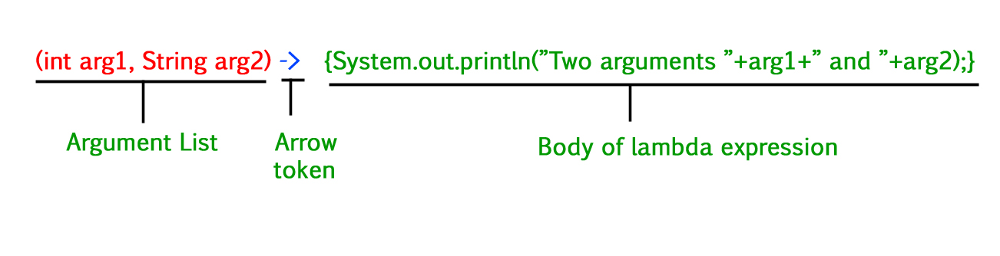

حالا مجددا به کد نگاه کنید. اینترفیس `Operator` فقط یک متد ابسترکت به اسم `doOperation` دارد. یک آبجکت از این اینترفیس می‌نویسیم و یک عبارت لامبدا جلوش می‎‌نویسیم:

```java
Operator add = (double a, double b) -> System.out.println(a + b);
```

این عبارت لامبدا دقیقا به همان تنها متد اینترفیس نسبت داده می‌شود. پس ورودی‌هایی که می‌نویسیم باید مطابق باشند. عبارت بعد از فلش هم دستوری است که می‌خواهیم متد `doOperator` برای `add` انجام بدهد. حالا الان `add`، در واقع یک آبجکت از یک کلاس ناشناس است.

کدی که بالاتر دیدید معادل با کد پایین است:

```java
interface Operator{  
    void doOperation(double a, double b);  
}  
public class Main {  
    public static void main(String[] args) {
    
	    Operator add = new Operator() {  
	        @Override  
	        public void doOperation(double a, double b) {  
	            System.out.println(a + b);  
	        }  
	    };
	    add.doOperation(5, 8);  
    }  
}
```

فراتر از اینکه هر دو کد یک کار رو انجام می‌دهند، فرآِیندی که طی می‌کنند هم یکسان است و کاملاً معادل با یکدیگر هستند.

### چند نکته درباره‌ی lambda expression

- لامبداها فقط مختصرند و کد رو کوتاه‌تر می‌کنند و عملاً تاثیری روی پیچیدگی کدها ندارند. بابت همینه که می‌گیم معادل با استفاده از Anonymous Class ها هستند.
- اگه ورودی‌ای که برای لامبدا می‌نویسیم با ورودی متد ابسترکت در اینترفیس‌مون یکسان نباشد، طبیعتاً به ارور برخورد می‌کنیم. پس این موضوع ضروری است.
- اگه توی اینترفیس، دو یا چند تا متد ابسترکت داشته باشیم، نمی‌توانیم لامبدا بنویسیم و ارور می‌گیریم. همون‌طور که قبلاً هم گفتیم برای اینترفیسی که چند تا ابسترکت متد دارد فقط می‌توانیم از خود Anonymous Class ها استفاده کنیم.
- تاکید می‌کنم که وقتی می‌گیم اینترفیسی که یک متد داره، منظور یک متد ابسترکت است. اگه اینترفیس چند تا متد دیفالت و یک متد ابسترکت داشته باشد، استفاده از لامبدا مشکلی ندارد.
- دستوری که لامبدا به متد ابسترکت نسبت می‌دهد، می‌تواند بیش از یک خط باشد. کافیست تمام دستورها را بعد از فلش و توی یک بلوک `{}` قرار بدهیم.

اگه می‌خواید درباره‌ی لامبدا در جاوا بیشتر بخونید، به [این لینک](https://www.geeksforgeeks.org/lambda-expressions-java-8/) سر بزنید.
