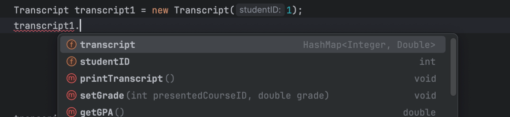
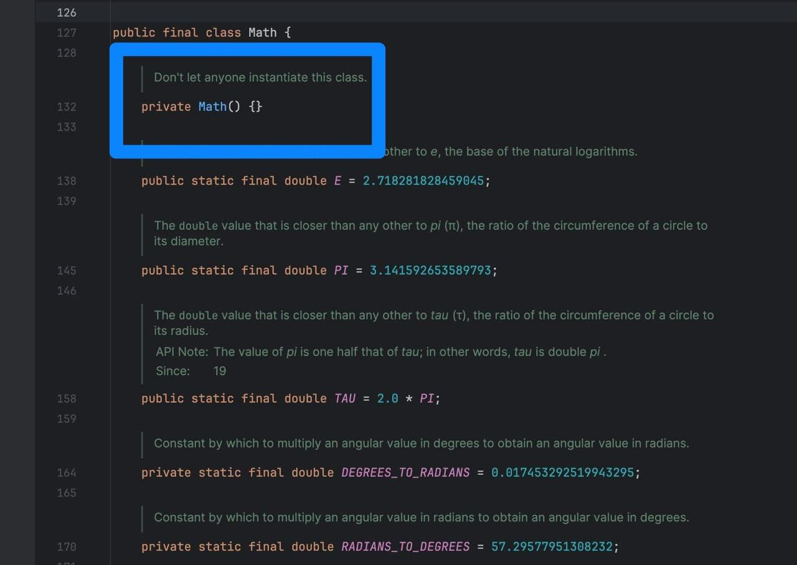
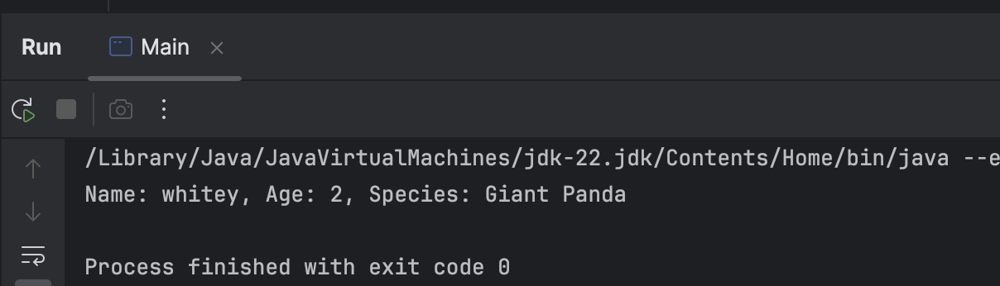

## مقدمه

کپسوله‌سازی (Encapsulation) یکی دیگه از اصول پایه‌ای شی‌گرایی‌ هستش. encapsulation بهتون این قابلیت رو می‌ده که جزئیات پیاده‌سازی‌های شما، یعنی فیلد‌ها، متد‌ها و کلاس‌ها، برای کلاس‌های دیگه اصطلاحاً hide بشه و دسترسی مستقیم وجود نداشته باشه. به عبارتی، encapsulation دیتا و کدی که برای اون نوشتین رو به عنوان یک واحد در نظر می‌گیره که این واحد، همون کلاسی هست که داخلش دارین این‌ها رو تعریف می‌کنین و یکی از feature‌هایی که داره ، hide شدن اون جزئیات کدتونه.

توی این بخش، با اصل encapsulation و متد‌های `getter` و `setter` کامل آشنا می‌شین و آخر سر هم، یه تمرین کارگاه برای encapsulation داریم!

## چرا از Encapsulation استفاده می‌کنیم؟

بذارین با یه مثال شروع کنیم. توی پروژه‌ی شبیه‌ساز دانشگاه، شما قبل فیلد‌ها و متد‌هایی که تعریف میکردین، کلید واژه‌ی public رو قرار می‌دادین. مثلاً داخل کلاس Transcript، فیلد‌ها رو به این صورت تعریف میکردین:

```java
public class Transcript {
    public int studentID;
    public HashMap<Integer, Double> transcript = new HashMap<>();
}
```

این به این معنی هست که وقتی داخل یک کلاس دیگه، مثلا `Main`، آبجکتی از کلاس `Transcript` بسازین، می‌تونین بدون مشکل، تنها با یک dot notation، به فیلد `studentID` دسترسی داشته باشین:



به همین صورت برای متد‌ها هم همین قضیه برقراره. اما اینطوری تعریف کردن فیلد‌هامون، اشکالاتی داره. با یه مثال این مشکل رو بررسی می‌کنیم.

مثلا تصور کنین شما توی `Main`، برای یه دانشجو با یه `studentID` مشخص، یه کارنامه تعریف کردین. حالا، میتونین راحت اون شماره‌ی دانشجویی رو عوض کنین و با این کار، این کارنامه تبدیل به کارنامه‌ی یه شخص دیگه میشه یا اصلا یه شماره‌ی دانشجویی ناموجود رو براش قرار میدین! پس، یعنی اولا که کنترل کمتری روی داده‌ها و متد‌ها دارین خصوصا اگر بخواین محدودیتی (مثلا مقداری که میتونه اون فیلد بگیره) روی فیلد‌هاتون بذارین. دوما که دسترسی به این فیلد‌ها و متد‌های public توی کلاس‌های دیگه باعث میشه که به راحتی بشه مقدار اون‌ها رو عوض کرد.

اینجاست که encapsulation ظاهر می‌شه. این اصل، یه خاصیت داره و اونم اینه که وضعیت داخلی آبجکت‌ها، مثلا فیلدهاشون رو، hide می‌کنه. به این خاصیت encapsulation، اصطلاحاً data hiding می‌گن. نترسین! توی قالب کد همه رو می‌بینیم.

## چطور در کد از Encapsulation استفاده کنیم؟

تا الان، شماها می‌دونین قالب کلی یک کلاس و نحوه‌ی تعریف کردن و ساختنش چطوریه. حالا، می‌خوایم ببینیم چطوری data hiding رو می‌تونیم اعمال کنیم.

### کلیدواژه‌ی `private`

فرض کنین می‌خوایم یه باغ وحش رو شبیه سازی کنیم. یه کلاس به اسم `Zoo` تعریف می‌کنیم و این فیلد‌ها رو توش تعریف می‌کنیم (سعی کنید که از این‌جا به بعد تمام کدها را خودتان هم اجرا کنید.):

```java
public class Zoo {
    private String name;
    private ArrayList<Animal> animals;
    
    public Zoo(){  
    }  
}
```

حالا یه کلاس `Main` تعریف کنین و یه آبجکت از کلاس `Zoo` بسازین و به صورت زیر فیلد `name` رو بهش مقدار بدین:

```java
public class Main {  
    public static void main(String[] args) {  
        Zoo zoo = new Zoo();  
        zoo.name = "Woodland Park Zoo" ;  
    }  
}
```

به ارور خوردین! تازه جالب‌تر هم می‌شه. وقتی خودتون بخواین بعد اسم آبجکت `zoo` یک نقطه بذارین و dot notation بزنین، intellisense اصلا حتی این فیلد رو بهتون پیشنهاد نمی‌ده؛ یه دور امتحان کنین!

یه سوال، به نظرتون توی وراثت، وقتی کلاس پدر یه فیلد private داره، داستان چطوریه؟

فرقی نداره! فیلد‌های private توی یک کلاس، **حتی داخل** کلاس‌های فرزندش هم به صورت مستقیم در دسترس نیستن و نمی‌شه صداشون زد!

خب تکلیف متد‌های private چیه؟ اونا هم دقیقا قضیه‌شون مشابه فیلد‌هاست. متد‌های private یک کلاس داخل یک کلاس دیگه، حتی داخل کلاس‌های فرزندش، قابل دسترسی نیستن! بچه‌ها حواستون باشه که این متد‌ها و فیلد‌های private، داخل کلاس خودشون قابل دسترسی هستن.

حالا، می‌دونیم که یه دسته‌ی خاص از متد‌ها توی هر کلاسی، constructor‌ ها هستن. به نظرتون می‌شه این متد‌ها رو هم private کرد؟

جواب آره‌ست؛ خصوصاً وقتی بخواین آبجکت ساختن از کلاستون رو محدود کنین. به طبع نمی‌تونین با این constructor آبجکت بسازین. یه مثال خیلی خوبش، کلاس `Math` خود جاوا‌ ست که constructor اش private هستش و آبجکتی ازش ساخته نمی‌شه و همه‌ی متد‌هاش هم static هستن! داخل Intellij این کلاس رو `import` کنین و بعد روی `Math` کلیک راست کنین و از طریق go to، گزینه‌ی Declaration or usages رو انتخاب کنین تا به سورس کلاس برسین؛ حالا به این توجه کنین:



توی این‌جا یه چیز جالب دیگه هم داریم؛ `final class`! قبلاً با کلیدواژه‌ی `final` آشنا شدین. حالا وقتی این keyword رو برای یک کلاس میاریم، به این معنی هستش که اون کلاس دیگه قابل ارث‌بری نیستش!

راستی اگر هم روزی روزگاری بخواین از کلاسی که constructor اش private هست، آبجکت بسازین، اولا باید حتماً داخل همون کلاس آبجکت بسازین ؛ دوما نیاز دارین که یا داخل یه متد دیگه‌ای این کار رو انجام بدین یا از تابع `getInstance()` استفاده کنین. برای توضیحات بیش‌تر این مورد می‌تونین [این ویدیو‌ی کوتاه](https://youtu.be/yU3YWjXLm2k?si=w_jvTKO8MOzYd8u2) رو ببینین.

حالا یه سوالی که مطرح می‌شه اینه که آیا کلاس‌ها هم می‌تونن private باشن؟

به طور کلی، آره. اما نه هر کلاسی! فقط وقتی دارین nested class تعریف می‌کنین، فقط inner class‌ هاتون می‌تونن private باشن و دسترسی بهش هم فقط داخل outer class ممکنه. همچنین امکان ارث‌بری ازشون هم وجود نداره؛ مثل final class‌ ها! درضمن outer class‌ هاتون نمی‌تونن private باشن. زمانی هم که مثلا ۳تا nested class دارین ( که به طبع بیرونی ترینشون می‌شه outer class)، هم می‌تونین هردوتا inner class رو private کنین هم یکیشون رو. زمانی هم که کلاس عادی دارین، کلا private کردنش بی معنیه، چون علناً دارین استفاده از اون کلاس رو غیرممکن می‌کنین.

خب، تبریک می‌گم، شما تونستین data hiding انجام بدین. اما سوالی که مطرح می‌شه اینه که چطوری به این. متد‌ها و فیلد‌های private دسترسی داشته باشیم؟ هربار بریم دوباره اون فیلد، متد و ... رو public کنیم و اصطلاحا صورت مسئله رو پاک کنیم؟قطعاً نه!

برای دسترسی و تغییر فیلد‌‌های private به ترتیب از متد‌های getter و setter استفاده می‌کنیم.

### متدهای getter

خیلی خلاصه، متد‌های getter مقدار فیلد private رو برمی‌گردونن؛ درواقع اسمشون هم همین معنی رو می‌ده(getter). موقع پیاده‌سازی هم برای اینکه معلوم باشه یک متد، getter هستش، اسمش رو با get شروع میکنیم.خب، وقتشه بریم سراغ کد.

لطفا اول کلاس `Animal` رو به این صورت تعریف کنین و برایش متد‌های getter قرار بدین:

```java
import java.util.ArrayList;
public class Animal {
    private String name;
    private int age;
    private String species;

    public Animal(String name, int age, String species) {
        this.name = name;
        this.age = age;
        this.species = species;
    }
    public String getName() {
        return name;
    }
    public String getSpecies() {
        return species;
    }
    public int getAge() {
        return age;
    }
    @Override
    public String toString() {
        return "Name: " + name + ", Age: " + age + ", Species: " + species;
    }
}
```

یه سوال، چرا متد `toString()`رو override کردیم؟ توی بخش‌های قبلی دیدین که وقتی با متد `toString()` کلاس `Object`، آبجکت یه کلاسی که نوشتین رو چاپ می‌کنین، خروجیتون چطوریه. حالا برای اینکه بتونین اطلاعات قابل خوندن و مورد نیاز از آبجکتتون رو به شکل درست چاپ کنین، کافیه این متد رو override کنین و اونطوری که می‌خواین، خروجی رو برگردونین. مثلاً، داخل کلاس `Main` یه آبجکت از این کلاس بسازین و `toString()` رو واسش کال کنین و پرینت کنین؛ خروجی همچین چیزیه:


کلاس `Panda` هم به عنوان فرزندش تعریف کنین و متد‌های getter رو بذارین:

```java
public class Panda extends Animal {
    private String whatTheyEat;
    private int numberOfChildren;

    public Panda(String name, int age, String species, String whatTheyEat, int numberOfChildren) {
        super(name, age, species);
        this.whatTheyEat = whatTheyEat;
        this.numberOfChildren = numberOfChildren;
    }
    public int getNumberOfChildren() {
        return numberOfChildren;
    }
    public String getWhatTheyEat() {
        return whatTheyEat;
    }
}
```

حالا، داخل کلاس `Main` کد زیر رو بنویسین و ران کنین:

```java
    public static void main(String[] args) {
        Panda panda = new Panda("whitey", 2, "Giant Panda", "Bambo", 0) ;
        System.out.println(panda.getName());
        System.out.println(panda.getAge());
        System.out.println(panda.getSpecies());
        System.out.println(panda.getWhatTheyEat());
        System.out.println(panda.getNumberOfChildren());
    }
```

خب، همه‌ی اطلاعات واستون چاپ شد!

تمام متد‌هایی که توی کلاس `Animal` و `Panda` با get شروع می‌شن، getter هامون هستن که به درستی دارن مقدار فیلد‌های آبجکت `panda` رو برمی‌گردونن. یه نکته‌ی ریزی هم این وسط بود، اونم این که آبجکت `panda` تونست از getter های کلاس والدش، مثلا `getName()` استفاده کنه؛ پس getter‌ ها هم مثل متد‌های عادی ارث‌بری می‌شن، راحت‌تر بگیم، فرقی با متد عادی ندارن، صرفاً وظیفه‌شون برگردوندن مقدار این فیلد‌هاست.

### متدهای setter‌

وظیفه‌ی این متد‌ها، مقداردهی و آپدیت کردن/تغییر دادن مقدار فیلد‌های private هستش. نکته‌ی مهم پشت منطق استفاده از setter اینه که شما سطح دسترسی فیلدتون رو محدود کردین تا مقدارش رو هرکس و هرجایی نتونه عوض کنه. پس منطقا باید داخل این دسته از متد‌ها، یه شرطی برای بررسی valid بودن اون مقداری که می‌خواین ست کنین، قرار بدین. موقع پیاده‌سازی هم برای اینکه معلوم باشه یک متد، setter هستش، اسمش رو با set شروع می‌کنیم.

حالا به کلاس `Animal` این متد‌های setter رو اضافه کنین:

```java
public void setSpecies(String species) {
        this.species = species;
}
public void setAge(int age) {
    if(age>=0)
        this.age = age;
    else{
        System.out.println("Age can't be negative");
    }
}
public void setName(String name) {
    if(Character.isUpperCase(name.charAt(0)))
        this.name = name;
    else{
        System.out.println("Name should start with an upper-case letter");
    }
}
```

و کلاس `Panda` رو هم به این صورت تغییر بدین و متد‌های setter رو اضافه کنین:

```java
public void setNumberOfChildren(int numberOfChildren) {
    if(numberOfChildren>=0)
        this.numberOfChildren = numberOfChildren;
    else{
        System.out.println("Number of children can't be negative");
    }
}
public void setWhatTheyEat(String whatTheyEat) {
    this.whatTheyEat = whatTheyEat;
}
```

و این قسمت رو به کلاس `Main` اضافه کنین و نتیجه رو ببینین.

```java
        System.out.println("----------------------------");
        panda.setName("cutie");
        panda.setAge(1);
        panda.setSpecies("Red Panda");
        panda.setWhatTheyEat("mushrooms");
        panda.setNumberOfChildren(1);
        System.out.println(panda.getName());
        System.out.println(panda.getAge());
        System.out.println(panda.getSpecies());
        System.out.println(panda.getWhatTheyEat());
        System.out.println(panda.getNumberOfChildren());
```

### کلیدواژه‌ی protected

این keyword به این صورته که اگر مثلاً فیلدی رو protected تعریف کنیم، فقط کلاس‌های فرزندش و همون پکیج بهش دسترسی دارن، ولی بقیه‌ی کلاس‌ها، دسترسی ندارن و باید از getter برای دسترسی و setter برای تغییر دادنش استفاده کنن. به عبارتی، یه چیزی بین public و private ‍ه. شما فهمیدین وقتی یه فیلد یا متد private باشه، حتی بچه‌هاش هم به اون دسترسی نخواهند داشت. برای اینکه این مشکل حل بشه، از protected استفاده می‌کنیم.

حالا کلاس `Animal` رو به این صورت تعریفش کنین:

```java
import java.util.ArrayList;
public class Animal {
    protected String name;
    protected int age;
    protected String species;

    public Animal(String name, int age, String species) {
        this.name = name;
        this.age = age;
        this.species = species;
    }
    @Override
    public String toString() {
        return "Name: " + name + ", Age: " + age + ", Species: " + species;
    }
}
```

کلاس `Panda` به این شکل تغییرش بدین:

```java
public class Panda extends Animal {
    protected String whatTheyEat;
    protected int numberOfChildren;
    public Panda(String name, int age, String species, String whatTheyEat, int numberOfChildren) {
        super(name, age, species);
        this.whatTheyEat = whatTheyEat;
        this.numberOfChildren = numberOfChildren;
    }
    public void show(){
        System.out.println(super.name);
        System.out.println(super.age);
        System.out.println(super.species);
        System.out.println(this.whatTheyEat);
        System.out.println(this.numberOfChildren);
    }
}
```

خب، حالا بریم توی `Main`.

```java
import java.util.ArrayList;  
import java.lang.*;  
public class Main {    public static void main(String[] args) {  
        Panda panda = new Panda("whitey", 2, "Giant Panda", "Bambo", 0) ;  
        panda.show();  
    }  
}
```

می‌بینین که مشکلی پیش نیومد و خروجی گرفتین، چرا؟ گفتیم که فيلد‌های protected در کلاس فرزند قابل دسترسی هستن و پوینت ما هم اینجا نشون دادن این قضیه بود! برای اینکه تفاوتش با private رو با قشنگ ببینین، یه دور توی کلاس `Animal` همه‌ی فیلد‌ها رو private کنین و بعد ران بگیرین.

خب، متد‌های protected چی؟ اونا هم عین فیلد‌ها هستن؛ و فرزند‌های یک کلاس و کلاس‌های داخل یک پکیج، بهش دسترسی دارن.

خب، به نظرتون constructor‌ های protected قراره چطوری رفتار کنن؟ رفتارشون کاملا مشابه متد‌های protected ‍ه. یه دور روی همین کد امتحان کنین تا ببینین!

سوالی که ایجاد می‌شه اینه که تکلیف کلاس‌های protected چیه؟ خب، یه چیزی شبیه کلاس private ‍ه! شما فقط زمانی می‌تونین کلاس protected داشته باشین که nested class دارین و فقط می‌تونین inner class‌ ها رو protected تعریف کنین. این کلاس‌ها قابل ارث‌بری هستن ! همچنین، از طریق کلاسی که داخل همون پکیج باشه و یا کلاس‌های فرزندش، می‌تونین به این inner class‌های protected دسترسی داشته باشین.

### package-private‌

وقتی شما صراحتاً مشخص نکنین که فیلدها، متدها یا کلاس ‌هاتون public یا private یا protected هستن، اصطلاحاً میگن default access هستن؛ و package-private‌ ها در واقع default access modifier هستن. این به معنیه که این فیلد، کلاس و متد‌ها فقط توی همون پکیج قابل دسترسی‌ان. بریم سر کدش.

یه پکیج به اسم zoo بسازین و به ترتیب، کلاس‌های `Zoo`، `Animal`، `Panda` و `Main` رو به این صورت تعریف کنین:

```java
package zoo;
import java.util.ArrayList;
public class Zoo {
     String name;
     ArrayList<Animal> animals;

    public Zoo(){
    }
}

package zoo;
import java.util.ArrayList;
public class Animal {
     String name;
     int age;
     String species;

    public Animal(String name, int age, String species) {
        this.name = name;
        this.age = age;
        this.species = species;
    }
    @Override
    public String toString() {
        return "Name: " + name + ", Age: " + age + ", Species: " + species;
    }
}
```

خب با مشکل قاعدتا مواجه شدین. علتش اینه که کلاس `Main` داخل پکیج `zoo` نيستش. حالا یه دور کلاس `Main` رو هم به پکیج `zoo` اضافه کنین نتیجه رو ببینین. این دفعه خروجی گرفتین و خب، این دقیقا مفهوم package-private هستش!

رفتار متد‌ها و کلاس‌ها هم توی package-private‌ها، مشابه فیلد‌هاست.

## چه چیزی یاد گرفتیم؟

با خوندن این داکیومنت، فهمیدیم:

- کپسوله‌سازی (یا encapsulation) چه چیزی هست و چرا استفاده می‌شه.
- کلید‌واژه‌های `private` و `protected` و `public` و مفهوم package-private چه فرقی دارن.
- متد‌های getter و setter چی هستن.