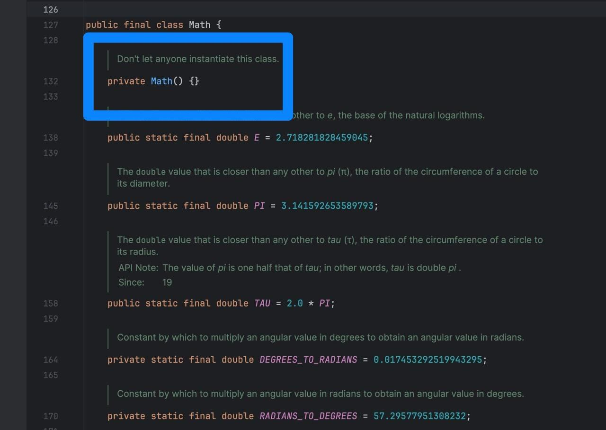
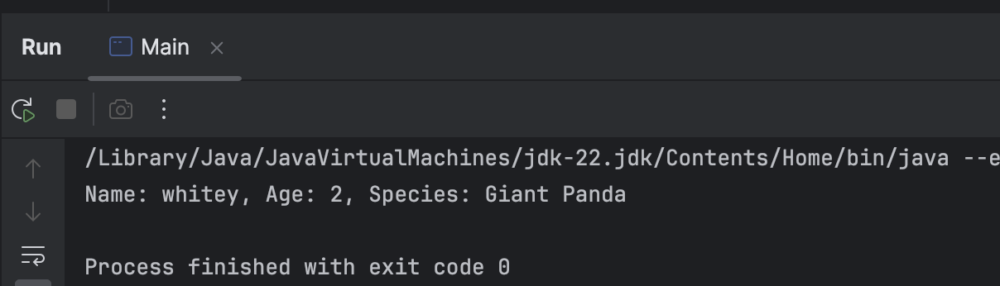

## مقدمه

کپسوله‌سازی (Encapsulation) یکی دیگر از اصول بنیادین شی‌گرایی است. این مفهوم امکان پنهان‌سازی جزئیات پیاده‌سازی، شامل فیلدها، متدها و کلاس‌ها را از دید سایر کلاس‌ها فراهم می‌سازد. به بیان دیگر، کپسوله‌سازی داده و کد مربوط به آن را به‌عنوان یک واحد منسجم در نظر می‌گیرد که همان کلاس تعریف‌شده است و یکی از ویژگی‌های آن، پنهان‌سازی جزئیات پیاده‌سازی می‌باشد.

در این بخش، با اصل کپسوله‌سازی و متدهای `getter` و `setter` به‌طور کامل آشنا خواهید شد.

## چرا از Encapsulation استفاده می‌کنیم؟

برای روشن‌تر شدن موضوع، با یک مثال آغاز می‌کنیم. در تمرین کارگاه 5، پیش‌تر برای تعریف فیلدها و متدها از کلیدواژه `public` استفاده می‌کردید. برای نمونه، در کلاس Person فیلدها به صورت زیر تعریف می‌شدند:

```java
public class Person {
    public String name;
    public String nationalID;
    public String phoneNumber;
    public static int totalPersons;
    
}
```

این شیوه بدین معناست که در کلاسی دیگر، برای مثال `Main` ، می‌توان با ساختن نمونه‌ای از کلاس `Person` و تنها با استفاده از عملگر نقطه به فیلد `nationalID` دسترسی داشت، یعنی اگر آبجکتی از جنس `Person` به نام `ali` داشتیم کافیست با `ali.nationalID` به فیلد کد ملی `ali` دسترسی پیدا کرد. دقیقاً همین وضعیت برای متدها نیز برقرار است. اما این گونه تعریف فیلدها اشکالاتی به همراه دارد. برای نمونه، فرض کنید در `Main` شخصی با یک کد ملی مشخص تعریف نموده‌اید که یکتا است و همچنین آن شخص دارای شماره تلفنی نیز هست. اکنون به‌سادگی می‌توانید کد ملی را مستقیما داخل `Main` تغییر دهید، در نتیجه شماره تلفن که برای فرد دیگری بوده حال برای کسی با کد ملی متفاوتی تعلق می‌گیرد یا حتی یک کد ملی نامعتبر برای آن درج می‌شود. بنابراین، دسترسی آزاد به این فیلدها و متدهای `public` در کلاس‌های دیگر، امکان تغییر آسان مقادیر آن‌ها را فراهم می‌سازد که میتواند موجب به آلوده شدن دیتا شما (کد ملی نامعتبر) یا حتی نادرست شدن دیتا شما شود (کد ملی شخصی دیگر برای یک شماره تلفن).

برای همین اصل کپسوله‌سازی مطرح می‌شود. این اصل دارای خاصیتی است که وضعیت درونی اشیاء، مانند فیلدهایشان، را پنهان می‌کند. به این ویژگی، اصطلاحاً پنهان‌سازی داده (Data Hiding) گفته می‌شود. در ادامه، با بررسی کد، این مفاهیم ملموس‌تر خواهند شد.

## چطور در کد از Encapsulation استفاده کنیم؟

تاکنون با ساختار کلی یک کلاس و روش تعریف و ساخت آن آشنا شده‌اید. اکنون چگونگی اعمال پنهان‌سازی داده را بررسی می‌کنیم.

### کلیدواژه `private`

فرض کنید قصد شبیه‌سازی یک باغ وحش را داریم. کلاسی به نام `Zoo` تعریف می‌کنیم و فیلدهای زیر را در آن قرار می‌دهیم (توصیه می‌شود تمام کدها را خود نیز اجرا کنید):

```java
public class Zoo {
    private String name;
    private ArrayList<Animal> animals;
    
    public Zoo(){  
    }  
}
```

اکنون کلاس `Main` را تعریف کرده و نمونه‌ای از کلاس `Zoo` می‌سازیم. تلاش می‌کنیم فیلد `name` را مقداردهی کنیم:

```java
public class Main {  
    public static void main(String[] args) {  
        Zoo zoo = new Zoo();  
        zoo.name = "Woodland Park Zoo" ;  
    }  
}
```

با خطا مواجه می‌شوید. جالب‌تر آنکه حتی پس از درج نقطه در کنار نام شی `zoo` ، IDE این فیلد را در فهرست پیشنهادی خود نمایش نمی‌دهد.

در رابطه با وراثت، وقتی کلاس والد یک فیلد `private` دارد، وضعیت چگونه است؟

تفاوتی ندارد؛ فیلدهای `private` حتی در کلاس‌های فرزند نیز به‌صورت مستقیم قابل دسترسی نیستند و نمی‌توان آن‌ها را فراخوانی نمود. متدهای `private` نیز دقیقاً همین وضعیت را دارند. این متدها و فیلدها تنها در درون کلاس خود قابل دسترسی هستند اما در کلاس فرزند غیرقابل دسترسی.

گروه خاصی از متدها، سازنده‌ها (Constructors) هستند. آیا می‌توان کانستراکتورها را نیز `private` تعریف کرد؟

پاسخ مثبت است؛ به‌ویژه زمانی که بخواهیم ساخت نمونه از کلاس را محدود نماییم. بدیهی است که با چنین کانستراکتوری نمی‌توان نمونه‌ای ساخت. یک مثال عالی، کلاس `Math` در جاوا است که کانستراکتوری `private` دارد و تمامی متدهای آن `static` هستند. می‌توانید در IntelliJ این کلاس را import کرده، بر روی `Math` راست‌کلیک نموده و از طریق go to ، گزینه Declaration or usages را انتخاب کنید تا به سورس کلاس دست یابید:



نکته جالب دیگر، `final class` است. وقتی این کلیدواژه برای یک کلاس به کار می‌رود، بدین معناست که آن کلاس دیگر قابلیت ارث‌بری ندارد.

اگر زمانی نیاز به ساخت نمونه از کلاسی با کانستراکتور `private` داشته باشید، اولاً باید حتماً در داخل همان کلاس نمونه را بسازید؛ ثانیاً یا باید این کار را از طریق متدی دیگر انجام دهید یا از تابع `getInstance()` استفاده کنید. تابع `getInstance()` روشی برای پیاده‌سازی الگوی Singleton است. در این الگو، کلاس تنها یک نمونه از خود می‌سازد و دسترسی به آن را از طریق همین تابع فراهم می‌کند. `getInstance()` بررسی می‌کند که آیا نمونه‌ای از کلاس از پیش ساخته شده یا خیر؛ اگر خیر، یک نمونه جدید ایجاد و ذخیره می‌کند و سپس آن را بازمی‌گرداند. بدین ترتیب همواره تنها یک شی از آن کلاس در سراسر برنامه وجود خواهد داشت.
توجه شد که منظور از الگوی Singleton این است که این الگو اطمینان می‌دهد که از یک کلاس تنها یک نمونه در سراسر برنامه وجود داشته باشد و دسترسی سراسری به آن فراهم گردد دقیقا کاری که تابع `getInstance()` محقق میکند.

حال این پرسش مطرح می‌شود که آیا کلاس‌ها نیز می‌توانند `private` باشند؟

به‌طور کلی، بله. اما نه هر کلاسی. تنها زمانی که کلاس‌های تودرتو (nested) تعریف می‌کنید، inner class ها می‌توانند `private` باشند و دسترسی به آن‌ها صرفاً از طریق outer class ممکن است. همچنین امکان ارث‌بری از این کلاس‌ها وجود ندارد (مانند final class ها). افزون بر این، outer class ها نمی‌توانند `private` باشند. در مواردی که برای مثال سه کلاس تودرتو دارید (بیرونی‌ترین آن‌ها outer class است)،  می‌توانید هر دو یا یکی از inner class ها را `private` نمایید. تعریف کلاس معمولی به‌صورت `private` بی‌معناست، زیرا عملاً استفاده از آن کلاس را غیرممکن می‌سازد. توجه کنید که جاوا به ما اجازه ساخت کلاس داخل یک کلاس را میدهد که به این کار nested class گفته میشه یا به فارسی کلاس های تودرتو میگویند.
برای درک بهتر محدودیت‌های سطوح دسترسی در کلاس‌های تودرتو (nested) و نحوه نوشتن آن، مثال زیر را در نظر بگیرید:

```java
public class Zoo {                     // outer class, cannot be private
    private String name;
    
    private class AnimalCensus {       // inner class, can be private or public
        private int count;
        void increment() { count++; }
    }
    
    public class Exhibit {             // inner class, can be private or public
        public String exhibitName;
    }
}
```

در این ساختار، outer class (`Zoo`) همواره باید `public` یا package-private باشد و نمی‌توان آن را `private` تعریف کرد. در مقابل، inner class ها می‌توانند `private` (مانند `AnimalCensus`) یا `public` (مانند `Exhibit`) باشند. کلاس `AnimalCensus` فقط در درون `Zoo` قابل استفاده است، درحالی‌که `Exhibit` از بیرون نیز در دسترس خواهد بود.

با انجام این مراحل، شما پنهان‌سازی داده را محقق ساخته‌اید. اما پرسش اساسی این است که چگونه می‌توان به این متدها یا فیلدهای `private` دسترسی داشت؟ آیا هر بار باید آن‌ها را مجدداً `public` کنیم و صورت مسئله را پاک کنیم؟ قطعاً خیر.

برای دسترسی و تغییر فیلدهای `private` از متدهای getter و setter استفاده می‌شود.

### متدهای getter

به‌طور خلاصه، متدهای getter مقدار یک فیلد `private` را بازمی‌گردانند. برای مشخص‌سازی یک متد به‌عنوان getter ، نام آن با `get` آغاز می‌شود. اکنون به کد مربوطه می‌پردازیم.

ابتدا کلاس `Animal` را به‌صورت زیر تعریف کنید و متدهای getter را برای آن قرار دهید:

```java
import java.util.ArrayList;
public class Animal {
    private String name;
    private int age;
    private String species;

    public Animal(String name, int age, String species) {
        this.name = name;
        this.age = age;
        this.species = species;
    }
    public String getName() {
        return name;
    }
    public String getSpecies() {
        return species;
    }
    public int getAge() {
        return age;
    }
    @Override
    public String toString() {
        return "Name: " + name + ", Age: " + age + ", Species: " + species;
    }
}
```

چرا متد `toString()` را override می‌کنیم؟ هنگام استفاده از متد `toString()` کلاس `Object` برای چاپ یک شی، خروجی نامناسبی تولید می‌شود. برای چاپ اطلاعات خوانا و مورد نیاز، کافی است این متد را بازنویسی کرده و خروجی مطلوب را برگردانیم. برای مثال در کلاس `Main` یک شی از این کلاس بسازید و `toString()` را فراخوانی و چاپ کنید؛ خروجی به شکل زیر خواهد بود:



در ادامه کلاس `Panda` را نیز به‌عنوان فرزند تعریف کرده و متدهای getter را در آن قرار دهید:

```java
public class Panda extends Animal {
    private String whatTheyEat;
    private int numberOfChildren;

    public Panda(String name, int age, String species, String whatTheyEat, int numberOfChildren) {
        super(name, age, species);
        this.whatTheyEat = whatTheyEat;
        this.numberOfChildren = numberOfChildren;
    }
    public int getNumberOfChildren() {
        return numberOfChildren;
    }
    public String getWhatTheyEat() {
        return whatTheyEat;
    }
}
```

اکنون در کلاس `Main` کد زیر را بنویسید و اجرا کنید:

```java
    public static void main(String[] args) {
        Panda panda = new Panda("whitey", 2, "Giant Panda", "Bambo", 0) ;
        System.out.println(panda.getName());
        System.out.println(panda.getAge());
        System.out.println(panda.getSpecies());
        System.out.println(panda.getWhatTheyEat());
        System.out.println(panda.getNumberOfChildren());
    }
```

تمامی اطلاعات چاپ می‌شود.

تمامی متدهایی که در کلاس‌های `Animal` و `Panda` با `get` شروع می‌شوند، getter های ما هستند و همان‌گونه که انتظار می‌رود، مقادیر فیلدهای شی `panda` را برمی‌گردانند. نکته ظریف این است که شی `panda` توانست از getter های کلاس والد، برای مثال `getName()` استفاده کند؛ بنابراین getter ها نیز همانند متدهای معمولی به ارث می‌رسند و تنها وظیفه آن‌ها برگرداندن مقدار فیلدهاست.

### متدهای setter

وظیفه این متدها مقداردهی و به‌روزرسانی یا تغییر مقدار فیلدهای `private` است. نکته کلیدی در منطق استفاده از setter آن است که با کاهش سطح دسترسی به فیلد، از تغییر مقدار آن توسط هر بخشی از کد جلوگیری می‌شود. بنابراین ضروری است که در این متدها شرطی برای بررسی معتبر بودن مقدار ورودی قرار داده شود. نام این متدها نیز با `set` آغاز می‌شود.

در ادامه، متدهای setter را به کلاس `Animal` اضافه کنید:

```java
public void setSpecies(String species) {
        this.species = species;
}
public void setAge(int age) {
    if(age>=0)
        this.age = age;
    else{
        System.out.println("Age can't be negative");
    }
}
public void setName(String name) {
    if(Character.isUpperCase(name.charAt(0)))
        this.name = name;
    else{
        System.out.println("Name should start with an upper-case letter");
    }
}
```

و کلاس `Panda` را نیز به شکل زیر تغییر داده و متدهای setter را اضافه نمایید:

```java
public void setNumberOfChildren(int numberOfChildren) {
    if(numberOfChildren>=0)
        this.numberOfChildren = numberOfChildren;
    else{
        System.out.println("Number of children can't be negative");
    }
}
public void setWhatTheyEat(String whatTheyEat) {
    this.whatTheyEat = whatTheyEat;
}
```

این قسمت را نیز به کلاس `Main` اضافه کرده و نتیجه را مشاهده کنید:

```java
        System.out.println("----------------------------");
        panda.setName("cutie");
        panda.setAge(1);
        panda.setSpecies("Red Panda");
        panda.setWhatTheyEat("mushrooms");
        panda.setNumberOfChildren(1);
        System.out.println(panda.getName());
        System.out.println(panda.getAge());
        System.out.println(panda.getSpecies());
        System.out.println(panda.getWhatTheyEat());
        System.out.println(panda.getNumberOfChildren());
```

شاید این پرسش برای شما مطرح شود که با وجود متدهای getter و setter ، کماکان امکان تغییر فیلدها وجود دارد؛ بنابراین چه تفاوتی با حالت `public` بودن آن‌ها دارد؟
تفاوت اساسی در این است که getter و setter یک لایه کنترلی بر روی دسترسی ایجاد می‌کنند: در setter می‌توان پیش از مقداردهی، اعتبارسنجی انجام داد یا از تغییر مقدارهای نامعتبر جلوگیری کرد. همچنین اگر فقط getter تعریف شود، فیلد صرفاً خواندنی (read-only) خواهد بود که در صورت نیاز آن را برای افراد با صلاحیت مشخصی نشان میتوان داد (مانند ادمین های یک سایت). افزون بر این، پیاده‌سازی درونی کلاس می‌تواند تغییر کند بی‌آنکه کدهای بیرونی متأثر شوند. در نتیجه، دسترسی به داده‌ها اگرچه میسر است، اما کاملاً تحت نظارت کلاس خواهد بود.
همچنین در بسیاری از موارد، تمامی فیلدهای `private` نیازی به متدهای getter و setter ندارند. برای مثال، فرض کنید در کلاس `Zoo` فیلدی به نام `animalCount` به‌صورت `private` تعریف شده که صرفاً برای ردیابی داخلی تعداد حیوانات به‌کار می‌رود:

```java
public class Zoo {
    private String name;
    private ArrayList<Animal> animals;
    private int animalCount;

    public Zoo() {
        animals = new ArrayList<>();
        animalCount = 0;
    }

    public void addAnimal(Animal a) {
        animals.add(a);
        animalCount++;
    }
}
```

در اینجا، تغییر `animalCount` منحصراً از طریق متد `addAnimal` انجام می‌شود و هیچ کلاس بیرونی نباید مستقیماً آن را بخواند یا تغییر دهد. ارائه getter یا setter برای چنین فیلدی نه‌تنها ضرورتی ندارد، بلکه می‌تواند کپسوله‌سازی را تضعیف کند و امکان دستکاری ناخواسته در وضعیت درونی شی را فراهم آورد. بنابراین، تنها فیلدهایی به getter و setter مجهز می‌شوند که واقعاً نیاز به دسترسی کنترل‌شده از بیرون داشته باشند. پس در برنامه های جاوا همواره نیازی به متد های setter و getter برای تمامی فیلد های پرایوت نیست.

### کلیدواژه protected

اگر فیلدی را `protected` تعریف کنیم، تنها کلاس‌های فرزند و کلاس‌های درون همان پکیج به آن دسترسی دارند. سایر کلاس‌ها برای دسترسی باید از getter و برای تغییر از setter استفاده کنند. به عبارت دیگر، سطح دسترسی `protected` میان `public` و `private` قرار می‌گیرد. همان‌طور که پیش‌تر بیان شد، فیلد یا متد `private` حتی در کلاس‌های فرزند نیز قابل دسترسی نیست. با استفاده از `protected` این محدودیت برطرف می‌شود.

اکنون کلاس `Animal` را به صورت زیر تعریف کنید:

```java
import java.util.ArrayList;
public class Animal {
    protected String name;
    protected int age;
    protected String species;

    public Animal(String name, int age, String species) {
        this.name = name;
        this.age = age;
        this.species = species;
    }
    @Override
    public String toString() {
        return "Name: " + name + ", Age: " + age + ", Species: " + species;
    }
}
```

کلاس `Panda` نیز به شکل زیر تغییر می‌یابد:

```java
public class Panda extends Animal {
    protected String whatTheyEat;
    protected int numberOfChildren;
    public Panda(String name, int age, String species, String whatTheyEat, int numberOfChildren) {
        super(name, age, species);
        this.whatTheyEat = whatTheyEat;
        this.numberOfChildren = numberOfChildren;
    }
    public void show(){
        System.out.println(super.name);
        System.out.println(super.age);
        System.out.println(super.species);
        System.out.println(this.whatTheyEat);
        System.out.println(this.numberOfChildren);
    }
}
```

سپس در `Main` کد زیر را قرار دهید:

```java
import java.util.ArrayList;  
import java.lang.*;  
public class Main {    
    public static void main(String[] args) {  
        Panda panda = new Panda("whitey", 2, "Giant Panda", "Bambo", 0) ;  
        panda.show();  
    }  
}
```

همان‌طور که ملاحظه می‌کنید، برنامه بدون مشکل اجرا می‌شود. دلیل آن است که فیلدهای `protected` در کلاس فرزند قابل دسترسی هستند. برای مشاهدۀ تفاوت آن با `private`، می‌توانید در کلاس `Animal` تمامی فیلدها را `private` کرده و نتیجه را بررسی کنید.

رفتار متدهای `protected` نیز مشابه فیلدها است؛ کلاس‌های فرزند و کلاس‌های یک پکیج به آن‌ها دسترسی دارند. در مورد سازنده‌های `protected` نیز عملکردی کاملاً هم‌سان با متدهای `protected` وجود دارد.

پرسشی که مطرح می‌شود این است که تکلیف کلاس‌های `protected` چیست؟ وضعیتی مشابه کلاس‌های `private` دارند. تنها زمانی می‌توان کلاس `protected` داشت که کلاس‌های تودرتو تعریف شده باشند و صرفاً inner class ها را بتوان `protected` نمود. این کلاس‌ها قابلیت ارث‌بری دارند و از طریق کلاس‌های درون همان پکیج یا کلاس‌های فرزند می‌توان به آن‌ها دسترسی داشت.

### package-private

وقتی سطح دسترسی فیلد، متد یا کلاس را صریحاً مشخص نکنیم (به‌کار نبردن `public`، `private` یا `protected` )، سطح دسترسی پیش‌فرض (default access) یا همان package-private اعمال می‌شود. در این حالت، آن عضو تنها در درون همان پکیج قابل دسترسی است.

برای نمونه، یک پکیج به نام `zoo` ایجاد کرده و به‌ترتیب کلاس‌های `Zoo` ، `Animal` ، `Panda` و `Main` را به‌صورت زیر تعریف کنید:

```java
package zoo;
import java.util.ArrayList;
public class Zoo {
     String name;
     ArrayList<Animal> animals;

    public Zoo(){
    }
}

package zoo;
import java.util.ArrayList;
public class Animal {
     String name;
     int age;
     String species;

    public Animal(String name, int age, String species) {
        this.name = name;
        this.age = age;
        this.species = species;
    }
    @Override
    public String toString() {
        return "Name: " + name + ", Age: " + age + ", Species: " + species;
    }
}
```

با این کار، احتمالاً با خطا مواجه می‌شوید. دلیل آن است که کلاس `Main` درون پکیج `zoo` قرار ندارد. چنانچه کلاس `Main` را نیز به این پکیج منتقل کنید و نتیجه را بررسی نمایید، خواهید دید که خروجی مورد انتظار حاصل می‌شود. این دقیقاً مفهوم package-private است.

رفتار متدها و کلاس‌ها در سطح دسترسی package-private نیز مشابه فیلدها می‌باشد.
درباره تفاوت میان package-private و protected میتوان گفت این تفاوت در گستره دسترسی آن‌هاست: سطح دسترسی پیش‌فرض (package-private) عضوی را تنها برای کلاس‌های درون همان بسته قابل مشاهده می‌سازد. اما protected علاوه بر همان بسته، آن عضو را در تمام کلاس‌های فرزند نیز (حتی اگر در بسته‌ای دیگر تعریف شده باشند) در دسترس قرار می‌دهد. به‌بیان دیگر، protected یک پل ارتباطی میان وراثت و بسته ایجاد می‌کند، حال آنکه package-private صرفاً محدود به مرز بسته است.

## چه چیزی یاد گرفتیم؟

با مطالعه این مستند، با موارد زیر آشنا شدیم:

- مفهوم کپسوله‌سازی (Encapsulation) و دلیل استفاده از آن.
- تفاوت کلیدواژه‌های `private` ، `protected` ، `public` و مفهوم package-private .
- چیستی و کاربرد متدهای getter و setter .
