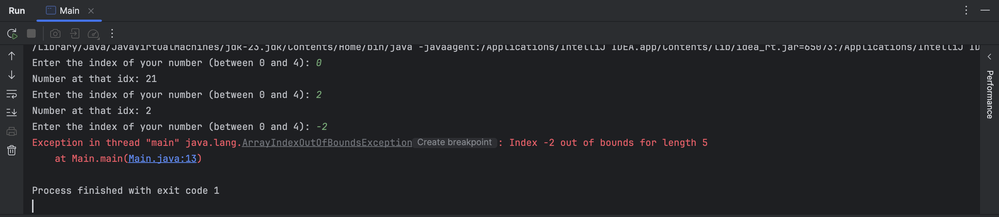
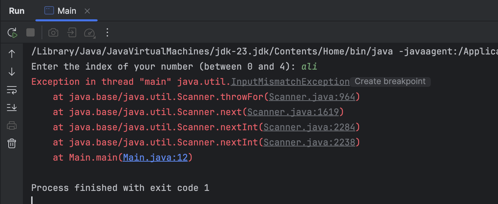
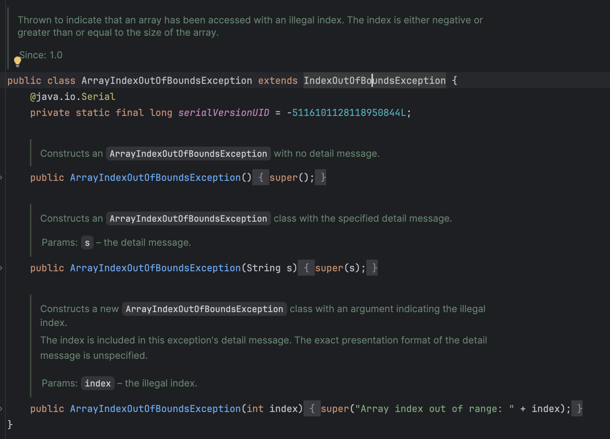
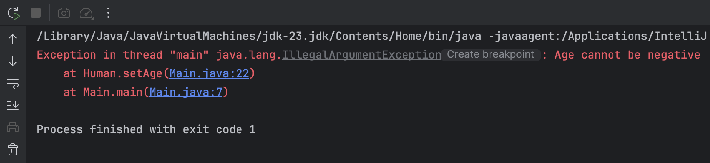
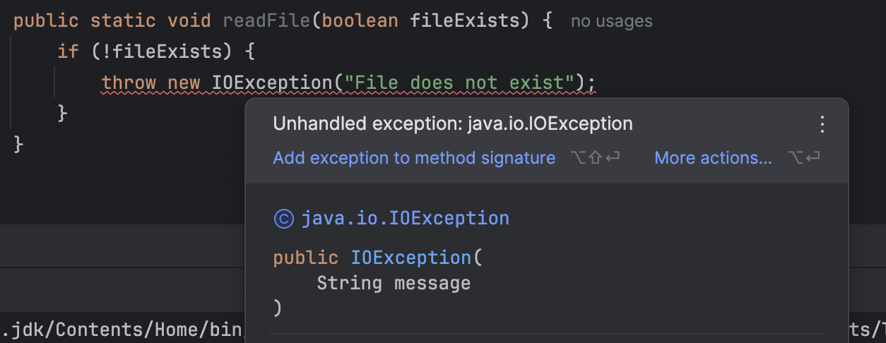
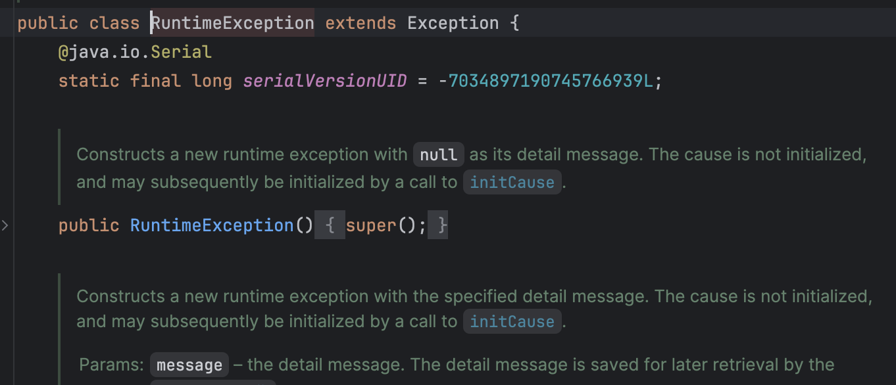
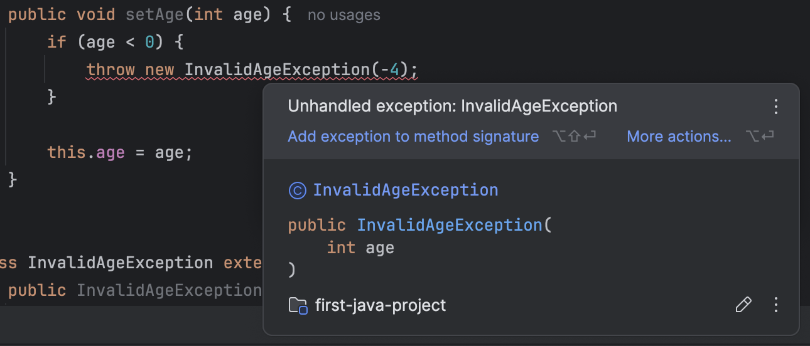
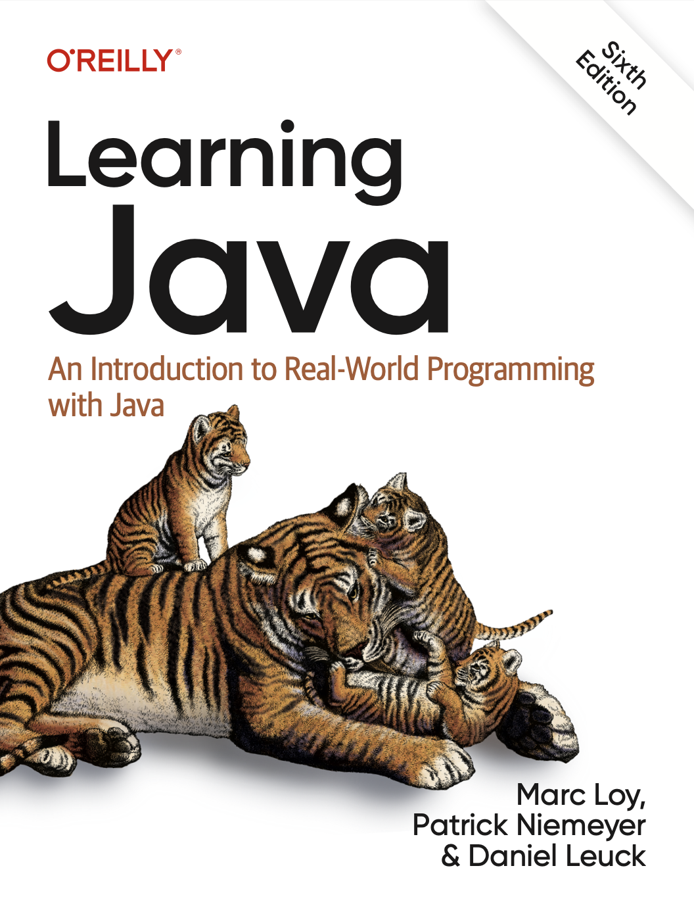

## مقدمه

یکی از مفاهیم مهم در زبان جاوا، مفهوم Exception Handling است. « Exception » در زبان انگلیسی به معنای «استثناء» است و شرایط استثنایی در جاوا، شرایطی است که برنامه‌ی شما به خطا می خورد. در زبان جاوا، Exception (استثنا) رویدادی است که در حین اجرای برنامه (Runtime) رخ می‌دهد و جریان عادی اجرای دستورات را متوقف می‌کند ولی جاوا به شما این امکان را می‌ دهد که به جای crash کردن برنامه موقع به وجود اومدن خطا، خودتون به شکلی دیگر با خطای به وجود امده برخورد کنید.

خطاها همیشه نباید به crash منجر شوند . برای مثال اگر شما توی Google باشین، نمی‌خواهید به محض این که یکی از کاربرها در refresh کردن gmail خود به خطا خورد، تمام سرورهای gmail برای همه‌ی کاربرها crash کند. این‌جاست که مدیریت خطاهای سیستم و Exception Handling بسیار مهم می شوند.

## Exception ها

در ادامه میخواهیم موقعیت هایی را بررسی کنیم که برنامه شما مممکن است با یک Exception مواجه شود.
برنامه‌ی زیر رو توی جاوا اجرا کنید:

```java
import java.util.Scanner;

public class Main {
    public static void main(String[] args) {  
        Scanner scanner = new Scanner(System.in);

        int[] arr = {21, 11, 2, 5, 98};

        while (true) {  
            System.out.print("Enter the index of your number (between 0 and 4): ");
            var idx = scanner.nextInt();  
  
            System.out.println("Number at that idx: " + arr[idx]);  
        }  
    }  
}
```

این برنامه، یه عدد به اسم ‍ از کاربر می‌گیرد و `arr[idx]` را خروجی می‌دهد. مثلاً، یه نمونه از اجرای این برنامه به شکل زیر است:

```text
Enter the index of your number (between 0 and 4): 0  
Number at that idx: 21  
Enter the index of your number (between 0 and 4): 2  
Number at that idx: 2
```

چه اتفاقی می افتد اگر کاربر عددی خارج از بازه‌ی ۰ تا ۴ را وارد کند؟ همون‌طور که خودتان می‌دانید، به یک خطا می‌خوریم:



به متن این خطا توجه کنید:

```text
Exception in thread "main" java.lang.ArrayIndexOutOfBoundsException: Index -2 out of bounds for length 5
```

جاوا به شما می‌گوید که یک Exception توی thread ای به اسم `main` رخ داده است. ما هنوز با مفهوم thread آشنا نیستیم، صرفا بدونید که برنامه‌های شما همیشه توی thread ای به اسم `main` اجرا می‌شوند. این خطا همچنین به شما می‌گوید که Exception به وجود امده، از جنس `ArrayIndexOutOfBoundException` است که اسم خیلی دقیقی برای خطای شماست! در ادامه هم یک توضیح برای علت این خطا امده، این که «ایندکس -2، خارج از بازه‌ی ایندکس‌های معقول یک آرایه‌ی ۵تایی است».

در ادامه، حتی گفته شده که این خطا توی دقیقا چه تابعی رخ داده:

```text
at Main.main(Main.java:13)
```

شما می‌توانید بفهمید که این خطا، توی متد `Main.main` ، در خط ۱۳ام فایل `Main.java` رخ داده است.
چند نمونه مختلف از exception هایی که ممکن است با آن مواجه شوید عبارتند از :

- IndexOutOfBoundsException برای زمانی که مشکلی در ایندکس داده شده برای لیست یا آرایه مورد نظر وجود دارد.
- NullPointerException به طور کل وقتی روی یک متغیر که null است متدی را صدا میزنیم.
- ArithmeticException برای خطاهای محاسباتی مثل تقسیم بر صفر.

### بلوک try-catch

همون‌طور که توی مقدمه گفتیم، Exception به معنای اینه که برنامه‌ی شما به خطا خورده است. ولی خطاها، بخشی طبیعی از برنامه‌ی شما هستند. شما نمی‌خواهید هر بار که کاربر، بر حسب اشتباه عددی خارج از بازه‌ی ۰ تا ۴ وارد کرد برنامه‌ی شما با یک خطا crash کند و خارج شود، در عوض می‌خواهید که به کاربر یک پیام مناسب نشان داده شود تا عدد درستی وارد کند. پیامی مثل این:

```text
Please enter a valid index. this index should be between 0 and 4.
```
برای کنترل و مدیریت خطایی که با ان مواجه شده ایم از بلوک try-catch استفاده میکنیم. این بلوک راه حل اصلی جاوا (و بسیاری از زبان‌های برنامه‌نویسی دیگر) برای «مدیریت استثناها» (Exception Handling) است و هدف اصلی ان، جلوگیری از Crash کردن برنامه در هنگام بروز خطا است.
این کار، با کلیدواژه‌های جدیدی به اسم `try` و `catch` ممکن می شود:

```java
try {  
    System.out.print("Enter the index of your number (between 0 and 4): ");
    var idx = scanner.nextInt();  
  
    System.out.println("Number at that idx: " + arr[idx]);  
} catch (ArrayIndexOutOfBoundsException e) {  
    System.out.println("Please enter a valid number. this number should be between 0 and 4.");  
}
```

کلیدواژه‌ی «try»، به معنای تلاش کردن است. در این کد، شما به جاوا می‌گویید که «تلاش کن خطوط بخش try را اجرا کنی، و اگر حین اجرای این خطوط، به Exception ای از جنس `ArrayIndexOutOfBoundsException` برخورد کردی، به جای این که crash کنی و از برنامه خارج شوی، به بخش `catch` برو و کدهای اون بخش رو اجرا کن.» دقت کنید که در پرانتز جلوی `catch` ، ما نوع Exception ای که می‌خواهیم هندل کنیم را، مثل یک تابع، توی پرانتز آورده ایم.

خروجی برنامه‌ی جدید شما به شکل زیر است :

```text
Enter the index of your number (between 0 and 4): 4  
Number at that idx: 98  
Enter the index of your number (between 0 and 4): -2  
Please enter a valid number. this number should be between 0 and 4.  
Enter the index of your number (between 0 and 4): 7  
Please enter a valid number. this number should be between 0 and 4.
```

### catch های متوالی

کاربر حین اجرای برنامه‌ی شما، خطای دیگری هم میتواند ایجاد کند، این که به جای عدد، چیزهای نامربوطی مثل اسم و رشته ورودی بدهد. برنامه را اجرا کنید و به جای عدد، `"ali"` را ورودی دهید تا ببینید چه اتفاقی می‌افتد:



برنامه‌ی شما، یک exception جدید داد. این بار می‌توانید ببینید که این Exception ، از جنس `InputMismatchException` است. شما می‌توانید با اضافه کردن یک `catch` جدید به کدتان، این خطا را هم بهتر مدیریت کنید:

```java
try {  
    System.out.print("Enter the index of your number (between 0 and 4): ");
    var idx = scanner.nextInt();  
  
    System.out.println("Number at that idx: " + arr[idx]);  
} catch (ArrayIndexOutOfBoundsException e) {  
    System.out.println("Please enter a valid number. this number should be between 0 and 4.");  
} catch (InputMismatchException e) {  
    System.out.println("Please enter a valid number.");  
    scanner.nextLine();  
}
```

توی کد بالا، جاوا وقتی به خطایی برخورد میکند، اول چک می‌کند که «آیا این خطا، از نوع `ArrayIndexOutOfBoundsException` که توی catch اول امده هست یا نه؟» و اگر بود، خطوط داخل catch اول رو اجرا می‌کند. اما اگر نبود، به سراغ `catch` بعدی می رود و دوباره چک می کند که «آیا این خطا از جنس `InputMismatchException` هست یا نه؟» و اگر بود، خطوط `catch` بعدی را اجرا می‌کند.

در واقع شما ممکن است چندین `catch` پشت سر هم داشته باشید. در این صورت با به وجود اومدن خطا جاوا به همین ترتیب، از اول تا آخر انها را چک می‌کند و به دستوراتِ داخل اولین `catch` مناسب می‌رود.

خروجی برنامه‌ی جدید شما، به شکل زیر است:

```text
Enter the index of your number (between 0 and 4): 2  
Number at that idx: 2  
Enter the index of your number (between 0 and 4): ali  
Please enter a valid number.  
Enter the index of your number (between 0 and 4): -1  
Please enter a valid number. this number should be between 0 and 4.
```

## کلاس Exception

کلاس Exception در واقع کلاس پایه برای Checked Exception ها است.
اگر دقت کنید، توی هر کدوم از `catch` ها، ما چیزی شبیه به argument های تابع توی پرانتز ورودی می‌گرفتیم:

```java
catch (ArrayIndexOutOfBoundsException e) {
    // Your Code
}
```

چرا؟ مگر `ArrayIndexOutOfBoundsException` کلاس است؟ آیا این یعنی `e` آبجکت است؟ بله!

روی `ArrayIndexOutOfBoundsException` برید، کلیک راست کنید و با Go To و سپس Declaration and Usages ، به تعریف این کلاس برید:



می‌بینید که این کلاس، یک کلاس خیلی معمولی با سه‌تا کانستراکتور و یک فیلد است که از کلاسی به اسم `IndexOutOfBoundsException` ارث‌بری کرده است!

توی جاوا، کلاسی هست به اسم کلاس `Exception` ، که تمامی کلاس‌های نشان‌دهنده‌ی Exception های مختلفی که توی جاوا می‌بینید از ان ارث‌بری می‌کنند. این کلاس، یک متد به اسم `()getMessage` دارد [^1] که متن خطا مرتبط با Exception فعلی‌مان را خروجی می‌دهد. در واقع زمانی که خطایی رخ می‌دهد، جاوا یک شیء (Object) از نوع آن خطا می‌سازد و آن را پرتاب (Throw) می‌کند.(با throw کمی جلوتر اشنا خواهید شد)

ما می‌توانیم از این کلاس توی `catch` هایمان استفاده کنیم. کد روی صفحه را به کد زیر تغییر دهید:

```java
try {  
    System.out.print("Enter the index of your number (between 0 and 4): ");
    var idx = scanner.nextInt();  
  
    System.out.println("Number at that idx: " + arr[idx]);  
} catch (Exception e) {  
    System.out.println(e.getMessage());  
}
```

در جاوا، بخش (Exception e) که داخل پرانتز جلوی catch نوشته می‌شود، تعیین می‌کند که کدام نوع استثنا (Exception) قرار است توسط آن بلوک catch مدیریت شود و همچنین نام متغیری که استثنا به آن اختصاص می‌یابد. در اینجا اگر خطایی توی بلوک `try` اتفاق افتاد، جاوا به اولین `catch` تان نگاه می‌کند و مثل قبل از خودش می‌پرسد «آیا خطا از جنس `Exception` است؟» و از اون‌جایی که همه‌ی خطاها از `Exception` ارث‌بری کرده اند، جواب همیشه مثبت است[^2] و کد داخل این `catch` اجرا می‌شود.

توی این `catch` ، جاوا صرفا `e.getMessage()` ، که متن خطایمان هست را چاپ می‌کند. می‌تونید یک بار این کد را اجرا کنید تا خروجی ان را ببینید:

```text
Enter the index of your number (between 0 and 4): 1  
Number at that idx: 11  
Enter the index of your number (between 0 and 4): -1  
Index -1 out of bounds for length 5  
Enter the index of your number (between 0 and 4): 7  
Index 7 out of bounds for length 5
```

می‌بینید که متن خطایی که قبلا دیده بودیم، یعنی `"Index -1 out of bounds for length 5"` ، الآن روی صفحه چاپ می شود و برنامه crash نمی کند. هر خطای دیگه‌ای هم رخ بدهد، دقیقا به همین `catch` می‌رسد و متن خطایش چاپ می‌شود.

[^1]:  البته، اگر سورس کد کلاس `Exception` را بخوانید، می‌بینید که این متد متعلق به کلاس ابسترکتی به اسم `Throwable` هستند. اگر خواستید، راجع به `Throwable` تحقیق کنید و بیشتر بخونید.

[^2]:  درواقع جواب همیشه‌ی همیشه مثبت نیست. نوع دیگری از خطاها وجود دارند که کلاس پدرشان به جای `Exception` ، کلاس کاملا متفاوتی به اسم `Error` است. ما در این‌جا به انها نمی‌پردازیم ولی اگر خواستید، خودتان راجع بهشون بخوانید.

## throw

استفاده از throw در جاوا معمولاً در موقعیت‌هایی است که می‌خواهیم به صورت دستی یک Exception ایجاد و پرتاب کنیم تا خطایی را که در شرایط خاصی رخ می‌دهد به شکل قابل مدیریت اطلاع دهیم. در واقع با استفاده از این کلید واژه خطا را تولید و میگوییم "اگر فلان اتفاق افتاد این خطا را با پیام مشخصی که خودمان تعیین میکنیم نمایش بده". 
به تفاوت بلوک try-catch و throw دقت کنید. وقتی کدی داریم که ممکن است خطا بدهد، آن را داخل try می‌گذاریم.اگر خطا رخ بدهد، کنترل برنامه به catch منتقل می‌شود تا جلوگیری از crash شدن برنامه جلوگیری شده و با مدیریت خطا و نمایش پیام مناسب خطا رفع شود. ولی throw برای این است که خودمان یک exception را پرتاب کنیم.اینجا exception را سیستم تولید نکرده، بلکه خود برنامه‌نویس با throw آن را ایجاد کرده است.

کلاس زیر را، پایین کلاس Main ایجاد کنید:

```java
class Human {
    private int age;
    
    public int getAge() {
        return age;  
    }
    
    public void setAge(int age) {
        this.age = age;  
    }  
}
```

سپس، کد متد `main` را به کد زیر تغییر بدهید:

```java
public class Main {
    public static void main(String[] args) {  
        Human ali = new Human();  
        ali.setAge(10);  
          
        System.out.println("Ali's age: " + ali.getAge());  
    }  
}
```

کد خیلی ساده‌ای است و خروجی‌ ان هم به صورت زیر می باشد:

```text
ali's age: 10
```

ولی خب، کد زیر را نگاه کنید. توی این کد، به علی سنِ -3 را داده ایم. آیا این کار معقول است؟

```java
Human ali = new Human();  
ali.setAge(-3);
```

ما می‌خواهیم که اگر برنامه‌نویس دیگری، از کلاس `Human` استفاده کرد و تلاش کرد سنِ کسی را منفی کند، `Exception` ای دریافت کند که جلویش را بگیرد. برای این کار، متد `setAge(int age)` کلاس `Human` را به شکل زیر تغییر بدید:

```java
public void setAge(int age) {
    if (age < 0) {
        var exception = new IllegalArgumentException("Age cannot be negative");
        throw exception;  
    }

    this.age = age;  
}
```

توی این کد، در ابتدای متد `setAge` چک می‌کنیم که آیا سن ورودی داده شده منفی است یا نه. اگر بود، یک `Exception` جدید از جنس `IllegalArgumentException` ایجاد می‌کنیم، متن ان را با استفاده از کانستراکتورش `"Age cannot be negative"` می‌گذاریم و نهایتا ان را `throw` می‌کنیم. با این کار، همزمان با رسیدن به این خطا از متد خارج هم می‌شویم. حالا تلاش کنید سن `ali` را منفی کنید. به خطای زیر می‌خورید:



متن خطایی که گرفتید را بخوانید. جاوا به شما می‌گوید که توی thread ای به اسم `main` ، خطایی از جنس `IllegalArgumentException` گرفته است که متنش، `"Age cannot be negative"` است. همچنین به شما می‌گوید که این خطا، توی متد `Human.setAge` رخ داده که خط ۲۲ام فایل `Main.java` است (این خط، خطی است که توش `exception` مان را `throw` کرده بودیم).

حالا این خطا را `catch` کنید(درواقع بعد از رسیدن به بخش throw به جای ادامه اجرای عادی خط های بعدی به بخش مدیریت خطا میرویم):

```java
try {  
    ali.setAge(-3);  
} catch (IllegalArgumentException e) {  
    System.out.println(e.getMessage());  
}
```

برنامه تان را اجرا کنید و خروجی جدید را ببینید:

```text
Age cannot be negative  
ali's age: 0
```

می‌بینید که به جای یک خطای عجیب غریب که باعث crash برنامه‌تان می‌شد، فقط متن خطا روی صفحه چاپ شده و بعد از ان، سن علی روی صفحه چاپ شده است (چرا سن علی صفر است؟). آبجکت `e` ، که یک جورایی شبیه ورودی `catch` تان است، دقیقا همان آبجکت `exception` ای که توی متد `setAge` ساختید و ان را `throw`  کردید:

```java
if (age < 0) {
    var exception = new IllegalArgumentException("Age cannot be negative");
    throw exception;  
}
```

البته که شما می توانستیدا کدی معادل کد بالا به شکلی کوتاه‌تر بنویسید:

```java
if (age < 0) {
    throw new IllegalArgumentException("Age cannot be negative");  
}
```

این مدل دوم کد‌نویسی، استانداردتر است. از دومی در کدهای خودتان استفاده کنید، ما اولی را نوشتیم تا توجه‌تان را به این جلب کنیم که Exception ها، در واقع همگی object هایی معمولی‌اند.

### انواع exception ها و کلیدواژه‌ی `throws`

حالا که کلی با Exception ها کار کردید، لازم است بدانید که خود Exception ها، دو دسته دارند:
#### Checked Exceptions

دسته‌ی اول از exception ها، checked exception ها هستند. این خطاها انقدر مهم هستند که نمی‌توانید نادیده‌شان بگیرید!این نوع Exception ها در زمان کامپایل بررسی می‌شوند.یعنی کامپایلر مجبور می‌کند که برنامه‌نویس آن‌ها را مدیریت کند.اگر مدیریت نشوند، برنامه کامپایل نمی‌شود. اگر یک متد ممکن است همچین خطایی ایجاد کند، باید حتماً توی تعریفش این موضوع را مشخص کنید تا بقیه‌ی برنامه‌نویس‌هایی که قرار است از ان استفاده کنند، بدانند ممکن است همچین خطای مهمی بگیرند. از طرفی، وقتی دارید از متدی که checked exception دارد استفاده می‌کنید، حتماً باید توی try-catch ان خطا را هندل کنید که برنامه‌تان crash نکند!

یک مثال از این exception ها، `IOException`است. عبارت IO مخفف input/output است و این خطا وقتی رخ می‌دهد که در ورودی گرفتن و خروجی دادن چیزی به مشکل بخورید. مثلا اگر بخواهید فایلی را بخونید و اون فایل وجود نداشته باشد، احتمالا این `Exception` را می‌گیرید. توی کد زیر، متد `readFile` (که صرفا جنبه‌ی آموزشی دارد!)، این `exception` را `throw` می‌کند:

```java
public class Main {
    public static void main(String[] args) {}

    public static void readFile(boolean fileExists) {
        if (!fileExists) {
            throw new IOException("File does not exist");  
        }  
    }  
}
```

این کد را توی IntelliJ کپی کنید. می‌بینید که کدتان کامپایل نمی‌شود و به خطای زیر می‌خورید:



علت این خطا، این است که متد `readFile` با این که `exception` مهمی از نوع checked exception را `throw` می‌کند، ولی هیچ جایی در تعریف خود متد نگفته که ممکن است این exception را بدهد. شما باید حتما توی تعریف این‌جور متدها، checked exception هایشان را مشخص کنید:

```java
public static void readFile(boolean fileExists) throws IOException {
    if (!fileExists) {
        throw new IOException("File does not exist");  
    }  
}
```

توی این کد جدید، کنار تعریف متد `readFile` ، با کلیدواژه‌ی `throws` مشخص کردیم که این متد ممکن است خطایی از جنس `IOException` بدهد. حالا کدتان کامپایل می‌شود.

سعی کنید از متد `readFile` توی متد `main` استفاده کنید:

```java
public static void main(String[] args) {  
    readFile(false);  
}
```

باز هم خطای کامپایل می‌گیرید! این‌ بار، علت این است که شما از متد `readFile` استفاده کردید، و این متد ممکن است خطای مهمی بدهد، ولی شما این خطا را در یک `try-catch` هندل نکردید. شما دوتا راه‌حل دارید که بسته به شرایط، باید یکی از ان‌ها را انتخاب کنید:

**راه حل اول**: این که در یک `try-catch` ، خطای احتمالی متد `readFile` را مدیریت کنید:

```java
public static void main(String[] args) {
    try {  
        readFile(false);  
    } catch (IOException e) {  
        System.out.println(e.getMessage());  
    }  
}
```

با این کار، جاوا مطمئن می‌شود که این خطا توسط شما مدیریت شده و دیگر بهتان گیر نمی‌دهد.

**راه حل دوم**: بپذیرید که متدتان نمی‌تواند این خطا را مدیریت کند و ان را به تعریف متد `main` هم اضافه کنید:

```java
public static void main(String[] args) throws IOException {  
    readFile(false);  
}
```

حالا اگر برنامه‌نویسی از متد `main` استفاده کرد او هم باید مثل شما تلاش کند تا این `IOException` را برطرف کند!


#### Unchecked Exceptions

این exception ها،در زمان Runtime رخ می‌دهند و بر خلاف دسته‌ی قبل، انقدر  مهم نیستند که مدیریت ان‌ها اجباری باشد.

توی مثال اول، شما دیدید که متد `scanner.nextInt()` می‌تواند خطایی از جنس `InputMismatchException` بدهد، و این خطا وقتی اتفاق می‌افتاد که کاربر به جای `int` ، تایپ‌های دیگری  مثل `string` یا `float` ورودی بدهد. ولی شما تا قبل از خواندن این داک، از جلسه‌ی اول کارگاه از متد `scanner.nextInt()` استفاده می‌کردید، بدون این که حتی بدانید خطای `InputMismatchException` چیست! چه برسد به این که توی `try-catch` ان را مدیریت کنید یا با `throws` ان را به تعریف متدتان اضافه کنید!

می‌بینید که جاوا شما را مجبور به مدیریت این exception ها نمی‌کند. خطاهایی مثل `ArrayIndexOutOfBoundsException` ، `ArithmeticException` و کلی خطای دیگر که تا الآن صفحه‌هایتان را قرمز می‌کردند و نمی‌دانستید چی‌ هستند، همگی از این جنس هستند.

این Exception ها، به جای این که مستقیما از کلاس `Exception` ارث‌بری کنند، از کلاس دیگری به اسم `RuntimeException` ارث‌بری کردند:



می‌بینید که خود این کلاس‌ هم، از `Exception` ارث‌بری می‌کند.

## ساخت Exception های جدید

دیدید که کدهای کلاس‌هایی مثل `ArrayIndexOutOfBoundsException` ، `RuntimeException` و امثال ان‌ها، کدهای نسبتا ساده‌ای‌ هستند. عموما فقط یک سری constructor دارند که با استفاده از ان‌ها، بتوانید آبجکت‌های جدیدی از انها درست کنید و ان ها را `throw` کنید. مثلا اگر کامنت‌های کلاس `RuntimeException` را کنار بذاریم، فقط همچین چیزی از کد باقی می‌ماند:

```java
public class RuntimeException extends Exception {
    @java.io.Serial
    static final long serialVersionUID = -7034897190745766939L;
    
    public RuntimeException() {
        super();  
    }
    
    public RuntimeException(String message) {
        super(message);  
    }
    
    public RuntimeException(String message, Throwable cause) {
        super(message, cause);  
    }
    
    public RuntimeException(Throwable cause) {
        super(cause);  
    }
    
    protected RuntimeException(String message, Throwable cause,
                               boolean enableSuppression,
                               boolean writableStackTrace) {
        super(message, cause, enableSuppression, writableStackTrace);  
    }  
}
```

پس میتوانیم به راحتی کلاس های `Exception` خودمان را سازیم.
برای ساختن یک Exception سفارشی (Custom Exception) در Java باید یک کلاس جدید بسازید که از یکی از کلاس‌های Exception ارث‌بری کند و بسته به اینکه بخواهید Exception شما Checked باشد یا Unchecked ، از کلاس متفاوتی ارث می‌برید.

مثال قبل‌تر، که در ان به یک انسان سنِی منفی می‌دادیم را در نظر بگیرید:

```java
class Human {
    private int age;

    public int getAge() {
        return age;  
    }

    public void setAge(int age) {
        if (age < 0) {
            throw new IllegalArgumentException("Age cannot be negative");  
        }

        this.age = age;  
    }  
}
```

فرض کنید می‌خواهیم این‌جا، به جای `IllegalArgumentException` ، از `Exception` جدیدِ خودمون یعنی `InvalidAgeException` استفاده کنیم. طبق رسم‌های قراردادی جاوا، اسم تمام کلاس‌هایی که نشان‌دهنده‌ی یک `Exception` هستند، باید به عبارت `Exception` ختم شوند.

کلاس زیر را، زیر کلاس `Human` ایجاد کنید:

```java
class InvalidAgeException extends Exception {
    public InvalidAgeException(String message) {
        super(message);  
    }
    
    public InvalidAgeException(int age) {
        super("Invalid age: " + age);  
    }  
}
```

برای ساخت یک `Exception` جدید، شما باید مثل تمامی `Exception` های دیگر، به شکلی مستقیم یا غیر مستقیم از کلاس `Exception` ارث‌بری کرده باشید. توی `InvalidAgeException` ، ما دوتا constructor نوشتیم که کار برنامه‌نویس‌های دیگر را راحت کند. هر دوی این constructor ها، صرفا constructor کلاس `Exception` را با متن خطای خاص خودشان صدا می‌زنند. توی کانستراکتور اول، این متن خطا ورودی خود کانستراکتور است و توی کانستراکتور دوم، صرفا با ورودی گرفت سنِ نامعتبر متن خطای پیش‌فرضی که نوشتیم به کانستراکتور کلاسِ `Exception` داده شده است. شما همیشه باید با صدا زدن کانستراکتورهای خود کلاس `Exception` متن خطا را تنظیم کنید.

بیاین تا این `Exception` رو توی متد `setAge(int age)` استفاده کنیم:

```java
class Human {
    private int age;

    public int getAge() {
        return age;  
    }

    public void setAge(int age) {
        if (age < 0) {
            throw new InvalidAgeException(age);  
        }

        this.age = age;  
    }  
}
```

توی متد `setAge` ، این بار به جای `IllegalArgumentException` از `Exception` اختصاصی خودمان استفاده کردیم. اما یک خطای کوچک داریم:



این خطا، شبیه همان خطایی‌‍ است که توی بخش checked exception ها بهش برخوردیم. Exception جدیدی که شما نوشتید، از جنس checked exception است. برای این که این‌طور نباشد، کافیست مثل unchecked exception ها از `RuntimeException` ارث‌بری کنید:

```java
class InvalidAgeException extends RuntimeException {
    // CODE CODE CODE
}
```

با این کار، خطای خود را برطرف و کدتان کامپایل می‌شود. کد زیر را برای `catch` کردن این خطا توی متد `main` بنویسید:

```java
var ali = new Human();

try {  
    ali.setAge(-7);  
} catch (InvalidAgeException e) {  
    System.out.println("Exception: " + e.getMessage());  
}
```

حالا کدتان را اجرا کنید:

```text
Exception: Invalid age: -7
```

شما `exception` جدید خود را ساختید! بیاید به طور خلاصه به مراحلی که برای ساخت exception جدید خود طی کردید نگاهی بیندازیم :
یک کلاس جدید ساختید
از Exception یا RuntimeException ارث‌بری کردید(با توجه به نوع ارث بری checked یا unchecked بودن خطای خود را تعیین کردید)
یک constructor تعریف کرید تا بتوانید پیام خطا و علت خطا را منتقل کنید
با throw آن را پرتاب کردید
اگر Checked بود، با try-catch یا throws مدیریت کردید

## چه چیزی یاد گرفتیم

توی این داک فهمیدیم که:

- بلوک‌های `try-catch` دقیقا چی هستند و چطور می‌شود از انها استفاده کرد.
- خود exception چیست؟ انواع مختلف ان چی هستند و کلاس `Exception` چه چیزهایی توی خودش نگه داشته است.
- چطور می‌شود exception های جدید خودمان را درست کنیم و از ان‌ها استفاده کنیم.
- کلیدواژه‌ی `throw` چیست و چطور می‌توانیم در یک برنامه به برنامه‌‌نویس‌های دیگر خطا بدیم.

## منابع بیشتر

اگر دوست داشتید، میتوانید [داک رسمی Oracle برای Exception ها](https://docs.oracle.com/javase/tutorial/essential/exceptions/index.html) را مطالعه کنید. این داک‌ها پیشرفته بوده و میتوانید کلی مطالب جدید از انها یاد بگیرید.

همچنین، راجع به چیزهایی مثل `Error` و `Throwable` توی جاوا تحقیق کنید. هر دوی اون‌ها مباحثی پیشرفته‌ هستند که یادگیری شما رو تکمیل می‌کنند. برای مطالعه‌ی اون‌ها، علاوه بر اینترنت می‌توانید از فصل «Error Handling» کتاب « Learning Java - An Introduction to Real-World Programming with Java» هم استفاده کنید:


