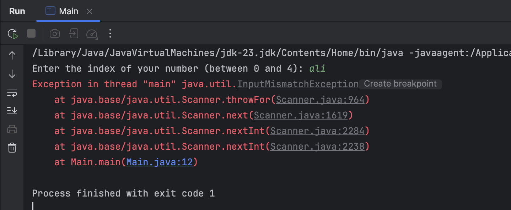
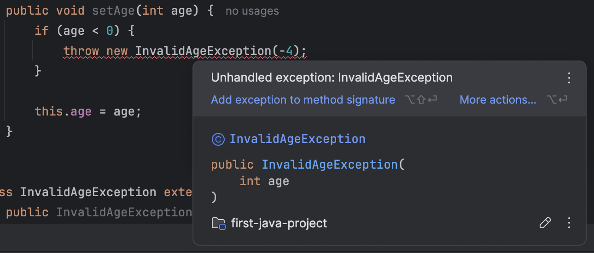

## مقدمه

یکی از مفاهیم مهم و به درد بخور زبان جاوا، مفهوم Exception Handling ‍ه. «Exception» در زبان انگلیسی به معنای «استثناء» ست و شرایط استثنایی توی جاوا، شرایطیه که برنامهٔ شما به خطا خورده! جاوا به شما این امکان رو می‌ده که به جای crash کردن برنامه موقع به وجود اومدن خطا، خودتون به شکلی دیگه با خطای به وجود اومده برخورد کنین.

خطاها همیشه نباید به crash منجر بشن. مثلا اگر شما توی Google باشین، نمی‌خواید به محض این که یکی از کاربرها توی refresh کردن gmail ش به خطا خورد، تمام سرورهای gmail برای همهٔ کاربرها crash کنن. این‌جاست که مدیریت خطاهای سیستم و Exception Handling بسیار مهم می‌شن.

# Exception ها

برنامهٔ زیر رو توی جاوا اجرا کنید:

```java
import java.util.Scanner;

public class Main {
    public static void main(String[] args) {  
        Scanner scanner = new Scanner(System.in);

        int[] arr = {21, 11, 2, 5, 98};

        while (true) {  
            System.out.print("Enter the index of your number (between 0 and 4): ");
            var idx = scanner.nextInt();  
  
            System.out.println("Number at that idx: " + arr[idx]);  
        }  
    }  
}
```

این برنامه، یه عدد به اسم ‍ از کاربر می‌گیره و `arr[idx]` رو خروجی می‌ده. مثلا، یه نمونه از اجرای این برنامه به شکل زیره:

```text
Enter the index of your number (between 0 and 4): 0  
Number at that idx: 21  
Enter the index of your number (between 0 and 4): 2  
Number at that idx: 2
```

چی می‌شه اگر کاربر عددی خارج از بازهٔ ۰ تا ۴ بده؟ همون‌طور که خودتون می‌دونید، به یه خطا می‌خوریم:


به متن این خطا توجه کنید:

```text
Exception in thread "main" java.lang.ArrayIndexOutOfBoundsException: Index -2 out of bounds for length 5
```

جاوا به شما می‌گه که یه Exception توی thread ای به اسم `main` رخ داده. ما هنوز با مفهوم thread آشنا نیستیم، صرفا بدونید که برنامه‌های شما همیشه توی thread ای به اسم `main` اجرا می‌شن. این خطا همچنین به شما می‌گه که Exception به وجود اومده، از جنس `ArrayIndexOutOfBoundException` ‍ه، که اسم خیلی دقیقی برای خطای شماست! در ادامه هم یه توضیح برای علت این خطا اومده، این که «ایندکس -2، خارج از بازهٔ ایندکس‌های معقول یک آرایهٔ ۵تایی‌‍ه».

در ادامه، حتی گفته شده که این خطا توی دقیقا چه تابعی رخ داده:

```text
at Main.main(Main.java:13)
```

شما می‌تونید بفهمید که این خطا، توی متد `Main.main`، در خط ۱۳ام فایل `Main.java` رخ داده.

### بلوک try-catch

همون‌طور که توی مقدمه گفتیم، Exception به معنای اینه که برنامهٔ شما به خطا خورده. ولی خطاها، بخشی طبیعی از برنامهٔ شمان. شما نمی‌خواین هر بار که کاربر، بر حسب اشتباه عددی خارج از بازهٔ ۰ تا ۴ وارد کرد برنامهٔ شما با یه خطای زشت crash کنه و خارج بشه، در عوض می‌خواید که به کاربر یه پیام مناسب نشون داده بشه تا عدد درستی وارد بکنه. پیامی مثل این:

```text
Please enter a valid index. this index should be between 0 and 4.
```

این کار، با کلیدواژه‌های جدیدی به اسم `try` و `catch` ممکنه:

```java
try {  
    System.out.print("Enter the index of your number (between 0 and 4): ");
    var idx = scanner.nextInt();  
  
    System.out.println("Number at that idx: " + arr[idx]);  
} catch (ArrayIndexOutOfBoundsException e) {  
    System.out.println("Please enter a valid number. this number should be between 0 and 4.");  
}
```

کلیدواژهٔ «try»، به معنای «تلاش کردن» ‍ه. توی این کد، شما به جاوا می‌گین که «تلاش کن خطوط بخش try رو اجرا کنی، و اگر حین اجرای این خطوط، به Exception ای از جنس `ArrayIndexOutOfBoundsException` برخورد کردی، به جای این که crash کنی و از برنامه خارج بشی، به بخش `catch` برو و کدهای اون بخش رو اجرا کن.» دقت کنین که توی پرانتز جلوی `catch`، ما نوع Exception ای که می‌خوایم هندل کنیم رو، مثل یک تابع، توی پرانتز آوردیم.

خروجی برنامهٔ جدید شما به شکل زیره:

```text
Enter the index of your number (between 0 and 4): 4  
Number at that idx: 98  
Enter the index of your number (between 0 and 4): -2  
Please enter a valid number. this number should be between 0 and 4.  
Enter the index of your number (between 0 and 4): 7  
Please enter a valid number. this number should be between 0 and 4.
```

### catch های متوالی

کاربر حین اجرای برنامهٔ شما، خطای دیگری هم می‌تونه ایجاد کنه، این که به جای عدد، چیزهای نامربوطی مثل اسم و رشته ورودی بده. برنامه رو اجرا کنید و به جای عدد، `"ali"` رو ورودی بدین تا ببینید چه اتفاقی می‌افته:



برنامهٔ شما، یه exception جدید داد. این بار می‌تونید ببینید که این Exception، از جنس `InputMismatchException` ‍ه. شما می‌تونید با اضافه کردن یه `catch` جدید به کدتون، این خطا رو هم بهتر مدیریت کنین:

```java
try {  
    System.out.print("Enter the index of your number (between 0 and 4): ");
    var idx = scanner.nextInt();  
  
    System.out.println("Number at that idx: " + arr[idx]);  
} catch (ArrayIndexOutOfBoundsException e) {  
    System.out.println("Please enter a valid number. this number should be between 0 and 4.");  
} catch (InputMismatchException e) {  
    System.out.println("Please enter a valid number.");  
    scanner.nextLine();  
}
```

توی کد بالا، جاوا وقتی به خطایی بخوره، اول چک می‌کنه که «آیا این خطا، از نوع `ArrayIndexOutOfBoundsException` که توی catch اول اومده هست یا نه؟» و اگر بود، خطوط داخل catch اول رو اجرا می‌کنه. اما اگر نبود، به سراغ `catch` بعدی می‌ره و دوباره چک می‌کنه که «آیا این خطا از جنس `InputMismatchException` هست یا نه؟» و اگر بود، خطوط `catch` بعدی رو اجرا می‌کنه.

شما ممکنه چندین `catch` پشت سر هم داشته باشین. در این صورت با به وجود اومدن خطا جاوا به همین ترتیب، از اول تا آخر اون‌ها رو چک می‌کنه و به دستوراتِ داخل اولین `catch` مناسب می‌ره.

خروجی برنامهٔ جدید شما، به شکل زیره:

```text
Enter the index of your number (between 0 and 4): 2  
Number at that idx: 2  
Enter the index of your number (between 0 and 4): ali  
Please enter a valid number.  
Enter the index of your number (between 0 and 4): -1  
Please enter a valid number. this number should be between 0 and 4.
```

## کلاس Exception

اگر دقت کنید، توی هر کدوم از `catch` هامون، ما چیزی شبیه به argument های تابع توی پرانتز ورودی می‌گرفتیم:

```java
catch (ArrayIndexOutOfBoundsException e) {
    // Your Code
}
```

چرا؟ مگه `ArrayIndexOutOfBoundsException` کلاسه؟ آیا این یعنی `e` آبجکته؟ بله!

روی `ArrayIndexOutOfBoundsException` برید، کلیک راست کنید و با Go To و سپس Declaration and Usages، به تعریف این کلاس برین:


می‌بینید که این کلاس، یه کلاس خیلی معمولی با سه‌تا کانستراکتور و یه فیلده که از کلاسی به اسم `IndexOutOfBoundsException` ارث‌بری کرده!

توی جاوا، کلاسی هست به اسم کلاس `Exception`، که تمامی کلاس‌های نشان‌دهندهٔ Exception های مختلفی که توی جاوا می‌بینید از اون ارث‌بری می‌کنن. این کلاس، یه متد به اسم `()getMessage` داره [^1] که متن خطا مرتبط با Exception فعلی‌مون رو خروجی می‌ده.

ما می‌تونیم از این کلاس توی `catch` هامون استفاده کنیم. کدتون روی صفحه رو به کد زیر تغییر بدین:

```java
try {  
    System.out.print("Enter the index of your number (between 0 and 4): ");
    var idx = scanner.nextInt();  
  
    System.out.println("Number at that idx: " + arr[idx]);  
} catch (Exception e) {  
    System.out.println(e.getMessage());  
}
```

حالا اگر خطایی توی بلوک `try` اتفاق افتاد، جاوا به اولین `catch` تون نگاه می‌کنه و مثل قبل از خودش می‌پرسه «آیا خطا از جنس `Exception` ‍ه؟» و از اون‌جایی که همهٔ خطاها از `Exception` ارث‌بری کردن، جواب همیشه مثبته[^2] و کد داخل این `catch` اجرا می‌شه.

توی این `catch`، جاوا صرفا `e.getMessage()`، که متن خطامون هست رو چاپ می‌کنه. می‌تونید یه بار این کد رو اجرا کنید تا خروجی اون رو ببینید:

```text
Enter the index of your number (between 0 and 4): 1  
Number at that idx: 11  
Enter the index of your number (between 0 and 4): -1  
Index -1 out of bounds for length 5  
Enter the index of your number (between 0 and 4): 7  
Index 7 out of bounds for length 5
```

می‌بینید که متن خطایی که قبلا دیده بودیم، یعنی `"Index -1 out of bounds for length 5"`، الآن روی صفحه چاپ می‌شه و برنامه crash نمی‌کنه. هر خطای دیگه‌ای هم رخ بده، دقیقا به همین `catch` می‌رسه و متن خطاش چاپ می‌شه.

[^1]:  البته، اگر سورس کد کلاس `Exception` رو بخونید، می‌بینید که این متد متعلق به کلاس ابسترکتی به اسم `Throwable` ان. اگر خواستین، راجع به `Throwable` تحقیق کنید و بیشتر بخونید.

[^2]:  راستش جواب همیشهٔ همیشه مثبت نیست. نوع دیگه‌ای از خطاها وجود دارن که کلاس پدرشون به جای `Exception`، کلاس کاملا متفاوتی به اسم `Error` ‍ه. ما توی این‌جا به اون‌ها نمی‌پردازیم ولی اگر خواستین، خودتون راجع بهشون بخونین.

## throw

کلاس زیر رو، پایین کلاس Main ایجاد کنید:

```java
class Human {
    private int age;
    
    public int getAge() {
        return age;  
    }
    
    public void setAge(int age) {
        this.age = age;  
    }  
}
```

سپس، کد متد `main` رو به کد زیر تغییر بدین:

```java
public class Main {
    public static void main(String[] args) {  
        Human ali = new Human();  
        ali.setAge(10);  
          
        System.out.println("Ali's age: " + ali.getAge());  
    }  
}
```

کد خیلی ساده‌ایه و خروجی‌ش هم اینه:

```text
ali's age: 10
```

ولی خب، کد زیر رو نگاه کنید. توی این کد، به علی سنِ -3 رو دادیم. آیا این کار معقوله؟

```java
Human ali = new Human();  
ali.setAge(-3);
```

ما می‌خوایم که اگر برنامه‌نویس دیگری، از کلاس `Human` استفاده کرد و تلاش کرد سنِ کسی رو منفی کنه، `Exception` ای دریافت کنه که جلوش رو بگیره. برای این کار، متد `setAge(int age)` کلاس `Human` رو به شکل زیر تغییر بدین:

```java
public void setAge(int age) {
    if (age < 0) {
        var exception = new IllegalArgumentException("Age cannot be negative");
        throw exception;  
    }

    this.age = age;  
}
```

توی این کد، در ابتدای متد `setAge` چک می‌کنیم که آیا سن ورودی داده شده منفیه یا نه. اگر بود، یه `Exception` جدید از جنس `IllegalArgumentException` ایجاد می‌کنیم، متن اون رو با استفاده از کانستراکتورش `"Age cannot be negative"` می‌ذاریم و نهایتا اون رو `throw` می‌کنیم. با این کار، همزمان با رسیدن به این خطا از متد خارج هم می‌شیم. حالا تلاش کنید سن `ali` رو منفی کنید. به خطای زیر می‌خورید:


متن خطایی که گرفتین رو بخونین. جاوا به شما می‌گه که توی thread ای به اسم `main`، خطایی از جنس `IllegalArgumentException` گرفته که متنش، `"Age cannot be negative"` ‍ه. همچنین به شما می‌گه که این خطا، توی متد `Human.setAge` رخ داده که خط ۲۲ام فایل `Main.java` ست (این خط، خطیه که توش `exception` مون رو `throw` کرده بودیم).

حالا این خطا رو `catch` کنید:

```java
try {  
    ali.setAge(-3);  
} catch (IllegalArgumentException e) {  
    System.out.println(e.getMessage());  
}
```

برنامه‌تون رو اجرا کنید و خروجی جدید رو ببینید:

```text
Age cannot be negative  
ali's age: 0
```

می‌بینید که به جای یه خطای عجیب غریب که باعث crash برنامه‌تون می‌شد، فقط متن خطا روی صفحه چاپ شده و بعد از اون، سن علی روی صفحه چاپ شده (چرا سن علی صفره؟). آبجکت `e`، که یه جورایی شبیه ورودی `catch` تونه، دقیقا همون آبجکت `exception` ایه که توی متد `setAge` ساختین و `throw` ش کردین:

```java
if (age < 0) {
    var exception = new IllegalArgumentException("Age cannot be negative");
    throw exception;  
}
```

البته که شما می‌تونستین کدی معادل کد بالا به شکلی کوتاه‌تر بنویسین:

```java
if (age < 0) {
    throw new IllegalArgumentException("Age cannot be negative");  
}
```

این مدل دوم کد‌نویسی، استانداردتره. از دومی توی کدهای خودتون استفاده کنید، ما اولی رو نوشتیم تا توجه‌تون رو به این جلب کنیم که Exception ها، در واقع همگی object هایی معمولی‌ان.

### انواع exception ها و کلیدواژهٔ `throws`

حالا که کلی با Exception ها کار کردین، لازمه بدونید که خود Exception ها، دو دسته دارن:
#### Checked Exceptions

دسته‌ی اول از exception ها، checked exception ها هستن. این خطاها اون‌قدر مهمن که نمی‌تونین نادیده‌شون بگیرین! اگه یه متد ممکنه همچین خطایی ایجاد کنه، باید حتماً توی تعریفش این موضوع رو مشخص کنین تا بقیه‌ی برنامه‌نویس‌هایی که قراره ازش استفاده کنن، بدونن ممکنه همچین خطای مهمی بگیرن. از طرفی، وقتی دارین از متدی که checked exception داره استفاده می‌کنین، حتماً باید توی try-catch اون خطا رو هندل کنین که برنامه‌تون crash نکنه!

یک مثال از این exception ها، `IOException` ‍ه. عبارت IO مخفف input/output ‍ه و این خطا وقتی رخ می‌ده که توی ورودی گرفتن و خروجی دادن چیزی به مشکل بخورین. مثلا اگر بخواین فایلی رو بخونین و اون فایل وجود نداشته باشه، احتمالا این `Exception` رو می‌گیرین. توی کد زیر، متد `readFile` (که صرفا جنبهٔ آموزشی داره!)، این `exception` رو `throw` می‌کنه:

```java
public class Main {
    public static void main(String[] args) {}

    public static void readFile(boolean fileExists) {
        if (!fileExists) {
            throw new IOException("File does not exist");  
        }  
    }  
}
```

این کد رو توی IntelliJ کپی کنید. می‌بینید که کدتون کامپایل نمی‌شه و به خطای زیر می‌خورین:


علت این خطا، اینه که متد `readFile` با این که داره `exception` مهمی از نوع checked exception رو `throw` می‌کنه، ولی هیچ جایی توی تعریف خود متد نگفته که ممکنه این exception رو بده. شما باید حتما توی تعریف این‌جور متدها، checked exception هاشون رو مشخص کنید:

```java
public static void readFile(boolean fileExists) throws IOException {
    if (!fileExists) {
        throw new IOException("File does not exist");  
    }  
}
```

توی این کد جدید، کنار تعریف متد `readFile`، با کلیدواژهٔ `throws` مشخص کردیم که متدمون ممکنه خطایی از جنس `IOException` بده. حالا کدتون کامپایل می‌شه.

سعی کنید از متد `readFile` توی متد `main` استفاده کنید:

```java
public static void main(String[] args) {  
    readFile(false);  
}
```

باز هم خطای کامپایل می‌گیرین! این‌ بار، علت اینه که شما از متد `readFile` استفاده کردین، و این متد ممکنه خطای مهمی بده، ولی شما این خطا رو توی یک `try-catch` هندل نکردین. شما دوتا راه‌حل دارین که بسته به شرایط، باید یکی از اون‌ها رو انتخاب کنید:

**راه حل اول**: این که توی یه `try-catch`، خطای احتمالی متد `readFile` رو مدیریت کنید:

```java
public static void main(String[] args) {
    try {  
        readFile(false);  
    } catch (IOException e) {  
        System.out.println(e.getMessage());  
    }  
}
```

با این کار، جاوا مطمئن می‌شه که این خطا توسط شما مدیریت شده و دیگه بهتون گیر نمی‌ده.

**راه حل دوم**: بپذیرید که متدتون نمی‌تونه این خطا رو مدیریت کنه و اون رو به تعریف متد `main` هم اضافه کنید:

```java
public static void main(String[] args) throws IOException {  
    readFile(false);  
}
```

حالا اگر برنامه‌نویسی از متد `main` استفاده کرد، اون هم باید مثل شما تلاش کنه تا این `IOException` رو برطرف کنه!

#### Unchecked Exceptions

این exception ها، بر خلاف دستهٔ قبل، اونقدر مهم نیستن که مدیریت اون‌ها اجباری باشه.

توی مثال اول، شما دیدین که متد `scanner.nextInt()` می‌تونه خطایی از جنس `InputMismatchException` بده، و این خطا وقتی اتفاق می‌افتاد که کاربر به جای `int`، تایپ‌های دیگه‌ای مثل `string` یا `float` ورودی بده. ولی شما تا قبل از خوندن این داک، از جلسهٔ اول کارگاه از متد `scanner.nextInt()` استفاده می‌کردین، بدون این که حتی بدونید خطای `InputMismatchException` چیه! چه برسه به این که توی `try-catch` اون رو مدیریت کنید یا با `throws` اون رو به تعریف متدتون اضافه کنید!

می‌بینید که جاوا شما رو مجبور به مدیریت این exception ها نمی‌کنه. خطاهایی مثل `ArrayIndexOutOfBoundsException`، `ArithmeticException` و کلی خطای دیگه که تا الآن صفحه‌هاتون رو قرمز می‌کردن و نمی‌دونستید چی‌ان، همگی از این جنس هستن.

این Exception ها، به جای این که مستقیما از کلاس `Exception` ارث‌بری کنن، از کلاس دیگه‌ای به اسم `RuntimeException` ارث‌بری کردن:


می‌بینید که خود این کلاس‌ هم، از `Exception` ارث‌بری می‌کنه.

## ساخت Exception های جدید

دیدین که کدهای کلاس‌هایی مثل `ArrayIndexOutOfBoundsException`، `RuntimeException` و امثال اون‌ها، کدهای نسبتا ساده‌ای‌ان. عموما فقط یه سری constructor دارن که با استفاده از اون‌ها، بتونید آبجکت‌های جدیدی ازشون درست کنید و اون‌ها رو `throw` کنین. مثلا اگر کامنت‌های کلاس `RuntimeException` رو کنار بذاریم، فقط همچین چیزی از کدش می‌مونه:

```java
public class RuntimeException extends Exception {
    @java.io.Serial
    static final long serialVersionUID = -7034897190745766939L;
    
    public RuntimeException() {
        super();  
    }
    
    public RuntimeException(String message) {
        super(message);  
    }
    
    public RuntimeException(String message, Throwable cause) {
        super(message, cause);  
    }
    
    public RuntimeException(Throwable cause) {
        super(cause);  
    }
    
    protected RuntimeException(String message, Throwable cause,
                               boolean enableSuppression,
                               boolean writableStackTrace) {
        super(message, cause, enableSuppression, writableStackTrace);  
    }  
}
```

پس واقعا چه چیزی مانع شماست که کلاس‌های `Exception` های خودتون رو درست کنید؟ نه؟ :)))

مثال قبل‌ترمون، که توش به یک انسان سنِی منفی می‌دادیم رو در نظر بگیرین:

```java
class Human {
    private int age;

    public int getAge() {
        return age;  
    }

    public void setAge(int age) {
        if (age < 0) {
            throw new IllegalArgumentException("Age cannot be negative");  
        }

        this.age = age;  
    }  
}
```

فرض کنید می‌خوایم این‌جا، به جای `IllegalArgumentException`، از `Exception` جدیدِ خودمون یعنی `InvalidAgeException` استفاده کنیم. طبق رسم‌های قراردادی جاوا، اسم تمام کلاس‌هایی که نشان‌دهندهٔ یک `Exception` هستن، باید به عبارت `Exception` ختم بشن.

کلاس زیر رو، زیر کلاس `Human` ایجاد کنید:

```java
class InvalidAgeException extends Exception {
    public InvalidAgeException(String message) {
        super(message);  
    }
    
    public InvalidAgeException(int age) {
        super("Invalid age: " + age);  
    }  
}
```

برای ساخت یک `Exception` جدید، شما باید مثل تمامی `Exception` های دیگه، به شکلی مستقیم یا غیر مستقیم از کلاس `Exception` ارث‌بری کرده باشین. توی `InvalidAgeException`، ما دوتا constructor نوشتیم که کار برنامه‌نویس‌های دیگه رو راحت کنه. هر دوی این constructor ها، صرفا constructor کلاس `Exception` رو با متن خطای خاص خودشون صدا می‌زنن. توی کانستراکتور اول، این متن خطا ورودی خود کانستراکتوره و توی کانستراکتور دوم، صرفا با ورودی گرفت سنِ نامعتبر متن خطای پیش‌فرضی که نوشتیم به کانستراکتور کلاسِ `Exception` داده شده. شما همیشه باید با صدا زدن کانستراکتورهای خود کلاس `Exception` متن خطا رو تنظیم کنید.

بیاین تا این `Exception` رو توی متد `setAge(int age)` استفاده کنیم:

```java
class Human {
    private int age;

    public int getAge() {
        return age;  
    }

    public void setAge(int age) {
        if (age < 0) {
            throw new InvalidAgeException(age);  
        }

        this.age = age;  
    }  
}
```

توی متد `setAge`، این بار به جای `IllegalArgumentException` از `Exception` اختصاصی خودمون استفاده کردیم. اما یه خطای کوچیک داریم:



این خطا، شبیه همون خطایی‌‍ه که توی بخش checked exception ها بهش برخوردیم. Exception جدیدی که شما نوشتین، از جنس checked exception ‍ه. برای این که این‌طور نباشه، کافیه مثل unchecked exceptionها از `RuntimeException` ارث‌بری کنید:

```java
class InvalidAgeException extends RuntimeException {
    // CODE CODE CODE
}
```

با این کار، خطاتون برطرف و کدتون کامپایل می‌شه. کد زیر رو برای `catch` کردن این خطا توی متد `main` بنویسید:

```java
var ali = new Human();

try {  
    ali.setAge(-7);  
} catch (InvalidAgeException e) {  
    System.out.println("Exception: " + e.getMessage());  
}
```

حالا کدتون رو اجرا کنید:

```text
Exception: Invalid age: -7
```

شما `exception` جدید خودتون رو ساختید! قبل از این که لپ‌تاپتون رو ببنید، یکی رو پیدا کنید و با افتخار بهش این رو بگید!

## چه چیزی یاد گرفتیم

توی این داک فهمیدیم که:

- بلوک‌های `try-catch` دقیقا چی هستن و چطور می‌شه ازشون استفاده کرد.
- خود exception چیه؟ انواع مختلف اون چی هستش و کلاس `Exception` چه چیزهایی توی خودش نگه داشته.
- چطور می‌شه exceptionهای جدید خودمون رو درست کنیم و از اون‌ها استفاده کنیم.
- کلیدواژهٔ `throw` چیه و چطور می‌تونیم توی به برنامه‌‌نویس‌های دیگه خطا بدیم.

## منابع بیشتر

اگر دوست داشتین، حتما [داک رسمی Oracle برای Exceptionها](https://docs.oracle.com/javase/tutorial/essential/exceptions/index.html) رو مطالعه کنید. این داک‌ها پیشرفته و بامزه‌ن، بهتون کلی چیز جدید یاد می‌دن.

همچنین، راجع به چیزهایی مثل `Error` و `Throwable` توی جاوا تحقیق کنید. هر دوی اون‌ها مباحثی پیشرفته‌ت که یادگیری شما رو تکمیل می‌کنن. برای مطالعهٔ اون‌ها، علاوه بر اینترنت می‌تونید از فصل «Error Handling» کتاب « Learning Java - An Introduction to Real-World Programming with Java» هم استفاده کنید:

