قدم اول برای درس برنامه‌نویسی پیشرفته با زبان جاوا، آماده کردن شرایط کافی برای برنامه‌نویسی با این زبان است که شامل نصب پکیج کامل زبان جاوا (کیت توسعه جاوا) و همچنین یک محیط توسعه  می‌باشد. در این دستور کار منابعی برای آموزش دانلود و نصب Java JDK و IntelliJ IDEA قرار گرفته است. IntelliJ IDEA یک محیط توسعه یکپارچه برای زبان جاوا و محصول شرکت JetBrains است. این IDE یکی از قدرتمندترین‌ها برای زبان جاوا است که ویژگی‌ها و امکانات گوناگونی دارد. پیشنهاد می‌شود که همگی از همین IDE استفاده کنید. 

# آموزش نصب IntelliJ و JDK در ویندوز

## دانلود و نصب IntelliJ در ویندوز

ابتدا به [صفحه رسمی معرفی اینتلیجی](https://www.jetbrains.com/idea/) مراجعه کنید، سپس در صفحه‌ی زیر بر روی گزینه‌ی Download سفید رنگ بزنید.


در صفحه زیر گزینه ویندوز را انتخاب کنید.


صفحه را به پایین اسکرول کنید و مطابق تصویر زیر، نسخه کامیونیتی را دانلود کنید.

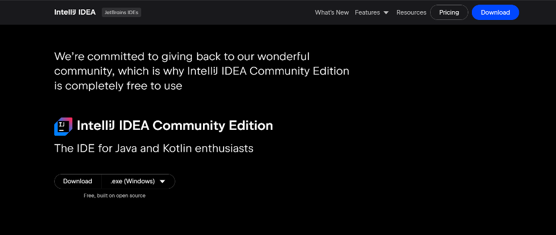

پس از اتمام دانلود، بر روی فایل کلیک کنید تا پنجره‌ی زیر باز شود. سپس گزینه Next را بزنید.


در صفحه‌ی زیر مسیر نصب را مشخص کنید و بر روی گزینه Next ضربه بزنید.


در صفحه بعدی نیز برخی آپشن‌ها نظیر ایجاد شورت‌کات از شما سوال شده است. همه‌ی این آپشن‌ها بعد از نصب برنامه نیز قابل افزودن هستند. بعد از انتخاب گزینه‌های مدنظر خود، Next را بزنید.


در صفحه‌ی زیر نیاز به تغییر وجود ندارد. گزینه‌ی Install را بزنید.

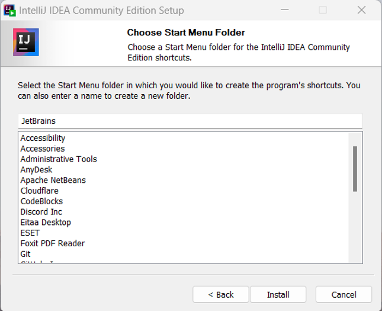

پس از پایان فرآیند Installation، در صفحه‌ی زیر بدون نیاز به تغییر، گزینه‌ی Finish را بزنید. اکنون برنامه نصب شده و قابل اجرا می‌باشد.

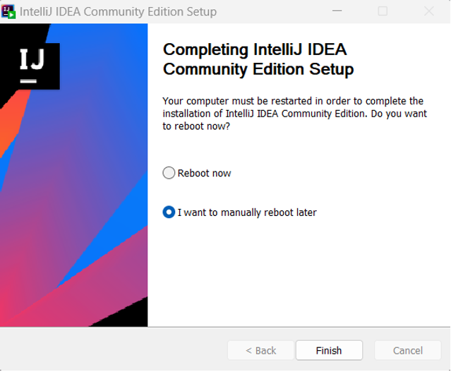

## دانلود و نصب (JDK (Java Development Kit در ویندوز

ابتدا به [این آدرس](https://www.oracle.com/java/technologies/downloads) مراجعه کنید. در صفحه‌ی زیر بر روی گزینه‌ی JDK23  بزنید و Windows را انتخاب کنید. در نهایت بر روی لینک مقابل گزینه x64 MSI installer کلیک کنید تا دانلود آغاز شود. 


پس از اجرای فایل دانلود شده، با پنجره‌ای مشابه تصویر زیر روبه‌رو می‌شوید. در این صفحه بر روی گزینه‌ی Next کلیک کنید، در صفحه بعدی مسیر نصب را مشخص کنید و مجدداً بر روی گزینه Next ضربه بزنید.

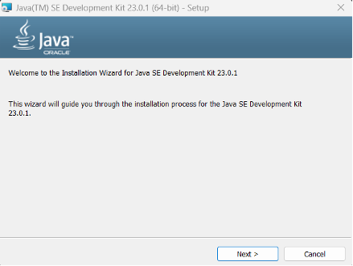


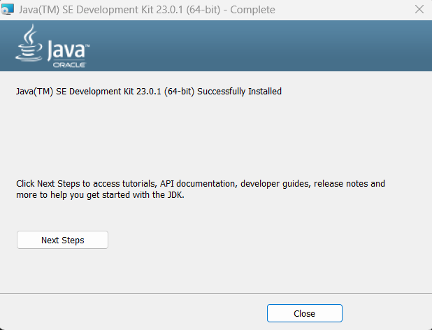

پس از پایان فرآیند Installation، در صفحه‌ی آخر گزینه‌ی Close را بزنید. اکنون نصب به پایان رسیده است. می‌توانید با اجرای دستور زیر در command line از نصب شدن جاوا مطمئن شوید و نسخه نصب‌شده را مشاهده کنید.

```bash
java --version
```

در صورت نصب موفق JDK، خروجی این دستور مشابه زیر است:

```
java 23.0.1 2024-10-15
Java(TM) SE Runtime Environment (build 23.0.1+11-39)
Java HotSpot(TM) 64-Bit Server VM (build 23.0.1+11-39, mixed mode, sharing)
```


# آموزش نصب IntelliJ و JDK در مک

## دانلود و نصب IntelliJ در مک

ابتدا به [صفحه رسمی معرفی اینتلیجی](https://www.jetbrains.com/idea) مراجعه کنید، سپس در صفحه‌ی زیر بر روی گزینه‌ی Download سفید رنگ بزنید.


در صفحه زیر گزینه macOS را انتخاب کنید.


صفحه را به پایین اسکرول کنید و مطابق تصویر زیر، نسخه کامیونیتی را دانلود کنید.

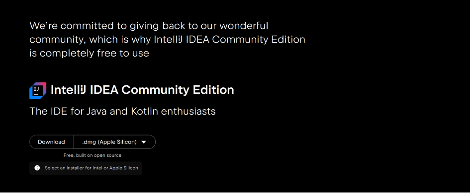

پس از اتمام این فرآیند، فایل دانلود شده را به داخل پوشه Applications بکشید تا عملیات نصب انجام شود.

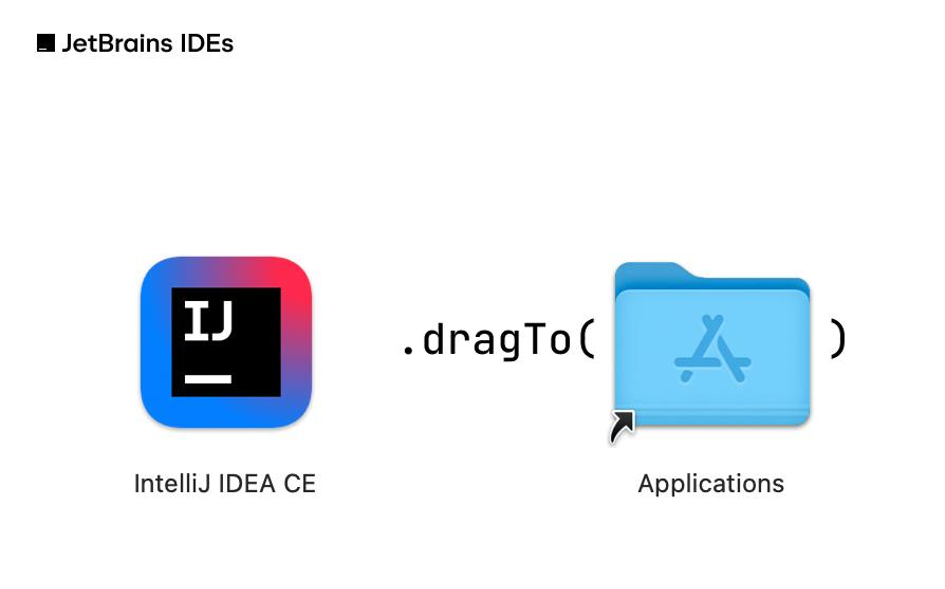

## دانلود و نصب (JDK (Java Development Kit در مک

ابتدا به [این آدرس](https://www.oracle.com/java/technologies/downloads) مراجعه کنید. در صفحه‌ی زیر بر روی گزینه‌ی JDK23  بزنید و سپس macOS را انتخاب کنید.


پس از اتمام دانلود، فایل را باز کنید تا با صفحه‌ای مشابه صفحه زیر روبه‌رو شوید.


سپس با صفحه‌ای به شکل زیر روبه‌رو می‌شوید و با ادامه دادن مراحل، نصب را انجام دهید.

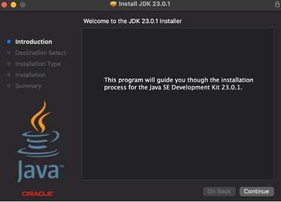

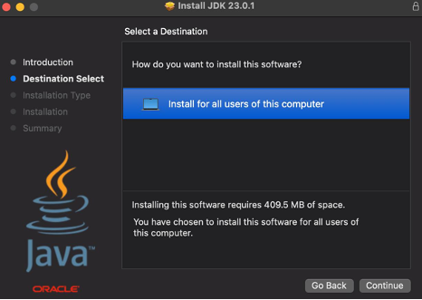


در نهایت با اجرای دستور زیر در  command line می‌توانید  از  نصب شدن جاوا در سیستم خود مطمئن شوید.

```bash
java --version
```

در صورت نصب موفق JDK، خروجی این دستور مشابه زیر است:

```
java 23.0.1 2024-10-15
Java(TM) SE Runtime Environment (build 23.0.1+11-39)
Java HotSpot(TM) 64-Bit Server VM (build 23.0.1+11-39, mixed mode, sharing)
```

# آموزش ایجاد پروژه در IntelliJ IDEA

پس از پایان فرآیند نصب که پیش‌تر آموزش داده شد، برنامه را اجرا کرده و بر روی گزینه‌ی New Project بزنید.

در این صفحه نام و مسیر ذخیره‌سازی پروژه را انتخاب کنید. زبان را بر روی جاوا و Build System را بر روی IntelliJ بگذارید. در صورتی که می‌خواهید در بدو ایجاد پروژه کلاس Main به همراه کد آماده‌ی کوتاه وجود داشته باشد، تیک Add Sample Code را بزنید.

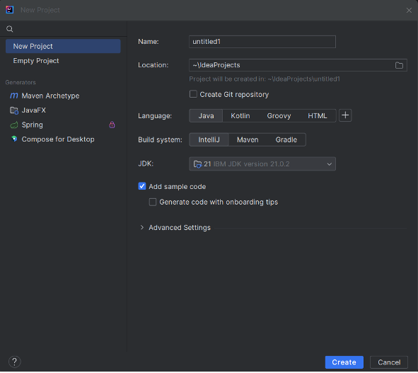

سپس می‌بایست JDK را که قبلاً نصب کردید انتخاب کنید. برای این کار مطابق تصویر زیر عمل کنید. در پایان بر روی گزینه Create بزنید.


چنانچه پس از ایجاد پروژه، مایل به اضافه کردن کلاس دیگری بودید و یا اگر کلاس Main به‌صورت پیش‌فرض در پروژه‌ی شما ساخته نشده بود، مطابق تصویر زیر از منوی File گزینه New و سپس گزینه‌ی Java Class را انتخاب کنید.


پس از ساخت پروژه یک فایل پیش‌فرض `Main.java` با برنامه مربوط به چاپ `"!Hello World"` ساخته می‌شود. با استفاده کلید سبزرنگ Run در نوار بالایی می‌توانید کد را اجرا کنید و مطمئن شوید  تمامی ابزارها به درستی کار می‌کنند و عبارت `"!Hello World"` در ترمینال چاپ شده است.


# گیت 

برای این کلاس، لازمه که توی [سایت Github](https://github.com) یک اکانت داشته باشید. اگر اکانتی ندارید، یک اکانت جدید ایجاد کنید. بعد از این کار، لازمه که قدم به قدم، خود Git رو هم روی سیستم‌مون نصب کنیم.

## آموزش دانلود و نصب گیت در ویندوز

ابتدا به [سایت گیت](https://git-scm.com/) مراجعه کنید و بر روی گزینه‌ی Download for windows بزنید.

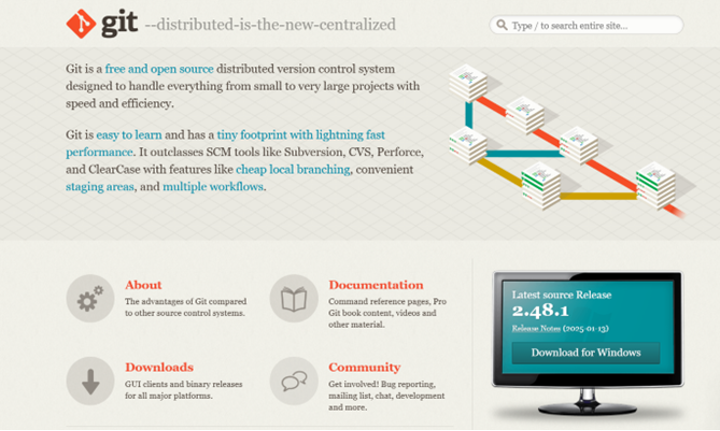

سپس بر روی Click Here to download بزنید تا دانلود آخرین نسخه آغاز شود.


پس از پایان دانلود بر روی فایل setup دانلود شده بزنید. مطابق تصاویر زیر، مراحل دانلود را ادامه دهید.

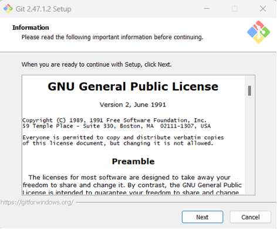

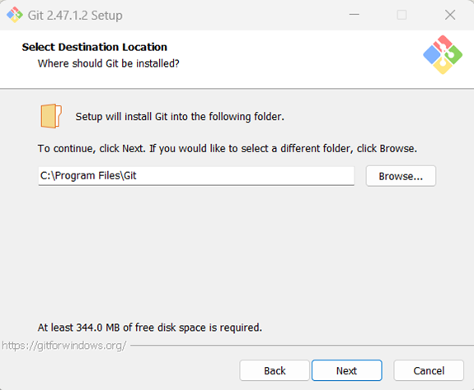

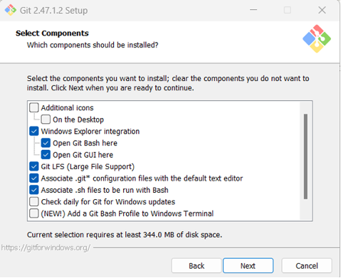


در مرحلهٔ Choosing the default editor used by Git از شما خواسته می‌شود یک ادیتور پیش‌فرض برای گیت، از بین ادیتورهای موجود در دستگاه خود انتخاب کنید. توجه داشته باشید که این تنظیمات پس از نصب نیز قابل‌تغییر است و در این مرحله ضرورتی در تغییر آن نیست. نصب را بر اساس تصاویر ادامه دهید.


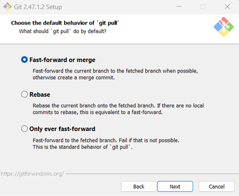


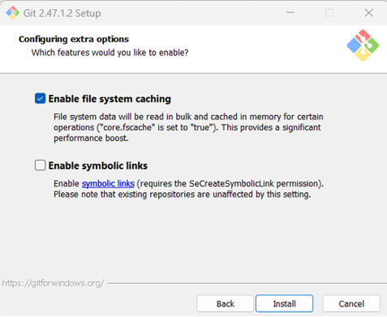

بعد از پایان فرآیند Installation، در صفحه‌ی زیر Finish را بزنید.

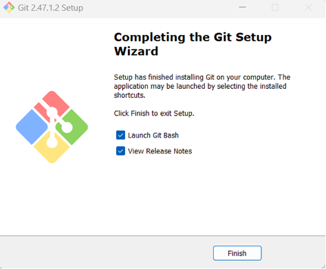

اکنون نصب به پایان رسیده است. می‌توانید از طریق Git Bash یا Command Prompt دستورات را نوشته و با گیت کار کنید. همچنین می‌توانید از Git GUI استفاده کنید که محیط گرافیکی برای استفاده از گیت می‌باشد. در ادامه درس، توضیحات کامل درباره نحوه کارکرد گیت و چرایی استفاده و اهمیت آن در برنامه‌نویسی داده می‌شود.

## آموزش دانلود و نصب گیت در مک

در سیستم‌عامل macOS راحت‌ترین راه نصب گیت، نصب Xcode Command Line Tools است. با اجرای دستور زیر در ترمینال Xcode را نصب کنید.

```bash
xcode-select --install
```

سپس با اجرای دستور زیر می‌توانید ورژن نصب‌شده گیت در سیستم خود را مشاهده کنید و از صحت نصب آن مطمئن شوید:

```bash
git --version
```

خروجی این دستور مشابه زیر است:

```
git version 2.39.5 (Apple Git-154)
```

# دوره‌های آموزشی جانبی

به عنوان بخشی از سفر ما به دنیای برنامه‌نویسی جاوا، چهار منبع تکمیلی به صورت ویدیو، سایت و کتاب برای شما معرفی شده است. این منابع مکمل برنامه درسی اصلی ما هستند و درک شما از مفاهیم جاوا را عمیق‌تر می‌کنند.

هر یک از این دوره‌های جانبی، یک رویکرد منحصربه‌فرد برای یادگیری جاوا ارائه می‌دهد که به شما امکان بررسی زبان از دیدگاه‌های مختلف و عمیق‌تر کردن تخصص خود را می‌دهد. ما شما را تشویق می‌کنیم که از این منابع برای بهبود سفر یادگیری خود و تقویت درک خود از مفاهیم برنامه‌نویسی جاوا استفاده کنید.

## دوره ۱۲ ساعته Bro Code

دوره جامع ۱۲ ساعته Bro Code مجموعه جذاب موضوعات ضروری در جاوا را پوشش می‌دهد و توضیحات واضح و مثال‌های عملی را برای تقویت یادگیری شما ارائه می‌دهد. چه مبتدی باشید و چه به دنبال تجدید مهارت‌های خود هستید، دوره Bro Code یک رویکرد ساختاریافته برای تسلط بر اصول جاوا ارائه می‌دهد.

[لینک دوره Bro Code در یوتیوب](https://www.youtube.com/watch?v=xk4_1vDrzzo)

## ‏MOOC (Massive Open Online Courses)

‏OOC، یک پلت‌فرم یادگیری انعطاف‌پذیر و تعاملی است که به شما امکان می‌دهد با سرعت خود مطالعه و کاوش کنید. با انبوهی از دوره‌های جاوا که در پلت‌فرم MOOC موجود است، می‌توانید با انتخاب دوره‌ای که با سبک یادگیری و اهداف شما هم‌سو باشد، روند یادگیری خود را بهبود ببخشید. به دنبال دوره‌هایی با رتبه‌بندی بالا و نظرات مثبت باشید تا از تجربه یادگیری مفیدی مطمئن شوید.

[لینک پلت‌فرم MOOC](https://java-programming.mooc.fi/)

## وب‌سایت W3School

یادگیری جاوای خود را با آموزش‌های جامع W3School تکمیل کنید. این وب‌سایت منابع زیادی را ارائه می‌کند که برای مبتدیان طراحی شده است و همه‌چیز، از مطالب اولیه تا مفاهیم پیشرفته جاوا را پوشش می‌دهد. آموزش‌های گام به گام و تمرین‌های عملی آن‌ها فرصتی عالی برای تقویت درک شما از اصول برنامه‌نویسی جاوا فراهم می‌کند.

[وب‌سایت W3School](https://www.w3schools.com/java/)

## کتاب Effective Java by Addison Wesley

خواندن این کتاب برای هر برنامه‌نویس جاوا ضروری است. این کتاب بینش‌های ارزشمند و بهترین شیوه‌ها را برای نوشتن کد جاوای کارآمد، قابل نگه‌داری و قوی ارائه می‌دهد. در این کتاب طیف گسترده‌ای از موضوعات پوشش داده شده است، از ایجاد شی و مقداردهی اولیه گرفته تا هم‌زمانی و مدیریت خطا، با ارائه توصیه‌های عملی با پشتوانه نمونه‌های دنیای واقعی. چه مبتدی باشید و چه یک توسعه‌دهنده با تجربه، «جاوا موثر» به شما کمک می‌کند تا مهارت‌های کدنویسی خود را ارتقا دهید و برنامه‌های جاوا با کیفیت بالا تولید کنید.