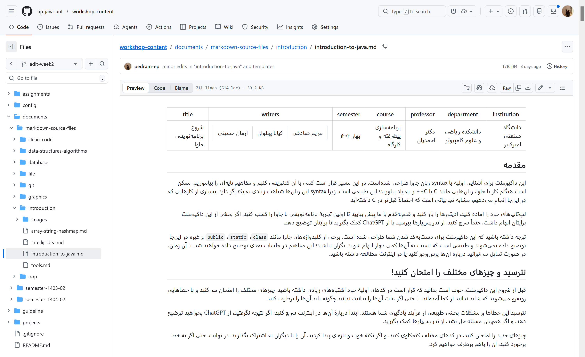
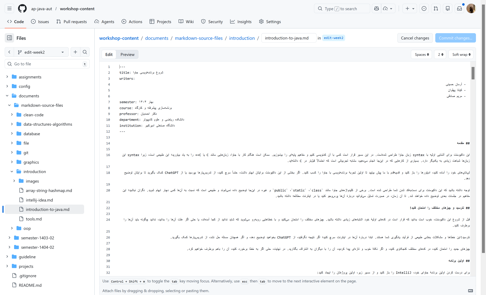

## مقدمه

این داکیومنت با هدف آشنایی با فرمت Markdown و جزییات تکنیکالی که برای ساختن و ادیت کردن داکیومنت‌هایی که توی این فرمت هستن نوشته شده.
داکیومنت‌های این دوره با استفاده از Pandoc از فرمت Markdown به LaTeX تبدیل می‌شن و در نهایت به PDF رندر می‌شن.
یک Lua filter سفارشی این تبدیل رو مدیریت می‌کنه و رفتارهایی مثل راست‌به‌چپ بودن متن فارسی، کدباکس‌ها، تصاویر و جداول رو هندل می‌کنه.

---

## ساختار کلی فایل

هر فایل Markdown باید با یه بلوک YAML frontmatter شروع بشه که متادیتای داکیومنت رو نگه می‌داره:

```yaml
---
title: شروع برنامه‌نویسی جاوا
writers:
  - آرمان حسینی
  - کیانا پهلوان
  - مریم صادقی
semester: ترم دوم ۱۴۰۴-۱۴۰۵
course: برنامه‌سازی پیشرفته و کارگاه
professor: دکتر‌ روح‌الله احمدیان
department: دانشکده ریاضی و علوم کامپیوتر
institution: دانشگاه صنعتی امیرکبیر
---
```

جزییات این بخش مشخص هست، دقت کنید که ترم رو با فرمت «ترم دوم ۱۴۰۴-۱۴۰۵» بنویسید و اسامی رو به درستی وارد کنید.

---

## هدرها (Headers)

هدرها با علامت `#` مشخص می‌شن. تعداد `#` سطح هدر (یا همون سرفصل‌های هر فایل) رو تعیین می‌کنه:

```markdown
## سطح ۲ - section
### سطح ۳ - subsection
#### سطح ۴ - subsubsection
##### سطح ۵ - paragraph
```

> **نکته:** از سطح `#` (chapter) در داکیومنت‌های معمولی استفاده نکنید چون این سطح معمولاً توسط عنوان اصلی داکیومنت اشغال می‌شه.

---

## متن فارسی و انگلیسی

متن فارسی به‌صورت پیش‌فرض راست‌به‌چپ رندر می‌شه. بنابراین سعی کنین جمله‌ی آغازین هر پاراگراف رو با یک کلمه‌ی فارسی شروع کنین. هر جایی که متن انگلیسی دارید، قبل و بعدش یک فاصله بذارید.

یعنی هیچ‌وقت ننویسید:

```markdown
در این بخش Objectها این رفتار را دارند.
```

و به‌جاش بنویسید:

```latex
در این بخش Object ها این رفتار را دارند.
```

دقت کنید که فقط کلماتی باید انگلیسی ساده باشند، که یک اسم یا عبارت انگلیسی باشن. هر وقت که بخوایم بخشی از کد، اسم فایل، و یا خروجی و ورودی کدهامون رو بین متن قرار بدیم، باید قبل و بعدش یک علامت \` یا backtick بذاریم. این مورد توی بخش «کد درون خطی» دقیق‌تر بررسی می‌شه.

**نکات تکمیلی درباره‌ی چگونگی تبدیل فایل مارک‌داون به لتک:**

فیلتر Lua که وظیفه‌ی تبدیل مارک‌داون به لتک رو داره، این نکات رو انجام می‌ده:
- کلمات انگلیسی متوالی با هم در یک `\lr{}` ادغام می‌شن.
- فاصله‌های انتهایی، دونقطه (`:`) یا ویرگول فارسی (`،`) از داخل `\lr{}` بیرون گذاشته می‌شن.
- اعداد و علائم نگارشی ASCII اگه بین کلمات انگلیسی باشن، داخل همون `\lr{}` می‌مونن.

بنابراین لازمه که عبارات انگلیسی رو با یک فاصله از کاراکتر قبلی و کاراکتر بعدیش بنویسید.

---

## کد (Code)

### کد درون‌خطی (Inline Code)

برای نمایش کد داخل متن از backtick یا \`  استفاده کنید. کافیه بخشی از متنتون که کده رو بین دو تا \` بذارید.

```markdown
تابع `print()` برای چاپ خروجی استفاده می‌شه.
```

نمایش: تابع `print()` برای چاپ خروجی استفاده می‌شه.

دقت کنید که تمام کدها، اسم متغیرها، اسم پکیج‌ها، نام فایل‌ها، متدها، و... باید به‌عنوان کد درون‌خطی توی داکیومنت قرار بگیرن. این کدها توی رندر نهایی فونت Monospace خواهند داشت و مشخص شد که جزوی از متن نیستن، و اشاره به یک بخش کد یا یک فایل دارند.

> **نکته فنی:** کد inline اگه فقط شامل کاراکترهای ASCII باشه، به‌صورت خودکار داخل `\lr{\texttt{...}}` قرار می‌گیره تا جهت درست داشته باشه.

### بلوک کد (Code Block)

برای بلوک‌های کد از triple backtick استفاده کنید و زبان برنامه‌نویسی رو مشخص کنید. یعنی در خط قبلی و خط بعدی از کدتون، سه تا \` بذارید و توی خط اول، اسم زبان کد رو هم بنویسید.


````markdown
```python
def hello():
    print("Hello, World!")
```
````

در صورتی که خروجی ترمینال یا کدتون چندخطه، با همین فرمت بلوک کد اون رو قرار بدید و به‌جای زبان، توی خط اولش بنویسید `text`.

---

## قالب‌بندی متن

### متن بولد (Bold)

برای بولد کردن یک متن، باید قبل و بعد از اون متن دو تا علامت \* بذارید.

```markdown
**این متن توپر است**
```

نمایش: **این متن توپر است**

### متن ایتلیک (Italic)

برای ایتلیک کردن یک متن، باید قبل و بعد از اون متن یک تا علامت \* بذارید. 

```markdown
*این متن کج است*
```

نمایش: *این متن کج است*

متاسفانه تمپلیت لتک ما هنوز از متن‌های ایتلیک ساپورت نمی‌کنه، بنابراین سعی کنید این فرمت رو زیاد توی متنتون قرار ندید.

### تصاویر

باید تصاویر رو توی دایرکتوری `\images` ای که با فایل markdown تون یک‌جاست قرار بدین. سعی کنین فرمت نام‌گذاری تصاویر طوری باشه که از بخش ابتداییش مشخص باشه مربوط به چه داکیومنتیه.

در نهایت توی مارک‌داون با سینتکس زیر تصویر خودتون رو قرار بدید:

```mardkown
متن.


متن
```

تصویر شما به شکل زیر نمایش داده می‌شود:

متن


متن

دقت کنید که قبل و بعد از تصویری که قرار می‌دید، حتماً یک خط خالی بذارید. در غیر این صورت convertor ممکنه مشکل داشته باشه.

### لینک‌ها

برای اضافه کردن لینک از سینتکس زیر استفاده کنید:

```markdown
[متن لینک](https://example.com)
```

نمایش: [سایت دانشگاه](https://aut.ac.ir)

دقت کنید که متن داخل براکت `[]` همون چیزیه که توی PDF نمایش داده می‌شه و آدرس داخل پرانتز `()` آدرس واقعی لینکه. لینک‌ها توی PDF به رنگ آبی نمایش داده می‌شن و قابل کلیک هستن.

### لیست‌ها

برای قرار دادن چند مورد توی لیست‌های bullet-point می‌تونید از این سینتکس استفاده کنید:

```markdown
- مورد اول
- مورد دوم
- مورد سوم
```

که به شکل زیر نمایش داده می‌شه:

- مورد اول
- مورد دوم
- مورد سوم

همچنین اگه می‌خواهید لیستتون عدد داشته باشه، باید با اعداد لاتین و یک نقطه، هر مورد لیست رو مشخص کنید:

```markdown
1. مورد اول
2. مورد دوم
3. مورد سوم
```

که به شکل زیر تبدیل می‌شه:

1. مورد اول
2. مورد دوم
3. مورد سوم


همچنین می‌تونید از ترکیب این سینتکس‌ها و اضافه کردن تب (tab) به اول هر مورد، یک لیست چندلایه بسازید:

```markdown
1. مورد اول
  - مورد اولِ مورد اول
2. مورد دوم
3. مورد سوم
  - مورد اولِ مورد سوم
  - مورد دومِ مورد سوم
    - مورد اولِ مورد دومِ مورد سوم
```

که به شکل زیر نمایش داده می‌شه:

1. مورد اول
  - مورد اولِ مورد اول
2. مورد دوم
3. مورد سوم
  - مورد اولِ مورد سوم
  - مورد دومِ مورد سوم
    - مورد اولِ مورد دومِ مورد سوم

 توصیه می‌شه که برای خوانایی بهتر داکیومنت‌ها، لیست‌های چندلایه استفاده نکنین.

 همچنین اگه مواردی دارین که لازمه بینشون توضیحاتش باشه، می‌تونید از همین سینتکس استفاده کنید.

 ```markdown
- مورد اول
توضیحاتی درباره مورد اول
- مورد دوم
چند خط توضیح درباره مورد دوم
چند خط توضیح درباره مورد دوم
- مورد سوم
```

که به شکل زیر نمایش داده می‌شه:

- مورد اول
توضیحاتی درباره مورد اول
- مورد دوم
چند خط توضیح درباره مورد دوم
چند خط توضیح درباره مورد دوم
- مورد سوم


---

## جدول‌ها (Tables)

جدول‌ها با syntax استاندارد Markdown نوشته می‌شن. هر ستون با `|` از هم جدا می‌شه و ردیف دوم که از `-` تشکیل شده، هدر رو از بدنه‌ی جدول جدا می‌کنه:

```markdown
| عنوان ستون ۱ | عنوان ستون ۲ | عنوان ستون ۳ |
|-------------|-------------|-------------|
| داده ۱      | داده ۲      | داده ۳      |
| داده ۴      | داده ۵      | داده ۶      |
```

نمایش:

| عنوان ستون ۱ | عنوان ستون ۲ | عنوان ستون ۳ |
|-------------|-------------|-------------|
| داده ۱      | داده ۲      | داده ۳      |
| داده ۴      | داده ۵      | داده ۶      |

می‌تونید داخل سلول‌های جدول از کد inline هم استفاده کنید:

```markdown
| متد         | توضیح                        |
|------------|------------------------------|
| `println()` | چاپ خروجی با خط جدید        |
| `print()`   | چاپ خروجی بدون خط جدید      |
| `scanf()`   | دریافت ورودی از کاربر        |
```

که به شکل زیر نمایش داده می‌شه:

| متد         | توضیح                        |
|------------|------------------------------|
| `println()` | چاپ خروجی با خط جدید        |
| `print()`   | چاپ خروجی بدون خط جدید      |
| `scanf()`   | دریافت ورودی از کاربر        |


## پانویس‌ها

برای اضافه کردن پانویس به متنتون، باید از سینتکس زیر استفاده کنید:

```markdown
این متن شامل یک پانویس در این [^1] نقطه با شماره‌ی یک است.

همچنین در این [^2] بخش یک پانویس با شماره‌ی دو قرار دارد.

متن مربوط به این پانویس در انتهای فایل و با این فرمت قرار دارد:

[^1]: محتوای متن پانویس اول

[^2]: محتوای متن پانویس دوم
```

دقت کنید که بخش محتوای پانویس‌ها لازم نیست انتهای داکیومنت باشه. حتی توی بعضی از داکیومنت‌های قدیمی، محتوای پانویس‌ها قبل از هدرلاین بعدی قرار گرفتن. ولی سعی کنید محتوای پانویس‌ها در انتهای داکیومنت باشن تا مدیریت تعدادشون راحت‌تر باشه.

کد بالا به شکل زیر نمایش داده می‌شه:

این متن شامل یک پانویس در این [^1] نقطه با شماره‌ی یک است.

همچنین در این [^2] بخش یک پانویس با شماره‌ی دو قرار دارد.

متن مربوط به این پانویس در انتهای فایل و با این فرمت قرار دارد:

[^1]: محتوای متن پانویس اول

[^2]: محتوای متن پانویس دوم


## ادیت راحت فایل‌های مارک‌داون با گیت‌هاب

شما می‌تونید ریپوی تدریس‌یاری رو توی سیستمتون clone کنید و مثل هر فایل دیگه‌ای، توش تغییرات بدین و بعدش کامیت کنین و.. .

اما اگه به هر دلیلی نتونستید این کار رو بکنید، خود گیت‌هاب ادیتور نسبتاً خوبی برای فایل‌های مارک‌داون داره.

1. مطمئن بشید که توی برنچ درست قرار دارید.
ابتدا وارد ریپو بشید و به برنچ دل‌خواهتون برید:


دقت کنید که اگه هنوز برنچ دل‌خواه رو ندارید، می‌تونید روی `View all branches` بزنید و توی صفحه‌ای که باز می‌شه آپشن ساخت برنچ جدید رو دارید.

2. وارد فایل مارک‌داونی که قصد ادیتش رو دارید بشید.

با چنین صفحه‌ای روبه‌رو می‌شید:



اگر آیکون مداد بالا سمت چپ صفحه رو بزنید، می‌تونید این فایل رو ادیت کنید. وقتی این دکمه رو بزنید به چنین صفحه‌ای می‌رسید:



این‌جا می‌تونید متن داکیومنت رو ادیت کنید. هر جا که براتون ابهام داشت، دکمه‌ی `Preview` بالا سمت چپ رو بزنید تا ببینید خروجی این مارک‌داون چه شکلی می‌شه.

در نهایت وقتی بخشی از تعییراتتون کامل شد، می‌تونید دکمه‌ی آبی `Commit Changes` بالا سمت راست صفحه رو بزنید و تغییرات رو کامیت کنید!

## نکاتی درباره کار با گیت

به‌جز سوپروایزرها و سرتدریس‌یارها، هیچ‌کس مجاز به مرج کردن یک برنچ با برنچ `main` نیست. پس حتماً یک برنچ با فرمت نام `edit-document-or-week-name` بسازید و تغییراتتون رو در اون برنچ کامیت کنید و کامیت‌هاتون رو پوش کنید.

در نهایت سوپروایزر اون هفته باید یک Pull Request برای مرج کردن برنچ بسازه و یکی دیگه از سوپروایزرها یا تدریس‌یارها رو به‌عنوان reviewer اون برنچ قرار بده. مرج کردن برنچ فقط بعد از این مورد اتفاق می‌افته.