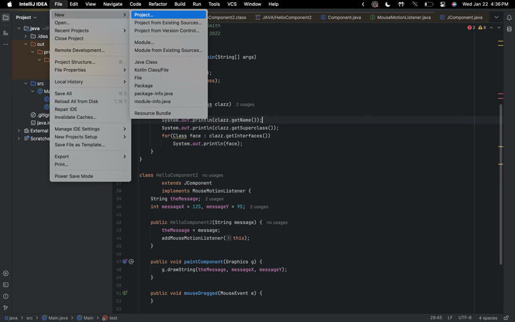
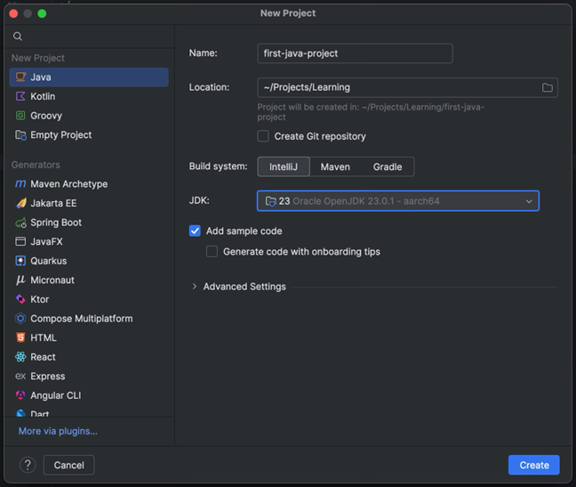
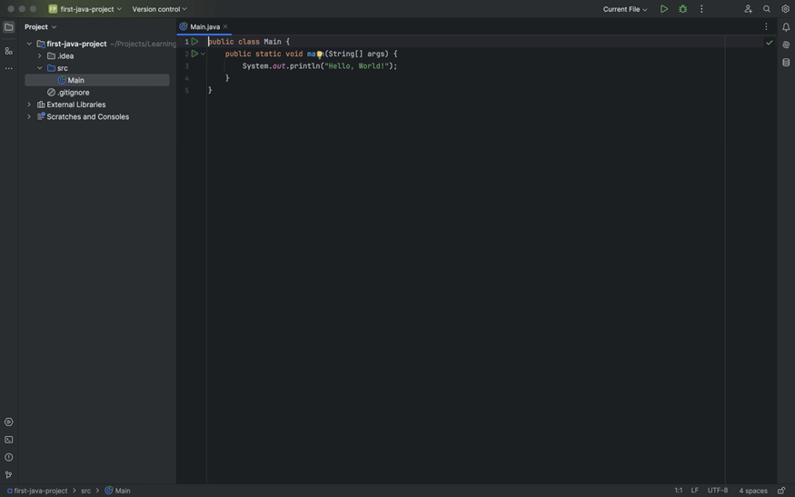
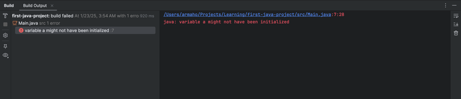
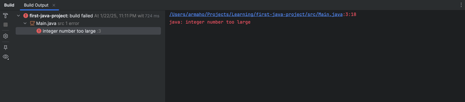
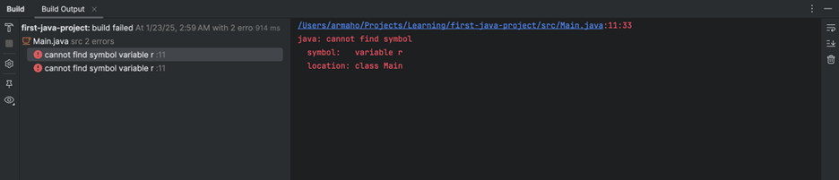
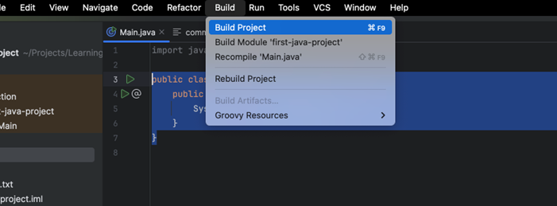
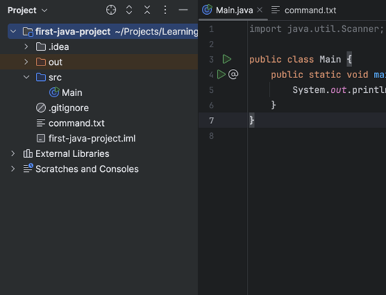
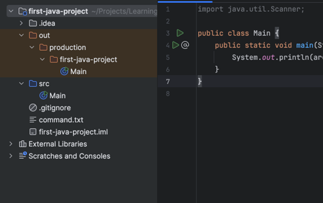

## مقدمه

این داکیومنت برای آشنایی اولیه با syntax زبان جاوا طراحی شده. قراره کمی باهاش کدنویسی کنیم و مفاهیم پایه‌ای رو یاد بگیریم. ممکنه موقع کار با جاوا، یاد زبان‌هایی مثل C یا C++ بیفتید، و این طبیعی هست چون syntax این زبان‌ها شباهت زیادی به هم دارن. بسیاری از کارهایی که اینجا انجام می‌دیم، شبیه چیزی هست که ممکنه قبلاً در C تجربه کرده باشید.

لپ‌تاپ‌هاتون رو آماده کنید، ادیتورهاتون رو باز کنید و قدم به قدم با ما پیش بیاید تا اولین تجربهٔ برنامه‌نویسی با جاوا رو کسب کنید. اگر جایی از این داکیومنت براتون گنگ بود، حتماً سرچ کنید، از تدریس‌یارها بپرسید یا از ChatGPT کمک بخواید تا براتون توضیح بده.

توجه کنید که این داکیومنت، برای دست به کد شدن شماست. بعضی از کلیدواژه‌های جاوا مثل `public`، `static`، `class` و غیره این‌جا توضیح داده نمی‌شن و طبیعیه که نسبت بهشون یه خورده گیج باشین. نگران نباشین! اون‌ها رو توی جلسات بعدی بهتون توضیح می‌دیم. تا اون موقع، اگر دوست داشتید می‌تونید از ما راجع بهشون بپرسین یا توی اینترنت در موردشون بخونین.

## نترسید و چیزهای مختلف رو امتحان کنید!

قبل از شروع داکیومنت، خوبه که این رو بدونید که شما قراره خراب‌کاری‌های زیادی توی کدهای اول‌تون بکنید! چیز‌های مختلف رو امتحان می‌کنین، خطاهایی می‌خورید که هیچ ایده‌ای ندارین از کجا اومدن یا حتی اگر می‌دونین از کجان، نمی‌دونین چجوری باید از شرشون خلاص بشین.

نترسید! کدها رو بشکونید! این خطاها و مشکلات، بخشی از فرآیند یادگیری شما هستن. راجع بهشون اول توی اینترنت سرچ کنید، اگر نشد، از ChatGPT بخواین براتون توضیح بده و اگر حتی اون هم نشد، از تدریس‌یارهاتون بپرسید.

چیزهای جدید رو امتحان کنید، توی کدهای مختلف فضولی کنین و اگر هم چیز خوب و جدیدی پیدا کردین، با باقی به اشتراکش بذارین. فوقش اینه که به خطا می‌خورین و با ما رفعش می‌کنین.

## اولین برنامه

برای درست کردن اولین برنامهٔ جاواتون، IntelliJ رو باز کنید و از مسیر زیر، اولین پروژه‌تون رو ایجاد کنید:



یه صفحه مثل تصویر زیر براتون باز می‌شه. اسم پروژه‌تون رو انتخاب کنید، مطمئن بشید مسیر ذخیره‌سازی درسته و حتماً چک کنید که همون JDKی که قبلاً دانلود کردید، انتخاب شده باشه. من خودم نسخهٔ 23.0.1 رو نصب کردم و برای این پروژه هم از همین نسخه استفاده کردم:



با این کار، اولین پروژهٔ جاوای شما درست می‌شه! همچین صفحه‌ای رو باید ببینین:



این، اولین برنامهٔ شماست. با زدن اون دکمهٔ مثلثی شکل بالای صفحه، برنامه رو run کنید. اگر درست compile و run شد، باید خروجی‌ای مشابه این ببینید:


تبریک! اولین برنامهٔ جاواتون رو اجرا کردین!

### کدی که اجرا کردیم

بیاین ببینیم این کد که اجرا شد، چی بود. منطقا باید چنین کدی روی صفحهٔ ادیتورتون باشه:

```java
public class Main {
   public static void main(String[] args) {  
      System.out.println("Hello, World!");  
   }  
}
```

توی این کد، یک کلاس به اسم `Main` می‌بینید که داخلش یه تابع به اسم `main` قرار داره. بعداً بهتون یاد می‌دیم که کلاس چی هست، `public` چه معنی‌ای داره و چطور می‌تونید کلاس‌های خودتون رو بسازید. ولی فعلاً، تمام توابع و کدهایی که می‌نویسید، توی همین کلاس `Main` قرار می‌گیره و نیازی نیست الان درگیر یادگیری مباحث مربوط به کلاس‌ها بشید.

```java
public class Main {  
   // Your code here  
}
```

داخل این `class`، یه تابع به اسم `main` می‌بینید. توی جاوا، ما به تابع‌هامون می‌گیم `Method` (حواستون باشه که `Function` اصطلاح دقیقی برای اون‌ها نیست). این متد شبیه همون تابع `main` توی C هست که قبلاً باهاش آشنا شدید و همون‌جاییه که برنامه‌تون از اون شروع به اجرا می‌کنه:

```c
public static void main(String[] args) {  
    // Your program starts from here  
}
```

شاید براتون سوال شده باشه که `public static void` و `String [] args` دقیقاً چی هستن. کلیدواژه‌های `public` و `static` جزو مفاهیمی هستن که وقتی وارد مباحث شی‌گرایی بشیم بیشتر در موردشون صحبت می‌کنیم، پس فعلاً لازم نیست نگرانشون باشید.

اما اون `void` احتمالاً از تجربه‌های قبلی‌تون در برنامه‌نویسی براتون آشنا باشه. وقتی `void` توی یه متد استفاده می‌شه، یعنی اون متد هیچ مقداری رو به عنوان خروجی برنمی‌گردونه. اینجا هم همین مفهوم صدق می‌کنه؛ یعنی متد `main` چیزی رو `return` نمی‌کنه.

توی `main`، شما کد زیر رو می‌بینین:

```java
System.out.println("Hello, World!");
```

این تکه کد برای چاپ `"Hello, World!"` نوشته شده. حالا اگه این خط رو پاک کنین و دوباره بنویسینش، متوجه می‌شین که دستور `println` می‌تونه علاوه بر رشته‌ها، انواع دیگه‌ای مثل `int` و `boolean` رو هم چاپ کنه. یعنی به راحتی می‌تونین با همون دستور، مقادیر مختلف رو به خروجی چاپ کنین:

این یکی از ویژگی‌های خوب IntelliJ هست که به شما این امکان رو می‌ده که نوع و نام پارامترهای یک تابع و همچنین خروجی اون رو ببینید. این قابلیت می‌تونه خیلی در نوشتن کد به شما کمک کنه. حالا که صحبت از `int` و boolean و `سایر` نوع‌های داده شد، بیایید اولین متغیرهای خودمون رو توی جاوا تعریف کنیم.

## متغیرها

کد روی صفحه رو به کد زیر تغییر بدین:

```java
public class Main {  
   public static void main(String[] args) {  
      int a = 10;  

      System.out.println(a);  
   }  
}
```

توی این کد، متغیر a رو از جنس `int` تعریف کردیم و مقدار اولیهٔ `10` رو بهش دادیم و بعد اون رو چاپ کردیم. به `int`، `boolean`، `float` و انواع مشابهشون، data type می‌گیم. data type‌های اصلی جاوا که بهشون Primitive data types هم گفته می‌شه، به همراه رنجی که پوشش می‌دن، توی جدول زیر آورده شده. حواستون باشه که اینجا هم مثل C، نباید از رنجی که برای هر تایپ تعریف شده خارج بشید.

| Type      | Definition                               | Approximate range or precision          |
| --------- | ---------------------------------------- | --------------------------------------- |
| `boolean` | Logical Value                            | `true` or `false`                       |
| `char`    | $16$-bit, Unicode character              | $64k$ characters                        |
| `byte`    | $8$-bit, signed integer                  | $-128$ to $127$                         |
| `short`   | $16$-bit, signed integer                 | $-32, 768$ to $32,676$                  |
| `int`     | $32$-bit, signed integer                 | $-2.1\mathrm{e}9$ to $2.1\mathrm{e}9$   |
| `long`    | $64$-bit, signed integer                 | $-9.2\mathrm{e}18$ to $9.2\mathrm{e}18$ |
| `float`   | $32$-bit, IEEE 754, floating-point value | $6-7$ significant decimal places        |
| `double`  | $64$-bit, IEEE 754                       | $15$ significant decimal places         |

شما می‌تونید به شکلی مشابه، متغیرهایی از جنس هر کدوم از این typeها ایجاد و چاپ کنید:

```java
public class Main {
   public static void main(String[] args) {
      int a = 10;
      double b = 3.14;
      boolean c = true;
      char d = 'a';  
  
      System.out.println(a);  
      System.out.println(b);  
      System.out.println(c);  
      System.out.println(d);  
    }  
}
```

خروجی این کد، همون‌طور که انتظار دارین، به شکل زیر هستش:
```
10
3.14
true
a

Process finished with exit code 0
```
شما توی java، یه `type` برای متغیرهاتون به اسم `String` هم دارین، که البته جزو primitive data typeها نیست. مثلا `Hello, World`ای که توی اولین مثال `print` کردین، نمونه‌ای از همین `type` بود. می‌تونید به شکل زیر یه String تعریف کنید:
```java
public class Main {
   public static void main(String[] args) {  
      String str = "Hello, World!";  
  
      System.out.println(str);  
   }  
}
```

علاوه بر این، جاوا یه دستور جدا برای `print` کردن، به سبک `printf`ای که توی C داشتین، داره:

```java
String name = "Arman";  
int age = 27;  

System.out.printf("Name: %s\nAge: %d\n", name, age);
```

شما می‌تونید تمام عملیات‌های ریاضی که توی زبان‌های دیگه مثل C روی متغیرها انجام می‌دادین رو این‌جا هم انجام بدین، طبیعتا جاوا هم مثل همهٔ زبان‌های دیگه، اولویت ریاضی بین اون‌ها رو رعایت می‌کنه:

| Precedence | Operator       | Operand type | Description                          |
| ---------- | -------------- | ------------ | ------------------------------------ |
| 1          | `++, --`       | Arithmetic   | Increment and decrement              |
| 1          | `+, -`         | Arithmetic   | Unary plus and minus                 |
| 1          | `~`            | Integral     | Bitwise complement                   |
| 1          | `!`            | Boolean      | Logical complement                   |
| 1          | `( type )`     | Any          | Cast                                 |
| 2          | `*, /, %`      | Arithmetic   | Multiplication, division, remainder  |
| 3          | `+, -`         | Arithmetic   | Addition and substraction            |
| 3          | `+`            | String       | String concatenation                 |
| 4          | `<<`           | Integral     | Left shift                           |
| 4          | `>>`           | Integral     | Right shift with sign extension      |
| 4          | `>>>`          | Integral     | Right shift with no extension        |
| 5          | `<, <=, >, >=` | Arithmetic   | Numeric comparison                   |
| 5          | `instanceof`   | Object       | Type comparison                      |
| 6          | `==, !=`       | Primitive    | Equality and inequality of value     |
| 6          | `==, !=`       | Object       | Equality and inequality of reference |
| 7          | `&`            | Integral     | Bitwise AND                          |
| 7          | `&`            | Boolean      | Boolean AND                          |
| 8          | `^`            | Integral     | Bitwise XOR                          |
| 8          | `^`            | Boolean      | Boolean XOR                          |
| 9          | `\|`           | Integral     | Bitwise OR                           |
| 9          | `\|`           | Boolean      | Boolean OR                           |
| 10         | `&&`           | Boolean      | Conditional AND                      |
| 11         | `\|\|`         | Boolean      | Conditional OR                       |
| 12         | `?:`           | N/A          | Conditional ternary operator         |
| 13         | `=`            | Any          | Assignment                           |

می‌تونید متغیرها رو، موقع ساختشون مقداردهی نکنید و صرفا به نوشتن typeشون اکتفا کنید:

```java
public static void main(String[] args) {  
   int a;  
}
```

ولی حتما باید قبل از استفاده از اون‌ها، بهشون یه مقدار بدین. وگرنه جاوا نمی‌ذاره که برنامه‌تون رو compile کنین. به عنوان مثال، اگر تلاش کنید تا کد زیر رو اجرا کنین:

```java
int a;  
System.out.println(a);
```

جاوا خطای زیر رو بهتون می‌ده:



وقتی یه متغیر رو موقع تعریف کردنش مقداردهی می‌کنید، می‌تونید از کلیدواژهٔ `var` استفاده کنید تا کامپایلر جاوا خودش نوع متغیر رو بر اساس مقداری که بهش داده میشه، تشخیص بده. اینطوری دیگه نیازی به مشخص کردن دستی نوع متغیر نیست.

```java
var a = 10;  
var b = 20;  

System.out.println(a + b);
```

توی کد بالا، چون مقادیر `10` و `20` رو به `a` و `b` دادین، کامپایلر جاوا متوجه می‌شه که این دو متغیر از نوع `int` هستن و باهاشون مثل `int` برخورد می‌کنه. نکته اینه که `var` یه data type جدید نیست، فقط یک روش برای راحت‌تر کردن کار شماست که دیگه لازم نیست برای همهٔ متغیرها، typeشون رو بنویسید. کامپایلر خودش نوع متغیرها رو براساس مقدار اولیه‌ای که می‌گیرن، تشخیص می‌ده.

## لیترال‌ها

کد زیر رو توی IDEتون اجرا کنین:

```java
public static void main(String[] args) {  
   long a = 99999999999;  

   System.out.println(a);  
}
```

با تلاش برای اجرای اون، به خطای زیر می‌خورین:



این خطا، یه خورده عجیبه. با این که شما برای این عدد خیلی بزرگ، از یه متغیر `long` استفاده کردین که باید اون رو توی خودش جا بده، ولی باز هم به خطای `number too large` می‌خورین. چرا؟

خطی که a رو توش تعریف کردین با خط زیر جایگزین کنید:

```java
long a = 99999999999L;
```

مشکل حل شد، درسته؟ خطای قبلی به خاطر نوع متغیر `a` نبود. متغیر `long` می‌تونه اعداد خیلی بزرگتری رو هم نگه داره. مشکل این بود که خود جاوا نمی‌دونست باید با عدد `99999999999` چطور برخورد کنه. آیا باید اون رو به عنوان `int`، `long` یا حتی `double` در نظر بگیره؟ توی کد دوم، با گذاشتن `L` در انتهای عدد، شما به جاوا گفتین که این عدد از نوع `long` هست و باید باهاش مثل یک `long` برخورد کنه.

به اعداد و کاراکترهایی که توی برنامه‌تون hard code می‌کنین، `literal` می‌گن. کد زیر، شامل ۳تا `literal ‍ه`:

```java
int r = 10;  
char next_line = '\n';  

System.out.printf("Circle area: %f%c", 3.14 * r * r, next_line);
```

این `literal`ها به ترتیب `10`، `'\n'` و `3.14` هستن. همونطور که قبلاً گفتیم، `literal` ها هم مثل متغیرها type دارن. مثلاً عدد `123` از نوع `int` هست و `123L` از نوع `long`. همینطور وقتی عددی مثل `3.14` رو به صورت اعشاری تعریف می‌کنید، به طور پیش‌فرض جاوا نوع اون رو `double` در نظر می‌گیره و اگه بخواید که نوعش `float` باشه باید از `3.14F` استفاده کنید. همچنین می‌تونید از نمایش علمی برای اعداد اعشاری هم استفاده کنید:

```java
double d = 8.31;  
double e = 3.00e+8;  
float f = 8.31F;  
float g = 3.00e+8F;
```

می‌تونین وقتی دارین با اعداد خیلی بزرگ سر و کله می‌زنین، با استفاده از `_` ارقام اون‌ها رو جدا کنین تا راحت‌تر خونده بشن:

```java
int a = 999999999; // Very hard to read!  
int b = 999_999_999; // Easy :)  

System.out.printf("a = %d, b = %d\n", a, b);
```

توی کد بالا، مقادیر `a` و `b` یکسان هستن، ولی یکی‌شون رو خیلی راحت‌تر می‌شه خوند!

## ثابت‌ها

توی کد زیر، یه constant به اسم `MAX_AGE` رو توی جاوا تعریف کردیم:

```java
public class Main {
   public static final int MAX_AGE = 99;

   public static void main(String[] args) {
      int age = 102;

      if (age > MAX_AGE) {  
         System.out.println("You're too old!");  
      }  
   }  
}
```

این‌جا هم لازم نیست با `public static` ای که قبل `MAX_AGE` اومده کاری داشته باشین، توی داکیومنت‌های بعدی حسابی با اون‌ها آشنا می‌شیم و باهاشون کار می‌کنیم. کلیدواژهٔ `final` به شما این امکان رو می‌ده که یک constant تعریف کنید. constantها، بعد از تعریف و مقداردهی‌شون، هیچ وقت مقدارشون عوض نمی‌شه.

## شرط‌ها

شرط‌های java، خیلی شبیه C هستن، می‌تونین با سینتکس زیر از اون‌ها استفاده کنین:

```java
int radius = 10;

if (radius <= 20) {  
   System.out.println("Radius is too small");  
} else if (radius >= 50 && radius <= 100) {  
   System.out.println("Radius is too big");  
} else {  
   System.out.println("Other stuff");  
}
```

فقط حواستون باشه که `String` ها رو با `==` مقایسه نکنید. اگر این کار رو بکنید، خود IntelliJ بهتون یه warning می‌ده و ازتون می‌خواد که از متد `equals` استفاده کنین:


شیوهٔ درست مقایسهٔ `String` ها توی جاوا به این شکل هست:
```java
if (a.equals("Arman")) {
   // Do something
}
```

علت این اتفاق، این هستش که همون‌طور که قبلا گفتیم، `String` یک primitive type نیست و reference type ‍ه، توی جلسات بعدی هر دوی این‌ها رو تعریف می‌کنیم و تفاوت‌هاشون رو با هم می‌گیم.

همچنین، همیشه سعی کنین به warning ها، hint ها و کلاً ابزارهایی که IntelliJ بهتون می‌ده توجه کنید، می‌تونید کدتون رو باهاشون بهتر کنید و ازشون چیز میز یاد بگیرید.

## حلقه‌ها

توی جاوا، دو نوع اصلی حلقه داریم، `for` ها و `while` ها. اگر اون‌ها رو از C یا زبان‌های دیگه یادتونه، تقریبا همونه!

توی کد زیر یه `for` صدتایی می‌زنیم:

```java
for (int i = 0; i < 100; i++) {  
   System.out.println(i);  
   int j = i;  
   // do any other work needed  
}
```

همون‌طور که می‌بینید، syntax حلقهٔ `for` توی جاوا خیلی شبیه به زبان C‍ ه، و هر کاری اون‌جا می‌کردین رو می‌تونین این‌جا هم بکنین. می‌تونین به جای `i++` هر عبارت مشابه دیگه که تغییری در `i` ایجاد می‌کنه رو بذارین. هر دوی `for` های زیر، درستن. اون‌ها رو اجرا کنید و خروجی‌شون رو بررسی کنین:

```java
for (int i = 0; i < 100; i += 2) {  
    System.out.println(i);  
}
```

```java
for (int i = 0; i < 100;) {  
    System.out.println(i);  
}
```

توی حلقهٔ دوم، به کل i رو بعد از هر iteration تغییری نمی‌دیم. این باعث می‌شه که تا هر وقت که برنامه اجرا بشه، `0` چاپ کنیم. حتی حلقهٔ زیر هم درست هستش:

```java
for (; true;) {  
    System.out.println("running forever!");  
}
```

تنها چیزی که گذاشتنش توی حلقهٔ `for` اجباری هست، شرط تکرار حلقه‌ست. مثلا همون `true` ای که توی کد بالا گذاشتیم. هر دو بخش دیگه رو می‌تونین کنار بذارین.

حلقهٔ `while` هم، مشابه زبان C هستش. به شکل زیر می‌تونیم یکی درست کنیم:

```java
int count = 10;
while (count > 0) {  
    System.out.println("Counting down: " + count);
    // maybe do other useful things  
    // and decrement our count
    count = count - 1;  
}  
System.out.println("Done");
```

توی java، ما `do while` هم داریم. این نوع حلقه، شبیه `while` ‍ه، با این تفاوت که اول کدهای داخل `while` اجرا می‌شه، بعد از اون شرطش چک می‌شه، و این فرآیند تا زمانی که شرط درست باشه ادامه پیدا می‌کنه. پس کد داخل `do while`، حداقل یک بار اجرا می‌شه، حتی اگر شرط `while` غلط باشه.

```java
int i = 0;
do {  
    System.out.println(i);  
    i++;  
} while (i < 5);
```

شاید یه خورده در مورد do while گیج شده باشین. نگران نباشین، در آینده کاربردها و شکل استفاده ازش رو می‌بینین.

علاوه بر همهٔ این‌ها، برای این که روی اعضای یک آرایه، لیست و چیزهای مشابه iterate کنیم هم یک نوع خاص از `for` داریم، که توی داکیومنت‌های بعدی باهاش آشنا می‌شین.

مثل C، این‌جا هم می‌تونید از `break` یا `continue` توی حلقه‌هاتون استفاده کنین:

```java
for (int i = 0; i < 10; i++) {
    if (i == 5)
        continue;  
    System.out.println(i);  
}
```

```java
while(true) {
    if (watchForErrors())
        break;
    // No errors yet so do some work...
}
// The "break" will cause execution to  
// resume here, after the while loop
```

شاید حواستون نبوده باشه، ولی `if` های دو کد بالا آکولاد ندارن! توی جاوا، اگر کد داخل یک `if`، `for`، `while`، `else` یا هر چیز بلوک‌دار دیگه‌ای تک‌خطی باشه، لازم نیست که براش آکولاد بذارین.

## متد‌ها

می‌تونیم به شکل زیر توی جاوا، Method ای مثل `checkEmail` تعریف کنیم:

```java
public class Main {
    // this method will return true if the email contains the character '@'  
    // and false otherwise
    public static boolean checkEmail(String email) {
        int emailLength = email.length();

        for (int i = 0; i < emailLength; i++) {
            if (email.charAt(i) == '@') { // email.charAt(i) will return the i-th character of the email
                return true;  
            }  
        }
        return false;  
    }

    public static void main(String[] args) {  
        String email = "armanhosseini@gmail.com";

        if (!checkEmail(email)) {  
            System.out.printf("%s is not a valid email address\n", email);  
        } else {  
            System.out.println("Ok");  
        }  
    }  
}
```

وظیفهٔ این متد اینه که بررسی کنه آیا ایمیل ورودی کاراکتر `@` رو داره یا نه. احتمالاً تا این‌جا می‌دونید که قراره در آینده توضیح بدیم که چرا از `public static` استفاده می‌کنیم. فعلاً باید این رو بدونید که برای هر چیزی که داخل کلاس `Main` تعریف می‌کنید، باید اون رو قبل از استفاده بنویسید.

همونطور که می‌بینید، تعریف متدها توی جاوا مشابه Function های زبان C هست و از این نظر شباهت زیادی داره. پس هر کاری که توی C می‌کردید، اینجا هم همونطور عمل می‌کنید! مثال بعدی، عدد $n$-ام فیبوناچی رو به شکلی بازگشتی چاپ می‌کنه:

```java
public class Main {
    public static int fib(int n) {
        if (n == 0)
            return 1;
        if (n == 1)
            return 1;

        return fib(n - 1) + fib(n - 2);  
    }

    public static void main(String[] args) {
        int n = 10;  
  
        System.out.println(fib(n));  
    }  
}
```

حواستون باشه که فعلا، method هاتون رو بیرون از کلاس `Main` تعریف نکنید.

## بلوک‌ها

به اصطلاح، به هر چیزی که بین دو آکولاد `{}` می‌نویسید، یک block می‌گن. به عنوان مثال، کد زیر ۳ block تعریف می‌کنه:

```java
public class Main {
    public static void main(String[] args) {
        for (int i = 0; i < 10; i++) {  
            System.out.println(i);  
        }  
    }  
}
```

شاید براتون جالب باشه که برای تعریف یک block، حتی نیازی استفاده از `if`، `for`، یا امثال اون‌ها نیست و می‌تونید بدون استفاده ازشون یه block برای خودتون تعریف کنین:

```java
public class Main {
    public static void main(String[] args) {
        float pi = 3.14F;  
  
        {
            int r = 12;  
            System.out.println(pi * r * r);  
        }  
    }  
}
```

مثل زبان‌های دیگه، متغیرهایی که توی یه block تعریف می‌شن متعلق به همون block هستن یا به عبارتی، scopeشون اون block هست. به این متغیر‌ها، متغیرهای محلی یا local variables هم می‌گن. به همین خاطره که اگر کد زیر رو اجرا کنید:

```java
float pi = 3.14F;  
  
{
    int r = 12;  
}  
  
System.out.println(pi * r * r);
```

خطای زیر رو می‌گیرید:



این اتفاق، برای شما به این معنیه که نمی‌تونید از متغیرهای محلی که داخل کدهای `if`، `for`، method ها یا هر چیز block دار دیگه‌ای، بیرون اون استفاده کنید.

## ورودی

ورودی گرفتن توی java، یه مقدار با زبان‌های دیگه فرق داره. برای استفاده از اون، اول باید یه `object` از جنس `Scanner` با استفاده از `System.in` درست کنید. اگر جملهٔ قبلی براتون بی‌مفهوم بود، نگرانش نباشید! وقتی شی‌گرایی رو یاد گرفتین بهتر باهاش ارتباط می‌گیرین. برای الآن، کد زیر رو بالای متد mainتون پیست کنید:

```java
var scn = new Scanner(System.in);
```

دقت کنید که برای استفاده از اون، باید `java.util.Scanner` رو `import` کرده باشین. `import` کردن، برای استفاده از کدیه که توی فایل فعلی شما وجود نداره. کافیه خط زیر رو به ابتدای برنامه‌تون اضافه کنید:

```java
import java.util.Scanner;
```

حالا می‌تونید متدهای مختلف `scn` رو برای خوندن ورودی کاربر استفاده کنین. مثلا با استفاده از `nextInt()`، می‌تونید عددی که کاربر به عنوان ورودی می‌ده رو بخونین:

```java
import java.util.Scanner;

public class Main {
    public static void main(String[] args) {
        var scn = new Scanner(System.in);  
  
        System.out.print("Enter your age: ");
        int age = scn.nextInt();

        if (age >= 18) {  
            System.out.println("You're an adult now.");  
        }  
    }  
}
```

این کد رو امتحان کنید تا ورودی و خروجی IntelliJ هم یک نگاه انداخته باشین.

برای خوندن یک `String` از ورودی کاربر، از` nextLine()` استفاده کنید:

```java
public class Main {
    public static void main(String[] args) {
        var scn = new Scanner(System.in);  
  
        System.out.print("gmail: ");  
        String email = scn.nextLine();

        if (!email.contains("@gmail.com")) {  
            System.out.println("provide a valid gmail address");  
        }  
    }  
}
```

آبجکت Scanner متود های مشابه دیگه‌ای هم بهتون می‌ده که می‌تونید به شکلی مشابه‌ ازشون استفاده کنید:

| Method          | Description                         |
| --------------- | ----------------------------------- |
| `nextBoolean()` | Reads a boolean value from the user |
| `nextByte()`    | Reads a byte value from the user    |
| `nextDouble()`  | Reads a double value from the user  |
| `nextFloat()`   | Reads a float value from the user   |
| `nextInt()`     | Reads a int value from the user     |
| `nextLine()`    | Reads a String value from the user  |
| `nextLong()`    | Reads a long value from the user    |
| `nextShort()`   | Reads a short value from the user   |
## Command-Line Arguments

شاید حواستون نبوده باشه، ولی ما هنوز نگفتیم که `String[] args` توی ورودی‌های متد `main` چه کار می‌کنه. `args`، ورودی‌هایی هست که از طریق Command-Line به برنامهٔ شما داده شدن. در ادامه، با هم کاربرد اون‌ها رو بررسی می‌کنیم.

کد جاواتون رو به کد زیر تغییر بدین:

```java
public class Main {
    public static void main(String[] args) {  
        System.out.println("Given arg: " + args[0]);  
    }  
}
```

از منوی بالای IntelliJ، Build > Build Project رو انتخاب کنین تا کدتون کامپایل بشه.



بعد از این کار، باید کنار کدهاتون یه دایرکتوری به اسم out درست شده باشه که شامل کد کامپایل‌شده‌تون هست:



روی out کلیک کنید، و روی production هم کلیک کنید تا یه دایرکتوری به اسم خود پروژه‌تون ببینید. اونم باز کنید:



اون فایل `Main` که توی `out` می‌بینید، کد کامپایل‌شده‌تونه. اگر روش دبل‌کلیک کنید، IntelliJ براتون decompile ش می‌کنه و کدی مشابه کد خودتون بهتون نشون می‌ده. روی دایرکتوری `out/production/{your-project-name}` راست کلیک کنید و دکمهٔ Copy Path/Reference… رو بزنین:

همچین صفحه‌ای براتون باز می‌شه. Absolute Path رو بزنید.


حالا که مسیر خروجی بیلد رو کپی کردین، می‌تونین با استفاده از command-line برنامه‌تون رو اجرا کنید.

اگر Windows دارین، cmd و اگر macOS/Linux دارین، terminal رو باز کنید. اول از همه چک کنید که دستور زیر براتون کار کنه:

```bash
java --version
```

باید خروجی‌ای مشابه این ببینید:

```bash
java 23.0.1 2024-10-15  
Java(TM) SE Runtime Environment (build 23.0.1+11-39)  
Java HotSpot(TM) 64-Bit Server VM (build 23.0.1+11-39, mixed mode, sharing
```

اگر این‌طور نبود، یا راجع به مشکل سرچ کنید، یا نزدیک‌ترین تدریس‌یار رو خبر کنید تا با هم درستش کنین. در غیر این صورت، با استفاده از دستور cd به دایرکتوری خروجی بیلدتون (که بالاتر کپی‌ش‌ کردین) برین:

```bash
cd /Users/armaho/Projects/Learning/first-java-project/out/production/first-java-project
```

حواستون باشه که به جای مسیری که من به cd دادم، مسیری که خودتون دادین رو بذارین.

اگر همه چیز درست انجام شده باشه، می‌تونید با استفاده از دستور زیر برنامه‌تون رو اجرا کنید. به اون `ThisIsAnArgument` که نوشتیم، command-line argument می‌گن و یکی از راه‌های ورودی دادن به یه برنامه‌ست:

```bash
java Main ThisIsAnArgument
```

می‌بینید که خروجی‌تون به همچین شکلی هستش:

```bash
Given arg: ThisIsAnArgument
```

اگر خروجی‌تون درست باشه، شما موفق شدین که یک argument رو از command-line بخونید، و اون رو خروجی بدین. ممکن بود بیش از یک argument داشته باشین:

```bash
java Main arg1 arg2 arg3
```

جاوا، تمام این ورودی‌ها رو از طریق آرایهٔ `args` که ورودی متد `main` هست در اختیارتون می‌ذاره.

## غیرفعال کردن Inline Completion در IntelliJ

حالا که با زبان جاوا آشنا شدین، حتما کدهای جلسات ابتدایی کارگاه و تمرین‌هاتون رو بدون استفاده از Inline Completion بزنین تا خود IntelliJ کدهاتون رو کامل نکنه. این کار، باعث می‌شه که مبانی زبان جاوا رو بهتر یاد بگیرید. نگران نباشین! یکی-دو جلسهٔ دیگه دوباره اون رو روشن می‌کنید، چون برنامه‌نویس‌ها هر روز ازش استفاده می‌کنن تا سریع‌تر کد بزنن.

برای خاموش کردن اون، به تنظیمات IntelliJ برین. بعدش به مسیر Editor > General > Inline Completion برین تا صفحهٔ زیر رو ببینین:


تیک Enable automatic completion on typing رو بردارین و دکمهٔ Apply رو بزنین.

## چه چیزی یاد گرفتیم؟

توی این داکیومنت، شما فهمیدین که:

- چطور یه پروژهٔ جدید جاوا تعریف کنین و اجراش کنین.
- چجوری ورودی بگیرین و خروجی بدین.
- انواع متغیرهای پایه توی جاوا چی هستن و هر کدوم چجوری تعریف و استفاده می‌شن.
- حلقه‌ها توی جاوا چطوری کار می‌کنن.
- چجوری می‌تونین با استفاده از متدها، کدتون رو یه تکه‌های کوچک‌تر تقسیم کنین.
- بلوک‌ها چی هستن.

اگر توی هر کدوم از این مفاهیم مشکلی دارین، حتما با نزدیک‌ترین تدریس‌یار مطرحش کنین. حتی اگر سوالی به نظرتون خیلی واضح می‌رسه، می‌تونین از تدریس‌یارها بخواین که جوابش رو بهتون بدن و لازم نیست هوشمندانه‌ بودن سوالتون رو معیاری برای پرسیدن یا نپرسیدنش بدونید.