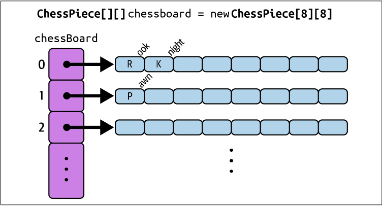

## مقدمه
این داکیومنت برای آشنایی با چند ساختمان داده (data structure) آشنا در زبان جاوا هست، قراره یاد بگیریم که این ساختمان داده ها به طور کلی به چه نحوی عمل می‌کنند و چه توابعی برای کار کردن با اونا وجود داره.

## آرایه - Array
اگه بخواید یه سری داده هم‌نوع رو ذخیره کنید، می‌تونید برای هر کدوم یه متغیر جداگانه درست کنید و مقدار بدید، اما این روش خیلی بهینه نیست! راه بهتر اینه که از آرایه استفاده کنید. آرایه یه ساختار داده‌است که می‌تونه چندین مقدار هم‌نوع رو توی یه متغیر نگه داره و مدیریت این داده‌ها رو خیلی راحت‌تر می‌کنه. شما مشابه این data structure رو توی C هم دیدین.

بیایید ببینیم آرایه چه ویژگی‌هایی داره و چجوری کار می‌کنه:

- **اندیس گذاری (Indexing):** همون‌طور که احتمالا از C یادتونه، آرایه‌ها zero-based هستن، یعنی اولین عنصرشون اندیس ۰ داره و آخرین عنصرشون اندیس $(n-1)$ خواهد داشت که $n$ همون اندازه‌ی آرایه‌ست. مثلاً اگه یه آرایه ۵تایی داشته باشیم، ایندکس‌هاش از ۰ تا ۴ شماره‌گذاری می‌شن.
- **اندازهٔ ثابت:** وقتی یه آرایه رو می‌سازیم، اندازه‌اش همون موقع مشخص می‌شه و دیگه بعدش نمی‌تونیم بزرگ‌تر یا کوچک‌ترش کنیم.
- **نوع داده یکسان:** همه‌ی خونه‌های یه آرایه باید از یه نوع داده باشن، مثلاً اگه نوع داده‌ی آرایه `int` باشه، نمی‌تونیم توش `String` یا `float` بذاریم. همه‌ی اعضای آرایه باید با هم هم‌نوع باشن. حالا بیایید ببینیم که آرایه توی جاوا چطور کار می‌کنه.

### تعریف آرایه در جاوا

حالا می‌خواهیم آرایه رو تعریف کنیم، این کار رو می‌تونیم به دو روش انجام بدیم.

**تعریف آرایه بدون مقدار دهی اولیه:** تو این حالت فقط نوع داده‌ای که می‌خواهیم ذخیره کنیم و اندازه‌ی آرایه مشخص میشه:
```java
int[] numbers = new int[5];
```

توی کد بالا، یه آرایهٔ پنج عضوی تعریف کردیم، ولی مقادیر اولیهٔ اعضای اون رو مشخص نکردیم. با این کار، اعضای آرایه مقدار دیفالت typeشون رو به خودشون می‌گیرن. مثلا مقدار دیفالت یه متغیر int که مقداردهی نشده، صفره؛ به خاطر همین موضوع اعضای آرایهٔ بالا همگی صفر هستن. این رو می‌تونین با چاپ این آرایه بررسی کنید:

```java
for (int i = 0; i < numbers.length; i++) {  
    System.out.print(numbers[i] + ", ");  
}
```

خروجی کد بالا، به شکل زیر خواهد بود:

```
0, 0, 0, 0, 0,
```

مقادیر دیفالت typeهای عددی مثل `int`، `float` و غیره توی جاوا صفره. مقدار دیفالت `boolean` همون `false`ئه و مقدار دیفالت `char` هم `‘n\’`ئه. مقدار دیفالت reference typeها اما همیشه `null`ئه که توی مباحث مربوط به OOP راجع به اون‌ها می‌خونید.

**تعریف آرایه با مقدار دهی اولیه:** تو این حالت مقادیر آرایه همون موقع که تعریف می‌کنیم مشخص می‌شن.

```java
int[] numbers = {1, 2, 3};
```

### دسترسی به عناصر آرایه

بالاتر هم دیدین، توی C هم دیدین! برای دسترسی به عناصر یه آرایه، مثل کد زیر از indexشون استفاده می‌کنیم:

```java
public class Main {
    public static void main(String[] args) {
        int[] numbers = {1, 2, 3};
        int firstNumber = numbers[0];
        numbers[2] = 25;

        System.out.println(numbers);
    }  
}
```

### پیمایش بر روی آرایه

حالا بیایید تک تک عناصر آرایه رو با استفاده از اندیس و یک حلقهfor چاپ کنیم.
```java
public class Main {
    public static void main(String[] args) {
        int[] numbers = {1, 2, 3};
        for (int i = 0; i < numbers.length; i++) { 
            System.out.println("Index " + i + ": " + numbers[i]);
        }  
    }  
}
```

ما، طول یک آرایه رو با استفاده از `numbers.length` به دست میاریم. به متغیرهایی مثل `length`، variable یا fieldهای یک کلاس می‌گن که از متغیرهای مربوط به اون کلاسه. با این متغیرها و انواعشون وقتی OOP رو یاد گرفتین بیشتر آشنا می‌شین. تا اون موقع، بیاین چندتا از متدها و فیلدهای پرکاربرد آرایه رو بررسی کنیم:

### متدها و فیلدهای کاربردی مرتبط با آرایه
###### length

length طول آرایه را به شما نشان می‌دهد:

```java
int[] numbers = {1, 2, 3};
System.out.println("Array length: " + numbers.length); // Array length: 3
```

###### System.arraycopy

برای کپی کردن آرایه‌ها می‌تونید از متد `System.arraycopy()` استفاده کنید، می‌تونید با استفاده از کد زیر، که آرایهٔ‌ `numbers` رو توی `copiedArray` کپی می‌کنه، این متد رو بررسی کنید:
```java
int[] numbers = {1, 2, 3};
int[] copiedArray = new int[numbers.length];  
  
System.arraycopy(numbers, 0, copiedArray, 0, numbers.length);  
  
System.out.print("Copied array: ");
for (int i = 0; i < copiedArray.length; i++) {  
    System.out.print(copiedArray[i] + " ");  
}
```

خروجی این کد، به شکل زیر هستش:
```
Copied array: 1 2 3
```

###### Arrays.sort
با استفاده از متد `Arrays.sort`، می‌تونید آرایه‌ها رو سورت کنید. قبل از استفاده از اون، حواستون باشه که پکیج (package) `java.util.Arrays` رو `import` کرده باشید:

```java
import java.util.Arrays;   
  
public class Main {
    public static void main(String[] args) { 
        int[] numbers = {5, 3, 8, 1, 2};
        System.out.println("Original array: " + Arrays.toString(numbers)); 

        Arrays.sort(numbers); 
        System.out.println("Sorted array: " + Arrays.toString(numbers));
    }  
}
```

حال که آرایه یک بعدی را یاد گرفته ایم به یک مرحله بالاتر برویم و در مورد آرایه چند بعدی صحبت کنیم.

## آرایه‌های چندبعدی

آرایه‌های چندبعدی برای ذخیره و مدیریت داده‌های پیچیده‌تر به کار میرن. تصویر پایین هم یه مثال خوب از آرایه دو بعدی رو نشون می‌ده:



همون‌طور که تو شکل می‌بینید، هر کدوم از عناصر آرایه بیرونی، خودشون یک آرایه هستن. برای راحت‌تر فهمیدن، می‌تونید آرایه دو بعدی رو مثل یه ماتریس در نظر بگیرید.

### تعریف آرایه چند بعدی در جاوا

اول از همه، نحوه تعریف آرایه‌های دو بعدی و چند بعدی رو می‌گیم که مثل آرایه یک‌بعدی، به دو روش مختلف میشه انجامش داد.

**تعریف آرایه دو بعدی و چند بعدی بدون مقدار دهی اولیه:** مثل قبل، می‌تونید بدون مقداردهی اولیه آرایه تعریف کنید و باز هم خونه‌های آرایه‌ها با مقدار دیفالت typeشون پر می‌شن.

```java
// 2D array with 3 rows and 4 columns
int[][] matrix = new int[3][4];

// 3D array with 3 layers, each containing 3 rows and 3 columns
int[][][] cube = new int[3][3][3];  
  
System.out.println(matrix[0][0]); // 0
System.out.println(cube[0][0][0]); // 0
```

**تعریف آرایه دو بعدی و چند بعدی با مقدار دهی اولیه:** این روش هم، مشابه آرایه‌های یه بعدی هست:
```java
int[][] matrix = {  
        {1, 2, 3},  
        {4, 5, 6},  
        {7, 8, 9}  
};

int[][][] cube = {  
        {  
                {1, 2, 3},  
                {4, 5, 6}  
        },  
        {  
                {7, 8, 9},  
                {10, 11, 12}  
        }  
};
```

### دسترسی به عناصر آرایه‌های چند بعدی

مجددا، با استفاده از اندیس‌ها، مثل C، می‌تونیم به عناصر آرایه‌های چندبعدی دست پیدا کنیم:

```java
int[][] matrix = {  
        {1, 2, 3},  
        {4, 5, 6},  
        {7, 8, 9}  
};  
  
int value1 = matrix[1][2];  
matrix[0][1] = 42;
```

### پیمایش آرایه‌های چند بعدی

حالا بیایید تک تک عناصر آرایه رو با استفاده از اندیس و یک حلقهfor چاپ کنیم.

```java
public class Main {
    public static void main(String[] args) { 
        int[][] matrix = {  
                {1, 2, 3},
                {4, 5, 6},
                {7, 8, 9}  
        };

        System.out.println("Matrix contents:");  
        for (int i = 0; i < matrix.length; i++) {
            for (int j = 0; j < matrix[i].length; j++) {  
                System.out.print(matrix[i][j] + " ");
            System.out.println();
        }  
    }  
}
```

تنها چیزی که توی این کد، نسبت به کدی که برای آرایهٔ یک‌بعدی زدیم جدیده، متغیر jئه که از صفر شروع می‌شه و تا `matrix[i].length` پیش می‌ره. `matrix[i].length`، در واقع طول $i$-امین آرایه‌ایه که توی matrix هست.

## ArrayList

تصور کنید که یه ساختمان داده داشته باشیم که شبیه آرایه باشه، ولی بتونیم اندازه‌اش رو هر موقع که خواستیم تغییر بدیم. این ویژگی رو ArrayList به ما می‌ده. ArrayList، سایز متغیری داره که اون رو بر اساس مقادیر داخلش مشخص می‌کنه، و استفاده از اون خیلی شبیه به یک Array معمولیه. حالا می‌خوایم یک Array List بسازیم و بعدش مهم‌ترین متدهایی که داره رو توضیح بدیم.

### reference typeهای معادل primitive typeها در جاوا

برای هر primitive type توی جاوا، مثل `int`، `boolean`، `char` و امثال اون‌ها، یه معادل از جنس reference type وجود داره. وقتی که با مفهوم objectها بیشتر آشنا بشیم، این موضوع رو مجددا بررسی می‌کنیم، ولی چون برای `ArrayList` به اون‌ها نیاز داریم، لازمه که یک نگاه مختصر بهشون بندازیم.

کد زیر، یه متغیر `int` ساده تعریف می‌کنه:

```java
int num = 10;
```

ما می‌تونیم این متغیر رو، به جای `int`، از جنس `Integer` تعریف کنیم:

```java
Integer num = 0;
```

تنها تفاوت این دو، این هستش که `Integer`، reference typeایه که معادل `int` ئه. کامپایلر شما حتی بهتون این اجازه رو می‌ده که با متغیری از جنس `Integer` مثل یک `int` برخورد کنید:

```java
int a = 10;  
Integer b = a;  
int c = a + b;  
  
System.out.println(a);  
System.out.println(b);
```

در مورد این که چرا وقتی `int` رو داریم، به `Integer` هم نیاز داریم بعدا بهتون توضیح بدیم. برای الآن بدونید که این reference typeها وجود دارن و تا حد خیلی خوبی هم معادل همتای primitive typeشونن. فهرست کامل اون‌ها توی جدول زیر اومده:

| Primitive Type | Reference Type (Wrapper Class) |
| -------------- | ------------------------------ |
| `boolean`      | `Boolean`                      |
| `byte`         | `Byte`                         |
| `char`         | `Character`                    |
| `short`        | `Short`                        |
| `int`          | `Integer`                      |
| `long`         | `Long`                         |
| `float`        | `Float`                        |
| `double`       | `Double`                       |


توی `ArrayList` ها، ما از این reference type ها استفاده می‌کنیم.

### ساخت اولین ArrayList

اول از همه باید package مربوط به `ArrayList` را `import` کنیم.

```java
import java.util.*;
```

سپس، با تکه کد زیر می‌تونیم یک `ArrayList` از `Float`ها و `Integer`ها تعریف کنیم:

```java
public class Main {
    public static void main(String[] args) {  
        ArrayList<Integer> intNumbers = new ArrayList<Integer>();  
        ArrayList<Float> floatNumbers = new ArrayList<Float>();  
    }  
}
```

دقت کنید که شما نمی‌تونید `ArrayList`ای از جنس primitive type تعریف کنید. به همین خاطره که ما از `Integer` و `Float` استفاده کردیم. چیزی که بین `<` و `>` جلوی ArrayList میاد، جنس چیزی هست که داخل ArrayList نگه می‌دارین.

شما می‌تونید تایپ کامل `ArrayList` رو جلوی کلیدواژهٔ `new` ننویسید و داخل `<>` رو خالی بذارید، چون که قبل از اسم متغیر، تایپ اون رو کامل مشخص کردین:

```java
ArrayList&lt;Integer&gt; numbers = new ArrayList<>();
```

یا این که به کل از `var` استفاده کنید:

```java
var numbers = new ArrayList<Integer>();
```

### متدهای ArrayList

###### add

برای اضافه کردن عناصر به `ArrayList` از این متد استفاده می‌کنیم. می‌تونید به دو شکل زیر به یک `ArrayList` عنصر اضافه کنید:

**اضافه کردن به آخر لیست:** کد زیر به خوبی بهتون نشون می‌ده که چجوری می‌تونید از ساده‌ترین نوع `add` استفاده کنید.

```java
import java.util.ArrayList;  
  
public class Main {    public static void main(String[] args) {        ArrayList<Integer> numbers = new ArrayList<Integer>();

        numbers.add(10);
        numbers.add(20);
        numbers.add(30);
        numbers.add(40);
        
        System.out.println(numbers); // Output: [10, 20, 30, 40]    
   }  
}
```

همچنین می‌تونید، به جای این که از چندتا `add` استفاده کنید تا مقداردهی اولیهٔ آرایه‌تون رو انجام بدید، اون رو به این شکل تعریف کنید:

```java
ArrayList<Integer> numbers = new ArrayList<>(Arrays.asList(1, 3000, 40));  
System.out.println(numbers); // Output: [1, 3000, 40]
```

با این کار، لازم نیست تا برنامه‌تون رو پر از `add` بکنید.

**اضافه کردن در یک ایندکس مشخص از لیست:** می‌تونید با استفاده از متد زیر، به یک جای مشخص از `ArrayList` یک عنصر رو اضافه کنید.

```java
ArrayList<Integer> numbers = new ArrayList<>(Arrays.asList(1, 3000, 40));  
System.out.println(numbers); // Output: [1, 3000, 40]

numbers.add(1, 15);  
System.out.println(numbers); // Output: [1, 15, 3000, 40]
```

###### remove

می‌تونیم با ورودی دادن index عنصر دلخواهمون، اون رو از آرایه پاک کنیم:

```java
ArrayList<Character> letters = new ArrayList<>(Arrays.asList('A', 'B', 'C', 'D', 'E', 'F'));  
letters.remove(2); // Removes the third element of letters

System.out.println(letters); // Output: [A, B, D, E, F]
```

###### get

این متد برای دسترسی به یک عنصر بر اساس index اون استفاده می‌شه و شبیه `arr[i]`ایه که توی Array دیده بودیم:

```java
var specialNumbers = new ArrayList<Double>(Arrays.asList(3.14, 2.71));
var pi = specialNumbers.get(0);  
  
System.out.println(pi); // Output: 3.14
```

###### size

این متد تعداد عناصر موجود توی لیست رو برمی‌گردونه.

```java
var names = new ArrayList<String>(Arrays.asList("Arman", "Zaker", "Kiana"));

for (int i = 0; i < names.size(); i++) {  
    System.out.println(i + ". " + names.get(i));  
}
```

###### set

برای تغییر مقدار یه عنصر توی یه ایندکس خاص از این متد استفاده میشه.

```java
var names = new ArrayList<String>(Arrays.asList("Arman", "Zaker", "Kiana"));  
System.out.println(names); // Output: [Arman, Zaker, Kiana]  
  
names.set(1, "Gholi");  
System.out.println(names);// Output: [Arman, Gholi, Kiana]
```

## کلاس استرینگ در جاوا

اکنون می‌خواهیم با یکی از مهم‌ترین کلاس‌های جاوا آشنا شویم. استرینگ در جاوا آرایه‌ای از کارکترهاست که به صورت زیر و با `""` تعریف می‌شود.

```java
public class Main {
    public static void main(String[] args) {  
        String str = "write your string here";
    }  
}
```

### متدهای کلاس استرینگ

اکنون در کد خود یک رشته به صورت گفته شده تعریف کنید. در زیر چندین متد مهم از کلاس استرینگ گفته شده است. آن‌ها را بر روی رشته ی خود اجرا کنید و کاربردهای گوناگون آنها را ببینید.

###### charAt

فرض کنید می‌خواهیم به بخش‌های گوناگون یک رشته دسترسی یابیم. متد `charAt()` برای انجام این کار به ما کمک میکند. این متد کارکتر موجود در ایندکس مشخص شده از رشته را برمی‌گرداند.

```java
String str = "write your string here";  
str.charAt(3); //return t
```

###### toCharArray

این متد در هنگامی استفاده می‌شود که نیاز داریم روی هر کارکتر یک رشته عملیات خاصی انجام دهیم. این متد یک رشته را به ارایه‌ای از کارکترها تبدیل می‌کند.

```java
String str = "Hello";  
char[] charArray = str.toCharArray();  
for (int i = 0; i < charArray.length-1; i++) {  
    System.out.print(charArray[i] + ",");
}  
System.out.print(charArray[charArray.length-1]);
```

خروجی این کد `H,e,l,l,o` است.

###### concat

به انتهای رشته، رشته‌ی مشخص شده را اضافه می‌کند.

```java
String str = "Hello";  
String name = " Pedram";  
str.concat(name); //return Hello Pedram
```

یک روش دیگر نیز برای افزودن رشته‌ها به یکدیگر وجود دارد:

```java
String str = "Hello";  
String name = " Pedram";  
String result = str + name;  
System.out.println(result);
```

خروجی این کد نیز مانند کد قبلی است.

###### contains

خروجی این متد `Boolean` است. بررسی می‌کند که آیا در درون رشته، رشته‌ی مشخص‌شده وجود دارد یا خیر. اگر وجود داشته باشد `true` و در غیر اینصورت `false` را برمی‌گرداند.

```java
String str = "Delavari’s house";  
str.contains("house");
```

###### endsWith

متد دیگری که برسی میکنیم متد `endsWith()` است. این متد بررسی می‌کند که آیا رشته با عبارت مشخص‌شده پایان یافته است یا خیر.

```java
String str = "write your string here";  
str.endsWith("here");
```

###### startsWith

متد `startsWith()` مشابه متد قبلی است. بررسی می‌کند که آیا رشته با عبارت مشخص‌شده شروع یافته است یا خیر.

مثلاً فرض کنید شما در برنامه‌‌ از کاربران شماره تلفنشان را می‌خواهید. میتوانید با این متد بررسی کنید که شماره فرمت درستی دارد و با 091 شروع شده است یا خیر .

###### equals

دو رشته را باهم مقایسه می‌کند. اگر برابر بودندtrue را برمی‌گرداند و در غیر این صورت `false` را برمی‌گرداند.

```java
String str = "khaneye salmandan";  
String sample= "salmandan";  
str.equals(sample); //return false  
str.equals("khaneye salmandan"); //return true
```

###### indexOf

اولین جایگاه کارکتر مشخص‌شده در رشته را برمی‌گرداند. اگر کارکتر در استرینگ وجود نداشت $-1$ برمی‌گرداند.

```java
String str = "write your string here";  
str.indexOf('t'); //return 3  
str.indexOf('f'); //return -1
```

###### length

این متد بسیار کاربردی نیز، طول استرینگ داده شده را برمی‌گرداند.

```java
String str = "write your string here";  
str.length(); //return 22
```

###### split

این متد رشته را با استفاده از کارکتر داده شده به بخش‌های جداگانه تقسیم می‌کند و نتیجه را به صورت یک آرایه بازمی‌گرداند.

```java
String str = "pizza,pasta,burger";  
String[] arr = str.split(",");  
System.out.println(arr[1]);
```

خروجی این کد `pasta` است.

میتوانید کلماتی که میان آنها فاصله است را نیز با استفاده از این متد جدا کنید.

```java
String str = "pizza pasta burger";  
String[] arr = str.split(" ");  
System.out.println(arr[1]);
```

خروجی این کد نیز `pasta`است.

###### substring

در پایان با یکی از کاربردی ترین متد های کلاس استرینگ آشنا میشویم. این متد از ایندکس اولیه‌ی داده شده (`begIndex`) تا قبل از ایندکس پایانی (`endIndex`) رشته را باز می‌گرداند. میتوانید `endIndex` را نگذارید و آنگاه تا اخر رشته برگردانده میشود. بیایید چند مثال از این متد ببینیم.

```java
String str = "just keep swimming";  
String result = str.substring(5,9);  
System.out.println(result);
```

خروجی این کد `keep` است.

اما اگر ایندکس پایانی را مانند مثال زیر نگذاریم:

```java
String str = "just keep swimming";  
String result = str.substring(5);  
System.out.println(result);
```

در اینجا تا پایان رشته گرفته شده و `keep swimming` در خروجی چاپ میشود.


حال با مهم ترین متدهای کلاس استرینگ آشنا شدید. این کلاس متدهای بسیار زیاد و گوناگونی دارد که در [این صفحه](https://www.w3schools.com/java/java_ref_string.asp) می‌توانید با برخی دیگر از این متدها آشنا شوید.

حال بیایید یک سوال ساده را با استفاده از متدهایی که یاد گرفتیم حل کنیم.

### سوال `Wow!`

آرمان که از کد زدن خسته شده است، به تازگی به رشته‌ی مهندسی پزشکی علاقه پیدا کرده است. به همین دلیل تصمیم گرفته است تا درباره‌ی این رشته تحقیق کند. او به افراد مختلف مراجعه می‌کند و هرکدام یک مقدار اطلاعات به او می‌دهند. او به اندازه‌ی مقدار اطلاعاتی که از هر فرد می‌گیرد، متعجب می‌شود. مثلا اگر یک عدد اطلاعات بگیرد می‌گوید `Wow!`، اگر سه تا اطلاعات بگیرد میگوید `Wooow!` و به همین شکل تعداد `o` ها زیاد میشود. حال اگر یک نفر به اندازه‌ی `n` اطلاعات به آرمان بدهد، ما باید انتظار چه کلمه‌ای را از او داشته باشیم؟

سعی کنید سوال بالا را با متدهایی که آموزش دیده‌اید حل کنید. برای مثال میتوانید در هر مرحله با استفاده از متد `substring()` بخش `W` ابتدایی را جدا کرده و در هر مرحله با استفاده از متد `concat()` یک `o` به آن بیافزایید. این کار را `n-1` بار تکرار کنید. رشته‌ی نهایی پاسخ ما است.

## HashMap

فرض کنید می‌خواهیم نام دانشجویان و شماره دانشجویی آن‌ها را در یک data structure ذخیره کنیم. می‌خواهیم به سرعت و راحتی به آن‌ها دسترسی داشته باشیم و در عین حال دانشجویان را از هم تفکیک کنیم. باتوجه به آن که هر دانشجو یک شماره دانشجویی یکتا دارد، ما از یک Data Structure که از این ویژگی بهره می‌برد استفاده می‌کنیم. کلاس HashMap یکی از نمونه‌های خوب این گونه ساختمان داده‌هاست.

در این بخش، هدف ما آشنایی شما با مفهوم و کاربردهای کلاس دیکشنری است. دیکشنری یک نوع ساختار داده است که برای ذخیره کلید (key) و مقدار (value) استفاده می‌شود. برای مثال یک دفترچه تلفن را در نظر بگیرید. اسم افراد نقش `key` و شماره تلفنشان نقش `value` را دارد. مثلا به برنامه می‌گویید که کلید `Kiana` مقدار `09123456789` دارد. کلیدها یکتا (unique) هستند. مثلا شما دو کلید `Pariya` نمی‌توانید داشته باشید.

### تعریف HashMap

در جاوا، به شکل زیر می‌توانید یک HashMap، که جنس `key`های آن `String` و جنس `value`هایش `Integer` است تعریف کنید:

```java
import java.util.HashMap;  
public class Main {
    public static void main(String[] args) {  
        HashMap<String,Integer> studentId = new HashMap<>();
    }  
}
```

حال، می‌توانید با استفاده از متد `put`، به این `HashMap` مقادیر دلخواه خود را اضافه کنید:

```java
studentId.put("Kiana", 13001);  
studentId.put("MohammadHossein", 13002);
```

بعد از اجرای کد بالا، هش‌مپ ما، عدد `13001` رو برای کلید `Kiana` و عدد `13002` رو برای `MohammadHossein` ذخیره کرده. ما می‌تونیم با استفاده از متد `get` و ورودی دادن کلید دلخواهمون، مقدار متناظر با اون کلید رو به دست بیاریم:

```java
var kianaStudentId = studentId.get("Kiana");  
System.out.println(kianaStudentId); // Output: 13001
```

اگر کلیدی در HashMap وجود نداشته باشه و ما اون رو به عنوان ورودی به متد `get` بدیم، خروجی این متد برای ما `null` هست. `null`، مقدار خاصی برای reference typeهاست که نشون می‌ده که اون‌ها هنوز وجود ندارند و با اون توی OOP بیشتر آشنا می‌شیم:

```java
System.out.println(studentId.get("Paria")); // Output: null
```

برای این که چک کنیم که هش‌مپ‌مون کلیدی رو داره یا نه، از `containsKey` استفاده می‌کنیم:

```java
if (studentId.containsKey("Paria")) {  
    System.out.println("Paria: " + studentId.get("Paria"));  
} else {  
    System.out.println("Cannot find Paria");  
}
```

### کاربردهای HashMap

حال بیایید چند مثال و کاربرد از کلاس دیکشنری ببینیم تا به درک بهتری از آن برسیم.

1.  پیدا کردن سریع داده‌ها: میتوانید با دادن `key` خیلی سریع `value` آن را پیدا کنید. در درس ساختمان داده خواهید دید که این کار، بسیار سریع تر از گشتن در یک آرایه است:

```java
HashMap<String,Integer> studentId = new HashMap<>();  
  
studentId.put("Kiana",13001);  
studentId.put("MohammadHossein",13002);

var kianaStudentId = studentId.get("Kiana"); // kianaStudentId = 13001
```

1.  شمارش تعداد دفعات تکرار کلمات: با هر بار دیدن کلمه در متن `value` تغییر داده شود و یک عدد به آن اضافه شود.

```java
HashMap<String,Integer> studentCredit = new HashMap<>();  
  
studentCredit.put("Kiana",0);  
studentCredit.put("MohammadHossein",0);  
  
String creditsList = "MohammadHossein,Kiana,MohammadHossein";  
  
String[] gotCreditStudent = creditsList.split(",");
for (String studentName : gotCreditStudent){
    int temp = studentCredit.get(studentName);  
  
    studentCredit.put(studentName, temp + 1);  
}  
  
System.out.println("MohammadHossein's Credit: " + studentCredit.get("MohammadHossein"));  
System.out.println("Kiana's Credit: " + studentCredit.get("Kiana"));
```

حلقهٔ `for` استفاده شده در اینجا به صورت enhanced for loop است که اگر اکنون با آن آشنایی ندارید پس از به پایان رساندن document برگردید و این کد را دوباره مطالعه کنید.

3.  نگهداری ارتباط بین دو مجموعه داده: برای مثال `key` نام دانش‌آموز و `value` مجموعه نمراتش باشد.
4.  گروه‌بندی داده‌ها: برای مثال `key` الکترونیک و `value` لیست محصولات الکترونیک (لپ تاپ، تلفن همراه و ...) باشد.

## enhanced for loop

حالا فرض کنید وقتی داریم یک آرایه یا هر ساختمان داده دیگه‌ای رو پیمایش می‌کنیم و فقط به مقدار اون عنصر نیاز داریم و اصلاً کاری به ایندکسش نداریم. یعنی تمرکز ما بیشتر روی خود مقدار عنصر هست تا ایندکسش. تو این مواقع می‌تونیم از enhanced for loop استفاده کنیم.

در واقع، دستور enhanced for loop همون حلقه `for` معمولی هست که یه سری تغییرات توی ساختار اون ایجاد کردیم. یکی از مهم‌ترین تفاوت‌هاش اینه که توی enhanced for loop تمرکز بیشتر روی مقدار و ارزش هر عنصره. این دستور برای پیمایش آرایه‌ها، `ArrayList` و ... استفاده می‌شه.

بذارید با یک مثال بهتر توضیح دهیم.

```java
public class Main {
    public static void main(String[] args) {
        // An array of fruits
        String[] fruits = {"Apple", "Banana", "Orange"};

        // Iterate over the array using for-each loop
        for (String fruit : fruits) {
            // Print each fruit
            System.out.println(fruit);
        }  
    }  
}
```

در اینجا متغیر `fruits` آرایه ای از رشته‌ها است که در آن سه عنصر وجود دارد.

اینجا متغیر `fruits` یه آرایه از رشته‌هاست که سه تا مقدار داره. این حلقه `for` جوری کار می‌کنه که از اولین عنصر شروع می‌کنه و یکی‌یکی تمام مقدارهای داخل آرایه رو می‌گیره. توی هر دور از حلقه، مقدار `fruit` برابر با یکی از عناصر آرایه می‌شه (مثلاً توی دور اول `Apple`، دور دوم `Banana` و دور سوم `Orange`). بعد، مقدار `fruit` چاپ می‌شه. همون‌طور که دیدیم، توی این مدل `for` که بهش enhanced for loop هم می‌گن، بیشتر روی مقدار عنصر تمرکز داریم تا ایندکسش.