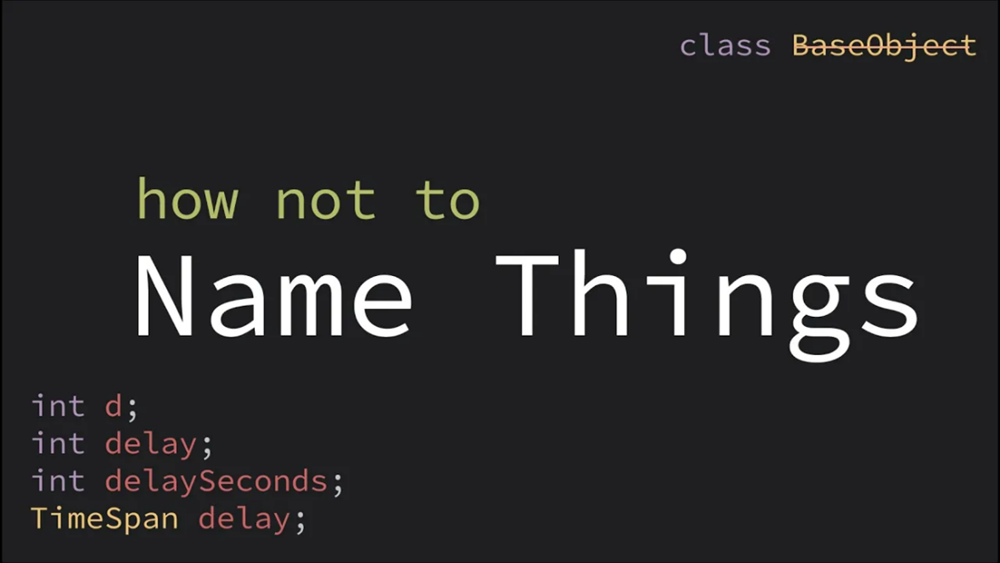
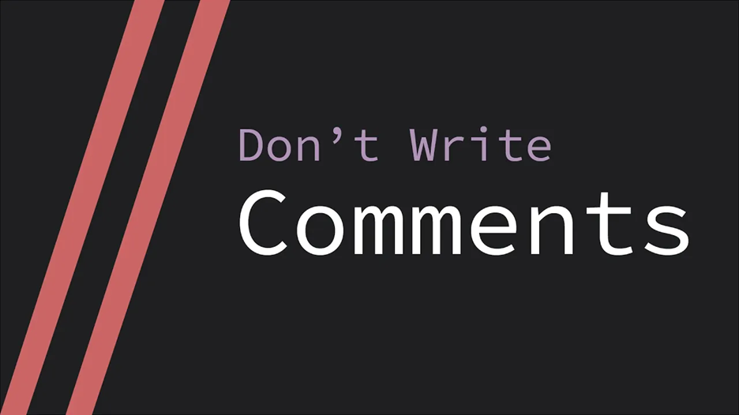

## کدنویسی تمیز یا Clean Code چیه؟

تو این داکیومنت، می‌خوایم با هم اصول کدنویسی تمیز رو یاد بگیریم. قبل از هر چیزی بیاید ببینیم که کلین کد اصلاً چیه و به چه معناست. کلین کد یک مفهوم پرکاربرد برنامه‌نویسیه که به مجموعه‌ای از اصول و قوانین اشاره می‌کنه تا به خوانایی و قابل‌فهم بودن کد شما کمک کنن. ایده‌ی اصلی اینه که کد شما به‌گونه‌ای باشه که تا حد امکان خوانا، قابل‌فهم، قابل‌تغییر و قابل‌توسعه باشه.

هدف ما تو این داکیومنت، اینه که در قدم اول اهمیت این مفهوم رو درک کنیم و در قدم بعد اصول کلین کد رو (با تمرکز روی جاوا) یاد بگیریم. البته بهتره از همین ابتدا بدونید که کلین کد دنیای گسترده‌ای داره و تشریح همه‌ی اصول مربوط به این مفهوم از هدف آموزشی ما خارجه. اما اگه علاقه‎‌مند بودید حتما به مطالعه‌ی بیشتر مشغول بشید.

ما تعدادی از مهم‌ترین و پرکاربردترین اصول کدنویسی تمیز رو براتون آماده کردیم. **انتظار ما اینه که در ادامه‌ی ترم جاری، توی کدهاتون اصول ذکر شده تو این فایل رو حتماً رعایت کنید و توجه داشته باشید که تمیز بودن کد، یکی از معیارهای ارزیابی تمارین و پروژه‌های آتی شما محسوب می‌شه!**

## چرا Clean Code؟

> «کد مثل جوکه. اگه مجبور باشی توضیحش بدی، دیگه خوب نیست»
\- کوری هاوس

شاید از خودتون بپرسید که مگه چه مشکلی پیش می‌آد اگه کدی بنویسم که چندان خوانا و قابل‌فهم نباشه و اصطلاحاً کثیف باشه؟ واقعیت امر اینه که کدی که تمیز باشه و کدی که تمیز نباشه، هر دو می‌تونن که درست کار کنن و خروجی و نتیجه‌ی مطلوب رو بدن. اما در حقیقت کد خوب و اساساً برنامه‌نویس خوب بودن، فراتر از رسیدن به نتیجه‌ی مدنظره.چند سناریوی مختلف برای درک بهتر جمله‌ی قبلیم می‌گم:

فرض کنید که عضوی از یک تیم چندنفره هستید و قراره همگی روی بخشی از یک پروژه‌ی بزرگ کار کنید. قطعاً بخش‌های مختلف این کار بین شما و بقیه‌ی اعضای تیم تقسیم خواهد شد. هم‌تیمی‌های شما برای کنار هم گذاشتن این قطعات یا هماهنگ بودن با کد شما، نیاز به فهم کامل و دقیق کد شما دارن. بدیهیه که در ابعاد بزرگ، اگه کد شما خوانا نباشه منجر به هدر رفتن انرژی و زمان و هزینه‌ می‌شه و راهکاری مثل توضیح شفاهی کد به هم‌تیمی‌هاتون به‌هیچ‌وجه ایده‌آل نیست.

یا فرض کنید که نیاز به توسعه یا بهبود یک پروژه‌ی بزرگ دارید. اگه پروژه‌ی فعلی رو نفهمید، علاوه بر هدررفت زمان و هزینه، شاید مجبور به تغییرهای غیرضروری پروژه بشیم!

از دو سناریوی قبلی به راحتی می‌شه دید که کدهای خواناتر، تمیزتر و به عبارتی، cleanتر باعث تسهیل و بهبود کار گروهی، صرفه‌جویی زمان و هزینه، تطبیق‌پذیری پروژه‌ها و ‌حفظ و حراست بیشتر از اونا می‌شه.

اگه مثال‌های قبلی چندان ملموس به‌نظر نیومدن، مثالی می‌زنم که همه‌ی ما تو سطح فعلی‌ای که از برنامه‌نویسی داریم قطعاً باهاش مواجه شدیم؛ دیباگ کردن! اگه یک کد بزرگ بنویسید و به باگ برخورد کنید، باید تو سریع‌ترین زمان ممکن کدتون رو بررسی کنید و خطا رو پیدا کنید. طبیعیه که یک کد کثیف، از شما زمان مضاعفی برای فهم چیزی که خودتون نوشتید می‌گیره و بعید نیست که حتی نتونید مشکل رو پیدا کنید. از طرفی ممکنه که در حین نوشتن کد بارها مجبور بشید که به عقب برگردید و کد خودتون رو بررسی کنید یا تغییر بدید. کد تمیز، شما رو در مواجهه با کد خودتون سریع‌تر و دقیق‌تر می‌کنه.

قطعا شما هم موارد زیادی به یادتون می‌آد که نفهمیدن کد خودتون یا کد دیگران، چه دردسری براتون ساخته. پس رعایت اصول کلین کد، لطف بزرگیه که شما به خودتون و هر کسی که قراره کدتون رو بخونه می‌کنید!

## مهم‌ترین اصول کلین کد

### کدت رو با عینک دیگران ببین!

قبل از هر چیزی بیاید درباره‌ی ذهنیتی که به ما در راستای نوشتن یک کد تمیز کمک می‌کنه، حرف بزنیم. وقتی که کدتون رو می‌نویسید در نظر بگیرید که مخاطب این کد فقط شما نیستید و اعتبار این کد فقط زمان حال یا آینده‌ی نزدیک نیست! یعنی چی؟ تصور کنید کدتون رو به هر طریقی که می‌خواید و فقط با این ذهنیت که همه چیز درست کار کنه بنویسید. بدیهیه که شما الان می‌فهمید چی نوشتید! اما اگه برنامه‌نویس دیگه‌ای به هر دلیلی سراغ کد شما بیاد، ممکنه کار سختی برای فهمیدنش داشته باشه. از طرفی اگه خودتون چند هفته بعد بخواید کدتون رو بهبود ببخشید، شاید به خاطر نداشته باشید که چی کار کردید. پس ذهنیت درست اینه که کد شما برای خودتون و دیگران، در هر زمانی قابل‌فهم و قابل‌تغییر باشه. این موضوع با روش‌ها و نکات مختلفی امکان‌پذیر می‌شه که در ادامه با هم می‌بینیم. گرچه بخش خوبی از این موارد طی تجربه براتون تثبیت می‌شن.

### نام‌گذاری درست

یکی از مهم‌ترین کارهایی که به خوانایی کد شما کمک می‌کنه، نام‌گذاری مناسب و درسته. ایده اینه که اسم اجزا (متغیرها، متدها و..) به ما درباره‌ی اون جزء اطلاعات مناسبی بدن. این اطلاعات به **اهمیت** و **طول عمر** اون جزء وابسته هستن. برای شروع بیاید ببینیم که منظورمون از اطلاعات مناسب، دقیقا چیه؟

#### نام یک جزء، ماهیت اون رو مشخص می‌کنه!

بذارید براتون یک مثال بزنم؛

```java
public static void d(int n){    
   double[][] array = new double[n][n];  
   //Code
}
```

این قطعه کد بخش کوچکی از یک متد با پیاده‌سازی نسبتاً پیچیده رو نشون می‌ده. به نظرتون این متد چه کاری انجام میده؟ بدون تفسیر کامل بدنه‌ی تابع، قابل‌تشخیص نیست. حالا همین متد رو با نام‌گذاری بهتر ببینیم:

```java
public static void determinant(int n){
   double[][] matrix = new double[n][n];
   //Code
}
```

فکر می‌کنم حالا دید بهتری داشته باشیم که این متد به محاسبه‌ی دترمینان یک ماتریس $n*n$ مربوطه.

یه مثال دیگه ببینیم؛

```java
int max1;

int max2;
```

فکر می‌کنید متغیرهای بالا دقیقاً چه کاربردی دارن؟

این دو متغیر تنها یک دیتا به ما می‌دن، اینکه بیشترین مقدارِ یک چیزی هستن؛ ممکنه بیشترین عدد یک مجموعه باشن یا بیشترین زمان لازم برای انجام یک کار یا هر چیز دیگه‌ای. برای کسی که هدف کد ما رو ندونه، فهم کارکرد این متغیر کار سختیه!

نام‌گذاری رو به شکل زیر تغییر می‌دیم:

```java
int maxArea;  
int maxPerimeter;
```

حالا می‌شه فهمید که این کد قراره بیشترین مساحت و بیشترین محیط رو، احتمالاً از بین اعضای یک مجموعه از مثلث‌ها به ما برگردونه.

#### اهمیت و طول عمر اجزا

فهمیدیم که به‌طور کل، نام‌گذاری درست متغیرها به این معنیه که اطلاعات خوبی از طریق اسم اون‌ها بدست بیاریم. سوال اینه که، میزان این اطلاعات برای هر متغیری باید یکسان باشه؟ به بیان دیگه، آیا برای نام‌گذاری همه چیز نیازه که به یک میزان حساسیت و دقت داشته باشیم؟ واقعیت اینه که جواب این سوال منفیه. این موضوع به فاکتورها و رویکردهای مختلفی وابسته‌ست. مهم‌ترین نکته اینه که متغیرهای مختلف، اهمیت متفاوتی در کل کد دارن. مثلا متغیری که چند جای مختلف استفاده می‌شه مهم‌تر از متغیریه که توی یک حلقه تعریف می‌شه و کار ما باهاش همون‌جا به پایان می‌رسه؛ چون طول عمر بیشتری داره. از طرفی بعضی اوقات نام‌گذاری دو جزء با حساسیت یکسان در حالی که اهمیت متفاوتی دارن، منجر به تکرار بیهوده‌ی توضیح‌ می‌شه. مثال‌های زیر رو با هم بررسی کنیم:

**مثال اول؛** بیاید مثال قسمت قبل رو بهتر کنیم. فرض کنید برای پیدا کردن بیشترین مساحت و بیشترین محیط دو تابع مجزا بنویسیم. شما این دو تابع و متغیری که توی هر کدوم این مقدار ماکسیمم رو ذخیره می‌کنه، چطور نام‌گذاری می‌کنید؟

```java
public static double findingMaxArea(Triangle[] triangles){  
   int maxArea = 0;  
   //Code  
   return maxArea;  
}
```

احتمالاً این نام‌گذاری به ذهنتون رسیده باشه. اما همون‌طور که می‌بینید `maxArea` هم توی اسم تابع و هم اسم متغیر تکرار شده و عملاً با نگاه به یکی از این دو هم می‌شه کارایی تابع رو فهمید. به‌نظر شما بین تابع و متغیری که داخلش استفاده شده، کدوم مهم‌ترن؟

تابعی که می‌نویسیم احتمالاً قراره جاهای مختلفی از کد استفاده بشه. از طرفی متغیری که داخل اون تعریف شده، فقط داخل همون تابع قابل‌استفاده‌ست و طول عمر کمی داره. پس قطعاً تابع از اهمیت بالاتری برخورداره.

```java
public static double maxArea(Triangle[] triangles){  
   int max = 0;  
   //Code  
   return max;  
}  
public static double maxPerimeter(Triangle[] triangles){  
   int max = 0;  
   //Code  
   return max;  
}
```

با دیدن دو تابع بالا، کارکرد اونا کاملاً مشخص می‌شه و نیازی نیست که اسم متغیرهای داخل اون‌ها، چیزی دقیق‌تر از `max` باشه.

نکته‌ی دیگه‌ای که در راستای این مثال می‌شه فهمید، اینه که توابع یا متدها ذاتاً اجزای مهمی هستن و بهتره که اسامی دقیقی داشته باشن. گرچه باز هم وابسته به اهمیت و کاربرد اون تابع، این دقت می‌تونه کمتر یا بیشتر باشه.

**مثال دوم؛** گفتیم متغیرهایی مهم هستن که در طول کد کارایی زیادی داشته باشن. یه نمونه‌ی رایج از چنین متغیری، متغیرهای ثابت هستن. متغیرهای ثابت (که تو زبان جاوا با کلیدواژه `final` تعریف می‌شن) متغیرهایی هستن که مقدار اون‌ها قابل‌تغییر نیست و مواقعی استفاده می‌شن که به یک مقدار یکسان در چندین جای مختلف کد، برای یک کارکرد یکسان، نیاز داریم. نام‌گذاری این نوع متغیر، به خاطر اهمیت بالایی که داره باید دقیق باشه!

```java
//Bad Naming  
final int MAX = 1000;  
//Good Naming  
final int MAXـSIZE_OF_ARRAYS = 1000;
```

**مثال سوم؛** به عضو جدانشدنی کدها سر بزنیم؛ حلقه! همونطور که می‌دونید، حلقه‌ی for تو زبان جاوا به شکل زیر نوشته می‌شه:

```java
for (int i = 0; i < n; i++) {  
   //Code  
}
```

متغیر `i` به‌عنوان شمارنده‌ی حلقه تعریف و استفاده می‌شه. برای این متغیر اسم دقیقی نمی‌ذاریم. دلیل این موضوع اهمیت و طول عمر کم این متغیره و ساختار دستور `for` به‌اندازه‌ی کافی کارکرد متغیر i رو توضیح می‌ده.

ممکنه زیاد بشنوین که برای نوشتن یک کد تمیز، نباید اسامی تک‌حرفی یا مخفف استفاده کنید. همونطور که توی این مثال دیدید؛ این نصیحت چندان دقیق نیست. واقعیت اینه که خیلی از مواقع -مثلاً زمانی که متغیر اهمیت زیادی نداره- اسامی این‌چنینی انتخاب بدی نیستن. از طرفی مثلاً خیلی از حروف معنای مشخصی برای یک مفهوم دارن و استفاده از اون‌ها مناسبه؛ مثل `x` و `y` برای مختصات یک نقطه، `n` برای سایز یک ماتریس و ... . اسامی مخفف زیادی هم هستن که کارکرد متغیر رو به‌خوبی نشون می‌دن و رایجن؛ مثلا `max`، `min`، `sin`، `cos`، `concat`، `const`، `doc`، `lang`، `num`، `OS` و ... .

پس به همون حرف اولمون برمی‌گردیم؛ اگه متغیری کم‌اهمیته یا طول عمر کمی داره، چنین نام‌گذاری‌هایی مشکلی ایجاد نمی‌کنه. اما دقت کنید که تکیه به این اسم‌های بی‌دقت برای همه متغیرها راه‌حل ایده‌آلی نیست و ممکنه به خوانایی کد ضربه بزنه.

##### ویدیوی یوتوب




[**Naming Things In Code – CodeAesthetic**](https://www.youtube.com/watch?si=s9ljN1tAi_hgUDEL&v=-J3wNP6u5YU&feature=youtu.be)

دیدن این ویدیو درباره‌ی نام‌گذاری اجزای کد رو بهتون پیشنهاد می‌کنیم. توی این ویدیو به‌صورت خلاصه و کوتاه اما جامع، درباره‌ی رویکرد کلی نام‌گذاری حرف زده شده. البته که قسمت‌هایی از این ویدیو کمی با چیزهایی که ما دربارشون حرف زدیم متفاوته؛ مثلا همون نکته‌ی بحث‌برانگیز درباره‌ی اسامی تک‌حرفی و مخفف! طبیعتاً معیار ما همین داک خودمونه اما خوبه که نگاهی به این ویدیو هم داشته باشید.

### قراردادهای نام‌گذاری (Naming Conventions)

Naming Convention یک مفهوم درباره‌ی برنامه‌های کامپیوتریه که قوانینی برای یکپارچگی اسامی و تمایز اجزا از همدیگه ارائه می‌ده. زبان‌های برنامه‌نویسی، همگی از یک قرارداد نام‌گذاری برای توابع پیش‌فرض، اسم‌های کلیدی و باقی اجزای خودشون پیروی می‌کنن و معمولاً برنامه‌نویسی که با هر زبان کد بزنه، قوانین نام‌گذاری اون زبان رو تو کد خودش هم استفاده می‌کنه. رعایت کردن و یادگیری Naming Convention هر زبان برنامه‌نویسی چند مزیت داره:

- به یادگیری اون زبان کمک می‌کنه. چون مثلاً اگه شما بدونید که تمام متدها توی یه زبان با فرمت یکسان نوشته می‌شن، متدهای پیش‌فرض یا user defined اون زبان رو به راحتی تشخیص می‌دید.
- رعایت این قراردادها، چیزهایی که شما می‌نویسید رو با چیزهایی که زبان از قبل در اختیار شما قرار داده، هماهنگ می‌کنه.
- بدیهیه که یکپارچگی اسم‌ها، کد شما رو خواناتر و قابل‌فهم‌تر می‌کنه و در راستای نوشتن یک کد تمیز به شما کمک می‌کنه.

فرمت‌های معروفی در دنیای Naming Conventionها وجود داره که زبان‌های مختلف از اون‌ها استفاده می‌کنن و معرفی تک‌تک اون‌ها از اهداف ما نیست. توی این بخش از داک کلین کد، ما به معرفی قراردادی می‌پردازیم که زبان جاوا از اون پیروی می‌کنه؛ camelCase!

#### camelCase یا چگونه یک شتر به ما کمک کرد که توی جاوا تمیزتر کد بزنیم!

زبان جاوا از فرمت Camel Case برای اغلب نام‌گذاری‌ها استفاده می‌کنه. ایده‌ی اصلی این فرمت اینه که بین کلمات از هیچ جداکننده‌ای مثل آندرلاین یا نقطه استفاده نشه و همچنین بزرگ یا کوچیک بودن حروف، کاربرد اسامی رو از همدیگه متمایز کنه.


نام‌گذاری این فرمت، از کوهان شتر الهام گرفته شده!

#### قواعد نام‌گذاری در جاوا

- **نام‌گذاری کلاس‌ها:** کلاس‌ها تو زبان جاوا با فرمت UpperCamelCase نام‌گذاری می‌شن. یعنی کلمات اسم باید به هم چسبیده و همگی به صورت Capital باشن. هفته‌های آینده، با مفهوم کلاس‌ها آشنا می‌شیم، با اون‌ها کار می‌کنیم و یاد می‌گیریم که چطور کلاس بنویسیم. اما فعلا به نام‌گذاری کلاس تو چند مثال زیر دقت کنید تا UpperCamelCase براتون جا بیفته:

```java
public class Main {  
   //Code  
}

class ElectronicCar {  
   //Code  
}

class WildAnimal {  
   //Code  
}
```

- **نام‌گذاری متدها:** متدها تو زبان جاوا با فرمت lowerCamelCase نام‌گذاری می‌شن. مشابه کلاس‌ها باز هم کلمات باید به هم چسبیده باشن. اما این‌بار کلمه‌ی اول اسم Small و باقی کلمات Capital هستن. با چند مثال بهتر می‌فهمیم:

```java
public static void main(String[] args) {  
   //Code  
}

public double calculateSalary(){  
   //Code  
}
```

- **نام‌گذاری متغیرها و اشیاء:** توی جاوا برای متغیرها و اشیاء هم دقیقاً مثل متدها از lowerCamelCase استفاده می‌کنیم. با مفهوم شیء طی جلسات آینده آشنا می‌شیم.

```java
int mostFrequent = 0;  
int differentLetters = 0;  
double maxArea;  
String wordToFound = "Clean";
```

- **متغیرهای ثابت یا نهایی:** این نوع متغیرها (که در آینده به سراغشون می‌ریم) با فرمت `SCREAMING_SNAKE_CASE` نام‌گذاری می‌شن. یعنی تمام حروف باید بزرگ باشن و کلمات با آندرلاین از هم جدا بشن.

```java
static final int MAX_ITEM = 1000;
```

### کامنت‌گذاری

کامنت گذاشتن توی کد به معنی نوشتن یک توضیح متنی بین خطوطه که کامپایلر از اون می‌گذره و تنها مخاطب اون، شخصیه که کد شما رو می‌خونه. در زبان جاوا کامنت گذاشتن با استفاده از `//` میسر می‌شه. البته با این روش فقط همون خطی که ابتدای اون ``//`` گذاشتید کامنت می‌شه. اگه بخوایم چند خط رو کامنت کنیم چی؟ یک راه دم ‌دستی اینه که هر خط رو جداگانه کامنت کنیم؛ اما اینکار علاوه بر اینکه زمان‌بره چندان کار تمیزی هم نیست. برای کامنت کردن چند خط، از `*/` در ابتدای کامنت و `\*` در انتهای اون استفاده می‌کنیم.

```java
// single line comment

  
/* first comment  
second comment  
third comment  
*/
```

به طور کل هدف از کامنت گذاشتن، افزایش خوانایی کد برای دیگرانه و به قابل‌فهم بودن کد شما کمک می‌کنه. در ادامه چند نکته‌ای رو که موقع کامنت گذاشتن اهمیت داره، یاد می‌گیریم.

#### چه مواقعی کامنت نذاریم؟

واقعیت اینه که پر کردن کد با کامنت‌های بیهوده رایج‌ترین اشتباه بین همه‌ی ماست. هدف از کامنت گذاشتن کمک به فهمیدن کده اما کثرت کامنت‌های ما می‌تونه تمرکز خواننده رو از بین ببره. سعی کنید خودتون رو به جای کسی بذارید که هیچ چیزی از کد شما نمی‌دونه اما به برنامه‌نویسی تسلط مناسبی داره. این فرض شاید به ما کمک کنه کامنت‌هایی که چیزهای بدیهی مربوط به کد رو توضیح می‌دن، نذاریم. مثال‌های زیر رو ببینید:

```java
// defining Scanner object  
Scanner scn = new Scanner(System.in);  
// reading input  
String input = scn.nextLine();
```

کامنت‌های بالا غیرضروری‌ان. چون فرض کردیم کسی که کد شمارو قراره بخونه، به زبان جاوا آشناست و معنی این دو خط کد رو می‌فهمه.

```java
// this method returns the most frequent element of array  
public static int mostFrequentElement(int[] numArray){

   //Code

}
```

کامنتی که بالای متد نوشته شده غیرضروریه. چون نام‌گذاری متد به‌درستی کارکرد اون رو توضیح می‌ده و نیاز به کامنت گذاشتن نیست.

#### کامنت‌ها دروغ می‌گن، کد نه!

اولویت ما اینه که همه چیز رو با کدمون به خواننده بفهمونیم. یعنی اولین تلاش ما اینه که کد خوانایی بنویسیم، نه اینکه روی کد بدمون با کامنت سرپوش بذاریم! مثال زیر رو ببینید تا بهتر متوجه حرفم بشید:

```java
// A status of 5 signals approve  
if (s == 5){  
   System.out.println("Approve");  
}
```

کارکرد کد بالا با یک کامنت قابل‌فهم شده؛ اما آیا کامنت‌گذاری بهترین یا تنها راه کمک به فهم این کده؟ پاسخ با قاطعیت منفیه!

```java
if (status == 5){  
   System.out.println("Approve");  
}
```

می‌بینید که با نام‌گذاری بهتر مشخص شد که دقیقا چه چیزی باید 5 باشه تا شرط اجرا باشه. اما هنوز به ایده‌‌آل‌ترین حالت نرسیدیم؛ احتمالاً کسی که این کد رو ببینه از خودش می‌پرسه که چرا 5؟

```java
final int STATUS_APPROVED = 5;  
if (status == STATUS_APPROVED){  
   System.out.println("Approve");  
}
```

با این تغییر، حالا کد ما دقیقاً همه‌ی اطلاعاتی رو که کامنت اولیه داشت بیان می‌کنه و در واقع شرطی که نوشتیم به قدر کفایت خوانا و صریحه. (کلیدوا‌ژه‌ی `final` رو بعداً یاد می‌گیریم.)

با مثال بالا یه نکته‌ی مهم رو می‌شه فهمید؛ اینکه خیلی از مواقع با کمی تغییر می‌شه جای کامنت گذاشتن، صرفاً کد خوبی نوشت. بار رسوندن اطلاعات کد، روی دوش خود کده و واقعیت اینه که اکثر اوقات کامنت گذاشتن و توضیح دادن یعنی «این قسمت از کد من خوب نوشته نشده»!

#### ویدیوی یوتوب




**[Don’t Write Comments – CodeAesthetic](https://www.youtube.com/watch?v=Bf7vDBBOBUA)**

اگه دوست دارید درباره‌ی کاربردهای مختلف کامنت گذاشتن و البته کامنت درست گذاشتن بیشتر بدونید، دیدن این ویدیو رو حتماً پیشنهاد می‌کنیم.

### خودت رو تکرار نکن!

```java
int x, y;  
Scanner scanner = new Scanner(System.in);

  
x = scanner.nextInt();  
y = scanner.nextInt();

  
int sum = 0;  
while (x != 0) {  
   sum += (int)(x % 10);  
   x /= 10;  
}

  
System.out.println("sum of digits of x: " + sum);  

sum = 0;  
while (y != 0) {  
   sum += (int)(y % 10);  
   y /= 10;  
}

  
System.out.println("sum of digits of y: " + sum);
```

فکر می‌کنید کد بالا چه چیزی رو رعایت نکرده؟ اگه خوب دقت کنید این کد مجموع ارقام دو عدد `x` و `y` رو چاپ می‌کنه و عملاً بخشی از کد که برای `x` نوشته شده، برای `y` هم تکرار شده. بیاید یک کد جدید بنویسیم و این مشکل رو حل کنیم. پیشنهاد شما چیه؟

```java
public static int sumOfDigits(int x) {  
   int sum = 0;  

   while (x != 0) {  
      sum += x % 10;  
      x /= 10;  
   }  
   return sum;  
}  
public static void main(String[] args) {  
   int x,y;  
   Scanner scanner = new Scanner(System.in);  
   x = scanner.nextInt();  
   y = scanner.nextInt();  
   System.out.println("sum of digits of x: " + sumOfDigits(x));  
   System.out.println("sum of digits of y: " + sumOfDigits(y));  
}
```

همونطور که می‌بینید، تونستیم کد رو یک بار بنویسیم اما از اون دو بار استفاده کنیم!

مشابه مثال بالا، بسیاری از مواقع ما از قطعه‌کدهای مشابه یا حتی یکسان توی بخش‌های مختلف کد اصلیمون استفاده می‌کنیم. تکرار یک کد جدا از اینکه زمان بیشتری برای فهمیدن می‌خواد، در ابعاد بزرگ ممکنه حتی باعث بشه فراموش کنید که چه قسمت‌هایی مشابه و مرتبط بودن و یکپارچگی برنامه توی ذهن شما یا خواننده، از دست بره. توی چنین سناریوهایی، استفاده از متدهاست که خوانایی کد شما رو دوچندان می‌کنه.

یکی دیگه از جاهایی که متد کردن کد به منظم بودن اون کمک می‌کنه، زمانیه که بلوک‌های تو در تو به‌وجود می‌آن. با هم یک مثال ببینیم:

```java
boolean isPrime;  
Scanner scanner = new Scanner(System.in);  
int right = scanner.nextInt();  
int left = scanner.nextInt();  
for (int i = right + 1; i < left; i++) {  
   isPrime = true;  
   for (int j = 2; j * j <= i; j++) {  
      if (i % j == 0) {  
         isPrime = false;  
      }  
   }  
   if (isPrime) {  
      System.out.printf(",%d", i);  
   }  
}
```

مثال بالا اعداد اول در یک بازه رو چاپ می‌کنه. فکر می‌کنید می‌شه این کد رو بهتر نوشت؟

```java
public static void main(String[] args) {  
   Scanner scanner = new Scanner(System.in);  
   int right = scanner.nextInt();  
   int left = scanner.nextInt();  

   for (int i = right + 1; i < left; i++) {  
      if (isPrime(i)) {  
         System.out.printf(",%d", i);  
      }  
   }  
}  
public static boolean isPrime(int n) {  
   for (int i = 2; i * i <= n; i++) {  
      if (n % i == 0) {  
         return false;  
      }  
   }  
   return true;  
}
```

نوشتن متد `isPrime` خوانایی کد رو بیشتر می‌کنه.

### فضاهای خالی

یکی از چیزهایی که مخصوصاً در نگاه کلی کد شما رو تمیز جلوه می‌ده، ساختار خطوط و فضاهای خالی در کد شماست. چند مثال ببینیم:

```java
      Scanner scanner = new Scanner(System.in);  
int right = scanner.nextInt();  
    int left = scanner.nextInt();
```

توی زبان جاوا چون بلوک‌ها با کروشه مشخص می‌شن نه تب، کدی مشابه کد بالا که تب‌ها و اسپیس‌های اضافی داره هم کار می‌کنه. اما اگه می‌خواید کدتون تمیز و خوانا باشه، این مورد رو کنترل کنید.

```java
//not clean  
if(x&&y){}  
//clean  
if(x && y){}

//not clean  
z=10;  
//clean  
z = 10;
```

قبل و بعد از علائم ریاضی یا منطقی، استفاده از اسپیس به تمیزی کد شما کمک می‌کنه.

```java
//not clean  
int x,y,z;  
//clean  
int x, y, z;
```

استفاده از اسپیس بعد از کاما و چسبیدن کاما به کاراکتر قبلیش هم از مواردیه که کدتون رو مرتب نگه می‌داره.

علاوه بر موارد بالا، حتما سعی کنید با گذاشتن یک enter اضافی بین بعضی خطوط برنامه، به لحاظ منطقی اون بخش‌ها رو از هم جدا کنین. کد زیر با این که به لحاظ نامگذاری خیلی خوبه، ولی واقعا تو هم تو همه:

```java
import java.util.Scanner;  
public class Main {  
   public static void main(String[] args) {  
      var scn = new Scanner(System.in);  
      var n = scn.nextInt();  
      var fib = fibonacci(n);  
      System.out.println(fib);  
   }  
   public static int fibonacci(int n) {  
      if (n == 0) {  
         return 1;  
      }  
      if (n == 1) {  
         return 1;  
      }  
      return fibonacci(n - 1) + fibonacci(n - 2);  
   }  
}
```

شما باید حواستون باشه که بخش‌های مختلف کد رو با enter از هم جدا کنین. مثلا `import`ها رو از کلاس `Main` جدا کنین، بهتره که توابع رو از هم جدا کنین، و نهایتا توی خود توابع بهتره تکه‌های مختلف کد رو به لحاظ منطقی از هم جدا کنین. این کد بعد از این تغییرات، خیلی بهتر می‌شه:

```java
import java.util.Scanner;  

public class Main {  
   public static void main(String[] args) {  
      var scn = new Scanner(System.in);  

      var n = scn.nextInt();  
      var fib = fibonacci(n);  

      System.out.println(fib);  
   }  

   public static int fibonacci(int n) {  
      if (n == 0) {  
         return 1;  
      }  
      if (n == 1) {  
         return 1;  
      }  

      return fibonacci(n - 1) + fibonacci(n - 2);  
   }  
}
```

## چه چیزهایی یاد گرفتیم؟

- با هم فهمیدیم که Clean Code یعنی چی و چرا مهمه که کدمون رو تمیز بنویسیم؟
- یاد گرفتیم که نام‌گذاری اجزای کد (متغیرها، متدها، کلاس‌ها و ...) باید معرف چیستی و کارکرد اون جزء باشن و البته دو فاکتور **اهمیت** و **طول عمر** اون جزء، میزان دقت نام‌گذاری رو مشخص می‌کنن.
- درباره‌ی Naming Conventionها و رعایت اون در زبان جاوا یاد گرفتیم.
- فهمیدیم که کامنت گذاشتن به چه معناست و البته از طریق چند مثال، دیدیم که استفاده از اون اولویت‌ اول ما نیست.
- درباره‌ی اهمیت استفاده از متدها در راستای خوانایی و نظم کد یاد گرفتیم.
- متوجه شدیم که فضاهای خالی نظم مشخصی دارن و رعایت اون‌ها می‌تونه کد رو چشم‌نوازتر و در نتیجه خواناتر کنه.