## مقدمه

اگه می‌خواید برنامه‌های جاواتون رو کاربردی‌تر کنید، لازمه که با GUI بیشتر آشنا بشید. GUI که مخفف Graphical User Interface یا همون رابط گرافیکی کاربر هست، در واقع همون پنجره‌ها و عناصر گرافیکی‌ هست که توی سیستم عامل‌های مختلف برای راحت‌تر شدن کار با برنامه‌ها استفاده میشه. چیزایی مثل دکمه‌ها، برچسب‌ها، جدول‌ها، فرم‌ها، فیلدهای ورودی، تصاویر و کلی عناصر دیگه که باعث میشن تعامل با برنامه راحت‌تر بشه.

با استفاده از GUI، می‌تونید کاری کنید که کاربر بدون نیاز به نوشتن کد یا وارد کردن دستی اطلاعات، فقط با یه کلیک، عملیات موردنظرش رو انجام بده.

جاوا برای ساخت برنامه‌های گرافیکی، اول پکیج `AWT` و بعد پکیج `Swing` رو معرفی کرد. این دو تا، کلی شباهت و یه سری تفاوت با هم دارن. در ادامه، اول یه نگاه کوتاهی به مفاهیم اشیا و کلاس‌ها میندازیم و بعدش هم بخش‌های مهم `Swing` و `AWT` رو با هم یاد می‌گیریم.

## اولین برنامه گرافیکی خود را بنویسید

اولین برنامه‌ای که یاد گرفتید در جاوا بنویسید، همون مثال قدیمی `"Hello, World!"` بود. حالا میخوایم برناممون یذره بیشتر مرتبط با جاوا و همونطوری که از اسم داکیومنت این جلسه پیداست، **گرافیکی** باشه. همون کارهای قبلی رو بکنید و فقط بجای `println`، کد زیر رو در تابع `main` قرار بدید. فعلا نگران کدش نباشید و خودتون رو گیج نکنید. جلوتر برمیگردیم و قسمت به قسمتش رو توضیح می‌دیم. :)

```java
JFrame frame = new JFrame("Hello, java");  
frame.setSize(300, 150);  
JLabel label = new JLabel("Hello, Java!", JLabel.CENTER);  
frame.add(label);  
frame.setVisible(true);
```

کد بالا رو ران کنید. با همچین خروجی‌ای مواجه خواهید شد:

اول یه توضیح و پیش زمینه مختصر از کلاس و آبجکت (شیء) خواهیم داد و بعدش به تحلیل کدمون برمیگردیم.

### آشنایی با کلاس و آبجکت

کلاس‌ها، پایه‌ای ترین بخش زبان‌های شیء‌گرا هستند.کلاس‌ها رو می‌تونید به عنوان یه نگه‌دارنده برای **متدها** (Method) و **فیلدها** (Field) در نظر بگیرید. به تابع‌هایی که داخل کلاس قرار دارن، متد گفته میشه که رفتار اون کلاس رو رقم میزنن و متغیرهای داخل کلاس هم فیلد نام دارن. اگه قبلاً با `struct` توی زبان C کار کرده باشید، باید بدونید که کلاس‌ها خیلی به `struct` شباهت دارن، با این تفاوت که `struct` فقط برای نگهداری داده‌ها (فیلدها) استفاده میشه، اما کلاس‌ها علاوه بر داده‌ها، متدها رو هم توی خودشون دارن.

هر کلاس می‌تونه بسته به متدها و فیلدهاش، اشیای مختلفی بسازه. به عبارتی دیگر، کلی کپی مستقل و مجزا از یه کلاس میتونه وجود داشته باشه که متمایز از هم هستن. به این کپی‌ها، instance (نمونه) یا آبجکت میگیم. هر دو تا instance از یه کلاس، میتونن شامل دیتای متفاوتی باشن، ولی همشون همیشه متدهای یکسانی دارن. برای درک بهتر، کلاس رو مثل یه کارخانه خودروسازی در نظر بگیرید. این کارخانه می‌تونه ماشین‌های مختلفی تولید کنه که همگی قابلیت حرکت کردن دارن (یه رفتار مشترک)، اما مشخصاتی مثل قدرت موتور، رنگ، شاسی و... توی هر ماشین می‌تونه متفاوت باشه. البته که بعضی از این ویژگی‌ها روی رفتار ماشین هم تأثیر می‌ذارن، مثلاً یه موتور قوی‌تر باعث می‌شه شتاب ماشین بیشتر بشه.

یا مثلا فرض کنید یه کلاس «انسان» داشته باشیم. سام و نسترن دو آبجکت از این کلاس هستن که یه سری رفتار مشترک دارن، مثل راه رفتن، غذا خوردن و خوابیدن، ولی ویژگی‌هایی مثل جنسیت، قد، وزن و سن توی هرکدومشون متفاوته. پس تا اینجا قطعا باید به این شهود دست پیدا کرده باشین که کلاس‌ها و آبجکت‌هایی که از کلاس‌ها ساخته میشن، یه ترکیبی از داده (data) و رفتار (behaviour) رو همراه خودشون دارن. از طرفی، کلاس‌ها می‌تونن ویژگی‌های همدیگه رو به ارث ببرن. درست مثل یه فرزند که بعضی از ویژگی‌های پدرش رو داره، ولی در عین حال می‌تونه ویژگی‌های جدیدی هم داشته باشه. با این مفاهیم توی داک‌های مرتبط با OOP خیلی دقیق‌تر آشنا می‌شین؛ هدف این بخش، صرفا اینه که بدونین اون‌ها وجود دارن.

### کلاس‌ها و آبجکت‌های برنامه Hello Java

حالا میخوایم کدی که زدیم رو بررسی کنیم:

```java
JFrame frame = new JFrame("Hello, java");
```

اینجا اومدیم از کلاس JFrame استفاده کردیم و یه آبجکت از این کلاس ساختیم و اسم آبجکتمون رو frame گذاشتیم. این کار رو با استفاده از کلمه کلیدی `new` انجام دادیم (درست مثل وقتی که یه آبجکت از کلاس `Scanner` میساختین). در اصل، `JFrame` اسم یه کلاسی از پکیج سویینگ هست که یک پنجره گرافیکی رو نشون میده و عبارت `new`، به جاوا میگه که بخشی از حافظه رو اختیار (allocate) کنه و به آبجکت جدیدی که از این کلاس ساخته میشه، اختصاصش بده. تو این مثال، ورودی یا همون آرگومانی که داخل پرانتز هست (استرینگِ `"Hello, Java"` ) مشخص میکنه که چه عنوانی برای پنجرمون قرار بگیره. خودتون امتحان کنید و ببینید که وقتی به این بخش ورودی ندید، پنجرتون هم تایتلی نداره. :)

```java
frame.setSize(300, 150);
```

کد بالا، مثال خوبی از فراخوانی یا همون کال کردن یه متد روی یه آبجکته! همونطور که میبینید برای فراخوانی متد روی آبجکت مورد نظر، باید از اپراتور دات روی اسم آبجکت مورد نظرمون استفاده کنیم. مثلا اینجا، متد `setSize()` توی کلاس `JFrame` تعریف شده و برای هر آبجکتی که اون رو فراخوانی میکنه، بسته به ورودی‌ای که بهش داده میشه، ابعاد فریم (همون پنجره) رو مشخص کنه. (ورودی ها به ترتیب از چپ، طول و عرض رو بر حسب پیکسل مشخص میکنند)

بعدش، مثل کاری که برای فریم کردیم، اومدیم یه instance از کلاس `JLabel` درست کردیم تا متن مورد نظرمون (`"Hello, Java!"`) رو نمایش بده:

```java
JLabel label = new JLabel("Hello, Java!", JLabel.CENTER);
```

JLable مثل یه برچسب فیزیکی میمونه. آبجکت ساخته شده از این کلاس، متن مورد نظرمون رو تو بخش مشخصی از فریم (در این مثال، بخاطر استفاده از `CENTER`، در مرکز) قرار میده. اینجا از یه مفهوم کاملا شیء گرا استفاده کردیم، چون از یه آبجکت برای قرار دادن متنمون استفاده کردیم بجای اینکه خیلی ساده، یه متد رو روی آبجکت `frame` فراخوانی کنیم تا متن رو بنویسه. اینطوری یه ماهیت جداگانه به متنمون دادیم تا بتونه ویژگی‌های مستقل خودشو داشته باشه. این مفهوم تو جلسات بعدی براتون واضح تر میشه.

بعدش اومدیم با فراخوانی متد `add()` روی آبجکت `frame`، لیبلمون رو به فریم اضافه کردیم:

```java
frame.add(label);
```

در مرحله آخر هم، فریممون و اجزای داخلش که کامل شدن رو نمایش دادیم:

```java
frame.setVisible(true);
```

در زبان‌های شی‌ءگرا مثل جاوا، این مفاهیم کمک می‌کنن که بتونیم برنامه‌نویسی ساختارمند و مقیاس‌پذیرتری داشته باشیم. در ادامه‌ی این داکیومنت، هر جا که لازم باشه، دوباره به آبجکت و کلاس اشاره می‌کنیم. همچنین توی جلسات بعدی، مفصل‌تر با برنامه‌نویسی شی‌ءگرا و مفاهیم مربوط بهش آشنا می‌شید.

## آشنایی با AWT و Swing

کلاس‌های AWT امکانات زیادی رو در اختیار برنامه‌نویس‌ها قرار میدن، اما یه نقطه‌ضعف بزرگ دارن؛ اونم اینه که ظاهر برنامه‌هایی که با AWT طراحی میشن، روی پلتفرم‌ها یا سیستم‌عامل‌های مختلف میتونه تا حدی متفاوت باشه.علاوه بر این، نحوه تعامل کاربر با برنامه‌هایی که با AWT ساخته میشن، توی سیستم‌عامل‌های مختلف ممکنه فرق کنه. در واقع، وقتی یه برنامه رو با AWT طراحی می‌کنید، این برنامه توی هر سیستم‌عاملی که اجرا بشه، از همون ابزارهای گرافیکی پیش‌فرض اون سیستم‌عامل برای نمایش رابط کاربری استفاده می‌کنه. این موضوع باعث میشه که برنامه شما توی هر سیستم‌عامل، یه ظاهر متفاوت داشته باشه. برای حل این مشکل، شرکت اوراکل Swing رو به زبان جاوا اضافه کرد.

Swing در جاوا یه مجموعه از کلاس‌های از پیش تعریف ‌شده هست که امکانات زیادی برای ساخت GUI در اختیار شما می‌ذاره. کلاس‌های Swing نسبت به AWT انعطاف‌پذیری بیشتری دارن و ویژگی‌هاشون هم خیلی پیشرفته‌تره. مثلا جدول، فرم، لیست، اسکرول و کلی المان دیگه رو توی Swing می‌تونید راحت‌تر و با کنترل بیشتری طراحی کنید.

ساختار سلسله مراتبی بخش های کتابخانه swing به صورت زیر هست:
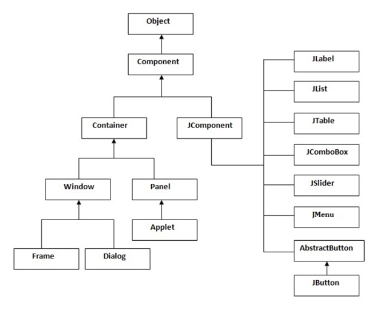
در نمودار بالا، کلاس `Object` رو می‌بینید که پدرِ همه‌ی کلاس‌ها توی جاوا محسوب میشه. همچنین یه سری اجزای گرافیکی رو هم داریم که هرکدوم یه کلاس جداگانه هستن. با همین کلاس‌هایی که توی نمودار می‌بینید، می‌تونیم یه برنامه‌ی گرافیکی طراحی کنیم. توی داک‌های مرتبط با OOP، ساختار کلاس‌ها توی Java رو بررسی خواهیم کرد.

- **Component** به معنی عنصر، قطعه یا جزئی از یه چیز هست. توی طراحی GUI، Component به هر چیزی که روی رابط گرافیکی قرار می‌گیره گفته می‌شه، مثل دکمه، برچسب، منو و... .  
- **Container** به معنی ظرف یا محفظه هست. توی جاوا، Container به چارچوبی گفته میشه که بقیه‌ی Component‌ ها مثل دکمه و منو و ... داخلش قرار می‌گیرن. این ظرف معمولاً یه فریم یا پنجره است. پس اگه بخوایم یه GUI بسازیم، اول باید یه فریم ایجاد کنیم تا بتونیم بقیه Component‌ها رو داخلش قرار بدیم. در ادامه، از نمودار بالا، دو بخش window و component رو بررسی می‌کنیم و اجزای زیرمجموعه‌ی هرکدوم رو توضیح می‌دیم.

### Window

پنجره‌ای هست که هنگام اجرای برنامه باز میشه و می‌تونه به دو حالت باشه: `dialog` (حالت پاپ‌آپی که توی برنامه‌ها می‌بینید) و `Frame` (قابی که پنجره هر برنامه با اجرا شدن خودش، باز می‌کنه). بنابراین برای ایجاد یک رابط گرافیکی، به یک `Frame` نیاز داریم و `JFrame` در جاوا این کار رو برای ما انجام می‌ده. JFrame یه Container یا ظرف هست که این قابلیت رو داره که Component‌هایی مثل `JButton`، `JTextArea`، `JPanel` و ... رو در خودش جا بده.

در ابتدا باید کتابخانه `swing` رو برای ایجاد رابط گرافیکی (GUI) به عنوان پیشنیاز کد ایمپورت کنیم.

```java
import javax.swing.*;
```

دقت کنید که در کد بالا، دلیل استفاده از `*` اینه که بتونیم از هر کلاسی که در Swing داریم به صورت مستقیم استفاده کنیم. یا به عبارتی دیگه، کل پکیج رو یکجا ایمپورت می‌کنیم، نه فقط بخشی از اون. کلاس اصلی کد رو به صورت زیر تعریف می‌کنیم:

```java
public class Main{
    public static void main(String[] args) {  
    }  
}
```

همونطور که اول داکیومنت توضیح دادیم، یک آبجکت از کلاس `JFrame` می‌سازیم و اسمش رو `frame` میذاریم. از این به بعد با استفاده از نام این آبجکت، می‌تونیم متدهای مختلف کلاس `JFrame` رو فراخوانی یا کال کنیم. بعد از این که آبجکت رو ساختیم، برای نمایش اون باید مقدار `visibility` رو `true` قرار بدیم. نمونه کد و نتیجه اجرای اون رو در ادامه می‌بینید.

سام و نسترن قصد دارن برای تیم تدریسیاری، رابط کاربریِ فرمی رو طراحی کنن که دانشجویانی که این ترم درس AP دارن، بتونن اطلاعاتشون رو توسط اون ثبت کنن. بنابراین، نام پنجره ایجاد شده رو Student Registration Form میذاریم.

```java
import javax.swing.*;  
public class Main{    
   public static void main(String[] args) {  
      JFrame frame = new JFrame("Student Registration Form");  
      frame.setVisible(true);  
   }
```

خروجی کد :

همونطور که می‌بینید، خروجی فقط یه پنجره خالی هست و هیچ چیزی داخلش نیست و عنوانش هم دیده نمیشه. وقتی اندازه پنجره رو دستی تغییر بدید، می‌بینید که قاب باز شده به این شکل نشون داده میشه:

حالا می‌تونیم ببینیم که پنجره داده شده عنوان داره ولی هنوز محتوایی نداره. در واقع، یه آبجکت از کلاس `JFrame` مثل یه قاب یا تابلوی نقاشیه که هنوز چیزی روش کشیده نشده. قبل از این که اجزای دیگه‌ای بهش اضافه کنیم، بیاید کمی با همین قاب خالی کار کنیم.

مثلاً می‌خوایم اندازه پنجره باز شده بعد از اجرا رو کمی بزرگتر کنیم. اول باید ابعاد مورد نظر رو بسازیم، اما برای این کار نیاز به اضافه کردن یه کتابخانه دیگه هم داریم که باید اون رو هم به ابتدای کد اضافه کنیم:

```java
import java.awt.*;
```

بعدش، ابعاد رو به این صورت می‌سازیم:

```java
Dimension frameSize = new Dimension(1024,720);

// Create a Dimension object to set the window size (width:1024, height:720)
```

سپس این ابعاد رو به `frame` می‌دیم تا روی اون اعمال بشه. این کار رو به صورت زیر انجام می‌دیم:

```java
frame.setSize(frameSize);
```

کد اون به صورت زیر هست:

```java
import javax.swing.*;
import java.awt.*;
public class Main{
   public static void main(String[] args) {  
      JFrame frame = new JFrame("Student Registration Form");  
      Dimension frameSize = new Dimension(1024,720);  
      frame.setSize(frameSize);  
      frame.setVisible(true);
   }
}
```

خروجی کد:
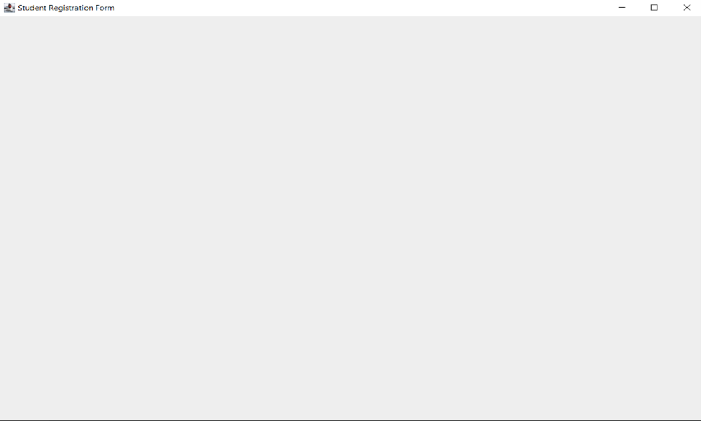
دقت کنید که وقتی پنجره رو می‌بندید، کد شما همچنان ادامه پیدا می‌کنه و متوقف نمی‌شه. برای این که این رفتار رو تغییر بدید، می‌تونید حالت عملیات بستن پنجره رو با کد زیر تغییر بدید. (گزینه‌ای که توی کد زیر استفاده شده باعث میشه کد به طور کامل با بسته شدن پنجره متوقف بشه. حالت‌های دیگه‌ای هم هست که می‌تونید ازشون استفاده کنید.)

```java
frame.setDefaultCloseOperation(JFrame.EXIT_ON_CLOSE);
```

کد نهایی ما به صورت زیر هست:

```java
import javax.swing.*;
import java.awt.*;
public class Main{
   public static void main(String[] args) {  
      JFrame frame = new JFrame("Student Registration Form");  
      Dimension frameSize = new Dimension(1024,720);  
      frame.setSize(frameSize);  
      frame.setVisible(true);  
      frame.setDefaultCloseOperation(JFrame.EXIT_ON_CLOSE);  
   }  
}
```

در ادامه، به اجزای مختلفی ميپردازیم که ميتونید به این قاب اضافه کنید.

### Panel

`JPanel` ساده‌ترین کلاس در بین اجزای گرافیکی در جاواست `JPanel` . فضایی رو در برنامه ایجاد می‌کنه که می‌تونید هر جزء گرافیکی رو بهش اضافه کنید. می‌تونید `JPanel` رو مثل بوم نقاشی تصور کنید که اجزای گرافیکی شما مثل اجزای نقاشی روی اون قرار می‌گیرن.

حالا ممکنه این سوال پیش بیاد که آیا `JFrame` و `JPanel` مثل هم نیستن؟ چون توی `JFrame` هم اجزای گرافیکی رو بهش اضافه می‌کردیم. باید بگم که `JFrame` فقط یه پنجره معمولیه که در برنامه‌های کاربردی ازش استفاده می‌کنیم. اما `JPanel` با امکاناتی که داره برای سازماندهی اجزای گرافیکی توی جاوا خیلی بهتر و مناسب‌تره. در واقع، `JPanel` جزئی هست که روی این قاب (`JFrame`) قرار می‌گیره و تقریبا خودش می‌تونه مثل یه `mini frame` برای اجزای دیگه مثل دکمه‌ها، لیبل‌ها و... باشه.

معمولا توی یه برنامه، از یه فریم اصلی استفاده میشه و پنل‌ها روی این فریم سوار می‌شن. طی تعامل کاربر با برنامه (مثلاً از طریق دکمه‌ها)، این پنل‌ها می‌تونن جابجا بشن. مثلا وقتی یه دکمه رو می‌زنید، از یه صفحه به صفحه دیگه میرید.جلوتر برای این مورد مثال می‌زنیم.

در ادامه می‌خواهیم پنلی به رنگ آبی روی قسمتی از پنجره خود ایجاد کنیم.

توجه کنید که برای مشخص کردن ابعاد پنجره تون، می‌تونید از کد زیر هم استفاده کنید:

```java
frame.setSize(500, 500);
```

اول باید به قابتون چینشی خالی بدید تا بتونید پنل‌ها رو آزادانه روی قاب قرار بدید. (در ادامه به طور مختصر به انواع چینش‌ها می‌پردازیم).

توجه کنید که در کد زیر، `null` یعنی هیچ‌گونه `Layout Manager` (مدیریت چیدمان) برای فریم تنظیم نشده. این یعنی شما باید خودتون موقعیت و ابعاد اجزای رابط کاربری رو به صورت دستی مشخص کنید . در جاوا، `null` یک کلیدواژه (keyword) است که نمایانگر تهی یا مقدار خالی است. در واقع، در اینجا وقتی از `null` استفاده می‌کنید، ترتیب قرارگیری اجزا و اندازه‌های اون‌ها به شما واگذار میشه و دیگه Java به طور خودکار اون‌ها رو بر اساس یه طرح‌بندی خاص تنظیم نمی‌کنه.

```java
frame.setLayout(null);
```

همونطور که در قسمت قبلی گفتیم، برای استفاده از کلاس `JPanel` هم ابتدا باید یک آبجکت جدید از روی این کلاس ایجاد کنیم و براش یه اسم انتخاب کنیم. از این به بعد با استفاده از نام این آبجکت، می‌تونیم متدهای مختلفی رو به کلاس `JPanel` جاوا اختصاص بدیم. کدش به صورت زیر هست :

```java
JPanel mainPanel = new JPanel();
```

به کمک کد زیر می‌تونیم اندازه و موقعیت پنلمون رو مشخص کنیم. (توجه کنید که اندازه پنل می‌تونه با اندازه پنجره هم یکسان باشه.):

```java
mainPanel.setBounds(40, 35, 400, 400);
```

نکته‌ای که اهمیت داره اینه که در تنظیم مرزهای پنل، مقداردهی‌های داده شده به صورت زیر تحلیل میشن:

دو مولفه اول `(35, 40)` به ترتیب طول و عرض نقطه‌ای `(x, y)` هستن که پنل ما از اون نقطه شروع میشه. مولفه‌های سوم و چهارم هم به ترتیب عرض و ارتفاع پنل هستن. به مثال زیر در این راستا توجه کنید:

```java
panel.setBounds(0, 0, 512, 720);
```

- **مولفه اول و دوم**: مقدار `0` سمت چپ مکان شروع پنل روی بردار `x` هاست و مقدار `0` سمت راست مکان شروع پنل روی محور `y` هاست (به شکل زیر دقت کنید محور ها روی قاب به این شکل هستن).

- مولفه سوم و چهارم :مقادیر `512` و `720` به ترتیب عرض و ارتفاع پنل هستن.
- از متد `setBounds()` زمانی که `layout`ای نداریم (اون رو `null` گذاشتیم) استفاده می‌کنیم.

در ادامه، می‌خواهیم رنگ پنلمون رو تعیین کنیم. کلاس `Color` یکسری رنگ‌های پیش‌فرض داره که می‌تونید با اپراتور دات اون‌ها رو مشاهده کنید، ولی راستش رو بخواید، خیلی رنگ‌های جذابی نیستن. شما می‌تونید با ساختن یک آبجکت جدید از کلاس `Color` و دادن ورودی کد هگزادسیمال رنگ دلخواه خودتون، هر رنگی رو به اجزای دلخواهتون بدید. مثلاً، در اینجا من از کد رنگ baby blue استفاده کردم.

کد این رنگ برابر `#89CFF0` هست، اما اگر از مبانی برنامه‌نویسی یادتون باشه، به جای `#`، با `0x` در ابتدای عدد مشخص می‌کنیم که عددمون هگزادسیمال هست (`0x89CFF0`).در کد زیر رنگ پنل رو مشخص کردیم. از این فرایند برای تعیین رنگ هر کامپوننت دیگه‌ای هم می‌تونید استفاده کنید.

```java
mainPanel.setBackground(new Color(0x89CFF0));
```

در انتها باید به صورت زیر پنلمون رو به frame اضافه کنیم:

```java
frame.add(mainPanel);
```

کد نهایی ما به صورت زیر میشه:

```java
import javax.swing.*;
import java.awt.*;

public class Main{
   public static void main(String[] args) {  
  
      JFrame frame = new JFrame("Student Registration Form");  
      frame.setSize(500, 500);  
      frame.setDefaultCloseOperation(JFrame.EXIT_ON_CLOSE);  
      frame.setLayout(null);  
  
      JPanel mainPanel = new JPanel();  
      mainPanel.setBounds(40, 35, 400, 400);   
      mainPanel.setBackground(new Color(0x89CFF0));

      frame.add(mainPanel);  
      frame.setVisible(true);  
   }  
}
```

خروجی کد فوق:

### Labels

برچسب (`Label`) یک آبجکت از کلاس `JLabel` هست که برای نمایش متن یا عکس در فضای رابط کاربری استفاده میشه و فقط برای خواندن قابل دسترسه (یعنی کاربر نمی‌تونه چیزی رو روش تغییر بده). توجه کنید که متن رو میشه از طریق برنامه تغییر داد، اما کاربر نمی‌تونه مستقیماً اون رو ویرایش کنه. به طور کلی، از کلاس `JLabel` برای نمایش متن یا تصویر در برنامه‌های گرافیکی استفاده می‌کنیم.

باز هم مثل قبل، برای استفاده از کلاس JLabel باید اول یک آبجکت جدید از این کلاس بسازیم و یه نام برای اون انتخاب کنیم. از این به بعد می‌تونیم با استفاده از نام این آبجکت، متدهای کلاس `JLabel` رو فراخوانی کنیم.

در کد زیر، متن دلخواه رو با استفاده از `JLabel` نمایش می‌دیم و با استفاده از `setBounds` موقعیت و اندازه برچسب‌ها رو مشخص می‌کنیم:

```java
JLabel nameLabel = new JLabel("Student name:");  
nameLabel.setBounds(10, 10, 300, 50);  
JLabel numberLabel = new JLabel("Student number:");  
numberLabel.setBounds(10, 90, 300, 50);  
JLabel emailLabel = new JLabel("Email:");  
emailLabel.setBounds(10, 170, 300, 50);
```

در نهایت با کد زیر برچسب هامون رو به پنل اضافه می کنیم:

```java
mainPanel.add(nameLabel);  
mainPanel.add(numberLabel);  
mainPanel.add(emailLabel);
```

کد نهایی به صورت زیر هست:

```java
import javax.swing.*;
import java.awt.*;

public class Main{
   public static void main(String[] args) {  
      JFrame frame = new JFrame("Student Registration Form");  
      frame.setSize(500, 500);  
      frame.setDefaultCloseOperation(JFrame.EXIT_ON_CLOSE);
      frame.setLayout(null);  
          
      JPanel mainPanel = new JPanel();  
      mainPanel.setBounds(40, 35, 400, 400);  
      mainPanel.setBackground(new Color(0x89CFF0));  
      mainPanel.setLayout(null);   
          
      JLabel nameLabel = new JLabel("Student name:");  
      nameLabel.setBounds(10, 10, 300, 50);  
      JLabel numberLabel = new JLabel("Student number:");  
      numberLabel.setBounds(10, 90, 300, 50);  
      JLabel emailLabel = new JLabel("Email:");  
      emailLabel.setBounds(10, 170, 300, 50);  
          
      mainPanel.add(nameLabel);  
      mainPanel.add(numberLabel);  
      mainPanel.add(emailLabel);  
          
      frame.add(mainPanel);  
      frame.setVisible(true);  
   }  
}
```

خروجی کد:

### TextField
کلاس `JTextField` شامل اجزای گرافیکی «متنی» هست که وقتی از اون آبجکتی بسازید، به شما این امکان رو می‌ده که یک خط متن رو ویرایش کنید. برای اینکه بهتر متوجه بشید، می‌تونید برنامه Notepad رو باز کنید و از منوی Edit گزینه Find رو انتخاب کنید.

در تصویر بالا، ما قصد داریم کلمه «جاوا» رو در میان متن موجود در برنامه Notepad پیدا کنیم. فیلدی که در بخش Find برای وارد کردن کلمه مورد نظر استفاده می‌کنیم، همون جزء گرافیکی `JTextField` هست که با رنگ قرمز مشخص کردیم. احتمالاً با این نوع اجزای گرافیکی زیاد برخورد کردید، مثلاً وقتی که در فرم‌های ثبت‌نام، اطلاعات کاربری رو وارد می‌کنید. متنی که در این اجزای گرافیکی وارد می‌کنیم ویژگی‌های زیر رو داره:

- به صورت یک خط یا سطر هست.
- بر خلاف `JLabel` که فقط برای نمایش متن استفاده می‌شه، این فیلدها توسط کاربر هم قابل ویرایش هستن، یعنی شما می‌تونید متن قبلی رو با متن جدید عوض کنید.

حالا می‌خواهیم سه تا `TextField` برای سه لیبلی که قبلاً ساختیم، ایجاد کنیم:

همونطور که قبل‌تر گفتیم، برای استفاده از کلاس `JTextField` باید اول یک آبجکت جدید از این کلاس بسازیم و یه نام براش انتخاب کنیم. از این به بعد می‌تونیم با استفاده از نام این آبجکت به متدهای کلاس `JTextField` دسترسی پیدا کنیم. با استفاده از `setBounds` هم می‌تونیم موقعیت و اندازه این فیلدها رو تعیین کنیم.

```java
JTextField nameTextField = new JTextField();  
nameTextField.setBounds(170, 10, 200, 40);  
JTextField numberTextField = new JTextField();  
numberTextField.setBounds(170, 90, 200, 40);  
JTextField emailTextField = new JTextField();  
emailTextField.setBounds(170, 170, 200, 40);
```

در انتها با کد زیر، TextField هایمان را به پنل اضافه می کنیم:

```java
mainPanel.add(nameTextField);  
mainPanel.add(numberTextField);  
mainPanel.add(emailTextField);
```

خروجی کد:
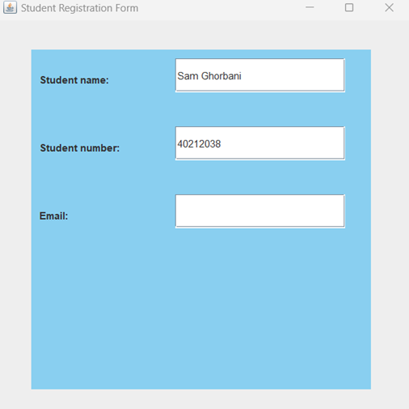

دقت شود که ما متن پیشفرضی برای `textfield` هایمان نذاشته بودیم و متن موجود در فیلدهای مثال بالا، مثلا توسط کاربر وارد شده‌اند.

### نمایش تصویر با استفاده از کلاس `JLabel`

همونطور که قبلاً گفتیم، توی جاوا می‌تونیم برای نمایش تصاویر از کلاس `JLabel` استفاده کنیم. این کلاس به ما این امکان رو می‌ده که تصاویر رو توی صفحه نمایش برنامه نشون بدیم.

برای شروع، باید یه شیء از کلاس `JLabel` بسازیم و تصویر مورد نظر رو به اون اختصاص بدیم. برای این کار می‌تونیم از کلاس `ImageIcon` استفاده کنیم تا تصویر رو بخونیم و بعد اون رو به آبجکت ساخته شده از کلاس `JLabel` اختصاص بدیم . `ImageIcon`، یک کلاس در سوینگ هست که به ما کمک می‌کنه تصاویر رو روی کامپوننت‌هایی مثل `JLabel` و `JButton` بارگذاری کنیم و نمایش بدیم. مثلاً برای نمایش تصویر با نام `"imagee.png"` که توی پوشه `src` برنامه قرار داره، به صورت زیر عمل می‌کنیم:

```java
ImageIcon imageIcon = new ImageIcon("src/imagee.png");
```


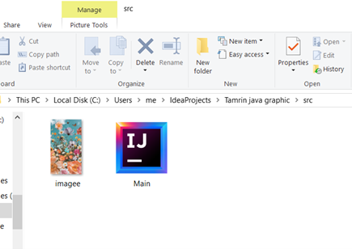
مسیر دقیق فایل رو به صورت بالا در کدمون مشخص میکنیم و با استفاده از کلاس `ImageIcon` تصویر `"imagee.png"` رو می‌خونیم.در ادامه برای تغییر اندازه تصویر (scaling) از کد زیر استفاده می کنیم:

```java
Image scaledImage = imageIcon.getImage().getScaledInstance(150, 150, Image.SCALE_SMOOTH);
```

- متد `getImage()` از کلاس `ImageIcon` تصویر خام (Image) رو که داخل آبجکت `ImageIcon` هست، برمی‌گردونه. می‌تونید از این متد برای کارهای گرافیکی یا تغییر اندازه تصویر استفاده کنید.
- متد `getScaledInstance()` از کلاس `Image` برای تغییر اندازه تصویر به کار میره. این متد سه تا ورودی (آرگومان) می‌گیره:
- عرض تصویر (`width`): مقدار عددی عرض جدید تصویر که در اینجا `150` پیکسل تعیین می کنیم.
- ارتفاع تصویر (`height`): مقدار عددی ارتفاع جدید تصویر که اینجا هم `150` پیکسل تعیین می‌کنیم.
- راهنماهای مقیاس‌دهی (`hints`): روشی که می‌خواهیم برای تغییر اندازه تصویر استفاده کنیم. این آرگومان الگوریتم مقیاس‌دهی رو مشخص می‌کنه. در اینجا از `Image.SCALE_SMOOTH` استفاده کردیم.

مقدار `Image.SCALE_SMOOTH` یک ثابت از کلاس `Image` هست که الگوریتمی برای مقیاس‌دهی تصویر ارائه میده. این روش باعث میشه کیفیت تصویر موقع تغییر اندازه حفظ بشه. سرعتش شاید کمی پایین‌تر باشه، اما نتیجه نهایی کیفیت بالاتری داره. بعضی مقادیر دیگه برای `hints` عبارتند از :

- `Image.SCALE_FAST` : سرعت بالاتر با کیفیت پایین‌تر.
- `Image.SCALE_DEFAULT` : استفاده از تنظیمات پیش‌فرض سیستم.
- `Image.SCALE_REPLICATE` : مقیاس‌دهی ساده که ممکنه کیفیت خوبی نداشته باشه.

مثالی برای اینکه این موضوع رو بهتر متوجه بشید: فرض کنید تصویری دارید که اندازه‌ش `750*500` پیکسل هست و می‌خواهید اون رو کوچک کنید تا توی فضای `150*100` پیکسلی جا بشه. این خط دقیقاً این کار رو انجام میده، بدون اینکه کیفیت تصویر خیلی افت کنه.

حالا تصویر رو به شئ `JLabel` اختصاص میدیم:

```java
JLabel imageLabel = new JLabel(new ImageIcon(scaledImage));
```

سپس به کمک `setBounds` موقعیت تصویر رو در صفحه مشخص می کنیم:

```java
imageLabel.setBounds(30, 230, 100, 150);
```

و در انتها، تصویر را به پنلمون اضافه می کنیم:

```java
mainPanel.add(imageLabel);
```

خروجی کد:


### Button

همونطور که قبلاً گفتیم، یکی از روش‌هایی که کاربر می‌تونه با برنامه ارتباط برقرار کنه، کلیک کردن روی دکمه‌هاست. پس هر کدوم از دکمه‌ها می‌تونن یه کار خاصی رو انجام بدن. اشیاء ساخته شده از کلاس `JButton` دکمه‌هایی هستن که وقتی کاربر روشون کلیک می‌کنه، یه کار مشخص رو انجام میدن.

مثل همیشه، برای استفاده از کلاس `JButton` هم باید اول یه آبجکت جدید از روی این کلاس بسازیم و براش یه اسم انتخاب کنیم. از این به بعد می‌تونیم با استفاده از اسم این آبجکت، متدهای مختلف کلاس `JButton` رو صدا بزنیم. در کد زیر که دو دکمه تعریف کردیم، می‌تونید متن دلخواه رو روی دکمه بذارید و با استفاده از `setBounds` هم موقعیت و اندازه دکمه رو مشخص کنید.

```java
JButton submitButton = new JButton("Submit");  
submitButton.setBounds(10, 10, 300, 50);

JButton okButton = new JButton("OK");  
okButton.setBounds(150, 330, 100, 50);
```

بعد از اینکه دکمه رو تعریف کردید، می‌تونید با استفاده از روش زیر اون رو فعال کنید. تو این برنامه می‌خواهیم وقتی دکمه زده شد، پیامی مبتنی بر ثبت شدن اطلاعات را نشان دهد. برای این کار دو حالت مختلف رو با دو مثال بررسی می‌کنیم.

اولا نیاز داریم که در ابتدای کدمون، پکیج زیر رو ایمپورت کنیم:

```java
Import java.awt.event.*;
```

حالا، کد زیر رو به برناممون اضافه میکنیم:

```java
submitButton.addActionListener(new ActionListener() {
   @Override
   public void actionPerformed(ActionEvent e) {  
      // Button functionality
   }
});
```

قسمت کامنت شده جاییست که کارهایی رو که می‌خواهیم بعد از فشردن دکمه اجرا بشه، کدش رو می‌نویسیم. نحوه فعال‌سازی دکمه همیشه به یه شکل ثابت نوشته میشه، ولی کارهایی که باید انجام بشه (همون قسمت کامنت شده) رو میشه به روش‌های مختلف و متنوع نوشت.  
همونطور که گفتیم، می‌خواهیم با فشردن دکمه یه پیغام نشون بدیم که نشون ‌دهنده ثبت شدن اطلاعات باشه.

**مثال یک**

یک پنل جدید می‌سازیم و به آن یک لیبل جدید و دکمه اختصاص میدهیم.هدف اینه که با زدن دکمه، پنل‌ها روی فریم

جایگزین بشن. برای پنل دوم، از یکی از رنگ‌های پیش‌فرض کلاس Color استفاده می‌کنیم:

```java
JPanel successPanel = new JPanel();  
successPanel.setBounds(40, 35, 400, 400);   
successPanel.setBackground(Color.lightGray);  
successPanel.setLayout(null);

JLabel infoLabel = new JLabel("Information Submitted successfully");  
infoLabel.setBounds(100, 170, 350, 50);

successPanel.add(infoLabel);
```

دکمه `submitButton` رو به پنل اول و دکمه `okButton` رو به پنل دوم اضافه میکنیم:

```java
mainPanel.add(submitButton);  
successPanel.add(okButton);
```

حالا، `actionListener` رو برای هر دو دکمه پیاده سازی می‌کنیم به طوری که با زدن دکمه ها‌، بین پنل‌ها جابه‌جا بشیم:

```java
submitButton.addActionListener(new ActionListener() {
   @Override
   public void actionPerformed(ActionEvent e) {
      frame.getContentPane().removeAll();

      frame.add(successPanel);

      frame.revalidate();

      frame.repaint();

   }
});

okButton.addActionListener(new ActionListener() {
   @Override
   public void actionPerformed(ActionEvent e) {
      frame.getContentPane().removeAll();

      frame.add(mainPanel);

      frame.revalidate();

      frame.repaint();

   }
});
```

متد `getContentPane().removeAll()` تمام اجزا و کامپوننت های داخل فریم رو حذف میکنه. اینکار باعث جلوگیری از باقی موندن اجزای قبلی هنگام تغییر صفحه میشه. متد `revalidate()` چیدمان (`layout`) را به‌روزرسانی میکنه و متد `repaint()` کل فریم رو دوباره رسم میکنه تا تغییرات به درستی نشون داده بشن.

خروجی کد بعد از کلیک بر روی دکمه `Submit`:

با کلیک بر روی دکمه OK ، به صفحه اصلی برمیگردیم.

کد نهایی برنامه مثال یک به صورت زیر هست:

```java
import javax.swing.*;
import java.awt.*;
import java.awt.event.*;

public class Main{
   public static void main(String[] args) {  
      JFrame frame = new JFrame("Student Registration Form");  
      frame.setSize(500, 500);  
      frame.setDefaultCloseOperation(JFrame.EXIT_ON_CLOSE);  
      frame.setLayout(null);  
  
      JPanel mainPanel = new JPanel();  
      mainPanel.setBounds(40, 35, 400, 400);  
      mainPanel.setBackground(new Color(0x89CFF0));
      mainPanel.setLayout(null);  
      JPanel successPanel = new JPanel();  
      successPanel.setBounds(40, 35, 400, 400);  
      successPanel.setBackground(Color.lightGray);
      successPanel.setLayout(null);

      //labels of mainPanel  
      JLabel nameLabel = new JLabel("Student name:");  
      nameLabel.setBounds(10, 10, 150, 50);  
      JLabel numberLabel = new JLabel("Student number:");  
      numberLabel.setBounds(10, 90, 150, 50);  
      JLabel emailLabel = new JLabel("Email:");  
      emailLabel.setBounds(10, 170, 150, 50);

      //label of successPanel  
      JLabel infoLabel = new JLabel("Information Submitted successfully");  
      infoLabel.setBounds(100, 170, 350, 50);  


      JTextField nameTextField = new JTextField();  
      nameTextField.setBounds(170, 10, 200, 40);  
      JTextField numberTextField = new JTextField();  
      numberTextField.setBounds(170, 90, 200, 40);  
      JTextField emailTextField = new JTextField();  
      emailTextField.setBounds(170, 170, 200, 40);  

      ImageIcon imageIcon = new ImageIcon("src/imagee.png");  
      Image scaledImage = imageIcon.getImage().getScaledInstance(150, 150, Image.SCALE_SMOOTH);  
      JLabel imageLabel = new JLabel(new ImageIcon(scaledImage));  
      imageLabel.setBounds(30, 230, 150, 150);  
  
      JButton submitButton = new JButton("Submit"); //for mainPanel  
      submitButton.setBounds(270, 330, 100, 50);   
      JButton okButton = new JButton("OK"); //for successPanel  
      okButton.setBounds(150, 330, 100, 50);


      submitButton.addActionListener(new ActionListener() {
         @Override
         public void actionPerformed(ActionEvent e){
            frame.getContentPane().removeAll();
            frame.add(successPanel);
            frame.revalidate();
            frame.repaint();  
         }  
      });  
      okButton.addActionListener(new ActionListener() {
         @Override
         public void actionPerformed(ActionEvent e){
            frame.getContentPane().removeAll();
            frame.add(mainPanel);
            frame.revalidate();
            frame.repaint();  
         }  
      });  

      mainPanel.add(imageLabel);  
      mainPanel.add(nameLabel);  
      mainPanel.add(numberLabel);  
      mainPanel.add(emailLabel);  
      mainPanel.add(nameTextField);  
      mainPanel.add(numberTextField);  
      mainPanel.add(emailTextField);  
      mainPanel.add(submitButton);

      successPanel.add(infoLabel);

      successPanel.add(okButton);  

      frame.add(mainPanel);  
      frame.setVisible(true);  
   }  
}
```

**مثال دو**

از `JOptionPane` برای نمایش پاپ آپی (`dialog`) استفاده می‌کنیم.

به کد زیر که در اون از این کلاس استفاده کردیم، دقت کنید:

```java
submitButton.addActionListener(new ActionListener() {
   @Override
   public void actionPerformed(ActionEvent e) {  
      JOptionPane.showMessageDialog(frame, “Information submitted successfully”);
   }
});
```

خروجی کد بعد از کلیک روی دکمه `Submit`:

**مثال ۳**

تو این مثال، میخوایم از چندتا از متدهای کاربردی کلاس `JTextField` هم استفاده کنیم. متدهای `setText` و `getText` دو متد خیلی پرکاربرد توی کلاس‌های `Swing` هستن. اینا کمک می‌کنن که شما بتونید متن داخل یک کامپوننت گرافیکی رو تنظیم کنید یا ازش متنی رو دریافت کنید.

- متد `setText(String text)` : این متد برای تنظیم کردن متن داخل یک کامپوننت گرافیکی به کار میاد. یعنی وقتی بخواید یه متن خاص رو توی `JTextField` نمایش بدید، از این متد استفاده می‌کنید.
- متد `getText()` : این متد هم برای دریافت متن از داخل یک کامپوننت گرافیکی هست. مثلا اگه بخواید بدونید کاربر چی وارد کرده، این متد می‌تونه بهتون کمک کنه.

حالا می‌خوایم توی یه نمونه ساده تری از برنامه قبلی مون از این دو متد استفاده کنیم ، به طوری که کاربر اطلاعاتش رو وارد می‌کنه و با زدن دکمه `Submit`، اطلاعات توی یه `TextField` دیگه نمایش داده میشه. برای این کار، اول یه `TextField` دیگه می‌سازیم که بعد از فشردن دکمه `Submit`، فقط اطلاعات رو نشون بده و دیگه نتونه ویرایش بشه. به همین دلیل، ویژگی `setEditable(false)` رو براش تنظیم می‌کنیم که این فیلد فقط برای نمایش استفاده بشه. در ادامه دکمه `Submit` رو هم تعریف می‌کنیم. کد مربوطه به شکل زیر خواهد بود:

```java
JButton submitButton = new JButton("Submit");  
submitButton.setBounds(150, 160, 100, 30);

JTextField outputTextField = new JTextField();  
outputTextField.setBounds(10, 210, 360, 30);  
outputTextField.setEditable(false);
```

چون عملیات "دریافت ورودی" و "نمایش خروجی" باید بعد از کلیک روی دکمه `Submit` انجام بشه، این عملیات‌ها رو داخل متد `actionPerformed()` قرار میدیم. این متد فقط زمانی اجرا میشه که کاربر روی دکمه کلیک کنه. (کدهای مربوط به فعال کردن دکمه قبلاً توضیح داده شده) حالا به کد زیر و کامنت‌های داخلش دقت کنید:

```java
submitButton.addActionListener(new ActionListener() {
   @Override
   public void actionPerformed(ActionEvent e) {

      // Receive input from the name field  
      String name = nameTextField.getText();

      // Receive input from the student number field  
      String number = numberTextField.getText();

      // Receive input from the email field  
      String email = emailTextField.getText();

      // Combine the information and display it in the output field
      outputTextField.setText("Name: " + name + " | Number: " + number + " | Email: " + email);  
   }  
});
```

در کد بالا ما یک `ActionListener` به دکمه اضافه کردیم که با هر بار کلیک کردن ، متد `()actionPerformed` رو اجرا بکنه. حالا باید دکمه `Submit` و `outputTextField` رو به پنل اضافه کنیم تا همه چیز به درستی نمایش داده بشه. کد مربوط به اضافه کردن دکمه و `outputTextField` به پنل به صورت زیر هست:

```java
mainPanel.add(submitButton);  
mainPanel.add(outputTextField);
```

کد نهایی به صورت زیر هست:

```java
import javax.swing.*;
import java.awt.*;
import java.awt.event.ActionEvent;
import java.awt.event.ActionListener;

public class Main {
   public static void main(String[] args) {  
      JFrame frame = new JFrame("Student Registration Form");  
      frame.setSize(500, 500);  
      frame.setDefaultCloseOperation(JFrame.EXIT_ON_CLOSE);  
      frame.setLayout(null);  
  
      JPanel mainPanel = new JPanel();  
      mainPanel.setBounds(40, 35, 400, 400);  
      mainPanel.setBackground(new Color(0x89CFF0));  
      mainPanel.setLayout(null);  
  
      JLabel namelabel = new JLabel("Student name:");  
      namelabel.setBounds(10, 10, 150, 30);  
      JLabel numberlabel = new JLabel("Student number:");  
      numberlabel.setBounds(10, 60, 150, 30);  
      JLabel emaillabel = new JLabel("Email:");  
      emaillabel.setBounds(10, 110, 150, 30);  
  
      JTextField nametextField = new JTextField();  
      nametextField.setBounds(170, 10, 200, 30);  
      JTextField numbertextField = new JTextField();  
      numbertextField.setBounds(170, 60, 200, 30);  
      JTextField emailtextField = new JTextField();  
      emailtextField.setBounds(170, 110, 200, 30);  
  
      JButton submitButton = new JButton("Submit");  
      submitButton.setBounds(150, 160, 100, 30);  
  
      JTextField outputTextField = new JTextField();  
      outputTextField.setBounds(10, 210, 360, 30);  
      outputTextField.setEditable(false); 

      submitButton.addActionListener(new ActionListener() {
         @Override
         public void actionPerformed(ActionEvent e) {  
            String name = nametextField.getText();  
            String number = numbertextField.getText();  
            String email = emailtextField.getText();

            outputTextField.setText("Name: " + name + " | Number: " + number + " | Email: " + email);  
         }  
      });  
  
      mainPanel.add(nametextField);  
      mainPanel.add(numbertextField);  
      mainPanel.add(emailtextField);  
      mainPanel.add(namelabel);  
      mainPanel.add(numberlabel);  
      mainPanel.add(emaillabel);  
      mainPanel.add(submitButton);  
      mainPanel.add(outputTextField);  

      frame.add(mainPanel);  
      frame.setVisible(true);  
   }  
}
```

خروجی کد بعد از کلیک کردن بر روی دکمه:

### Layouts (چینش‌ها)

چیدمان اجزا تو صفحه، یکی از بخش‌های مهم برای ساخت رابط کاربریِ به قولی user friendly تره. همونطور که تو کد نمونه اول دیدید:

```java
frame.setLayout(null);
```

این خط کد یه صفحه‌ی خالی برامون ایجاد کرد و این امکان رو داد که با مشخص کردن موقعیت و اندازه‌ی اجزا، چیدمان صفحه رو به سلیقه‌ی خودمون تنظیم کنیم. اما یه مشکل اساسی داره! همون‌طور که احتمالاً خودتون هم دیدید، وقتی اندازه‌ی صفحه تغییر می‌کنه، عناصر صفحه به‌صورت خودکار تنظیم نمیشن و همون‌جا که بودن، ثابت می‌مونن. این موضوع می‌تونه باعث به‌هم‌ریختگی رابط کاربری بشه.

برای حل این مشکل، می‌تونیم از چیدمان‌های آماده (`Layouts`) برای `Frame` یا سایر اجزای صفحه استفاده کنیم. توی ادامه، چند تا از این ابزارهای آماده مدیریت چیدمان رو بررسی می‌کنیم که برای این تمرین لازم داریم.

مزیت استفاده از `layout` ها اینه که برخلاف روش دستی، وقتی اندازه‌ی پنجره تغییر می‌کنه، موقعیت و اندازه‌ی اجزا هم به‌طور خودکار تنظیم میشن و تجربه‌ی کاربری بهتری رقم می‌خوره.

چیدمان‌ها تعیین می‌کنن که عناصر اضافه‌شده به `panel` یا `frame` چطور کنار هم قرار بگیرن. اینجا ما با `panel` کار می‌کنیم، ولی اگه آموزش‌های دیگه رو ببینید، معمولاً چیدمان‌ها روی `frame` پیاده‌سازی میشن. شما هم بسته به نیاز و خلاقیت خودتون، می‌تونید هرکدوم از این روش‌ها رو امتحان کنید.

### Grid Layout

این نوع چیدمان به شما اجازه می‌ده اجزا رو داخل یه شبکه مرتب کنید، جوری که هر کدوم بتونن یک یا چند سلول رو اشغال کنن. شما هم کنترل کاملی روی ترتیب و فضای بین این اجزا دارید.

در این روش، کامپوننت‌ها داخل یه شبکه شطرنجی قرار می‌گیرن و هر کدوم، تمام فضای سلول خودشون رو پر می‌کنن. موقع تنظیم این چیدمان، می‌تونید تعداد سطرها، ستون‌ها و فاصله بینشون رو مشخص کنید تا دقیقا همون چیزی که می‌خواید، پیاده‌سازی بشه. همچنین میتونید این کار ها رو به ترتیب با متد های زیر انجام دهید:

1.  `setRows(int rows)` : تنظیم تعداد سطرها
2.  `setColumns(int coumns)` : تنظیم تعداد ستون ها
3.  `setHgap(int hgap)` : تنظیم فاصله افقی بین سلول ها
4.  `setVgap(int vgap)` : تنظیم فاصله عمودی بین سلول ها

برای نمونه، در کد زیر، بر روی یک پنل با چیدمان `Grid Layout` شش دکمه با فاصله های مشخص از هم قرار میدهیم:

```java
import javax.swing.*;  
import java.awt.*;  
  
public class Grid {
   public static void main(String args[]){  
      JFrame frame = new JFrame();  
      frame.setSize(500, 500);  
      frame.setDefaultCloseOperation(WindowConstants.EXIT_ON_CLOSE);  

      JPanel panel = new JPanel();
      GridLayout gridLayout = new GridLayout(2, 3, 10, 10);  
      panel.setLayout(gridLayout);  

      JButton button1 = new JButton("1");  
      JButton button2 = new JButton("2");  
      JButton button3 = new JButton("3");  
      JButton button4 = new JButton("4");  
      JButton button5 = new JButton("5");  
      JButton button6 = new JButton("6");  
  
      panel.add(button1);  
      panel.add(button2);  
      panel.add(button3);  
      panel.add(button4);  
      panel.add(button5);  
      panel.add(button6);  
  
      frame.add(panel);  
      frame.setVisible(true);  

   }
```

در کد بالا، یک آبجکت از کلاس `GridLayout` ساختیم و ورودی ها به ترتیب از چپ، 2 سطر، 3 ستون و فاصله های افقی و عمودی 10 پیکسلی بین هر دکمه را مشخص میکنند.

خروجی کد:
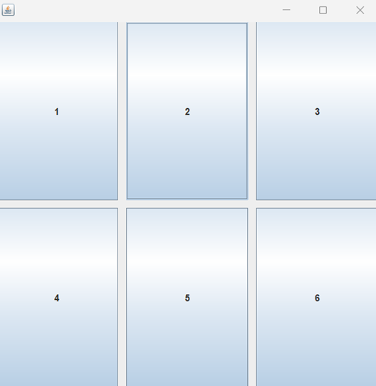
حال، با فراخوانی چهار متد زیر، تعداد سطر و ستون ها رو برعکس کرده و فاصله های عمودی و افقی را به 50 افزایش میدهیم:

```java
gridLayout.setRows(3);  
gridLayout.setColumns(2);  
gridLayout.setHgap(50);  
gridLayout.setVgap(50);
```

خروجی کد:
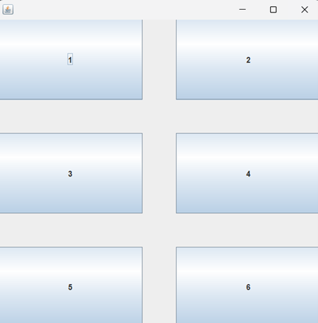
برای مثال، در پیاده‌سازی این برنامه نیز از grid layout استفاده شده:

[این ویدئو](https://www.youtube.com/watch?v=ohNqQagkDDY) رو برای بررسی دقیق‌تر این `Layout` نگاه کنین.

### Border Layout

حالت پیش‌فرض جاوا برای چیدمان پنل‌هاست که از 5 ناحیه تشکیل شده و شکل کلیش به شکل زیره.
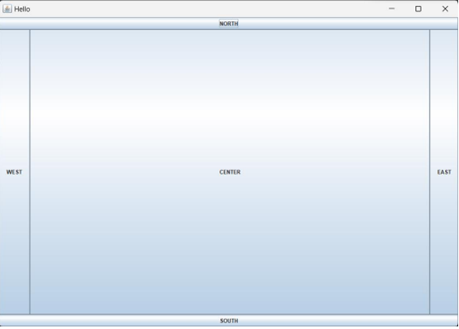
پس برعکس کاری که در برنامه‌ای که باهم ساختیم انجام دادیم، باید ورودی متد `setLayout()` رو بجای `null`، با استفاده از دستور `new`، شیءای جدید از کلاس `BorderLayout` بذاریم:

```java
mainPanel.setLayout(new BorderLayout);
```

برای هر کدام از اجزایی که به پنل اضافه ميکنیم، باید اشاره کنیم که در کدام ناحیه قرار ميگیرد که به این منظور به شکل زیر عمل ميکنیم:

```java
// add a new JButton with name "NORTH" and it is on top of the container JButton northButton = new JButton("NORTH"); 

mainPanel.add(northButton, BorderLayout.NORTH);
```

[این ویدئو](https://www.youtube.com/watch?v=PD6pd6AMoOI) رو برای درک بهتر این چیدمان بررسی کنین.

### Box Layout

توی این چیدمان، اجزا می‌تونن به دو شکل مرتب بشن:
1.  `Page Axis` ( از بالا به پایین، مثل یک ستون)
2.  `Line Axis` ( از چپ به راست، مثل یک سطر)

به بیان ساده، شما این امکان رو دارید که کامپوننت‌هاتون رو یا زیر هم یا کنار هم قرار بدید.

وقتی با دستور `new` کلاس `BoxLayout` رو مقداردهی می‌کنید، باید دو تا ورودی براش مشخص کنید:

اولین ورودی فریم (`JFrame`) یا پنلی (`JPanel`) که می‌خواید این چیدمان روی اون اعمال بشه.

دومین ورودی یک مقدار ثابته که مشخص می‌کنه چینش به‌صورت ستونی (`PAGE_AXIS`) یا سطری (`LINE_AXIS`) باشه.

علاوه بر این، `BoxLayout` این امکان رو به شما می‌ده که بین اجزا فضای خالی ایجاد کنید تا چیدمان مرتب‌تر بشه.

مثال زیر نحوه‌ی استفاده از `Page Axis` رو نشون می‌ده:

```java
mainPanel.setLayout(new BoxLayout(mainPanel, BoxLayout.PAGE_AXIS));
```
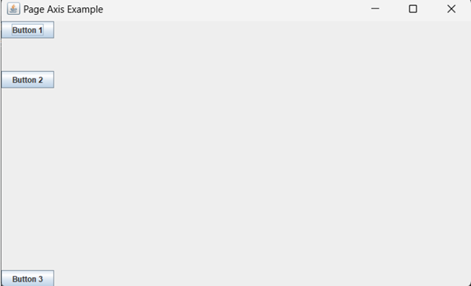
به عنوان مثال، اکنون پنل اول برنامه خودمون که چیدمانش `null` بود رو با `BoxLayout` و `PAGE_AXIS` پیاده سازی میکنیم:

```java
mainPanel.setLayout(new BoxLayout(mainPanel, BoxLayout.PAGE_AXIS));
```

خروجی این چیدمان برای برنامه‌ای که ساختیم به این صورت خواهد بود:
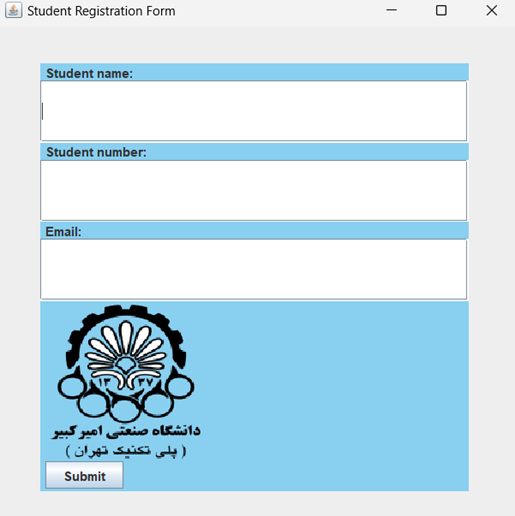
دقت شود که وقتی از لیوت‌ها استفاده میکنیم، بر خلاف وقتی که `null` بود، ترتیب اضافه شدن کامپوننت ها به پنل حائز اهمیت میشه. مثلا برای خروجی بالا، باید به این ترتیب اضافه شوند:

```java
mainPanel.add(nameLabel);  
mainPanel.add(nameTextField);  
mainPanel.add(numberLabel);  
mainPanel.add(numberTextField);  
mainPanel.add(emailLabel);  
mainPanel.add(emailTextField);  
mainPanel.add(imageLabel);  
mainPanel.add(submitButton);
```

[این ویدیو](https://www.youtube.com/watch?v=hBe2eBorQuw)این ویدئو، برای درک بهتر این `Layout` پیشنهاد می‌شود.

### Flow Layout

مدیریت چیدمان `FlowLayout` به شما این امکان رو میده تا اجزا را به صورت پشت سر هم در یک خط یا چند خط مرتب کنید. وقتی صفحتون پر بشه، اجزا به صورت خودکار به خط بعدی منتقل می‌شوند.
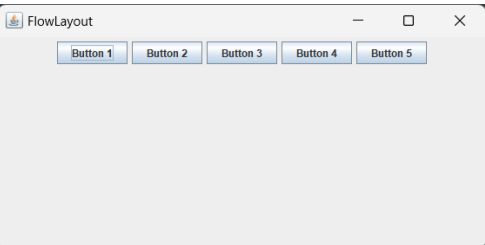
برای درک شهودی بهتر از پیاده‌سازی این `layout`، به [این ویدیو](https://www.youtube.com/watch?v=pDqjHozkMBs) مراجعه کنید.

## برخی از متدهای پرکاربرد برای کلاس‌های کاربردی Swing

### کلاس `JFrame`

- `setText(String title)` : این متد، همون تایتل فریم رو تغییر میده.

- `setSize(int width, int height)` : ابعاد فریم رو مشخص می‌کنه.

- `setVisible(boolean state)` : وضعیت نمایش فریم رو مشخص می‌کنه.

- `setResizable(boolean state)` : اگر ورودی را false قرار دهیم، ابعاد فریم ثابت باقیمانده و کاربر نمیتواند آن را تغییر دهد.

- `setLayout()` : چینش فریم رو مشخص میکنه.

- `setDefaultCloseOperation(int operation)` : بسته به نوع ورودی، وضعیت برنامه بعد از بستن فریم رو مشخص می‌کنه. شما می‌تونید `operation` رو به جای `int`، با `constant` های از پیش تعریف شده‌ای مثل `JFrame.EXIT_ON_CLOSE` پر کنید.

- `setLocationRelativeTo(Component c)` : با `null` قرار دادن ورودی این متد، هنگام ران کردن برنامه، فریم در وسط صفحه مانیتور باز می‌شود.

### کلاس JLabel

- `setText(String text)` : متن لیبل رو مشخص می‌کند.

- `setIcon()` : مثلا برای اضافه کردن `imageIcon` همونطور که بالاتر گفتیم.

- `setForeGround()` : تعیین رنگ متن لیبل به کمک کلاس `Color` که بالاتر استفاده ازش رو توضیح دادیم.

- `setFont()` : فونت متن لیبل رو مشخص می‌کنه. ورودیش یک آبجکت از کلاس فونته که به صورت زیر ساخته می‌شود:

```java
Font font = new Font("font's name", Font.type, int size);
```

قسمت `type` میتونه ثابت های مختلفی مثل `PLAIN` و یا `BOLD` باشه

- `setBorder()`

یک مرز و قاب به دور برچسب ایجاد میکنه. ورودیش یک آبجکت از کلاس `Border` هست.

برای استفاده از متد `setBorder` مثل زیر عمل می‌کنیم:

ورودی دومی ضخامت مرز رو مشخص می‌کنه.

```java
Border border = BorderFactory.createLineBorder(Color.RED, 10);  
namelabel.setBorder(border);
```
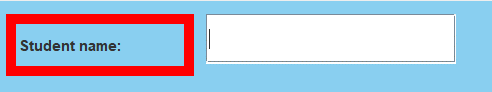

### کلاس JButton

- `setText(String text)` : مثل `JLable` کار می‌کنه.

- `setBackGround()` : مثل متد `setForeGround()` که برای کلاس `JLable` بود، این متد هم رنگ پس زمینه دکمه رو با اسفاده از کلاس `Color` مشخص می‌کنه.

- `setFocusable(boolean state)` : باعث فعالسازی و یا عدم فعالسازی مرز کمرنگ دور نوشته درون دکمه می‌شه.

- `setBorder()` : مثل `JLabel` کار می‌کنه.

- `setActionListener()` : توی مثال‌ها توضیح داده شده.