## مقدمه

شما روی یه پروژه کار می‌کنید، ساعت‌ها روش وقت می‌ذارین و نهایتا به یه فایل `final` می‌رسین. بعد از یه مدت می‌فهمین که «عه، توی `final` یه تایپو هست»، تایپو رو برطرف می‌کنین و به `final(2)` می‌رسین. یه هفته بعد رئیس زنگ می‌زنه و می‌گه که «این `final(2)` که فرستادی بهمان جاش غلطه»، شما هم بهمان جای `final(2)` رو درست می‌کنید تا به `final final(2)` برسین. بعد از یه مدت هم‌تیمی‌تون که تازه یادش اومده که پروژه‌ای وجود داره میاد که اسمش رو اول پروژه بنویسه، ولی اشتباهی روی `final(2)` می‌نویسه و به `final(3)` می‌رسه، که با `final final(2)` کلی فرق می‌کنه، بعد اونو برای رئیس می‌فرسته که «اینم فایل تصحیح شدهٔ پروژهٔ ما» و رئیس هم که می‌بینه هیچی عوض نشده، شروع می‌کنه به غر زدن.


همین مشکلات توی دنیای برنامه‌نویسی هم وجود دارن، و برای حلشون ابزارهای Version Control به وجود اومدن که معروف‌ترینشون Git ‍ه. این ابزارها کمک می‌کنن یه تیم چند ده، چند صد یا حتی چند هزار نفره از برنامه‌نویس‌ها بتونن سال‌ها روی یه پروژه کار کنن، بدون این که مجبور بشن فایلی به اسم `finalfinalfinalv20iSwearToGodThisIsTheFinalOneFinal` درست کنن! حتی تدریس‌یارهای خودتون هم از Git برای مدیریت محتوای کلاستون استفاده می‌کنن.

توی این داکیومنت، ما می‌خوایم با گیت آشنا بشیم. گیت، ابزاری بسیار معروف، بسیار گسترده و اگر راستش رو بخواید، گاهی بسیار رو اعصابه که توی حدودا همهٔ شرکت‌های برنامه‌نویسی استفاده می‌شه. احتمالاً بعد از خوندن این داک، یه کم طول می‌کشه تا دستتون به Git عادت کنه، ولی نگران نباشید، کم‌کم راه می‌افتید. ندارید هم طولانی بودن این داک شما رو بترسونه، چون بخش خوبی از اون اسکرین‌شات و خروجی‌ کدهاست.

یادگیری Git اوایل یه کم سخت و پردست‌اندازه، و احتمالاً به یه سری خطای عجیب و غریب برمی‌خورید که حتی خود لینوس توروالدز هم شاید ندونه چطوری باید حلشون کنه! ولی نگران نباشید. توی این مسیر، حتماً از تدریس‌یارها کمک بگیرید، توی گوگل سرچ کنید و از ChatGPT دربارهٔ مشکلاتی که بهشون برمی‌خورید سؤال بپرسید. در نهایت، Git برای همهٔ دردسرهاتون یه راه‌حل داره، پس با خیال راحت جلو برید. در انتها، باید بگیم که **شما توی پروژه‌های آیندهٔ این درس، لازمه که خیلی جاها از گیت استفاده کنید، پس مهمه که اون رو کامل همین‌جا یاد بگیرین.**

حواستون باشه که پیش‌فرض ما اینه که شما، از داک tools که توی جلسهٔ صفر بهتون داده شده، ابزارهای لازم برای git رو نصب کردین و یه اکانت github ساختین. اگر نکردین، لطفا برگردین و این کارها رو بکنید.

## اطمینان از نصب صحیح گیت

اول از همه، باید مطمئن بشین که Git روی سیستمتون نصب شده و درست کار می‌کنه. اگه از مک یا لینوکس استفاده می‌کنین، ترمینال (Terminal) رو باز کنین، و اگه ویندوزی هستین، پاورشل (PowerShell) رو اجرا کنین. به این صفحه‌ای که باز می‌شه، shell می‌گن. ظاهرش هم احتمالاً یه چیزی شبیه اینه:


توی این صفحه، دستور زیر رو بزنین (حواستون باشه که $ رو نزنید!):

```bash
$ git --version
```

اگر خروجی‌تون شبیه به خروجی زیر نبود، یه جای کار می‌لنگه. به داک tools از جلسهٔ صفر برگردین یا یکی از تدریس‌یارها رو خبر کنین:

```bash
git version 2.39.5 (Apple Git-154)
```

در غیر این صورت، shellتون رو باز نگه دارین. توی این داک به اون نیاز داریم.

## آشنایی اولیه با shell

اول، لازمه که یه توضیح کوتاه راجع به shell ای که دارین باهاش کار می‌کنین بهتون بدیم. شل لینوکس و macOS خیلی به هم شبیه‌ئه، اما شل ویندوز یه مقدار متفاوته.

### ویندوز

صفحهٔ فعلی powershell برای شما همچین چیزیه:

!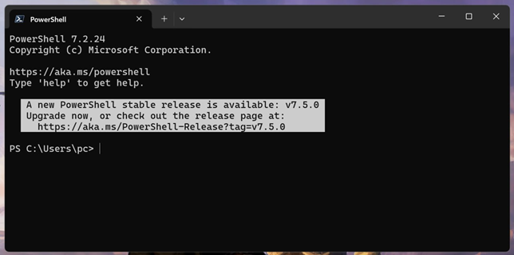

می‌بینید که همچین چیزی روی صفحه‌تونه ولی بسته به اسم یوزری که روی لپ‌تاپتون دارین، بخش pc اسم متفاوتی داره:

```bash
PS C:\Users\{your_username} >
```

این یعنی powershell آمادهٔ گرفتن دستورات شماست و اون‌ها رو توی مسیر `C:\Users\{your_username}` اجرا می‌کنه. ه این مسیر، اصطلاحاً home directory می‌گن. حالا توی همین دایرکتوری، دستور زیر رو اجرا کنین:

```bash
$ ls
```

خروجی‌ای مثل خروجی زیر می‌بینید:

```bash
    Directory: C:\Users\pc  
  
Mode                 LastWriteTime         Length Name  
----                 -------------         ------ ----  
d-r--          12/18/2024  6:27 PM                Contacts  
d-r--           2/13/2025  9:31 PM                Desktop  
d-r--          12/18/2024  6:27 PM                Documents  
d-r--           2/13/2025  7:23 PM                Downloads  
d-r--          12/18/2024  6:27 PM                Favorites  
d-r--          12/18/2024  6:27 PM                Links  
d-r--          12/18/2024  6:27 PM                Music  
d-r--           6/14/2022  8:11 AM                OneDrive  
d-r--          12/18/2024  6:27 PM                Pictures  
d-r--          12/18/2024  6:27 PM                Saved Games  
d-r--          12/18/2024  6:27 PM                Searches  
d----          10/19/2024  8:00 PM                Tracing  
d-r--          12/18/2024  6:27 PM                Videos
```

اگر یه مقدار به این خروجی توجه کنید، می‌بینید که دستور `ls` (که مخفف list ‍ ‍ه) تمام دایرکتوری‌ها و فایل‌هایی که توی `C:\Users\{your_username}` بود رو براتون نشون داده. حالا دستور زیر رو اجرا کنید:

```bash
$ cd Documents
```

دستور cd، که مخفف change directory ‍ه، شما رو به دایرکتوری `C:\Users\{your_username}\Documents` می‌بره. می‌بینید که خط بعدی به همچین چیزی تغییر کرده:

```bash
PS C:\\Users\\{your_username}\\Documents >
```

و اگر الآن باز `ls` بگیرین، این بار محتوای پوشهٔ Documents رو می‌بینید. حالا می‌تونید با دستور زیر، به دایرکتوری قبلی‌تون برگردین:

```bash
$ cd ..
```

### لینوکس و macOS

توی لینوکس یا macOS، شما همچین صفحه‌ای پیش روتون دارین. چون من `zsh` دارم ممکنه ظاهر این صفحه برای شما با مال من فرق کنه، ولی شبیه همینه:


این صفحه هنوز خیلی خالیه، ولی اون بالا یه `~` می‌بینین. این نماد نشون‌دهندهٔ home directory شماست. همون جایی که توش پوشه‌هایی مثل Desktop، Documents، Videos، Downloads و بقیهٔ چیزایی که همیشه باهاشون سروکار دارین، قرار دارن. یعنی home شما اینجاست:


الآن، shell تون آمادهٔ گرفتن دستورات شما و اجراشون توی دایرکتوری home ‍ه. دستور زیر رو توی اون اجرا کنید:

```bash
$ ls
```

خروجی‌ای مثل خروجی زیر می‌بینید:

```bash
Applications         IdeaSnapshots        Projects  
Creative Cloud Files Library              Public  
Desktop              Movies               Qt  
Documents            Music                go  
Downloads            Pictures             iso  
Icons                Postman              keys
```

می‌بینید که دستور ls، لیستی از تمام دایرکتوری‌ها و فایل‌هایی که توی home بود رو بهتون برگردونید. حالا با استفاده از دستور زیر، وارد دایرکتوری Documents بشین:

```bash
$ cd Documents
```

می‌بینید که علامت `~` جای خودش رو به Documents می‌ده و این یعنی شما، با موفقیت وارد پوشهٔ Documents شدین:


اگر این‌جا هم `ls` بزنید، این‌بار لیستی از دایرکتوری‌ها و فایل‌های توی Documents می‌بینید:


با استفاده از دستور زیر، به home برگردین:

```bash
$ cd ..
```

## configure کردن git

قبل از استفاده از git، لازمه که بعضی تنظیمات اون رو عوض کنید.

اول از همه، با دستور زیر ایمیل خودتون رو تنظیم کنین. خوبه که این ایمیل رو، همون ایمیلی بذارین که باهاش اکانت گیت‌هابتون رو ساختین:

```bash
git config --global user.email "molioo1298@gmail.com"
```

بعدش، یه اسم برای خودتون تنظیم کنین:

```bash
git config --global user.name "Jesper"
```

نهایتا، لازمه که editor ای که git ازش استفاده می‌کنه رو تنظیم کنید. این ادیتور به شکل دیفالت روی vim تنظیم شده که ممکنه در دفعات اول استفاده براتون راحت نباشه. اگر از ویدوز استفاده می‌کنید اون رو روی Notepad تنظیم کنید:

```bash
$ git config --global core.editor "notepad.exe"
```

و اگر از macOS استفاده می‌کنید، اون رو روی textEdit تنظیم کنید:

```bash
$ git config --global core.editor "open -W -n -a TextEdit"
```

نهایتا، اگر از لینوکس استفاده می‌کنید، می‌تونید بسته به distro تون اون رو تنظیم کنید، ولی خب وقتی لینوکس دارین بهتره که یه خورده vim یاد بگیرین. =)))

## ایجاد ریپوی گیت

اول از همه، باید یه دایرکتوری جدید بسازیم تا پروژه‌مون رو توی اون قرار بدیم. توی بخش اول، یاد گرفتیم که شل چطور کار می‌کنه و دوتا دستور مهم اون، یعنی `ls` و `cd` رو هم یاد گرفتیم. حالا قبل از هر چیزی، مطمئن بشین که شل شما توی home directory تنظیم شده و نه توی یه دایرکتوری دیگه.

بعد از اون، دستور زیر رو وارد کنید. `mkdir`، که مخفف make directory ‍ه، توی مسیر فعلی شل براتون یه دایرکتوری به اسم `learn-git` ایجاد می‌کنه:

```bash
$ mkdir "learn-git"
```

شما بعد از اجرای این دستور، می‌تونید این دایرکتوری رو توی home تون ببینید:


با استفاده از دستور cd، به این دایرکتوری برین:

```bash
$ cd learn-git
```

اگر الآن `ls` بزنید، می‌بینید که هیچ چیزی توی این دایرکتوری نیست.

حالا بیاین اولین دستور گیت‌مون رو اجرا کنیم (فقط تیکهٔ `git init` رو بنویسید):

```bash
$ git init  

Initialized empty Git repository in /Users/armaho/learn-git/.git/
```

باید یه خروجی مشابه اون چیزی که بالا دیدید، ببینید. با استفاده از این دستور، ما دایرکتوری `learn-git` رو به یه repository تبدیل کردیم. Repository یا به اختصار repo، به پروژه‌ای گفته می‌شه که با استفاده از Git به‌روزرسانی می‌شه. شما می‌تونید توی هر repo تمامی دستورات Git رو اجرا کنید.  
اگر الآن دستور زیر رو اجرا کنید:

```bash
$ ls -a

. .. .git
```

الان می‌بینید که یه دایرکتوری به اسم `.git` توی `learn-git` ایجاد شده. دلیل این که از `-a` با دستور `ls` استفاده کردیم اینه که دایرکتوری .`git` یه دایرکتوری مخفی هست و با `ls` عادی نمایش داده نمی‌شه. این دایرکتوری شامل همه چیزهایی هست که Git برای مدیریت پروژه‌مون نیاز داره. ما کار زیادی با این دایرکتوری نداریم و نباید بهش دست بزنیم، ولی هر وقت جایی `.git` دیدید، بدونید که با یه ریپوی گیت سروکار دارین.

حالا، دستور زیر رو اجرا کنید:

```bash
$ git status

On branch main  

No commits yet  

nothing to commit (create/copy files and use "git add" to track)
```

دستور `git status` به شما وضعیت فعلی ریپو رو نشون می‌ده. چون هنوز هیچ فایل جدیدی اضافه نکردید، بنابراین وضعیت خاصی برای گزارش دادن نیست. اولین خط به شما می‌گه که روی برنچ `main` هستید (که بعداً توی این داک با برنچ‌ها آشنا می‌شید). خط دوم بهتون می‌گه که تا الآن هیچ کامیتی نداشتید (که با کامیت هم توی ادامه این داک آشنا می‌شید). و خط سوم هم بهتون می‌گه که هیچ فایلی برای کامیت وجود نداره.

داخل `learn-git`، یه فایل مثل `hello.txt` ایجاد کنید و توش بنویسید `"Hello, Git!"`. بعدش دوباره `git status` بزنید:

```bash
$ git status

On branch main

No commits yet

Untracked files:

  (use "git add <file>..." to include in what will be committed)

        hello.txt

nothing added to commit but untracked files present (use "git add" to track)
```

می‌بینید که `hello.txt` توی Untracked files ظاهر می‌شه. این فایل‌ها، فایل‌هایی‌ان که گیت تغییراتشون رو دنبال نمی‌کنه. توی بخش بعد، می‌خوایم این فایل رو `stage` کنیم.

## stage کردن تغییرات در گیت

هر فایلی که توی گیت تغییر می‌دیم، نهایتاً با یه کامیت برای همیشه توی ذهن گیت می‌مونه. به همین دلیل قبل از انجام کامیت، باید تغییراتمون رو به دقت بررسی کنیم. توی گیت، Staging Area به شما این امکان رو می‌ده که دقیقاً همین کار رو انجام بدید. این فضا جاییه که فایل‌های انتخاب‌شده برای کامیت بعدی توش قرار می‌گیرن. می‌تونید بهش به عنوان یه فضای موقت نگاه کنید که تغییرات آمادهٔ کامیت شدن رو برای شما نگه می‌داره.

برای stage کردن `hello.txt`، از دستور زیر استفاده کنین:

```bash
$ git add hello.txt
```

حالا اگر دوباره `git status` بزنید، با خروجی زیر مواجه می‌شید:

```bash
$ git status

On branch main  
  
No commits yet  
  
Changes to be committed:  
  (use "git rm --cached <file>..." to unstage)  
        new file:   hello.txt
```

می‌بینید که فایل `hello.txt`، به جای این که توی Untracked files باشه، توی Changes to be committed ‍ه. این بخش، مختص تغییراتیه که قراره commit بشن. دقت کنید که git توی خروجی‌ش یه چیز بامزه هم بهتون گفته:

```bash
(use "git rm --cached <file>..." to unstage)
```

گیت داره بهتون یاد می‌ده که برای خروج این فایل از Staging Area (یا به عبارتی، unstage کردنش) می‌تونید از دستور زیر استفاده کنید:

```bash
$ git rm --cached hello.txt
```

اگر بعد از این دستور، git status بزنید، می‌بینید که این فایل مثل قبل، stage نشده‌ست:

```bash
$ git status

On branch main

No commits yet

Untracked files:

  (use "git add <file>..." to include in what will be committed)

        hello.txt

nothing added to commit but untracked files present (use "git add" to track)
```

همچنین، با استفاده از دستور زیر، می‌تونید تمام تغییرات stage نشدهٔ تمام فایل‌های ریپوتون رو، stage کنید بدون این که لازم باشه اسم دونه دونهٔ اون فایل‌ها رو بنویسید:

```bash
$ git add -A
```

حالا که فایل `hello.txt` رو stage کردین، دوباره اون رو تغییر بدین. این بار داخلش به جای `"Hello, Git"`، بنویسید `"Hello there, Git!"`. بعدش دوباره `git status` بزنید:

```bash
$ git status

On branch main  
  
No commits yet  
  
Changes to be committed:  
  (use "git rm --cached <file>..." to unstage)  
        new file:   hello.txt  
  
Changes not staged for commit:   
  (use "git add <file>..." to update what will be committed)  
  (use "git restore <file>..." to discard changes in working directory)  
        modified:   hello.txt
```

می‌بینید که فایل `hello.txt` هم یک بار به عنوان یه فایل جدید توی بخش Changes to be committed اومده، و هم یک بار دیگه به عنوان فایلی که تغییر کرده توی Changes not staged for commit. در واقع، نسخه‌ای از `hello.txt` که شما stage کردید، همون نسخه‌ایه که داخلش نوشتید `"Hello, Git"` و نه نسخه‌ای که تغییرش دادید. برای این که نسخهٔ جدیدترش رو stage کنید، لازمه که دوباره دستور زیر رو اجرا کنید:

```bash
$ git add hello.txt
```

خیلی خوبه که به خروجی‌ها و دستورات پیشنهادی‌ای که گیت بهتون می‌ده توجه کنین و اون‌ها رو بخونین و نسبت بهشون کنجکاو باشین. مثلا توی خروجی قبلی، شما یک دستور جدید می‌بینید:

```bash
(use "git restore <file>..." to discard changes in working directory)
```

که گیت بهتون برای توصیف این دستور می‌گه `"to discard changes in working directory"`. یعنی اگر شما دستور زیر رو قبل از `add` کردن تغییراتتون می‌زدین:

```bash
$ git restore hello.txt
```

باعث می‌شدین تغییرات stage نشدهٔ‌ `hello.txt` از بین برن و داخلش دوباره `"Hello, Git"` باشه.

خروجی‌های Git بین ابزارهای برنامه‌نویسی واقعاً دقیق و مفیدن و معمولاً پیشنهادهایی که می‌ده، خیلی کارسازن. حتی وقتی که به یه خطا برخوردید، Git بهتون دستوراتی پیشنهاد می‌کنه که می‌تونید برای رفع اون خطا ازشون استفاده کنید. علاوه بر این، در مواقعی که با خطا مواجه می‌شید، ChatGPT و گوگل هم می‌تونن یار خوبی برای شما باشن.

## commit کردن تغییرات

بعد از stage کردن تغییراتمون، لازمه برای این که اون‌ها توی حافظهٔ گیت بمونن، commitشون بکنیم. برای این کار، اول از همه یه `git status` بگیرید تا مطمئن باشین همهٔ تغییراتتون stage شدن:

```bash
$ git status

On branch main  
  
No commits yet  
  
Changes to be committed:  
  (use "git rm --cached <file>..." to unstage)  
        new file:   hello.txt
```

حالا که می‌بینیم همهٔ تغییرات stage شدن، اون‌ها رو commit می‌کنیم:

```bash
$ git commit -m "add a simple hello.txt file"  

[main (root-commit) 499871f] add a simple hello.txt file  
 1 file changed, 1 insertion(+)  
 create mode 100644 hello.txt
```

جلوی دستور `git commit` ما یه `-m "add a simple hello.txt file"` نوشتیم. به این توضیحات، commit message می‌گن. این توضیحات خیلی مهم هستن و باید خلاصه و دقیق باشن تا کاری که توی اون کامیت انجام شده رو به خوبی توصیف کنن. شما می‌تونستید هر جمله‌ای جای `"add a simple hello.txt file" `بنویسید تا مسیج کامیت شما باشه، ولی این مسیج باید به‌طور واضح توضیح بده که چی توی کامیت تغییر کرده. اصلاً فکر کردن به یه commit message خوب می‌تونه بخش قابل توجه‌ای از روز شما رو به خودش اختصاص بده!


حالا اگر با `git log`، تاریخچهٔ repo مون رو بررسی کنیم، می‌تونیم commit مون رو ببینیم:

```bash
$ git log

commit 499871fd2f48ce02c862569993804a18f11229db (HEAD -> main)  
Author: Arman Hosseini <armanhosseini878787@gmail.com>  
Date:   Fri Feb 14 00:06:05 2025 +0330  
  
    add a simple hello.txt file
```

توی این log، می‌تونید ببینید که از اسم و ایمیلی که توی بخش «configure کردن git» نوشتید استفاده شده و امضای شما، پای این کامیته!

اگر بعد از زدن `git log`، شل‌تون یه صفحهٔ جدید باز کرد و نتونستین توش دستور جدیدی بزنین، با زدن دکمهٔ Q از اون صفحه بیرون بیاین.

یک فایل C توی `learn-git` به اسم `main.c` درست کنید و محتواش رو مثل کد زیر بنویسین:

```c
#include <stdio.h>
#include <stdlib.h>

int main(void) {  
    puts("Hello from our git repo!");

    return EXIT_SUCCESS;  
}
```

همچنین، یه فایل `goodbye.txt` هم درست کنید و توش بنویسید:

```txt
Goodbye, Git :(
```

حالا، اگر `git status` بگیرین، با دو فایلِ stage نشده رو به رو می‌شید:

```bash
$ git status

On branch main  
Untracked files:  
  (use "git add <file>..." to include in what will be committed)  
        goodbye.txt  
        main.c  
  
nothing added to commit but untracked files present (use "git add" to track)
```

هر دوی اون‌ها رو stage کنید:

```bash
$ git add -A

$ git status

On branch main

Changes to be committed:

  (use "git restore --staged <file>..." to unstage)

        new file:   goodbye.txt

        new file:   main.c
```

حالا یه commit جدید برای تغییراتتون بزنید. این بار از `-m` استفاده نکنید:

```bash
$ git commit

hint: Waiting for your editor to close the file...
```

اینجا، Git از ادیتوری که توی مرحلهٔ «configure کردن git» مشخص کردید استفاده می‌کنه تا commit message رو از شما بگیره. شما می‌تونید چند خط پیام به گیت بدید. خط اول به عنوان تیتر پیام در نظر گرفته می‌شه و باقی خطوط به عنوان بدنهٔ اون پیام. همچنین، خطوطی که با `#` شروع می‌شن برای گیت مهم نیستن و می‌تونید اونا رو نادیده بگیرید. من پیام زیر رو برای کامیت خودم مشخص کردم:


بعد از این که پیام کامیت رو نوشتین، با بستن صفحهٔ ادیتورتون، گیت کامیت رو نهایی می‌کنه (اگر از macOS استفاده می‌کنین، حتما با استفاده از `Command + Q`، یا دکمهٔ Quit از taskbar، به شکل کامل `textEdit` رو ببندین). بعد از این کار، commit شما انجام می‌شه و می‌تونید با `git log` اون رو ببینید:

```bash
$ git log

commit fb32626f45903dbd77a68aebb949c22ddb6de36b (HEAD -> main)  
Author: Arman Hosseini <armanhosseini878787@gmail.com>  
Date:   Fri Feb 14 00:40:08 2025 +0330  
  
    add main.c and goodbye.txt  
     
    goodbye.txt is just another text file and main.c is a simple c program.  
  
commit 499871fd2f48ce02c862569993804a18f11229db  
Author: Arman Hosseini <armanhosseini878787@gmail.com>  
Date:   Fri Feb 14 00:06:05 2025 +0330  
  
    add a simple hello.txt file
```

دقت کنید که با هر کامیت، صرفا فایل‌هایی که توی Staging Area بودن کامیت می‌شن و باقی فایل‌ها توی این کامیت نخواهند بود. پس شما می‌تونید یه سری از فایل‌هاتون رو توی یه کامیت عوض کنین و باقی‌شون رو توی یه کامیت دیگه.

### قواعد commitها

#### کامنت‌گذاری درست

همون‌طور که قبلاً گفتیم، یکی از مهم‌ترین اصول یه کامیت خوب اینه که پیام خیلی واضح و خوبی داشته باشه که دقیقا توضیح بده چه کاری توی اون کامیت انجام شده. خیلی وقت‌ها ممکنه لازمه که چند دقیقه به مانیتورتون خیره بشین تا بتونید یه کامنت خوب بنویسید.

توی پیام کامیت، حتماً از ساده‌ترین فرم افعال استفاده کنید. مثلاً اگر فایل `hello.txt` رو اضافه کردید، کامنت‌هایی مثل `"adding hello.txt"` یا `"added hello.txt"` مناسب نیستن. بهتره از خود فعل به شکل ساده، یعنی `"add hello.txt"` استفاده کنید. البته این مورد ممکنه بسته به جایی که دارید کار می‌کنید و conventionهای اون، متفاوت باشه.

#### تغییرات مرتبط در یک کامیت

هر کامیت باید شامل تغییرات مرتبط با یک کار و فقط یک کار باشه. مثلاً کامیتی که قبلاً داشتیم و همزمان هم `main.c` و هم `goodbye.txt` رو به ریپوی ما اضافه کردیم، چندان کامیت خوبی نبود، چون که همزمان دو تغییر نامربوط به هم رو پوشش می‌داد. بهتر بود که این تغییرات در قالب دو کامیت مختلف انجام می‌شد.

#### تست و چک کردن تغییرات قبل از کامیت

کدتون رو قبل از کامیت، تست کنید و مطمئن بشید که کار می‌کنه. همچنین تغییراتی که stage شدن رو قبل از انجام کامیت بررسی کنید.

## تاریخچهٔ ریپو

همون‌طور که قبل‌تر فهمیدید، شما می‌تونید با دستور `git log`، تاریخچهٔ commit های ریپوتون رو ببینید:

```bash
$ git log

commit fb32626f45903dbd77a68aebb949c22ddb6de36b (HEAD -> main)  
Author: Arman Hosseini <armanhosseini878787@gmail.com>  
Date:   Fri Feb 14 00:40:08 2025 +0330  
  
    add main.c and goodbye.txt  
      
    goodbye.txt is just another text file and main.c is a simple c program.  
  
commit 499871fd2f48ce02c862569993804a18f11229db  
Author: Arman Hosseini <armanhosseini878787@gmail.com>  
Date:   Fri Feb 14 00:06:05 2025 +0330  
  
    add a simple hello.txt file
```

کنار هر commit، یه کد عجیب غریب طولانی می‌بینید. مثلا کد کامیت آخر ما توی این مثال، `fb32626f45903dbd77a68aebb949c22ddb6de36b` ‍ه. این کد در کل جهان مختص همین کامیته. این کد انقدر خاصه که فقط ۷ حرف اولش هم برای تمایز دادن این کامیت از سایر کامیت‌ها کافیه و شما خیلی وقت‌ها به جای کد کامل این کامیت، فقط چند حرف اولش رو نیاز دارین.

علاوه بر این، می‌تونید با استفاده از فلگ `--oneline`، حالت خلاصه‌تری از `git log` ببینین:

```bash
$ git log --oneline

fb32626 (HEAD -> main) add main.c and goodbye.txt  
499871f add a simple hello.txt file
```

## فایل `.gitignore`

یک فایل جدید به ریپوتون به اسم `ignored.txt` اضافه کنید و توش بنویسید `"This file will be ignored."`. حالا `git status` بزنید تا اون رو ببینید:

```bash
$ git status

On branch main  
Untracked files:  
  (use "git add <file>..." to include in what will be committed)  
    ignored.txt  
  
nothing added to commit but untracked files present (use "git add" to track)
```

حالا یه فایل به اسم `.gitignore` به ریپوتون اضافه کنین، و توی خط اول اون بنویسید `"ignored.txt"` و ذخیره‌ش کنید:


دوباره git status بگیرین:

```bash
$ git status

On branch main

Untracked files:

  (use "git add <file>..." to include in what will be committed)

        .gitignore

nothing added to commit but untracked files present (use "git add" to track)
```

یه چیزی کمه، نه؟! اگر توجه کنید، دیگه فایل `ignored.txt` رو نمی‌بینید! انگار که گیت، دیگه تغییرات اون رو دنبال نمی‌کنه و بهش اهمیت نمی‌ده.

فایل `.gitignore`، فایل خیلی خاصیه. با استفاده از اون، می‌تونید به گیت بگید که فایل‌ها یا دایرکتوری‌های مختلف رو ایگنور کنه و تغییراتشون رو دنبال نکنه. تغییراتتون رو `add` و `commit` کنید:

```bash
$ git add -A  
  
$ git commit -m "add .gitignore"

[main 4e0eff9] add .gitignore

 1 file changed, 1 insertion(+)

 create mode 100644 .gitignore
```

حالا، دایرکتوری‌ای به اسم `gholi` توی ریپوتون درست کنید، و توی اون دو فایل `1.txt` و `2.txt` رو ایجاد کنید. بعد از این کار، اگر `git status` بزنید با خروجی زیر مواجه می‌شید:

```bash
$ git status

On branch main

Untracked files:

  (use "git add <file>..." to include in what will be committed)

        gholi/

nothing added to commit but untracked files present (use "git add" to track)
```

حالا، به `.gitignore` خط زیر رو اضافه کنید. با اضافه کردن این خط، به git می‌گید که کل دایرکتوری `gholi` رو ایگنور کنه:


اگر دوباره `git status` بزنید، می‌بینید که `git` دیگه تغییرات دایرکتوری `gholi` رو دنبال نمی‌کنه:

```bash
$ git status

On branch main

Changes not staged for commit:

  (use "git add <file>..." to update what will be committed)

  (use "git restore <file>..." to discard changes in working directory)

        modified:   .gitignore

no changes added to commit (use "git add" and/or "git commit -a")
```

تغییراتتون رو `add` و `commit` کنید:

```bash
$ git add -A  
  
$ git commit -m "update .gitignore"

[main 8bf25ec] update .gitignore

 1 file changed, 1 insertion(+)
```

## برنچ‌ها

حالا که با بعضی از دستورات و مفاهیم Git آشنا شدیم، می‌تونیم راجع به شاخه‌ها (branches) توی اون صحبت کنیم. Branch یکی از مهم‌ترین ویژگی‌های Git هست که باعث می‌شه ده‌ها، صدها یا حتی هزاران برنامه‌نویس بتونن همزمان روی پروژه‌های مشترکی مثل Linux، Mozilla و خیلی از پروژه‌های دیگه کار کنن.

برنچ‌ها به یک تیم از برنامه‌نویس‌ها اجازه می‌دن تا بدون تاثیرگذاری روی کار همدیگه، همزمان یک code base رو تغییر بدن، فیچر جدید اضافه کنن، خطاها رو رفع کنن، یا هر کار دیگه‌ای انجام بدن. هر برنامه‌نویس قبل از شروع کدنویسی، یک برنچ از `main` می‌گیره، کارش رو روی برنچ جدید انجام می‌ده، و در نهایت هم با `merge` کردن، تغییراتش رو روی برنچ `main` منتقل می‌کنه. اگر این جمله گیجتون کرد، بیاید از اول با برنچ‌ها آشنا بشیم.

### شروع به کار

برای شروع به کار، اولش یه پروژهٔ جدید توی IntelliJ به اسم `learning-git` ایجاد کنید. تیک Create Git repository رو هم بزنید:


با زدن این تیک، خود IntelliJ برای پروژه‌تون یه ریپوی git درست می‌کنه، یه فایل `.gitignore` توش می‌ذاره و کارهای اولیه رو انجام می‌ده، تا شما بتونین راحت‌تر با git کار کنین. مثلا اگر به فایل `.gitignore` که براتون ساخته شده یه نگاه بندازین، می‌بینید که خیلی از دایرکتوری‌هایی که IDEهای مختلف برای خودشون درست می‌کنن و ربطی به پروژه‌تون نداره اون‌جا هست:


لطفا به انتهای فایل `.gitignore`، خط زیر رو اضافه کنید تا فایل‌های `.iml` هم ایگنور بشن، وگرنه در ادامهٔ داک یه خورده اذیت می‌شین:

```bash
*.iml
```

کد زیر، که توش مجموع ارقام عدد ورودی رو به دست میاریم، یه کد نمونه‌ست برای این که branch ها رو یاد بگیریم. این کد رو توی `Main.java` کپی و پیست کنید و اجراش کنید تا مطمئن بشین درست کار می‌کنه:

```bash
import java.util.Scanner;

public class Main {
    public static void main(String[] args) {
        var scn = new Scanner(System.in);
        var input = scn.nextInt();  
  
        System.out.printf("Sum of digits: %d", sumOfDigits(input));  
    }

    public static int sumOfDigits(int number) {
        var sum = 0;
        while (number > 0) {  
            sum += number % 10;  
            number /= 10;  
        }

        return sum;  
    }  
}
```

وقتشه که اولین commit مون رو انجام بدیم، اول از همه، با دستور cd به دایرکتوری پروژه‌تون برین و بعد، git status بزنید:

```bash
$ git status

On branch main  
  
No commits yet  
  
Changes to be committed:  
  (use "git rm --cached <file>..." to unstage)  
        new file:   .gitignore  
        new file:   learning-git.iml  
        new file:   src/Main.java  
  
Changes not staged for commit:  
  (use "git add <file>..." to update what will be committed)  
  (use "git restore <file>..." to discard changes in working directory)

        modified:   .gitignore  
        modified:   src/Main.java
```

یک فیچر خوب IntelliJ اینه که توی خودش یه shell داره تا کار شما راحت‌تر باشه. با زدن دکمهٔ terminal، می‌تونید به اون دسترسی پیدا کنید:

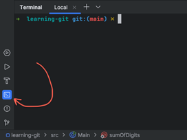

بعد از زدن این دکمه، صفحهٔ shell زیر IntelliJ براتون باز می‌شه. همون‌طور که می‌بینید، شبیه همون shellایه که قبلا باهاش کار می‌کردین، چون راستش دقیقا همونه! اگر این‌جا `git status` بزنید می‌بینید که خروجی‌ای شبیه به خروجی قبل بهتون می‌ده:

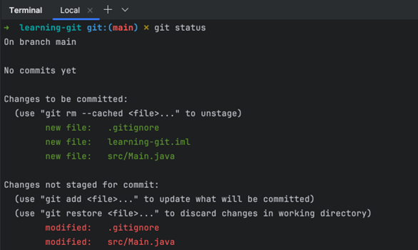

برای راحتی کار، در ادامهٔ داک و توی پروژه‌هاتون می‌تونید از این شل استفاده کنید.

توی خروجی `git status` می‌بینید که تغییراتمون توی فایل `Main.java` و `.gitignore` هنوز stage نشدن. برای این که همهٔ تغییرات stage بشن، از دستور زیر استفاده می‌کنیم:

```bash
$ git add -A
```

توی `git status` بعدی، می‌بینید که همهٔ تغییرات stage شدن:

```bash
$ git status

On branch main  
  
No commits yet  
  
Changes to be committed:  
  (use "git rm --cached <file>..." to unstage)  
        new file:   .gitignore  
        new file:   learning-git.iml  
        new file:   src/Main.java
```

لطفا با استفاده از دستور زیر، فایل `learning-git.iml` رو unstage کنید تا گیت برای همیشه ایگنورش کنه:

```bash
$ git rm --cached learning-git.iml
```

اگر دوباره git status بزنید، خروجی زیر رو می‌بینید:

```bash
On branch main  
  
No commits yet  
  
Changes to be committed:  
  (use "git rm --cached <file>..." to unstage)  
        new file:   .gitignore  
        new file:   src/Main.java
```

حالا تغییرات رو commit کنید:

```bash
$ git commit -m "initial commit"
```

حالا باید با زدن git status، خروجی زیر رو ببینید تا مطمئن بشین که همه چیز commit شده:

```bash
On branch main  
nothing to commit, working tree clean
```

branchها جزو چیزهایی‌ان که بهترین راه یادگیری اون‌ها، ور رفتن باهاشون و دیدن دستوراتشونه. پس بریم تا اولین branchمون رو بسازیم.

### ساخت برنچ

در ابتدا، دستور زیر رو توی دایرکتوری پروژه‌تون اجرا کنید:

```bash
$ git branch
```

این دستور، تمامی branch های فعلی این repo رو نشون می‌ده. طبیعتا، شما باید فقط یک برنچ به اسم `main` یا master `ببینین`:

```bash
* main
```

اگر terminal تون توی یه صفحهٔ جدید، مثل صفحهٔ زیر برنچ‌هاتون رو نشون داد، می‌تونید با زدن Q از این صفحه خارج بشین:


حالا می‌خوایم یه برنچ جدید به اسم `support-long` ایجاد کنیم. توی این برنچ، می‌خوایم یه سری تغییر توی کدمون بدیم تا تابع `sumOfDigits` از ورودی‌های `long` پشتیبانی کنه. برای ایجاد برنچ جدید، از دستور زیر استفاده می‌کنیم:

```bash
$ git branch support-long
```

حالا اگر دستور `git branch` رو بزنید:

```bash
$ git branch
```

با خروجی زیر مواجه می‌شید:

```bash
* main  
support-long
```

همون‌طور که می‌بینید، ما با موفقیت branch جدیدمون رو از روی main ساختیم و الآن می‌تونیم توی لیست branch ها ببینیمش. ولی هنوز توی این branch نیستیم، برای این که وارد این branch بشیم، از دستور `checkout` استفاده می‌کنیم:

```bash
$ git checkout support-long
```

حالا اگر `git branch` بزنید، خروجی زیر رو می‌بینید:

```bash
main  
* support-long
```

می‌بینید که ستارهٔ کوچیکی که قبلا کنار `main` بود، الآن روی `support-long` ‍ه. این یعنی ما با موفقیت، branch مون رو تغییر دادیم.

کدی که داخل این برنچه، دقیقا شبیه کد `main` ‍ ‍ه. در واقع، این برنچ، کپی کاملی از برنچ main ‍ه، چون وقتی درستش کردیم، توی `main` بودیم. همیشه اگر توی برنچ a باشیم و برنچ `b` رو درست کنیم، برنچ `b` کپی برنچ `a` خواهد بود. حالا کدی که توی `Main.java` بود رو، به کد جدید زیر تغییر بدین:

```java
import java.util.Scanner;

public class Main {
    public static void main(String[] args) {
        var scn = new Scanner(System.in);
        var input = scn.nextLong();  
  
        System.out.printf("Sum of digits: %d", sumOfDigits(input));  
    }

    public static int sumOfDigits(long number) {
        var sum = 0;
        while (number > 0) {  
            sum += (int)(number % 10);  
            number /= 10;  
        }

        return sum;  
    }  
}
```

تفاوت این کد با کد قبلی، صرفا در اینه که این کد به جای `int`، قابلیت اینو داره که یک `long` ورودی بگیره. حالا به ترتیب `git status` بزنید تا مطمئن باشید که تغییراتتون توی گیت دیده می‌شه و خروجی زیر رو می‌بینید:

```bash
On branch support-long  
Changes not staged for commit:  
  (use "git add <file>..." to update what will be committed)  
  (use "git restore <file>..." to discard changes in working directory)  
        modified:   src/Main.java  
  
no changes added to commit (use "git add" and/or "git commit -a")
```

بعدش هم `git add` بزنید و دوباره `git status` بزنید تا مطمئن بشین که تغییراتتون stage شدن:

```bash
On branch support-long  
Changes to be committed:  
  (use "git restore --staged <file>..." to unstage)  
        modified:   src/Main.java
```

نهایتا هم، تغییرات رو کامیت کنین:

```bash
$ git commit -m "add support for long numbers"  
  
[support-long 3f48bc3] add support for long numbers  
 1 file changed, 3 insertions(+), 3 deletions(-)
```
 
اگر الآن git log بزنید، با همچین خروجی‌ای مواجه می‌شید و می‌فهمید که تغییراتتون اعمال شدن:

```bash
commit 3f48bc3d5c29522283dd4a8c811a72fc78feb4e8 (HEAD -> support-long)  
Author: Arman Hosseini <armanhosseini878787@gmail.com>  
Date:   Tue Feb 11 10:07:51 2025 +0330  
  
    add support for long numbers  
  
commit 97ea957914201c480912c24718e352abe42f8e72 (main)  
Author: Arman Hosseini <armanhosseini878787@gmail.com>  
Date:   Mon Feb 10 12:30:17 2025 +0330  
  
    initial commit
```

حالا، بیاید یه نگاه به برنچ `main` بندازیم. این branch رو checkout کنید:

```bash
$ git checkout main

Switched to branch 'main'
```

فایل `Main.java` رو نگاه کنید. می‌بینید که این فایل، هیچ تغییری نکرده و هنوز هم فقط اعداد `int` رو پشتیبانی می‌کنه! با زدن `git log`، می‌تونید ببینید که commit مرتبط با این تغییر هم وجود نداره و فقط commit اولیه‌تون رو می‌بینید:

```bash
commit 97ea957914201c480912c24718e352abe42f8e72 (HEAD -> main)  
Author: Arman Hosseini <armanhosseini878787@gmail.com>  
Date:   Mon Feb 10 12:30:17 2025 +0330  
  
    initial commit
```

این که شما می‌تونید کد یه branch رو عوض کنید، بدون این که کد branch های دیگه‌تون عوض بشه، از قابلیت‌های اصلی‌ایه که git به شما ارائه می‌ده! با checkout کردن دوبارهٔ `support-long`، می‌بینید که تغییرات شما برمی‌گردن. شما در ادامهٔ داک، با استفاده از دستور `git merge`، تغییرات برنچ `support-long` رو به `main` منتقل می‌کنید.

### چرا برنچ‌ها

احتمالا براتون سوال شده که چرا اصلا باید از branch ها استفاده کنیم. ارزش این قابلیت، وقتی مشخص می‌شه که با یک اپلیکیشن واقعی‌تر سر و کله می‌زنیم. توی هر دوی سناریوهایی که در ادامه بهتون توضیح می‌دیم، می‌تونید کاربردهایی واقعی از branch ها رو ببینید. واقعیت اینه که بدون برنچ‌ها، کار کردن توی یه تیم برنامه‌نویسی خیلی سخت‌تر از چیزی می‌شد که فکر می‌کنین.

#### سناریوی ۱

فرض کنید قلی توی یه تیم برنامه‌نویسی در شرکت تپسی کار می‌کنه. یک روز رئیسش بهش می‌گه که قابلیت گرفتن تاکسی دو مقصده رو به سیستم اضافه کنه. قلی هم شروع می‌کنه به کد زدن و تمام روز رو مشغول کار بر روی این ویژگی جدید می‌گذره تا بتونه خیلی زود این امکان رو برای مشتری‌ها فراهم کنه. اما قلی به برنچ‌های Git اعتقادی نداره و همه کارهاش رو روی برنچ `main` انجام می‌ده.

انتهای روز، رئیس دوباره میاد بالای سر قلی و می‌گه که آب دستشه بذاره زمین (!) چون سیستم به خطا خورده و هیچ‌کس نمی‌تونه تاکسی بگیره! حالا قلی باید سریع باگ رو برطرف کنه، ولی کدی که تا الان برای تاکسی دو مقصده زده رو چیکار کنه؟ آیا باید انقدر `Ctrl + Z` بزنه تا همهٔ کدهاش پاک بشن و بتونه به کد اولیه برسه و خطا رو برطرف کنه؟ از طرفی، قلی باید خیلی سریع باگ فعلی سیستم رو حل کنه و از طرف دیگه هم کل روز کد زده و نمی‌تونه از کدهاش دل بکنه!

قلی می‌تونست که در ابتدا، به جای این که کارش رو روی `main` انجام بده، یه branch جدید مثل do-`maghsadeh` ایجاد کنه و کارهاش رو اون‌جا انجام بده، و وقتی رئیسش با خطا اومد بالای سرش، خیلی سریع برنچ `main` (که دست نخورده باقی مونده) رو checkout کنه تا بتونه خطای مشتری‌ها رو زود برطرف کنه و همزمان، تغییراتش هم توی برنچ `do-maghsadeh` حفظ بشه. توی شکل زیر، می‌تونید تصویری از این حالت ببینید:


توی این visualization، که توی دنیای گیت خیلی معروفه، می‌تونید ببینید که برنچ `do-maghsadeh` وقتی که قلی کارش رو شروع کرده، از برنچ `main` جدا شده.

#### سناریوی ۲

قلی و ممد که هر دو در شرکت تپسی مشغول به کار هستن، به تازگی درگیر پیاده‌سازی فیچرهای جدیدی شدن که رئیس ازشون خواسته. قلی چند روزه که روی فیچر «تاکسی دو مقصده» کار می‌کنه و امروز، رئیس به ممد گفته که روی فیچر جدیدی به نام «هم‌سفر» کار کنه. اما متاسفانه، هر دو هنوز به مفهوم برنچ‌ها در Git اعتقادی ندارن و تصمیم دارن کارشون رو مستقیماً روی برنچ `main` پیش ببرن.

قلی به خوبی کامیت می‌کنه و کارش رو به چند قسمت معنادار تقسیم کرده و با پایان هر قسمت، تغییراتش رو کامیت می‌کنه. اما مشکل اینجاست که وقتی ممد می‌ره تا کارش رو شروع کنه، تغییرات قلی رو توی کدهای برنچ `main` می‌بینه. این تغییرات هنوز به درستی کار نمی‌کنن و باعث می‌شن که اپ تپسی به کلی بالا نیاد. بنابراین، ممد نمی‌تونه هیچ کاری رو شروع کنه.

ممد که از وضعیت ناامید شده، می‌ره بالای سر قلی و ازش می‌خواد که هر چه سریع‌تر کدهاش رو درست کنه تا بتونه به موقع فیچر هم‌سفر رو تحویل بده. اما قلی که هنوز تحت استرس رفع خطاهایی که داشته، حالش خوب نیست و با ممد بحث می‌کنه و می‌گه که نمی‌تونه حالا حالاها کدش رو درست کنه.

اگر قلی، از ابتدا کارش رو روی برنچ جدیدی به اسم `do-maghsadeh` انجام می‌داد، تغییراتش توی `main` دیده نمی‌شد و ممد می‌تونست از `main`، برنچ جدیدی مثل `hamsafar` بگیره و کارش رو شروع کنه، بدون این که نیازی به بحث و دعوا با قلی باشه. نهایتا هم وقتی development این دو فیچر تموم شد و به خوبی تست شدن، هر دو کدهاشون رو روی برنچ `main` مرج می‌کردن تا فیچرها به دست مشتری برسه. تصویر زیر، این حالت رو نشون می‌ده:


توی این تصویر، می‌تونیم ببینیم که هر دو برنچ `do-maghsadeh` و `hamsafar`، از `main` گرفته شدن و بعد از این که کار اون‌ها تموم شده، توی `main` مرج شدن و تغییراتشون به `main` منتقل شده.

### نمونهٔ یه ساختار خوب برای branch ها

حالا که با branch ها آشنا شدیم، خوبه که یه ساختار استانداردتر رو برای اون‌ها بررسی کنیم. با توجه به این که شما قراره بعضی پروژه‌های آینده‌تون رو روی git و به شکل گروهی پیش ببرین، خوبه که از این ساختار الهام بگیرین تا به مشکلات زیادی نخورین.

هر نرم‌افزاری، یه برنچ `main` به عنوان برنچ اصلی‌ش داره. این برنچ، عموما شامل یه نسخهٔ stable و تست شده‌ از اون نرم‌افزاره. **به هیچ وجه نباید روی خط `main` ، مستقیم commit بکنین!** اگر بناست تغییری توی `main` داده بشه، باید یه برنچ از اون بگیرین، تغییرات رو روی یک branch که از `main` گرفته شده انجام بدین، روی همون برنچ تستش کنین، و وقتی که مطمئن شدین که تغییراتتون باگی ندارن، اون‌ها رو توی `main` مرج کنین:

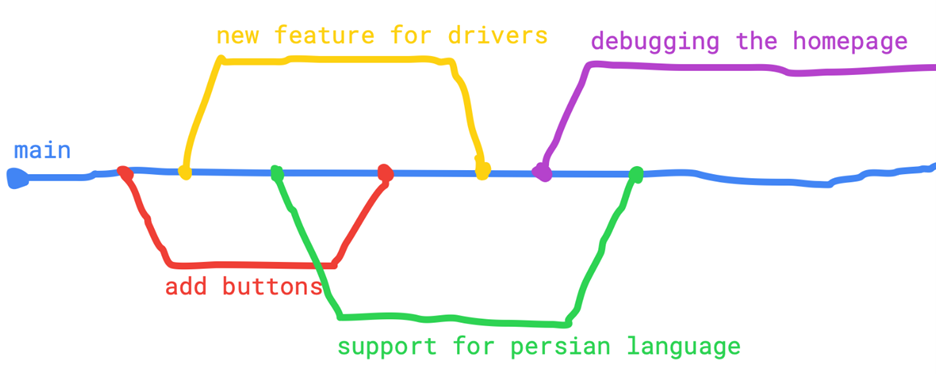

شکل بالا branch های مختلف یه اپ رو نشون می‌ده. برنچ `main`، همواره stable ‍ه و تست شده‌ست و کار می‌کنه. اولین برنچی که گرفتیم، برای اضافه کردن یه سری دکمه به برنامه‌ست. این دکمه‌ها رو توی برنچ‌مون اضافه می‌کنیم، تستشون می‌کنیم، و وقتی فهمیدیم کار می‌کنن، اون‌ها رو به `main` اضافه می‌کنیم. باقی برنچ‌ها هم به شکلی مشابه درست می‌شن و بعدا توی `main` مرج می‌شن.

حتی خیلی از شرکت‌ها، به جای این که برنچ‌هاشون رو مستقیم روی `main` مرج کنن، روی خط دیگه‌ای مثل development می‌برن تا `main` شون حتی از این هم استیبل‌تر باشه. ولی شما لازم نیست این کار رو بکنین، بعدتر در اولین کارهای جدی‌تون، یادش می‌گیرین.

**تنها کاری که لازمه توی AP و هر موقع دیگه‌ای انجام بدین، اینه که هیچ‌وقت روی `main` کامیت نکنین! مگر اولین کامیت برنامه‌تون، اون هم چون هنوز برنچ دیگه‌ای توی ریپوتون ندارین. شما فقط می‌تونید به `main` مرج کنید، حتی برای تغییرات کوچیک. خیلی از شرکت‌ها، دسترسی همهٔ کارکنان غیر از یکی-دوتا از مدیران رو به `main` کلا می‌بندن.**

## مرج کردن

وقتی کارتون توی یه برنچ تموم شد، می‌تونید با merge کردن اون برنچ توی برنچ‌های دیگه، تغییراتش رو به برنچ‌های دیگه منتقل کنید. مثال قبلی‌مون و برنچ‌های `support-long` و `main` رو به خاطر بیارین. اول از همه، با دستور `git branch` چک کنید که حتما توی برنچ `support-long` باشید:

```bash
main  
* support-long
```

با git log، چک کنید که commit آخرتون، مربوط به اضافه کردن قابلیت مرتبط با اعداد `long` بوده:

```bash
commit 3f48bc3d5c29522283dd4a8c811a72fc78feb4e8 (HEAD -> support-long)  
Author: Arman Hosseini <armanhosseini878787@gmail.com>  
Date:   Tue Feb 11 10:07:51 2025 +0330  
  
    add support for long numbers  
  
commit 97ea957914201c480912c24718e352abe42f8e72 (main)  
Author: Arman Hosseini <armanhosseini878787@gmail.com>  
Date:   Mon Feb 10 12:30:17 2025 +0330  
  
    initial commit
```

حالا برنچ `main` رو checkout کنید برید، و با استفاده از دستور زیر، برنچ `support-long` رو داخل اون مرج کنید:

```bash
$ git merge support-long   
  
Updating 97ea957..3f48bc3  
Fast-forward  
 src/Main.java | 6 +++---  
 1 file changed, 3 insertions(+), 3 deletions(-)
```

حالا، توی برنچ `main` دستور `git log` رو بزنید:

```bash
commit 3f48bc3d5c29522283dd4a8c811a72fc78feb4e8 (HEAD -> main, support-long)  
Author: Arman Hosseini <armanhosseini878787@gmail.com>  
Date:   Tue Feb 11 10:07:51 2025 +0330  
  
    add support for long numbers  
  
commit 97ea957914201c480912c24718e352abe42f8e72  
Author: Arman Hosseini <armanhosseini878787@gmail.com>  
Date:   Mon Feb 10 12:30:17 2025 +0330
```

می‌بینید که commit مرتبط با اعداد `long`، توی `main` هم دیده می‌شه! با دیدن فایل `Main.java`، می‌تونید چک کنید که تغییرات کدها واقعا توی برنچ `main` اعمال شدن. به این عملیات، merge کردن می‌گن.


### حذف برنچ‌ها

اگر الآن دستور `git branch` رو اجرا کنید، خروجیای شبیه خروجی زیر می‌بینید:

```bash
* main  
support-long
```

همون‌طور که می‌بینید، برنچ `support-long` اضافه‌ست و دیگه کاربردی نداره، چون تغییراتش توی `main` مرج شده. اگر این برنچ‌ها زیاد بشن، یه خورده براتون دردسر درست می‌کنن. با استفاده از دستور زیر، می‌تونید برنچ‌های قدیمی رو پاک کنید:

```bash
$ git branch -d support-long  
  
Deleted branch support-long (was d5a71e9).
```

خوبه که بعد از اتمام کارتون با یک برنچ، با استفاده از این دستور اون رو حذف کنید تا لیست برنچ‌هاتون خالی بمونه.

## conflict ها و برطرف کردنشون

ممد و قلی رو به خاطر بیارین، فرض کنین که توی فرآیند کدنویسی برای فیچرهای جدید تپسی، هر دوی اون‌ها یک تکه از فایل `Main.java` رو عوض کردن. حالا git باید از کجا بفهمه که کدوم کد، کد درستی برای این فایله؟ کد ممد یا کد قلی؟ این‌جاست که ممکنه ممد و قلی، به conflict بخورن و یه خورده اذیت بشن!

بیاین تا با بررسی کد مجموع ارقام، ببینیم که conflict ها چجوری رقم می‌خورن و چطور می‌شه اون‌ها رو درست کرد.


### ایجاد conflict

رییس گفته که ما، با شروع برنامه هیچ پیامی به کاربر نشون نمی‌دیم که بدونه باید یه عدد بهمون ورودی بده و خوبه قبل ورودی گرفتن `"Enter a number: "` رو پرینت کنیم. همزمان به این هم غر زده که اسم ورودی تابع `sumOfDigits` رو به جای `number`، `n` بذاریم که متد کوتاه‌تری داشته باشیم. ما هم برای هر کدوم از این کارها، یک branch از `main` می‌گیریم:

```bash
$ git branch fix-message

  
$ git branch fix-parameter-name
```

برنچ `fix-message` برای پرینت کردن پیام مناسب برای کاربر و برنچ `fix-parameter-name` برای درست کردن اسم پارامتر ورودی `sumOfDigits` ‍ه. اول بیاین پیاممون به کاربر رو درست کنیم. برنچ مربوط به این کار رو checkout کنید:

```bash
$ git checkout fix-message   
  
Switched to branch 'fix-message'
```

حالا، کد زیر رو به متد `main`، توی جای مناسب اضافه کنید:

```java
System.out.println("Enter a number:");
```

تغییرات رو بررسی کنید و اگر کدتون درست بود، تغییرات رو `add` و commit کنید تا نهایتا، کامیتی مثل این رو توی log تون ببینید:

```bash
commit d5a71e9ec3242a27ae972896c1f267795912e90a (HEAD -> fix-message)  
Author: Arman Hosseini <armanhosseini878787@gmail.com>  
Date:   Tue Feb 11 11:52:40 2025 +0330  
  
    add input message
```

حالا، بعد از این که کارمون توی این برنچ تموم شد، به برنچ `fix-parameter-name` می‌ریم:

```bash
$ git checkout fix-parameter-name

  
Switched to branch 'fix-parameter-name'
```

اگر به `Main.java` نگاه کنید، می‌بینید که خطی که `"Enter a number:"` رو چاپ می‌کرد رو نمی‌بینید. حالا، اسم ورودی تابع `sumOfDigits` رو عوض کنید، طبیعتا با چیزی که از درس‌نامه‌ی «IntelliJ Tools» یادتونه، باید بتونید به راحتی این کار رو انجام بدید:

```java
public static int sumOfDigits(long n) {
    var sum = 0;
    while (n > 0) {  
        sum += (int)(n % 10);  
        n /= 10;  
    }

    return sum;  
}
```

تغییراتتون رو بررسی کنید و اگر درست بودن، اون‌ها رو کامیت کنید تا به همچین کامیتی برسین:

```bash
commit 1f6ab68a77eaf63b4a394c49703bd36f3c81c7b1 (HEAD -> fix-parameter-name)  
Author: Arman Hosseini <armanhosseini878787@gmail.com>  
Date:   Tue Feb 11 11:57:24 2025 +0330  
  
    shorten parameter name
```

بعد از این که همهٔ تغییرات رو دادین، به برنچ `main` برین:

```bash
$ git checkout main  
  
Switched to branch 'main'
```

حالا، برنچ `fix-message` رو merge کنین:

```bash
$ git merge fix-message   
  
Updating 3f48bc3..d5a71e9  
Fast-forward  
 src/Main.java | 2 ++  
 1 file changed, 2 insertions(+)
```

بعد از اون، برنچ `fix-parameter-name` رو merge کنین. با یه صفحه، مثل صفحه‌ای که برای ایجاد کامنت کامیت‌هاتون می‌بینید مواجه می‌شید. اگر خواستین یه پیام دیگه به جای `"Merge branch 'fix-parameter-name'"` بنویسین ولی می‌تونین با همین پیام هم پیش برین. نهایتا، به همچین خروجی‌ای می‌رسید:

```bash
$ git merge fix-parameter-name   
  
Auto-merging src/Main.java  
Merge made by the 'ort' strategy.  
 src/Main.java | 8 ++++----  
 1 file changed, 4 insertions(+), 4 deletions(-)
```

چی شد؟ خروجی که خوب به نظر می‌رسه. چرا با این که توی هر دو برنچ‌مون فایل `Main.java` رو عوض کردیم، به مشکلی نخوردیم؟ اگر `Main` رو نگاه کنید، می‌بینید که به طرز جالبی هم `"Enter a number:"` توی اون هست، هم اسم متغیر ورودی `sumOfDigits` کوتاه شده! فایل `Main.java` تون، الآن به همچین شکلیه:

```java
import java.util.Scanner;

public class Main {
    public static void main(String[] args) {
        var scn = new Scanner(System.in);  
  
        System.out.println("Enter a number:");
        var input = scn.nextLong();  
  
        System.out.printf("Sum of digits: %d", sumOfDigits(input));  
    }

    public static int sumOfDigits(long n) {
        var sum = 0;
        while (n > 0) {  
            sum += (int)(n % 10);  
            n /= 10;  
        }

        return sum;  
    }  
}
```

به نظر میاد که در مورد merge ها، گیت تا جایی که بتونه هوشمندانه عمل می‌کنه! گیت، وقتی می‌بینه که موقع مرج دو برنچ با هم، فایلی توی هر دو تغییر کرده، تلاش می‌کنه تا اون‌ها رو auto–merge کنه. اگر به خروجی‌ای که موقع اجرای کامند مرج `fix-parameter-name` دیدین دقت کنین، رد پای این auto-merge رو می‌بینید:

```bash
Auto-merging src/Main.java  
Merge made by the 'ort' strategy.  
 src/Main.java | 8 ++++----  
 1 file changed, 4 insertions(+), 4 deletions(-)
```

به خطوط زیر توی خروجی توجه کنین:

```bash
Auto-merging src/Main.java  
Merge made by the 'ort' strategy.
```

می‌بینید که git، با استفاده از استراتژی‌ای به اسم ort، فایل `src/Main.java` رو، auto-merge کرده و شما لازم نیست تا با merge این دو سر و کله بزنین. حالا بیاین ببینیم که آیا می‌تونیم انقدر گیت رو بپیچونیم تا بالاخره نتونه merge رو انجام بده و به conflict بخوریم؟

### ایجاد conflict (ولی این‌بار برای واقعی)

بیاین دوتا برنچ درست کنیم و توی هر دوی اون‌ها، خط زیر رو توی برنامه‌مون عوض کنیم تا ببینیم که آیا گیت می‌تونه اون‌ها رو auto-merge کنه یا نه:

```java
System.out.printf("Sum of digits: %d", sumOfDigits(input));
```

برنچ‌های `fix-output-1` و `fix-output-2` رو از `main` بگیرین. حواستون باشه که برای این کار، برنچ فعلی‌تون حتما باید `main` باشه:

```bash
$ git branch fix-output-1

$ git branch fix-output-2
```

برنچ `fix-output-1` رو checkout کنید و `printf` رو با `println` جایگزین کنین:

```java
System.out.println("Sum of digits: " + sumOfDigits(input));
```

تغییرات رو commit کنین و به برنچ `fix-output-2` برین. باید مجددا خط `printf` رو به همون شکل قبلی ببینید. این بار، پیام داخل `printf` رو مثل شکل زیر عوض کنید تا خروجی دقیق‌تری به کاربر نشون بدیم:

```java
System.out.printf("Sum of digits in your number: %d", sumOfDigits(input));
```

کدتون رو توی این برنچ هم کامیت کنید و بعد، برای انجام مرج به `main` برید. اول، fix-output-1 رو مرج کنید:

```bash
$ git merge fix-output-1  
  
Updating 0deaf11..53bf66b  
Fast-forward  
 src/Main.java | 2 +-  
 1 file changed, 1 insertion(+), 1 deletion(-)
```

می‌بینید که تغییرات `fix-output-1` به راحتی با `main` مرج می‌شن و متد `printf` به `println` تغییر پیدا می‌کنه. حالا، تلاش کنید تا `fix-output-2` رو هم مرج کنید:

```bash
$ git merge fix-output-2  
  
Auto-merging src/Main.java  
CONFLICT (content): Merge conflict in src/Main.java  
Automatic merge failed; fix conflicts and then commit the result.
```

خروجی دستوری که وارد کردین رو ببینین. اگر اون رو بخونین، می‌بینید که merge تون به conflict خورده و auto-merge هم ناموفق بوده. اگر الآن `git status` بزنید، با خروجی زیر مواجه می‌شین:

```bash
$ git status  
  
On branch main  
You have unmerged paths.  
  (fix conflicts and run "git commit")  
  (use "git merge --abort" to abort the merge)  
  
Unmerged paths:  
  (use "git add <file>..." to mark resolution)  
        both modified:   src/Main.java  
  
no changes added to commit (use "git add" and/or "git commit -a")
```

می‌بینید که `src/Main.java`، توی بخش جدیدی به اسم Unmerged paths دیده می‌شه. این بخش، برای فایل‌هاییه که توی عملیات مرج به conflict خوردن. همچنین اگر الآن `git log` بگیرین می‌بینید که هیچ کدوم از commit های برنچ `fix-output-2` توی لاگتون نیست.

خب، تبریک! شما به اولین conflict تون برخوردین. می‌تونید با بررسی فایل `Main.java`، این conflict رو از نزدیک ببینین. این فایل الآن به همچین شکلی در اومده:

```
import java.util.Scanner;

public class Main {
    public static void main(String[] args) {
        var scn = new Scanner(System.in);  
  
        System.out.println("Enter a number:");
        var input = scn.nextLong();  
  
<<<<<<< HEAD  
        System.out.println("Sum of digits: " + sumOfDigits(input));  
=======  
        System.out.printf("Sum of digits in your number: %d", sumOfDigits(input));  
>>>>>>> fix-output-2
    }

    public static int sumOfDigits(long n) {
        var sum = 0;
        while (n > 0) {  
            sum += (int)(n % 10);  
            n /= 10;  
        }

        return sum;  
    }  
}
```

تیکه‌ای که conflict داشته، اون تکهٔ عجیب و غریب اون وسطه:

```
<<<<<<< HEAD  
        System.out.println("Sum of digits: " + sumOfDigits(input));  
=======  
        System.out.printf("Sum of digits in your number: %d", sumOfDigits(input));  
>>>>>>> fix-output-2
```

گیت با تغییر این فایل و اضافه کردن چند خط text، به شما می‌گه که این بخش از کد توی `fix-output-2` به شکل زیر اومده:

```java
System.out.printf("Sum of digits in your number: %d", sumOfDigits(input));
```

در حالی که توی `HEAD` (که این‌جا همون `main`) ‍ه، به شکل زیره:

```java
System.out.println("Sum of digits: " + sumOfDigits(input));
```

و از شما می‌خواد که این conflict رو دستی درست کنید. خوشبختانه، این‌جا درست کردن conflict کار راحتیه. تمام این ۵-۶ خط رو حذف کنید و کدشون رو با کد زیر جایگزین کنید:

```java
System.out.println("Sum of digits in your number: " + sumOfDigits(input));
```

این خط کد، هم پیام درست‌تر برنچ `fix-output-2` رو داره و هم از `println` جای `printf` استفاده می‌کنه. به عبارتی، این خط نمایان‌گر تغییرات هر دو برنچ در کنار همه. به خاطر این که mergeمون به conflict خورد، لازمه که بعد رفع اون‌ها، توی یه commit جدا merge رو کامل کنیم. دوباره `git status` بزنید:

```bash
$ git status  
  
On branch main  
You have unmerged paths.  
  (fix conflicts and run "git commit")  
  (use "git merge --abort" to abort the merge)  
  
Unmerged paths:  
  (use "git add <file>..." to mark resolution)  
        both modified:   src/Main.java  
  
no changes added to commit (use "git add" and/or "git commit -a")
```

همون‌طور که می‌بینید، `Main.java` هنوز توی Unmerged paths ‍ه. حالا که conflict های اون رو برطرف کردیم، با `git add`، اون رو stage کنید:

```bash
$ git add -A  
  
$ git status  
  
On branch main  
All conflicts fixed but you are still merging.  
  (use "git commit" to conclude merge)  
  
Changes to be committed:  
        modified:   src/Main.java
```

حالا، تغییرات خودتون رو با پیام مناسب کامیت کنید. این پیام باید مثل متن زیر باشه، کلا متن کامیت‌های مرتبط با merge رو همیشه به این شکل می‌ذارن:

```bash
$ git commit -m "merge 'fix-output-2' into 'main'"   
  
[main 0f8ac7a] merge 'fix-output-2' into 'main'
```

اگر حالا `git log` بزنید، هم commitهای برنچ `fix-output-2` رو می‌بینید، هم commit ای که برای merge اون داشتین:

```bash
commit 0f8ac7af0359825fba84562565457644013347ef (HEAD -> main)  
Merge: 53bf66b 01f5dc0  
Author: Arman Hosseini <armanhosseini878787@gmail.com>  
Date:   Tue Feb 11 14:58:45 2025 +0330  
  
    merge 'fix-output-2' into 'main'  
  
commit 01f5dc0ebd51ce196dd2a14f6e0e71b529ae55e9 (fix-output-2)  
Author: Arman Hosseini <armanhosseini878787@gmail.com>  
Date:   Tue Feb 11 12:27:31 2025 +0330  
  
    better output message
```

بررسی تغییرات

درسته که `git status`، فایل‌هایی که عوض شدن رو بهتون نشون می‌ده. ولی لازمه که قبل از commit این که هر فایل چه تغییری کرده رو هم بدونید. این‌جا از یکی از ابزارهای IntelliJ برای این کار استفاده می‌کنیم.

یک برنچ جدید به اسم `product-of-digits` درست کنید و checkout ش کنید. اگر می‌خواید بعد از ساختن یه برنچ درجا checkout ش کنید، می‌تونید به جای دو دستور زیر:

```bash
$ git branch product-of-digits
  
$ git checkout product-of-digits
```

از دستور زیر استفاده کنید تا هر دو کار، همزمان انجام بشه:

```bash
$ git checkout -b product-of-digits
```

توی این برنچ، می‌خوایم برنامه‌مون رو عوض کنیم تا به جای مجموع ارقام، ضرب اون‌ها رو نشون بده. برای این کار، برنامه‌ رو تغییر بدید:

```java
import java.util.Scanner;

public class Main {
    public static void main(String[] args) {
        var scn = new Scanner(System.in);  
  
        System.out.println("Enter a number:");
        var input = scn.nextLong();  
  
        System.out.println("Product of digits in your number: " + productOfDigits(input));  
    }

    public static int sumOfDigits(long n) {
        var sum = 0;
        while (n > 0) {  
            sum += (int)(n % 10);  
            n /= 10;  
        }

        return sum;  
    }

    public static int productOfDigits(long n) {
        if (n == 0) {
            return 0;  
        }

        var product = 1;
        while (n > 0) {  
            product *= (int)(n % 10);  
            n /= 10;  
        }

        return product;  
    }  
}
```

توی کد جدید، علاوه بر متد `sumOfDigits`، متدی به اسم `productOfDigits` هم داریم که حاصل ضرب ارقام عدد `n` رو برمی‌گردونه. کد جدیدتون رو تست کنید. وقتی دیدین که درست کار کرد، با `git add` تغییراتتون رو stage کنید. برای دیدن تغییراتتون، به بخش commit توی IntelliJ برین:

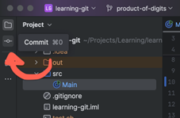

با باز کردن این بخش، پنلی که IntelliJ برای commit کردن کدهاتون بهتون می‌ده باز می‌شه:

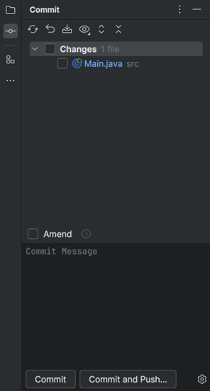

اینتلی‌جی به عنوان یک IDE ی خیلی خوب، خیلی از امکانات گیت رو بدون استفاده از shell در اختیارتون می‌ذاره. توی یه داک دیگه، یه خورده اون‌ها رو بررسی می‌کنیم تا ببینید که چطور می‌شه ازشون استفاده کرد و باهاش کارهاتون راحت‌تر می‌شه.

توی پنلی که باز شد، روی `Main.java` کلیک کنید تا صفحهٔ زیر رو ببینید:


می‌بینید که IntelliJ چقدر خوب تغییراتتون رو قبل از کامیت نشونتون می‌ده تا بررسی‌شون کنید. کدهایی که اضافه کردین یا تغییر دادین دقیقا مشخصن. بعد از بررسی کدهاتون، می‌تونید توی بخش Commit Message یه پیام برای کامیتتون بنویسید، فایل‌هایی که می‌خواین commit کنید رو مشخص کنید و بعد با زدن دکمهٔ Commit، اون‌ها رو کامیت کنید:


این کار توی shell با دستور `git diff` انجام می‌ده که خروجی‌ش به اندازهٔ IntelliJ تمیز نیست، ولی اگر خواستین می‌تونین خودتون یه مقدار راجع بهش بخونین و یاد بگیرین، منابع لازم براش توی بخش «منابع بیشتر» انتهای این داک اومده.

## آشنایی با remote branchها

اگر یادتون باشه، یکی از مهم‌ترین چیزهایی که راجع به گیت گفتیم، این بود که شما **و همکارهاتون** می‌تونید روی یه پروژه به شکل تیمی کار کنید، ولی تا حالا هر کاری کردین، فقط و فقط روی لپ‌تاپ خودتون بوده. به ریپوی که روی لپ‌تاپ خودتون باشه، ریپوی محلی یا local می‌گن.

منطقا شما نمی‌تونید کد یه پروژهٔ بزرگ رو، از یه ریپوی رندوم روی لپ‌تاپ‌تون کنترل کنید! این‌جاست که مفهوم ریپوی remote مطرح می‌شه؛ یه ریپو روی سرورهای شرکت، که کدها پروژه رو روی اون نگه می‌دارن تا همهٔ توسعه‌دهنده‌ها بتونن بهشون دسترسی پیدا کنن.


توی این بخش بررسی می‌کنیم که چطور می‌تونید از طریق یک ریپوی remote درست کنید و پروژه‌تون رو به اون وصل کنید.

### GitHub

[گیت‌هاب](https://github.com/) پلتفرمیه برای به اشتراک گذاشتن کدهایی که از ‌git استفاده می‌کنن. میلیون‌ها برنامه‌نویس کدهای خودشون رو اونجا به صورت متن‌باز (Open Source) به اشتراک می‌ذارن تا برنامه‌نویس‌های دیگه بتونن از اون کد‌ها استفاده کنن و اون پروژه رو توسعه بدن. شما باید از داک tools که توی جلسهٔ صفر منتشر شد، یه اکانت توی GitHub درست کرده باشین، اگر نکردین به این داک برگردین و یه اکانت درست کنید. توی اکانتتون لاگین کنید.

توی مرحله بعد باید یک مخزن یا repository برای پروژه خودتون بسازید. از طریق زدن علامت + بالای صفحه، New repository رو انتخاب کنید:


حالا وقتشه مشخصات repository تون رو وارد کنید. اسم اون رو `git-sample` بذارین، می‌تونید یک توضیح کوتاه هم درباره پروژه‌تون توی قسمت Description بنویسید:

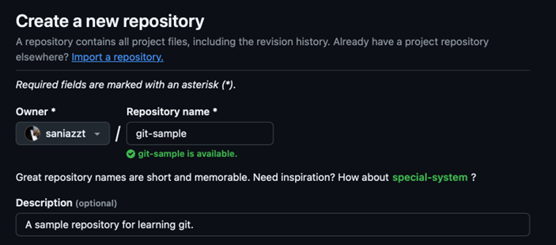

ریپوی شما می‌تونه public یا private باشه. اگر public باشه همه می‌تونن اون رو ببینن و اگر private باشه فقط افرادی که شما مشخص می‌کنید می‌تونن. البته توی هر دو حالت، شما تغیین می‌کنید که کی می‌تونه ریپوتون رو عوض کنه. فعلا نوع repository رو private بگذارید:


امکان اضافه کردن فایل `README` برای توضیحات بیشتر، فایل `.gitignore` (که یکم قبل با اون آشنا شدیم) و License که مجوز استفاده از کد شما هست هم توی این مرحله وجود داره، اما فعلا با این بخش‌ها کاری نداریم و تیک‌هاشون رو بردارین و اون‌ها رو روی none بذارین. حالا روی دکمه سبز Create repository در پایین صفحه کلیک کنید.

تبریک میگم! شما اولین repository گیت‌هاب خودتون رو ساختید:


## Push کردن تغییراتتون به GitHub

از بخش زیر، با زدن دکمهٔ مشخص شده، لینک repo تون روی گیت‌هاب رو کپی کنید (حواستون باشه که لینک `HTTPS` رو کپی کنید نه `SSH`):


به پروژهٔ `learning-git` که توی IntelliJ توسعه داده بودیم برگردین، می‌خوایم کدهایی که توی اون زدیم رو به github مون ببریم. دستور زیر رو توی ترمینال‌تون اجرا کنید و به جای `[url]`، لینکی که کپی کردین رو قرار بدین:

```bash
$ git remote add origin [url]
```

دستورات git remote، دستورات مرتبط با repo ی ریموت پروژهٔ شما هستن. توی دستور بالا، ما از git خواستیم که یه ریپوی remote جدید، به اسم origin و با یک لینک مشخص، به ریپوی شما اضافه کنه تا بتونید تغییراتتون رو بهش اضافه کنید. الآن با دستور زیر، می‌تونید لیست ریپوهای ریموتتون رو ببینید:

```bash
$ git remote -v

origin https://github.com/saniazzt/git-sample (fetch)  
origin https://github.com/saniazzt/git-sample (push)
```

حالا از هر برنچی که هستید با دستور زیر به برنچ `main` برگردید:

```bash
$ git checkout main
```

و با زدن دستور `git status` مطمئن بشید که تغییری روی برنچ `main` ندارین. حالا با دستور `push` تمام commit ها و فایل‌ها رو از روی برنچ `main` به `origin` منتقل کنید. توی این مرحله، لازمه که یوزرنیم و پسورد گیت‌هابتون رو بعد از زدن دستور زیر وارد کنید:

```bash
$ git push origin main
```

به خطا خوردین، نه؟

```bash
remote: Support for password authentication was removed on August 13, 2021.  
remote: Please see https://docs.github.com/get-started/getting-started-with-git/about-remote-repositories#cloning-with-https-urls for information on currently recommended modes of authentication.  
fatal: Authentication failed for 'https://github.com/armaho/git-sample.git/'
```

###  درست کردن یک access token

بیاین متن خطا رو با هم بخونیم. داره می‌گه که ریموت شما، یعنی گیت‌هاب، از ۱۳ آگوست ۲۰۲۱ دیگه اجازهٔ استفاده از پسورد برای کارهایی مثل push یا pull کردن رو بهتون نمی‌ده و به همین دلیل، authentication تون موفق نبوده. [یه لینک](https://docs.github.com/get-started/getting-started-with-git/about-remote-repositories#cloning-with-https-urls) هم بهتون داده که توش می‌تونید شیوه‌های مختلف authentication گیت‌هاب رو اون‌جا ببینید. اگر به این لینک برید، متن زیر رو می‌بینید:


این متن بهتون می‌گه که:  
```
"When Git prompt you for your password, enter your personal access token"  
```
ولی خب، شما که personal access token ای ندارید. اشکالی نداره، چون این‌جا نوشته که:  
```
"For more Information, see Managing your personal access tokens"
```
روی این کلیک کنید تا به یه صفحهٔ جدید برید که به شما یاد می‌ده چجوری token بسازید.

راهنمای بخش Creating a personal access token (classic) رو دنبال کنید. توی بخش scope، همهٔ تیک‌ها رو بزنین تا این توکن به همه چیز دسترسی داشته باشه و بعدا سر این موضوع اذیت نشین. اون متنی که نهایتا کپی می‌کنید، همون access token ایه که باید به جای پسوردتون وارد کنید. حواستون باشه که اونو یه جا نگه دارین چون دیگه بهتون نشون داده نمی‌شه.

دوباره دستور زیر رو اجرا کنید و این بار به جای پسورد، access token تون رو وارد کنید:

```bash
$ git push origin main

Username for 'https://github.com': armanhosseini878787@gmail.com  
Password for 'https://armanhosseini878787@gmail.com@github.com':   
Enumerating objects: 34, done.  
Counting objects: 100% (34/34), done.  
Delta compression using up to 8 threads  
Compressing objects: 100% (26/26), done.  
Writing objects: 100% (34/34), 2.99 KiB | 340.00 KiB/s, done.  
Total 34 (delta 16), reused 0 (delta 0), pack-reused 0  
remote: Resolving deltas: 100% (16/16), done.  
To https://github.com/armaho/git-sample.git  
 * [new branch]      main -> main
```

موفق شدین! ریپوتون رو توی گیت‌هاب رفرش کنید:


می‌بینید؟ کدتون الآن فقط روی کامپیوتر خودتون نیست، بلکه یک کپی از اون، برای هر کس دیگه‌ای، توی یک remote repo روی گیت‌هاب هم وجود داره. روی commits کلیک کنید:


تمام تاریخچهٔ ریپوتون این‌جا مشخصه:


اگر روی یکی از کامیت‌ها کلیک کنید، می‌تونید تغییراتی که توی کدتون داده هم ببینید:


اگر حتی یه خورده بیشتر دقت کنید، می‌بیند که ریپوی remote تون، حتی برنچ‌هایی مثل `main` رو هم توی خودش داره. این یعنی می‌تونید در آینده، باقی branch هاتون هم به این ریپو بفرستین:


یه چیز خیلی خوب راجع به گیت اینه که عموماً متن‌های خطا و داکیومنتیشن‌هاش خیلی کاملن! خوبه که وقتی به خطایی می‌خورین، چیزی خراب می‌شه یا هر اتفاق دیگه‌ای براتون می‌افته، حتماً متن خطا رو کامل بخونین. دیدین که این‌جا، ما صرفاً با خوندن متن خطا، و نه هیچ کمک دیگه‌ای، تونستیم مشکل personal access token ها رو برطرف کنیم.

## دستور `fetch` و `clone`

بیاید این بار به جای این که یه ریپوی local درست کنیم و بعد از روی اون، ریپوی remote مون رو بسازیم، از روی ریپوی remote، ریپوی local رو ایجاد کنیم. کنار دایرکتوری `learning-git`، که برای پروژهٔ جاواتون درست کردین، یه دایرکتوری دیگه درست کنید به اسم `learning-fetch`. حالا shell رو باز کنید و با استفاده از cd، به این دایرکتوری جدید برین.

وقتی که مسیر shell رو تنظیم کردین، دستور `git init` رو وارد کنید تا یه ریپوی خالی ایجاد بشه:

```bash
$ git init

Initialized empty Git repository in /Users/armaho/Projects/Learning/learning-fetch/.git/
```

به ریپوی جدید، یه ریپوی remote به اسم origin اضافه کنید که `url` ش، `url` ریپوی گیت‌هابتونه:

```bash
$ git remote add origin [url]
```

دستور `fetch` رو اجرا کنید. با اجرای این دستور، چیزهایی مثل branch های جدید، tag ها، ref ها و باقی چیزای ریپوی origin (که همون ریپوی گیت‌هابتونه) گرفته می‌شه. با این دستور در ادامه بیشتر کار می‌کنید:

```bash
$ git fetch origin main
```

حالا دایرکتوری `learning-fetch` رو باز کنید. چی می‌بینید؟ درسته، با یک فولدر خالی مواجه می‌شید!

نکته اینجاست که ریپوی local شما بعد از دستور `fetch` آپدیت نمی‌شه. برای آپدیت شدن و ادغام کردن کد‌های remote با کدهای local باید دستور `merge` زیر رو وارد کنید. این دستور، برنچ `main` ای که توی ریپوی origin هست رو با `main` ریپوی local شما merge می‌کنه:

```bash
$ git merge origin/main
```

حالا دوباره به فولدرتون برگردید، بالاخره می‌بینید که فایل‌هاتون اضافه شدند:


### یک کار راحت‌تر

کارهای بالا سخت بودن، نه؟ این که `fetch` چرا اون ‌جوری کار می‌کنه، یا این که مرجش چرا یه جوری بود؟

برای این که دیگه لازم نباشه این کارها رو بکنید، با استفاده از دستور `cd`، به دایرکتوری پدر `learning-fetch` برین (دایرکتوری پدر `learning-fetch`، اونیه که ما `learning-fetch` رو توش ساختیم). بعدش دستور زیر رو اجرا کنید و طبق معمول، به جای `[url]`، آدرس ریپوی remote تون رو بدین:

```bash
$ git clone [url]

Cloning into 'git-sample'...

remote: Enumerating objects: 34, done.

remote: Counting objects: 100% (34/34), done.

remote: Compressing objects: 100% (10/10), done.

remote: Total 34 (delta 16), reused 34 (delta 16), pack-reused 0 (from 0)

Receiving objects: 100% (34/34), done.

Resolving deltas: 100% (16/16), done.
```

می‌بینید که یه دایرکتوری جدید هم اسم ریپوی گیت‌هابتون ایجاد شد. اگر توی اون رو ببینید، شامل تمام فایل‌هاییه که توی ریپوتون درست کرده بودین و دیگه لازم نیست کلی دستور برای دریافت یه repo بنویسید.

## دستور `push`

### آماده‌سازی

الآن شما دوتا دایرکتوری دارین، یکی `learning-git`، همون که از اول درست کرده بودین و باهاش کار کردین، و دومی `git-sample`، همونی که از ریپوی remote تون تو بخش قبل کلون کردین. حالا می‌خوایم که شما، خودتون رو به جای دوتا از اعضای یه تیم برنامه‌نویسی، جک و تایلر بذارین.


لطفا با استفاده از intelliJ، اسم پروژهٔ `learning-git` رو به `jack` و اسم دایرکتوری `git-sample` رو به `tyler` تغییر بدین تا بتونین این دو دایرکتوری رو راحت‌تر از هم تشخیص بدین:


حتما این کار رو با IntelliJ انجام بدین، وگرنه ممکنه IntelliJ پروژه‌تون رو به اسم‌های قدیمی‌شون بشناسه. IntelliJ فقط اسم پروژه‌هاتون رو عوض می‌کنه و بعدش لازمه خودتون دستی اسم دایرکتوری‌های `learning-git` و `git-sample` رو هم به `jack` و `tyler` عوض کنید:

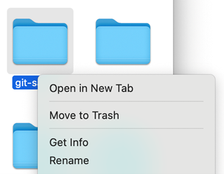

نهایتا IntelliJ تون رو ببندین. لطفا دوتا صفحهٔ IntelliJ برای این دو پروژه کنار هم باز کنین، یکی برای پروژهٔ `learning-git` و اون یکی برای `git-sample`. توی هر دو هم shell داخلی IntelliJ رو باز کنید که کارتون راحت تر بشه:

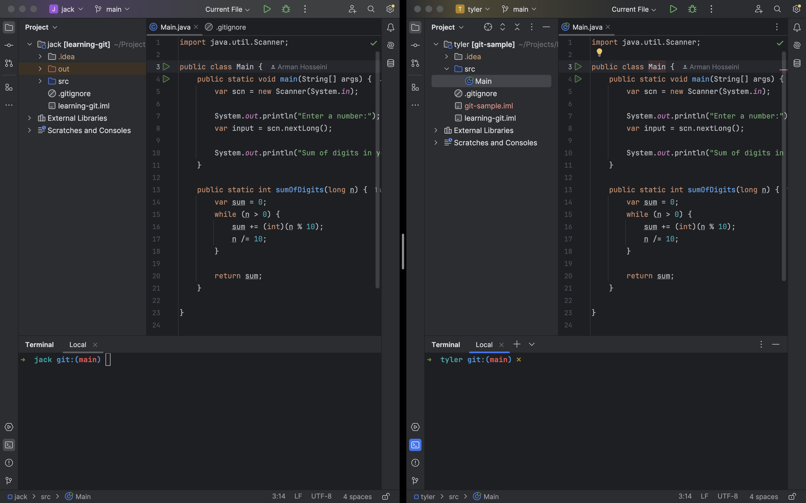

### آشنایی با push

اگر دقت کنید، توی کدی که الآن جلوتونه، متد `productOfDigits` وجود نداره. علتش اینه که ما هیچ وقت، برنچ `product-of-digits` رو توی `main` مرج نکردیم و تغییرات اون هیچ‌گاه به `main` نیومد. ولی شما می‌تونید این برنچ رو، همچنان توی ریپوی `jack` ببینید:

```bash
fix-message  
fix-output-1  
fix-output-2  
fix-parameter-name  
* main  
product-of-digits
```

با استفاده از دستور زیر، این برنچ رو به ریپوی remote اضافه کنید:

```bash
$ git push origin product-of-digits   
  
Enumerating objects: 7, done.  
Counting objects: 100% (7/7), done.  
Delta compression using up to 8 threads  
Compressing objects: 100% (3/3), done.  
Writing objects: 100% (4/4), 471 bytes | 471.00 KiB/s, done.  
Total 4 (delta 1), reused 0 (delta 0), pack-reused 0  
remote: Resolving deltas: 100% (1/1), completed with 1 local object.  
remote:   
remote: Create a pull request for 'product-of-digits' on GitHub by visiting:  
remote:      https://github.com/armaho/git-sample/pull/new/product-of-digits  
remote:   
To https://github.com/armaho/git-sample.git  
 * [new branch]      product-of-digits -> product-of-digits
```

به ریپوی remote روی گیت‌هاب برین. اگر الآن برنچ‌ها رو ببینید، می‌تونید `product-of-digits` هم توی لیست برنچ‌ها ببینید:


برنامهٔ شما هنوز یه مشکل داره، اون هم این که `productOfDigits` به ازای `n` های منفی، خروجی غلطی نشون می‌ده:


برای تصحیح اون، کد `productOfDigits` رو توی ریپوی جک به کد زیر تغییر بدین:

```java
public static int productOfDigits(long n) {
    if (n == 0) {
        return 0;  
    }

    if (n < 0) {  
        n = -1 * n;  
    }

    var product = 1;
    while (n > 0) {  
        product *= (int)(n % 10);  
        n /= 10;  
    }

    return product;  
}
```

حالا، تغییرات جدید رو commit کنید. سپس دوباره با دستور زیر، تغییرات رو push کنید:

```bash
$ git push origin product-of-digits
```

حالا، می‌تونید تغییرات جدید رو هم روی برنچ `product-of-digits` توی github ببینید.

### دریافت تغییرات برنج در توی ریپوی `tyler`

حالا به ریپوی `tyler` برین و اون‌جا `git branch` بزنین. می‌بینید که توی ریپوی `tyler`، هنوز فقط یه برنچ `main` وجود داره:

```bash
* main
```

تایلر چطور می‌تونه توی ریپوی `local` خودش، تغییرات جک رو روی برنچ `product-of-digits` ببینه و بررسی کنه؟ برای این کار، اول توی ریپوی تایلر git fetch بزنید:

```bash
$ git fetch  
  
remote: Enumerating objects: 11, done.  
remote: Counting objects: 100% (11/11), done.  
remote: Compressing objects: 100% (4/4), done.  
remote: Total 8 (delta 2), reused 8 (delta 2), pack-reused 0 (from 0)  
Unpacking objects: 100% (8/8), 796 bytes | 79.00 KiB/s, done.  
From https://github.com/armaho/git-sample  
 * [new branch]      product-of-digits -> origin/product-of-digits
```

توی خروجی می‌بینید که یه برنچ جدید، به اسم `product-of-digits` توی ریپوی تایلر ایجاد شد، که معادل `origin/product-of-digits` ‍ه. اگر الآن، توی ریپوی تایلر `product-of-digits` رو checkout کنید، تغییرات جک رو اون‌جا می‌بینید.

## ایجاد pull request

همون‌طور که گفتیم، شما همین‌وقت نباید روی برنچ `main` کامیت بکنین. بعضی از شرکت‌ها، حتی دسترسی push کردن روی `main` هم فقط به یکی دوتا از ادمین‌هاشون می‌دن. علتش اینه که توی یه پروژه برنچ main، عموما خطیه که کد نهایی و تست شده اون پروژه توشه، به خاطر همین همهٔ تغییرات باید قبل از این که روی برنچ `main` برن بررسی بشن.

یکی از راه‌هایی که می‌شه به این بررسی‌ها نظم داد، اینه که برای درخواست‌های merge به خط `main`، باید pull request ثبت کرد. بعدها یکی از کسانی که توی شرکت دسترسی داره، این pull request رو review می‌کنه و اگر به نظرش بدون مشکل بود، اجازهٔ ادغام اون برنچ به `main` رو می‌ده.

برای این که توی مثال قبلی، `product-of-digits` رو داخل `main` مرج کنیم، می‌تونیم از یه pull request استفاده کنیم. برای این کار به ریپوتون توی github یه سر بزنید و اون رو روی برنچ `product-of-digits` ست بکنید:


در بخش contribute، گزینهٔ open pull request رو بزنین:

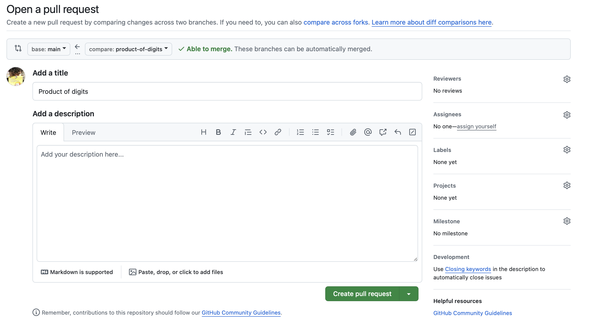

توی این‌جا، می‌تونید یک اسم و توضیحات مناسب برای pull request تون انتخاب کنید. توی یک شرکت بزرگ، از سمت راست می‌تونید reviewer ها (مثلا رئیستون)، assignees (مثلا همکارهاتون) و سایر چیزها رو هم انتخاب کنید. نهایتا، دکمهٔ Create pull request رو بزنید:

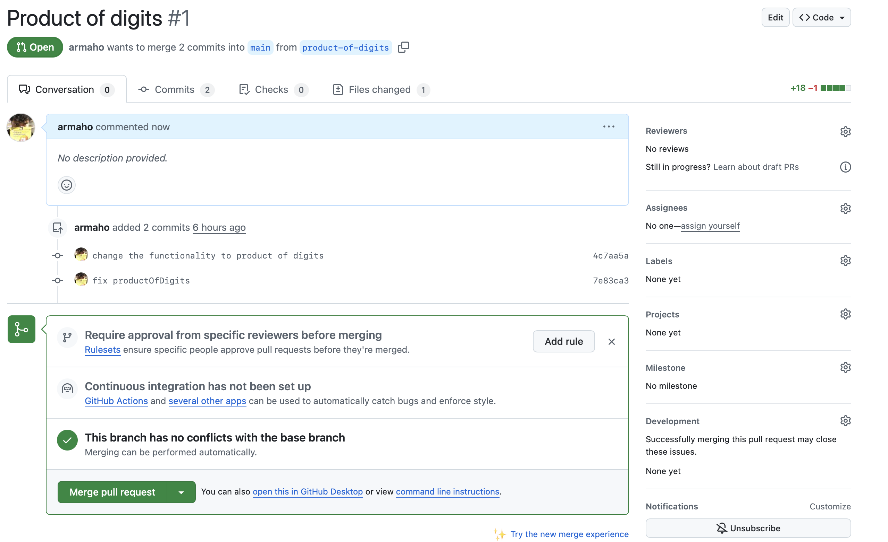

توی این صفحه، یه سر به تب‌های commits و files changed بزنید، چه چیزایی می‌بینید؟

بعد از بررسی تغییرات، دکمهٔ Merge pull request رو بزنید و مرج رو با کامنتی مناسب تایید کنید. بعد از این کار، اولین pull request تون رو انجام دادین و تغییرات توی `main` مرج شدن. چون برنچ `product-of-digits` دیگه به دردی نمی‌خوره، گیت‌هاب بهتون پیشنهاد می‌ده که اون رو پاک کنید:


اگر دوست داشتید، بکنید! حالا اگر توی گیت‌هاب به برنچ `main` برید، می‌بینید که تغییرات جدید توی اون اعمال شده.

## دستور pull

به دو صفحهٔ IntelliJ که کنار هم داشتین برگردین و خودتون رو جای `jack` بذارین. برنچ `main` رو checkout کنید. می‌بینید که `main` هنوز قدیمیه و تغییرات برنچ `product-of-digits` رو نداره. چطور می‌تونید اون رو آپدیت کنید و تغییرات برنچ `main` توی origin رو بگیرین؟

شما با استفاده از `git pull`، می‌تونید دقیقا همین‌کار رو بکنید! این دستور ظاهرش شبیه دستور `push` ‍ه. اون رو اجرا کنید:

```bash
$ git pull origin main  
  
From https://github.com/armaho/git-sample  
 * branch            main       -> FETCH_HEAD  
Updating 260148f..a610e32  
Fast-forward  
 src/Main.java | 19 ++++++++++++++++++-  
 1 file changed, 18 insertions(+), 1 deletion(-)
```

بعدش فایل `Main.java` رو چک کنید تا ببینید که آپدیت شده.

یک خطای رایج

حالا، به intelliJای که برای تایلر درست کردین یه سر بزنید. الآن، به عنوان تایلر، خط زیر رو توی جای مناسبی از برنامه‌تون اضافه کنید تا قبل شروع کار، به کاربر سلام بده:

```java
System.out.println("Hello there!");
```

تغییراتتون رو روی `main` کامیت کنید (شما می‌دونید که نباید این کار رو بکنید، ولی تایلر به دلایل آموزشی نمی‌دونه!). بعد از این کار، تلاش کنید تا با استفاده از دستور `pull`، تغییرات برنچ `main` رو توی `origin` دریافت کنید:

```bash
$ git pull origin main  
  
From https://github.com/armaho/git-sample  
 * branch            main       -> FETCH_HEAD  
hint: You have divergent branches and need to specify how to reconcile them.  
hint: You can do so by running one of the following commands sometime before  
hint: your next pull:  
hint:  
hint:   git config pull.rebase false  # merge  
hint:   git config pull.rebase true   # rebase  
hint:   git config pull.ff only       # fast-forward only  
hint:  
hint: You can replace "git config" with "git config --global" to set a default  
hint: preference for all repositories. You can also pass --rebase, --no-rebase,  
hint: or --ff-only on the command line to override the configured default per  
hint: invocation.  
fatal: Need to specify how to reconcile divergent branches.
```

می‌بینید که نمی‌شه این کار رو کرد و از `fatal` ای که ته خروجی می‌بینید، می‌شه فهمید که خطا خوردین! بیاین مثل همیشه، با هم متن خطا رو بخونیم. گیت به شما می‌گه که:

```
"You have divergent branches…"
```

منظورش اینه که برنچ `main` ای که توی ریپوی `local` تایلره، یه سری کامیت جدید برای خودش داره، و برنچ `main` ای که توی `origin` هست هم یک سری کامیت جدید برای خودش، به همین خاطر این دو برنچ divergent (واگرا) شدن و گیت نمی‌دونه که کدوم `main`، درسته!

گیت در ادامه بهتون می‌گه که:

```
"… and need to specify how to reconcile them. You can do so by running one of the following commands sometime before your next pull "
```

گیت ازتون می‌خواد که یه شیوه براش مشخص کنید که بدونه چطور باید با برنچ‌های divergent برخورد کنه. در ادامه بهتون یه سری دستور می‌ده که با اجرا کردن اون‌ها، می‌تونید این شیوه رو مشخص کنید. اگر دقت کنید، دستور اول به گیت می‌گه که تلاش کنه تا دو برنچ divergent رو merge کنه:

```bash
$ git config pull.rebase false # merge
```

شما هم با اجرای این دستور، این شیوه رو برای گیت مشخص کنید. توی `pull` بعدی، می‌تونید ببینید که گیت، تغییرات برنچ‌های `main` تایلر و `origin/main` رو مرج می‌کنه. `pull` کنید تا این موفقیت رو ببینید. دقت کنید که چون شما برای `pull` کردن، برنچ `origin/main` و `main` رو مرج می‌کنید، ممکنه که این‌جا هم به merge conflict بخورین و مجبور شین مثل قبل اون‌ها رو برطرف کنید.

## منابع بیشتر

اگر هر جایی از مباحثی که توی این داک گفته شد رو به خوبی متوجه نشدین، می‌تونین از منبعی که خیلی‌ها با اون git رو یاد گرفتن، یعنی [دورهٔ جادی توی فرادرس](https://faradars.org/courses/fvgit9609-git-github-gitlab) اون رو دوباره بخونین.


همچنین، اگر خیلی حس شجاعت می‌کنین، می‌تونین یه نگاه به [داک رسمی گیت](https://git-scm.com/doc) هم بندازین!

## چه چیزی یاد گرفتیم؟

ما توی این داک، یه دور به شما یاد دادیم که چطور می‌تونید از گیت استفاده کنید. این مهارت، هم توی کار‌ آینده‌تون و هم توی ادامهٔ دانشگاه‌ خیلی به دردتون می‌خوره، چون حدودا همهٔ شرکتا از git برای هماهنگ کردن پروژه‌هاشون استفاده می‌کنن. شما یاد گرفتین که:

- گیت چیه، و اصلاً Version Control به چه دردی می‌خوره.
- دستورهایی مثل stage و commit کردن یعنی چی و چطور می‌شه باهاشون کار کرد.
- برنچ‌ها چی‌ان و کجا به درد می‌خورن.
- مرج کردن به چه مفهومه و چطور می‌شه conflict ها رو رفع کرد.
- چطور می‌شه با یک remote repository کار کرد.

کار کردن با گیت، در ابتدا ممکنه برای شما یه خورده پر فراز و نشیب باشه. حتما توی گوگل سرچ کنید راجع به مشکلاتی که بهشون برمی‌خورین، از تدریس‌یارهاتون بپرسین یا از ChatGPT بخواین که مشکل رو بهتون توضیح بده.